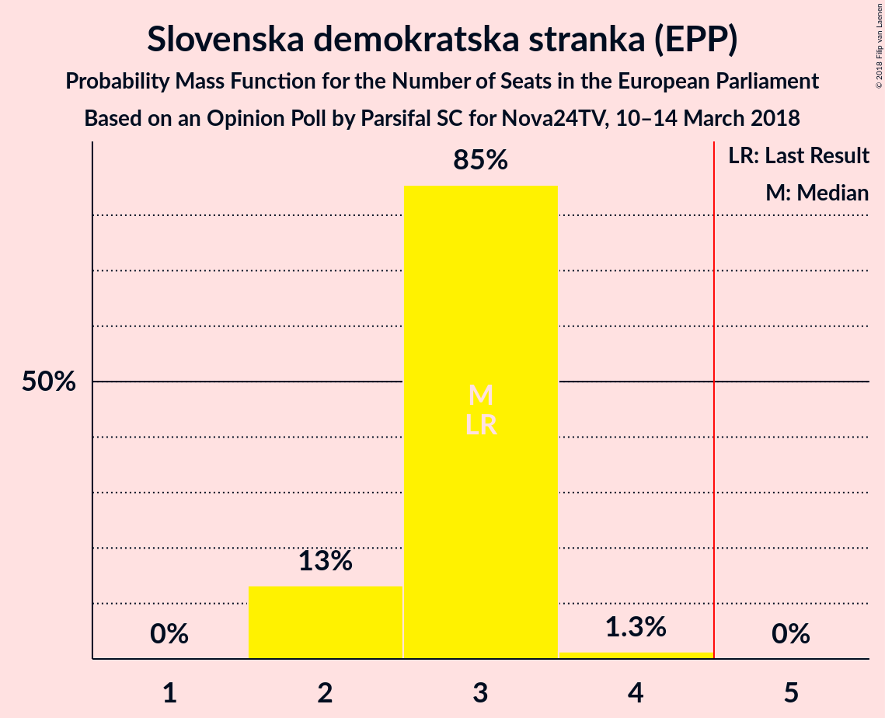
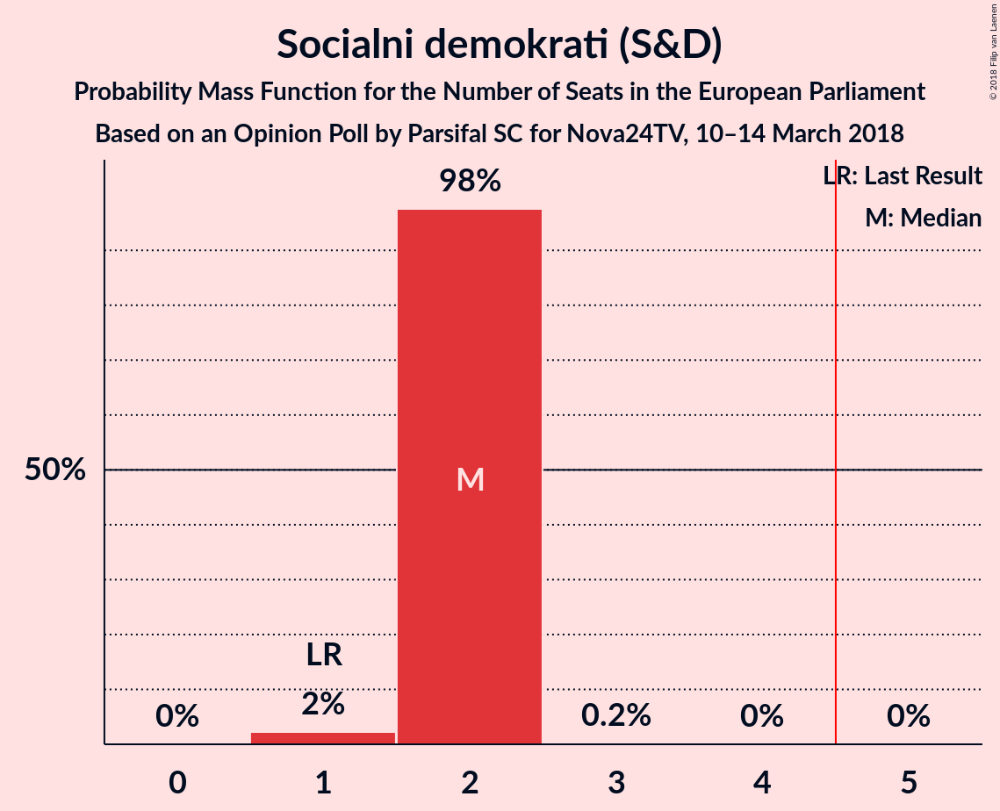
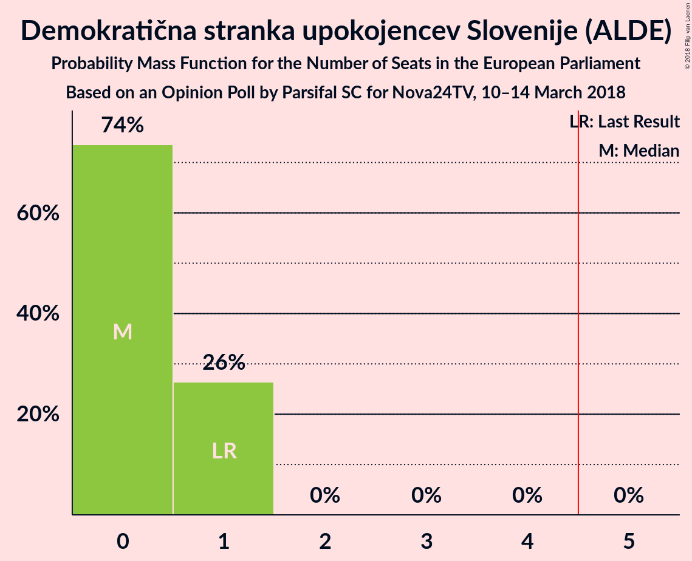
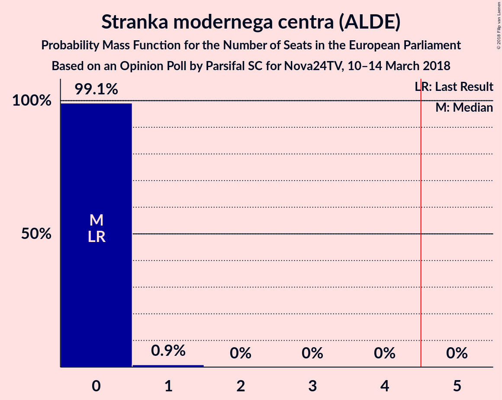
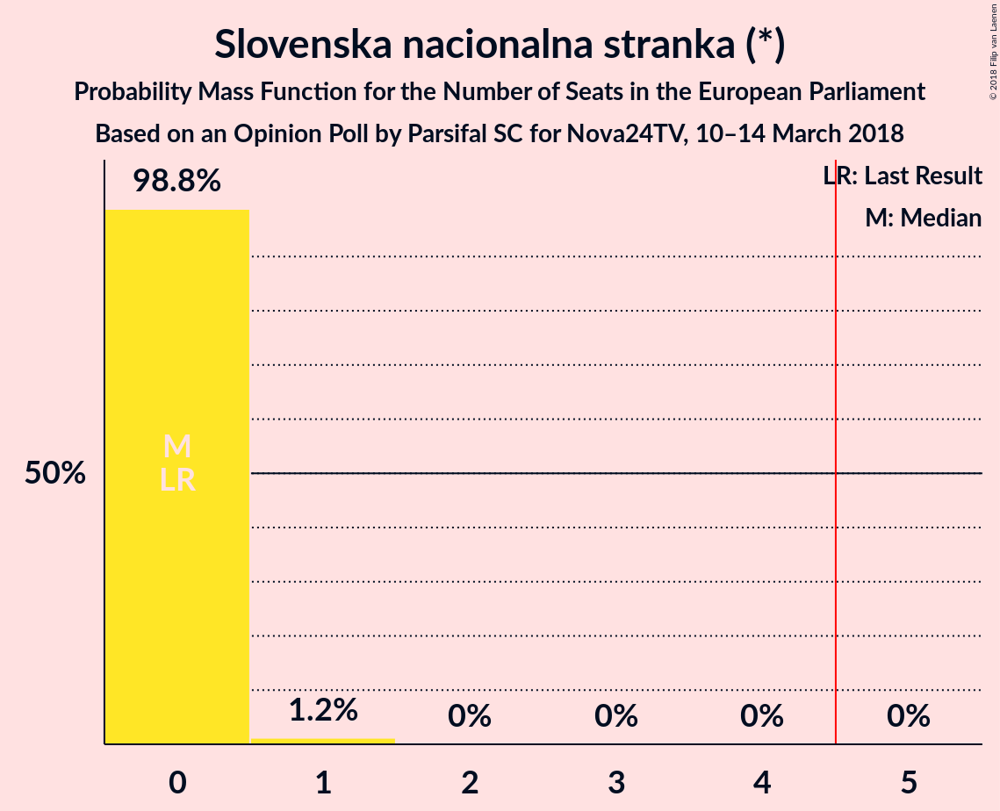
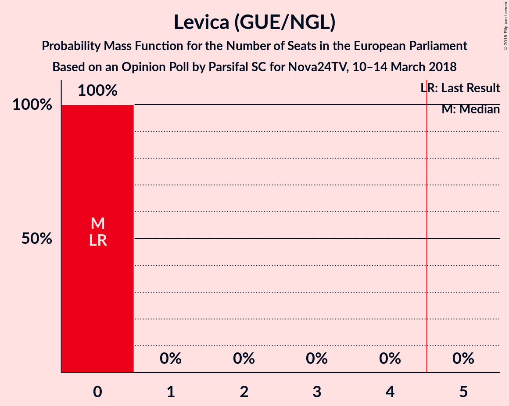
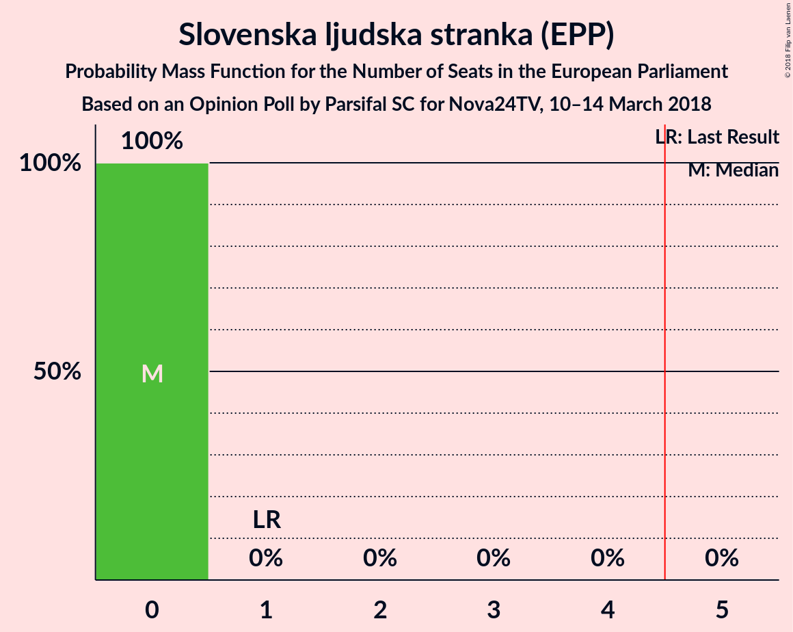
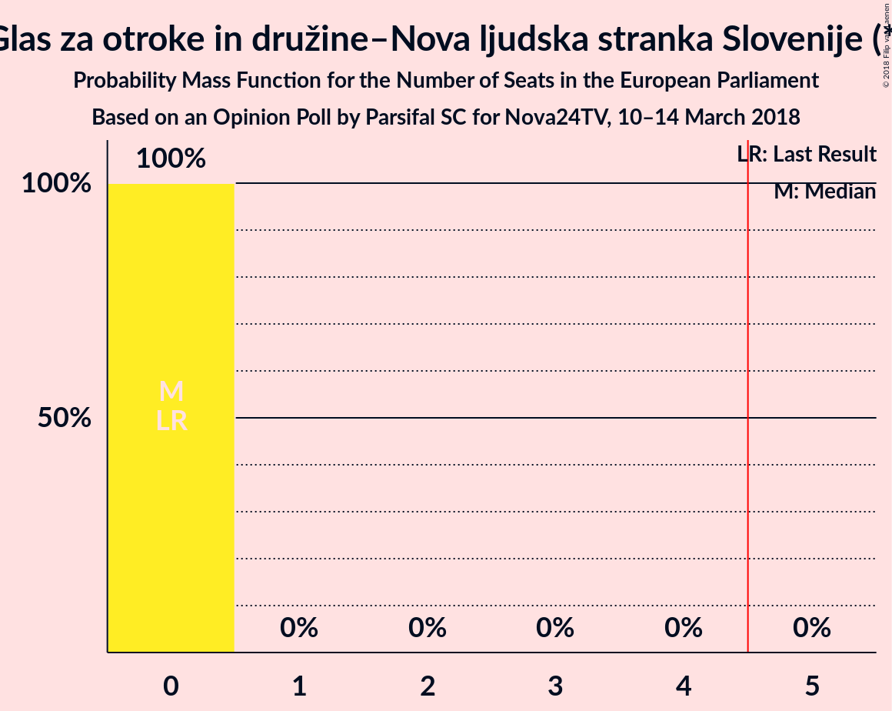
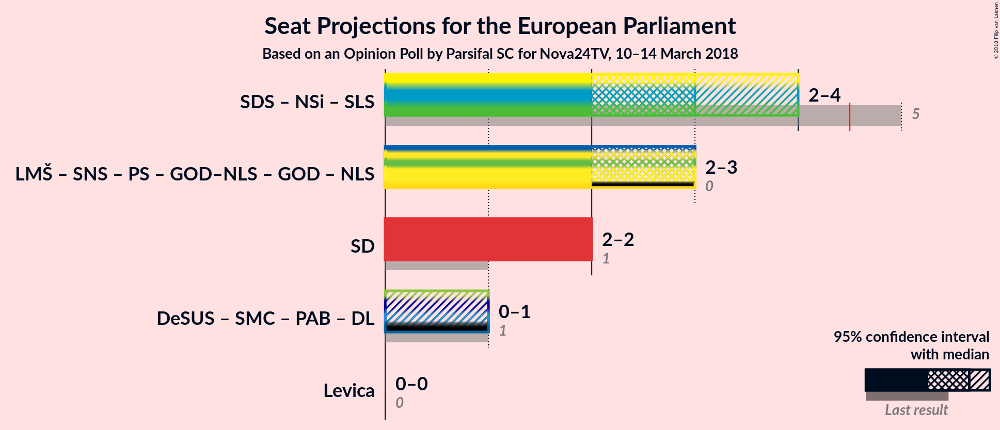

# Opinion Poll by Parsifal SC for Nova24TV, 10–14 March 2018

<a href="#voting-intentions">Voting Intentions</a> | <a href="#seats">Seats</a> | <a href="#coalitions">Coalitions</a> | <a href="#technical-information">Technical Information</a>

## Voting Intentions

### Confidence Intervals

| Party | Last Result | Poll Result | 80% Confidence Interval | 90% Confidence Interval | 95% Confidence Interval | 99% Confidence Interval |
|:-----:|:-----------:|:-----------:|:-----------------------:|:-----------------------:|:-----------------------:|:-----------------------:|
| Slovenska demokratska stranka (EPP) | 24.8% | 23.3% | 21.5–25.4% |21.0–25.9% |20.5–26.4% |19.6–27.4% |
| Lista Marjana Šarca (*) | 0.0% | 20.9% | 19.1–22.9% |18.6–23.4% |18.2–23.9% |17.4–24.9% |
| Socialni demokrati (S&D) | 8.1% | 16.5% | 14.9–18.3% |14.4–18.8% |14.0–19.2% |13.3–20.1% |
| Nova Slovenija–Krščanski demokrati (EPP) | 16.5% | 6.8% | 5.7–8.0% |5.4–8.4% |5.2–8.7% |4.8–9.4% |
| Demokratična stranka upokojencev Slovenije (ALDE) | 8.2% | 6.2% | 5.3–7.5% |5.0–7.9% |4.8–8.2% |4.3–8.8% |
| Stranka modernega centra (ALDE) | 0.0% | 5.2% | 4.3–6.4% |4.1–6.7% |3.9–7.0% |3.5–7.6% |
| Slovenska nacionalna stranka (*) | 4.0% | 5.2% | 4.3–6.4% |4.1–6.7% |3.9–7.0% |3.5–7.6% |
| Levica (GUE/NGL) | 5.5% | 4.1% | 3.3–5.1% |3.1–5.4% |2.9–5.7% |2.6–6.3% |
| Slovenska ljudska stranka (EPP) | 16.5% | 2.8% | 2.2–3.7% |2.0–4.0% |1.9–4.2% |1.6–4.7% |
| Stranka Alenke Bratušek (ALDE) | 0.0% | 1.5% | 1.1–2.3% |1.0–2.5% |0.9–2.7% |0.7–3.1% |
| Pozitivna Slovenija (*) | 6.6% | 0.9% | 0.6–1.5% |0.5–1.7% |0.4–1.8% |0.3–2.2% |
| Glas za otroke in družine–Nova ljudska stranka Slovenije (*) | 0.0% | 0.6% | 0.4–1.2% |0.3–1.3% |0.3–1.5% |0.2–1.8% |

*Note:* The poll result column reflects the actual value used in the calculations. Published results may vary slightly, and in addition be rounded to fewer digits.

## Seats

### Confidence Intervals

| Party | Last Result | Median | 80% Confidence Interval | 90% Confidence Interval | 95% Confidence Interval | 99% Confidence Interval |
|:-----:|:-----------:|:------:|:-----------------------:|:-----------------------:|:-----------------------:|:-----------------------:|
| <a href="#slovenska-demokratska-stranka-(epp)">Slovenska demokratska stranka (EPP)</a> | 3 | 3 | 3 |3 |2–3 |2–3 |
| <a href="#lista-marjana-Šarca-(*)">Lista Marjana Šarca (*)</a> | 0 | 3 | 3 |3 |2–3 |2–3 |
| <a href="#socialni-demokrati-(s&d)">Socialni demokrati (S&D)</a> | 1 | 2 | 2 |2 |2 |1–2 |
| <a href="#nova-slovenija–krščanski-demokrati-(epp)">Nova Slovenija–Krščanski demokrati (EPP)</a> | 1 | 0 | 0 |0 |0–1 |0–1 |
| <a href="#demokratična-stranka-upokojencev-slovenije-(alde)">Demokratična stranka upokojencev Slovenije (ALDE)</a> | 1 | 0 | 0 |0 |0 |0–1 |
| <a href="#stranka-modernega-centra-(alde)">Stranka modernega centra (ALDE)</a> | 0 | 0 | 0 |0 |0 |0 |
| <a href="#slovenska-nacionalna-stranka-(*)">Slovenska nacionalna stranka (*)</a> | 0 | 0 | 0 |0 |0 |0 |
| <a href="#levica-(gue/ngl)">Levica (GUE/NGL)</a> | 0 | 0 | 0 |0 |0 |0 |
| <a href="#slovenska-ljudska-stranka-(epp)">Slovenska ljudska stranka (EPP)</a> | 1 | 0 | 0 |0 |0 |0 |
| <a href="#stranka-alenke-bratušek-(alde)">Stranka Alenke Bratušek (ALDE)</a> | 0 | 0 | 0 |0 |0 |0 |
| <a href="#pozitivna-slovenija-(*)">Pozitivna Slovenija (*)</a> | 0 | 0 | 0 |0 |0 |0 |
| <a href="#glas-za-otroke-in-družine–nova-ljudska-stranka-slovenije-(*)">Glas za otroke in družine–Nova ljudska stranka Slovenije (*)</a> | 0 | 0 | 0 |0 |0 |0 |

### Slovenska demokratska stranka (EPP)

*For a full overview of the results for this party, see the [Slovenska demokratska stranka (EPP)](party-slovenskademokratskastrankaepp.html) page.*

| Number of Seats | Probability | Accumulated | Special Marks |
|:---------------:|:-----------:|:-----------:|:-------------:|
| 2 | 4% | 100% |  |
| 3 | 96% | 96% | Last Result, Median |
| 4 | 0% | 0% |  |

### Lista Marjana Šarca (*)

*For a full overview of the results for this party, see the [Lista Marjana Šarca (*)](party-listamarjanaŠarca.html) page.*

| Number of Seats | Probability | Accumulated | Special Marks |
|:---------------:|:-----------:|:-----------:|:-------------:|
| 0 | 0% | 100% | Last Result |
| 1 | 0% | 100% |  |
| 2 | 3% | 100% |  |
| 3 | 97% | 97% | Median |
| 4 | 0% | 0% |  |

### Socialni demokrati (S&D)

*For a full overview of the results for this party, see the [Socialni demokrati (S&D)](party-socialnidemokratisd.html) page.*

| Number of Seats | Probability | Accumulated | Special Marks |
|:---------------:|:-----------:|:-----------:|:-------------:|
| 1 | 0.8% | 100% | Last Result |
| 2 | 99.2% | 99.2% | Median |
| 3 | 0% | 0% |  |

### Nova Slovenija–Krščanski demokrati (EPP)

*For a full overview of the results for this party, see the [Nova Slovenija–Krščanski demokrati (EPP)](party-novaslovenija–krščanskidemokratiepp.html) page.*

| Number of Seats | Probability | Accumulated | Special Marks |
|:---------------:|:-----------:|:-----------:|:-------------:|
| 0 | 95% | 100% | Median |
| 1 | 5% | 5% | Last Result |
| 2 | 0% | 0% |  |

### Demokratična stranka upokojencev Slovenije (ALDE)

*For a full overview of the results for this party, see the [Demokratična stranka upokojencev Slovenije (ALDE)](party-demokratičnastrankaupokojencevslovenijealde.html) page.*

| Number of Seats | Probability | Accumulated | Special Marks |
|:---------------:|:-----------:|:-----------:|:-------------:|
| 0 | 98.7% | 100% | Median |
| 1 | 1.3% | 1.3% | Last Result |
| 2 | 0% | 0% |  |

### Stranka modernega centra (ALDE)

*For a full overview of the results for this party, see the [Stranka modernega centra (ALDE)](party-strankamodernegacentraalde.html) page.*

| Number of Seats | Probability | Accumulated | Special Marks |
|:---------------:|:-----------:|:-----------:|:-------------:|
| 0 | 99.9% | 100% | Last Result, Median |
| 1 | 0.1% | 0.1% |  |
| 2 | 0% | 0% |  |

### Slovenska nacionalna stranka (*)

*For a full overview of the results for this party, see the [Slovenska nacionalna stranka (*)](party-slovenskanacionalnastranka.html) page.*

| Number of Seats | Probability | Accumulated | Special Marks |
|:---------------:|:-----------:|:-----------:|:-------------:|
| 0 | 99.9% | 100% | Last Result, Median |
| 1 | 0.1% | 0.1% |  |
| 2 | 0% | 0% |  |

### Levica (GUE/NGL)

*For a full overview of the results for this party, see the [Levica (GUE/NGL)](party-levicaguengl.html) page.*

| Number of Seats | Probability | Accumulated | Special Marks |
|:---------------:|:-----------:|:-----------:|:-------------:|
| 0 | 100% | 100% | Last Result, Median |

### Slovenska ljudska stranka (EPP)

*For a full overview of the results for this party, see the [Slovenska ljudska stranka (EPP)](party-slovenskaljudskastrankaepp.html) page.*

| Number of Seats | Probability | Accumulated | Special Marks |
|:---------------:|:-----------:|:-----------:|:-------------:|
| 0 | 100% | 100% | Median |
| 1 | 0% | 0% | Last Result |

### Stranka Alenke Bratušek (ALDE)

*For a full overview of the results for this party, see the [Stranka Alenke Bratušek (ALDE)](party-strankaalenkebratušekalde.html) page.*

| Number of Seats | Probability | Accumulated | Special Marks |
|:---------------:|:-----------:|:-----------:|:-------------:|
| 0 | 100% | 100% | Last Result, Median |

### Pozitivna Slovenija (*)

*For a full overview of the results for this party, see the [Pozitivna Slovenija (*)](party-pozitivnaslovenija.html) page.*

| Number of Seats | Probability | Accumulated | Special Marks |
|:---------------:|:-----------:|:-----------:|:-------------:|
| 0 | 100% | 100% | Last Result, Median |

### Glas za otroke in družine–Nova ljudska stranka Slovenije (*)

*For a full overview of the results for this party, see the [Glas za otroke in družine–Nova ljudska stranka Slovenije (*)](party-glaszaotrokeindružine–novaljudskastrankaslovenije.html) page.*

| Number of Seats | Probability | Accumulated | Special Marks |
|:---------------:|:-----------:|:-----------:|:-------------:|
| 0 | 100% | 100% | Last Result, Median |

## Coalitions

### Confidence Intervals

| Coalition | Last Result | Median | Majority? | 80% Confidence Interval | 90% Confidence Interval | 95% Confidence Interval | 99% Confidence Interval |
|:---------:|:-----------:|:------:|:---------:|:-----------------------:|:-----------------------:|:-----------------------:|:-----------------------:|
| Slovenska demokratska stranka (EPP) – Nova Slovenija–Krščanski demokrati (EPP) – Slovenska ljudska stranka (EPP) | 5 | 3 | 0% | 3 | 3 | 3 | 3–4 |
| Socialni demokrati (S&D) | 1 | 2 | 0% | 2 | 2 | 2 | 1–2 |
| Levica (GUE/NGL) | 0 | 0 | 0% | 0 | 0 | 0 | 0 |

### Slovenska demokratska stranka (EPP) – Nova Slovenija–Krščanski demokrati (EPP) – Slovenska ljudska stranka (EPP)

| Number of Seats | Probability | Accumulated | Special Marks |
|:---------------:|:-----------:|:-----------:|:-------------:|
| 2 | 0.1% | 100% |  |
| 3 | 98.9% | 99.9% | Median |
| 4 | 1.0% | 1.0% |  |
| 5 | 0% | 0% | Last Result, Majority |

### Socialni demokrati (S&D)

| Number of Seats | Probability | Accumulated | Special Marks |
|:---------------:|:-----------:|:-----------:|:-------------:|
| 1 | 0.8% | 100% | Last Result |
| 2 | 99.2% | 99.2% | Median |
| 3 | 0% | 0% |  |

### Levica (GUE/NGL)

| Number of Seats | Probability | Accumulated | Special Marks |
|:---------------:|:-----------:|:-----------:|:-------------:|
| 0 | 100% | 100% | Last Result, Median |

## Technical Information

### Opinion Poll

+ **Polling firm:** Parsifal SC
+ **Commissioner(s):** Nova24TV
+ **Fieldwork period:** 10–14 March 2018

### Calculations

+ **Sample size:** 784
+ **Simulations done:** 131,072
+ **Error estimate:** 3.72%

