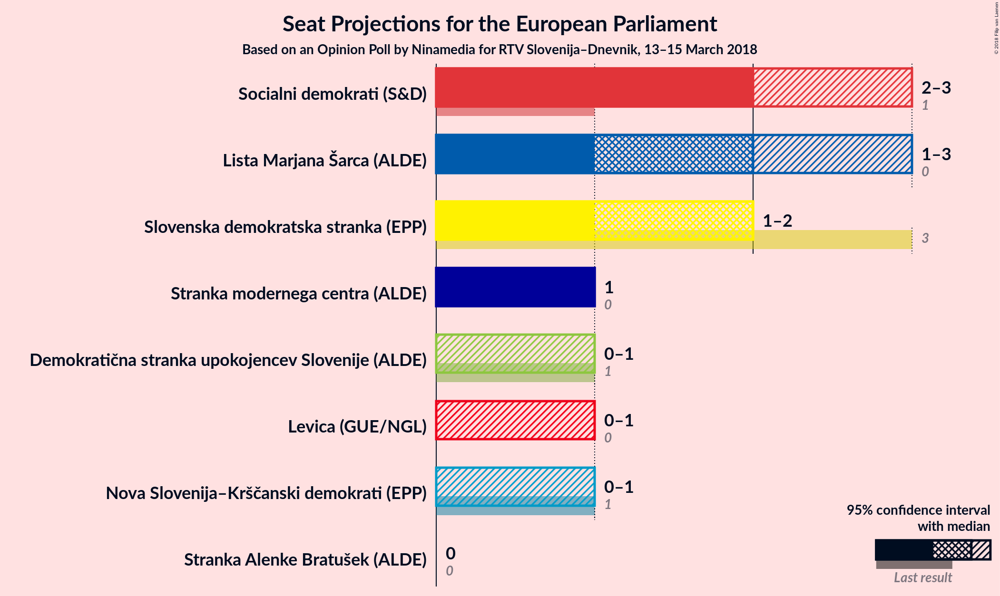
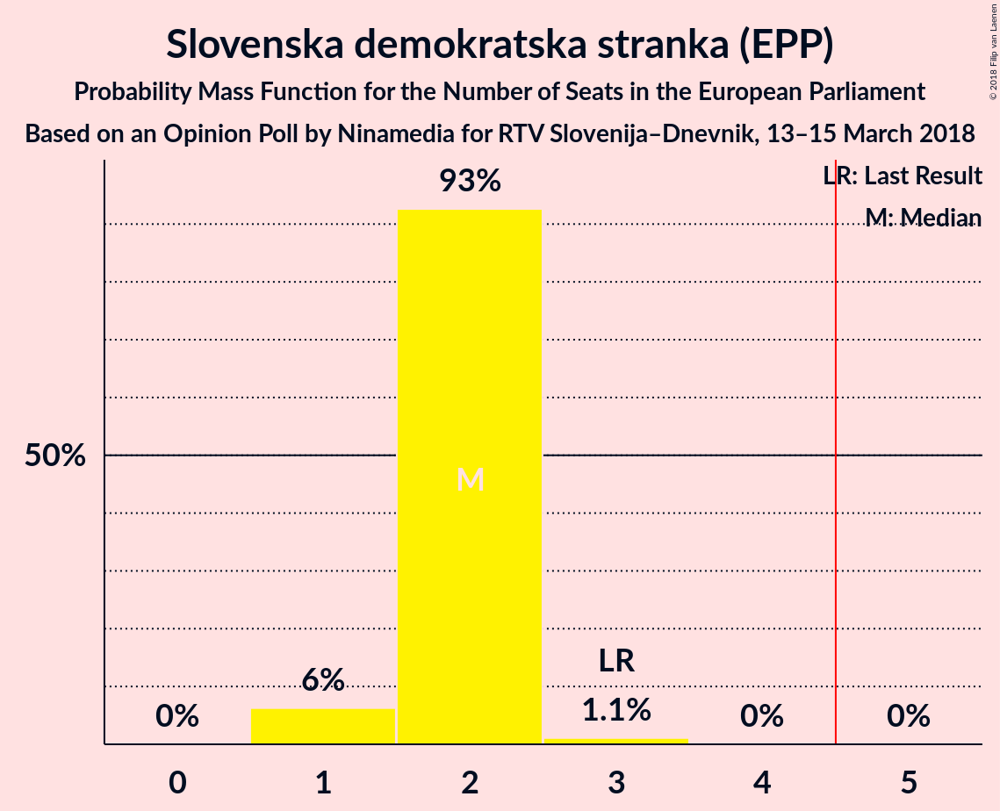
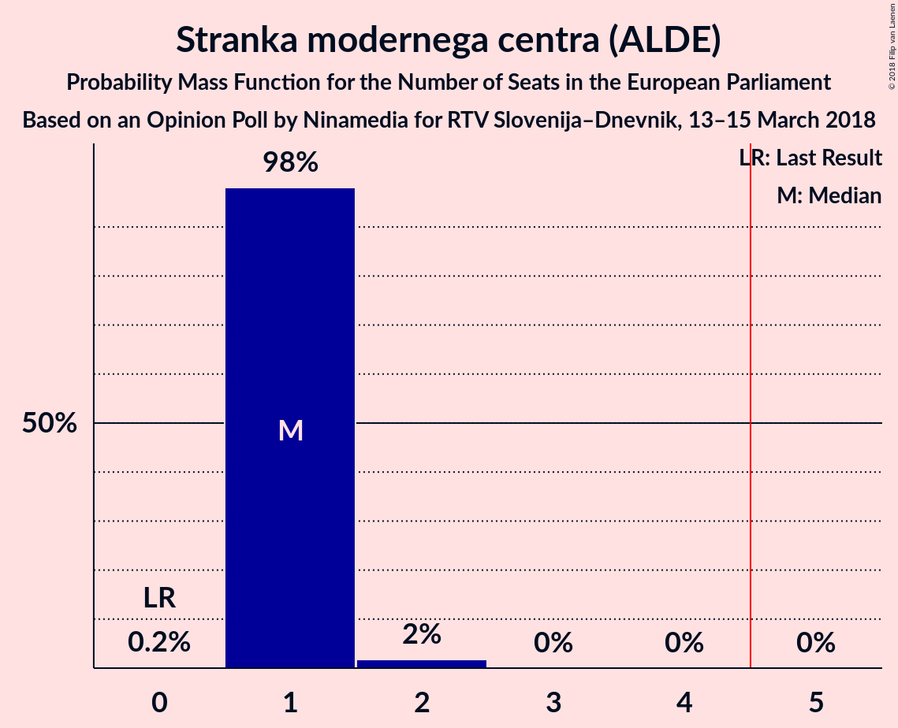
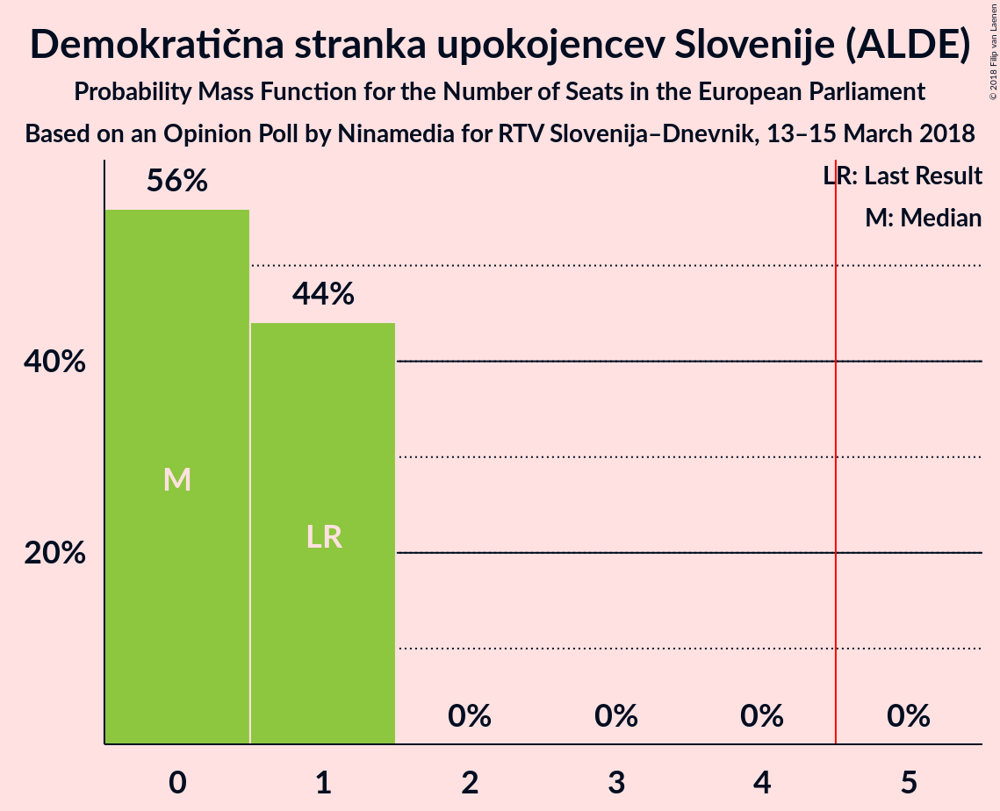
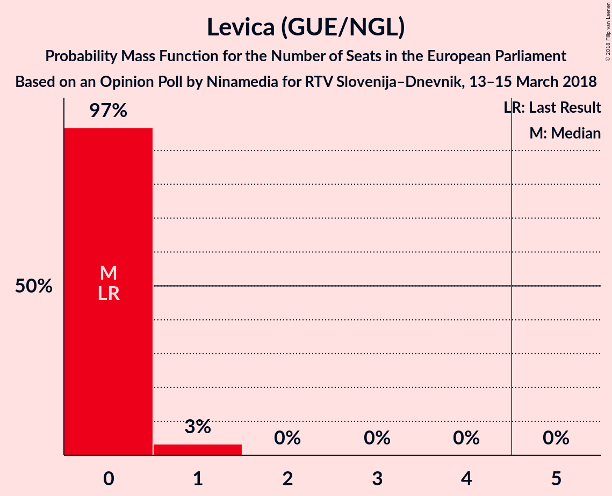
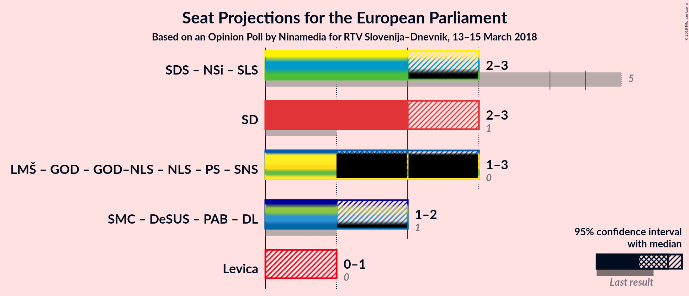

# Opinion Poll by Ninamedia for RTV Slovenija–Dnevnik, 13–15 March 2018

<a href="#voting-intentions">Voting Intentions</a> | <a href="#seats">Seats</a> | <a href="#coalitions">Coalitions</a> | <a href="#technical-information">Technical Information</a>

## Voting Intentions

### Confidence Intervals

| Party | Last Result | Poll Result | 80% Confidence Interval | 90% Confidence Interval | 95% Confidence Interval | 99% Confidence Interval |
|:-----:|:-----------:|:-----------:|:-----------------------:|:-----------------------:|:-----------------------:|:-----------------------:|
| Socialni demokrati (S&D) | 8.1% | 20.8% | 18.4–23.5% |17.8–24.2% |17.2–24.9% |16.1–26.2% |
| Lista Marjana Šarca (*) | 0.0% | 20.3% | 18.0–23.0% |17.3–23.7% |16.8–24.4% |15.7–25.7% |
| Slovenska demokratska stranka (EPP) | 24.8% | 19.2% | 16.9–21.8% |16.2–22.5% |15.7–23.2% |14.7–24.5% |
| Stranka modernega centra (ALDE) | 0.0% | 12.4% | 10.5–14.6% |10.0–15.3% |9.6–15.9% |8.8–17.0% |
| Nova Slovenija–Krščanski demokrati (EPP) | 16.5% | 7.9% | 6.5–9.9% |6.1–10.4% |5.7–10.9% |5.1–11.9% |
| Demokratična stranka upokojencev Slovenije (ALDE) | 8.2% | 7.9% | 6.5–9.9% |6.1–10.4% |5.7–10.9% |5.1–11.9% |
| Levica (GUE/NGL) | 5.5% | 5.8% | 4.6–7.6% |4.3–8.0% |4.0–8.5% |3.5–9.4% |
| Stranka Alenke Bratušek (ALDE) | 0.0% | 0.2% | 0.1–0.9% |0.1–1.1% |0.0–1.3% |0.0–1.7% |

*Note:* The poll result column reflects the actual value used in the calculations. Published results may vary slightly, and in addition be rounded to fewer digits.

## Seats

### Confidence Intervals

| Party | Last Result | Median | 80% Confidence Interval | 90% Confidence Interval | 95% Confidence Interval | 99% Confidence Interval |
|:-----:|:-----------:|:------:|:-----------------------:|:-----------------------:|:-----------------------:|:-----------------------:|
| <a href="#socialni-demokrati-(s&d)">Socialni demokrati (S&D)</a> | 1 | 2 | 2 |2–3 |2–3 |1–3 |
| <a href="#lista-marjana-šarca-(*)">Lista Marjana Šarca (*)</a> | 0 | 2 | 2 |2 |1–3 |1–3 |
| <a href="#slovenska-demokratska-stranka-(epp)">Slovenska demokratska stranka (EPP)</a> | 3 | 2 | 2 |1–2 |1–2 |1–3 |
| <a href="#stranka-modernega-centra-(alde)">Stranka modernega centra (ALDE)</a> | 0 | 1 | 1 |1 |1 |1–2 |
| <a href="#nova-slovenija–krščanski-demokrati-(epp)">Nova Slovenija–Krščanski demokrati (EPP)</a> | 1 | 0 | 0–1 |0–1 |0–1 |0–1 |
| <a href="#demokratična-stranka-upokojencev-slovenije-(alde)">Demokratična stranka upokojencev Slovenije (ALDE)</a> | 1 | 0 | 0–1 |0–1 |0–1 |0–1 |
| <a href="#levica-(gue/ngl)">Levica (GUE/NGL)</a> | 0 | 0 | 0 |0 |0–1 |0–1 |
| <a href="#stranka-alenke-bratušek-(alde)">Stranka Alenke Bratušek (ALDE)</a> | 0 | 0 | 0 |0 |0 |0 |

### Socialni demokrati (S&D)

*For a full overview of the results for this party, see the [Socialni demokrati (S&D)](party-socialnidemokratisd.html) page.*

| Number of Seats | Probability | Accumulated | Special Marks |
|:---------------:|:-----------:|:-----------:|:-------------:|
| 1 | 1.4% | 100% | Last Result |
| 2 | 93% | 98.6% | Median |
| 3 | 5% | 5% |  |
| 4 | 0% | 0% |  |

### Lista Marjana Šarca (*)

*For a full overview of the results for this party, see the [Lista Marjana Šarca (*)](party-listamarjanašarca.html) page.*

| Number of Seats | Probability | Accumulated | Special Marks |
|:---------------:|:-----------:|:-----------:|:-------------:|
| 0 | 0% | 100% | Last Result |
| 1 | 3% | 100% |  |
| 2 | 93% | 97% | Median |
| 3 | 5% | 5% |  |
| 4 | 0% | 0% |  |

### Slovenska demokratska stranka (EPP)

*For a full overview of the results for this party, see the [Slovenska demokratska stranka (EPP)](party-slovenskademokratskastrankaepp.html) page.*

| Number of Seats | Probability | Accumulated | Special Marks |
|:---------------:|:-----------:|:-----------:|:-------------:|
| 1 | 6% | 100% |  |
| 2 | 93% | 94% | Median |
| 3 | 1.1% | 1.1% | Last Result |
| 4 | 0% | 0% |  |

### Stranka modernega centra (ALDE)

*For a full overview of the results for this party, see the [Stranka modernega centra (ALDE)](party-strankamodernegacentraalde.html) page.*

| Number of Seats | Probability | Accumulated | Special Marks |
|:---------------:|:-----------:|:-----------:|:-------------:|
| 0 | 0.2% | 100% | Last Result |
| 1 | 98% | 99.8% | Median |
| 2 | 2% | 2% |  |
| 3 | 0% | 0% |  |

### Nova Slovenija–Krščanski demokrati (EPP)

*For a full overview of the results for this party, see the [Nova Slovenija–Krščanski demokrati (EPP)](party-novaslovenija–krščanskidemokratiepp.html) page.*

| Number of Seats | Probability | Accumulated | Special Marks |
|:---------------:|:-----------:|:-----------:|:-------------:|
| 0 | 52% | 100% | Median |
| 1 | 48% | 48% | Last Result |
| 2 | 0% | 0% |  |

### Demokratična stranka upokojencev Slovenije (ALDE)

*For a full overview of the results for this party, see the [Demokratična stranka upokojencev Slovenije (ALDE)](party-demokratičnastrankaupokojencevslovenijealde.html) page.*

| Number of Seats | Probability | Accumulated | Special Marks |
|:---------------:|:-----------:|:-----------:|:-------------:|
| 0 | 56% | 100% | Median |
| 1 | 44% | 44% | Last Result |
| 2 | 0% | 0% |  |

### Levica (GUE/NGL)

*For a full overview of the results for this party, see the [Levica (GUE/NGL)](party-levicaguengl.html) page.*

| Number of Seats | Probability | Accumulated | Special Marks |
|:---------------:|:-----------:|:-----------:|:-------------:|
| 0 | 97% | 100% | Last Result, Median |
| 1 | 3% | 3% |  |
| 2 | 0% | 0% |  |

### Stranka Alenke Bratušek (ALDE)

*For a full overview of the results for this party, see the [Stranka Alenke Bratušek (ALDE)](party-strankaalenkebratušekalde.html) page.*

| Number of Seats | Probability | Accumulated | Special Marks |
|:---------------:|:-----------:|:-----------:|:-------------:|
| 0 | 100% | 100% | Last Result, Median |

## Coalitions

### Confidence Intervals

| Coalition | Last Result | Median | Majority? | 80% Confidence Interval | 90% Confidence Interval | 95% Confidence Interval | 99% Confidence Interval |
|:---------:|:-----------:|:------:|:---------:|:-----------------------:|:-----------------------:|:-----------------------:|:-----------------------:|
| Socialni demokrati (S&D) | 1 | 2 | 0% | 2 | 2–3 | 2–3 | 1–3 |
| Levica (GUE/NGL) | 0 | 0 | 0% | 0 | 0 | 0–1 | 0–1 |

### Socialni demokrati (S&D)

| Number of Seats | Probability | Accumulated | Special Marks |
|:---------------:|:-----------:|:-----------:|:-------------:|
| 1 | 1.4% | 100% | Last Result |
| 2 | 93% | 98.6% | Median |
| 3 | 5% | 5% |  |
| 4 | 0% | 0% |  |

### Levica (GUE/NGL)

| Number of Seats | Probability | Accumulated | Special Marks |
|:---------------:|:-----------:|:-----------:|:-------------:|
| 0 | 97% | 100% | Last Result, Median |
| 1 | 3% | 3% |  |
| 2 | 0% | 0% |  |

## Technical Information

### Opinion Poll

+ **Polling firm:** Ninamedia
+ **Commissioner(s):** RTV Slovenija–Dnevnik
+ **Fieldwork period:** 13–15 March 2018

### Calculations

+ **Sample size:** 428
+ **Simulations done:** 1,048,576
+ **Error estimate:** 2.06%

