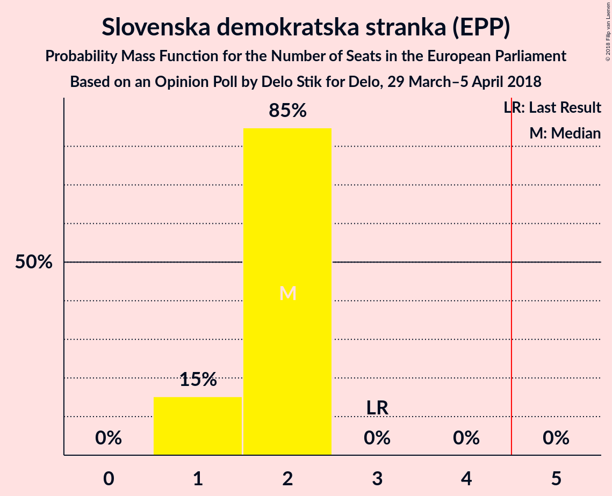
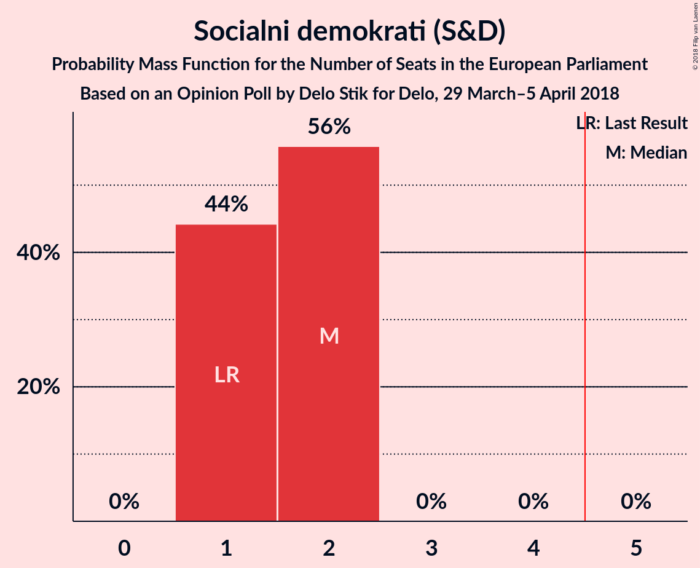
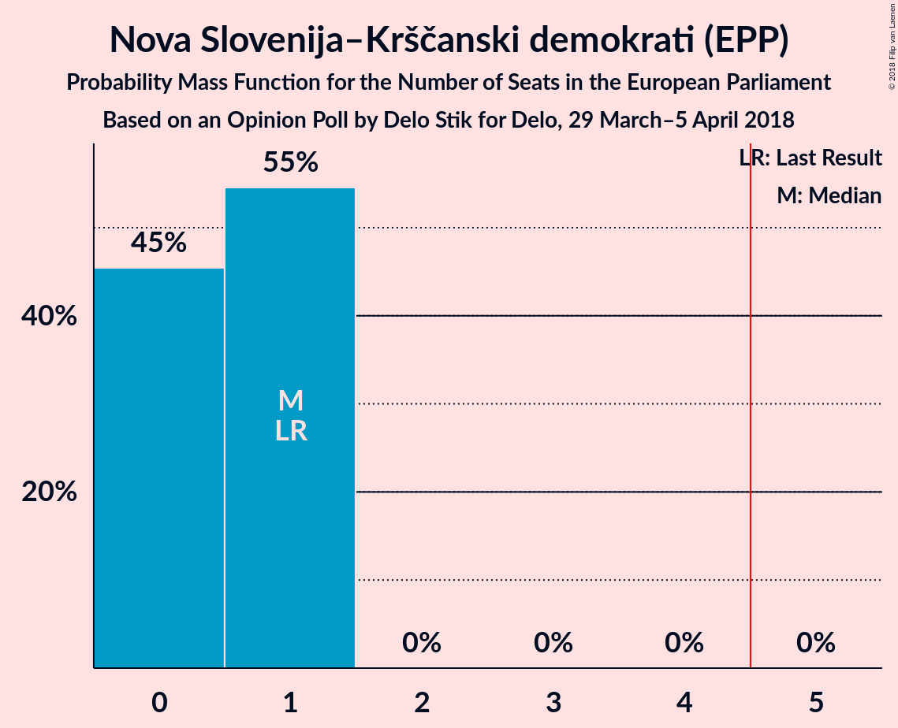
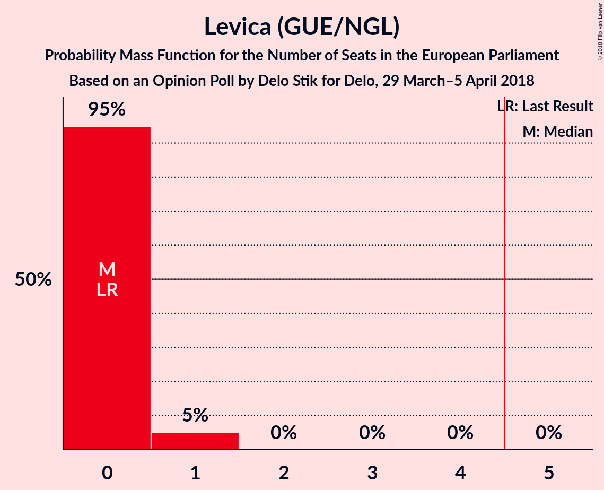
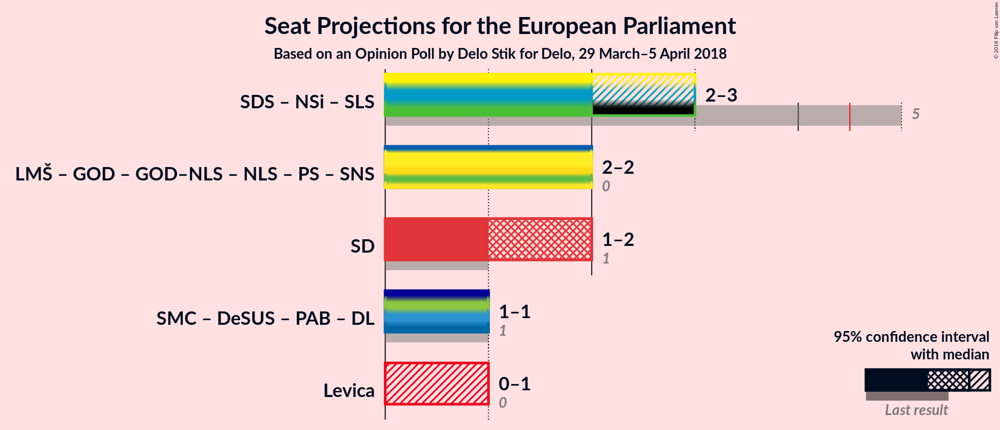

# Opinion Poll by Delo Stik for Delo, 29 March–5 April 2018

<a href="#voting-intentions">Voting Intentions</a> | <a href="#seats">Seats</a> | <a href="#coalitions">Coalitions</a> | <a href="#technical-information">Technical Information</a>

## Voting Intentions

### Confidence Intervals

| Party | Last Result | Poll Result | 80% Confidence Interval | 90% Confidence Interval | 95% Confidence Interval | 99% Confidence Interval |
|:-----:|:-----------:|:-----------:|:-----------------------:|:-----------------------:|:-----------------------:|:-----------------------:|
| Lista Marjana Šarca (*) | 0.0% | 20.8% | 19.1–22.7% |18.6–23.2% |18.1–23.7% |17.3–24.6% |
| Slovenska demokratska stranka (EPP) | 24.8% | 17.5% | 15.9–19.3% |15.5–19.8% |15.1–20.3% |14.3–21.1% |
| Socialni demokrati (S&D) | 8.1% | 16.5% | 15.0–18.3% |14.5–18.8% |14.2–19.2% |13.4–20.1% |
| Stranka modernega centra (ALDE) | 0.0% | 11.6% | 10.3–13.1% |9.9–13.6% |9.6–14.0% |9.0–14.7% |
| Nova Slovenija–Krščanski demokrati (EPP) | 16.5% | 8.3% | 7.2–9.7% |6.9–10.1% |6.6–10.4% |6.1–11.1% |
| Levica (GUE/NGL) | 5.5% | 6.8% | 5.8–8.0% |5.5–8.4% |5.2–8.7% |4.8–9.3% |
| Demokratična stranka upokojencev Slovenije (ALDE) | 8.2% | 4.5% | 3.7–5.5% |3.4–5.8% |3.3–6.1% |2.9–6.7% |
| Stranka Alenke Bratušek (ALDE) | 0.0% | 3.6% | 2.9–4.6% |2.7–4.9% |2.5–5.1% |2.2–5.6% |

*Note:* The poll result column reflects the actual value used in the calculations. Published results may vary slightly, and in addition be rounded to fewer digits.

## Seats

### Confidence Intervals

| Party | Last Result | Median | 80% Confidence Interval | 90% Confidence Interval | 95% Confidence Interval | 99% Confidence Interval |
|:-----:|:-----------:|:------:|:-----------------------:|:-----------------------:|:-----------------------:|:-----------------------:|
| <a href="#lista-marjana-Šarca-(*)">Lista Marjana Šarca (*)</a> | 0 | 2 | 2 |2 |2 |1–3 |
| <a href="#slovenska-demokratska-stranka-(epp)">Slovenska demokratska stranka (EPP)</a> | 3 | 2 | 1–2 |1–2 |1–2 |1–2 |
| <a href="#socialni-demokrati-(s&d)">Socialni demokrati (S&D)</a> | 1 | 2 | 1–2 |1–2 |1–2 |1–2 |
| <a href="#stranka-modernega-centra-(alde)">Stranka modernega centra (ALDE)</a> | 0 | 1 | 1 |1 |1 |1 |
| <a href="#nova-slovenija–krščanski-demokrati-(epp)">Nova Slovenija–Krščanski demokrati (EPP)</a> | 1 | 1 | 0–1 |0–1 |0–1 |0–1 |
| <a href="#levica-(gue/ngl)">Levica (GUE/NGL)</a> | 0 | 0 | 0–1 |0–1 |0–1 |0–1 |
| <a href="#demokratična-stranka-upokojencev-slovenije-(alde)">Demokratična stranka upokojencev Slovenije (ALDE)</a> | 1 | 0 | 0 |0 |0 |0 |
| <a href="#stranka-alenke-bratušek-(alde)">Stranka Alenke Bratušek (ALDE)</a> | 0 | 0 | 0 |0 |0 |0 |

### Lista Marjana Šarca (*)

*For a full overview of the results for this party, see the [Lista Marjana Šarca (*)](party-listamarjanaŠarca.html) page.*

| Number of Seats | Probability | Accumulated | Special Marks |
|:---------------:|:-----------:|:-----------:|:-------------:|
| 0 | 0% | 100% | Last Result |
| 1 | 1.3% | 100% |  |
| 2 | 98% | 98.7% | Median |
| 3 | 1.2% | 1.2% |  |
| 4 | 0% | 0% |  |

### Slovenska demokratska stranka (EPP)

*For a full overview of the results for this party, see the [Slovenska demokratska stranka (EPP)](party-slovenskademokratskastrankaepp.html) page.*

| Number of Seats | Probability | Accumulated | Special Marks |
|:---------------:|:-----------:|:-----------:|:-------------:|
| 1 | 28% | 100% |  |
| 2 | 72% | 72% | Median |
| 3 | 0% | 0% | Last Result |

### Socialni demokrati (S&D)

*For a full overview of the results for this party, see the [Socialni demokrati (S&D)](party-socialnidemokratisd.html) page.*

| Number of Seats | Probability | Accumulated | Special Marks |
|:---------------:|:-----------:|:-----------:|:-------------:|
| 1 | 49% | 100% | Last Result |
| 2 | 51% | 51% | Median |
| 3 | 0% | 0% |  |

### Stranka modernega centra (ALDE)

*For a full overview of the results for this party, see the [Stranka modernega centra (ALDE)](party-strankamodernegacentraalde.html) page.*

| Number of Seats | Probability | Accumulated | Special Marks |
|:---------------:|:-----------:|:-----------:|:-------------:|
| 0 | 0.2% | 100% | Last Result |
| 1 | 99.8% | 99.8% | Median |
| 2 | 0.1% | 0.1% |  |
| 3 | 0% | 0% |  |

### Nova Slovenija–Krščanski demokrati (EPP)

*For a full overview of the results for this party, see the [Nova Slovenija–Krščanski demokrati (EPP)](party-novaslovenija–krščanskidemokratiepp.html) page.*

| Number of Seats | Probability | Accumulated | Special Marks |
|:---------------:|:-----------:|:-----------:|:-------------:|
| 0 | 32% | 100% |  |
| 1 | 68% | 68% | Last Result, Median |
| 2 | 0% | 0% |  |

### Levica (GUE/NGL)

*For a full overview of the results for this party, see the [Levica (GUE/NGL)](party-levicaguengl.html) page.*

| Number of Seats | Probability | Accumulated | Special Marks |
|:---------------:|:-----------:|:-----------:|:-------------:|
| 0 | 89% | 100% | Last Result, Median |
| 1 | 11% | 11% |  |
| 2 | 0% | 0% |  |

### Demokratična stranka upokojencev Slovenije (ALDE)

*For a full overview of the results for this party, see the [Demokratična stranka upokojencev Slovenije (ALDE)](party-demokratičnastrankaupokojencevslovenijealde.html) page.*

| Number of Seats | Probability | Accumulated | Special Marks |
|:---------------:|:-----------:|:-----------:|:-------------:|
| 0 | 100% | 100% | Median |
| 1 | 0% | 0% | Last Result |

### Stranka Alenke Bratušek (ALDE)

*For a full overview of the results for this party, see the [Stranka Alenke Bratušek (ALDE)](party-strankaalenkebratušekalde.html) page.*

| Number of Seats | Probability | Accumulated | Special Marks |
|:---------------:|:-----------:|:-----------:|:-------------:|
| 0 | 100% | 100% | Last Result, Median |

## Coalitions

### Confidence Intervals

| Coalition | Last Result | Median | Majority? | 80% Confidence Interval | 90% Confidence Interval | 95% Confidence Interval | 99% Confidence Interval |
|:---------:|:-----------:|:------:|:---------:|:-----------------------:|:-----------------------:|:-----------------------:|:-----------------------:|
| Socialni demokrati (S&D) | 1 | 2 | 0% | 1–2 | 1–2 | 1–2 | 1–2 |
| Levica (GUE/NGL) | 0 | 0 | 0% | 0–1 | 0–1 | 0–1 | 0–1 |

### Socialni demokrati (S&D)

| Number of Seats | Probability | Accumulated | Special Marks |
|:---------------:|:-----------:|:-----------:|:-------------:|
| 1 | 49% | 100% | Last Result |
| 2 | 51% | 51% | Median |
| 3 | 0% | 0% |  |

### Levica (GUE/NGL)

| Number of Seats | Probability | Accumulated | Special Marks |
|:---------------:|:-----------:|:-----------:|:-------------:|
| 0 | 89% | 100% | Last Result, Median |
| 1 | 11% | 11% |  |
| 2 | 0% | 0% |  |

## Technical Information

### Opinion Poll

+ **Polling firm:** Delo Stik
+ **Commissioner(s):** Delo
+ **Fieldwork period:** 29 March–5 April 2018

### Calculations

+ **Sample size:** 828
+ **Simulations done:** 131,072
+ **Error estimate:** 1.51%

