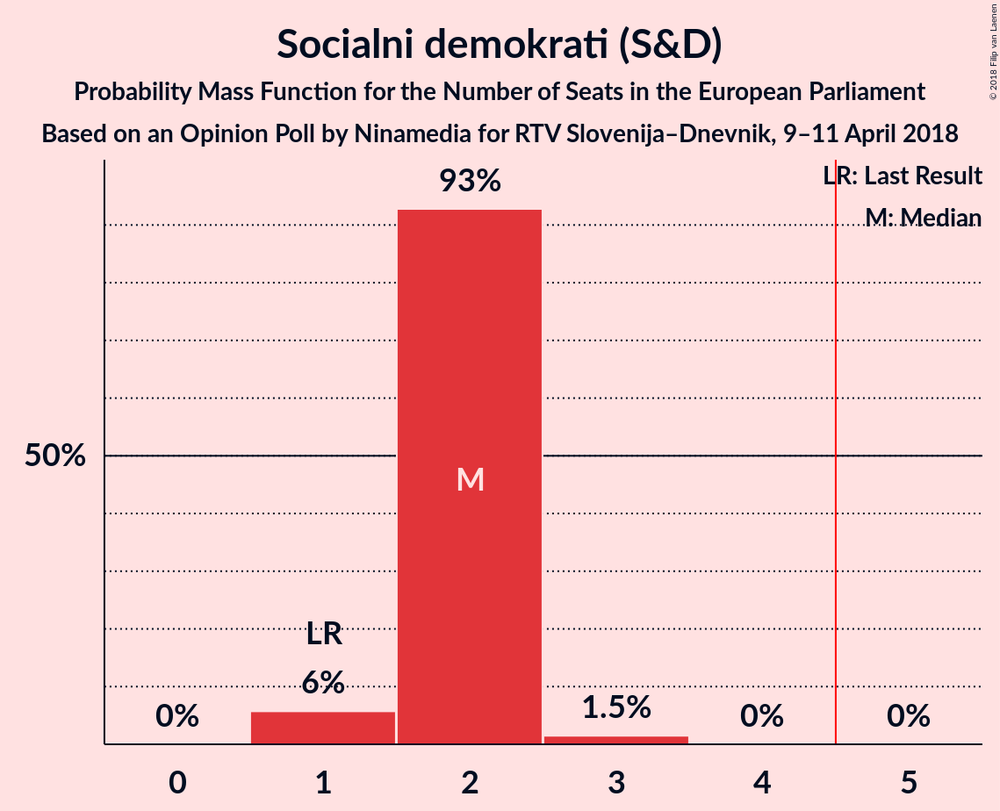
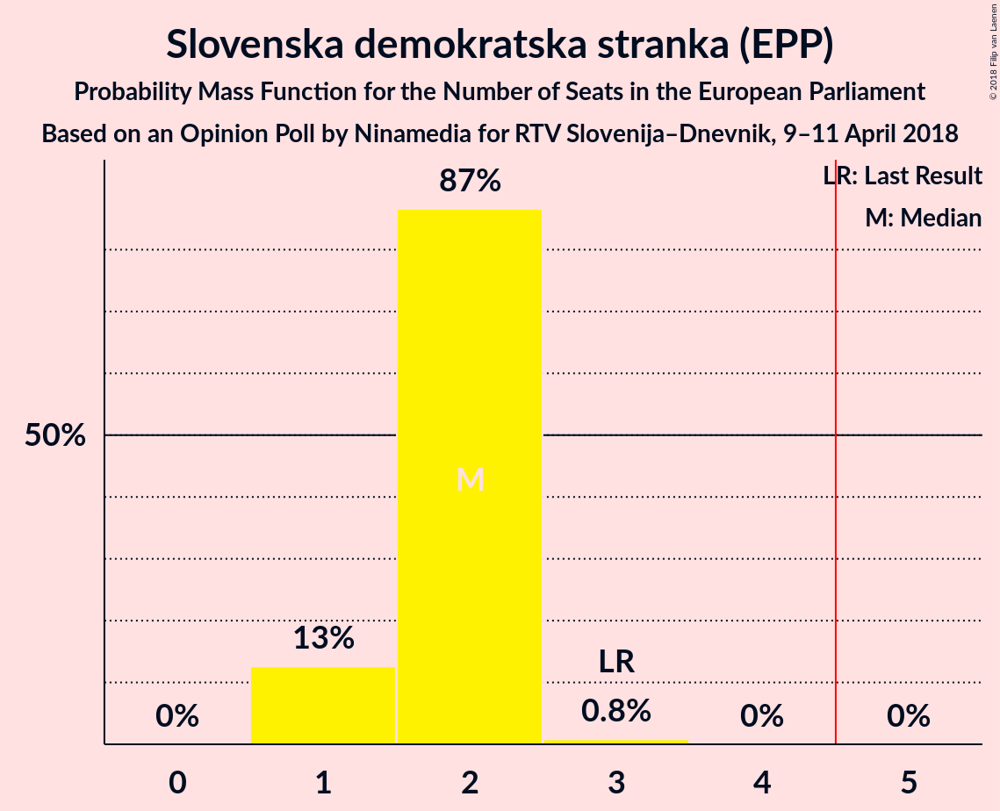
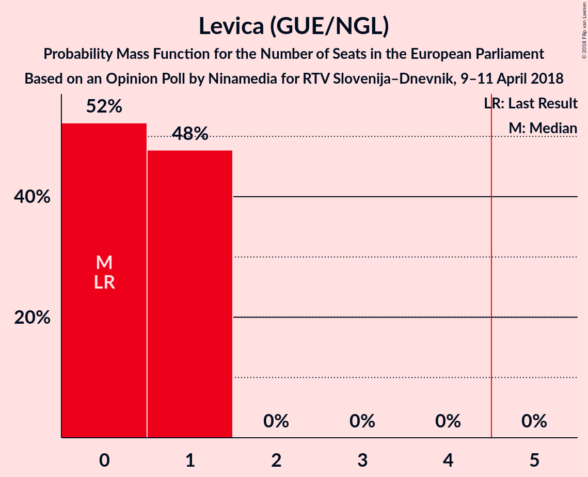
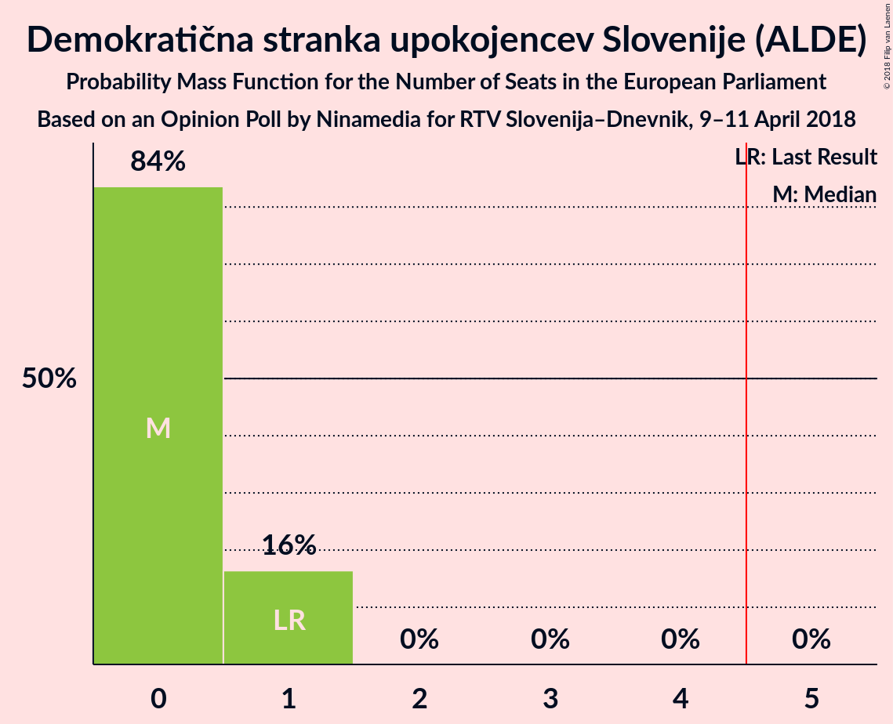

# Opinion Poll by Ninamedia for RTV Slovenija–Dnevnik, 9–11 April 2018

<a href="#voting-intentions">Voting Intentions</a> | <a href="#seats">Seats</a> | <a href="#coalitions">Coalitions</a> | <a href="#technical-information">Technical Information</a>

## Voting Intentions

### Confidence Intervals

| Party | Last Result | Poll Result | 80% Confidence Interval | 90% Confidence Interval | 95% Confidence Interval | 99% Confidence Interval |
|:-----:|:-----------:|:-----------:|:-----------------------:|:-----------------------:|:-----------------------:|:-----------------------:|
| Socialni demokrati (S&D) | 8.1% | 19.9% | 17.6–22.6% |16.9–23.3% |16.4–24.0% |15.3–25.3% |
| Lista Marjana Šarca (*) | 0.0% | 19.4% | 17.1–22.1% |16.5–22.8% |16.0–23.5% |14.9–24.8% |
| Slovenska demokratska stranka (EPP) | 24.8% | 19.0% | 16.7–21.6% |16.1–22.3% |15.5–23.0% |14.5–24.3% |
| Stranka modernega centra (ALDE) | 0.0% | 11.5% | 9.7–13.7% |9.2–14.3% |8.8–14.9% |8.0–16.0% |
| Levica (GUE/NGL) | 5.5% | 8.2% | 6.7–10.2% |6.3–10.7% |6.0–11.2% |5.3–12.2% |
| Demokratična stranka upokojencev Slovenije (ALDE) | 8.2% | 7.0% | 5.7–8.9% |5.3–9.4% |5.0–9.9% |4.4–10.8% |
| Nova Slovenija–Krščanski demokrati (EPP) | 16.5% | 6.8% | 5.5–8.6% |5.1–9.1% |4.8–9.6% |4.2–10.5% |
| Stranka Alenke Bratušek (ALDE) | 0.0% | 0.2% | 0.1–0.9% |0.1–1.1% |0.0–1.3% |0.0–1.7% |

*Note:* The poll result column reflects the actual value used in the calculations. Published results may vary slightly, and in addition be rounded to fewer digits.

## Seats

### Confidence Intervals

| Party | Last Result | Median | 80% Confidence Interval | 90% Confidence Interval | 95% Confidence Interval | 99% Confidence Interval |
|:-----:|:-----------:|:------:|:-----------------------:|:-----------------------:|:-----------------------:|:-----------------------:|
| <a href="#socialni-demokrati-(s&d)">Socialni demokrati (S&D)</a> | 1 | 2 | 2 |1–2 |1–2 |1–3 |
| <a href="#lista-marjana-šarca-(*)">Lista Marjana Šarca (*)</a> | 0 | 2 | 2 |1–2 |1–2 |1–3 |
| <a href="#slovenska-demokratska-stranka-(epp)">Slovenska demokratska stranka (EPP)</a> | 3 | 2 | 1–2 |1–2 |1–2 |1–3 |
| <a href="#stranka-modernega-centra-(alde)">Stranka modernega centra (ALDE)</a> | 0 | 1 | 1 |1 |1 |0–1 |
| <a href="#levica-(gue/ngl)">Levica (GUE/NGL)</a> | 0 | 0 | 0–1 |0–1 |0–1 |0–1 |
| <a href="#demokratična-stranka-upokojencev-slovenije-(alde)">Demokratična stranka upokojencev Slovenije (ALDE)</a> | 1 | 0 | 0–1 |0–1 |0–1 |0–1 |
| <a href="#nova-slovenija–krščanski-demokrati-(epp)">Nova Slovenija–Krščanski demokrati (EPP)</a> | 1 | 0 | 0–1 |0–1 |0–1 |0–1 |
| <a href="#stranka-alenke-bratušek-(alde)">Stranka Alenke Bratušek (ALDE)</a> | 0 | 0 | 0 |0 |0 |0 |

### Socialni demokrati (S&D)

*For a full overview of the results for this party, see the [Socialni demokrati (S&D)](party-socialnidemokratisd.html) page.*

| Number of Seats | Probability | Accumulated | Special Marks |
|:---------------:|:-----------:|:-----------:|:-------------:|
| 1 | 6% | 100% | Last Result |
| 2 | 93% | 94% | Median |
| 3 | 1.5% | 1.5% |  |
| 4 | 0% | 0% |  |

### Lista Marjana Šarca (*)

*For a full overview of the results for this party, see the [Lista Marjana Šarca (*)](party-listamarjanašarca.html) page.*

| Number of Seats | Probability | Accumulated | Special Marks |
|:---------------:|:-----------:|:-----------:|:-------------:|
| 0 | 0% | 100% | Last Result |
| 1 | 7% | 100% |  |
| 2 | 91% | 93% | Median |
| 3 | 2% | 2% |  |
| 4 | 0% | 0% |  |

### Slovenska demokratska stranka (EPP)

*For a full overview of the results for this party, see the [Slovenska demokratska stranka (EPP)](party-slovenskademokratskastrankaepp.html) page.*

| Number of Seats | Probability | Accumulated | Special Marks |
|:---------------:|:-----------:|:-----------:|:-------------:|
| 1 | 13% | 100% |  |
| 2 | 87% | 87% | Median |
| 3 | 0.8% | 0.8% | Last Result |
| 4 | 0% | 0% |  |

### Stranka modernega centra (ALDE)

*For a full overview of the results for this party, see the [Stranka modernega centra (ALDE)](party-strankamodernegacentraalde.html) page.*

| Number of Seats | Probability | Accumulated | Special Marks |
|:---------------:|:-----------:|:-----------:|:-------------:|
| 0 | 2% | 100% | Last Result |
| 1 | 98% | 98% | Median |
| 2 | 0.5% | 0.5% |  |
| 3 | 0% | 0% |  |

### Levica (GUE/NGL)

*For a full overview of the results for this party, see the [Levica (GUE/NGL)](party-levicaguengl.html) page.*

| Number of Seats | Probability | Accumulated | Special Marks |
|:---------------:|:-----------:|:-----------:|:-------------:|
| 0 | 52% | 100% | Last Result, Median |
| 1 | 48% | 48% |  |
| 2 | 0% | 0% |  |

### Demokratična stranka upokojencev Slovenije (ALDE)

*For a full overview of the results for this party, see the [Demokratična stranka upokojencev Slovenije (ALDE)](party-demokratičnastrankaupokojencevslovenijealde.html) page.*

| Number of Seats | Probability | Accumulated | Special Marks |
|:---------------:|:-----------:|:-----------:|:-------------:|
| 0 | 84% | 100% | Median |
| 1 | 16% | 16% | Last Result |
| 2 | 0% | 0% |  |

### Nova Slovenija–Krščanski demokrati (EPP)

*For a full overview of the results for this party, see the [Nova Slovenija–Krščanski demokrati (EPP)](party-novaslovenija–krščanskidemokratiepp.html) page.*

| Number of Seats | Probability | Accumulated | Special Marks |
|:---------------:|:-----------:|:-----------:|:-------------:|
| 0 | 84% | 100% | Median |
| 1 | 16% | 16% | Last Result |
| 2 | 0% | 0% |  |

### Stranka Alenke Bratušek (ALDE)

*For a full overview of the results for this party, see the [Stranka Alenke Bratušek (ALDE)](party-strankaalenkebratušekalde.html) page.*

| Number of Seats | Probability | Accumulated | Special Marks |
|:---------------:|:-----------:|:-----------:|:-------------:|
| 0 | 100% | 100% | Last Result, Median |

## Coalitions

### Confidence Intervals

| Coalition | Last Result | Median | Majority? | 80% Confidence Interval | 90% Confidence Interval | 95% Confidence Interval | 99% Confidence Interval |
|:---------:|:-----------:|:------:|:---------:|:-----------------------:|:-----------------------:|:-----------------------:|:-----------------------:|
| Socialni demokrati (S&D) | 1 | 2 | 0% | 2 | 1–2 | 1–2 | 1–3 |
| Levica (GUE/NGL) | 0 | 0 | 0% | 0–1 | 0–1 | 0–1 | 0–1 |

### Socialni demokrati (S&D)

| Number of Seats | Probability | Accumulated | Special Marks |
|:---------------:|:-----------:|:-----------:|:-------------:|
| 1 | 6% | 100% | Last Result |
| 2 | 93% | 94% | Median |
| 3 | 1.5% | 1.5% |  |
| 4 | 0% | 0% |  |

### Levica (GUE/NGL)

| Number of Seats | Probability | Accumulated | Special Marks |
|:---------------:|:-----------:|:-----------:|:-------------:|
| 0 | 52% | 100% | Last Result, Median |
| 1 | 48% | 48% |  |
| 2 | 0% | 0% |  |

## Technical Information

### Opinion Poll

+ **Polling firm:** Ninamedia
+ **Commissioner(s):** RTV Slovenija–Dnevnik
+ **Fieldwork period:** 9–11 April 2018

### Calculations

+ **Sample size:** 427
+ **Simulations done:** 1,048,576
+ **Error estimate:** 2.55%

