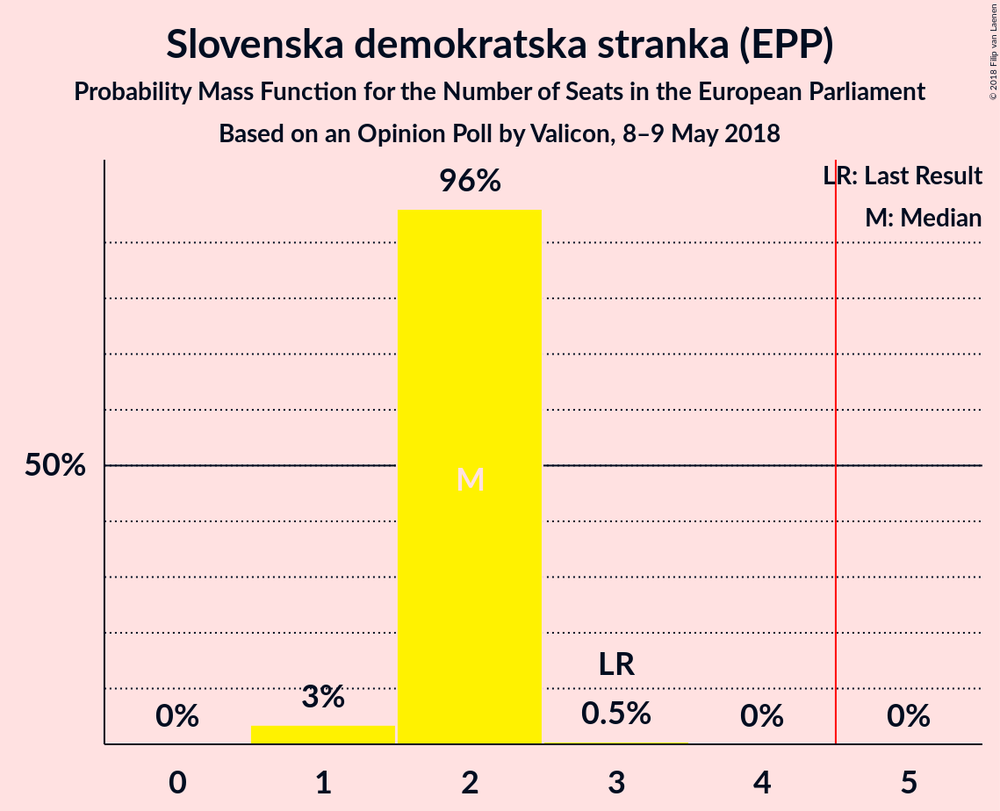
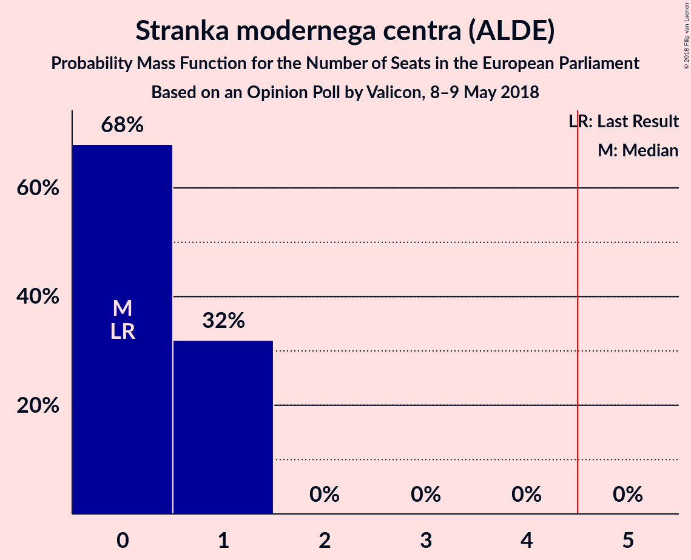
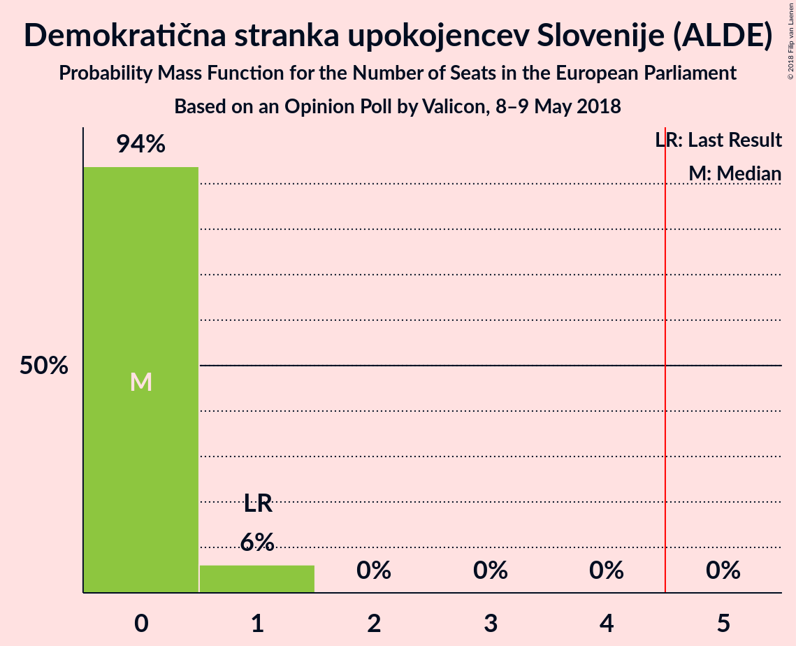

# Opinion Poll by Valicon, 8–9 May 2018

<a href="#voting-intentions">Voting Intentions</a> | <a href="#seats">Seats</a> | <a href="#coalitions">Coalitions</a> | <a href="#technical-information">Technical Information</a>

## Voting Intentions

### Confidence Intervals

| Party | Last Result | Poll Result | 80% Confidence Interval | 90% Confidence Interval | 95% Confidence Interval | 99% Confidence Interval |
|:-----:|:-----------:|:-----------:|:-----------------------:|:-----------------------:|:-----------------------:|:-----------------------:|
| Slovenska demokratska stranka (EPP) | 24.8% | 18.2% | 16.5–20.0% |16.1–20.5% |15.7–21.0% |14.9–21.9% |
| Lista Marjana Šarca (*) | 0.0% | 17.8% | 16.2–19.6% |15.7–20.1% |15.3–20.6% |14.6–21.5% |
| Socialni demokrati (S&D) | 8.1% | 15.2% | 13.7–17.0% |13.3–17.4% |12.9–17.9% |12.2–18.7% |
| Levica (GUE/NGL) | 5.5% | 9.3% | 8.1–10.8% |7.8–11.2% |7.5–11.5% |7.0–12.3% |
| Nova Slovenija–Krščanski demokrati (EPP) | 16.5% | 7.7% | 6.7–9.1% |6.4–9.4% |6.1–9.8% |5.6–10.5% |
| Stranka modernega centra (ALDE) | 0.0% | 7.0% | 6.0–8.3% |5.7–8.7% |5.4–9.0% |5.0–9.6% |
| Demokratična stranka upokojencev Slovenije (ALDE) | 8.2% | 5.5% | 4.6–6.7% |4.4–7.0% |4.2–7.3% |3.8–7.9% |
| Stranka Alenke Bratušek (ALDE) | 0.0% | 3.3% | 2.6–4.3% |2.4–4.5% |2.3–4.8% |2.0–5.3% |
| Slovenska nacionalna stranka (*) | 4.0% | 3.3% | 2.6–4.3% |2.4–4.5% |2.3–4.8% |2.0–5.3% |
| Glas za otroke in družine–Nova ljudska stranka Slovenije (*) | 0.0% | 2.8% | 2.2–3.7% |2.0–4.0% |1.9–4.2% |1.6–4.7% |
| Slovenska ljudska stranka (EPP) | 16.5% | 2.3% | 1.8–3.2% |1.6–3.4% |1.5–3.6% |1.3–4.1% |

*Note:* The poll result column reflects the actual value used in the calculations. Published results may vary slightly, and in addition be rounded to fewer digits.

## Seats

### Confidence Intervals

| Party | Last Result | Median | 80% Confidence Interval | 90% Confidence Interval | 95% Confidence Interval | 99% Confidence Interval |
|:-----:|:-----------:|:------:|:-----------------------:|:-----------------------:|:-----------------------:|:-----------------------:|
| <a href="#slovenska-demokratska-stranka-(epp)">Slovenska demokratska stranka (EPP)</a> | 3 | 2 | 2 |2 |1–2 |1–2 |
| <a href="#lista-marjana-Šarca-(*)">Lista Marjana Šarca (*)</a> | 0 | 2 | 2 |2 |2 |1–2 |
| <a href="#socialni-demokrati-(s&d)">Socialni demokrati (S&D)</a> | 1 | 2 | 1–2 |1–2 |1–2 |1–2 |
| <a href="#levica-(gue/ngl)">Levica (GUE/NGL)</a> | 0 | 1 | 1 |1 |1 |0–1 |
| <a href="#nova-slovenija–krščanski-demokrati-(epp)">Nova Slovenija–Krščanski demokrati (EPP)</a> | 1 | 1 | 0–1 |0–1 |0–1 |0–1 |
| <a href="#stranka-modernega-centra-(alde)">Stranka modernega centra (ALDE)</a> | 0 | 0 | 0–1 |0–1 |0–1 |0–1 |
| <a href="#demokratična-stranka-upokojencev-slovenije-(alde)">Demokratična stranka upokojencev Slovenije (ALDE)</a> | 1 | 0 | 0 |0–1 |0–1 |0–1 |
| <a href="#stranka-alenke-bratušek-(alde)">Stranka Alenke Bratušek (ALDE)</a> | 0 | 0 | 0 |0 |0 |0 |
| <a href="#slovenska-nacionalna-stranka-(*)">Slovenska nacionalna stranka (*)</a> | 0 | 0 | 0 |0 |0 |0 |
| <a href="#glas-za-otroke-in-družine–nova-ljudska-stranka-slovenije-(*)">Glas za otroke in družine–Nova ljudska stranka Slovenije (*)</a> | 0 | 0 | 0 |0 |0 |0 |
| <a href="#slovenska-ljudska-stranka-(epp)">Slovenska ljudska stranka (EPP)</a> | 1 | 0 | 0 |0 |0 |0 |

### Slovenska demokratska stranka (EPP)

*For a full overview of the results for this party, see the [Slovenska demokratska stranka (EPP)](party-slovenskademokratskastrankaepp.html) page.*

| Number of Seats | Probability | Accumulated | Special Marks |
|:---------------:|:-----------:|:-----------:|:-------------:|
| 1 | 3% | 100% |  |
| 2 | 96% | 97% | Median |
| 3 | 0.5% | 0.5% | Last Result |
| 4 | 0% | 0% |  |

### Lista Marjana Šarca (*)

*For a full overview of the results for this party, see the [Lista Marjana Šarca (*)](party-listamarjanaŠarca.html) page.*

| Number of Seats | Probability | Accumulated | Special Marks |
|:---------------:|:-----------:|:-----------:|:-------------:|
| 0 | 0% | 100% | Last Result |
| 1 | 2% | 100% |  |
| 2 | 98% | 98% | Median |
| 3 | 0.4% | 0.4% |  |
| 4 | 0% | 0% |  |

### Socialni demokrati (S&D)

*For a full overview of the results for this party, see the [Socialni demokrati (S&D)](party-socialnidemokratisd.html) page.*

| Number of Seats | Probability | Accumulated | Special Marks |
|:---------------:|:-----------:|:-----------:|:-------------:|
| 1 | 37% | 100% | Last Result |
| 2 | 63% | 63% | Median |
| 3 | 0% | 0% |  |

### Levica (GUE/NGL)

*For a full overview of the results for this party, see the [Levica (GUE/NGL)](party-levicaguengl.html) page.*

| Number of Seats | Probability | Accumulated | Special Marks |
|:---------------:|:-----------:|:-----------:|:-------------:|
| 0 | 2% | 100% | Last Result |
| 1 | 98% | 98% | Median |
| 2 | 0% | 0% |  |

### Nova Slovenija–Krščanski demokrati (EPP)

*For a full overview of the results for this party, see the [Nova Slovenija–Krščanski demokrati (EPP)](party-novaslovenija–krščanskidemokratiepp.html) page.*

| Number of Seats | Probability | Accumulated | Special Marks |
|:---------------:|:-----------:|:-----------:|:-------------:|
| 0 | 41% | 100% |  |
| 1 | 59% | 59% | Last Result, Median |
| 2 | 0% | 0% |  |

### Stranka modernega centra (ALDE)

*For a full overview of the results for this party, see the [Stranka modernega centra (ALDE)](party-strankamodernegacentraalde.html) page.*

| Number of Seats | Probability | Accumulated | Special Marks |
|:---------------:|:-----------:|:-----------:|:-------------:|
| 0 | 68% | 100% | Last Result, Median |
| 1 | 32% | 32% |  |
| 2 | 0% | 0% |  |

### Demokratična stranka upokojencev Slovenije (ALDE)

*For a full overview of the results for this party, see the [Demokratična stranka upokojencev Slovenije (ALDE)](party-demokratičnastrankaupokojencevslovenijealde.html) page.*

| Number of Seats | Probability | Accumulated | Special Marks |
|:---------------:|:-----------:|:-----------:|:-------------:|
| 0 | 94% | 100% | Median |
| 1 | 6% | 6% | Last Result |
| 2 | 0% | 0% |  |

### Stranka Alenke Bratušek (ALDE)

*For a full overview of the results for this party, see the [Stranka Alenke Bratušek (ALDE)](party-strankaalenkebratušekalde.html) page.*

| Number of Seats | Probability | Accumulated | Special Marks |
|:---------------:|:-----------:|:-----------:|:-------------:|
| 0 | 100% | 100% | Last Result, Median |

### Slovenska nacionalna stranka (*)

*For a full overview of the results for this party, see the [Slovenska nacionalna stranka (*)](party-slovenskanacionalnastranka.html) page.*

| Number of Seats | Probability | Accumulated | Special Marks |
|:---------------:|:-----------:|:-----------:|:-------------:|
| 0 | 100% | 100% | Last Result, Median |

### Glas za otroke in družine–Nova ljudska stranka Slovenije (*)

*For a full overview of the results for this party, see the [Glas za otroke in družine–Nova ljudska stranka Slovenije (*)](party-glaszaotrokeindružine–novaljudskastrankaslovenije.html) page.*

| Number of Seats | Probability | Accumulated | Special Marks |
|:---------------:|:-----------:|:-----------:|:-------------:|
| 0 | 100% | 100% | Last Result, Median |

### Slovenska ljudska stranka (EPP)

*For a full overview of the results for this party, see the [Slovenska ljudska stranka (EPP)](party-slovenskaljudskastrankaepp.html) page.*

| Number of Seats | Probability | Accumulated | Special Marks |
|:---------------:|:-----------:|:-----------:|:-------------:|
| 0 | 100% | 100% | Median |
| 1 | 0% | 0% | Last Result |

## Coalitions

### Confidence Intervals

| Coalition | Last Result | Median | Majority? | 80% Confidence Interval | 90% Confidence Interval | 95% Confidence Interval | 99% Confidence Interval |
|:---------:|:-----------:|:------:|:---------:|:-----------------------:|:-----------------------:|:-----------------------:|:-----------------------:|
| Slovenska demokratska stranka (EPP) – Nova Slovenija–Krščanski demokrati (EPP) – Slovenska ljudska stranka (EPP) | 5 | 3 | 0% | 2–3 | 2–3 | 2–3 | 2–3 |
| Socialni demokrati (S&D) | 1 | 2 | 0% | 1–2 | 1–2 | 1–2 | 1–2 |
| Levica (GUE/NGL) | 0 | 1 | 0% | 1 | 1 | 1 | 0–1 |

### Slovenska demokratska stranka (EPP) – Nova Slovenija–Krščanski demokrati (EPP) – Slovenska ljudska stranka (EPP)

| Number of Seats | Probability | Accumulated | Special Marks |
|:---------------:|:-----------:|:-----------:|:-------------:|
| 1 | 0.1% | 100% |  |
| 2 | 43% | 99.9% |  |
| 3 | 56% | 56% | Median |
| 4 | 0.1% | 0.1% |  |
| 5 | 0% | 0% | Last Result, Majority |

### Socialni demokrati (S&D)

| Number of Seats | Probability | Accumulated | Special Marks |
|:---------------:|:-----------:|:-----------:|:-------------:|
| 1 | 37% | 100% | Last Result |
| 2 | 63% | 63% | Median |
| 3 | 0% | 0% |  |

### Levica (GUE/NGL)

| Number of Seats | Probability | Accumulated | Special Marks |
|:---------------:|:-----------:|:-----------:|:-------------:|
| 0 | 2% | 100% | Last Result |
| 1 | 98% | 98% | Median |
| 2 | 0% | 0% |  |

## Technical Information

### Opinion Poll

+ **Polling firm:** Valicon
+ **Commissioner(s):** —
+ **Fieldwork period:** 8–9 May 2018

### Calculations

+ **Sample size:** 814
+ **Simulations done:** 1,048,576
+ **Error estimate:** 1.28%

