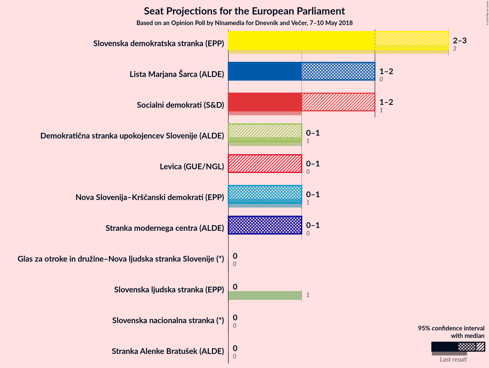
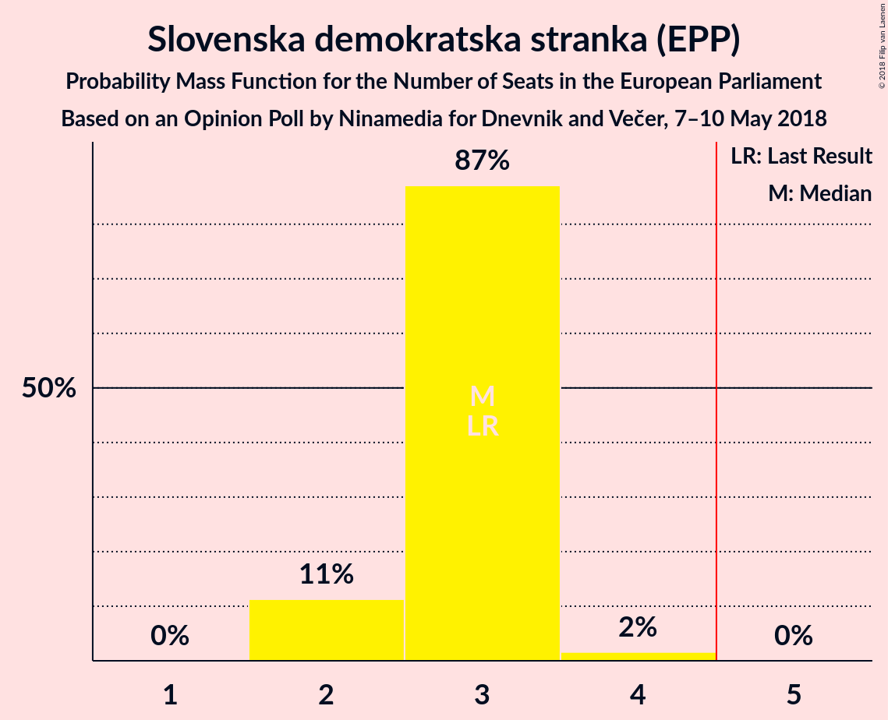
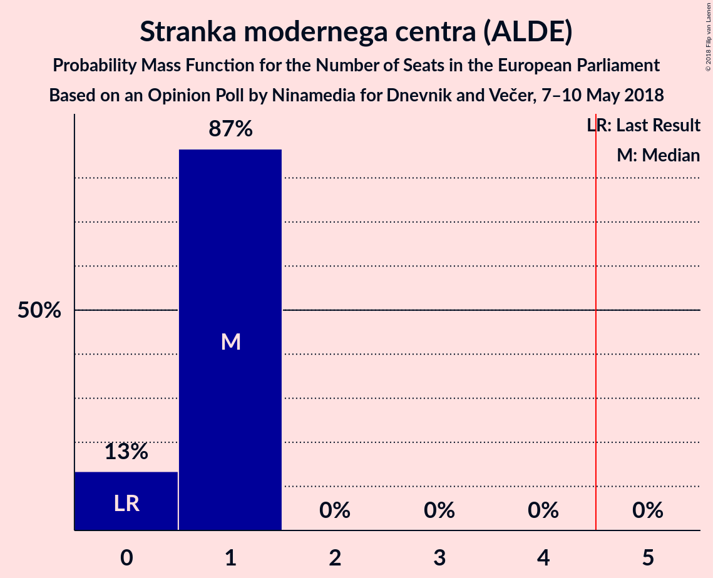
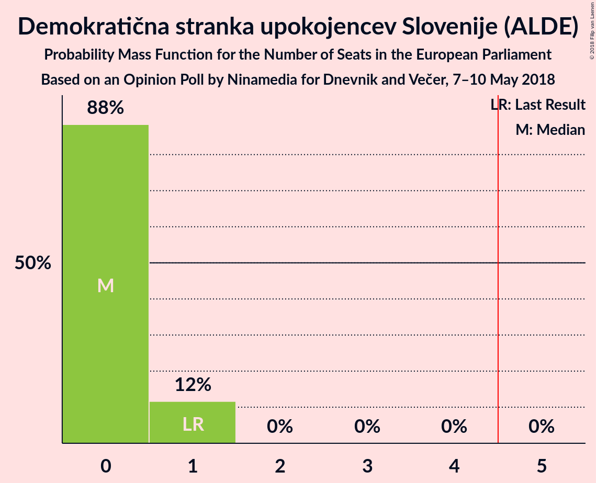

# Opinion Poll by Ninamedia for Dnevnik and Večer, 7–10 May 2018

<a href="#voting-intentions">Voting Intentions</a> | <a href="#seats">Seats</a> | <a href="#coalitions">Coalitions</a> | <a href="#technical-information">Technical Information</a>

## Voting Intentions

### Confidence Intervals

| Party | Last Result | Poll Result | 80% Confidence Interval | 90% Confidence Interval | 95% Confidence Interval | 99% Confidence Interval |
|:-----:|:-----------:|:-----------:|:-----------------------:|:-----------------------:|:-----------------------:|:-----------------------:|
| Slovenska demokratska stranka (EPP) | 24.8% | 25.9% | 23.9–28.0% |23.3–28.6% |22.9–29.1% |21.9–30.1% |
| Lista Marjana Šarca (*) | 0.0% | 15.8% | 14.2–17.6% |13.7–18.1% |13.4–18.6% |12.6–19.5% |
| Socialni demokrati (S&D) | 8.1% | 15.3% | 13.7–17.0% |13.2–17.6% |12.9–18.0% |12.1–18.9% |
| Stranka modernega centra (ALDE) | 0.0% | 8.9% | 7.7–10.3% |7.3–10.8% |7.1–11.1% |6.5–11.9% |
| Nova Slovenija–Krščanski demokrati (EPP) | 16.5% | 7.6% | 6.4–8.9% |6.1–9.3% |5.9–9.7% |5.4–10.4% |
| Levica (GUE/NGL) | 5.5% | 6.6% | 5.6–7.9% |5.3–8.3% |5.1–8.6% |4.6–9.3% |
| Demokratična stranka upokojencev Slovenije (ALDE) | 8.2% | 6.4% | 5.3–7.7% |5.1–8.0% |4.8–8.4% |4.4–9.0% |
| Stranka Alenke Bratušek (ALDE) | 0.0% | 2.0% | 1.5–2.8% |1.3–3.0% |1.2–3.3% |1.0–3.7% |
| Slovenska ljudska stranka (EPP) | 16.5% | 2.0% | 1.5–2.8% |1.3–3.0% |1.2–3.3% |1.0–3.7% |
| Slovenska nacionalna stranka (*) | 4.0% | 1.7% | 1.3–2.5% |1.1–2.7% |1.0–2.9% |0.8–3.4% |
| Glas za otroke in družine–Nova ljudska stranka Slovenije (*) | 0.0% | 0.1% | 0.1–0.5% |0.0–0.6% |0.0–0.7% |0.0–1.0% |

*Note:* The poll result column reflects the actual value used in the calculations. Published results may vary slightly, and in addition be rounded to fewer digits.

## Seats

### Confidence Intervals

| Party | Last Result | Median | 80% Confidence Interval | 90% Confidence Interval | 95% Confidence Interval | 99% Confidence Interval |
|:-----:|:-----------:|:------:|:-----------------------:|:-----------------------:|:-----------------------:|:-----------------------:|
| <a href="#slovenska-demokratska-stranka-(epp)">Slovenska demokratska stranka (EPP)</a> | 3 | 3 | 2–3 |2–3 |2–3 |2–4 |
| <a href="#lista-marjana-šarca-(*)">Lista Marjana Šarca (*)</a> | 0 | 2 | 1–2 |1–2 |1–2 |1–2 |
| <a href="#socialni-demokrati-(s&d)">Socialni demokrati (S&D)</a> | 1 | 1 | 1–2 |1–2 |1–2 |1–2 |
| <a href="#stranka-modernega-centra-(alde)">Stranka modernega centra (ALDE)</a> | 0 | 1 | 0–1 |0–1 |0–1 |0–1 |
| <a href="#nova-slovenija–krščanski-demokrati-(epp)">Nova Slovenija–Krščanski demokrati (EPP)</a> | 1 | 1 | 0–1 |0–1 |0–1 |0–1 |
| <a href="#levica-(gue/ngl)">Levica (GUE/NGL)</a> | 0 | 0 | 0–1 |0–1 |0–1 |0–1 |
| <a href="#demokratična-stranka-upokojencev-slovenije-(alde)">Demokratična stranka upokojencev Slovenije (ALDE)</a> | 1 | 0 | 0–1 |0–1 |0–1 |0–1 |
| <a href="#stranka-alenke-bratušek-(alde)">Stranka Alenke Bratušek (ALDE)</a> | 0 | 0 | 0 |0 |0 |0 |
| <a href="#slovenska-ljudska-stranka-(epp)">Slovenska ljudska stranka (EPP)</a> | 1 | 0 | 0 |0 |0 |0 |
| <a href="#slovenska-nacionalna-stranka-(*)">Slovenska nacionalna stranka (*)</a> | 0 | 0 | 0 |0 |0 |0 |
| <a href="#glas-za-otroke-in-družine–nova-ljudska-stranka-slovenije-(*)">Glas za otroke in družine–Nova ljudska stranka Slovenije (*)</a> | 0 | 0 | 0 |0 |0 |0 |

### Slovenska demokratska stranka (EPP)

*For a full overview of the results for this party, see the [Slovenska demokratska stranka (EPP)](party-slovenskademokratskastrankaepp.html) page.*

| Number of Seats | Probability | Accumulated | Special Marks |
|:---------------:|:-----------:|:-----------:|:-------------:|
| 2 | 11% | 100% |  |
| 3 | 87% | 89% | Last Result, Median |
| 4 | 2% | 2% |  |
| 5 | 0% | 0% | Majority |

### Lista Marjana Šarca (*)

*For a full overview of the results for this party, see the [Lista Marjana Šarca (*)](party-listamarjanašarca.html) page.*

| Number of Seats | Probability | Accumulated | Special Marks |
|:---------------:|:-----------:|:-----------:|:-------------:|
| 0 | 0% | 100% | Last Result |
| 1 | 46% | 100% |  |
| 2 | 54% | 54% | Median |
| 3 | 0% | 0% |  |

### Socialni demokrati (S&D)

*For a full overview of the results for this party, see the [Socialni demokrati (S&D)](party-socialnidemokratisd.html) page.*

| Number of Seats | Probability | Accumulated | Special Marks |
|:---------------:|:-----------:|:-----------:|:-------------:|
| 1 | 71% | 100% | Last Result, Median |
| 2 | 29% | 29% |  |
| 3 | 0% | 0% |  |

### Stranka modernega centra (ALDE)

*For a full overview of the results for this party, see the [Stranka modernega centra (ALDE)](party-strankamodernegacentraalde.html) page.*

| Number of Seats | Probability | Accumulated | Special Marks |
|:---------------:|:-----------:|:-----------:|:-------------:|
| 0 | 13% | 100% | Last Result |
| 1 | 87% | 87% | Median |
| 2 | 0% | 0% |  |

### Nova Slovenija–Krščanski demokrati (EPP)

*For a full overview of the results for this party, see the [Nova Slovenija–Krščanski demokrati (EPP)](party-novaslovenija–krščanskidemokratiepp.html) page.*

| Number of Seats | Probability | Accumulated | Special Marks |
|:---------------:|:-----------:|:-----------:|:-------------:|
| 0 | 41% | 100% |  |
| 1 | 59% | 59% | Last Result, Median |
| 2 | 0% | 0% |  |

### Levica (GUE/NGL)

*For a full overview of the results for this party, see the [Levica (GUE/NGL)](party-levicaguengl.html) page.*

| Number of Seats | Probability | Accumulated | Special Marks |
|:---------------:|:-----------:|:-----------:|:-------------:|
| 0 | 87% | 100% | Last Result, Median |
| 1 | 13% | 13% |  |
| 2 | 0% | 0% |  |

### Demokratična stranka upokojencev Slovenije (ALDE)

*For a full overview of the results for this party, see the [Demokratična stranka upokojencev Slovenije (ALDE)](party-demokratičnastrankaupokojencevslovenijealde.html) page.*

| Number of Seats | Probability | Accumulated | Special Marks |
|:---------------:|:-----------:|:-----------:|:-------------:|
| 0 | 88% | 100% | Median |
| 1 | 12% | 12% | Last Result |
| 2 | 0% | 0% |  |

### Stranka Alenke Bratušek (ALDE)

*For a full overview of the results for this party, see the [Stranka Alenke Bratušek (ALDE)](party-strankaalenkebratušekalde.html) page.*

| Number of Seats | Probability | Accumulated | Special Marks |
|:---------------:|:-----------:|:-----------:|:-------------:|
| 0 | 100% | 100% | Last Result, Median |

### Slovenska ljudska stranka (EPP)

*For a full overview of the results for this party, see the [Slovenska ljudska stranka (EPP)](party-slovenskaljudskastrankaepp.html) page.*

| Number of Seats | Probability | Accumulated | Special Marks |
|:---------------:|:-----------:|:-----------:|:-------------:|
| 0 | 100% | 100% | Median |
| 1 | 0% | 0% | Last Result |

### Slovenska nacionalna stranka (*)

*For a full overview of the results for this party, see the [Slovenska nacionalna stranka (*)](party-slovenskanacionalnastranka.html) page.*

| Number of Seats | Probability | Accumulated | Special Marks |
|:---------------:|:-----------:|:-----------:|:-------------:|
| 0 | 100% | 100% | Last Result, Median |

### Glas za otroke in družine–Nova ljudska stranka Slovenije (*)

*For a full overview of the results for this party, see the [Glas za otroke in družine–Nova ljudska stranka Slovenije (*)](party-glaszaotrokeindružine–novaljudskastrankaslovenije.html) page.*

| Number of Seats | Probability | Accumulated | Special Marks |
|:---------------:|:-----------:|:-----------:|:-------------:|
| 0 | 100% | 100% | Last Result, Median |

## Coalitions

### Confidence Intervals

| Coalition | Last Result | Median | Majority? | 80% Confidence Interval | 90% Confidence Interval | 95% Confidence Interval | 99% Confidence Interval |
|:---------:|:-----------:|:------:|:---------:|:-----------------------:|:-----------------------:|:-----------------------:|:-----------------------:|
| Slovenska demokratska stranka (EPP) – Nova Slovenija–Krščanski demokrati (EPP) – Slovenska ljudska stranka (EPP) | 5 | 4 | 0.6% | 3–4 | 3–4 | 2–4 | 2–5 |
| Socialni demokrati (S&D) | 1 | 1 | 0% | 1–2 | 1–2 | 1–2 | 1–2 |
| Levica (GUE/NGL) | 0 | 0 | 0% | 0–1 | 0–1 | 0–1 | 0–1 |

### Slovenska demokratska stranka (EPP) – Nova Slovenija–Krščanski demokrati (EPP) – Slovenska ljudska stranka (EPP)

| Number of Seats | Probability | Accumulated | Special Marks |
|:---------------:|:-----------:|:-----------:|:-------------:|
| 2 | 3% | 100% |  |
| 3 | 45% | 97% |  |
| 4 | 51% | 52% | Median |
| 5 | 0.6% | 0.6% | Last Result, Majority |
| 6 | 0% | 0% |  |

### Socialni demokrati (S&D)

| Number of Seats | Probability | Accumulated | Special Marks |
|:---------------:|:-----------:|:-----------:|:-------------:|
| 1 | 71% | 100% | Last Result, Median |
| 2 | 29% | 29% |  |
| 3 | 0% | 0% |  |

### Levica (GUE/NGL)

| Number of Seats | Probability | Accumulated | Special Marks |
|:---------------:|:-----------:|:-----------:|:-------------:|
| 0 | 87% | 100% | Last Result, Median |
| 1 | 13% | 13% |  |
| 2 | 0% | 0% |  |

## Technical Information

### Opinion Poll

+ **Polling firm:** Ninamedia
+ **Commissioner(s):** Dnevnik and Večer
+ **Fieldwork period:** 7–10 May 2018

### Calculations

+ **Sample size:** 754
+ **Simulations done:** 1,048,576
+ **Error estimate:** 2.23%

