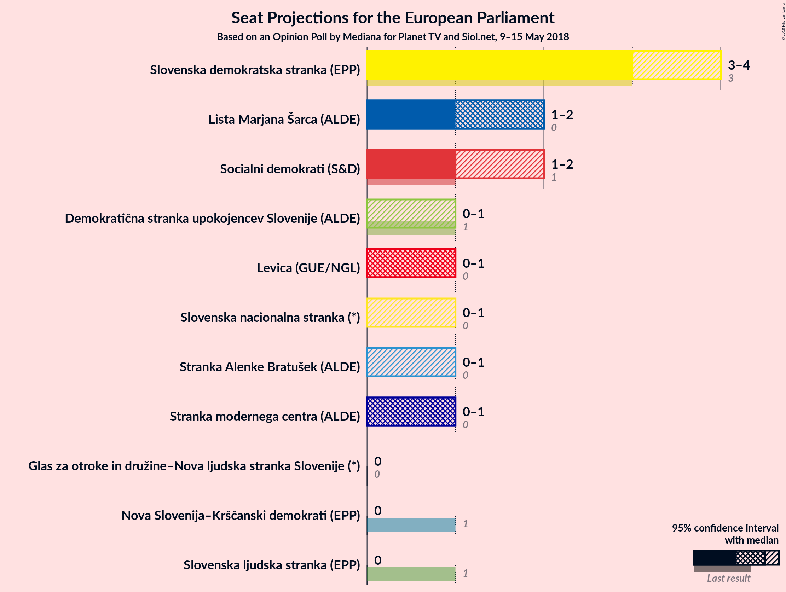
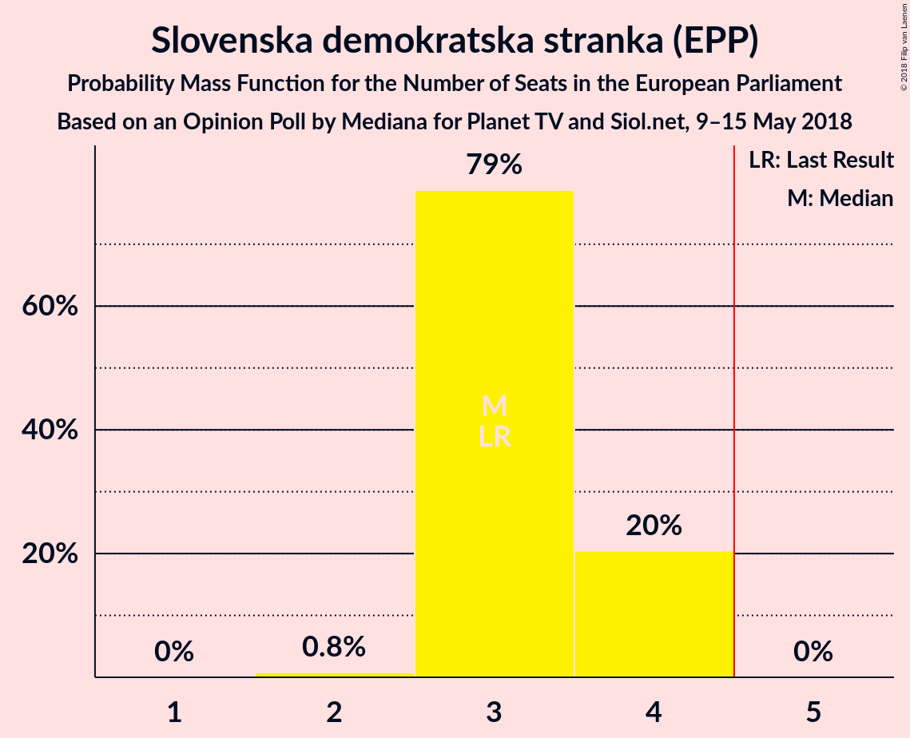
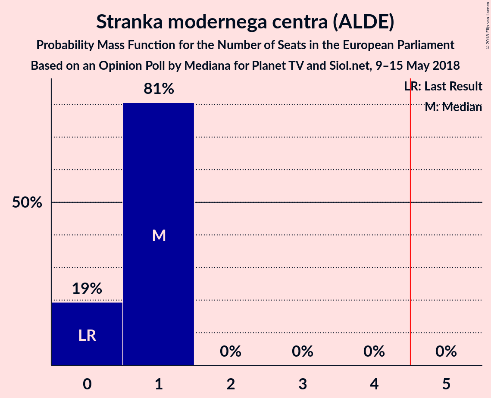
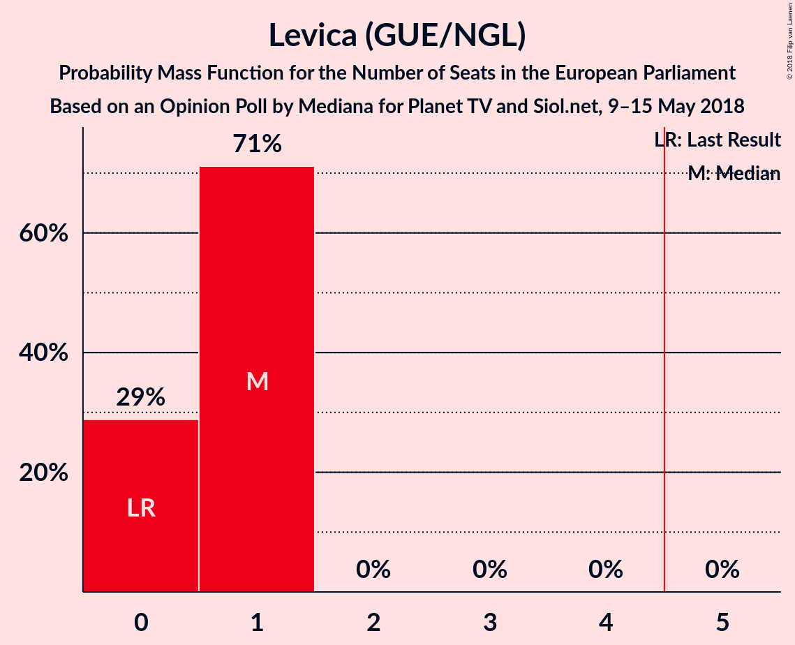
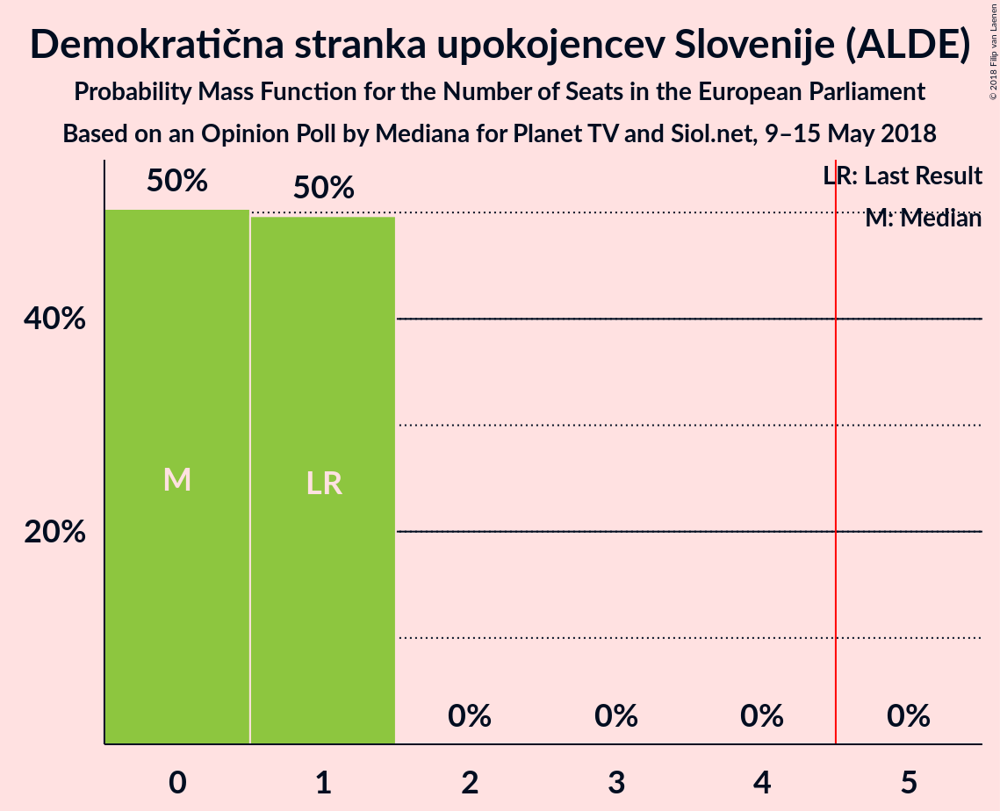

# Opinion Poll by Mediana for Planet TV and Siol.net, 9–15 May 2018

<a href="#voting-intentions">Voting Intentions</a> | <a href="#seats">Seats</a> | <a href="#coalitions">Coalitions</a> | <a href="#technical-information">Technical Information</a>

## Voting Intentions

### Confidence Intervals

| Party | Last Result | Poll Result | 80% Confidence Interval | 90% Confidence Interval | 95% Confidence Interval | 99% Confidence Interval |
|:-----:|:-----------:|:-----------:|:-----------------------:|:-----------------------:|:-----------------------:|:-----------------------:|
| Slovenska demokratska stranka (EPP) | 24.8% | 28.1% | 25.6–30.8% |24.9–31.6% |24.3–32.3% |23.2–33.6% |
| Lista Marjana Šarca (*) | 0.0% | 15.5% | 13.5–17.7% |13.0–18.4% |12.5–19.0% |11.7–20.1% |
| Socialni demokrati (S&D) | 8.1% | 12.2% | 10.5–14.3% |10.0–14.9% |9.6–15.4% |8.8–16.5% |
| Stranka modernega centra (ALDE) | 0.0% | 8.8% | 7.3–10.6% |6.9–11.1% |6.6–11.6% |5.9–12.5% |
| Levica (GUE/NGL) | 5.5% | 7.9% | 6.6–9.7% |6.2–10.2% |5.9–10.7% |5.3–11.6% |
| Demokratična stranka upokojencev Slovenije (ALDE) | 8.2% | 7.3% | 6.0–9.1% |5.7–9.6% |5.3–10.0% |4.8–10.9% |
| Stranka Alenke Bratušek (ALDE) | 0.0% | 5.7% | 4.6–7.3% |4.2–7.7% |4.0–8.1% |3.5–8.9% |
| Slovenska nacionalna stranka (*) | 4.0% | 5.3% | 4.2–6.8% |3.9–7.3% |3.6–7.7% |3.2–8.4% |
| Nova Slovenija–Krščanski demokrati (EPP) | 16.5% | 4.3% | 3.3–5.7% |3.0–6.1% |2.8–6.5% |2.4–7.2% |
| Slovenska ljudska stranka (EPP) | 16.5% | 3.1% | 2.3–4.3% |2.0–4.7% |1.9–5.0% |1.5–5.7% |
| Glas za otroke in družine–Nova ljudska stranka Slovenije (*) | 0.0% | 0.8% | 0.5–1.6% |0.4–1.9% |0.3–2.1% |0.2–2.5% |

*Note:* The poll result column reflects the actual value used in the calculations. Published results may vary slightly, and in addition be rounded to fewer digits.

## Seats

### Confidence Intervals

| Party | Last Result | Median | 80% Confidence Interval | 90% Confidence Interval | 95% Confidence Interval | 99% Confidence Interval |
|:-----:|:-----------:|:------:|:-----------------------:|:-----------------------:|:-----------------------:|:-----------------------:|
| <a href="#slovenska-demokratska-stranka-(epp)">Slovenska demokratska stranka (EPP)</a> | 3 | 3 | 3–4 |3–4 |3–4 |2–4 |
| <a href="#lista-marjana-šarca-(*)">Lista Marjana Šarca (*)</a> | 0 | 2 | 1–2 |1–2 |1–2 |1–2 |
| <a href="#socialni-demokrati-(s&d)">Socialni demokrati (S&D)</a> | 1 | 1 | 1 |1–2 |1–2 |1–2 |
| <a href="#stranka-modernega-centra-(alde)">Stranka modernega centra (ALDE)</a> | 0 | 1 | 0–1 |0–1 |0–1 |0–1 |
| <a href="#levica-(gue/ngl)">Levica (GUE/NGL)</a> | 0 | 1 | 0–1 |0–1 |0–1 |0–1 |
| <a href="#demokratična-stranka-upokojencev-slovenije-(alde)">Demokratična stranka upokojencev Slovenije (ALDE)</a> | 1 | 0 | 0–1 |0–1 |0–1 |0–1 |
| <a href="#stranka-alenke-bratušek-(alde)">Stranka Alenke Bratušek (ALDE)</a> | 0 | 0 | 0 |0–1 |0–1 |0–1 |
| <a href="#slovenska-nacionalna-stranka-(*)">Slovenska nacionalna stranka (*)</a> | 0 | 0 | 0 |0–1 |0–1 |0–1 |
| <a href="#nova-slovenija–krščanski-demokrati-(epp)">Nova Slovenija–Krščanski demokrati (EPP)</a> | 1 | 0 | 0 |0 |0 |0 |
| <a href="#slovenska-ljudska-stranka-(epp)">Slovenska ljudska stranka (EPP)</a> | 1 | 0 | 0 |0 |0 |0 |
| <a href="#glas-za-otroke-in-družine–nova-ljudska-stranka-slovenije-(*)">Glas za otroke in družine–Nova ljudska stranka Slovenije (*)</a> | 0 | 0 | 0 |0 |0 |0 |

### Slovenska demokratska stranka (EPP)

*For a full overview of the results for this party, see the [Slovenska demokratska stranka (EPP)](party-slovenskademokratskastrankaepp.html) page.*

| Number of Seats | Probability | Accumulated | Special Marks |
|:---------------:|:-----------:|:-----------:|:-------------:|
| 2 | 0.8% | 100% |  |
| 3 | 79% | 99.2% | Last Result, Median |
| 4 | 20% | 20% |  |
| 5 | 0% | 0% | Majority |

### Lista Marjana Šarca (*)

*For a full overview of the results for this party, see the [Lista Marjana Šarca (*)](party-listamarjanašarca.html) page.*

| Number of Seats | Probability | Accumulated | Special Marks |
|:---------------:|:-----------:|:-----------:|:-------------:|
| 0 | 0% | 100% | Last Result |
| 1 | 42% | 100% |  |
| 2 | 58% | 58% | Median |
| 3 | 0% | 0% |  |

### Socialni demokrati (S&D)

*For a full overview of the results for this party, see the [Socialni demokrati (S&D)](party-socialnidemokratisd.html) page.*

| Number of Seats | Probability | Accumulated | Special Marks |
|:---------------:|:-----------:|:-----------:|:-------------:|
| 1 | 93% | 100% | Last Result, Median |
| 2 | 7% | 7% |  |
| 3 | 0% | 0% |  |

### Stranka modernega centra (ALDE)

*For a full overview of the results for this party, see the [Stranka modernega centra (ALDE)](party-strankamodernegacentraalde.html) page.*

| Number of Seats | Probability | Accumulated | Special Marks |
|:---------------:|:-----------:|:-----------:|:-------------:|
| 0 | 19% | 100% | Last Result |
| 1 | 81% | 81% | Median |
| 2 | 0% | 0% |  |

### Levica (GUE/NGL)

*For a full overview of the results for this party, see the [Levica (GUE/NGL)](party-levicaguengl.html) page.*

| Number of Seats | Probability | Accumulated | Special Marks |
|:---------------:|:-----------:|:-----------:|:-------------:|
| 0 | 29% | 100% | Last Result |
| 1 | 71% | 71% | Median |
| 2 | 0% | 0% |  |

### Demokratična stranka upokojencev Slovenije (ALDE)

*For a full overview of the results for this party, see the [Demokratična stranka upokojencev Slovenije (ALDE)](party-demokratičnastrankaupokojencevslovenijealde.html) page.*

| Number of Seats | Probability | Accumulated | Special Marks |
|:---------------:|:-----------:|:-----------:|:-------------:|
| 0 | 50% | 100% | Median |
| 1 | 50% | 50% | Last Result |
| 2 | 0% | 0% |  |

### Stranka Alenke Bratušek (ALDE)

*For a full overview of the results for this party, see the [Stranka Alenke Bratušek (ALDE)](party-strankaalenkebratušekalde.html) page.*

| Number of Seats | Probability | Accumulated | Special Marks |
|:---------------:|:-----------:|:-----------:|:-------------:|
| 0 | 92% | 100% | Last Result, Median |
| 1 | 8% | 8% |  |
| 2 | 0% | 0% |  |

### Slovenska nacionalna stranka (*)

*For a full overview of the results for this party, see the [Slovenska nacionalna stranka (*)](party-slovenskanacionalnastranka.html) page.*

| Number of Seats | Probability | Accumulated | Special Marks |
|:---------------:|:-----------:|:-----------:|:-------------:|
| 0 | 94% | 100% | Last Result, Median |
| 1 | 6% | 6% |  |
| 2 | 0% | 0% |  |

### Nova Slovenija–Krščanski demokrati (EPP)

*For a full overview of the results for this party, see the [Nova Slovenija–Krščanski demokrati (EPP)](party-novaslovenija–krščanskidemokratiepp.html) page.*

| Number of Seats | Probability | Accumulated | Special Marks |
|:---------------:|:-----------:|:-----------:|:-------------:|
| 0 | 99.5% | 100% | Median |
| 1 | 0.5% | 0.5% | Last Result |
| 2 | 0% | 0% |  |

### Slovenska ljudska stranka (EPP)

*For a full overview of the results for this party, see the [Slovenska ljudska stranka (EPP)](party-slovenskaljudskastrankaepp.html) page.*

| Number of Seats | Probability | Accumulated | Special Marks |
|:---------------:|:-----------:|:-----------:|:-------------:|
| 0 | 100% | 100% | Median |
| 1 | 0% | 0% | Last Result |

### Glas za otroke in družine–Nova ljudska stranka Slovenije (*)

*For a full overview of the results for this party, see the [Glas za otroke in družine–Nova ljudska stranka Slovenije (*)](party-glaszaotrokeindružine–novaljudskastrankaslovenije.html) page.*

| Number of Seats | Probability | Accumulated | Special Marks |
|:---------------:|:-----------:|:-----------:|:-------------:|
| 0 | 100% | 100% | Last Result, Median |

## Coalitions

### Confidence Intervals

| Coalition | Last Result | Median | Majority? | 80% Confidence Interval | 90% Confidence Interval | 95% Confidence Interval | 99% Confidence Interval |
|:---------:|:-----------:|:------:|:---------:|:-----------------------:|:-----------------------:|:-----------------------:|:-----------------------:|
| Slovenska demokratska stranka (EPP) – Nova Slovenija–Krščanski demokrati (EPP) – Slovenska ljudska stranka (EPP) | 5 | 3 | 0% | 3–4 | 3–4 | 3–4 | 2–4 |
| Socialni demokrati (S&D) | 1 | 1 | 0% | 1 | 1–2 | 1–2 | 1–2 |
| Levica (GUE/NGL) | 0 | 1 | 0% | 0–1 | 0–1 | 0–1 | 0–1 |

### Slovenska demokratska stranka (EPP) – Nova Slovenija–Krščanski demokrati (EPP) – Slovenska ljudska stranka (EPP)

| Number of Seats | Probability | Accumulated | Special Marks |
|:---------------:|:-----------:|:-----------:|:-------------:|
| 2 | 0.8% | 100% |  |
| 3 | 78% | 99.2% | Median |
| 4 | 21% | 21% |  |
| 5 | 0% | 0% | Last Result, Majority |

### Socialni demokrati (S&D)

| Number of Seats | Probability | Accumulated | Special Marks |
|:---------------:|:-----------:|:-----------:|:-------------:|
| 1 | 93% | 100% | Last Result, Median |
| 2 | 7% | 7% |  |
| 3 | 0% | 0% |  |

### Levica (GUE/NGL)

| Number of Seats | Probability | Accumulated | Special Marks |
|:---------------:|:-----------:|:-----------:|:-------------:|
| 0 | 29% | 100% | Last Result |
| 1 | 71% | 71% | Median |
| 2 | 0% | 0% |  |

## Technical Information

### Opinion Poll

+ **Polling firm:** Mediana
+ **Commissioner(s):** Planet TV and Siol.net
+ **Fieldwork period:** 9–15 May 2018

### Calculations

+ **Sample size:** 491
+ **Simulations done:** 1,048,576
+ **Error estimate:** 3.16%

