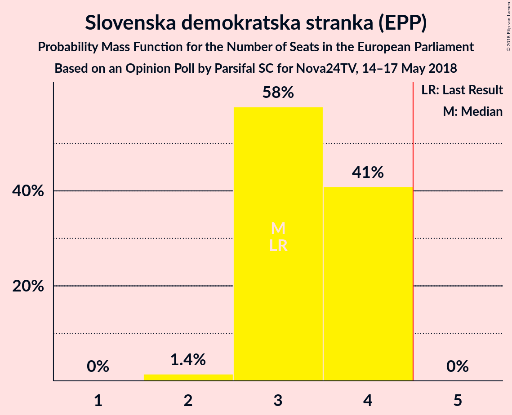
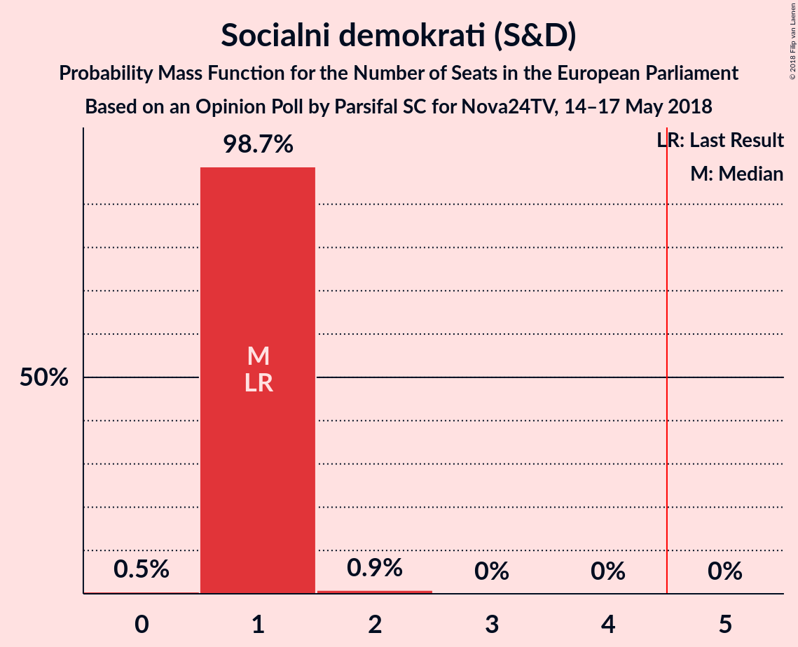
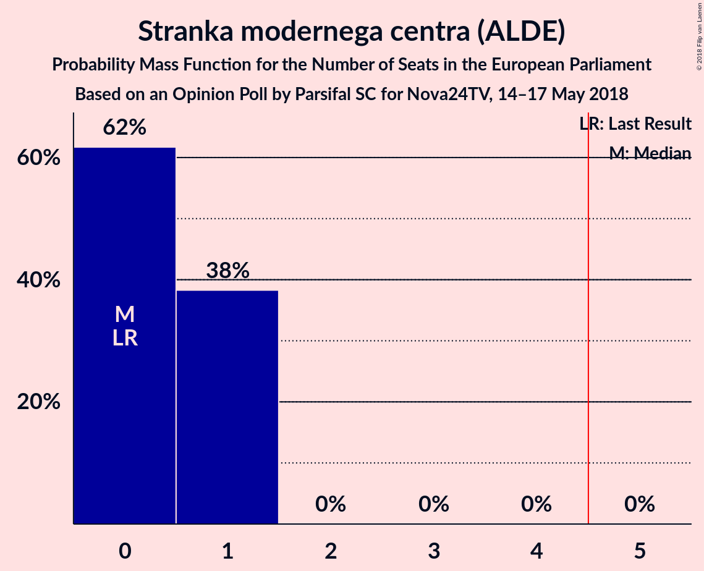
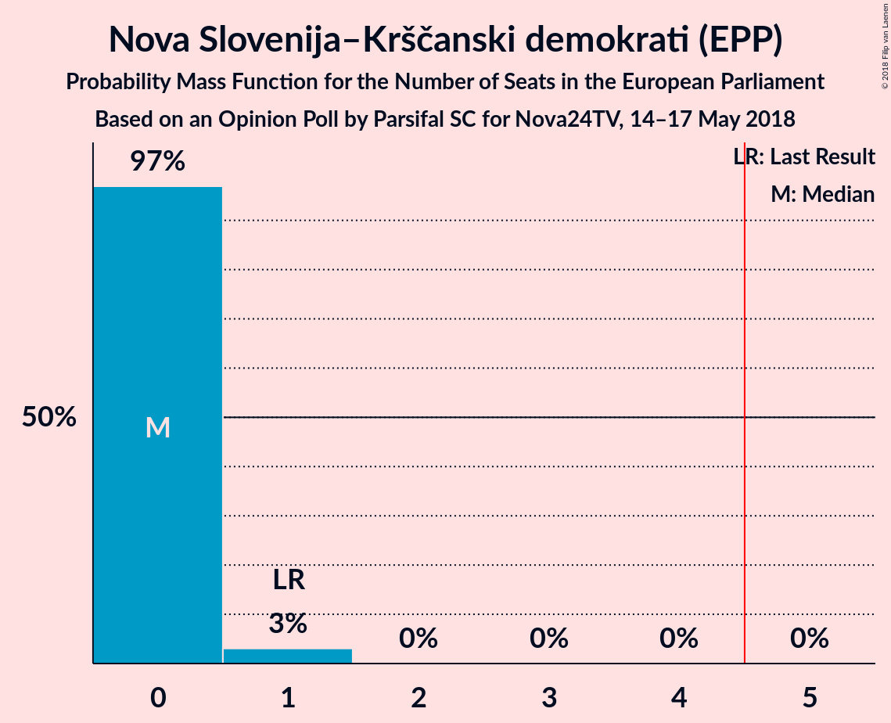
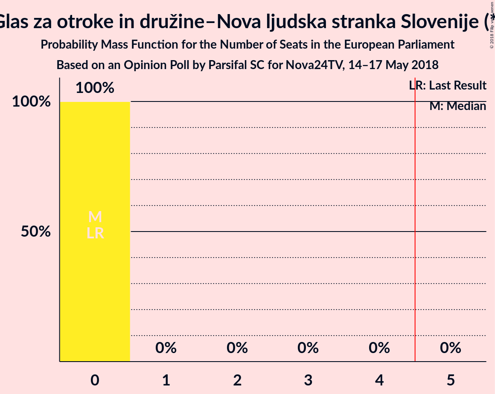
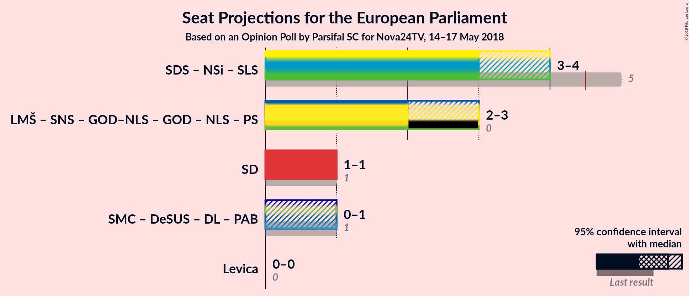

# Opinion Poll by Parsifal SC for Nova24TV, 14–17 May 2018

<a href="#voting-intentions">Voting Intentions</a> | <a href="#seats">Seats</a> | <a href="#coalitions">Coalitions</a> | <a href="#technical-information">Technical Information</a>

## Voting Intentions

### Confidence Intervals

| Party | Last Result | Poll Result | 80% Confidence Interval | 90% Confidence Interval | 95% Confidence Interval | 99% Confidence Interval |
|:-----:|:-----------:|:-----------:|:-----------------------:|:-----------------------:|:-----------------------:|:-----------------------:|
| Slovenska demokratska stranka (EPP) | 24.8% | 25.8% | 23.4–28.5% |22.7–29.3% |22.1–29.9% |21.0–31.2% |
| Lista Marjana Šarca (ALDE) | 0.0% | 18.3% | 16.2–20.8% |15.6–21.4% |15.1–22.1% |14.2–23.3% |
| Socialni demokrati (S&D) | 8.1% | 10.2% | 8.6–12.2% |8.2–12.8% |7.8–13.2% |7.1–14.3% |
| Stranka modernega centra (ALDE) | 0.0% | 6.5% | 5.2–8.1% |4.9–8.6% |4.6–9.0% |4.1–9.9% |
| Demokratična stranka upokojencev Slovenije (ALDE) | 8.2% | 4.8% | 3.7–6.3% |3.5–6.7% |3.2–7.1% |2.8–7.9% |
| Nova Slovenija–Krščanski demokrati (EPP) | 16.5% | 4.6% | 3.6–6.1% |3.3–6.5% |3.0–6.8% |2.6–7.6% |
| Levica (GUE/NGL) | 5.5% | 4.2% | 3.2–5.6% |2.9–6.0% |2.7–6.4% |2.3–7.1% |
| Slovenska nacionalna stranka (*) | 4.0% | 3.8% | 2.9–5.1% |2.6–5.5% |2.4–5.9% |2.0–6.6% |
| Državljanska lista (ALDE) | 1.1% | 3.5% | 2.7–4.9% |2.4–5.3% |2.2–5.6% |1.9–6.3% |
| Slovenska ljudska stranka (EPP) | 16.5% | 2.1% | 1.5–3.2% |1.3–3.5% |1.1–3.8% |0.9–4.4% |
| Stranka Alenke Bratušek (ALDE) | 0.0% | 1.9% | 1.3–2.9% |1.1–3.2% |1.0–3.5% |0.8–4.1% |
| Glas za otroke in družine–Nova ljudska stranka Slovenije (*) | 0.0% | 1.9% | 1.3–2.9% |1.1–3.2% |1.0–3.5% |0.8–4.1% |

*Note:* The poll result column reflects the actual value used in the calculations. Published results may vary slightly, and in addition be rounded to fewer digits.

## Seats

### Confidence Intervals

| Party | Last Result | Median | 80% Confidence Interval | 90% Confidence Interval | 95% Confidence Interval | 99% Confidence Interval |
|:-----:|:-----------:|:------:|:-----------------------:|:-----------------------:|:-----------------------:|:-----------------------:|
| <a href="#slovenska-demokratska-stranka-(epp)">Slovenska demokratska stranka (EPP)</a> | 3 | 3 | 3–4 |3–4 |3–4 |2–4 |
| <a href="#lista-marjana-šarca-(alde)">Lista Marjana Šarca (ALDE)</a> | 0 | 2 | 2 |2–3 |2–3 |1–3 |
| <a href="#socialni-demokrati-(s&d)">Socialni demokrati (S&D)</a> | 1 | 1 | 1 |1 |1 |1–2 |
| <a href="#stranka-modernega-centra-(alde)">Stranka modernega centra (ALDE)</a> | 0 | 0 | 0–1 |0–1 |0–1 |0–1 |
| <a href="#demokratična-stranka-upokojencev-slovenije-(alde)">Demokratična stranka upokojencev Slovenije (ALDE)</a> | 1 | 0 | 0 |0 |0–1 |0–1 |
| <a href="#nova-slovenija–krščanski-demokrati-(epp)">Nova Slovenija–Krščanski demokrati (EPP)</a> | 1 | 0 | 0 |0 |0–1 |0–1 |
| <a href="#levica-(gue/ngl)">Levica (GUE/NGL)</a> | 0 | 0 | 0 |0 |0 |0–1 |
| <a href="#slovenska-nacionalna-stranka-(*)">Slovenska nacionalna stranka (*)</a> | 0 | 0 | 0 |0 |0 |0 |
| <a href="#državljanska-lista-(alde)">Državljanska lista (ALDE)</a> | 0 | 0 | 0 |0 |0 |0 |
| <a href="#slovenska-ljudska-stranka-(epp)">Slovenska ljudska stranka (EPP)</a> | 1 | 0 | 0 |0 |0 |0 |
| <a href="#stranka-alenke-bratušek-(alde)">Stranka Alenke Bratušek (ALDE)</a> | 0 | 0 | 0 |0 |0 |0 |
| <a href="#glas-za-otroke-in-družine–nova-ljudska-stranka-slovenije-(*)">Glas za otroke in družine–Nova ljudska stranka Slovenije (*)</a> | 0 | 0 | 0 |0 |0 |0 |

### Slovenska demokratska stranka (EPP)

*For a full overview of the results for this party, see the [Slovenska demokratska stranka (EPP)](party-slovenskademokratskastrankaepp.html) page.*

| Number of Seats | Probability | Accumulated | Special Marks |
|:---------------:|:-----------:|:-----------:|:-------------:|
| 2 | 1.4% | 100% |  |
| 3 | 58% | 98.6% | Last Result, Median |
| 4 | 41% | 41% |  |
| 5 | 0% | 0% | Majority |

### Lista Marjana Šarca (ALDE)

*For a full overview of the results for this party, see the [Lista Marjana Šarca (ALDE)](party-listamarjanašarcaalde.html) page.*

| Number of Seats | Probability | Accumulated | Special Marks |
|:---------------:|:-----------:|:-----------:|:-------------:|
| 0 | 0% | 100% | Last Result |
| 1 | 0.5% | 100% |  |
| 2 | 94% | 99.5% | Median |
| 3 | 5% | 5% |  |
| 4 | 0% | 0% |  |

### Socialni demokrati (S&D)

*For a full overview of the results for this party, see the [Socialni demokrati (S&D)](party-socialnidemokratisd.html) page.*

| Number of Seats | Probability | Accumulated | Special Marks |
|:---------------:|:-----------:|:-----------:|:-------------:|
| 0 | 0.5% | 100% |  |
| 1 | 98.7% | 99.5% | Last Result, Median |
| 2 | 0.9% | 0.9% |  |
| 3 | 0% | 0% |  |

### Stranka modernega centra (ALDE)

*For a full overview of the results for this party, see the [Stranka modernega centra (ALDE)](party-strankamodernegacentraalde.html) page.*

| Number of Seats | Probability | Accumulated | Special Marks |
|:---------------:|:-----------:|:-----------:|:-------------:|
| 0 | 62% | 100% | Last Result, Median |
| 1 | 38% | 38% |  |
| 2 | 0% | 0% |  |

### Demokratična stranka upokojencev Slovenije (ALDE)

*For a full overview of the results for this party, see the [Demokratična stranka upokojencev Slovenije (ALDE)](party-demokratičnastrankaupokojencevslovenijealde.html) page.*

| Number of Seats | Probability | Accumulated | Special Marks |
|:---------------:|:-----------:|:-----------:|:-------------:|
| 0 | 97% | 100% | Median |
| 1 | 3% | 3% | Last Result |
| 2 | 0% | 0% |  |

### Nova Slovenija–Krščanski demokrati (EPP)

*For a full overview of the results for this party, see the [Nova Slovenija–Krščanski demokrati (EPP)](party-novaslovenija–krščanskidemokratiepp.html) page.*

| Number of Seats | Probability | Accumulated | Special Marks |
|:---------------:|:-----------:|:-----------:|:-------------:|
| 0 | 97% | 100% | Median |
| 1 | 3% | 3% | Last Result |
| 2 | 0% | 0% |  |

### Levica (GUE/NGL)

*For a full overview of the results for this party, see the [Levica (GUE/NGL)](party-levicaguengl.html) page.*

| Number of Seats | Probability | Accumulated | Special Marks |
|:---------------:|:-----------:|:-----------:|:-------------:|
| 0 | 99.2% | 100% | Last Result, Median |
| 1 | 0.8% | 0.8% |  |
| 2 | 0% | 0% |  |

### Slovenska nacionalna stranka (*)

*For a full overview of the results for this party, see the [Slovenska nacionalna stranka (*)](party-slovenskanacionalnastranka.html) page.*

| Number of Seats | Probability | Accumulated | Special Marks |
|:---------------:|:-----------:|:-----------:|:-------------:|
| 0 | 99.8% | 100% | Last Result, Median |
| 1 | 0.2% | 0.2% |  |
| 2 | 0% | 0% |  |

### Državljanska lista (ALDE)

*For a full overview of the results for this party, see the [Državljanska lista (ALDE)](party-državljanskalistaalde.html) page.*

| Number of Seats | Probability | Accumulated | Special Marks |
|:---------------:|:-----------:|:-----------:|:-------------:|
| 0 | 99.9% | 100% | Last Result, Median |
| 1 | 0.1% | 0.1% |  |
| 2 | 0% | 0% |  |

### Slovenska ljudska stranka (EPP)

*For a full overview of the results for this party, see the [Slovenska ljudska stranka (EPP)](party-slovenskaljudskastrankaepp.html) page.*

| Number of Seats | Probability | Accumulated | Special Marks |
|:---------------:|:-----------:|:-----------:|:-------------:|
| 0 | 100% | 100% | Median |
| 1 | 0% | 0% | Last Result |

### Stranka Alenke Bratušek (ALDE)

*For a full overview of the results for this party, see the [Stranka Alenke Bratušek (ALDE)](party-strankaalenkebratušekalde.html) page.*

| Number of Seats | Probability | Accumulated | Special Marks |
|:---------------:|:-----------:|:-----------:|:-------------:|
| 0 | 100% | 100% | Last Result, Median |

### Glas za otroke in družine–Nova ljudska stranka Slovenije (*)

*For a full overview of the results for this party, see the [Glas za otroke in družine–Nova ljudska stranka Slovenije (*)](party-glaszaotrokeindružine–novaljudskastrankaslovenije.html) page.*

| Number of Seats | Probability | Accumulated | Special Marks |
|:---------------:|:-----------:|:-----------:|:-------------:|
| 0 | 100% | 100% | Last Result, Median |

## Coalitions

### Confidence Intervals

| Coalition | Last Result | Median | Majority? | 80% Confidence Interval | 90% Confidence Interval | 95% Confidence Interval | 99% Confidence Interval |
|:---------:|:-----------:|:------:|:---------:|:-----------------------:|:-----------------------:|:-----------------------:|:-----------------------:|
| Slovenska demokratska stranka (EPP) – Nova Slovenija–Krščanski demokrati (EPP) – Slovenska ljudska stranka (EPP) | 5 | 3 | 0% | 3–4 | 3–4 | 3–4 | 2–4 |
| Socialni demokrati (S&D) | 1 | 1 | 0% | 1 | 1 | 1 | 1–2 |
| Stranka modernega centra (ALDE) – Demokratična stranka upokojencev Slovenije (ALDE) – Državljanska lista (ALDE) – Stranka Alenke Bratušek (ALDE) | 1 | 0 | 0% | 0–1 | 0–1 | 0–1 | 0–1 |
| Levica (GUE/NGL) | 0 | 0 | 0% | 0 | 0 | 0 | 0–1 |

### Slovenska demokratska stranka (EPP) – Nova Slovenija–Krščanski demokrati (EPP) – Slovenska ljudska stranka (EPP)

| Number of Seats | Probability | Accumulated | Special Marks |
|:---------------:|:-----------:|:-----------:|:-------------:|
| 2 | 1.2% | 100% |  |
| 3 | 55% | 98.8% | Median |
| 4 | 44% | 44% |  |
| 5 | 0% | 0% | Last Result, Majority |

### Socialni demokrati (S&D)

| Number of Seats | Probability | Accumulated | Special Marks |
|:---------------:|:-----------:|:-----------:|:-------------:|
| 0 | 0.5% | 100% |  |
| 1 | 98.7% | 99.5% | Last Result, Median |
| 2 | 0.9% | 0.9% |  |
| 3 | 0% | 0% |  |

### Stranka modernega centra (ALDE) – Demokratična stranka upokojencev Slovenije (ALDE) – Državljanska lista (ALDE) – Stranka Alenke Bratušek (ALDE)

| Number of Seats | Probability | Accumulated | Special Marks |
|:---------------:|:-----------:|:-----------:|:-------------:|
| 0 | 59% | 100% | Median |
| 1 | 41% | 41% | Last Result |
| 2 | 0.2% | 0.2% |  |
| 3 | 0% | 0% |  |

### Levica (GUE/NGL)

| Number of Seats | Probability | Accumulated | Special Marks |
|:---------------:|:-----------:|:-----------:|:-------------:|
| 0 | 99.2% | 100% | Last Result, Median |
| 1 | 0.8% | 0.8% |  |
| 2 | 0% | 0% |  |

## Technical Information

### Opinion Poll

+ **Polling firm:** Parsifal SC
+ **Commissioner(s):** Nova24TV
+ **Fieldwork period:** 14–17 May 2018

### Calculations

+ **Sample size:** 480
+ **Simulations done:** 1,048,576
+ **Error estimate:** 2.93%

