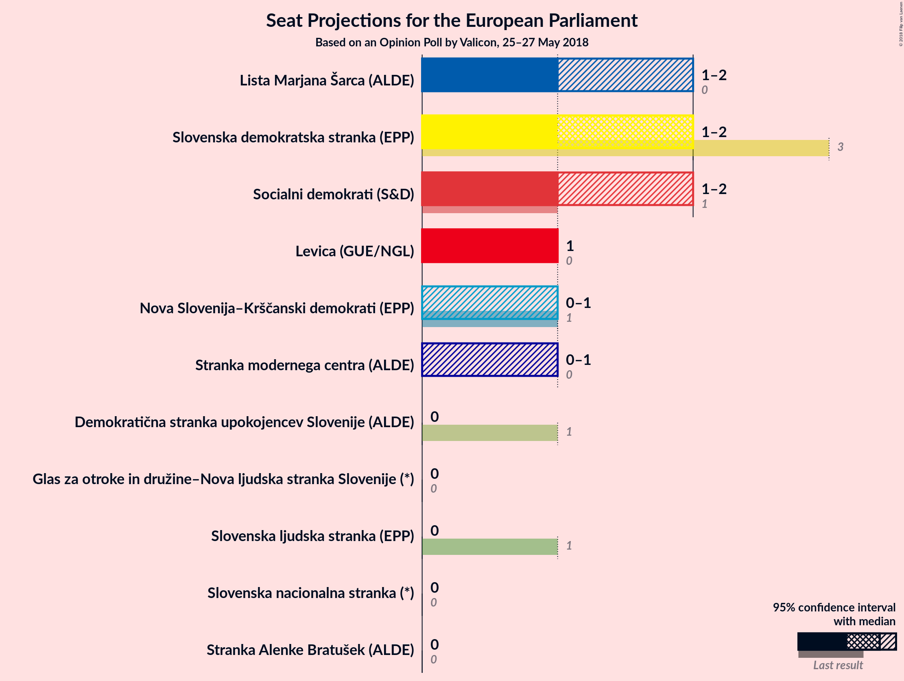

# Opinion Poll by Valicon, 25–27 May 2018

<a href="#voting-intentions">Voting Intentions</a> | <a href="#seats">Seats</a> | <a href="#coalitions">Coalitions</a> | <a href="#technical-information">Technical Information</a>

## Voting Intentions

### Confidence Intervals

| Party | Last Result | Poll Result | 80% Confidence Interval | 90% Confidence Interval | 95% Confidence Interval | 99% Confidence Interval |
|:-----:|:-----------:|:-----------:|:-----------------------:|:-----------------------:|:-----------------------:|:-----------------------:|
| Slovenska demokratska stranka (EPP) | 24.8% | 17.2% | 16.7–17.9% |16.5–18.1% |16.3–18.2% |16.1–18.5% |
| Lista Marjana Šarca (*) | 0.0% | 13.8% | N/A |N/A |N/A |N/A |
| Socialni demokrati (S&D) | 8.1% | 11.9% | 11.4–12.4% |11.2–12.6% |11.1–12.7% |10.9–13.0% |
| Levica (GUE/NGL) | 5.5% | 9.8% | 9.3–10.3% |9.2–10.4% |9.1–10.5% |8.8–10.8% |
| Nova Slovenija–Krščanski demokrati (EPP) | 16.5% | 5.7% | 5.3–6.0% |5.2–6.1% |5.1–6.2% |4.9–6.4% |
| Stranka modernega centra (ALDE) | 0.0% | 5.5% | 5.2–5.9% |5.0–6.0% |5.0–6.1% |4.8–6.3% |
| Slovenska nacionalna stranka (*) | 4.0% | 5.0% | N/A |N/A |N/A |N/A |
| Demokratična stranka upokojencev Slovenije (ALDE) | 8.2% | 4.7% | 4.4–5.1% |4.3–5.2% |4.3–5.3% |4.1–5.5% |
| Stranka Alenke Bratušek (ALDE) | 0.0% | 3.3% | 3.0–3.6% |2.9–3.6% |2.8–3.7% |2.7–3.9% |
| Slovenska ljudska stranka (EPP) | 16.5% | 2.8% | N/A |N/A |N/A |N/A |
| Glas za otroke in družine–Nova ljudska stranka Slovenije (*) | 0.0% | 0.7% | N/A |N/A |N/A |N/A |

*Note:* The poll result column reflects the actual value used in the calculations. Published results may vary slightly, and in addition be rounded to fewer digits.

## Seats

### Confidence Intervals

| Party | Last Result | Median | 80% Confidence Interval | 90% Confidence Interval | 95% Confidence Interval | 99% Confidence Interval |
|:-----:|:-----------:|:------:|:-----------------------:|:-----------------------:|:-----------------------:|:-----------------------:|
| <a href="#slovenska-demokratska-stranka-(epp)">Slovenska demokratska stranka (EPP)</a> | 3 | N/A | N/A |N/A |N/A |N/A |
| <a href="#lista-marjana-šarca-(*)">Lista Marjana Šarca (*)</a> | 0 | N/A | N/A |N/A |N/A |N/A |
| <a href="#socialni-demokrati-(s&d)">Socialni demokrati (S&D)</a> | 1 | N/A | N/A |N/A |N/A |N/A |
| <a href="#levica-(gue/ngl)">Levica (GUE/NGL)</a> | 0 | N/A | N/A |N/A |N/A |N/A |
| <a href="#nova-slovenija–krščanski-demokrati-(epp)">Nova Slovenija–Krščanski demokrati (EPP)</a> | 1 | N/A | N/A |N/A |N/A |N/A |
| <a href="#stranka-modernega-centra-(alde)">Stranka modernega centra (ALDE)</a> | 0 | N/A | N/A |N/A |N/A |N/A |
| <a href="#slovenska-nacionalna-stranka-(*)">Slovenska nacionalna stranka (*)</a> | 0 | N/A | N/A |N/A |N/A |N/A |
| <a href="#demokratična-stranka-upokojencev-slovenije-(alde)">Demokratična stranka upokojencev Slovenije (ALDE)</a> | 1 | N/A | N/A |N/A |N/A |N/A |
| <a href="#stranka-alenke-bratušek-(alde)">Stranka Alenke Bratušek (ALDE)</a> | 0 | N/A | N/A |N/A |N/A |N/A |
| <a href="#slovenska-ljudska-stranka-(epp)">Slovenska ljudska stranka (EPP)</a> | 1 | N/A | N/A |N/A |N/A |N/A |
| <a href="#glas-za-otroke-in-družine–nova-ljudska-stranka-slovenije-(*)">Glas za otroke in družine–Nova ljudska stranka Slovenije (*)</a> | 0 | N/A | N/A |N/A |N/A |N/A |

## Coalitions

## Technical Information

### Opinion Poll

+ **Polling firm:** Valicon
+ **Commissioner(s):** —
+ **Fieldwork period:** 25–27 May 2018

### Calculations

+ **Sample size:** 615
+ **Simulations done:** 0
+ **Error estimate:** 100.00%

