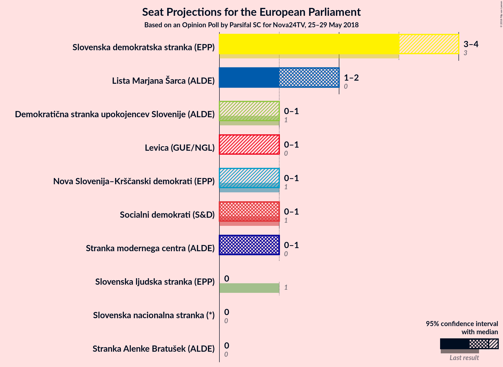

# Opinion Poll by Parsifal SC for Nova24TV, 25–29 May 2018

<a href="#voting-intentions">Voting Intentions</a> | <a href="#seats">Seats</a> | <a href="#coalitions">Coalitions</a> | <a href="#technical-information">Technical Information</a>

## Voting Intentions

### Confidence Intervals

| Party | Last Result | Poll Result | 80% Confidence Interval | 90% Confidence Interval | 95% Confidence Interval | 99% Confidence Interval |
|:-----:|:-----------:|:-----------:|:-----------------------:|:-----------------------:|:-----------------------:|:-----------------------:|
| Slovenska demokratska stranka (EPP) | 24.8% | 28.7% | N/A |N/A |N/A |N/A |
| Lista Marjana Šarca (*) | 0.0% | 14.8% | N/A |N/A |N/A |N/A |
| Socialni demokrati (S&D) | 8.1% | 7.9% | N/A |N/A |N/A |N/A |
| Stranka modernega centra (ALDE) | 0.0% | 7.5% | N/A |N/A |N/A |N/A |
| Nova Slovenija–Krščanski demokrati (EPP) | 16.5% | 7.3% | N/A |N/A |N/A |N/A |
| Demokratična stranka upokojencev Slovenije (ALDE) | 8.2% | 6.1% | N/A |N/A |N/A |N/A |
| Levica (GUE/NGL) | 5.5% | 5.9% | N/A |N/A |N/A |N/A |
| Slovenska nacionalna stranka (*) | 4.0% | 4.7% | N/A |N/A |N/A |N/A |
| Slovenska ljudska stranka (EPP) | 16.5% | 3.5% | N/A |N/A |N/A |N/A |
| Stranka Alenke Bratušek (ALDE) | 0.0% | 1.5% | N/A |N/A |N/A |N/A |

*Note:* The poll result column reflects the actual value used in the calculations. Published results may vary slightly, and in addition be rounded to fewer digits.

## Seats

### Confidence Intervals

| Party | Last Result | Median | 80% Confidence Interval | 90% Confidence Interval | 95% Confidence Interval | 99% Confidence Interval |
|:-----:|:-----------:|:------:|:-----------------------:|:-----------------------:|:-----------------------:|:-----------------------:|
| <a href="#slovenska-demokratska-stranka-(epp)">Slovenska demokratska stranka (EPP)</a> | 3 | N/A | N/A |N/A |N/A |N/A |
| <a href="#lista-marjana-šarca-(*)">Lista Marjana Šarca (*)</a> | 0 | N/A | N/A |N/A |N/A |N/A |
| <a href="#socialni-demokrati-(s&d)">Socialni demokrati (S&D)</a> | 1 | N/A | N/A |N/A |N/A |N/A |
| <a href="#stranka-modernega-centra-(alde)">Stranka modernega centra (ALDE)</a> | 0 | N/A | N/A |N/A |N/A |N/A |
| <a href="#nova-slovenija–krščanski-demokrati-(epp)">Nova Slovenija–Krščanski demokrati (EPP)</a> | 1 | N/A | N/A |N/A |N/A |N/A |
| <a href="#demokratična-stranka-upokojencev-slovenije-(alde)">Demokratična stranka upokojencev Slovenije (ALDE)</a> | 1 | N/A | N/A |N/A |N/A |N/A |
| <a href="#levica-(gue/ngl)">Levica (GUE/NGL)</a> | 0 | N/A | N/A |N/A |N/A |N/A |
| <a href="#slovenska-nacionalna-stranka-(*)">Slovenska nacionalna stranka (*)</a> | 0 | N/A | N/A |N/A |N/A |N/A |
| <a href="#slovenska-ljudska-stranka-(epp)">Slovenska ljudska stranka (EPP)</a> | 1 | N/A | N/A |N/A |N/A |N/A |
| <a href="#stranka-alenke-bratušek-(alde)">Stranka Alenke Bratušek (ALDE)</a> | 0 | N/A | N/A |N/A |N/A |N/A |

## Coalitions

## Technical Information

### Opinion Poll

+ **Polling firm:** Parsifal SC
+ **Commissioner(s):** Nova24TV
+ **Fieldwork period:** 25–29 May 2018

### Calculations

+ **Sample size:** 656
+ **Simulations done:** 0
+ **Error estimate:** 100.00%

