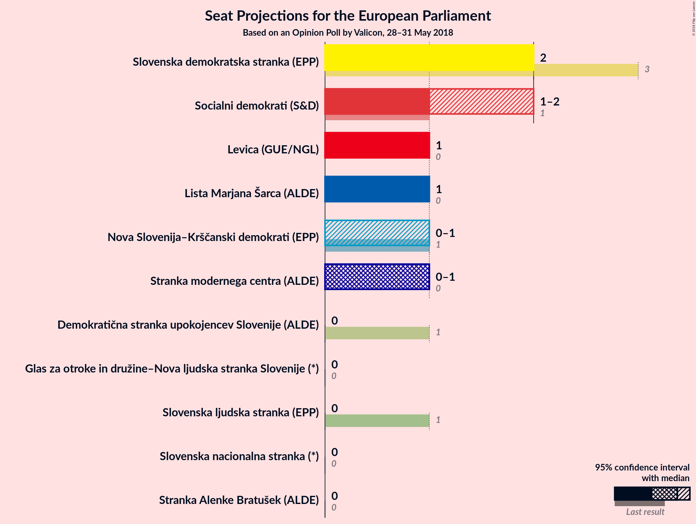
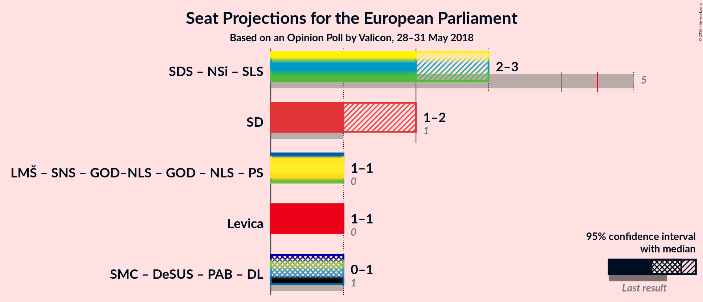

# Opinion Poll by Valicon, 28–31 May 2018

<a href="#voting-intentions">Voting Intentions</a> | <a href="#seats">Seats</a> | <a href="#coalitions">Coalitions</a> | <a href="#technical-information">Technical Information</a>

## Voting Intentions

### Confidence Intervals

| Party | Last Result | Poll Result | 80% Confidence Interval | 90% Confidence Interval | 95% Confidence Interval | 99% Confidence Interval |
|:-----:|:-----------:|:-----------:|:-----------------------:|:-----------------------:|:-----------------------:|:-----------------------:|
| Slovenska demokratska stranka (EPP) | 24.8% | 17.3% | 16.0–18.5% |15.6–18.9% |15.6–19.3% |15.2–19.8% |
| Socialni demokrati (S&D) | 8.1% | 13.2% | 11.9–14.4% |11.9–14.8% |11.5–14.8% |11.1–15.6% |
| Lista Marjana Šarca (*) | 0.0% | 12.3% | 11.1–13.6% |11.1–13.6% |10.7–14.0% |10.3–14.4% |
| Levica (GUE/NGL) | 5.5% | 9.1% | 8.2–10.3% |7.8–10.3% |7.8–10.7% |7.4–11.1% |
| Stranka modernega centra (ALDE) | 0.0% | 8.1% | 7.4–9.1% |7.0–9.5% |7.0–9.5% |6.6–9.9% |
| Nova Slovenija–Krščanski demokrati (EPP) | 16.5% | 7.1% | 6.2–8.2% |6.2–8.2% |5.8–8.6% |5.8–9.1% |
| Demokratična stranka upokojencev Slovenije (ALDE) | 8.2% | 4.8% | 4.1–5.8% |4.1–5.8% |3.7–6.2% |3.7–6.6% |
| Stranka Alenke Bratušek (ALDE) | 0.0% | 4.4% | 3.7–5.3% |3.7–5.3% |3.3–5.3% |3.3–5.8% |
| Slovenska nacionalna stranka (*) | 4.0% | 3.8% | 3.3–4.5% |2.9–4.5% |2.9–4.9% |2.5–5.3% |
| Slovenska ljudska stranka (EPP) | 16.5% | 2.9% | 2.1–3.7% |2.1–3.7% |2.1–3.7% |2.1–4.1% |
| Glas za otroke in družine–Nova ljudska stranka Slovenije (*) | 0.0% | 0.5% | 0.0–0.8% |0.0–0.8% |0.0–0.8% |0.0–1.2% |

*Note:* The poll result column reflects the actual value used in the calculations. Published results may vary slightly, and in addition be rounded to fewer digits.

## Seats

### Confidence Intervals

| Party | Last Result | Median | 80% Confidence Interval | 90% Confidence Interval | 95% Confidence Interval | 99% Confidence Interval |
|:-----:|:-----------:|:------:|:-----------------------:|:-----------------------:|:-----------------------:|:-----------------------:|
| <a href="#slovenska-demokratska-stranka-(epp)">Slovenska demokratska stranka (EPP)</a> | 3 | N/A | N/A |N/A |N/A |N/A |
| <a href="#socialni-demokrati-(s&d)">Socialni demokrati (S&D)</a> | 1 | N/A | N/A |N/A |N/A |N/A |
| <a href="#lista-marjana-šarca-(*)">Lista Marjana Šarca (*)</a> | 0 | N/A | N/A |N/A |N/A |N/A |
| <a href="#levica-(gue/ngl)">Levica (GUE/NGL)</a> | 0 | N/A | N/A |N/A |N/A |N/A |
| <a href="#stranka-modernega-centra-(alde)">Stranka modernega centra (ALDE)</a> | 0 | N/A | N/A |N/A |N/A |N/A |
| <a href="#nova-slovenija–krščanski-demokrati-(epp)">Nova Slovenija–Krščanski demokrati (EPP)</a> | 1 | N/A | N/A |N/A |N/A |N/A |
| <a href="#demokratična-stranka-upokojencev-slovenije-(alde)">Demokratična stranka upokojencev Slovenije (ALDE)</a> | 1 | N/A | N/A |N/A |N/A |N/A |
| <a href="#stranka-alenke-bratušek-(alde)">Stranka Alenke Bratušek (ALDE)</a> | 0 | N/A | N/A |N/A |N/A |N/A |
| <a href="#slovenska-nacionalna-stranka-(*)">Slovenska nacionalna stranka (*)</a> | 0 | N/A | N/A |N/A |N/A |N/A |
| <a href="#slovenska-ljudska-stranka-(epp)">Slovenska ljudska stranka (EPP)</a> | 1 | N/A | N/A |N/A |N/A |N/A |
| <a href="#glas-za-otroke-in-družine–nova-ljudska-stranka-slovenije-(*)">Glas za otroke in družine–Nova ljudska stranka Slovenije (*)</a> | 0 | N/A | N/A |N/A |N/A |N/A |

## Coalitions

## Technical Information

### Opinion Poll

+ **Polling firm:** Valicon
+ **Commissioner(s):** —
+ **Fieldwork period:** 28–31 May 2018

### Calculations

+ **Sample size:** 1964
+ **Simulations done:** 0
+ **Error estimate:** 100.00%

