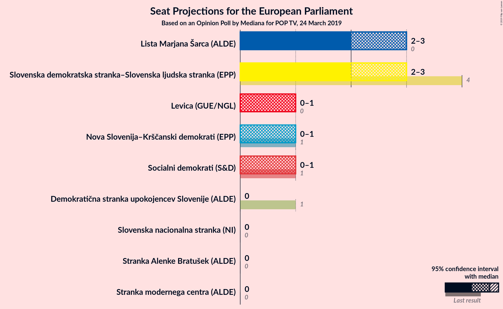
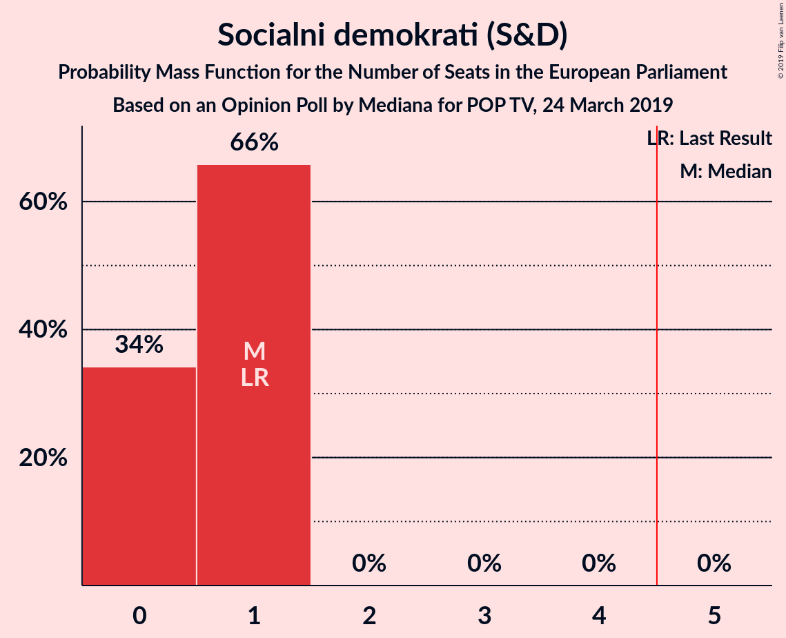
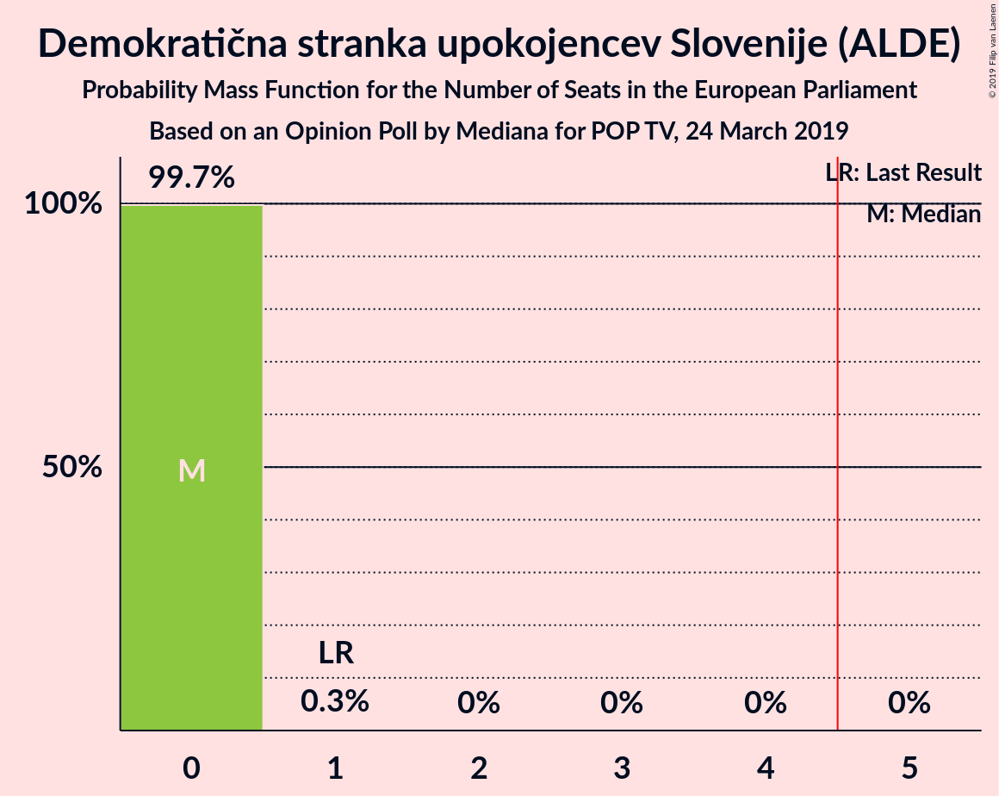
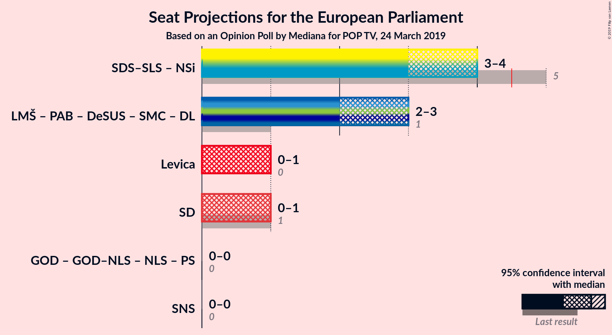
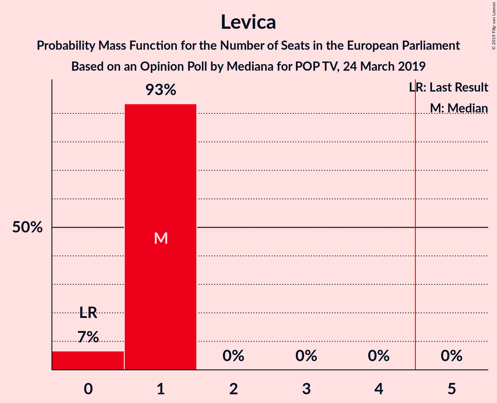
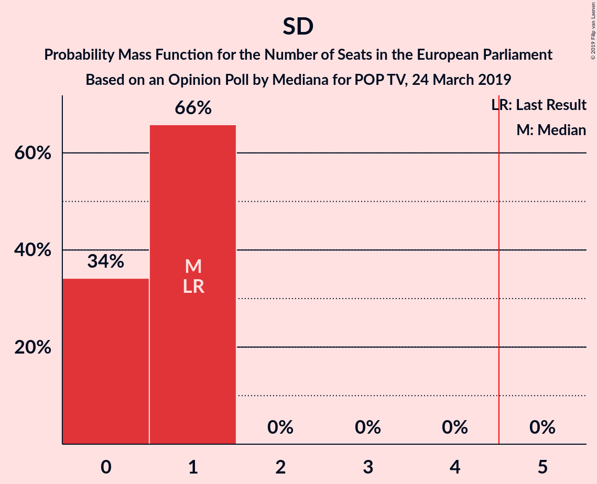

# Opinion Poll by Mediana for POP TV, 24 March 2019

<a href="#voting-intentions">Voting Intentions</a> | <a href="#seats">Seats</a> | <a href="#coalitions">Coalitions</a> | <a href="#technical-information">Technical Information</a>

## Voting Intentions

### Confidence Intervals

| Party | Last Result | Poll Result | 80% Confidence Interval | 90% Confidence Interval | 95% Confidence Interval | 99% Confidence Interval |
|:-----:|:-----------:|:-----------:|:-----------------------:|:-----------------------:|:-----------------------:|:-----------------------:|
| Slovenska demokratska stranka–Slovenska ljudska stranka (EPP) | 24.8% | 25.1% | 22.9–27.6% |22.3–28.2% |21.7–28.9% |20.7–30.0% |
| Lista Marjana Šarca (ALDE) | 0.0% | 23.9% | 21.7–26.3% |21.1–27.0% |20.6–27.6% |19.6–28.7% |
| Levica (GUE/NGL) | 5.5% | 9.4% | 8.0–11.2% |7.6–11.7% |7.3–12.1% |6.7–13.0% |
| Nova Slovenija–Krščanski demokrati (EPP) | 16.5% | 9.4% | 8.0–11.2% |7.6–11.7% |7.3–12.1% |6.7–13.0% |
| Socialni demokrati (S&D) | 8.1% | 8.2% | 6.9–9.9% |6.5–10.3% |6.2–10.7% |5.7–11.6% |
| Stranka Alenke Bratušek (ALDE) | 0.0% | 5.1% | 4.1–6.4% |3.8–6.8% |3.6–7.2% |3.1–7.9% |
| Demokratična stranka upokojencev Slovenije (ALDE) | 8.2% | 4.7% | 3.7–6.1% |3.5–6.4% |3.3–6.8% |2.9–7.5% |
| Stranka modernega centra (ALDE) | 0.0% | 4.5% | 3.6–5.9% |3.3–6.2% |3.1–6.6% |2.7–7.3% |
| Slovenska nacionalna stranka (NI) | 4.0% | 4.0% | 3.1–5.3% |2.9–5.6% |2.7–6.0% |2.3–6.6% |

*Note:* The poll result column reflects the actual value used in the calculations. Published results may vary slightly, and in addition be rounded to fewer digits.

## Seats

### Confidence Intervals

| Party | Last Result | Median | 80% Confidence Interval | 90% Confidence Interval | 95% Confidence Interval | 99% Confidence Interval |
|:-----:|:-----------:|:------:|:-----------------------:|:-----------------------:|:-----------------------:|:-----------------------:|
| <a href="#slovenska-demokratska-stranka–slovenska-ljudska-stranka-(epp)">Slovenska demokratska stranka–Slovenska ljudska stranka (EPP)</a> | 4 | 3 | 2–3 |2–3 |2–3 |2–3 |
| <a href="#lista-marjana-šarca-(alde)">Lista Marjana Šarca (ALDE)</a> | 0 | 3 | 2–3 |2–3 |2–3 |2–3 |
| <a href="#levica-(gue/ngl)">Levica (GUE/NGL)</a> | 0 | 1 | 1 |0–1 |0–1 |0–1 |
| <a href="#nova-slovenija–krščanski-demokrati-(epp)">Nova Slovenija–Krščanski demokrati (EPP)</a> | 1 | 1 | 1 |0–1 |0–1 |0–1 |
| <a href="#socialni-demokrati-(s&d)">Socialni demokrati (S&D)</a> | 1 | 1 | 0–1 |0–1 |0–1 |0–1 |
| <a href="#stranka-alenke-bratušek-(alde)">Stranka Alenke Bratušek (ALDE)</a> | 0 | 0 | 0 |0 |0 |0–1 |
| <a href="#demokratična-stranka-upokojencev-slovenije-(alde)">Demokratična stranka upokojencev Slovenije (ALDE)</a> | 1 | 0 | 0 |0 |0 |0 |
| <a href="#stranka-modernega-centra-(alde)">Stranka modernega centra (ALDE)</a> | 0 | 0 | 0 |0 |0 |0 |
| <a href="#slovenska-nacionalna-stranka-(ni)">Slovenska nacionalna stranka (NI)</a> | 0 | 0 | 0 |0 |0 |0 |

### Slovenska demokratska stranka–Slovenska ljudska stranka (EPP)

*For a full overview of the results for this party, see the [Slovenska demokratska stranka–Slovenska ljudska stranka (EPP)](party-slovenskademokratskastranka–slovenskaljudskastrankaepp.html) page.*

| Number of Seats | Probability | Accumulated | Special Marks |
|:---------------:|:-----------:|:-----------:|:-------------:|
| 2 | 18% | 100% |  |
| 3 | 82% | 82% | Median |
| 4 | 0.4% | 0.4% | Last Result |
| 5 | 0% | 0% | Majority |

### Lista Marjana Šarca (ALDE)

*For a full overview of the results for this party, see the [Lista Marjana Šarca (ALDE)](party-listamarjanašarcaalde.html) page.*

| Number of Seats | Probability | Accumulated | Special Marks |
|:---------------:|:-----------:|:-----------:|:-------------:|
| 0 | 0% | 100% | Last Result |
| 1 | 0% | 100% |  |
| 2 | 38% | 100% |  |
| 3 | 62% | 62% | Median |
| 4 | 0.1% | 0.1% |  |
| 5 | 0% | 0% | Majority |

### Levica (GUE/NGL)

*For a full overview of the results for this party, see the [Levica (GUE/NGL)](party-levicaguengl.html) page.*

| Number of Seats | Probability | Accumulated | Special Marks |
|:---------------:|:-----------:|:-----------:|:-------------:|
| 0 | 7% | 100% | Last Result |
| 1 | 93% | 93% | Median |
| 2 | 0% | 0% |  |

### Nova Slovenija–Krščanski demokrati (EPP)

*For a full overview of the results for this party, see the [Nova Slovenija–Krščanski demokrati (EPP)](party-novaslovenija–krščanskidemokratiepp.html) page.*

| Number of Seats | Probability | Accumulated | Special Marks |
|:---------------:|:-----------:|:-----------:|:-------------:|
| 0 | 8% | 100% |  |
| 1 | 92% | 92% | Last Result, Median |
| 2 | 0% | 0% |  |

### Socialni demokrati (S&D)

*For a full overview of the results for this party, see the [Socialni demokrati (S&D)](party-socialnidemokratisd.html) page.*

| Number of Seats | Probability | Accumulated | Special Marks |
|:---------------:|:-----------:|:-----------:|:-------------:|
| 0 | 34% | 100% |  |
| 1 | 66% | 66% | Last Result, Median |
| 2 | 0% | 0% |  |

### Stranka Alenke Bratušek (ALDE)

*For a full overview of the results for this party, see the [Stranka Alenke Bratušek (ALDE)](party-strankaalenkebratušekalde.html) page.*

| Number of Seats | Probability | Accumulated | Special Marks |
|:---------------:|:-----------:|:-----------:|:-------------:|
| 0 | 99.3% | 100% | Last Result, Median |
| 1 | 0.7% | 0.7% |  |
| 2 | 0% | 0% |  |

### Demokratična stranka upokojencev Slovenije (ALDE)

*For a full overview of the results for this party, see the [Demokratična stranka upokojencev Slovenije (ALDE)](party-demokratičnastrankaupokojencevslovenijealde.html) page.*

| Number of Seats | Probability | Accumulated | Special Marks |
|:---------------:|:-----------:|:-----------:|:-------------:|
| 0 | 99.7% | 100% | Median |
| 1 | 0.3% | 0.3% | Last Result |
| 2 | 0% | 0% |  |

### Stranka modernega centra (ALDE)

*For a full overview of the results for this party, see the [Stranka modernega centra (ALDE)](party-strankamodernegacentraalde.html) page.*

| Number of Seats | Probability | Accumulated | Special Marks |
|:---------------:|:-----------:|:-----------:|:-------------:|
| 0 | 99.8% | 100% | Last Result, Median |
| 1 | 0.2% | 0.2% |  |
| 2 | 0% | 0% |  |

### Slovenska nacionalna stranka (NI)

*For a full overview of the results for this party, see the [Slovenska nacionalna stranka (NI)](party-slovenskanacionalnastrankani.html) page.*

| Number of Seats | Probability | Accumulated | Special Marks |
|:---------------:|:-----------:|:-----------:|:-------------:|
| 0 | 100% | 100% | Last Result, Median |

## Coalitions

### Confidence Intervals

| Coalition | Last Result | Median | Majority? | 80% Confidence Interval | 90% Confidence Interval | 95% Confidence Interval | 99% Confidence Interval |
|:---------:|:-----------:|:------:|:---------:|:-----------------------:|:-----------------------:|:-----------------------:|:-----------------------:|
| Slovenska demokratska stranka–Slovenska ljudska stranka (EPP) – Nova Slovenija–Krščanski demokrati (EPP) | 5 | 4 | 0.3% | 3–4 | 3–4 | 3–4 | 3–4 |
| Levica (GUE/NGL) | 0 | 1 | 0% | 1 | 0–1 | 0–1 | 0–1 |
| Socialni demokrati (S&D) | 1 | 1 | 0% | 0–1 | 0–1 | 0–1 | 0–1 |
| Slovenska nacionalna stranka (NI) | 0 | 0 | 0% | 0 | 0 | 0 | 0 |

### Slovenska demokratska stranka–Slovenska ljudska stranka (EPP) – Nova Slovenija–Krščanski demokrati (EPP)

| Number of Seats | Probability | Accumulated | Special Marks |
|:---------------:|:-----------:|:-----------:|:-------------:|
| 2 | 0.1% | 100% |  |
| 3 | 25% | 99.9% |  |
| 4 | 75% | 75% | Median |
| 5 | 0.3% | 0.3% | Last Result, Majority |
| 6 | 0% | 0% |  |

### Levica (GUE/NGL)

| Number of Seats | Probability | Accumulated | Special Marks |
|:---------------:|:-----------:|:-----------:|:-------------:|
| 0 | 7% | 100% | Last Result |
| 1 | 93% | 93% | Median |
| 2 | 0% | 0% |  |

### Socialni demokrati (S&D)

| Number of Seats | Probability | Accumulated | Special Marks |
|:---------------:|:-----------:|:-----------:|:-------------:|
| 0 | 34% | 100% |  |
| 1 | 66% | 66% | Last Result, Median |
| 2 | 0% | 0% |  |

### Slovenska nacionalna stranka (NI)

| Number of Seats | Probability | Accumulated | Special Marks |
|:---------------:|:-----------:|:-----------:|:-------------:|
| 0 | 100% | 100% | Last Result, Median |

## Technical Information

### Opinion Poll

+ **Polling firm:** Mediana
+ **Commissioner(s):** POP TV
+ **Fieldwork period:** 24 March 2019

### Calculations

+ **Sample size:** 573
+ **Simulations done:** 1,048,576
+ **Error estimate:** 1.66%

