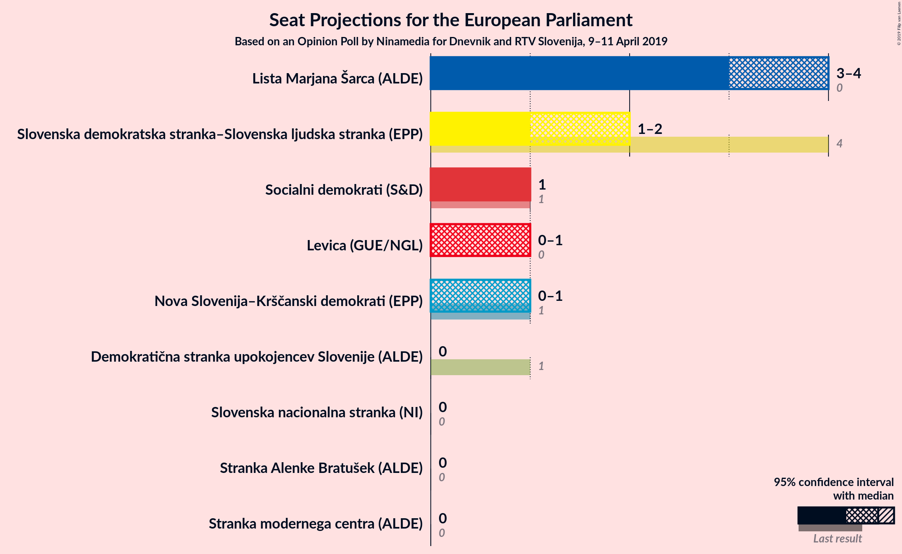
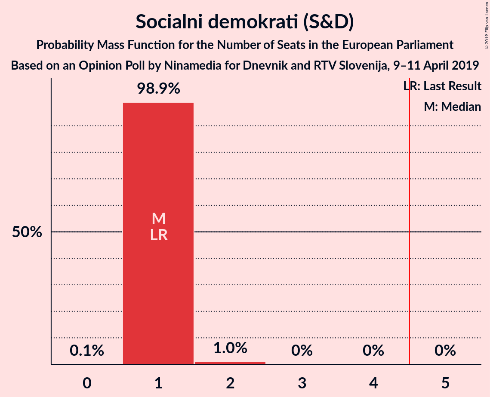
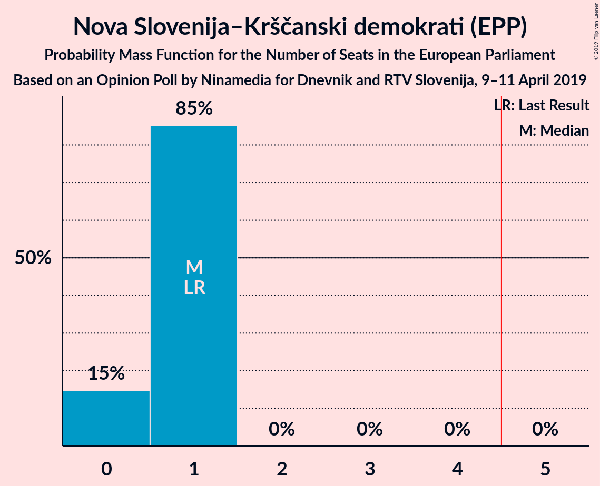
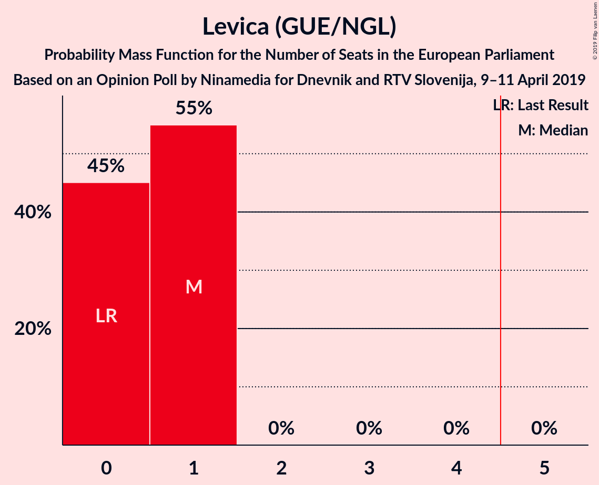
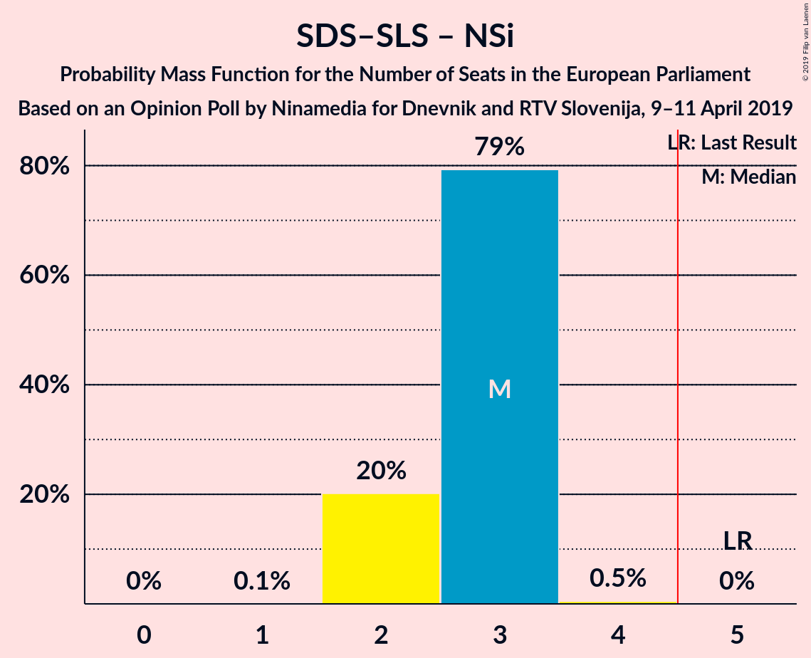
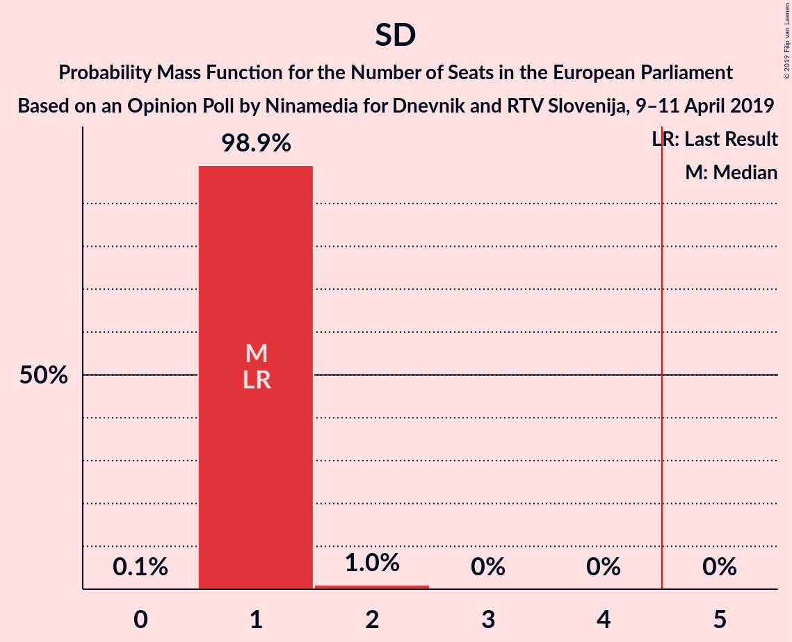

# Opinion Poll by Ninamedia for Dnevnik and RTV Slovenija, 9–11 April 2019

<a href="#voting-intentions">Voting Intentions</a> | <a href="#seats">Seats</a> | <a href="#coalitions">Coalitions</a> | <a href="#technical-information">Technical Information</a>

## Voting Intentions

### Confidence Intervals

| Party | Last Result | Poll Result | 80% Confidence Interval | 90% Confidence Interval | 95% Confidence Interval | 99% Confidence Interval |
|:-----:|:-----------:|:-----------:|:-----------------------:|:-----------------------:|:-----------------------:|:-----------------------:|
| Lista Marjana Šarca (ALDE) | 0.0% | 36.5% | 33.8–39.4% |33.1–40.1% |32.4–40.8% |31.2–42.2% |
| Slovenska demokratska stranka–Slovenska ljudska stranka (EPP) | 24.8% | 20.6% | 18.4–23.0% |17.8–23.7% |17.3–24.3% |16.2–25.5% |
| Socialni demokrati (S&D) | 8.1% | 13.4% | 11.6–15.5% |11.1–16.1% |10.7–16.6% |9.9–17.7% |
| Nova Slovenija–Krščanski demokrati (EPP) | 16.5% | 10.0% | 8.4–11.9% |8.0–12.4% |7.7–12.9% |7.0–13.9% |
| Levica (GUE/NGL) | 5.5% | 9.0% | 7.5–10.8% |7.1–11.4% |6.8–11.8% |6.1–12.8% |
| Demokratična stranka upokojencev Slovenije (ALDE) | 8.2% | 4.4% | 3.4–5.8% |3.1–6.2% |2.9–6.6% |2.5–7.3% |
| Stranka Alenke Bratušek (ALDE) | 0.0% | 2.6% | 1.9–3.8% |1.7–4.1% |1.5–4.4% |1.3–5.0% |
| Slovenska nacionalna stranka (NI) | 4.0% | 2.0% | 1.4–3.1% |1.2–3.4% |1.1–3.6% |0.9–4.2% |
| Stranka modernega centra (ALDE) | 0.0% | 0.6% | 0.3–1.3% |0.3–1.5% |0.2–1.7% |0.1–2.2% |

*Note:* The poll result column reflects the actual value used in the calculations. Published results may vary slightly, and in addition be rounded to fewer digits.

## Seats

### Confidence Intervals

| Party | Last Result | Median | 80% Confidence Interval | 90% Confidence Interval | 95% Confidence Interval | 99% Confidence Interval |
|:-----:|:-----------:|:------:|:-----------------------:|:-----------------------:|:-----------------------:|:-----------------------:|
| <a href="#lista-marjana-šarca-(alde)">Lista Marjana Šarca (ALDE)</a> | 0 | 4 | 4 |4 |4 |4 |
| <a href="#slovenska-demokratska-stranka–slovenska-ljudska-stranka-(epp)">Slovenska demokratska stranka–Slovenska ljudska stranka (EPP)</a> | 4 | 2 | 2 |2 |2 |2 |
| <a href="#socialni-demokrati-(s&d)">Socialni demokrati (S&D)</a> | 1 | 1 | 1 |1 |1 |1 |
| <a href="#nova-slovenija–krščanski-demokrati-(epp)">Nova Slovenija–Krščanski demokrati (EPP)</a> | 1 | 1 | 1 |1 |1 |1 |
| <a href="#levica-(gue/ngl)">Levica (GUE/NGL)</a> | 0 | 0 | 0 |0 |0 |0 |
| <a href="#demokratična-stranka-upokojencev-slovenije-(alde)">Demokratična stranka upokojencev Slovenije (ALDE)</a> | 1 | 0 | 0 |0 |0 |0 |
| <a href="#stranka-alenke-bratušek-(alde)">Stranka Alenke Bratušek (ALDE)</a> | 0 | 0 | 0 |0 |0 |0 |
| <a href="#slovenska-nacionalna-stranka-(ni)">Slovenska nacionalna stranka (NI)</a> | 0 | 0 | 0 |0 |0 |0 |
| <a href="#stranka-modernega-centra-(alde)">Stranka modernega centra (ALDE)</a> | 0 | 0 | 0 |0 |0 |0 |

### Lista Marjana Šarca (ALDE)

*For a full overview of the results for this party, see the [Lista Marjana Šarca (ALDE)](party-listamarjanašarcaalde.html) page.*

| Number of Seats | Probability | Accumulated | Special Marks |
|:---------------:|:-----------:|:-----------:|:-------------:|
| 0 | 0% | 100% | Last Result |
| 1 | 0% | 100% |  |
| 2 | 0% | 100% |  |
| 3 | 0.1% | 100% |  |
| 4 | 99.9% | 99.9% | Median |
| 5 | 0% | 0% | Majority |

### Slovenska demokratska stranka–Slovenska ljudska stranka (EPP)

*For a full overview of the results for this party, see the [Slovenska demokratska stranka–Slovenska ljudska stranka (EPP)](party-slovenskademokratskastranka–slovenskaljudskastrankaepp.html) page.*

| Number of Seats | Probability | Accumulated | Special Marks |
|:---------------:|:-----------:|:-----------:|:-------------:|
| 1 | 0.1% | 100% |  |
| 2 | 99.9% | 99.9% | Median |
| 3 | 0% | 0% |  |
| 4 | 0% | 0% | Last Result |

### Socialni demokrati (S&D)

*For a full overview of the results for this party, see the [Socialni demokrati (S&D)](party-socialnidemokratisd.html) page.*

| Number of Seats | Probability | Accumulated | Special Marks |
|:---------------:|:-----------:|:-----------:|:-------------:|
| 1 | 100% | 100% | Last Result, Median |

### Nova Slovenija–Krščanski demokrati (EPP)

*For a full overview of the results for this party, see the [Nova Slovenija–Krščanski demokrati (EPP)](party-novaslovenija–krščanskidemokratiepp.html) page.*

| Number of Seats | Probability | Accumulated | Special Marks |
|:---------------:|:-----------:|:-----------:|:-------------:|
| 0 | 0.1% | 100% |  |
| 1 | 99.9% | 99.9% | Last Result, Median |
| 2 | 0% | 0% |  |

### Levica (GUE/NGL)

*For a full overview of the results for this party, see the [Levica (GUE/NGL)](party-levicaguengl.html) page.*

| Number of Seats | Probability | Accumulated | Special Marks |
|:---------------:|:-----------:|:-----------:|:-------------:|
| 0 | 99.8% | 100% | Last Result, Median |
| 1 | 0.2% | 0.2% |  |
| 2 | 0% | 0% |  |

### Demokratična stranka upokojencev Slovenije (ALDE)

*For a full overview of the results for this party, see the [Demokratična stranka upokojencev Slovenije (ALDE)](party-demokratičnastrankaupokojencevslovenijealde.html) page.*

| Number of Seats | Probability | Accumulated | Special Marks |
|:---------------:|:-----------:|:-----------:|:-------------:|
| 0 | 100% | 100% | Median |
| 1 | 0% | 0% | Last Result |

### Stranka Alenke Bratušek (ALDE)

*For a full overview of the results for this party, see the [Stranka Alenke Bratušek (ALDE)](party-strankaalenkebratušekalde.html) page.*

| Number of Seats | Probability | Accumulated | Special Marks |
|:---------------:|:-----------:|:-----------:|:-------------:|
| 0 | 100% | 100% | Last Result, Median |

### Slovenska nacionalna stranka (NI)

*For a full overview of the results for this party, see the [Slovenska nacionalna stranka (NI)](party-slovenskanacionalnastrankani.html) page.*

| Number of Seats | Probability | Accumulated | Special Marks |
|:---------------:|:-----------:|:-----------:|:-------------:|
| 0 | 100% | 100% | Last Result, Median |

### Stranka modernega centra (ALDE)

*For a full overview of the results for this party, see the [Stranka modernega centra (ALDE)](party-strankamodernegacentraalde.html) page.*

| Number of Seats | Probability | Accumulated | Special Marks |
|:---------------:|:-----------:|:-----------:|:-------------:|
| 0 | 100% | 100% | Last Result, Median |

## Coalitions

### Confidence Intervals

| Coalition | Last Result | Median | Majority? | 80% Confidence Interval | 90% Confidence Interval | 95% Confidence Interval | 99% Confidence Interval |
|:---------:|:-----------:|:------:|:---------:|:-----------------------:|:-----------------------:|:-----------------------:|:-----------------------:|
| Slovenska demokratska stranka–Slovenska ljudska stranka (EPP) – Nova Slovenija–Krščanski demokrati (EPP) | 5 | 3 | 0% | 3 | 3 | 3 | 3 |
| Socialni demokrati (S&D) | 1 | 1 | 0% | 1 | 1 | 1 | 1 |
| Levica (GUE/NGL) | 0 | 0 | 0% | 0 | 0 | 0 | 0 |
| Slovenska nacionalna stranka (NI) | 0 | 0 | 0% | 0 | 0 | 0 | 0 |

### Slovenska demokratska stranka–Slovenska ljudska stranka (EPP) – Nova Slovenija–Krščanski demokrati (EPP)

| Number of Seats | Probability | Accumulated | Special Marks |
|:---------------:|:-----------:|:-----------:|:-------------:|
| 2 | 0.1% | 100% |  |
| 3 | 99.9% | 99.9% | Median |
| 4 | 0% | 0% |  |
| 5 | 0% | 0% | Last Result, Majority |

### Socialni demokrati (S&D)

| Number of Seats | Probability | Accumulated | Special Marks |
|:---------------:|:-----------:|:-----------:|:-------------:|
| 1 | 100% | 100% | Last Result, Median |

### Levica (GUE/NGL)

| Number of Seats | Probability | Accumulated | Special Marks |
|:---------------:|:-----------:|:-----------:|:-------------:|
| 0 | 99.8% | 100% | Last Result, Median |
| 1 | 0.2% | 0.2% |  |
| 2 | 0% | 0% |  |

### Slovenska nacionalna stranka (NI)

| Number of Seats | Probability | Accumulated | Special Marks |
|:---------------:|:-----------:|:-----------:|:-------------:|
| 0 | 100% | 100% | Last Result, Median |

## Technical Information

### Opinion Poll

+ **Polling firm:** Ninamedia
+ **Commissioner(s):** Dnevnik and RTV Slovenija
+ **Fieldwork period:** 9–11 April 2019

### Calculations

+ **Sample size:** 501
+ **Simulations done:** 1,024
+ **Error estimate:** 5.52%

