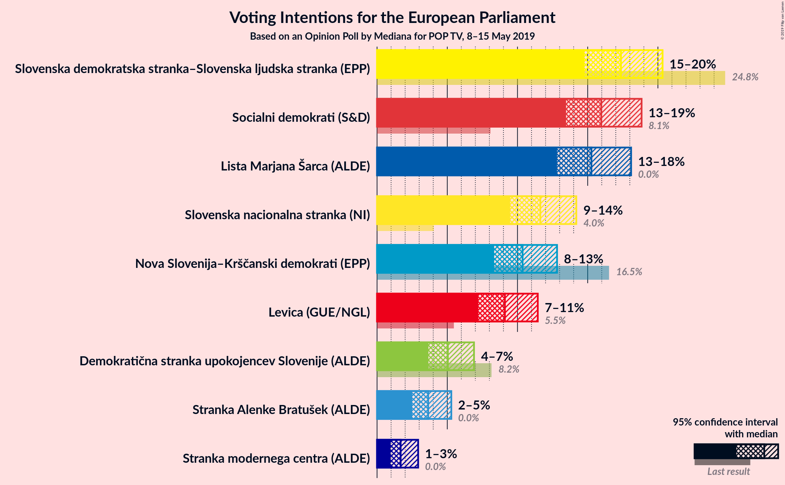
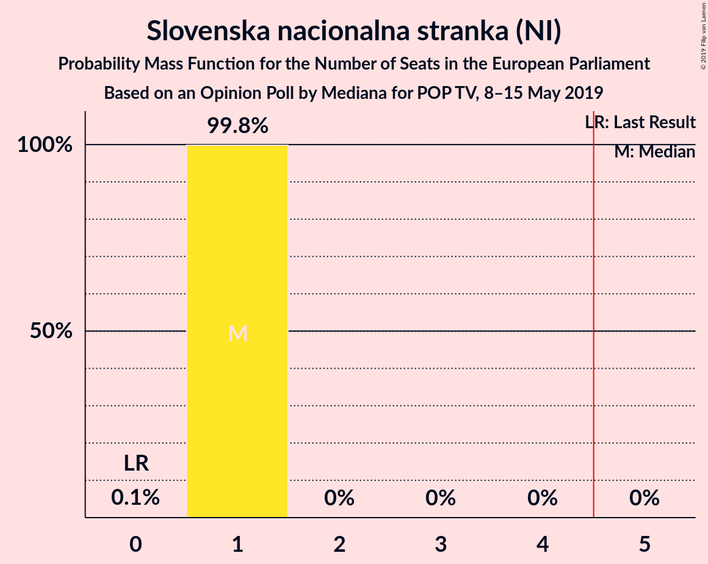
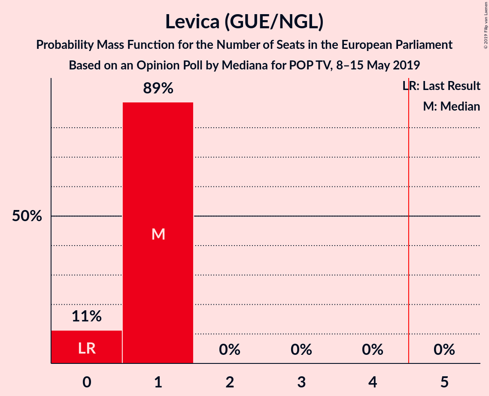

# Opinion Poll by Mediana for POP TV, 8–15 May 2019

<a href="#voting-intentions">Voting Intentions</a> | <a href="#seats">Seats</a> | <a href="#coalitions">Coalitions</a> | <a href="#technical-information">Technical Information</a>

## Voting Intentions

### Confidence Intervals

| Party | Last Result | Poll Result | 80% Confidence Interval | 90% Confidence Interval | 95% Confidence Interval | 99% Confidence Interval |
|:-----:|:-----------:|:-----------:|:-----------------------:|:-----------------------:|:-----------------------:|:-----------------------:|
| Slovenska demokratska stranka–Slovenska ljudska stranka (EPP) | 24.8% | 17.4% | 15.7–19.3% |15.2–19.8% |14.8–20.3% |14.0–21.3% |
| Socialni demokrati (S&D) | 8.1% | 16.0% | 14.3–17.8% |13.9–18.4% |13.5–18.8% |12.7–19.8% |
| Lista Marjana Šarca (ALDE) | 0.0% | 15.3% | 13.7–17.1% |13.2–17.6% |12.8–18.1% |12.1–19.0% |
| Slovenska nacionalna stranka (NI) | 4.0% | 11.6% | 10.2–13.3% |9.8–13.8% |9.5–14.2% |8.8–15.0% |
| Nova Slovenija–Krščanski demokrati (EPP) | 16.5% | 10.4% | 9.0–12.0% |8.7–12.4% |8.3–12.8% |7.7–13.6% |
| Levica (GUE/NGL) | 5.5% | 9.1% | 7.8–10.6% |7.5–11.1% |7.2–11.4% |6.6–12.2% |
| Demokratična stranka upokojencev Slovenije (ALDE) | 8.2% | 5.0% | 4.1–6.3% |3.9–6.6% |3.7–6.9% |3.3–7.5% |
| Stranka Alenke Bratušek (ALDE) | 0.0% | 3.6% | 2.9–4.7% |2.7–5.0% |2.5–5.3% |2.2–5.9% |
| Stranka modernega centra (ALDE) | 0.0% | 1.7% | 1.2–2.5% |1.1–2.7% |1.0–2.9% |0.8–3.4% |

*Note:* The poll result column reflects the actual value used in the calculations. Published results may vary slightly, and in addition be rounded to fewer digits.

## Seats

### Confidence Intervals

| Party | Last Result | Median | 80% Confidence Interval | 90% Confidence Interval | 95% Confidence Interval | 99% Confidence Interval |
|:-----:|:-----------:|:------:|:-----------------------:|:-----------------------:|:-----------------------:|:-----------------------:|
| <a href="#slovenska-demokratska-stranka–slovenska-ljudska-stranka-(epp)">Slovenska demokratska stranka–Slovenska ljudska stranka (EPP)</a> | 4 | 2 | 1–2 |1–2 |1–2 |1–2 |
| <a href="#socialni-demokrati-(s&d)">Socialni demokrati (S&D)</a> | 1 | 1 | 1–2 |1–2 |1–2 |1–2 |
| <a href="#lista-marjana-šarca-(alde)">Lista Marjana Šarca (ALDE)</a> | 0 | 1 | 1–2 |1–2 |1–2 |1–2 |
| <a href="#slovenska-nacionalna-stranka-(ni)">Slovenska nacionalna stranka (NI)</a> | 0 | 1 | 1 |1 |1 |1 |
| <a href="#nova-slovenija–krščanski-demokrati-(epp)">Nova Slovenija–Krščanski demokrati (EPP)</a> | 1 | 1 | 1 |1 |1 |0–1 |
| <a href="#levica-(gue/ngl)">Levica (GUE/NGL)</a> | 0 | 1 | 0–1 |0–1 |0–1 |0–1 |
| <a href="#demokratična-stranka-upokojencev-slovenije-(alde)">Demokratična stranka upokojencev Slovenije (ALDE)</a> | 1 | 0 | 0 |0 |0 |0 |
| <a href="#stranka-alenke-bratušek-(alde)">Stranka Alenke Bratušek (ALDE)</a> | 0 | 0 | 0 |0 |0 |0 |
| <a href="#stranka-modernega-centra-(alde)">Stranka modernega centra (ALDE)</a> | 0 | 0 | 0 |0 |0 |0 |

### Slovenska demokratska stranka–Slovenska ljudska stranka (EPP)

*For a full overview of the results for this party, see the [Slovenska demokratska stranka–Slovenska ljudska stranka (EPP)](party-slovenskademokratskastranka–slovenskaljudskastrankaepp.html) page.*

| Number of Seats | Probability | Accumulated | Special Marks |
|:---------------:|:-----------:|:-----------:|:-------------:|
| 1 | 19% | 100% |  |
| 2 | 81% | 81% | Median |
| 3 | 0% | 0% |  |
| 4 | 0% | 0% | Last Result |

### Socialni demokrati (S&D)

*For a full overview of the results for this party, see the [Socialni demokrati (S&D)](party-socialnidemokratisd.html) page.*

| Number of Seats | Probability | Accumulated | Special Marks |
|:---------------:|:-----------:|:-----------:|:-------------:|
| 1 | 76% | 100% | Last Result, Median |
| 2 | 24% | 24% |  |
| 3 | 0% | 0% |  |

### Lista Marjana Šarca (ALDE)

*For a full overview of the results for this party, see the [Lista Marjana Šarca (ALDE)](party-listamarjanašarcaalde.html) page.*

| Number of Seats | Probability | Accumulated | Special Marks |
|:---------------:|:-----------:|:-----------:|:-------------:|
| 0 | 0% | 100% | Last Result |
| 1 | 89% | 100% | Median |
| 2 | 11% | 11% |  |
| 3 | 0% | 0% |  |

### Slovenska nacionalna stranka (NI)

*For a full overview of the results for this party, see the [Slovenska nacionalna stranka (NI)](party-slovenskanacionalnastrankani.html) page.*

| Number of Seats | Probability | Accumulated | Special Marks |
|:---------------:|:-----------:|:-----------:|:-------------:|
| 0 | 0.1% | 100% | Last Result |
| 1 | 99.9% | 99.9% | Median |
| 2 | 0% | 0% |  |

### Nova Slovenija–Krščanski demokrati (EPP)

*For a full overview of the results for this party, see the [Nova Slovenija–Krščanski demokrati (EPP)](party-novaslovenija–krščanskidemokratiepp.html) page.*

| Number of Seats | Probability | Accumulated | Special Marks |
|:---------------:|:-----------:|:-----------:|:-------------:|
| 0 | 1.5% | 100% |  |
| 1 | 98.5% | 98.5% | Last Result, Median |
| 2 | 0% | 0% |  |

### Levica (GUE/NGL)

*For a full overview of the results for this party, see the [Levica (GUE/NGL)](party-levicaguengl.html) page.*

| Number of Seats | Probability | Accumulated | Special Marks |
|:---------------:|:-----------:|:-----------:|:-------------:|
| 0 | 10% | 100% | Last Result |
| 1 | 90% | 90% | Median |
| 2 | 0% | 0% |  |

### Demokratična stranka upokojencev Slovenije (ALDE)

*For a full overview of the results for this party, see the [Demokratična stranka upokojencev Slovenije (ALDE)](party-demokratičnastrankaupokojencevslovenijealde.html) page.*

| Number of Seats | Probability | Accumulated | Special Marks |
|:---------------:|:-----------:|:-----------:|:-------------:|
| 0 | 99.9% | 100% | Median |
| 1 | 0.1% | 0.1% | Last Result |
| 2 | 0% | 0% |  |

### Stranka Alenke Bratušek (ALDE)

*For a full overview of the results for this party, see the [Stranka Alenke Bratušek (ALDE)](party-strankaalenkebratušekalde.html) page.*

| Number of Seats | Probability | Accumulated | Special Marks |
|:---------------:|:-----------:|:-----------:|:-------------:|
| 0 | 100% | 100% | Last Result, Median |

### Stranka modernega centra (ALDE)

*For a full overview of the results for this party, see the [Stranka modernega centra (ALDE)](party-strankamodernegacentraalde.html) page.*

| Number of Seats | Probability | Accumulated | Special Marks |
|:---------------:|:-----------:|:-----------:|:-------------:|
| 0 | 100% | 100% | Last Result, Median |

## Coalitions

### Confidence Intervals

| Coalition | Last Result | Median | Majority? | 80% Confidence Interval | 90% Confidence Interval | 95% Confidence Interval | 99% Confidence Interval |
|:---------:|:-----------:|:------:|:---------:|:-----------------------:|:-----------------------:|:-----------------------:|:-----------------------:|
| Slovenska demokratska stranka–Slovenska ljudska stranka (EPP) – Nova Slovenija–Krščanski demokrati (EPP) | 5 | 3 | 0% | 2–3 | 2–3 | 2–3 | 2–3 |
| Socialni demokrati (S&D) | 1 | 1 | 0% | 1–2 | 1–2 | 1–2 | 1–2 |
| Slovenska nacionalna stranka (NI) | 0 | 1 | 0% | 1 | 1 | 1 | 1 |
| Levica (GUE/NGL) | 0 | 1 | 0% | 0–1 | 0–1 | 0–1 | 0–1 |

### Slovenska demokratska stranka–Slovenska ljudska stranka (EPP) – Nova Slovenija–Krščanski demokrati (EPP)

| Number of Seats | Probability | Accumulated | Special Marks |
|:---------------:|:-----------:|:-----------:|:-------------:|
| 1 | 0.3% | 100% |  |
| 2 | 20% | 99.7% |  |
| 3 | 80% | 80% | Median |
| 4 | 0% | 0% |  |
| 5 | 0% | 0% | Last Result, Majority |

### Socialni demokrati (S&D)

| Number of Seats | Probability | Accumulated | Special Marks |
|:---------------:|:-----------:|:-----------:|:-------------:|
| 1 | 76% | 100% | Last Result, Median |
| 2 | 24% | 24% |  |
| 3 | 0% | 0% |  |

### Slovenska nacionalna stranka (NI)

| Number of Seats | Probability | Accumulated | Special Marks |
|:---------------:|:-----------:|:-----------:|:-------------:|
| 0 | 0.1% | 100% | Last Result |
| 1 | 99.9% | 99.9% | Median |
| 2 | 0% | 0% |  |

### Levica (GUE/NGL)

| Number of Seats | Probability | Accumulated | Special Marks |
|:---------------:|:-----------:|:-----------:|:-------------:|
| 0 | 10% | 100% | Last Result |
| 1 | 90% | 90% | Median |
| 2 | 0% | 0% |  |

## Technical Information

### Opinion Poll

+ **Polling firm:** Mediana
+ **Commissioner(s):** POP TV
+ **Fieldwork period:** 8–15 May 2019

### Calculations

+ **Sample size:** 714
+ **Simulations done:** 524,288
+ **Error estimate:** 1.72%

