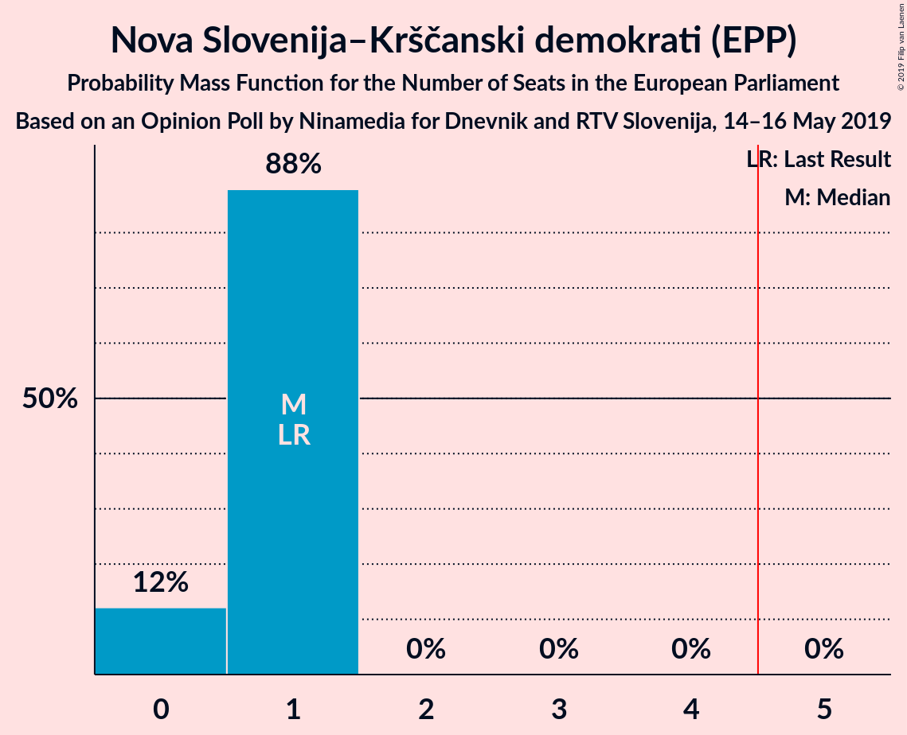
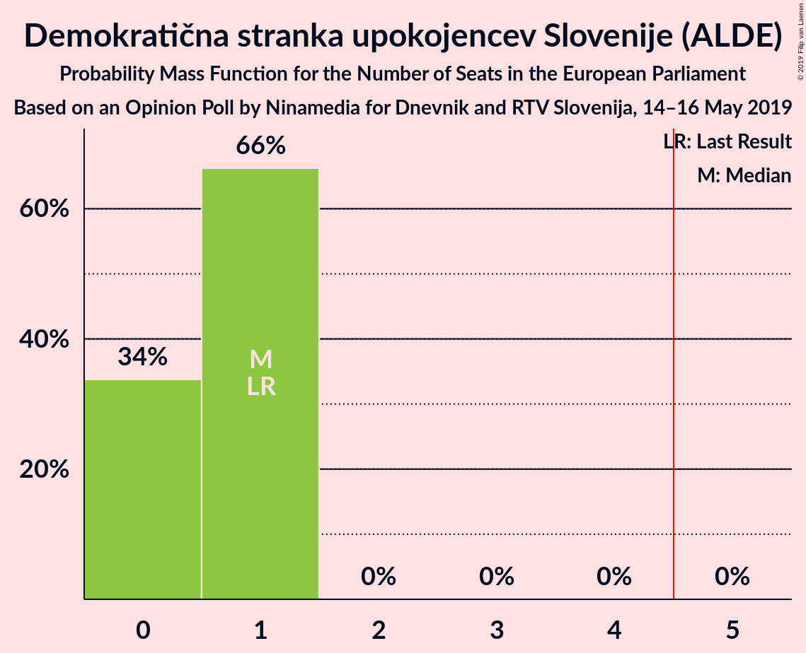
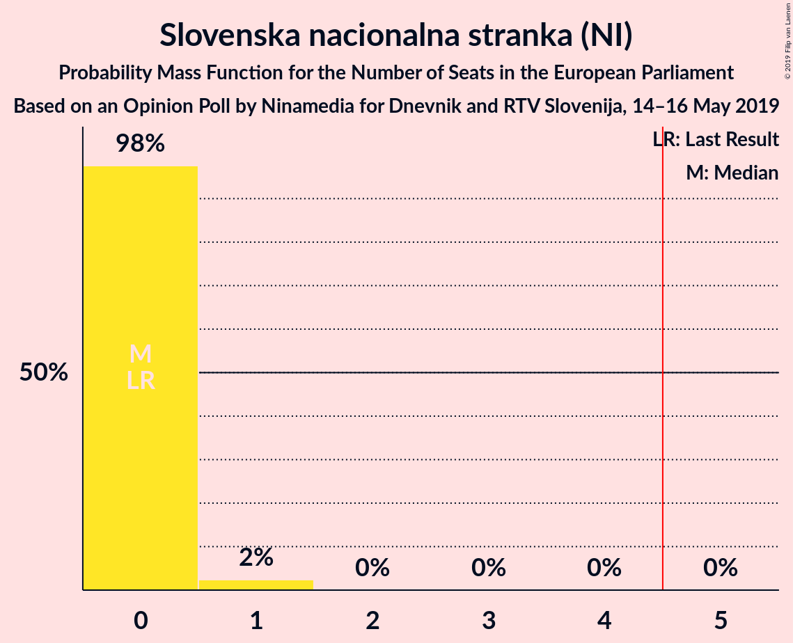
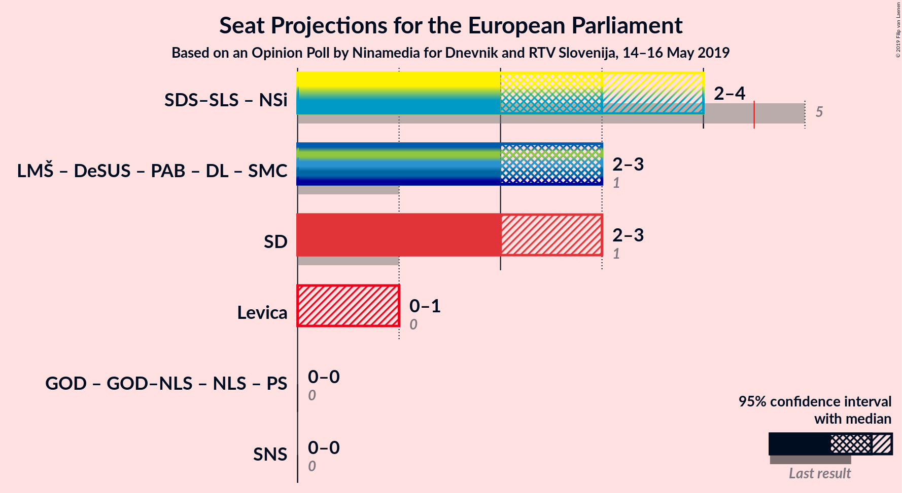
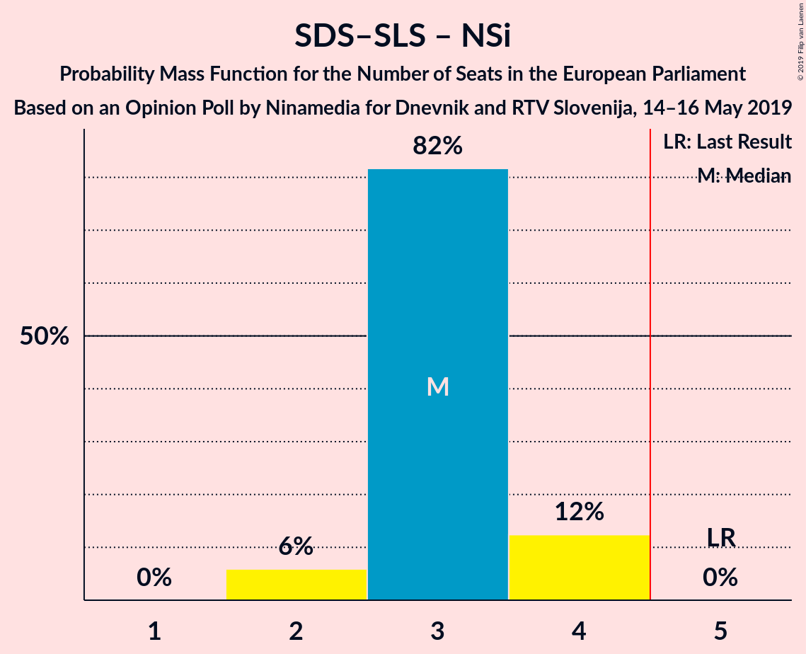
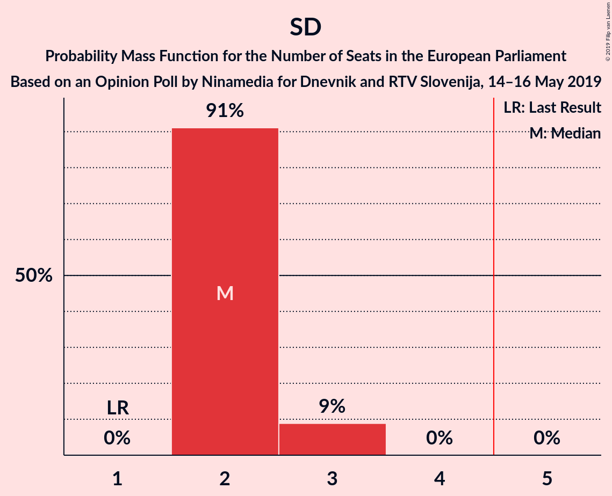
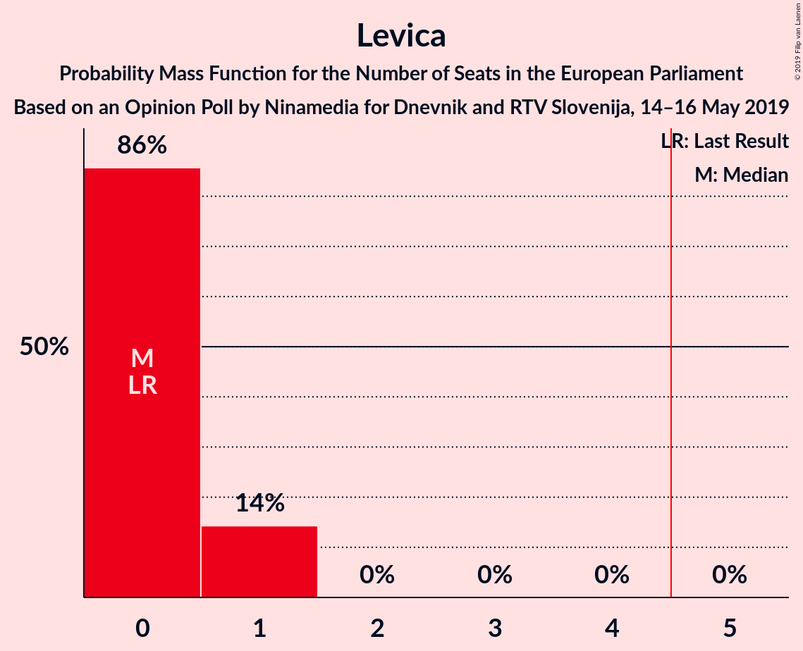

# Opinion Poll by Ninamedia for Dnevnik and RTV Slovenija, 14–16 May 2019

<a href="#voting-intentions">Voting Intentions</a> | <a href="#seats">Seats</a> | <a href="#coalitions">Coalitions</a> | <a href="#technical-information">Technical Information</a>

## Voting Intentions

### Confidence Intervals

| Party | Last Result | Poll Result | 80% Confidence Interval | 90% Confidence Interval | 95% Confidence Interval | 99% Confidence Interval |
|:-----:|:-----------:|:-----------:|:-----------------------:|:-----------------------:|:-----------------------:|:-----------------------:|
| Slovenska demokratska stranka–Slovenska ljudska stranka (EPP) | 24.8% | 22.7% | 20.8–24.8% |20.2–25.4% |19.8–26.0% |18.9–27.0% |
| Socialni demokrati (S&D) | 8.1% | 21.7% | 19.8–23.8% |19.3–24.4% |18.8–24.9% |17.9–26.0% |
| Lista Marjana Šarca (ALDE) | 0.0% | 20.3% | 18.4–22.3% |17.9–22.9% |17.5–23.4% |16.6–24.4% |
| Nova Slovenija–Krščanski demokrati (EPP) | 16.5% | 9.1% | 7.9–10.7% |7.5–11.1% |7.2–11.5% |6.7–12.3% |
| Demokratična stranka upokojencev Slovenije (ALDE) | 8.2% | 8.1% | 7.0–9.6% |6.6–10.0% |6.3–10.4% |5.8–11.2% |
| Levica (GUE/NGL) | 5.5% | 7.0% | 5.9–8.4% |5.6–8.8% |5.3–9.1% |4.8–9.8% |
| Slovenska nacionalna stranka (NI) | 4.0% | 6.0% | 5.0–7.3% |4.7–7.7% |4.5–8.0% |4.0–8.7% |
| Stranka Alenke Bratušek (ALDE) | 0.0% | 3.4% | 2.7–4.5% |2.5–4.8% |2.3–5.1% |2.0–5.6% |

*Note:* The poll result column reflects the actual value used in the calculations. Published results may vary slightly, and in addition be rounded to fewer digits.

## Seats

### Confidence Intervals

| Party | Last Result | Median | 80% Confidence Interval | 90% Confidence Interval | 95% Confidence Interval | 99% Confidence Interval |
|:-----:|:-----------:|:------:|:-----------------------:|:-----------------------:|:-----------------------:|:-----------------------:|
| <a href="#slovenska-demokratska-stranka–slovenska-ljudska-stranka-(epp)">Slovenska demokratska stranka–Slovenska ljudska stranka (EPP)</a> | 4 | 2 | 2–3 |2–3 |2–3 |2–3 |
| <a href="#socialni-demokrati-(s&d)">Socialni demokrati (S&D)</a> | 1 | 2 | 2 |2–3 |2–3 |2–3 |
| <a href="#lista-marjana-šarca-(alde)">Lista Marjana Šarca (ALDE)</a> | 0 | 2 | 2 |2 |2 |2–3 |
| <a href="#nova-slovenija–krščanski-demokrati-(epp)">Nova Slovenija–Krščanski demokrati (EPP)</a> | 1 | 1 | 0–1 |0–1 |0–1 |0–1 |
| <a href="#demokratična-stranka-upokojencev-slovenije-(alde)">Demokratična stranka upokojencev Slovenije (ALDE)</a> | 1 | 1 | 0–1 |0–1 |0–1 |0–1 |
| <a href="#levica-(gue/ngl)">Levica (GUE/NGL)</a> | 0 | 0 | 0–1 |0–1 |0–1 |0–1 |
| <a href="#slovenska-nacionalna-stranka-(ni)">Slovenska nacionalna stranka (NI)</a> | 0 | 0 | 0 |0 |0–1 |0–1 |
| <a href="#stranka-alenke-bratušek-(alde)">Stranka Alenke Bratušek (ALDE)</a> | 0 | 0 | 0 |0 |0 |0 |

### Slovenska demokratska stranka–Slovenska ljudska stranka (EPP)

*For a full overview of the results for this party, see the [Slovenska demokratska stranka–Slovenska ljudska stranka (EPP)](party-slovenskademokratskastranka–slovenskaljudskastrankaepp.html) page.*

| Number of Seats | Probability | Accumulated | Special Marks |
|:---------------:|:-----------:|:-----------:|:-------------:|
| 2 | 80% | 100% | Median |
| 3 | 20% | 20% |  |
| 4 | 0% | 0% | Last Result |

### Socialni demokrati (S&D)

*For a full overview of the results for this party, see the [Socialni demokrati (S&D)](party-socialnidemokratisd.html) page.*

| Number of Seats | Probability | Accumulated | Special Marks |
|:---------------:|:-----------:|:-----------:|:-------------:|
| 1 | 0% | 100% | Last Result |
| 2 | 90% | 100% | Median |
| 3 | 10% | 10% |  |
| 4 | 0% | 0% |  |

### Lista Marjana Šarca (ALDE)

*For a full overview of the results for this party, see the [Lista Marjana Šarca (ALDE)](party-listamarjanašarcaalde.html) page.*

| Number of Seats | Probability | Accumulated | Special Marks |
|:---------------:|:-----------:|:-----------:|:-------------:|
| 0 | 0% | 100% | Last Result |
| 1 | 0.5% | 100% |  |
| 2 | 97% | 99.5% | Median |
| 3 | 2% | 2% |  |
| 4 | 0% | 0% |  |

### Nova Slovenija–Krščanski demokrati (EPP)

*For a full overview of the results for this party, see the [Nova Slovenija–Krščanski demokrati (EPP)](party-novaslovenija–krščanskidemokratiepp.html) page.*

| Number of Seats | Probability | Accumulated | Special Marks |
|:---------------:|:-----------:|:-----------:|:-------------:|
| 0 | 13% | 100% |  |
| 1 | 87% | 87% | Last Result, Median |
| 2 | 0% | 0% |  |

### Demokratična stranka upokojencev Slovenije (ALDE)

*For a full overview of the results for this party, see the [Demokratična stranka upokojencev Slovenije (ALDE)](party-demokratičnastrankaupokojencevslovenijealde.html) page.*

| Number of Seats | Probability | Accumulated | Special Marks |
|:---------------:|:-----------:|:-----------:|:-------------:|
| 0 | 36% | 100% |  |
| 1 | 64% | 64% | Last Result, Median |
| 2 | 0% | 0% |  |

### Levica (GUE/NGL)

*For a full overview of the results for this party, see the [Levica (GUE/NGL)](party-levicaguengl.html) page.*

| Number of Seats | Probability | Accumulated | Special Marks |
|:---------------:|:-----------:|:-----------:|:-------------:|
| 0 | 85% | 100% | Last Result, Median |
| 1 | 15% | 15% |  |
| 2 | 0% | 0% |  |

### Slovenska nacionalna stranka (NI)

*For a full overview of the results for this party, see the [Slovenska nacionalna stranka (NI)](party-slovenskanacionalnastrankani.html) page.*

| Number of Seats | Probability | Accumulated | Special Marks |
|:---------------:|:-----------:|:-----------:|:-------------:|
| 0 | 97% | 100% | Last Result, Median |
| 1 | 3% | 3% |  |
| 2 | 0% | 0% |  |

### Stranka Alenke Bratušek (ALDE)

*For a full overview of the results for this party, see the [Stranka Alenke Bratušek (ALDE)](party-strankaalenkebratušekalde.html) page.*

| Number of Seats | Probability | Accumulated | Special Marks |
|:---------------:|:-----------:|:-----------:|:-------------:|
| 0 | 100% | 100% | Last Result, Median |

## Coalitions

### Confidence Intervals

| Coalition | Last Result | Median | Majority? | 80% Confidence Interval | 90% Confidence Interval | 95% Confidence Interval | 99% Confidence Interval |
|:---------:|:-----------:|:------:|:---------:|:-----------------------:|:-----------------------:|:-----------------------:|:-----------------------:|
| Slovenska demokratska stranka–Slovenska ljudska stranka (EPP) – Nova Slovenija–Krščanski demokrati (EPP) | 5 | 3 | 0% | 3–4 | 2–4 | 2–4 | 2–4 |
| Socialni demokrati (S&D) | 1 | 2 | 0% | 2 | 2–3 | 2–3 | 2–3 |
| Levica (GUE/NGL) | 0 | 0 | 0% | 0–1 | 0–1 | 0–1 | 0–1 |
| Slovenska nacionalna stranka (NI) | 0 | 0 | 0% | 0 | 0 | 0–1 | 0–1 |

### Slovenska demokratska stranka–Slovenska ljudska stranka (EPP) – Nova Slovenija–Krščanski demokrati (EPP)

| Number of Seats | Probability | Accumulated | Special Marks |
|:---------------:|:-----------:|:-----------:|:-------------:|
| 2 | 7% | 100% |  |
| 3 | 79% | 93% | Median |
| 4 | 14% | 14% |  |
| 5 | 0% | 0% | Last Result, Majority |

### Socialni demokrati (S&D)

| Number of Seats | Probability | Accumulated | Special Marks |
|:---------------:|:-----------:|:-----------:|:-------------:|
| 1 | 0% | 100% | Last Result |
| 2 | 90% | 100% | Median |
| 3 | 10% | 10% |  |
| 4 | 0% | 0% |  |

### Levica (GUE/NGL)

| Number of Seats | Probability | Accumulated | Special Marks |
|:---------------:|:-----------:|:-----------:|:-------------:|
| 0 | 85% | 100% | Last Result, Median |
| 1 | 15% | 15% |  |
| 2 | 0% | 0% |  |

### Slovenska nacionalna stranka (NI)

| Number of Seats | Probability | Accumulated | Special Marks |
|:---------------:|:-----------:|:-----------:|:-------------:|
| 0 | 97% | 100% | Last Result, Median |
| 1 | 3% | 3% |  |
| 2 | 0% | 0% |  |

## Technical Information

### Opinion Poll

+ **Polling firm:** Ninamedia
+ **Commissioner(s):** Dnevnik and RTV Slovenija
+ **Fieldwork period:** 14–16 May 2019

### Calculations

+ **Sample size:** 700
+ **Simulations done:** 524,288
+ **Error estimate:** 1.31%

