# Opinion Poll by Valicon for Reporter, 21–24 May 2019

<a href="#voting-intentions">Voting Intentions</a> | <a href="#seats">Seats</a> | <a href="#coalitions">Coalitions</a> | <a href="#technical-information">Technical Information</a>

## Voting Intentions

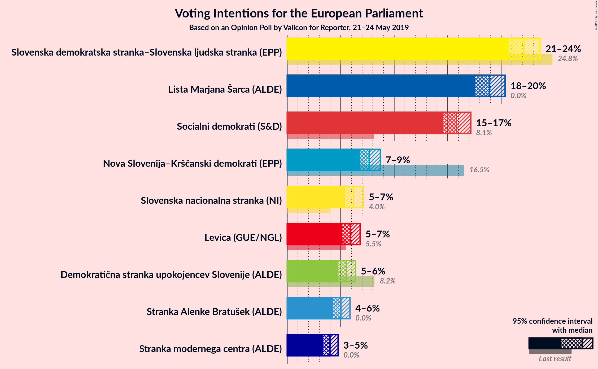

### Confidence Intervals

| Party | Last Result | Poll Result | 80% Confidence Interval | 90% Confidence Interval | 95% Confidence Interval | 99% Confidence Interval |
|:-----:|:-----------:|:-----------:|:-----------------------:|:-----------------------:|:-----------------------:|:-----------------------:|
| Slovenska demokratska stranka–Slovenska ljudska stranka (EPP) | 24.8% | 22.1% | 21.2–23.1% |20.9–23.4% |20.7–23.6% |20.2–24.1% |
| Lista Marjana Šarca (ALDE) | 0.0% | 18.9% | 18.0–19.9% |17.8–20.1% |17.6–20.4% |17.1–20.8% |
| Socialni demokrati (S&D) | 8.1% | 15.8% | 15.0–16.7% |14.8–16.9% |14.6–17.2% |14.2–17.6% |
| Nova Slovenija–Krščanski demokrati (EPP) | 16.5% | 7.7% | 7.1–8.4% |6.9–8.5% |6.8–8.7% |6.5–9.0% |
| Slovenska nacionalna stranka (NI) | 4.0% | 6.2% | 5.7–6.8% |5.5–7.0% |5.4–7.1% |5.2–7.4% |
| Levica (GUE/NGL) | 5.5% | 5.9% | 5.4–6.5% |5.2–6.7% |5.1–6.8% |4.9–7.1% |
| Demokratična stranka upokojencev Slovenije (ALDE) | 8.2% | 5.5% | 5.0–6.1% |4.9–6.2% |4.8–6.4% |4.5–6.7% |
| Stranka Alenke Bratušek (ALDE) | 0.0% | 5.0% | 4.5–5.6% |4.4–5.7% |4.3–5.9% |4.1–6.1% |
| Stranka modernega centra (ALDE) | 0.0% | 4.0% | 3.6–4.5% |3.4–4.6% |3.4–4.8% |3.2–5.0% |

*Note:* The poll result column reflects the actual value used in the calculations. Published results may vary slightly, and in addition be rounded to fewer digits.

## Seats

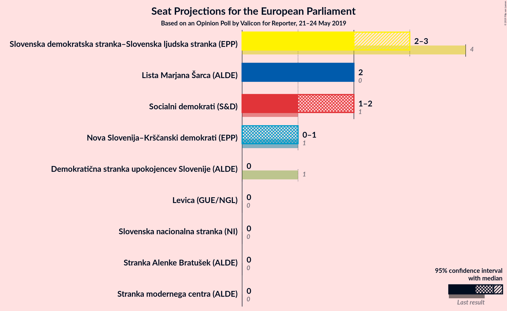

### Confidence Intervals

| Party | Last Result | Median | 80% Confidence Interval | 90% Confidence Interval | 95% Confidence Interval | 99% Confidence Interval |
|:-----:|:-----------:|:------:|:-----------------------:|:-----------------------:|:-----------------------:|:-----------------------:|
| <a href="#slovenska-demokratska-stranka–slovenska-ljudska-stranka-(epp)">Slovenska demokratska stranka–Slovenska ljudska stranka (EPP)</a> | 4 | 2 | 2–3 |2–3 |2–3 |2–3 |
| <a href="#lista-marjana-šarca-(alde)">Lista Marjana Šarca (ALDE)</a> | 0 | 2 | 2 |2 |2 |2 |
| <a href="#socialni-demokrati-(s&d)">Socialni demokrati (S&D)</a> | 1 | 2 | 2 |2 |1–2 |1–2 |
| <a href="#nova-slovenija–krščanski-demokrati-(epp)">Nova Slovenija–Krščanski demokrati (EPP)</a> | 1 | 1 | 0–1 |0–1 |0–1 |0–1 |
| <a href="#slovenska-nacionalna-stranka-(ni)">Slovenska nacionalna stranka (NI)</a> | 0 | 0 | 0 |0 |0 |0–1 |
| <a href="#levica-(gue/ngl)">Levica (GUE/NGL)</a> | 0 | 0 | 0 |0 |0 |0 |
| <a href="#demokratična-stranka-upokojencev-slovenije-(alde)">Demokratična stranka upokojencev Slovenije (ALDE)</a> | 1 | 0 | 0 |0 |0 |0 |
| <a href="#stranka-alenke-bratušek-(alde)">Stranka Alenke Bratušek (ALDE)</a> | 0 | 0 | 0 |0 |0 |0 |
| <a href="#stranka-modernega-centra-(alde)">Stranka modernega centra (ALDE)</a> | 0 | 0 | 0 |0 |0 |0 |

### Slovenska demokratska stranka–Slovenska ljudska stranka (EPP)

*For a full overview of the results for this party, see the [Slovenska demokratska stranka–Slovenska ljudska stranka (EPP)](party-slovenskademokratskastranka–slovenskaljudskastrankaepp.html) page.*

| Number of Seats | Probability | Accumulated | Special Marks |
|:---------------:|:-----------:|:-----------:|:-------------:|
| 2 | 72% | 100% | Median |
| 3 | 28% | 28% |  |
| 4 | 0% | 0% | Last Result |

### Lista Marjana Šarca (ALDE)

*For a full overview of the results for this party, see the [Lista Marjana Šarca (ALDE)](party-listamarjanašarcaalde.html) page.*

| Number of Seats | Probability | Accumulated | Special Marks |
|:---------------:|:-----------:|:-----------:|:-------------:|
| 0 | 0% | 100% | Last Result |
| 1 | 0% | 100% |  |
| 2 | 100% | 100% | Median |

### Socialni demokrati (S&D)

*For a full overview of the results for this party, see the [Socialni demokrati (S&D)](party-socialnidemokratisd.html) page.*

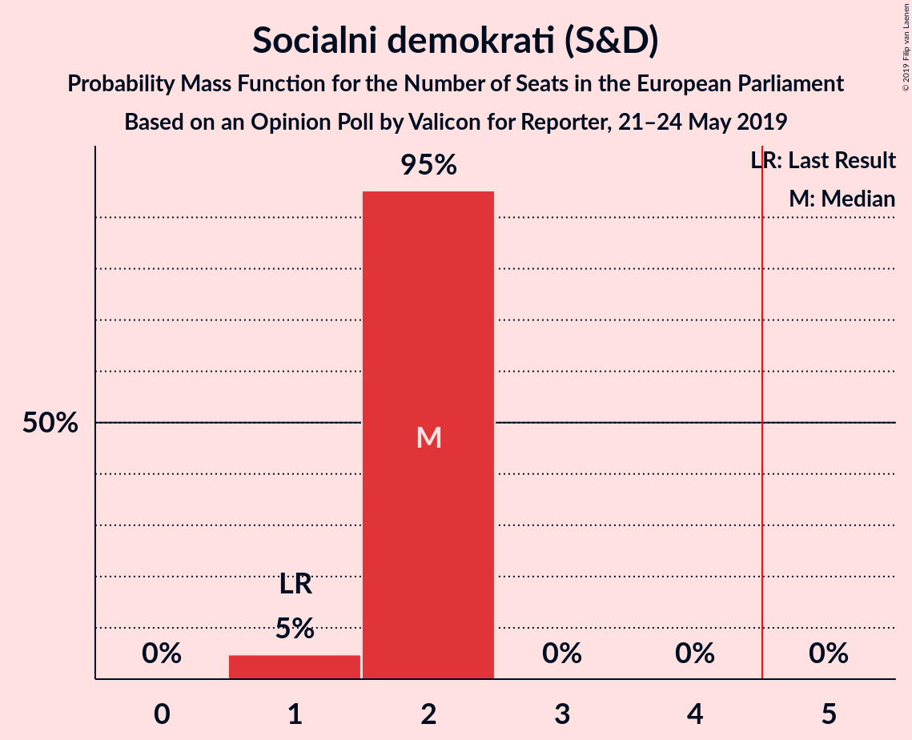

| Number of Seats | Probability | Accumulated | Special Marks |
|:---------------:|:-----------:|:-----------:|:-------------:|
| 1 | 5% | 100% | Last Result |
| 2 | 95% | 95% | Median |
| 3 | 0% | 0% |  |

### Nova Slovenija–Krščanski demokrati (EPP)

*For a full overview of the results for this party, see the [Nova Slovenija–Krščanski demokrati (EPP)](party-novaslovenija–krščanskidemokratiepp.html) page.*

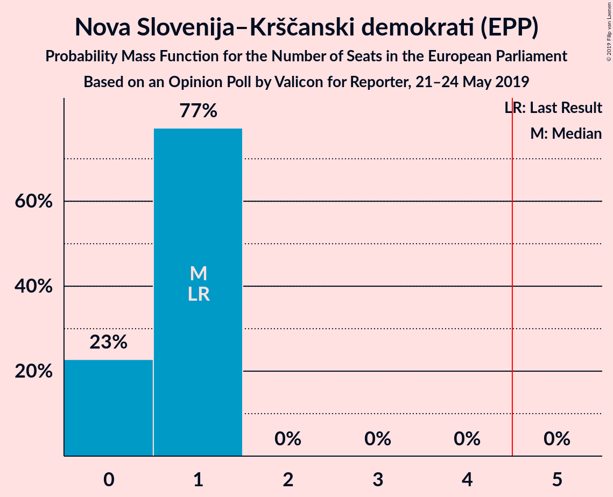

| Number of Seats | Probability | Accumulated | Special Marks |
|:---------------:|:-----------:|:-----------:|:-------------:|
| 0 | 23% | 100% |  |
| 1 | 77% | 77% | Last Result, Median |
| 2 | 0% | 0% |  |

### Slovenska nacionalna stranka (NI)

*For a full overview of the results for this party, see the [Slovenska nacionalna stranka (NI)](party-slovenskanacionalnastrankani.html) page.*

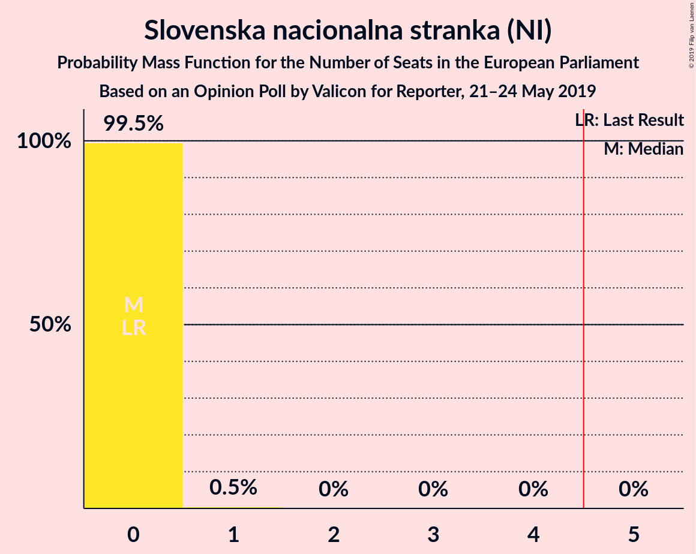

| Number of Seats | Probability | Accumulated | Special Marks |
|:---------------:|:-----------:|:-----------:|:-------------:|
| 0 | 99.5% | 100% | Last Result, Median |
| 1 | 0.5% | 0.5% |  |
| 2 | 0% | 0% |  |

### Levica (GUE/NGL)

*For a full overview of the results for this party, see the [Levica (GUE/NGL)](party-levicaguengl.html) page.*

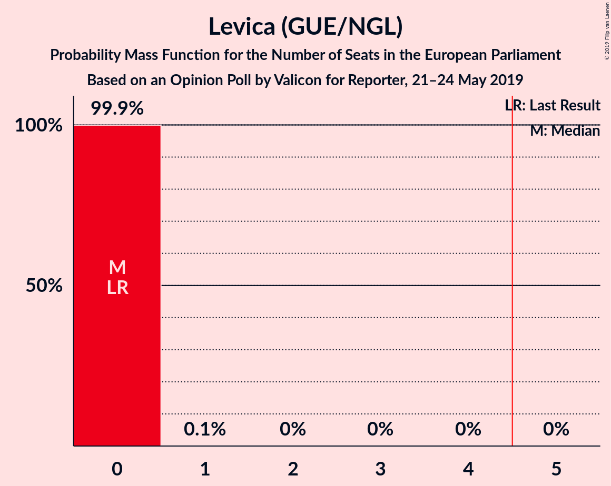

| Number of Seats | Probability | Accumulated | Special Marks |
|:---------------:|:-----------:|:-----------:|:-------------:|
| 0 | 99.9% | 100% | Last Result, Median |
| 1 | 0.1% | 0.1% |  |
| 2 | 0% | 0% |  |

### Demokratična stranka upokojencev Slovenije (ALDE)

*For a full overview of the results for this party, see the [Demokratična stranka upokojencev Slovenije (ALDE)](party-demokratičnastrankaupokojencevslovenijealde.html) page.*

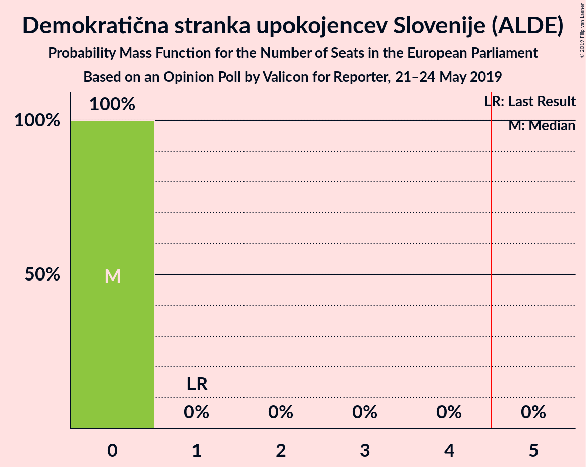

| Number of Seats | Probability | Accumulated | Special Marks |
|:---------------:|:-----------:|:-----------:|:-------------:|
| 0 | 100% | 100% | Median |
| 1 | 0% | 0% | Last Result |

### Stranka Alenke Bratušek (ALDE)

*For a full overview of the results for this party, see the [Stranka Alenke Bratušek (ALDE)](party-strankaalenkebratušekalde.html) page.*

| Number of Seats | Probability | Accumulated | Special Marks |
|:---------------:|:-----------:|:-----------:|:-------------:|
| 0 | 100% | 100% | Last Result, Median |

### Stranka modernega centra (ALDE)

*For a full overview of the results for this party, see the [Stranka modernega centra (ALDE)](party-strankamodernegacentraalde.html) page.*

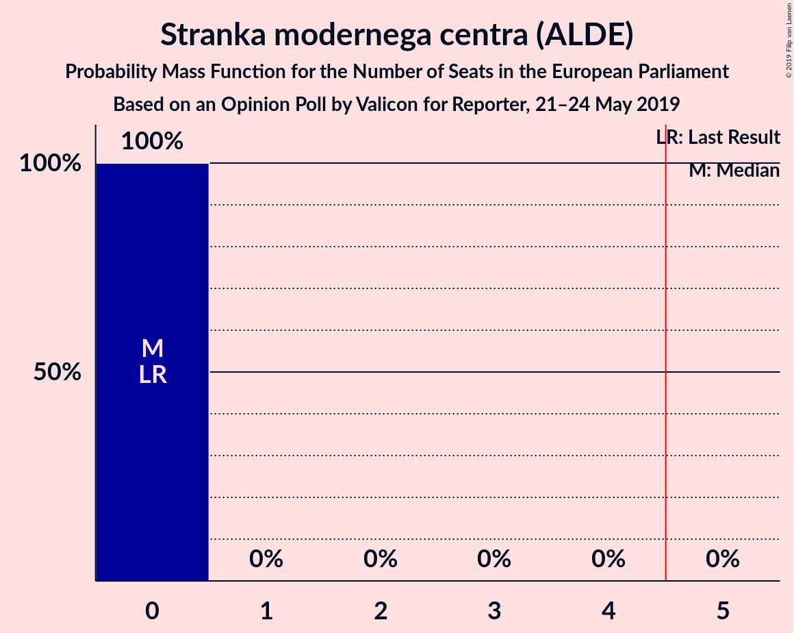

| Number of Seats | Probability | Accumulated | Special Marks |
|:---------------:|:-----------:|:-----------:|:-------------:|
| 0 | 100% | 100% | Last Result, Median |

## Coalitions

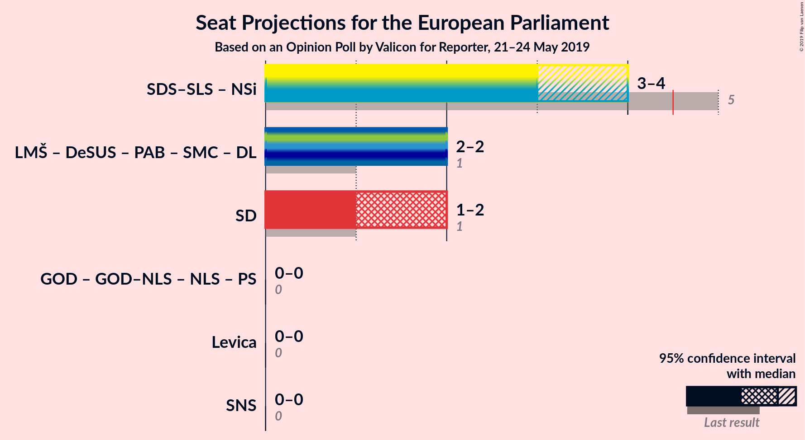

### Confidence Intervals

| Coalition | Last Result | Median | Majority? | 80% Confidence Interval | 90% Confidence Interval | 95% Confidence Interval | 99% Confidence Interval |
|:---------:|:-----------:|:------:|:---------:|:-----------------------:|:-----------------------:|:-----------------------:|:-----------------------:|
| Slovenska demokratska stranka–Slovenska ljudska stranka (EPP) – Nova Slovenija–Krščanski demokrati (EPP) | 5 | 3 | 0% | 3 | 3–4 | 3–4 | 3–4 |
| Socialni demokrati (S&D) | 1 | 2 | 0% | 2 | 2 | 1–2 | 1–2 |
| Levica (GUE/NGL) | 0 | 0 | 0% | 0 | 0 | 0 | 0 |
| Slovenska nacionalna stranka (NI) | 0 | 0 | 0% | 0 | 0 | 0 | 0–1 |

### Slovenska demokratska stranka–Slovenska ljudska stranka (EPP) – Nova Slovenija–Krščanski demokrati (EPP)

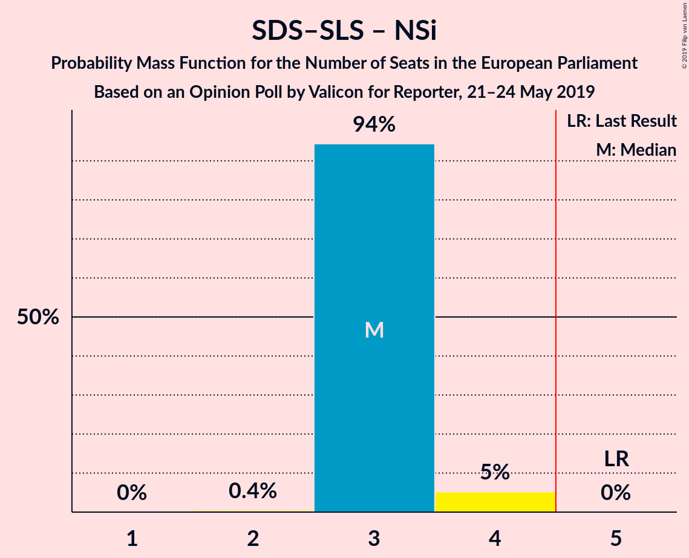

| Number of Seats | Probability | Accumulated | Special Marks |
|:---------------:|:-----------:|:-----------:|:-------------:|
| 2 | 0.4% | 100% |  |
| 3 | 94% | 99.6% | Median |
| 4 | 5% | 5% |  |
| 5 | 0% | 0% | Last Result, Majority |

### Socialni demokrati (S&D)

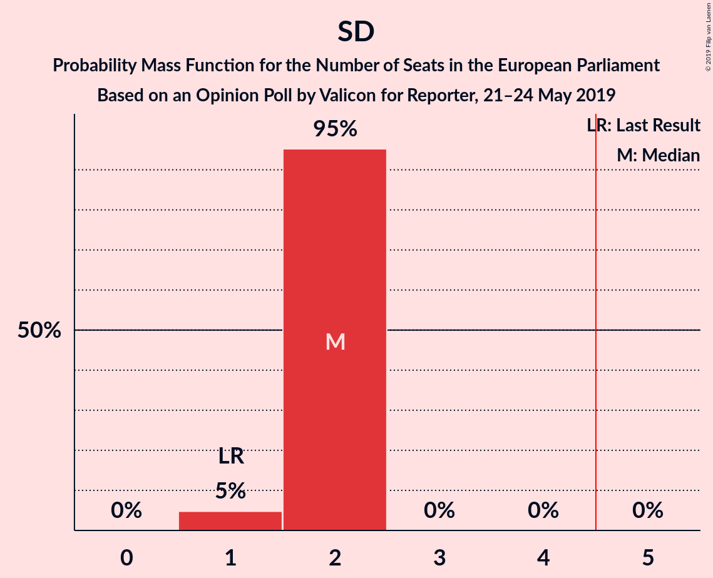

| Number of Seats | Probability | Accumulated | Special Marks |
|:---------------:|:-----------:|:-----------:|:-------------:|
| 1 | 5% | 100% | Last Result |
| 2 | 95% | 95% | Median |
| 3 | 0% | 0% |  |

### Levica (GUE/NGL)

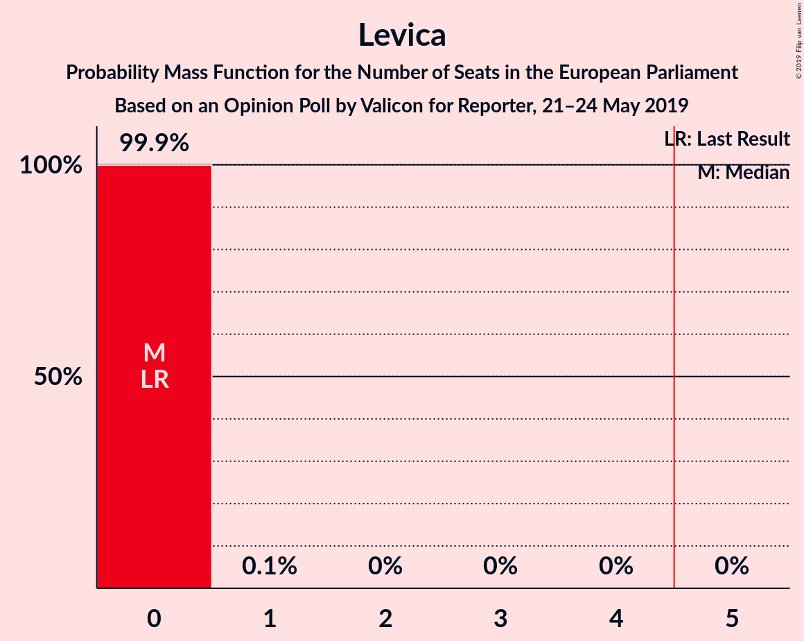

| Number of Seats | Probability | Accumulated | Special Marks |
|:---------------:|:-----------:|:-----------:|:-------------:|
| 0 | 99.9% | 100% | Last Result, Median |
| 1 | 0.1% | 0.1% |  |
| 2 | 0% | 0% |  |

### Slovenska nacionalna stranka (NI)

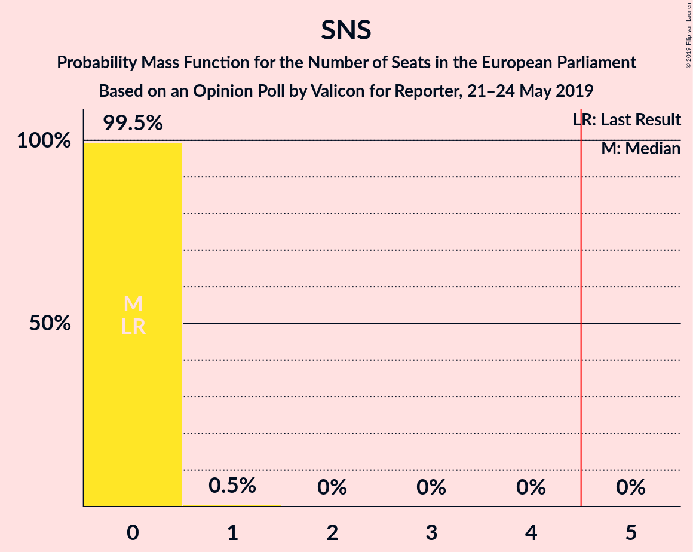

| Number of Seats | Probability | Accumulated | Special Marks |
|:---------------:|:-----------:|:-----------:|:-------------:|
| 0 | 99.5% | 100% | Last Result, Median |
| 1 | 0.5% | 0.5% |  |
| 2 | 0% | 0% |  |

## Technical Information

### Opinion Poll

+ **Polling firm:** Valicon
+ **Commissioner(s):** Reporter
+ **Fieldwork period:** 21–24 May 2019

### Calculations

+ **Sample size:** 3028
+ **Simulations done:** 1,048,576
+ **Error estimate:** 0.78%

