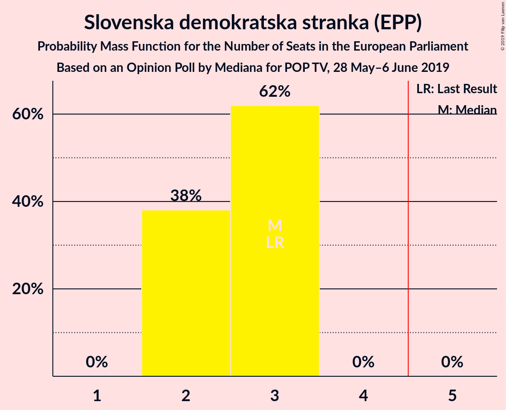
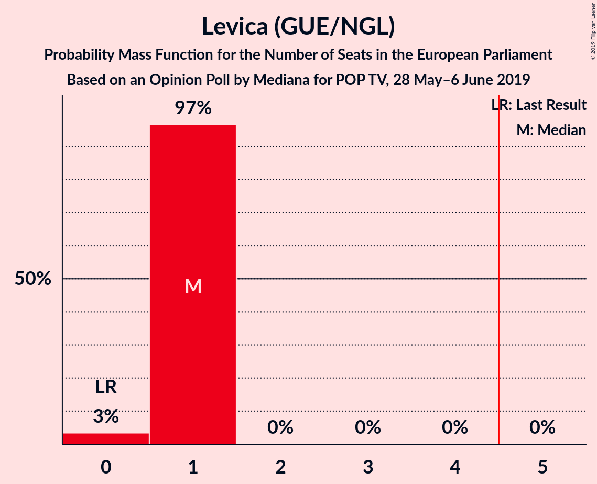
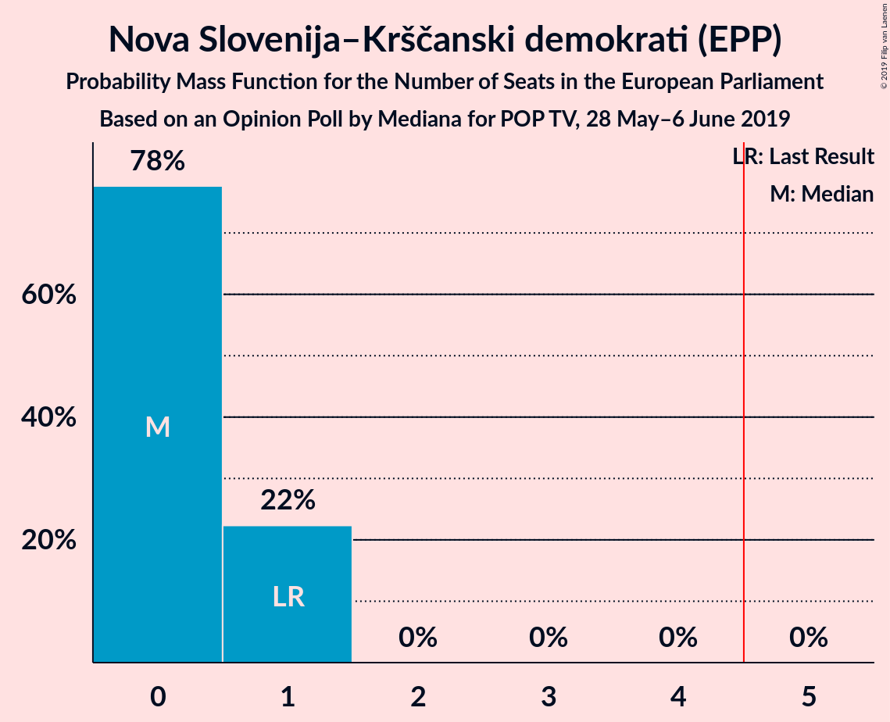
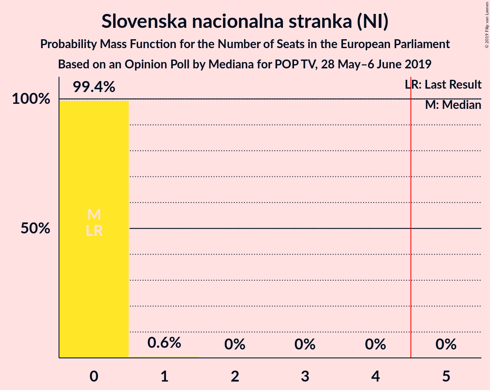
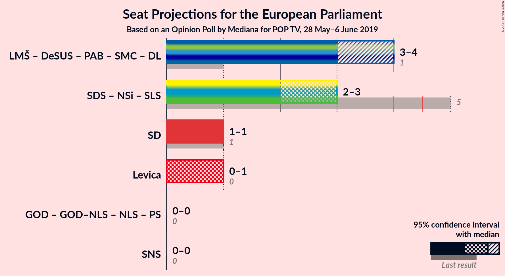
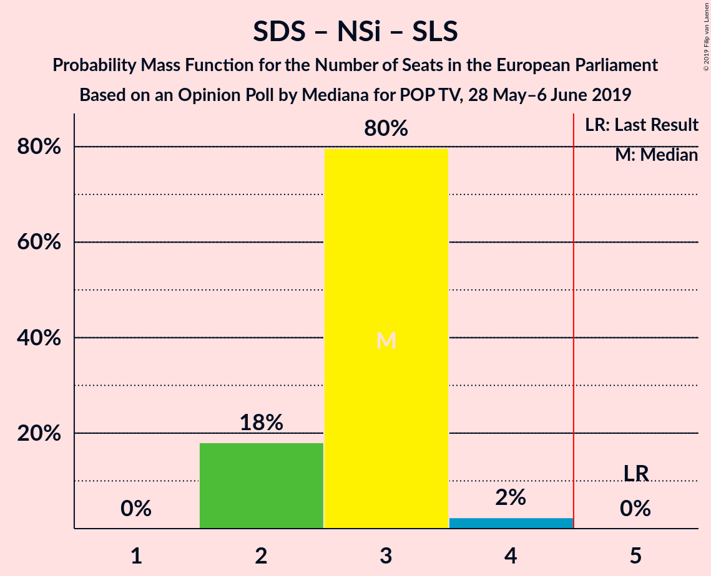
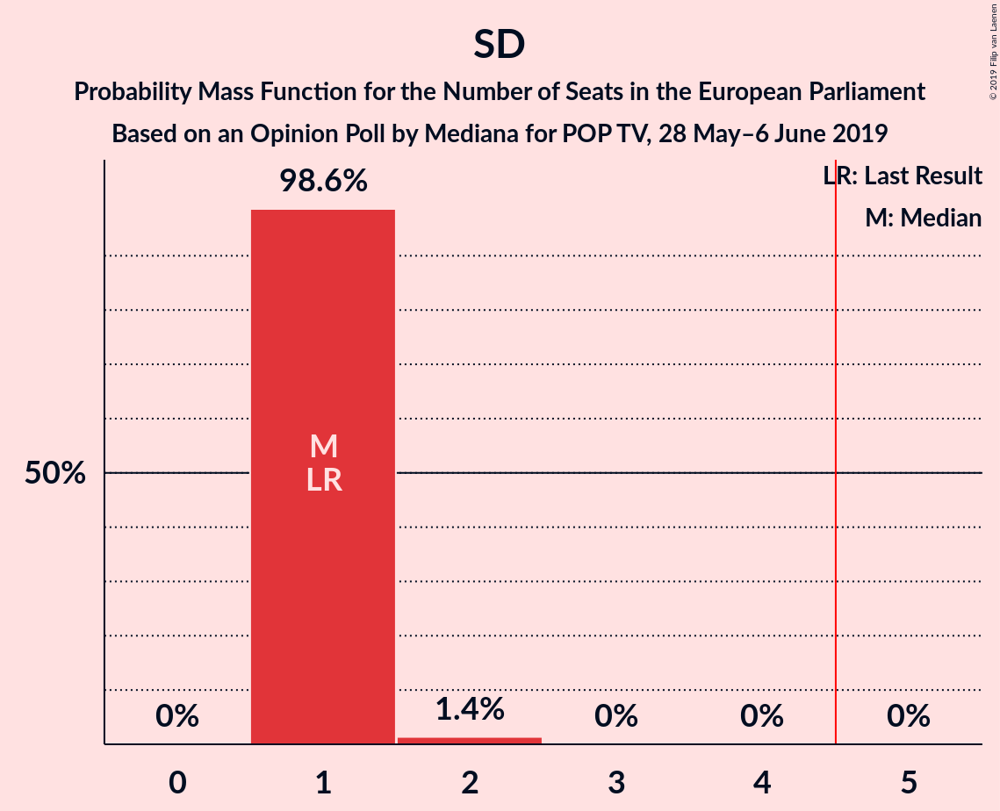
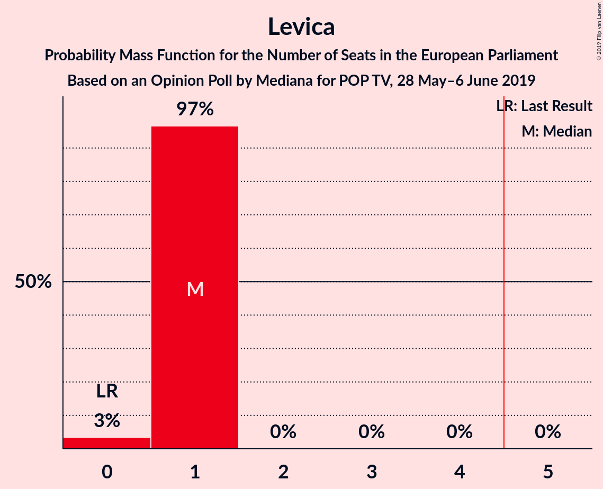
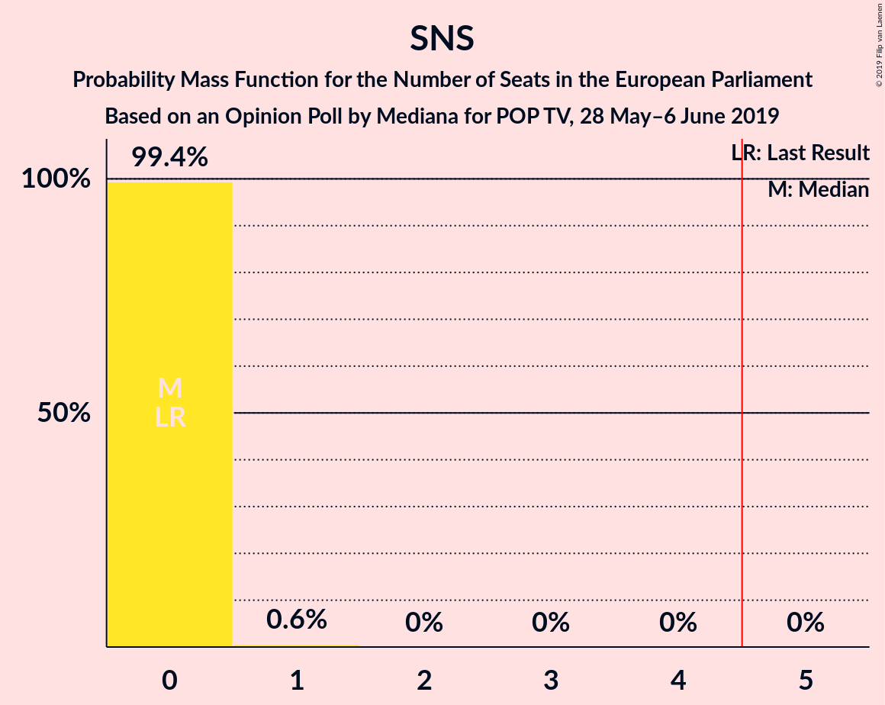

# Opinion Poll by Mediana for POP TV, 28 May–6 June 2019

<a href="#voting-intentions">Voting Intentions</a> | <a href="#seats">Seats</a> | <a href="#coalitions">Coalitions</a> | <a href="#technical-information">Technical Information</a>

## Voting Intentions

### Confidence Intervals

| Party | Last Result | Poll Result | 80% Confidence Interval | 90% Confidence Interval | 95% Confidence Interval | 99% Confidence Interval |
|:-----:|:-----------:|:-----------:|:-----------------------:|:-----------------------:|:-----------------------:|:-----------------------:|
| Lista Marjana Šarca (RE) | 0.0% | 28.6% | 26.5–30.8% |26.0–31.4% |25.5–31.9% |24.5–33.0% |
| Slovenska demokratska stranka (EPP) | 24.8% | 23.1% | 21.2–25.2% |20.7–25.7% |20.2–26.3% |19.3–27.3% |
| Socialni demokrati (S&D) | 8.1% | 12.6% | 11.2–14.3% |10.8–14.8% |10.4–15.2% |9.8–16.0% |
| Levica (GUE/NGL) | 5.5% | 9.5% | 8.3–11.1% |7.9–11.5% |7.6–11.9% |7.1–12.6% |
| Nova Slovenija–Krščanski demokrati (EPP) | 16.5% | 7.5% | 6.4–8.9% |6.1–9.3% |5.8–9.6% |5.3–10.3% |
| Slovenska nacionalna stranka (NI) | 4.0% | 5.5% | 4.6–6.7% |4.3–7.1% |4.1–7.4% |3.7–8.0% |
| Demokratična stranka upokojencev Slovenije (RE) | 8.2% | 4.4% | 3.6–5.6% |3.4–5.9% |3.2–6.2% |2.8–6.8% |
| Stranka modernega centra (RE) | 0.0% | 3.1% | 2.4–4.1% |2.2–4.3% |2.1–4.6% |1.8–5.1% |
| Stranka Alenke Bratušek (RE) | 0.0% | 3.1% | 2.4–4.1% |2.2–4.3% |2.1–4.6% |1.8–5.1% |
| Slovenska ljudska stranka (EPP) | 16.5% | 2.6% | 2.0–3.5% |1.8–3.7% |1.6–4.0% |1.4–4.4% |

*Note:* The poll result column reflects the actual value used in the calculations. Published results may vary slightly, and in addition be rounded to fewer digits.

## Seats

### Confidence Intervals

| Party | Last Result | Median | 80% Confidence Interval | 90% Confidence Interval | 95% Confidence Interval | 99% Confidence Interval |
|:-----:|:-----------:|:------:|:-----------------------:|:-----------------------:|:-----------------------:|:-----------------------:|
| <a href="#lista-marjana-šarca-(re)">Lista Marjana Šarca (RE)</a> | 0 | 3 | 3–4 |3–4 |3–4 |3–4 |
| <a href="#slovenska-demokratska-stranka-(epp)">Slovenska demokratska stranka (EPP)</a> | 3 | 3 | 2–3 |2–3 |2–3 |2–3 |
| <a href="#socialni-demokrati-(s&d)">Socialni demokrati (S&D)</a> | 1 | 1 | 1 |1 |1 |1–2 |
| <a href="#levica-(gue/ngl)">Levica (GUE/NGL)</a> | 0 | 1 | 1 |1 |0–1 |0–1 |
| <a href="#nova-slovenija–krščanski-demokrati-(epp)">Nova Slovenija–Krščanski demokrati (EPP)</a> | 1 | 0 | 0–1 |0–1 |0–1 |0–1 |
| <a href="#slovenska-nacionalna-stranka-(ni)">Slovenska nacionalna stranka (NI)</a> | 0 | 0 | 0 |0 |0 |0–1 |
| <a href="#demokratična-stranka-upokojencev-slovenije-(re)">Demokratična stranka upokojencev Slovenije (RE)</a> | 1 | 0 | 0 |0 |0 |0 |
| <a href="#stranka-modernega-centra-(re)">Stranka modernega centra (RE)</a> | 0 | 0 | 0 |0 |0 |0 |
| <a href="#stranka-alenke-bratušek-(re)">Stranka Alenke Bratušek (RE)</a> | 0 | 0 | 0 |0 |0 |0 |
| <a href="#slovenska-ljudska-stranka-(epp)">Slovenska ljudska stranka (EPP)</a> | 1 | 0 | 0 |0 |0 |0 |

### Lista Marjana Šarca (RE)

*For a full overview of the results for this party, see the [Lista Marjana Šarca (RE)](party-listamarjanašarcare.html) page.*

| Number of Seats | Probability | Accumulated | Special Marks |
|:---------------:|:-----------:|:-----------:|:-------------:|
| 0 | 0% | 100% | Last Result |
| 1 | 0% | 100% |  |
| 2 | 0.3% | 100% |  |
| 3 | 82% | 99.7% | Median |
| 4 | 17% | 17% |  |
| 5 | 0% | 0% | Majority |

### Slovenska demokratska stranka (EPP)

*For a full overview of the results for this party, see the [Slovenska demokratska stranka (EPP)](party-slovenskademokratskastrankaepp.html) page.*

| Number of Seats | Probability | Accumulated | Special Marks |
|:---------------:|:-----------:|:-----------:|:-------------:|
| 2 | 38% | 100% |  |
| 3 | 62% | 62% | Last Result, Median |
| 4 | 0% | 0% |  |

### Socialni demokrati (S&D)

*For a full overview of the results for this party, see the [Socialni demokrati (S&D)](party-socialnidemokratisd.html) page.*

| Number of Seats | Probability | Accumulated | Special Marks |
|:---------------:|:-----------:|:-----------:|:-------------:|
| 1 | 98.6% | 100% | Last Result, Median |
| 2 | 1.4% | 1.4% |  |
| 3 | 0% | 0% |  |

### Levica (GUE/NGL)

*For a full overview of the results for this party, see the [Levica (GUE/NGL)](party-levicaguengl.html) page.*

| Number of Seats | Probability | Accumulated | Special Marks |
|:---------------:|:-----------:|:-----------:|:-------------:|
| 0 | 3% | 100% | Last Result |
| 1 | 97% | 97% | Median |
| 2 | 0% | 0% |  |

### Nova Slovenija–Krščanski demokrati (EPP)

*For a full overview of the results for this party, see the [Nova Slovenija–Krščanski demokrati (EPP)](party-novaslovenija–krščanskidemokratiepp.html) page.*

| Number of Seats | Probability | Accumulated | Special Marks |
|:---------------:|:-----------:|:-----------:|:-------------:|
| 0 | 78% | 100% | Median |
| 1 | 22% | 22% | Last Result |
| 2 | 0% | 0% |  |

### Slovenska nacionalna stranka (NI)

*For a full overview of the results for this party, see the [Slovenska nacionalna stranka (NI)](party-slovenskanacionalnastrankani.html) page.*

| Number of Seats | Probability | Accumulated | Special Marks |
|:---------------:|:-----------:|:-----------:|:-------------:|
| 0 | 99.4% | 100% | Last Result, Median |
| 1 | 0.6% | 0.6% |  |
| 2 | 0% | 0% |  |

### Demokratična stranka upokojencev Slovenije (RE)

*For a full overview of the results for this party, see the [Demokratična stranka upokojencev Slovenije (RE)](party-demokratičnastrankaupokojencevslovenijere.html) page.*

| Number of Seats | Probability | Accumulated | Special Marks |
|:---------------:|:-----------:|:-----------:|:-------------:|
| 0 | 100% | 100% | Median |
| 1 | 0% | 0% | Last Result |

### Stranka modernega centra (RE)

*For a full overview of the results for this party, see the [Stranka modernega centra (RE)](party-strankamodernegacentrare.html) page.*

| Number of Seats | Probability | Accumulated | Special Marks |
|:---------------:|:-----------:|:-----------:|:-------------:|
| 0 | 100% | 100% | Last Result, Median |

### Stranka Alenke Bratušek (RE)

*For a full overview of the results for this party, see the [Stranka Alenke Bratušek (RE)](party-strankaalenkebratušekre.html) page.*

| Number of Seats | Probability | Accumulated | Special Marks |
|:---------------:|:-----------:|:-----------:|:-------------:|
| 0 | 100% | 100% | Last Result, Median |

### Slovenska ljudska stranka (EPP)

*For a full overview of the results for this party, see the [Slovenska ljudska stranka (EPP)](party-slovenskaljudskastrankaepp.html) page.*

| Number of Seats | Probability | Accumulated | Special Marks |
|:---------------:|:-----------:|:-----------:|:-------------:|
| 0 | 100% | 100% | Median |
| 1 | 0% | 0% | Last Result |

## Coalitions

### Confidence Intervals

| Coalition | Last Result | Median | Majority? | 80% Confidence Interval | 90% Confidence Interval | 95% Confidence Interval | 99% Confidence Interval |
|:---------:|:-----------:|:------:|:---------:|:-----------------------:|:-----------------------:|:-----------------------:|:-----------------------:|
| Slovenska demokratska stranka (EPP) – Nova Slovenija–Krščanski demokrati (EPP) – Slovenska ljudska stranka (EPP) | 5 | 3 | 0% | 2–3 | 2–3 | 2–3 | 2–4 |
| Socialni demokrati (S&D) | 1 | 1 | 0% | 1 | 1 | 1 | 1–2 |
| Levica (GUE/NGL) | 0 | 1 | 0% | 1 | 1 | 0–1 | 0–1 |
| Slovenska nacionalna stranka (NI) | 0 | 0 | 0% | 0 | 0 | 0 | 0–1 |

### Slovenska demokratska stranka (EPP) – Nova Slovenija–Krščanski demokrati (EPP) – Slovenska ljudska stranka (EPP)

| Number of Seats | Probability | Accumulated | Special Marks |
|:---------------:|:-----------:|:-----------:|:-------------:|
| 2 | 18% | 100% |  |
| 3 | 80% | 82% | Median |
| 4 | 2% | 2% |  |
| 5 | 0% | 0% | Last Result, Majority |

### Socialni demokrati (S&D)

| Number of Seats | Probability | Accumulated | Special Marks |
|:---------------:|:-----------:|:-----------:|:-------------:|
| 1 | 98.6% | 100% | Last Result, Median |
| 2 | 1.4% | 1.4% |  |
| 3 | 0% | 0% |  |

### Levica (GUE/NGL)

| Number of Seats | Probability | Accumulated | Special Marks |
|:---------------:|:-----------:|:-----------:|:-------------:|
| 0 | 3% | 100% | Last Result |
| 1 | 97% | 97% | Median |
| 2 | 0% | 0% |  |

### Slovenska nacionalna stranka (NI)

| Number of Seats | Probability | Accumulated | Special Marks |
|:---------------:|:-----------:|:-----------:|:-------------:|
| 0 | 99.4% | 100% | Last Result, Median |
| 1 | 0.6% | 0.6% |  |
| 2 | 0% | 0% |  |

## Technical Information

### Opinion Poll

+ **Polling firm:** Mediana
+ **Commissioner(s):** POP TV
+ **Fieldwork period:** 28 May–6 June 2019

### Calculations

+ **Sample size:** 745
+ **Simulations done:** 1,048,576
+ **Error estimate:** 3.70%

