# Opinion Poll by Parsifal, 27–29 January 2020

<a href="#voting-intentions">Voting Intentions</a> | <a href="#seats">Seats</a> | <a href="#coalitions">Coalitions</a> | <a href="#technical-information">Technical Information</a>

## Voting Intentions

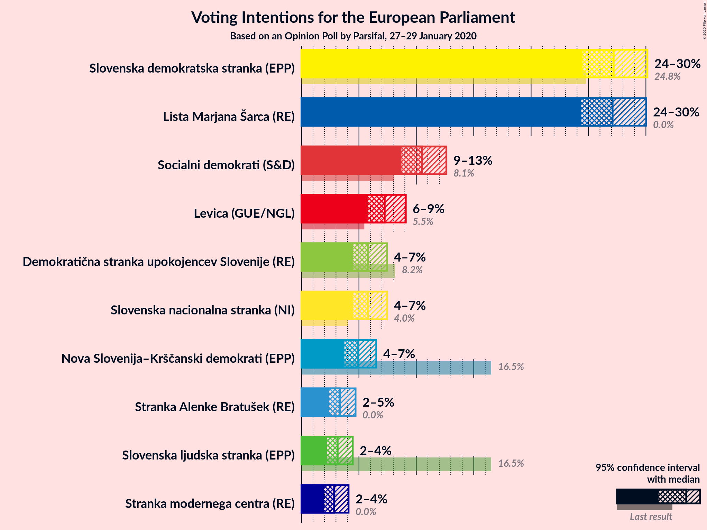

### Confidence Intervals

| Party | Last Result | Poll Result | 80% Confidence Interval | 90% Confidence Interval | 95% Confidence Interval | 99% Confidence Interval |
|:-----:|:-----------:|:-----------:|:-----------------------:|:-----------------------:|:-----------------------:|:-----------------------:|
| Slovenska demokratska stranka (EPP) | 24.8% | 27.2% | 25.4–29.1% |24.9–29.7% |24.5–30.1% |23.6–31.0% |
| Lista Marjana Šarca (RE) | 0.0% | 27.1% | 25.3–29.0% |24.8–29.6% |24.4–30.0% |23.5–30.9% |
| Socialni demokrati (S&D) | 8.1% | 10.5% | 9.3–11.9% |9.0–12.3% |8.7–12.6% |8.2–13.3% |
| Levica (GUE/NGL) | 5.5% | 7.2% | 6.3–8.4% |6.0–8.8% |5.8–9.1% |5.3–9.7% |
| Demokratična stranka upokojencev Slovenije (RE) | 8.2% | 5.8% | 4.9–6.9% |4.7–7.2% |4.5–7.5% |4.1–8.0% |
| Slovenska nacionalna stranka (NI) | 4.0% | 5.8% | 4.9–6.9% |4.7–7.2% |4.5–7.5% |4.1–8.0% |
| Nova Slovenija–Krščanski demokrati (EPP) | 16.5% | 4.9% | 4.1–6.0% |3.9–6.2% |3.7–6.5% |3.4–7.0% |
| Stranka Alenke Bratušek (RE) | 0.0% | 3.4% | 2.7–4.2% |2.5–4.5% |2.4–4.7% |2.1–5.2% |
| Slovenska ljudska stranka (EPP) | 16.5% | 3.2% | 2.5–4.0% |2.4–4.3% |2.2–4.5% |2.0–4.9% |
| Stranka modernega centra (RE) | 0.0% | 2.8% | 2.3–3.7% |2.1–3.9% |2.0–4.1% |1.7–4.5% |

*Note:* The poll result column reflects the actual value used in the calculations. Published results may vary slightly, and in addition be rounded to fewer digits.

## Seats

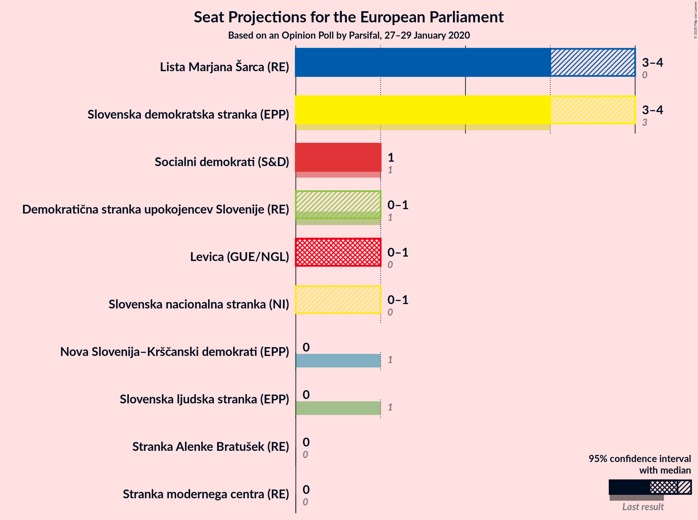

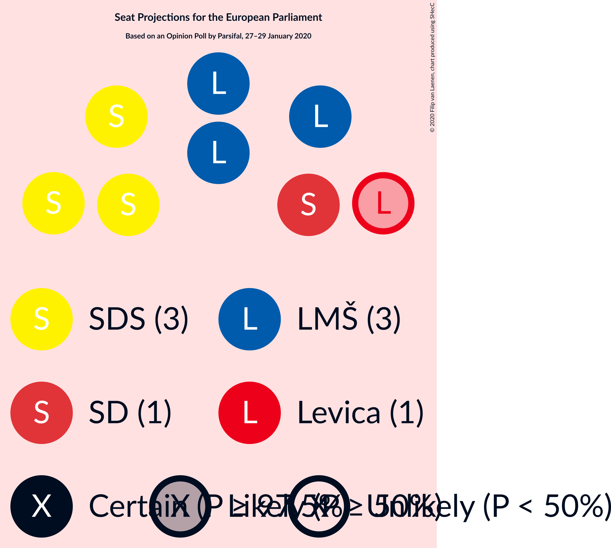

### Confidence Intervals

| Party | Last Result | Median | 80% Confidence Interval | 90% Confidence Interval | 95% Confidence Interval | 99% Confidence Interval |
|:-----:|:-----------:|:------:|:-----------------------:|:-----------------------:|:-----------------------:|:-----------------------:|
| <a href="#slovenska-demokratska-stranka-(epp)">Slovenska demokratska stranka (EPP)</a> | 3 | 3 | 3–4 |3–4 |3–4 |3–4 |
| <a href="#lista-marjana-šarca-(re)">Lista Marjana Šarca (RE)</a> | 0 | 3 | 3–4 |3–4 |3–4 |3–4 |
| <a href="#socialni-demokrati-(s&d)">Socialni demokrati (S&D)</a> | 1 | 1 | 1 |1 |1 |1–2 |
| <a href="#levica-(gue/ngl)">Levica (GUE/NGL)</a> | 0 | 1 | 0–1 |0–1 |0–1 |0–1 |
| <a href="#demokratična-stranka-upokojencev-slovenije-(re)">Demokratična stranka upokojencev Slovenije (RE)</a> | 1 | 0 | 0 |0–1 |0–1 |0–1 |
| <a href="#slovenska-nacionalna-stranka-(ni)">Slovenska nacionalna stranka (NI)</a> | 0 | 0 | 0 |0 |0–1 |0–1 |
| <a href="#nova-slovenija–krščanski-demokrati-(epp)">Nova Slovenija–Krščanski demokrati (EPP)</a> | 1 | 0 | 0 |0 |0 |0–1 |
| <a href="#stranka-alenke-bratušek-(re)">Stranka Alenke Bratušek (RE)</a> | 0 | 0 | 0 |0 |0 |0 |
| <a href="#slovenska-ljudska-stranka-(epp)">Slovenska ljudska stranka (EPP)</a> | 1 | 0 | 0 |0 |0 |0 |
| <a href="#stranka-modernega-centra-(re)">Stranka modernega centra (RE)</a> | 0 | 0 | 0 |0 |0 |0 |

### Slovenska demokratska stranka (EPP)

*For a full overview of the results for this party, see the [Slovenska demokratska stranka (EPP)](party-slovenskademokratskastrankaepp.html) page.*

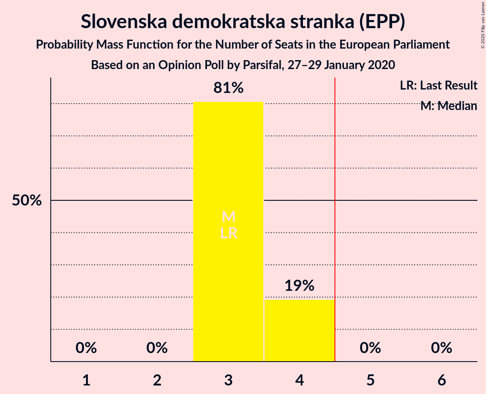

| Number of Seats | Probability | Accumulated | Special Marks |
|:---------------:|:-----------:|:-----------:|:-------------:|
| 3 | 81% | 100% | Last Result, Median |
| 4 | 19% | 19% |  |
| 5 | 0% | 0% | Majority |

### Lista Marjana Šarca (RE)

*For a full overview of the results for this party, see the [Lista Marjana Šarca (RE)](party-listamarjanašarcare.html) page.*

| Number of Seats | Probability | Accumulated | Special Marks |
|:---------------:|:-----------:|:-----------:|:-------------:|
| 0 | 0% | 100% | Last Result |
| 1 | 0% | 100% |  |
| 2 | 0.1% | 100% |  |
| 3 | 87% | 99.9% | Median |
| 4 | 13% | 13% |  |
| 5 | 0% | 0% | Majority |

### Socialni demokrati (S&D)

*For a full overview of the results for this party, see the [Socialni demokrati (S&D)](party-socialnidemokratisd.html) page.*

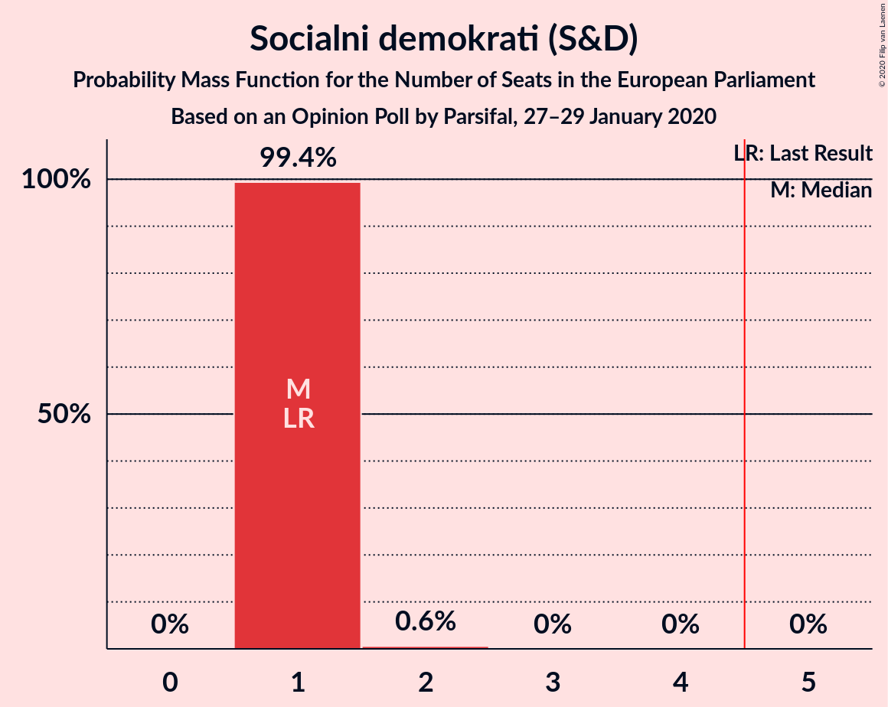

| Number of Seats | Probability | Accumulated | Special Marks |
|:---------------:|:-----------:|:-----------:|:-------------:|
| 1 | 99.4% | 100% | Last Result, Median |
| 2 | 0.6% | 0.6% |  |
| 3 | 0% | 0% |  |

### Levica (GUE/NGL)

*For a full overview of the results for this party, see the [Levica (GUE/NGL)](party-levicaguengl.html) page.*

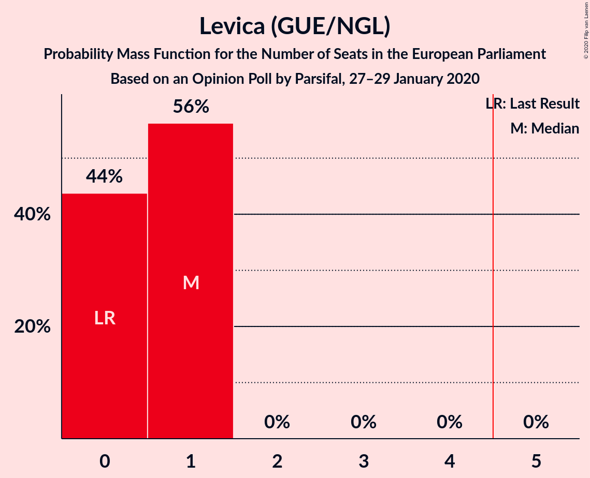

| Number of Seats | Probability | Accumulated | Special Marks |
|:---------------:|:-----------:|:-----------:|:-------------:|
| 0 | 44% | 100% | Last Result |
| 1 | 56% | 56% | Median |
| 2 | 0% | 0% |  |

### Demokratična stranka upokojencev Slovenije (RE)

*For a full overview of the results for this party, see the [Demokratična stranka upokojencev Slovenije (RE)](party-demokratičnastrankaupokojencevslovenijere.html) page.*

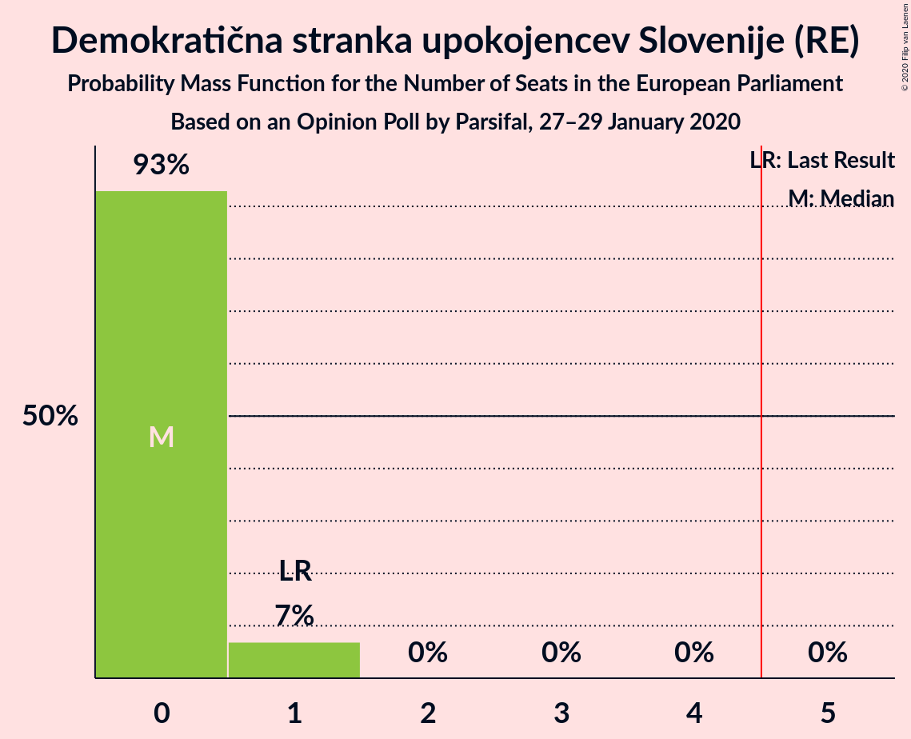

| Number of Seats | Probability | Accumulated | Special Marks |
|:---------------:|:-----------:|:-----------:|:-------------:|
| 0 | 93% | 100% | Median |
| 1 | 7% | 7% | Last Result |
| 2 | 0% | 0% |  |

### Slovenska nacionalna stranka (NI)

*For a full overview of the results for this party, see the [Slovenska nacionalna stranka (NI)](party-slovenskanacionalnastrankani.html) page.*

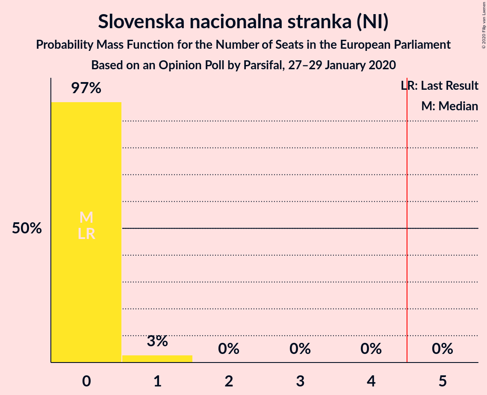

| Number of Seats | Probability | Accumulated | Special Marks |
|:---------------:|:-----------:|:-----------:|:-------------:|
| 0 | 97% | 100% | Last Result, Median |
| 1 | 3% | 3% |  |
| 2 | 0% | 0% |  |

### Nova Slovenija–Krščanski demokrati (EPP)

*For a full overview of the results for this party, see the [Nova Slovenija–Krščanski demokrati (EPP)](party-novaslovenija–krščanskidemokratiepp.html) page.*

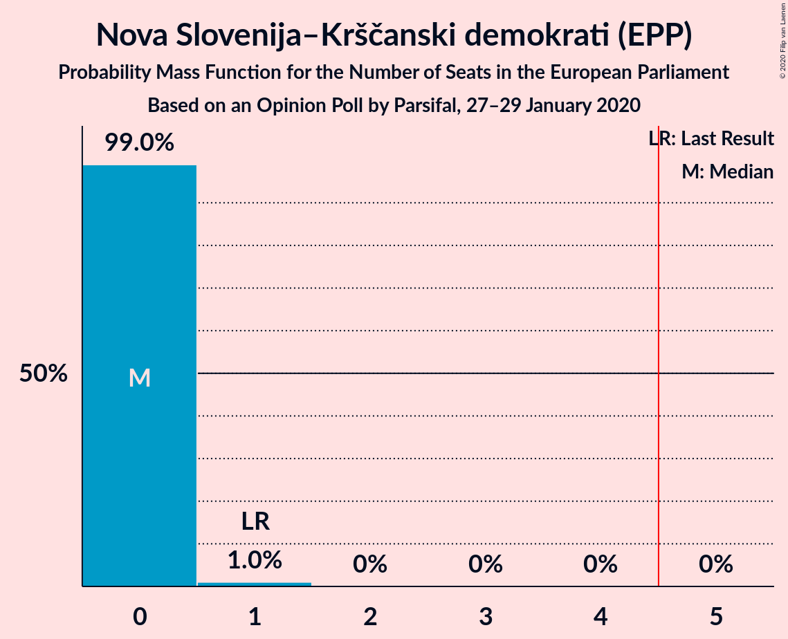

| Number of Seats | Probability | Accumulated | Special Marks |
|:---------------:|:-----------:|:-----------:|:-------------:|
| 0 | 99.0% | 100% | Median |
| 1 | 1.0% | 1.0% | Last Result |
| 2 | 0% | 0% |  |

### Stranka Alenke Bratušek (RE)

*For a full overview of the results for this party, see the [Stranka Alenke Bratušek (RE)](party-strankaalenkebratušekre.html) page.*

| Number of Seats | Probability | Accumulated | Special Marks |
|:---------------:|:-----------:|:-----------:|:-------------:|
| 0 | 100% | 100% | Last Result, Median |

### Slovenska ljudska stranka (EPP)

*For a full overview of the results for this party, see the [Slovenska ljudska stranka (EPP)](party-slovenskaljudskastrankaepp.html) page.*

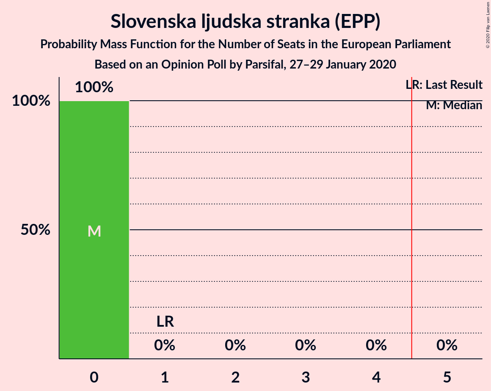

| Number of Seats | Probability | Accumulated | Special Marks |
|:---------------:|:-----------:|:-----------:|:-------------:|
| 0 | 100% | 100% | Median |
| 1 | 0% | 0% | Last Result |

### Stranka modernega centra (RE)

*For a full overview of the results for this party, see the [Stranka modernega centra (RE)](party-strankamodernegacentrare.html) page.*

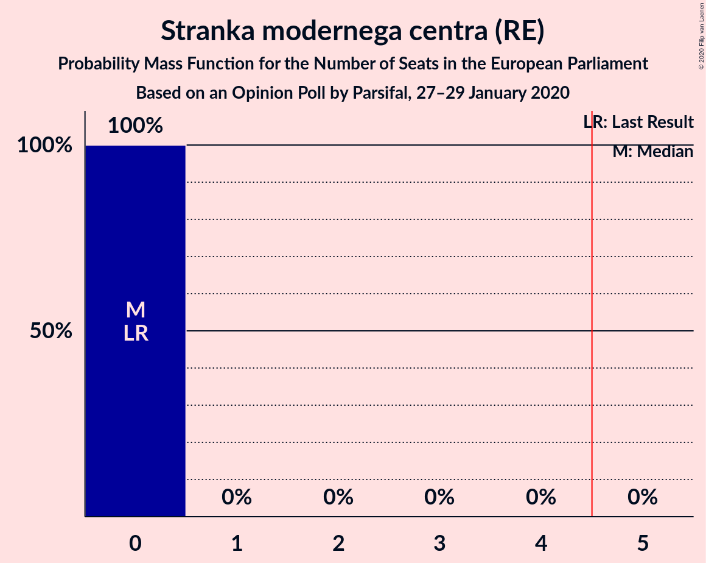

| Number of Seats | Probability | Accumulated | Special Marks |
|:---------------:|:-----------:|:-----------:|:-------------:|
| 0 | 100% | 100% | Last Result, Median |

## Coalitions

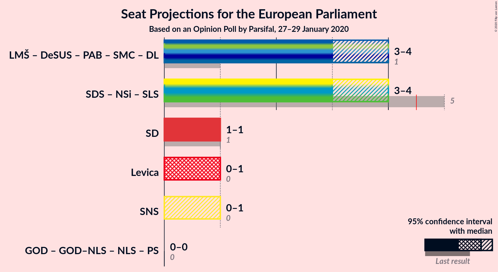

### Confidence Intervals

| Coalition | Last Result | Median | Majority? | 80% Confidence Interval | 90% Confidence Interval | 95% Confidence Interval | 99% Confidence Interval |
|:---------:|:-----------:|:------:|:---------:|:-----------------------:|:-----------------------:|:-----------------------:|:-----------------------:|
| Slovenska demokratska stranka (EPP) – Nova Slovenija–Krščanski demokrati (EPP) – Slovenska ljudska stranka (EPP) | 5 | 3 | 0% | 3–4 | 3–4 | 3–4 | 3–4 |
| Socialni demokrati (S&D) | 1 | 1 | 0% | 1 | 1 | 1 | 1–2 |
| Levica (GUE/NGL) | 0 | 1 | 0% | 0–1 | 0–1 | 0–1 | 0–1 |
| Slovenska nacionalna stranka (NI) | 0 | 0 | 0% | 0 | 0 | 0–1 | 0–1 |

### Slovenska demokratska stranka (EPP) – Nova Slovenija–Krščanski demokrati (EPP) – Slovenska ljudska stranka (EPP)

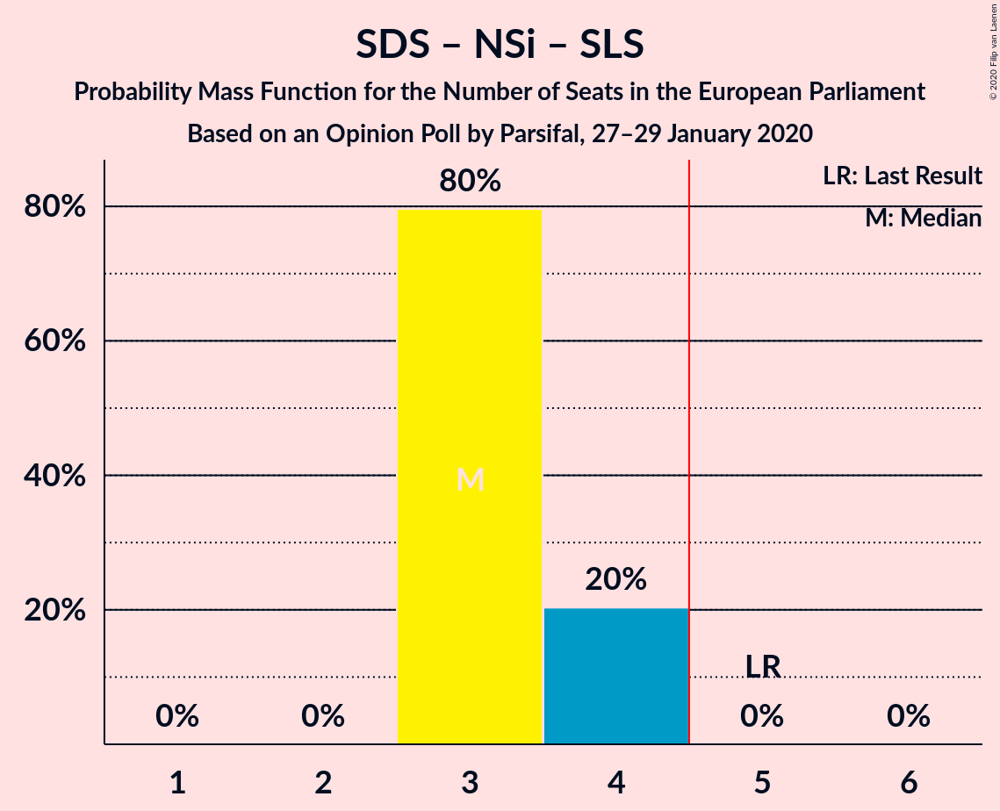

| Number of Seats | Probability | Accumulated | Special Marks |
|:---------------:|:-----------:|:-----------:|:-------------:|
| 3 | 80% | 100% | Median |
| 4 | 20% | 20% |  |
| 5 | 0% | 0% | Last Result, Majority |

### Socialni demokrati (S&D)

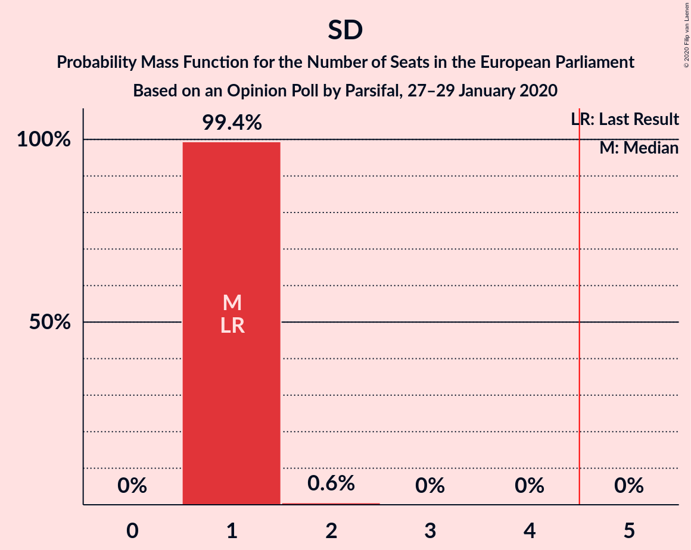

| Number of Seats | Probability | Accumulated | Special Marks |
|:---------------:|:-----------:|:-----------:|:-------------:|
| 1 | 99.4% | 100% | Last Result, Median |
| 2 | 0.6% | 0.6% |  |
| 3 | 0% | 0% |  |

### Levica (GUE/NGL)

| Number of Seats | Probability | Accumulated | Special Marks |
|:---------------:|:-----------:|:-----------:|:-------------:|
| 0 | 44% | 100% | Last Result |
| 1 | 56% | 56% | Median |
| 2 | 0% | 0% |  |

### Slovenska nacionalna stranka (NI)

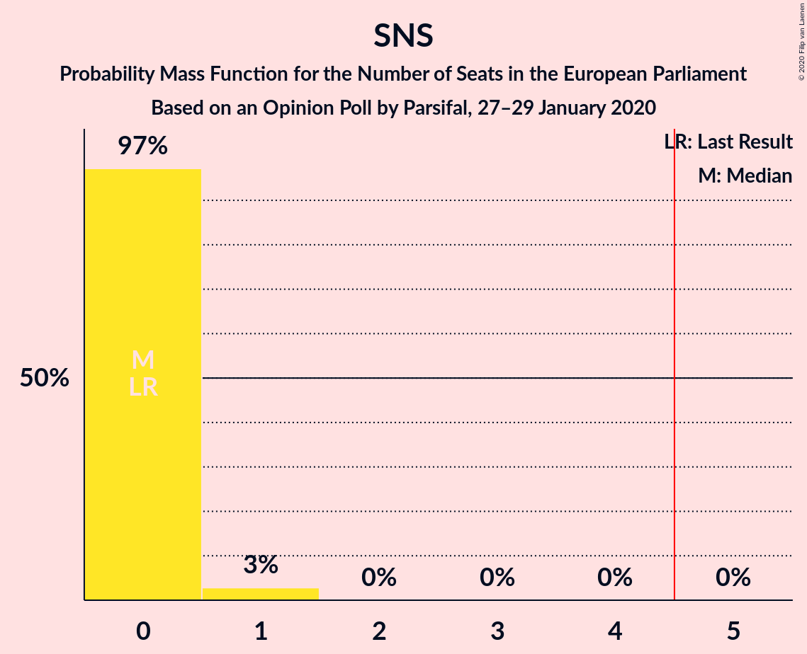

| Number of Seats | Probability | Accumulated | Special Marks |
|:---------------:|:-----------:|:-----------:|:-------------:|
| 0 | 97% | 100% | Last Result, Median |
| 1 | 3% | 3% |  |
| 2 | 0% | 0% |  |

## Technical Information

### Opinion Poll

+ **Polling firm:** Parsifal
+ **Commissioner(s):** —
+ **Fieldwork period:** 27–29 January 2020

### Calculations

+ **Sample size:** 952
+ **Simulations done:** 1,048,576
+ **Error estimate:** 2.82%

