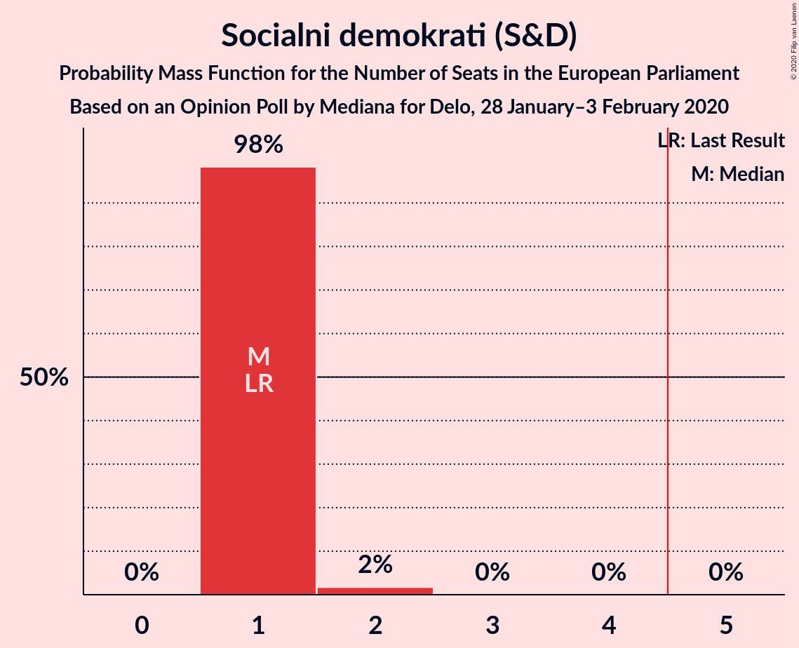
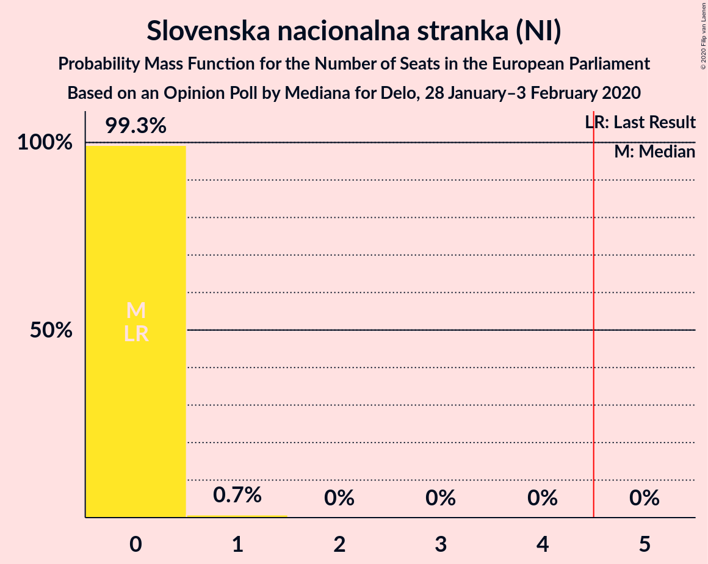

# Opinion Poll by Mediana for Delo, 28 January–3 February 2020

<a href="#voting-intentions">Voting Intentions</a> | <a href="#seats">Seats</a> | <a href="#coalitions">Coalitions</a> | <a href="#technical-information">Technical Information</a>

## Voting Intentions

### Confidence Intervals

| Party | Last Result | Poll Result | 80% Confidence Interval | 90% Confidence Interval | 95% Confidence Interval | 99% Confidence Interval |
|:-----:|:-----------:|:-----------:|:-----------------------:|:-----------------------:|:-----------------------:|:-----------------------:|
| Slovenska demokratska stranka (EPP) | 24.8% | 26.0% | 24.1–28.1% |23.5–28.7% |23.0–29.2% |22.1–30.2% |
| Lista Marjana Šarca (RE) | 0.0% | 22.3% | 20.4–24.3% |19.9–24.8% |19.5–25.3% |18.6–26.3% |
| Socialni demokrati (S&D) | 8.1% | 11.3% | 10.0–12.9% |9.6–13.4% |9.3–13.7% |8.7–14.5% |
| Levica (GUE/NGL) | 5.5% | 11.3% | 10.0–12.9% |9.6–13.4% |9.3–13.7% |8.7–14.5% |
| Nova Slovenija–Krščanski demokrati (EPP) | 16.5% | 5.9% | 5.0–7.1% |4.7–7.5% |4.5–7.8% |4.0–8.4% |
| Slovenska nacionalna stranka (NI) | 4.0% | 5.1% | 4.3–6.3% |4.0–6.6% |3.8–6.9% |3.4–7.5% |
| Stranka modernega centra (RE) | 0.0% | 3.5% | 2.8–4.5% |2.6–4.8% |2.4–5.0% |2.1–5.5% |
| Demokratična stranka upokojencev Slovenije (RE) | 8.2% | 3.1% | 2.4–4.0% |2.2–4.3% |2.1–4.6% |1.8–5.1% |
| Stranka Alenke Bratušek (RE) | 0.0% | 2.8% | 2.2–3.8% |2.0–4.0% |1.9–4.3% |1.6–4.7% |
| Slovenska ljudska stranka (EPP) | 16.5% | 2.7% | 2.1–3.6% |1.9–3.9% |1.8–4.1% |1.5–4.6% |

*Note:* The poll result column reflects the actual value used in the calculations. Published results may vary slightly, and in addition be rounded to fewer digits.

## Seats

### Confidence Intervals

| Party | Last Result | Median | 80% Confidence Interval | 90% Confidence Interval | 95% Confidence Interval | 99% Confidence Interval |
|:-----:|:-----------:|:------:|:-----------------------:|:-----------------------:|:-----------------------:|:-----------------------:|
| <a href="#slovenska-demokratska-stranka-(epp)">Slovenska demokratska stranka (EPP)</a> | 3 | 3 | 3 |3–4 |3–4 |2–4 |
| <a href="#lista-marjana-šarca-(re)">Lista Marjana Šarca (RE)</a> | 0 | 3 | 2–3 |2–3 |2–3 |2–3 |
| <a href="#socialni-demokrati-(s&d)">Socialni demokrati (S&D)</a> | 1 | 1 | 1 |1 |1 |1–2 |
| <a href="#levica-(gue/ngl)">Levica (GUE/NGL)</a> | 0 | 1 | 1 |1 |1–2 |1–2 |
| <a href="#nova-slovenija–krščanski-demokrati-(epp)">Nova Slovenija–Krščanski demokrati (EPP)</a> | 1 | 0 | 0 |0–1 |0–1 |0–1 |
| <a href="#slovenska-nacionalna-stranka-(ni)">Slovenska nacionalna stranka (NI)</a> | 0 | 0 | 0 |0 |0 |0–1 |
| <a href="#stranka-modernega-centra-(re)">Stranka modernega centra (RE)</a> | 0 | 0 | 0 |0 |0 |0 |
| <a href="#demokratična-stranka-upokojencev-slovenije-(re)">Demokratična stranka upokojencev Slovenije (RE)</a> | 1 | 0 | 0 |0 |0 |0 |
| <a href="#stranka-alenke-bratušek-(re)">Stranka Alenke Bratušek (RE)</a> | 0 | 0 | 0 |0 |0 |0 |
| <a href="#slovenska-ljudska-stranka-(epp)">Slovenska ljudska stranka (EPP)</a> | 1 | 0 | 0 |0 |0 |0 |

### Slovenska demokratska stranka (EPP)

*For a full overview of the results for this party, see the [Slovenska demokratska stranka (EPP)](party-slovenskademokratskastrankaepp.html) page.*

| Number of Seats | Probability | Accumulated | Special Marks |
|:---------------:|:-----------:|:-----------:|:-------------:|
| 2 | 0.5% | 100% |  |
| 3 | 92% | 99.5% | Last Result, Median |
| 4 | 8% | 8% |  |
| 5 | 0% | 0% | Majority |

### Lista Marjana Šarca (RE)

*For a full overview of the results for this party, see the [Lista Marjana Šarca (RE)](party-listamarjanašarcare.html) page.*

| Number of Seats | Probability | Accumulated | Special Marks |
|:---------------:|:-----------:|:-----------:|:-------------:|
| 0 | 0% | 100% | Last Result |
| 1 | 0% | 100% |  |
| 2 | 32% | 100% |  |
| 3 | 68% | 68% | Median |
| 4 | 0% | 0% |  |

### Socialni demokrati (S&D)

*For a full overview of the results for this party, see the [Socialni demokrati (S&D)](party-socialnidemokratisd.html) page.*

| Number of Seats | Probability | Accumulated | Special Marks |
|:---------------:|:-----------:|:-----------:|:-------------:|
| 1 | 98% | 100% | Last Result, Median |
| 2 | 2% | 2% |  |
| 3 | 0% | 0% |  |

### Levica (GUE/NGL)

*For a full overview of the results for this party, see the [Levica (GUE/NGL)](party-levicaguengl.html) page.*

| Number of Seats | Probability | Accumulated | Special Marks |
|:---------------:|:-----------:|:-----------:|:-------------:|
| 0 | 0% | 100% | Last Result |
| 1 | 97% | 100% | Median |
| 2 | 3% | 3% |  |
| 3 | 0% | 0% |  |

### Nova Slovenija–Krščanski demokrati (EPP)

*For a full overview of the results for this party, see the [Nova Slovenija–Krščanski demokrati (EPP)](party-novaslovenija–krščanskidemokratiepp.html) page.*

| Number of Seats | Probability | Accumulated | Special Marks |
|:---------------:|:-----------:|:-----------:|:-------------:|
| 0 | 93% | 100% | Median |
| 1 | 7% | 7% | Last Result |
| 2 | 0% | 0% |  |

### Slovenska nacionalna stranka (NI)

*For a full overview of the results for this party, see the [Slovenska nacionalna stranka (NI)](party-slovenskanacionalnastrankani.html) page.*

| Number of Seats | Probability | Accumulated | Special Marks |
|:---------------:|:-----------:|:-----------:|:-------------:|
| 0 | 99.3% | 100% | Last Result, Median |
| 1 | 0.7% | 0.7% |  |
| 2 | 0% | 0% |  |

### Stranka modernega centra (RE)

*For a full overview of the results for this party, see the [Stranka modernega centra (RE)](party-strankamodernegacentrare.html) page.*

| Number of Seats | Probability | Accumulated | Special Marks |
|:---------------:|:-----------:|:-----------:|:-------------:|
| 0 | 100% | 100% | Last Result, Median |

### Demokratična stranka upokojencev Slovenije (RE)

*For a full overview of the results for this party, see the [Demokratična stranka upokojencev Slovenije (RE)](party-demokratičnastrankaupokojencevslovenijere.html) page.*

| Number of Seats | Probability | Accumulated | Special Marks |
|:---------------:|:-----------:|:-----------:|:-------------:|
| 0 | 100% | 100% | Median |
| 1 | 0% | 0% | Last Result |

### Stranka Alenke Bratušek (RE)

*For a full overview of the results for this party, see the [Stranka Alenke Bratušek (RE)](party-strankaalenkebratušekre.html) page.*

| Number of Seats | Probability | Accumulated | Special Marks |
|:---------------:|:-----------:|:-----------:|:-------------:|
| 0 | 100% | 100% | Last Result, Median |

### Slovenska ljudska stranka (EPP)

*For a full overview of the results for this party, see the [Slovenska ljudska stranka (EPP)](party-slovenskaljudskastrankaepp.html) page.*

| Number of Seats | Probability | Accumulated | Special Marks |
|:---------------:|:-----------:|:-----------:|:-------------:|
| 0 | 100% | 100% | Median |
| 1 | 0% | 0% | Last Result |

## Coalitions

### Confidence Intervals

| Coalition | Last Result | Median | Majority? | 80% Confidence Interval | 90% Confidence Interval | 95% Confidence Interval | 99% Confidence Interval |
|:---------:|:-----------:|:------:|:---------:|:-----------------------:|:-----------------------:|:-----------------------:|:-----------------------:|
| Slovenska demokratska stranka (EPP) – Nova Slovenija–Krščanski demokrati (EPP) – Slovenska ljudska stranka (EPP) | 5 | 3 | 0% | 3–4 | 3–4 | 3–4 | 3–4 |
| Levica (GUE/NGL) | 0 | 1 | 0% | 1 | 1 | 1–2 | 1–2 |
| Socialni demokrati (S&D) | 1 | 1 | 0% | 1 | 1 | 1 | 1–2 |
| Slovenska nacionalna stranka (NI) | 0 | 0 | 0% | 0 | 0 | 0 | 0–1 |

### Slovenska demokratska stranka (EPP) – Nova Slovenija–Krščanski demokrati (EPP) – Slovenska ljudska stranka (EPP)

| Number of Seats | Probability | Accumulated | Special Marks |
|:---------------:|:-----------:|:-----------:|:-------------:|
| 2 | 0.3% | 100% |  |
| 3 | 85% | 99.7% | Median |
| 4 | 14% | 14% |  |
| 5 | 0% | 0% | Last Result, Majority |

### Levica (GUE/NGL)

| Number of Seats | Probability | Accumulated | Special Marks |
|:---------------:|:-----------:|:-----------:|:-------------:|
| 0 | 0% | 100% | Last Result |
| 1 | 97% | 100% | Median |
| 2 | 3% | 3% |  |
| 3 | 0% | 0% |  |

### Socialni demokrati (S&D)

| Number of Seats | Probability | Accumulated | Special Marks |
|:---------------:|:-----------:|:-----------:|:-------------:|
| 1 | 98% | 100% | Last Result, Median |
| 2 | 2% | 2% |  |
| 3 | 0% | 0% |  |

### Slovenska nacionalna stranka (NI)

| Number of Seats | Probability | Accumulated | Special Marks |
|:---------------:|:-----------:|:-----------:|:-------------:|
| 0 | 99.3% | 100% | Last Result, Median |
| 1 | 0.7% | 0.7% |  |
| 2 | 0% | 0% |  |

## Technical Information

### Opinion Poll

+ **Polling firm:** Mediana
+ **Commissioner(s):** Delo
+ **Fieldwork period:** 28 January–3 February 2020

### Calculations

+ **Sample size:** 777
+ **Simulations done:** 1,048,576
+ **Error estimate:** 1.78%

