# Opinion Poll by Parsifal for Nova 24, 3–5 February 2020

<a href="#voting-intentions">Voting Intentions</a> | <a href="#seats">Seats</a> | <a href="#coalitions">Coalitions</a> | <a href="#technical-information">Technical Information</a>

## Voting Intentions

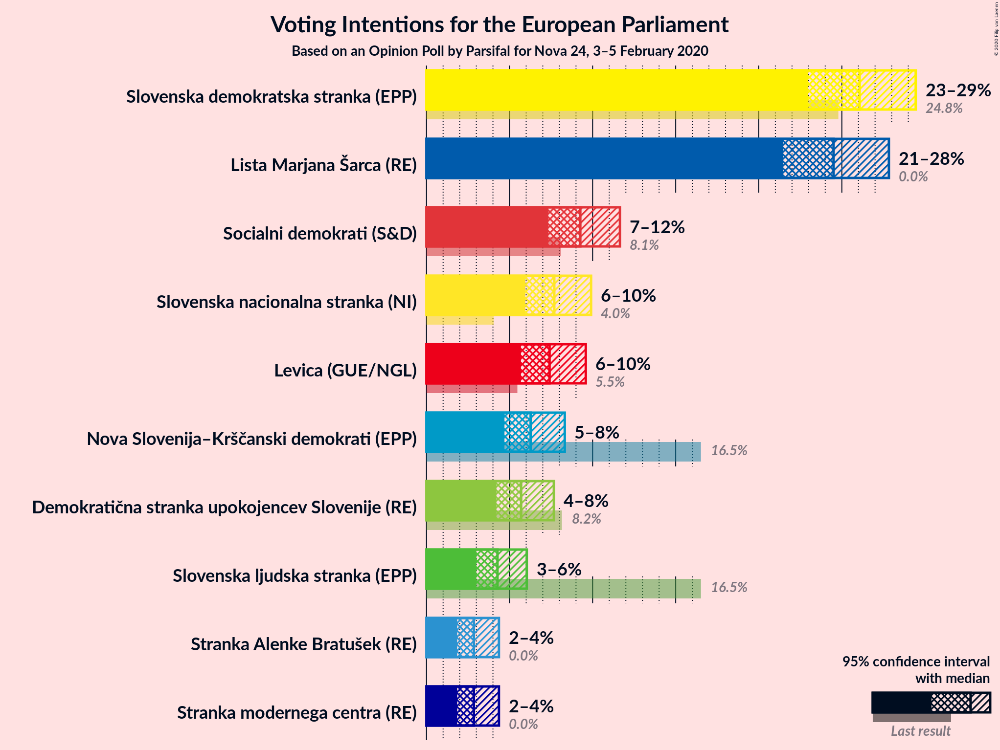

### Confidence Intervals

| Party | Last Result | Poll Result | 80% Confidence Interval | 90% Confidence Interval | 95% Confidence Interval | 99% Confidence Interval |
|:-----:|:-----------:|:-----------:|:-----------------------:|:-----------------------:|:-----------------------:|:-----------------------:|
| Slovenska demokratska stranka (EPP) | 24.8% | 26.1% | 24.0–28.3% |23.4–28.9% |23.0–29.4% |22.0–30.5% |
| Lista Marjana Šarca (RE) | 0.0% | 24.5% | 22.5–26.7% |21.9–27.3% |21.5–27.8% |20.5–28.9% |
| Socialni demokrati (S&D) | 8.1% | 9.3% | 8.0–10.8% |7.6–11.2% |7.3–11.6% |6.8–12.4% |
| Slovenska nacionalna stranka (NI) | 4.0% | 7.7% | 6.5–9.1% |6.2–9.5% |5.9–9.9% |5.4–10.6% |
| Levica (GUE/NGL) | 5.5% | 7.4% | 6.3–8.8% |6.0–9.2% |5.7–9.6% |5.2–10.3% |
| Nova Slovenija–Krščanski demokrati (EPP) | 16.5% | 6.3% | 5.2–7.6% |4.9–8.0% |4.7–8.3% |4.3–9.0% |
| Demokratična stranka upokojencev Slovenije (RE) | 8.2% | 5.7% | 4.7–7.0% |4.4–7.3% |4.2–7.7% |3.8–8.3% |
| Slovenska ljudska stranka (EPP) | 16.5% | 4.3% | 3.4–5.4% |3.2–5.7% |3.0–6.0% |2.7–6.6% |
| Stranka modernega centra (RE) | 0.0% | 2.8% | 2.2–3.8% |2.0–4.1% |1.8–4.4% |1.6–4.9% |
| Stranka Alenke Bratušek (RE) | 0.0% | 2.8% | 2.2–3.8% |2.0–4.1% |1.8–4.4% |1.6–4.9% |

*Note:* The poll result column reflects the actual value used in the calculations. Published results may vary slightly, and in addition be rounded to fewer digits.

## Seats

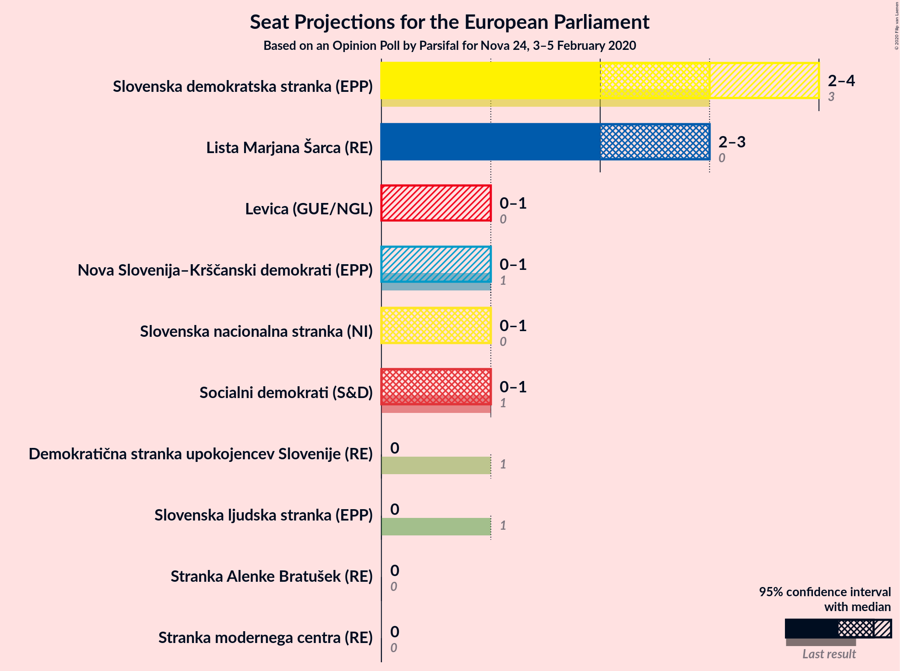

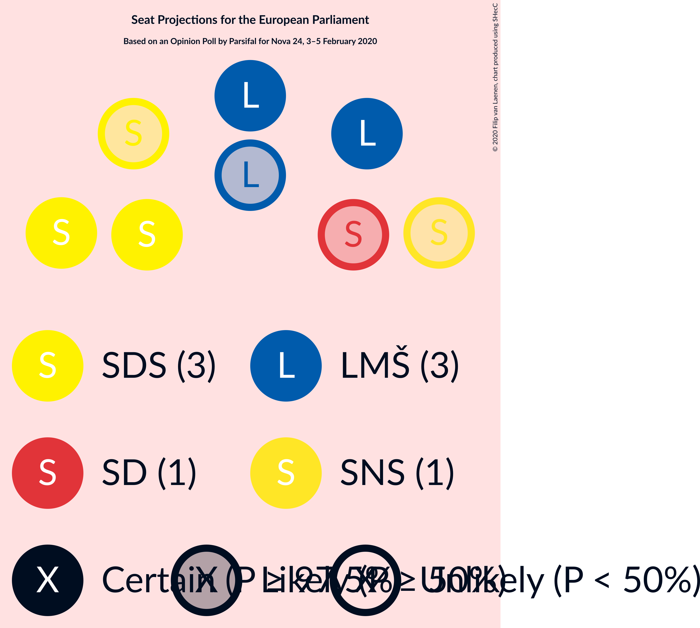

### Confidence Intervals

| Party | Last Result | Median | 80% Confidence Interval | 90% Confidence Interval | 95% Confidence Interval | 99% Confidence Interval |
|:-----:|:-----------:|:------:|:-----------------------:|:-----------------------:|:-----------------------:|:-----------------------:|
| <a href="#slovenska-demokratska-stranka-(epp)">Slovenska demokratska stranka (EPP)</a> | 3 | 3 | 3 |3 |2–4 |2–4 |
| <a href="#lista-marjana-šarca-(re)">Lista Marjana Šarca (RE)</a> | 0 | 3 | 3 |2–3 |2–3 |2–3 |
| <a href="#socialni-demokrati-(s&d)">Socialni demokrati (S&D)</a> | 1 | 1 | 1 |1 |0–1 |0–1 |
| <a href="#slovenska-nacionalna-stranka-(ni)">Slovenska nacionalna stranka (NI)</a> | 0 | 1 | 0–1 |0–1 |0–1 |0–1 |
| <a href="#levica-(gue/ngl)">Levica (GUE/NGL)</a> | 0 | 0 | 0–1 |0–1 |0–1 |0–1 |
| <a href="#nova-slovenija–krščanski-demokrati-(epp)">Nova Slovenija–Krščanski demokrati (EPP)</a> | 1 | 0 | 0 |0–1 |0–1 |0–1 |
| <a href="#demokratična-stranka-upokojencev-slovenije-(re)">Demokratična stranka upokojencev Slovenije (RE)</a> | 1 | 0 | 0 |0 |0 |0–1 |
| <a href="#slovenska-ljudska-stranka-(epp)">Slovenska ljudska stranka (EPP)</a> | 1 | 0 | 0 |0 |0 |0 |
| <a href="#stranka-modernega-centra-(re)">Stranka modernega centra (RE)</a> | 0 | 0 | 0 |0 |0 |0 |
| <a href="#stranka-alenke-bratušek-(re)">Stranka Alenke Bratušek (RE)</a> | 0 | 0 | 0 |0 |0 |0 |

### Slovenska demokratska stranka (EPP)

*For a full overview of the results for this party, see the [Slovenska demokratska stranka (EPP)](party-slovenskademokratskastrankaepp.html) page.*

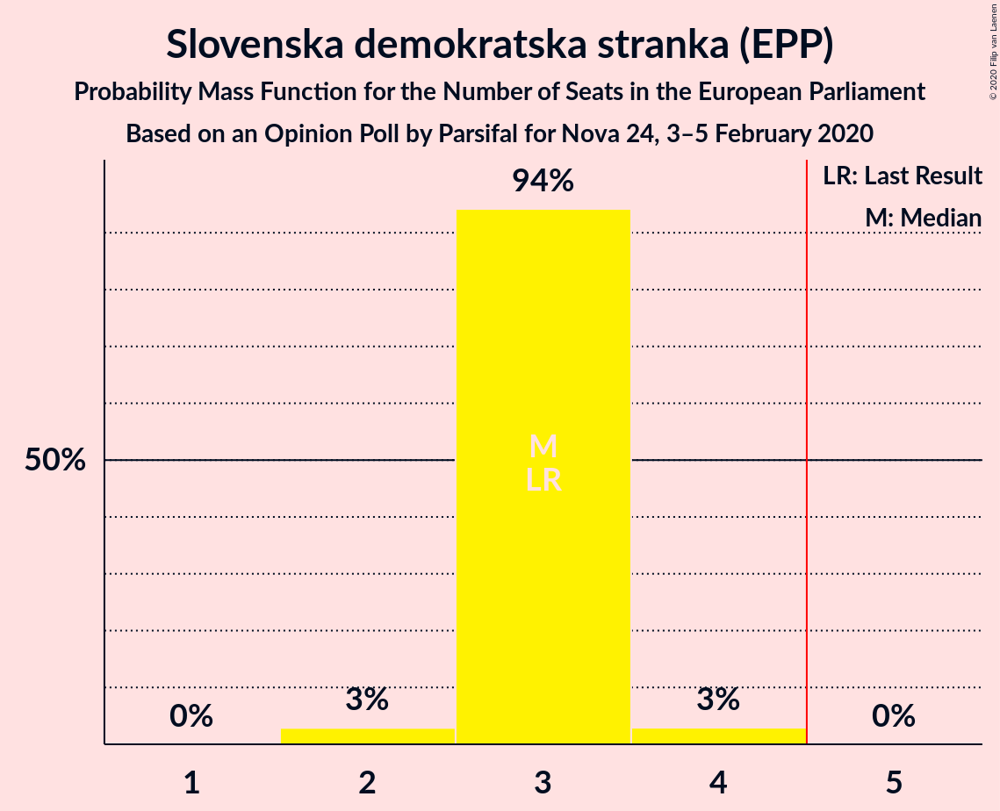

| Number of Seats | Probability | Accumulated | Special Marks |
|:---------------:|:-----------:|:-----------:|:-------------:|
| 2 | 3% | 100% |  |
| 3 | 94% | 97% | Last Result, Median |
| 4 | 3% | 3% |  |
| 5 | 0% | 0% | Majority |

### Lista Marjana Šarca (RE)

*For a full overview of the results for this party, see the [Lista Marjana Šarca (RE)](party-listamarjanašarcare.html) page.*

| Number of Seats | Probability | Accumulated | Special Marks |
|:---------------:|:-----------:|:-----------:|:-------------:|
| 0 | 0% | 100% | Last Result |
| 1 | 0% | 100% |  |
| 2 | 9% | 100% |  |
| 3 | 91% | 91% | Median |
| 4 | 0.2% | 0.2% |  |
| 5 | 0% | 0% | Majority |

### Socialni demokrati (S&D)

*For a full overview of the results for this party, see the [Socialni demokrati (S&D)](party-socialnidemokratisd.html) page.*

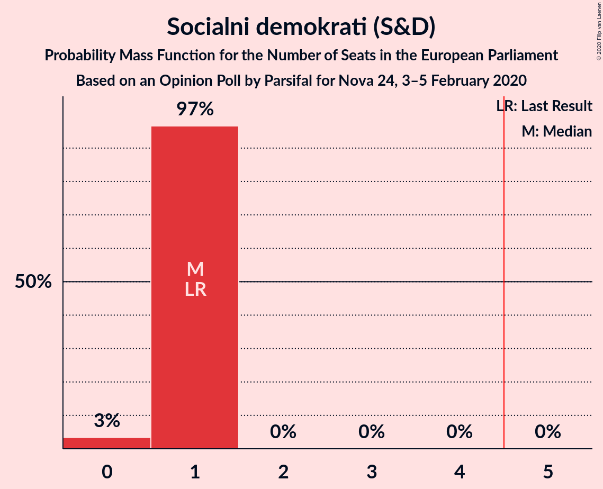

| Number of Seats | Probability | Accumulated | Special Marks |
|:---------------:|:-----------:|:-----------:|:-------------:|
| 0 | 3% | 100% |  |
| 1 | 97% | 97% | Last Result, Median |
| 2 | 0% | 0% |  |

### Slovenska nacionalna stranka (NI)

*For a full overview of the results for this party, see the [Slovenska nacionalna stranka (NI)](party-slovenskanacionalnastrankani.html) page.*

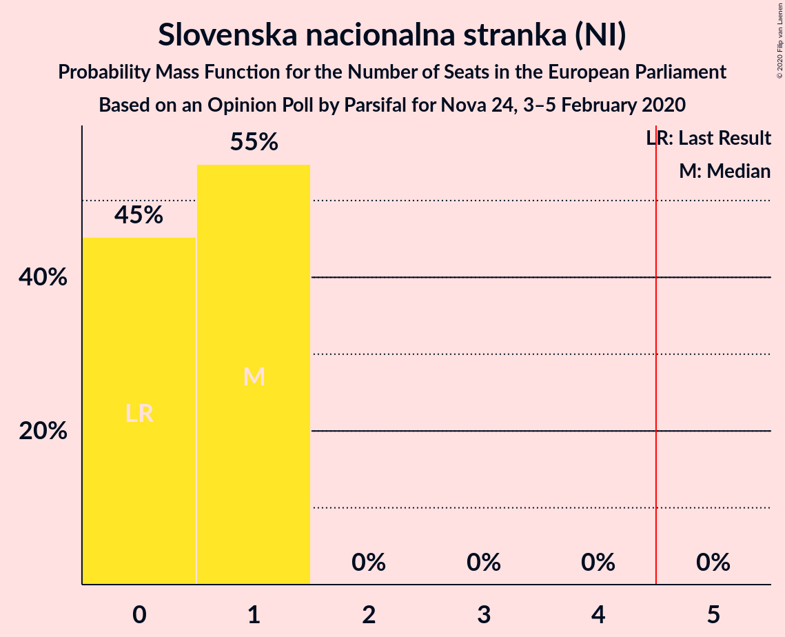

| Number of Seats | Probability | Accumulated | Special Marks |
|:---------------:|:-----------:|:-----------:|:-------------:|
| 0 | 45% | 100% | Last Result |
| 1 | 55% | 55% | Median |
| 2 | 0% | 0% |  |

### Levica (GUE/NGL)

*For a full overview of the results for this party, see the [Levica (GUE/NGL)](party-levicaguengl.html) page.*

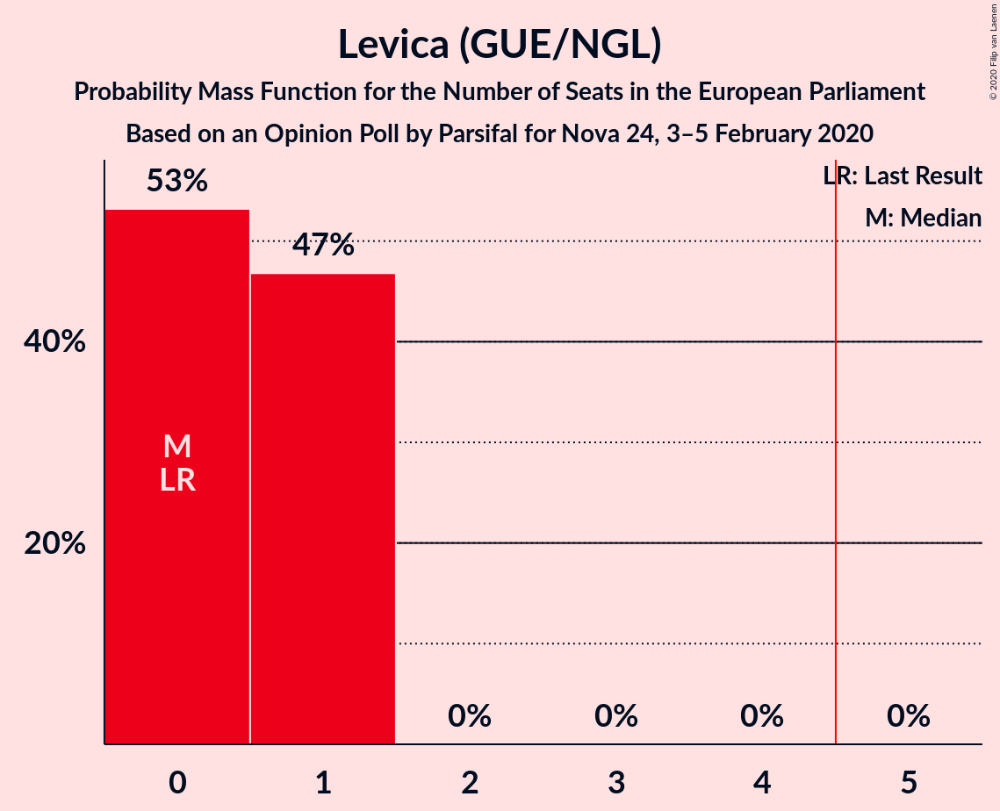

| Number of Seats | Probability | Accumulated | Special Marks |
|:---------------:|:-----------:|:-----------:|:-------------:|
| 0 | 53% | 100% | Last Result, Median |
| 1 | 47% | 47% |  |
| 2 | 0% | 0% |  |

### Nova Slovenija–Krščanski demokrati (EPP)

*For a full overview of the results for this party, see the [Nova Slovenija–Krščanski demokrati (EPP)](party-novaslovenija–krščanskidemokratiepp.html) page.*

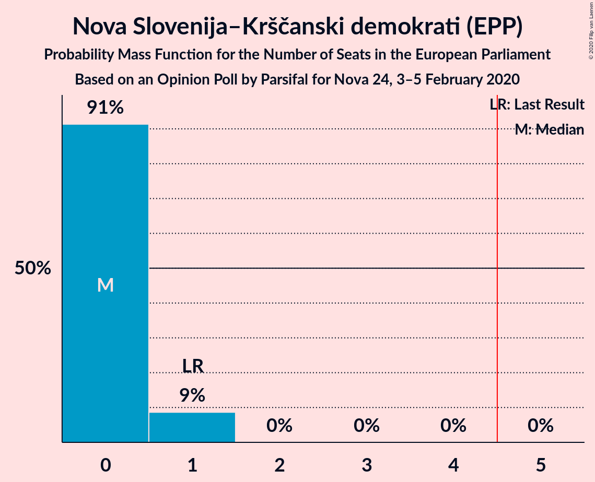

| Number of Seats | Probability | Accumulated | Special Marks |
|:---------------:|:-----------:|:-----------:|:-------------:|
| 0 | 91% | 100% | Median |
| 1 | 9% | 9% | Last Result |
| 2 | 0% | 0% |  |

### Demokratična stranka upokojencev Slovenije (RE)

*For a full overview of the results for this party, see the [Demokratična stranka upokojencev Slovenije (RE)](party-demokratičnastrankaupokojencevslovenijere.html) page.*

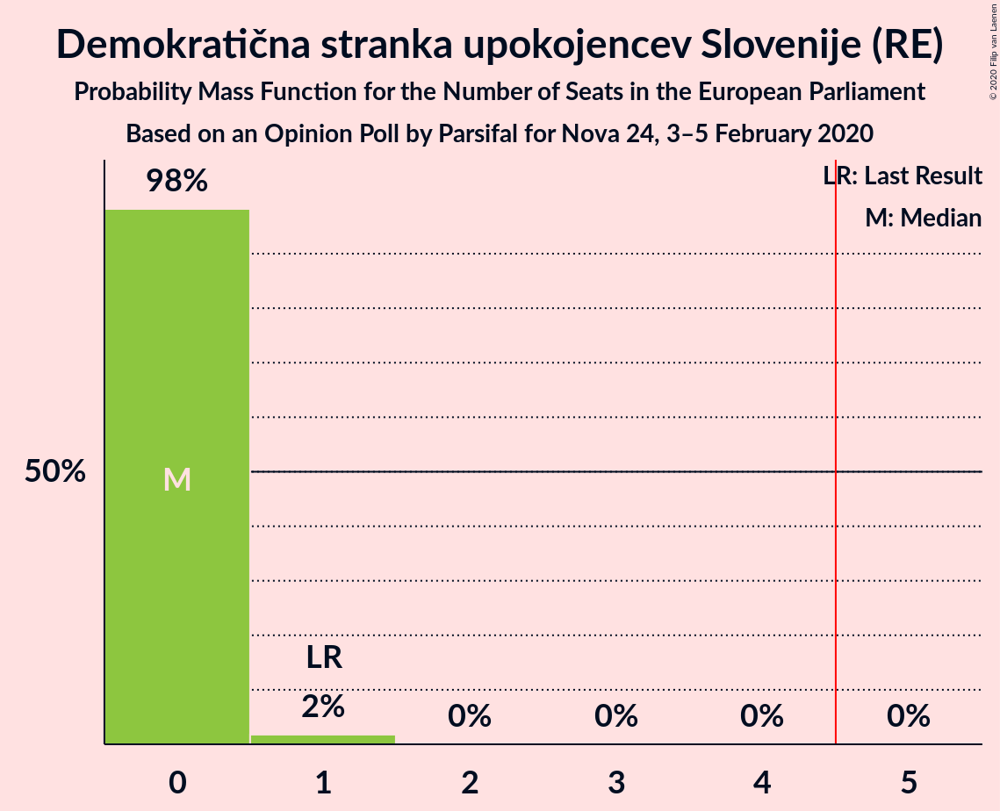

| Number of Seats | Probability | Accumulated | Special Marks |
|:---------------:|:-----------:|:-----------:|:-------------:|
| 0 | 98% | 100% | Median |
| 1 | 2% | 2% | Last Result |
| 2 | 0% | 0% |  |

### Slovenska ljudska stranka (EPP)

*For a full overview of the results for this party, see the [Slovenska ljudska stranka (EPP)](party-slovenskaljudskastrankaepp.html) page.*

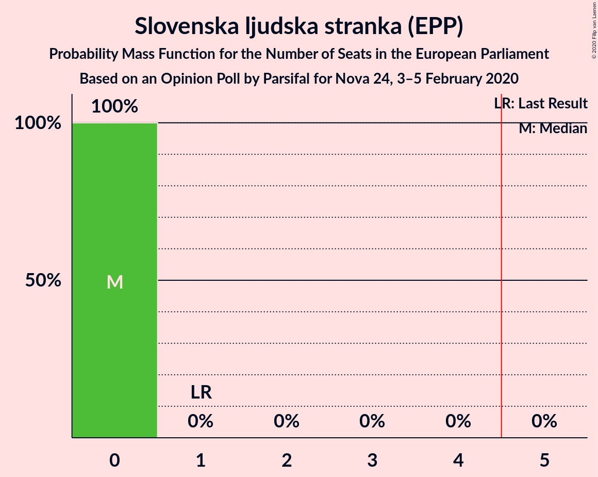

| Number of Seats | Probability | Accumulated | Special Marks |
|:---------------:|:-----------:|:-----------:|:-------------:|
| 0 | 100% | 100% | Median |
| 1 | 0% | 0% | Last Result |

### Stranka modernega centra (RE)

*For a full overview of the results for this party, see the [Stranka modernega centra (RE)](party-strankamodernegacentrare.html) page.*

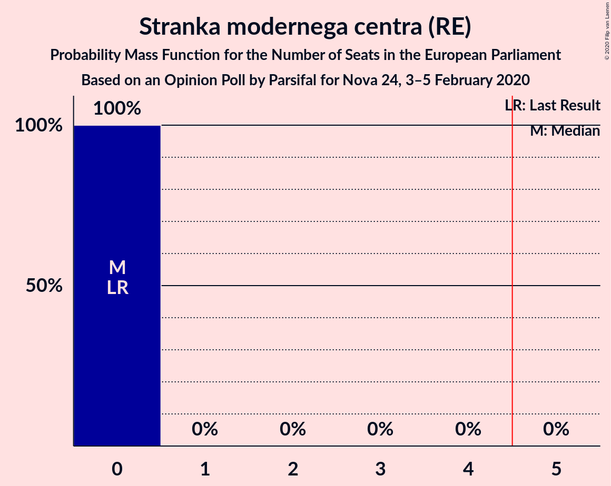

| Number of Seats | Probability | Accumulated | Special Marks |
|:---------------:|:-----------:|:-----------:|:-------------:|
| 0 | 100% | 100% | Last Result, Median |

### Stranka Alenke Bratušek (RE)

*For a full overview of the results for this party, see the [Stranka Alenke Bratušek (RE)](party-strankaalenkebratušekre.html) page.*

| Number of Seats | Probability | Accumulated | Special Marks |
|:---------------:|:-----------:|:-----------:|:-------------:|
| 0 | 100% | 100% | Last Result, Median |

## Coalitions

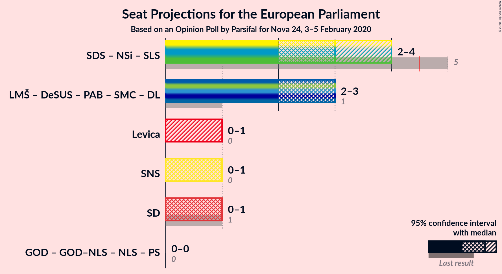

### Confidence Intervals

| Coalition | Last Result | Median | Majority? | 80% Confidence Interval | 90% Confidence Interval | 95% Confidence Interval | 99% Confidence Interval |
|:---------:|:-----------:|:------:|:---------:|:-----------------------:|:-----------------------:|:-----------------------:|:-----------------------:|
| Slovenska demokratska stranka (EPP) – Nova Slovenija–Krščanski demokrati (EPP) – Slovenska ljudska stranka (EPP) | 5 | 3 | 0.1% | 3–4 | 3–4 | 2–4 | 2–4 |
| Levica (GUE/NGL) | 0 | 0 | 0% | 0–1 | 0–1 | 0–1 | 0–1 |
| Slovenska nacionalna stranka (NI) | 0 | 1 | 0% | 0–1 | 0–1 | 0–1 | 0–1 |
| Socialni demokrati (S&D) | 1 | 1 | 0% | 1 | 1 | 0–1 | 0–1 |

### Slovenska demokratska stranka (EPP) – Nova Slovenija–Krščanski demokrati (EPP) – Slovenska ljudska stranka (EPP)

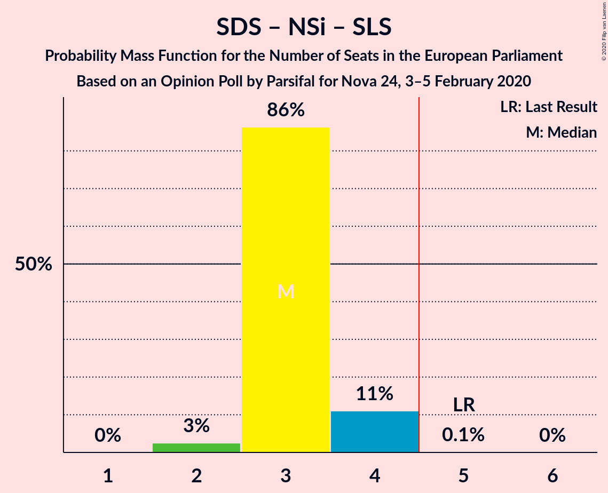

| Number of Seats | Probability | Accumulated | Special Marks |
|:---------------:|:-----------:|:-----------:|:-------------:|
| 2 | 3% | 100% |  |
| 3 | 86% | 97% | Median |
| 4 | 11% | 11% |  |
| 5 | 0.1% | 0.1% | Last Result, Majority |
| 6 | 0% | 0% |  |

### Levica (GUE/NGL)

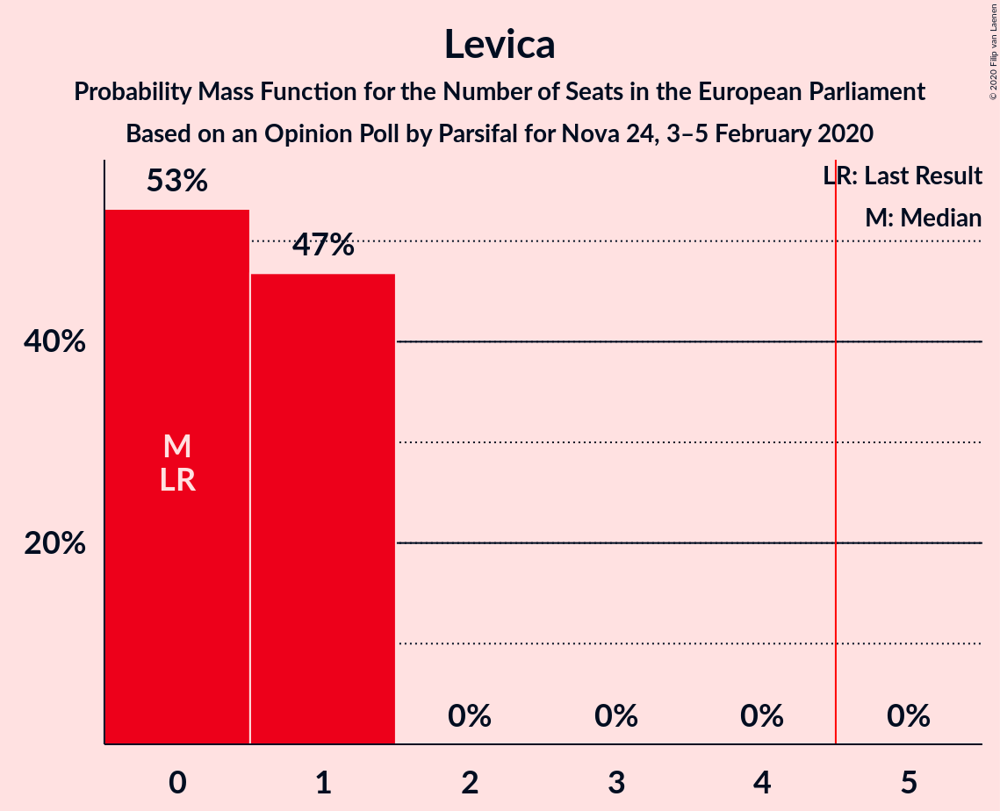

| Number of Seats | Probability | Accumulated | Special Marks |
|:---------------:|:-----------:|:-----------:|:-------------:|
| 0 | 53% | 100% | Last Result, Median |
| 1 | 47% | 47% |  |
| 2 | 0% | 0% |  |

### Slovenska nacionalna stranka (NI)

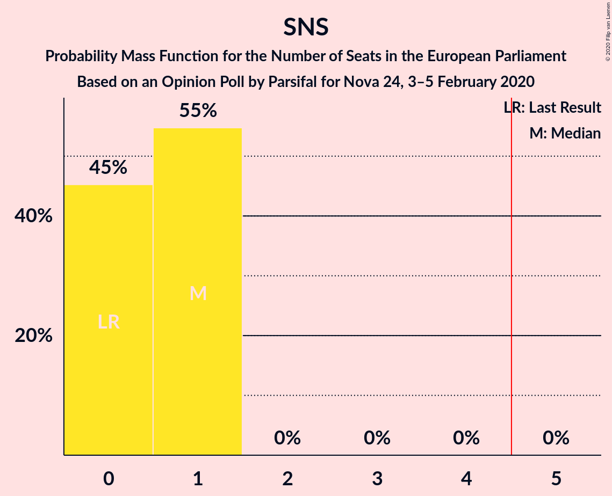

| Number of Seats | Probability | Accumulated | Special Marks |
|:---------------:|:-----------:|:-----------:|:-------------:|
| 0 | 45% | 100% | Last Result |
| 1 | 55% | 55% | Median |
| 2 | 0% | 0% |  |

### Socialni demokrati (S&D)

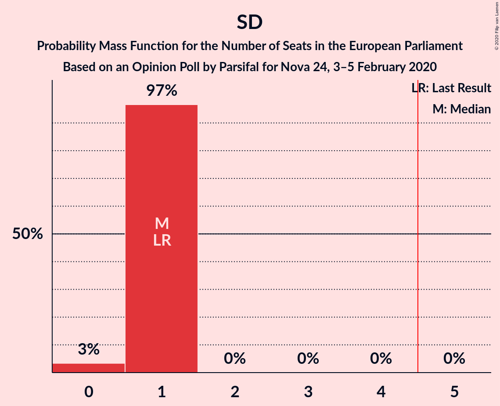

| Number of Seats | Probability | Accumulated | Special Marks |
|:---------------:|:-----------:|:-----------:|:-------------:|
| 0 | 3% | 100% |  |
| 1 | 97% | 97% | Last Result, Median |
| 2 | 0% | 0% |  |

## Technical Information

### Opinion Poll

+ **Polling firm:** Parsifal
+ **Commissioner(s):** Nova 24
+ **Fieldwork period:** 3–5 February 2020

### Calculations

+ **Sample size:** 702
+ **Simulations done:** 1,048,576
+ **Error estimate:** 2.96%

