# Poll Average

<a href="#voting-intentions">Voting Intentions</a> | <a href="#seats">Seats</a> | <a href="#coalitions">Coalitions</a> | <a href="#technical-information">Technical Information</a>

## Summary

The table below lists the polls on which the average is based. They are the most recent polls (less than 90 days old) registered and analyzed so far.

| Period     | Polling firm/Commissioner(s) | SDS | NSi | SLS | DeSUS | SD | PS | Levica | SNS | DL | GOD | GOD–NLS | LMŠ | NLS | SMC | PAB | SDS–SLS |
|:----------:|:----------------------------:|:--:|:--:|:--:|:--:|:--:|:--:|:--:|:--:|:--:|:--:|:--:|:--:|:--:|:--:|:--:|:--:|
| 26 May 2019 | General Election | 24.8%   3 | 16.5%   1 | 16.5%   1 | 8.2%   1 | 8.1%   1 | 6.6%   0 | 5.5%   0 | 4.0%   0 | 1.1%   0 | 0.0%   0 | 0.0%   0 | 0.0%   0 | 0.0%   0 | 0.0%   0 | 0.0%   0 | 24.8%   4 |
| N/A | Poll Average | 21–35%   2–4 | 3–10%   0–1 | 1–4%   0 | 2–11%   0–1 | 11–20%   1–2 | N/A   N/A | 10–16%   1 | 2–4%   0 | N/A   N/A | N/A   N/A | N/A   N/A | 10–22%   1–2 | N/A   N/A | 0–3%   0 | 1–6%   0 | N/A   N/A |
| [1–30 December 2020](2020-12-30-CRJM.html) | CRJM   Delo | 20–25%   2–3 | 5–8%   0–1 | 1–2%   0 | 6–9%   0–1 | 15–20%   1–2 | N/A   N/A | 11–16%   1–2 | 2–5%   0 | N/A   N/A | N/A   N/A | N/A   N/A | 18–23%   2–3 | N/A   N/A | 1–2%   0 | 1–3%   0 | N/A   N/A |
| [1–28 December 2020](2020-12-28-Mediana.html) | Mediana   Delo | 25–31%   2–3 | 7–11%   0–1 | 1–4%   0 | 2–4%   0 | 14–19%   1–2 | N/A   N/A | 11–16%   1 | 1–3%   0 | N/A   N/A | N/A   N/A | N/A   N/A | 10–14%   1 | N/A   N/A | 1–3%   0 | 2–5%   0 | N/A   N/A |
| [21–23 December 2020](2020-12-23-Parsifal.html) | Parsifal   Nova 24TV | 29–36%   3–4 | 3–6%   0 | 1–3%   0 | 8–12%   1 | 10–15%   1 | N/A   N/A | 9–14%   1 | 1–4%   0 | N/A   N/A | N/A   N/A | N/A   N/A | 13–18%   1–2 | N/A   N/A | 1–3%   0 | 3–5%   0 | N/A   N/A |
| [15–17 December 2020](2020-12-17-Ninamedia.html) | Ninamedia   Dnevnik | 27–34%   3–4 | 4–8%   0 | 2–5%   0 | 4–7%   0 | 15–20%   1–2 | N/A   N/A | 11–16%   1–2 | 2–4%   0 | N/A   N/A | N/A   N/A | N/A   N/A | 15–20%   1–2 | N/A   N/A | 0–1%   0 | 3–6%   0 | N/A   N/A |
| 26 May 2019 | General Election | 24.8%   3 | 16.5%   1 | 16.5%   1 | 8.2%   1 | 8.1%   1 | 6.6%   0 | 5.5%   0 | 4.0%   0 | 1.1%   0 | 0.0%   0 | 0.0%   0 | 0.0%   0 | 0.0%   0 | 0.0%   0 | 0.0%   0 | 24.8%   4 |

Only polls for which at least the sample size has been published are included in the table above.

**Legend:**
+ **Top half of each row:** Voting intentions (95% confidence interval)
+ **Bottom half of each row:** Seat projections for the European Parliament (95% confidence interval)
+ **SDS:** Slovenska demokratska stranka (EPP)
+ **NSi:** Nova Slovenija–Krščanski demokrati (EPP)
+ **SLS:** Slovenska ljudska stranka (EPP)
+ **DeSUS:** Demokratična stranka upokojencev Slovenije (RE)
+ **SD:** Socialni demokrati (S&D)
+ **PS:** Pozitivna Slovenija (*)
+ **Levica:** Levica (GUE/NGL)
+ **SNS:** Slovenska nacionalna stranka (NI)
+ **DL:** Državljanska lista (RE)
+ **GOD:** Glas za otroke in družine (*)
+ **GOD–NLS:** Glas za otroke in družine–Nova ljudska stranka Slovenije (*)
+ **LMŠ:** Lista Marjana Šarca (RE)
+ **NLS:** Nova ljudska stranka Slovenije (*)
+ **SMC:** Stranka modernega centra (RE)
+ **PAB:** Stranka Alenke Bratušek (RE)
+ **SDS–SLS:** Slovenska demokratska stranka–Slovenska ljudska stranka (EPP)
+ **N/A (single party):** Party not included the published results
+ **N/A (entire row):** Calculation for this opinion poll not started yet

## Voting Intentions

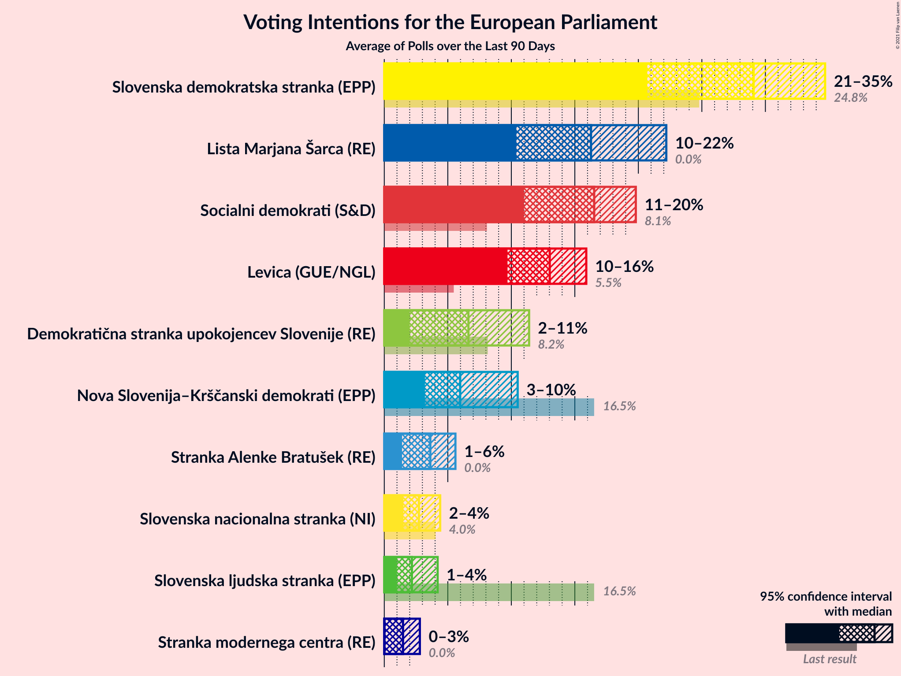

### Confidence Intervals

| Party | Last Result | Median | 80% Confidence Interval | 90% Confidence Interval | 95% Confidence Interval | 99% Confidence Interval |
|:-----:|:-----------:|:------:|:-----------------------:|:-----------------------:|:-----------------------:|:-----------------------:|
| <a href="#slovenska-demokratska-stranka-(epp)">Slovenska demokratska stranka (EPP)</a> | 24.8% | 29.1% | 22.0–33.1% |21.3–34.0% | 20.7–34.7% | 19.7–36.0% |
| <a href="#slovenska-demokratska-stranka–slovenska-ljudska-stranka-(epp)">Slovenska demokratska stranka–Slovenska ljudska stranka (EPP)</a> | 24.8% | N/A | N/A |N/A | N/A | N/A |
| <a href="#nova-slovenija–krščanski-demokrati-(epp)">Nova Slovenija–Krščanski demokrati (EPP)</a> | 16.5% | 6.0% | 3.8–9.3% |3.5–10.0% | 3.2–10.5% | 2.8–11.4% |
| <a href="#slovenska-ljudska-stranka-(epp)">Slovenska ljudska stranka (EPP)</a> | 16.5% | 2.2% | 1.3–3.5% |1.2–3.9% | 1.0–4.2% | 0.8–4.8% |
| <a href="#demokratična-stranka-upokojencev-slovenije-(re)">Demokratična stranka upokojencev Slovenije (RE)</a> | 8.2% | 6.6% | 2.6–10.3% |2.3–10.9% | 2.0–11.4% | 1.7–12.4% |
| <a href="#socialni-demokrati-(s&d)">Socialni demokrati (S&D)</a> | 8.1% | 16.5% | 12.2–18.7% |11.5–19.3% | 11.0–19.8% | 10.2–20.8% |
| <a href="#pozitivna-slovenija-(*)">Pozitivna Slovenija (*)</a> | 6.6% | N/A | N/A |N/A | N/A | N/A |
| <a href="#levica-(gue/ngl)">Levica (GUE/NGL)</a> | 5.5% | 13.0% | 10.8–14.9% |10.2–15.4% | 9.7–15.9% | 9.0–16.8% |
| <a href="#slovenska-nacionalna-stranka-(ni)">Slovenska nacionalna stranka (NI)</a> | 4.0% | 2.7% | 1.8–3.9% |1.6–4.2% | 1.5–4.4% | 1.2–5.0% |
| <a href="#državljanska-lista-(re)">Državljanska lista (RE)</a> | 1.1% | N/A | N/A |N/A | N/A | N/A |
| <a href="#glas-za-otroke-in-družine-(*)">Glas za otroke in družine (*)</a> | 0.0% | N/A | N/A |N/A | N/A | N/A |
| <a href="#glas-za-otroke-in-družine–nova-ljudska-stranka-slovenije-(*)">Glas za otroke in družine–Nova ljudska stranka Slovenije (*)</a> | 0.0% | N/A | N/A |N/A | N/A | N/A |
| <a href="#lista-marjana-šarca-(re)">Lista Marjana Šarca (RE)</a> | 0.0% | 16.3% | 11.6–20.9% |10.9–21.6% | 10.4–22.2% | 9.5–23.3% |
| <a href="#nova-ljudska-stranka-slovenije-(*)">Nova ljudska stranka Slovenije (*)</a> | 0.0% | N/A | N/A |N/A | N/A | N/A |
| <a href="#stranka-modernega-centra-(re)">Stranka modernega centra (RE)</a> | 0.0% | 1.5% | 0.2–2.3% |0.1–2.5% | 0.1–2.8% | 0.0–3.2% |
| <a href="#stranka-alenke-bratušek-(re)">Stranka Alenke Bratušek (RE)</a> | 0.0% | 3.6% | 1.8–4.9% |1.6–5.3% | 1.4–5.6% | 1.2–6.2% |

### Slovenska demokratska stranka (EPP)

*For a full overview of the results for this party, see the [Slovenska demokratska stranka (EPP)](party-slovenskademokratskastrankaepp.html) page.*

| Voting Intentions | Probability | Accumulated | Special Marks |
|:-----------------:|:-----------:|:-----------:|:-------------:|
| 17.5–18.5% | 0% | 100% |  |
| 18.5–19.5% | 0.3% | 100% |  |
| 19.5–20.5% | 2% | 99.6% |  |
| 20.5–21.5% | 5% | 98% |  |
| 21.5–22.5% | 7% | 93% |  |
| 22.5–23.5% | 6% | 86% |  |
| 23.5–24.5% | 4% | 80% |  |
| 24.5–25.5% | 2% | 76% | Last Result |
| 25.5–26.5% | 4% | 74% |  |
| 26.5–27.5% | 6% | 70% |  |
| 27.5–28.5% | 8% | 64% |  |
| 28.5–29.5% | 10% | 55% | Median |
| 29.5–30.5% | 11% | 45% |  |
| 30.5–31.5% | 11% | 35% |  |
| 31.5–32.5% | 10% | 24% |  |
| 32.5–33.5% | 7% | 14% |  |
| 33.5–34.5% | 4% | 7% |  |
| 34.5–35.5% | 2% | 3% |  |
| 35.5–36.5% | 0.7% | 0.9% |  |
| 36.5–37.5% | 0.2% | 0.2% |  |
| 37.5–38.5% | 0% | 0% |  |

### Nova Slovenija–Krščanski demokrati (EPP)

*For a full overview of the results for this party, see the [Nova Slovenija–Krščanski demokrati (EPP)](party-novaslovenija–krščanskidemokratiepp.html) page.*

| Voting Intentions | Probability | Accumulated | Special Marks |
|:-----------------:|:-----------:|:-----------:|:-------------:|
| 0.5–1.5% | 0% | 100% |  |
| 1.5–2.5% | 0.2% | 100% |  |
| 2.5–3.5% | 6% | 99.8% |  |
| 3.5–4.5% | 15% | 94% |  |
| 4.5–5.5% | 19% | 79% |  |
| 5.5–6.5% | 22% | 60% | Median |
| 6.5–7.5% | 12% | 38% |  |
| 7.5–8.5% | 8% | 25% |  |
| 8.5–9.5% | 9% | 17% |  |
| 9.5–10.5% | 6% | 8% |  |
| 10.5–11.5% | 2% | 2% |  |
| 11.5–12.5% | 0.4% | 0.4% |  |
| 12.5–13.5% | 0% | 0% |  |
| 13.5–14.5% | 0% | 0% |  |
| 14.5–15.5% | 0% | 0% |  |
| 15.5–16.5% | 0% | 0% |  |
| 16.5–17.5% | 0% | 0% | Last Result |

### Slovenska ljudska stranka (EPP)

*For a full overview of the results for this party, see the [Slovenska ljudska stranka (EPP)](party-slovenskaljudskastrankaepp.html) page.*

| Voting Intentions | Probability | Accumulated | Special Marks |
|:-----------------:|:-----------:|:-----------:|:-------------:|
| 0.0–0.5% | 0% | 100% |  |
| 0.5–1.5% | 21% | 100% |  |
| 1.5–2.5% | 43% | 79% | Median |
| 2.5–3.5% | 26% | 36% |  |
| 3.5–4.5% | 8% | 9% |  |
| 4.5–5.5% | 0.9% | 1.0% |  |
| 5.5–6.5% | 0% | 0% |  |
| 6.5–7.5% | 0% | 0% |  |
| 7.5–8.5% | 0% | 0% |  |
| 8.5–9.5% | 0% | 0% |  |
| 9.5–10.5% | 0% | 0% |  |
| 10.5–11.5% | 0% | 0% |  |
| 11.5–12.5% | 0% | 0% |  |
| 12.5–13.5% | 0% | 0% |  |
| 13.5–14.5% | 0% | 0% |  |
| 14.5–15.5% | 0% | 0% |  |
| 15.5–16.5% | 0% | 0% |  |
| 16.5–17.5% | 0% | 0% | Last Result |

### Demokratična stranka upokojencev Slovenije (RE)

*For a full overview of the results for this party, see the [Demokratična stranka upokojencev Slovenije (RE)](party-demokratičnastrankaupokojencevslovenijere.html) page.*

| Voting Intentions | Probability | Accumulated | Special Marks |
|:-----------------:|:-----------:|:-----------:|:-------------:|
| 0.0–0.5% | 0% | 100% |  |
| 0.5–1.5% | 0.2% | 100% |  |
| 1.5–2.5% | 9% | 99.8% |  |
| 2.5–3.5% | 13% | 91% |  |
| 3.5–4.5% | 6% | 78% |  |
| 4.5–5.5% | 10% | 72% |  |
| 5.5–6.5% | 11% | 62% |  |
| 6.5–7.5% | 12% | 51% | Median |
| 7.5–8.5% | 12% | 39% | Last Result |
| 8.5–9.5% | 10% | 27% |  |
| 9.5–10.5% | 9% | 17% |  |
| 10.5–11.5% | 6% | 8% |  |
| 11.5–12.5% | 2% | 2% |  |
| 12.5–13.5% | 0.3% | 0.3% |  |
| 13.5–14.5% | 0% | 0% |  |

### Socialni demokrati (S&D)

*For a full overview of the results for this party, see the [Socialni demokrati (S&D)](party-socialnidemokratisd.html) page.*

| Voting Intentions | Probability | Accumulated | Special Marks |
|:-----------------:|:-----------:|:-----------:|:-------------:|
| 7.5–8.5% | 0% | 100% | Last Result |
| 8.5–9.5% | 0.1% | 100% |  |
| 9.5–10.5% | 1.0% | 99.9% |  |
| 10.5–11.5% | 4% | 98.9% |  |
| 11.5–12.5% | 8% | 95% |  |
| 12.5–13.5% | 8% | 87% |  |
| 13.5–14.5% | 6% | 79% |  |
| 14.5–15.5% | 8% | 74% |  |
| 15.5–16.5% | 16% | 65% |  |
| 16.5–17.5% | 21% | 49% | Median |
| 17.5–18.5% | 17% | 29% |  |
| 18.5–19.5% | 8% | 12% |  |
| 19.5–20.5% | 3% | 3% |  |
| 20.5–21.5% | 0.6% | 0.7% |  |
| 21.5–22.5% | 0.1% | 0.1% |  |
| 22.5–23.5% | 0% | 0% |  |

### Levica (GUE/NGL)

*For a full overview of the results for this party, see the [Levica (GUE/NGL)](party-levicaguengl.html) page.*

| Voting Intentions | Probability | Accumulated | Special Marks |
|:-----------------:|:-----------:|:-----------:|:-------------:|
| 4.5–5.5% | 0% | 100% | Last Result |
| 5.5–6.5% | 0% | 100% |  |
| 6.5–7.5% | 0% | 100% |  |
| 7.5–8.5% | 0.2% | 100% |  |
| 8.5–9.5% | 2% | 99.8% |  |
| 9.5–10.5% | 6% | 98% |  |
| 10.5–11.5% | 12% | 92% |  |
| 11.5–12.5% | 19% | 80% |  |
| 12.5–13.5% | 25% | 62% | Median |
| 13.5–14.5% | 21% | 36% |  |
| 14.5–15.5% | 11% | 15% |  |
| 15.5–16.5% | 3% | 4% |  |
| 16.5–17.5% | 0.7% | 0.8% |  |
| 17.5–18.5% | 0.1% | 0.1% |  |
| 18.5–19.5% | 0% | 0% |  |

### Slovenska nacionalna stranka (NI)

*For a full overview of the results for this party, see the [Slovenska nacionalna stranka (NI)](party-slovenskanacionalnastrankani.html) page.*

| Voting Intentions | Probability | Accumulated | Special Marks |
|:-----------------:|:-----------:|:-----------:|:-------------:|
| 0.0–0.5% | 0% | 100% |  |
| 0.5–1.5% | 4% | 100% |  |
| 1.5–2.5% | 38% | 96% |  |
| 2.5–3.5% | 40% | 58% | Median |
| 3.5–4.5% | 16% | 18% | Last Result |
| 4.5–5.5% | 2% | 2% |  |
| 5.5–6.5% | 0.1% | 0.1% |  |
| 6.5–7.5% | 0% | 0% |  |

### Lista Marjana Šarca (RE)

*For a full overview of the results for this party, see the [Lista Marjana Šarca (RE)](party-listamarjanašarcare.html) page.*

| Voting Intentions | Probability | Accumulated | Special Marks |
|:-----------------:|:-----------:|:-----------:|:-------------:|
| 0.0–0.5% | 0% | 100% | Last Result |
| 0.5–1.5% | 0% | 100% |  |
| 1.5–2.5% | 0% | 100% |  |
| 2.5–3.5% | 0% | 100% |  |
| 3.5–4.5% | 0% | 100% |  |
| 4.5–5.5% | 0% | 100% |  |
| 5.5–6.5% | 0% | 100% |  |
| 6.5–7.5% | 0% | 100% |  |
| 7.5–8.5% | 0% | 100% |  |
| 8.5–9.5% | 0.5% | 100% |  |
| 9.5–10.5% | 3% | 99.5% |  |
| 10.5–11.5% | 7% | 97% |  |
| 11.5–12.5% | 8% | 90% |  |
| 12.5–13.5% | 7% | 82% |  |
| 13.5–14.5% | 7% | 75% |  |
| 14.5–15.5% | 10% | 68% |  |
| 15.5–16.5% | 12% | 58% | Median |
| 16.5–17.5% | 10% | 47% |  |
| 17.5–18.5% | 8% | 36% |  |
| 18.5–19.5% | 8% | 28% |  |
| 19.5–20.5% | 8% | 21% |  |
| 20.5–21.5% | 7% | 12% |  |
| 21.5–22.5% | 4% | 5% |  |
| 22.5–23.5% | 1.3% | 2% |  |
| 23.5–24.5% | 0.3% | 0.3% |  |
| 24.5–25.5% | 0% | 0% |  |

### Stranka modernega centra (RE)

*For a full overview of the results for this party, see the [Stranka modernega centra (RE)](party-strankamodernegacentrare.html) page.*

| Voting Intentions | Probability | Accumulated | Special Marks |
|:-----------------:|:-----------:|:-----------:|:-------------:|
| 0.0–0.5% | 22% | 100% | Last Result |
| 0.5–1.5% | 31% | 78% | Median |
| 1.5–2.5% | 41% | 46% |  |
| 2.5–3.5% | 5% | 5% |  |
| 3.5–4.5% | 0.1% | 0.1% |  |
| 4.5–5.5% | 0% | 0% |  |

### Stranka Alenke Bratušek (RE)

*For a full overview of the results for this party, see the [Stranka Alenke Bratušek (RE)](party-strankaalenkebratušekre.html) page.*

| Voting Intentions | Probability | Accumulated | Special Marks |
|:-----------------:|:-----------:|:-----------:|:-------------:|
| 0.0–0.5% | 0% | 100% | Last Result |
| 0.5–1.5% | 4% | 100% |  |
| 1.5–2.5% | 19% | 96% |  |
| 2.5–3.5% | 24% | 77% |  |
| 3.5–4.5% | 36% | 53% | Median |
| 4.5–5.5% | 15% | 17% |  |
| 5.5–6.5% | 2% | 3% |  |
| 6.5–7.5% | 0.2% | 0.2% |  |
| 7.5–8.5% | 0% | 0% |  |

## Seats

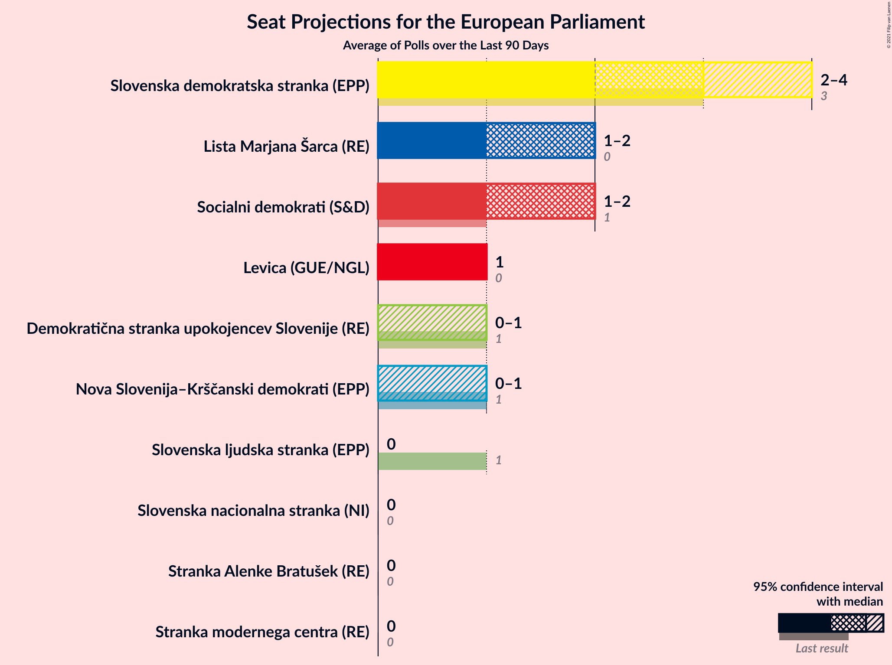

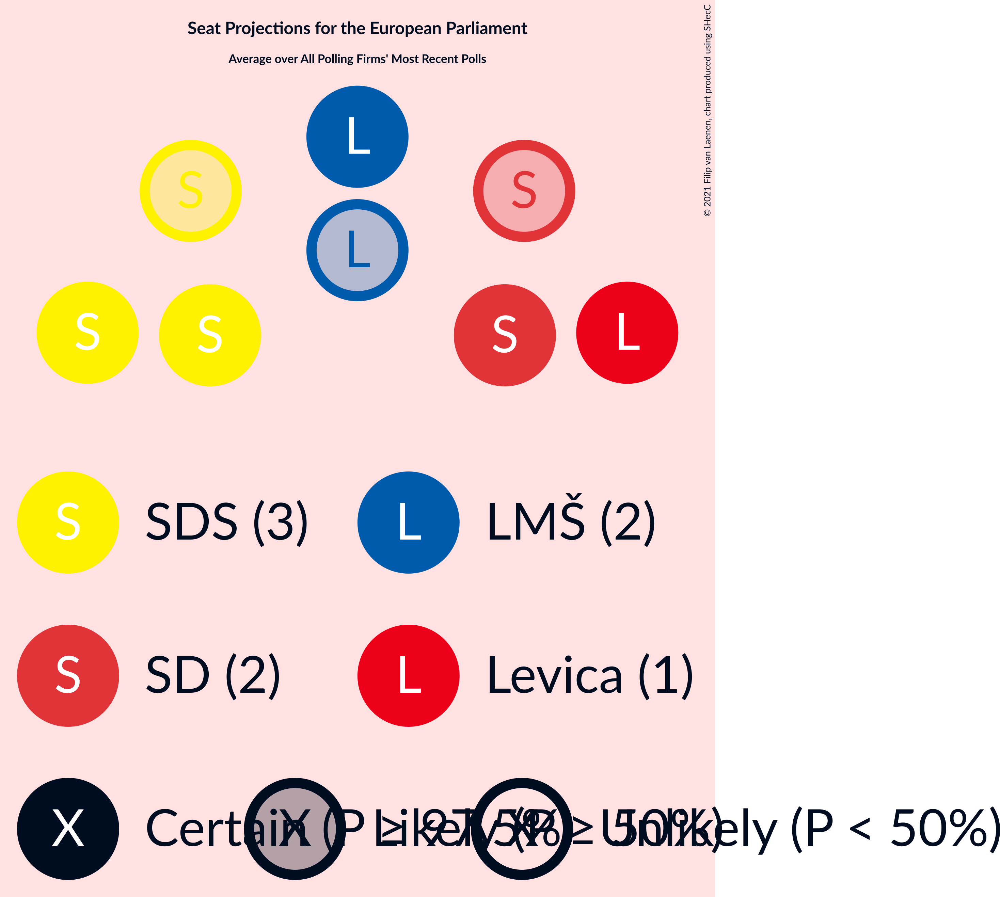

### Confidence Intervals

| Party | Last Result | Median | 80% Confidence Interval | 90% Confidence Interval | 95% Confidence Interval | 99% Confidence Interval |
|:-----:|:-----------:|:------:|:-----------------------:|:-----------------------:|:-----------------------:|:-----------------------:|
| <a href="#slovenska-demokratska-stranka-(epp)">Slovenska demokratska stranka (EPP)</a> | 3 | 3 | 2–4 |2–4 | 2–4 | 2–4 |
| <a href="#slovenska-demokratska-stranka–slovenska-ljudska-stranka-(epp)">Slovenska demokratska stranka–Slovenska ljudska stranka (EPP)</a> | 4 | N/A | N/A |N/A | N/A | N/A |
| <a href="#nova-slovenija–krščanski-demokrati-(epp)">Nova Slovenija–Krščanski demokrati (EPP)</a> | 1 | 0 | 0–1 |0–1 | 0–1 | 0–1 |
| <a href="#slovenska-ljudska-stranka-(epp)">Slovenska ljudska stranka (EPP)</a> | 1 | 0 | 0 |0 | 0 | 0 |
| <a href="#demokratična-stranka-upokojencev-slovenije-(re)">Demokratična stranka upokojencev Slovenije (RE)</a> | 1 | 0 | 0–1 |0–1 | 0–1 | 0–1 |
| <a href="#socialni-demokrati-(s&d)">Socialni demokrati (S&D)</a> | 1 | 2 | 1–2 |1–2 | 1–2 | 1–2 |
| <a href="#pozitivna-slovenija-(*)">Pozitivna Slovenija (*)</a> | 0 | N/A | N/A |N/A | N/A | N/A |
| <a href="#levica-(gue/ngl)">Levica (GUE/NGL)</a> | 0 | 1 | 1 |1 | 1 | 1–2 |
| <a href="#slovenska-nacionalna-stranka-(ni)">Slovenska nacionalna stranka (NI)</a> | 0 | 0 | 0 |0 | 0 | 0 |
| <a href="#državljanska-lista-(re)">Državljanska lista (RE)</a> | 0 | N/A | N/A |N/A | N/A | N/A |
| <a href="#glas-za-otroke-in-družine-(*)">Glas za otroke in družine (*)</a> | 0 | N/A | N/A |N/A | N/A | N/A |
| <a href="#glas-za-otroke-in-družine–nova-ljudska-stranka-slovenije-(*)">Glas za otroke in družine–Nova ljudska stranka Slovenije (*)</a> | 0 | N/A | N/A |N/A | N/A | N/A |
| <a href="#lista-marjana-šarca-(re)">Lista Marjana Šarca (RE)</a> | 0 | 2 | 1–2 |1–2 | 1–2 | 1–3 |
| <a href="#nova-ljudska-stranka-slovenije-(*)">Nova ljudska stranka Slovenije (*)</a> | 0 | N/A | N/A |N/A | N/A | N/A |
| <a href="#stranka-modernega-centra-(re)">Stranka modernega centra (RE)</a> | 0 | 0 | 0 |0 | 0 | 0 |
| <a href="#stranka-alenke-bratušek-(re)">Stranka Alenke Bratušek (RE)</a> | 0 | 0 | 0 |0 | 0 | 0 |

### Slovenska demokratska stranka (EPP)

*For a full overview of the results for this party, see the [Slovenska demokratska stranka (EPP)](party-slovenskademokratskastrankaepp.html) page.*

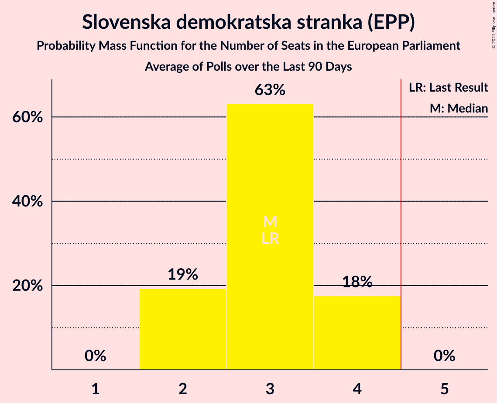

| Number of Seats | Probability | Accumulated | Special Marks |
|:---------------:|:-----------:|:-----------:|:-------------:|
| 2 | 19% | 100% |  |
| 3 | 63% | 81% | Last Result, Median |
| 4 | 18% | 18% |  |
| 5 | 0% | 0% | Majority |

### Slovenska demokratska stranka–Slovenska ljudska stranka (EPP)

*For a full overview of the results for this party, see the [Slovenska demokratska stranka–Slovenska ljudska stranka (EPP)](party-slovenskademokratskastranka–slovenskaljudskastrankaepp.html) page.*

### Nova Slovenija–Krščanski demokrati (EPP)

*For a full overview of the results for this party, see the [Nova Slovenija–Krščanski demokrati (EPP)](party-novaslovenija–krščanskidemokratiepp.html) page.*

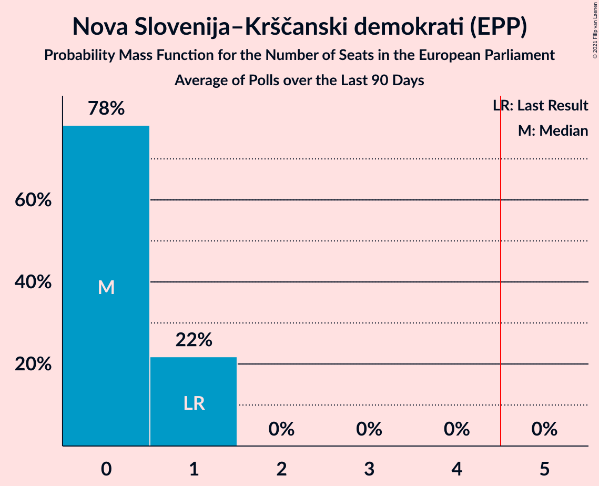

| Number of Seats | Probability | Accumulated | Special Marks |
|:---------------:|:-----------:|:-----------:|:-------------:|
| 0 | 78% | 100% | Median |
| 1 | 22% | 22% | Last Result |
| 2 | 0% | 0% |  |

### Slovenska ljudska stranka (EPP)

*For a full overview of the results for this party, see the [Slovenska ljudska stranka (EPP)](party-slovenskaljudskastrankaepp.html) page.*

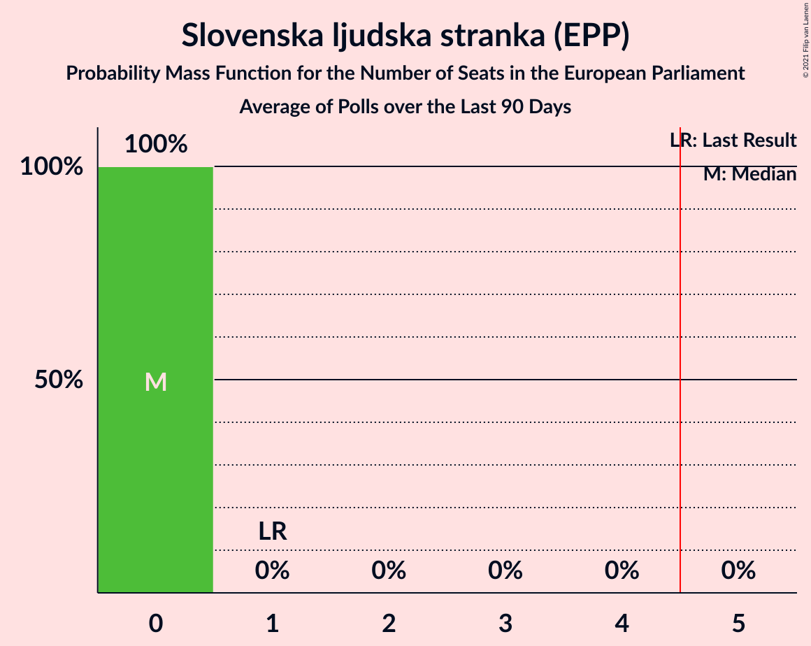

| Number of Seats | Probability | Accumulated | Special Marks |
|:---------------:|:-----------:|:-----------:|:-------------:|
| 0 | 100% | 100% | Median |
| 1 | 0% | 0% | Last Result |

### Demokratična stranka upokojencev Slovenije (RE)

*For a full overview of the results for this party, see the [Demokratična stranka upokojencev Slovenije (RE)](party-demokratičnastrankaupokojencevslovenijere.html) page.*

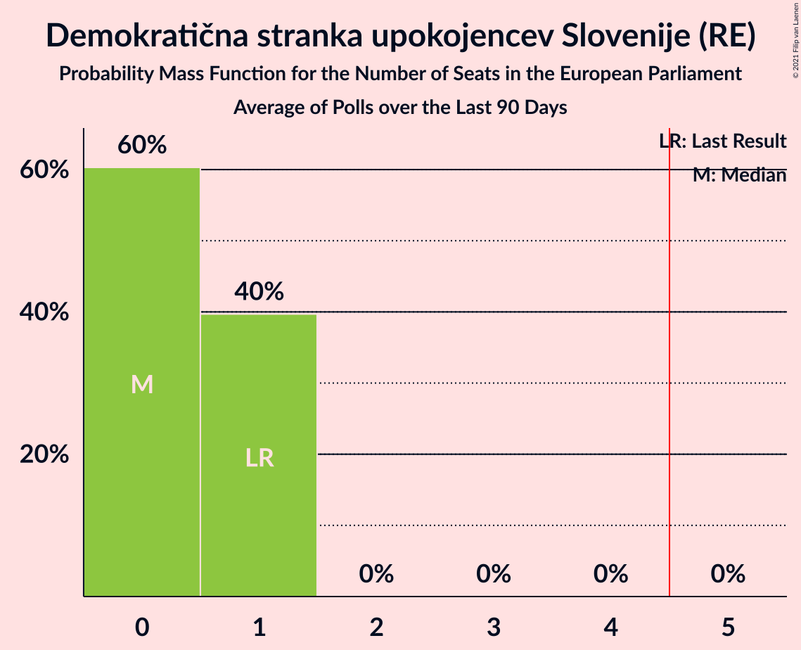

| Number of Seats | Probability | Accumulated | Special Marks |
|:---------------:|:-----------:|:-----------:|:-------------:|
| 0 | 60% | 100% | Median |
| 1 | 40% | 40% | Last Result |
| 2 | 0% | 0% |  |

### Socialni demokrati (S&D)

*For a full overview of the results for this party, see the [Socialni demokrati (S&D)](party-socialnidemokratisd.html) page.*

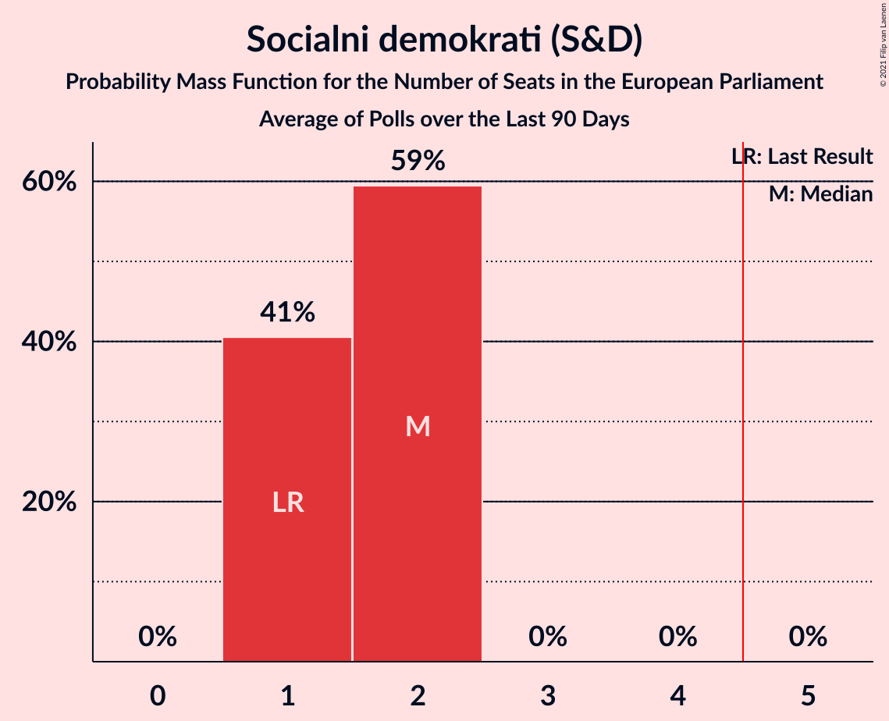

| Number of Seats | Probability | Accumulated | Special Marks |
|:---------------:|:-----------:|:-----------:|:-------------:|
| 1 | 41% | 100% | Last Result |
| 2 | 59% | 59% | Median |
| 3 | 0% | 0% |  |

### Pozitivna Slovenija (*)

*For a full overview of the results for this party, see the [Pozitivna Slovenija (*)](party-pozitivnaslovenija.html) page.*

### Levica (GUE/NGL)

*For a full overview of the results for this party, see the [Levica (GUE/NGL)](party-levicaguengl.html) page.*

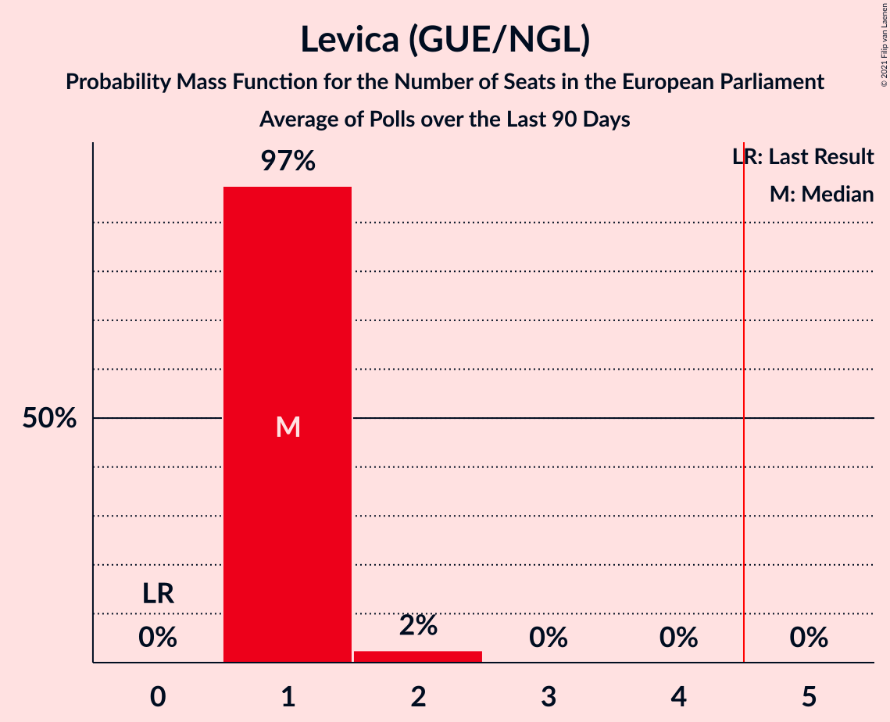

| Number of Seats | Probability | Accumulated | Special Marks |
|:---------------:|:-----------:|:-----------:|:-------------:|
| 0 | 0% | 100% | Last Result |
| 1 | 97% | 100% | Median |
| 2 | 2% | 2% |  |
| 3 | 0% | 0% |  |

### Slovenska nacionalna stranka (NI)

*For a full overview of the results for this party, see the [Slovenska nacionalna stranka (NI)](party-slovenskanacionalnastrankani.html) page.*

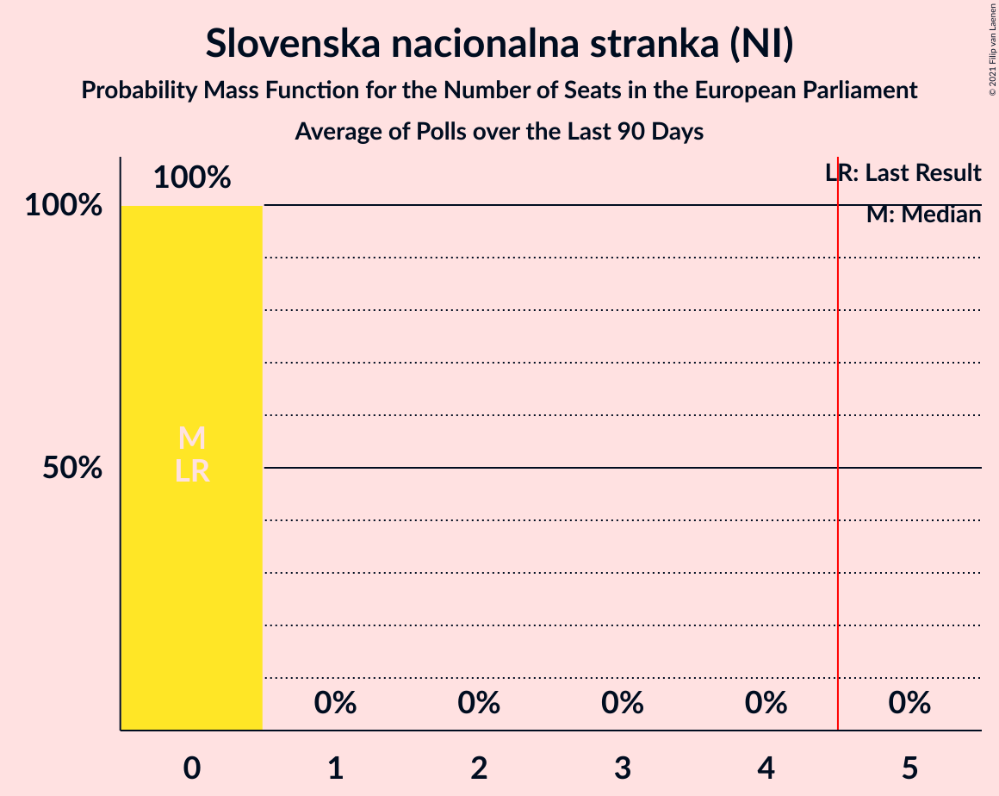

| Number of Seats | Probability | Accumulated | Special Marks |
|:---------------:|:-----------:|:-----------:|:-------------:|
| 0 | 100% | 100% | Last Result, Median |

### Državljanska lista (RE)

*For a full overview of the results for this party, see the [Državljanska lista (RE)](party-državljanskalistare.html) page.*

### Glas za otroke in družine (*)

*For a full overview of the results for this party, see the [Glas za otroke in družine (*)](party-glaszaotrokeindružine.html) page.*

### Glas za otroke in družine–Nova ljudska stranka Slovenije (*)

*For a full overview of the results for this party, see the [Glas za otroke in družine–Nova ljudska stranka Slovenije (*)](party-glaszaotrokeindružine–novaljudskastrankaslovenije.html) page.*

### Lista Marjana Šarca (RE)

*For a full overview of the results for this party, see the [Lista Marjana Šarca (RE)](party-listamarjanašarcare.html) page.*

| Number of Seats | Probability | Accumulated | Special Marks |
|:---------------:|:-----------:|:-----------:|:-------------:|
| 0 | 0% | 100% | Last Result |
| 1 | 41% | 100% |  |
| 2 | 57% | 59% | Median |
| 3 | 2% | 2% |  |
| 4 | 0% | 0% |  |

### Nova ljudska stranka Slovenije (*)

*For a full overview of the results for this party, see the [Nova ljudska stranka Slovenije (*)](party-novaljudskastrankaslovenije.html) page.*

### Stranka modernega centra (RE)

*For a full overview of the results for this party, see the [Stranka modernega centra (RE)](party-strankamodernegacentrare.html) page.*

| Number of Seats | Probability | Accumulated | Special Marks |
|:---------------:|:-----------:|:-----------:|:-------------:|
| 0 | 100% | 100% | Last Result, Median |

### Stranka Alenke Bratušek (RE)

*For a full overview of the results for this party, see the [Stranka Alenke Bratušek (RE)](party-strankaalenkebratušekre.html) page.*

| Number of Seats | Probability | Accumulated | Special Marks |
|:---------------:|:-----------:|:-----------:|:-------------:|
| 0 | 100% | 100% | Last Result, Median |

## Coalitions

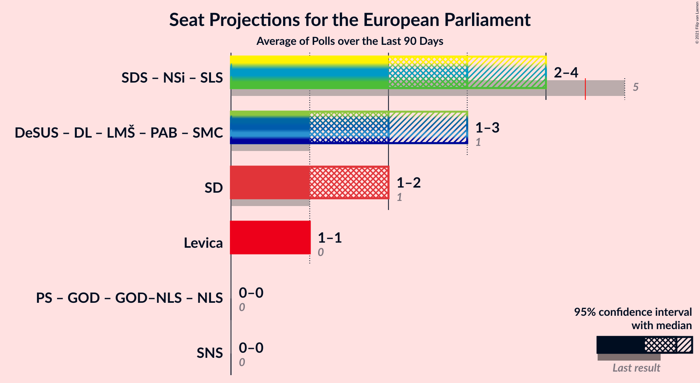

### Confidence Intervals

| Coalition | Last Result | Median | Majority? | 80% Confidence Interval | 90% Confidence Interval | 95% Confidence Interval | 99% Confidence Interval |
|:---------:|:-----------:|:------:|:---------:|:-----------------------:|:-----------------------:|:-----------------------:|:-----------------------:|
| Slovenska demokratska stranka (EPP) – Nova Slovenija–Krščanski demokrati (EPP) – Slovenska ljudska stranka (EPP) | 5 | 3 | 0.1% | 2–4 | 2–4 | 2–4 | 2–4 |
| Demokratična stranka upokojencev Slovenije (RE) – Državljanska lista (RE) – Lista Marjana Šarca (RE) – Stranka Alenke Bratušek (RE) – Stranka modernega centra (RE) | 1 | 2 | 0% | 1–3 | 1–3 | 1–3 | 1–3 |
| Socialni demokrati (S&D) | 1 | 2 | 0% | 1–2 | 1–2 | 1–2 | 1–2 |
| Levica (GUE/NGL) | 0 | 1 | 0% | 1 | 1 | 1 | 1–2 |
| Pozitivna Slovenija (*) – Glas za otroke in družine (*) – Glas za otroke in družine–Nova ljudska stranka Slovenije (*) – Nova ljudska stranka Slovenije (*) | 0 | 0 | 0% | 0 | 0 | 0 | 0 |
| Slovenska nacionalna stranka (NI) | 0 | 0 | 0% | 0 | 0 | 0 | 0 |

### Slovenska demokratska stranka (EPP) – Nova Slovenija–Krščanski demokrati (EPP) – Slovenska ljudska stranka (EPP)

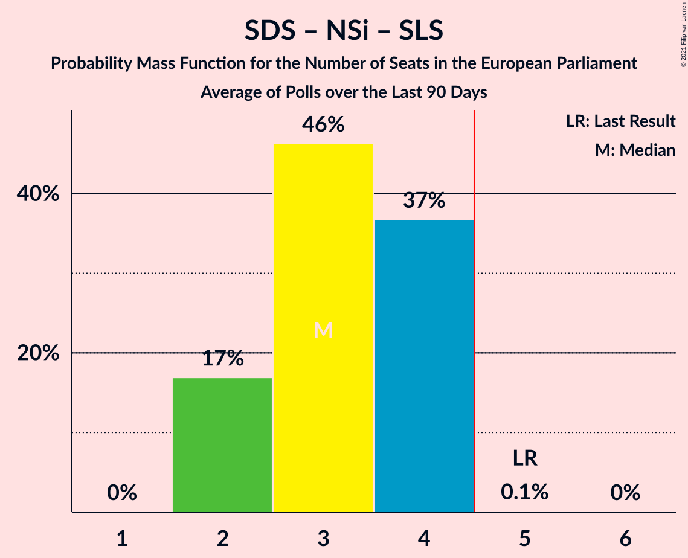

| Number of Seats | Probability | Accumulated | Special Marks |
|:---------------:|:-----------:|:-----------:|:-------------:|
| 2 | 17% | 100% |  |
| 3 | 46% | 83% | Median |
| 4 | 37% | 37% |  |
| 5 | 0.1% | 0.1% | Last Result, Majority |
| 6 | 0% | 0% |  |

### Demokratična stranka upokojencev Slovenije (RE) – Državljanska lista (RE) – Lista Marjana Šarca (RE) – Stranka Alenke Bratušek (RE) – Stranka modernega centra (RE)

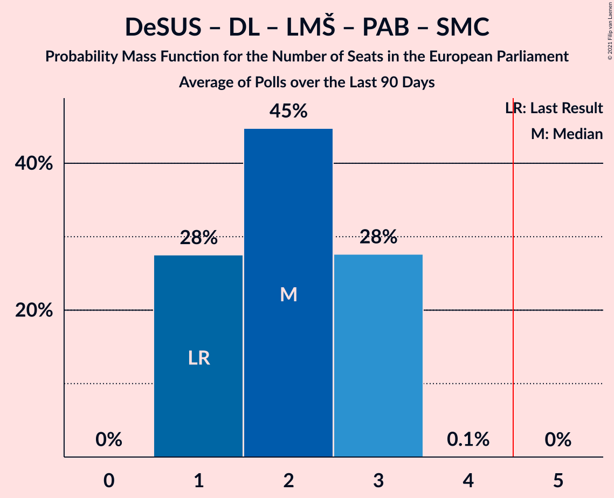

| Number of Seats | Probability | Accumulated | Special Marks |
|:---------------:|:-----------:|:-----------:|:-------------:|
| 1 | 28% | 100% | Last Result |
| 2 | 45% | 72% | Median |
| 3 | 28% | 28% |  |
| 4 | 0.1% | 0.1% |  |
| 5 | 0% | 0% | Majority |

### Socialni demokrati (S&D)

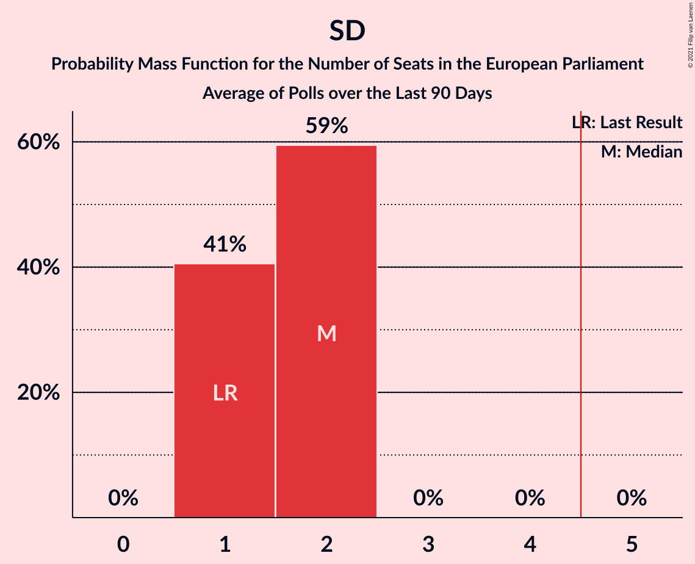

| Number of Seats | Probability | Accumulated | Special Marks |
|:---------------:|:-----------:|:-----------:|:-------------:|
| 1 | 41% | 100% | Last Result |
| 2 | 59% | 59% | Median |
| 3 | 0% | 0% |  |

### Levica (GUE/NGL)

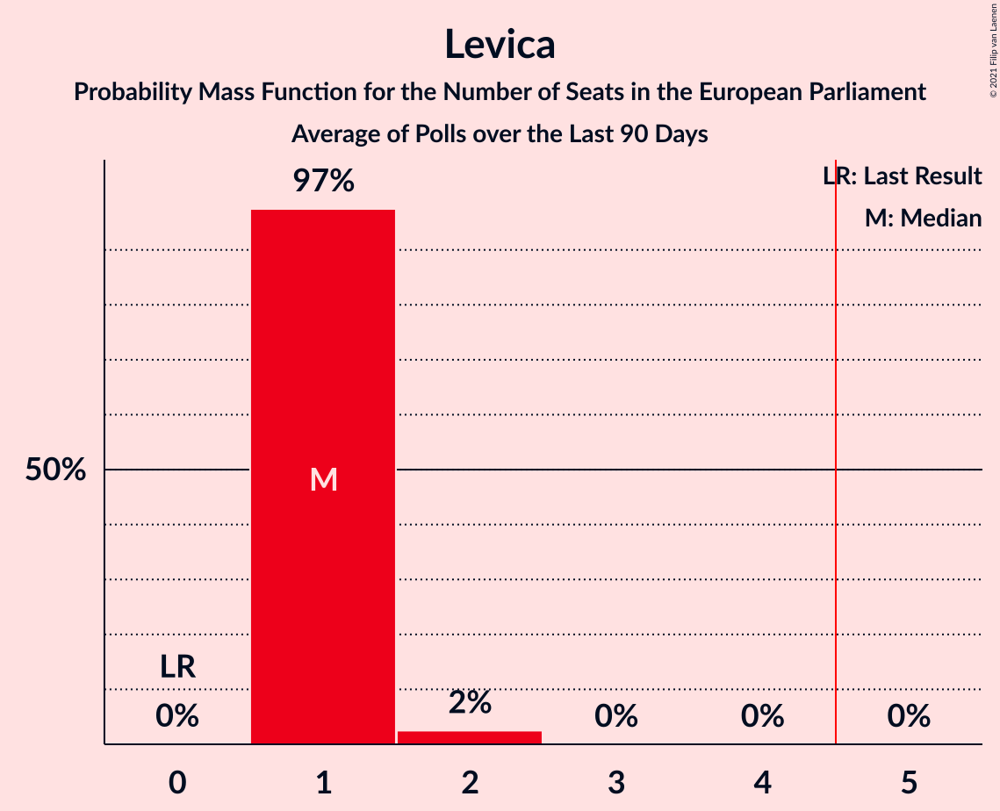

| Number of Seats | Probability | Accumulated | Special Marks |
|:---------------:|:-----------:|:-----------:|:-------------:|
| 0 | 0% | 100% | Last Result |
| 1 | 97% | 100% | Median |
| 2 | 2% | 2% |  |
| 3 | 0% | 0% |  |

### Pozitivna Slovenija (*) – Glas za otroke in družine (*) – Glas za otroke in družine–Nova ljudska stranka Slovenije (*) – Nova ljudska stranka Slovenije (*)

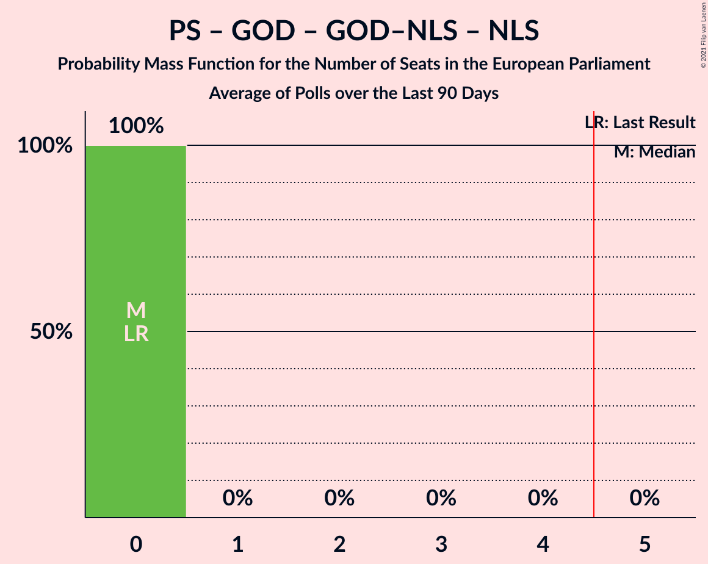

| Number of Seats | Probability | Accumulated | Special Marks |
|:---------------:|:-----------:|:-----------:|:-------------:|
| 0 | 100% | 100% | Last Result, Median |

### Slovenska nacionalna stranka (NI)

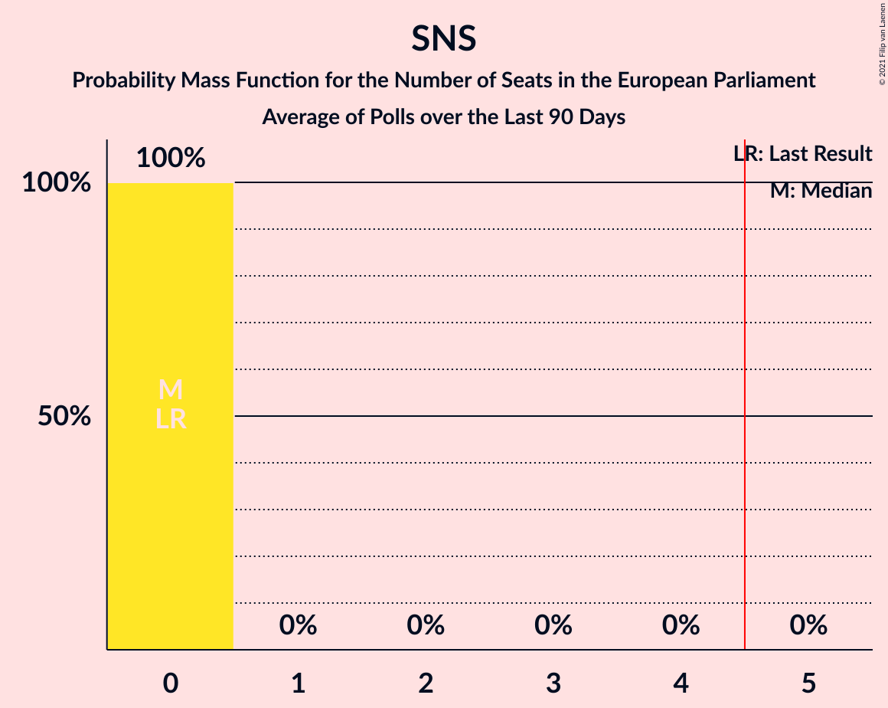

| Number of Seats | Probability | Accumulated | Special Marks |
|:---------------:|:-----------:|:-----------:|:-------------:|
| 0 | 100% | 100% | Last Result, Median |

## Technical Information

+ **Number of polls included in this average:** 4
+ **Lowest number of simulations done in a poll included in this average:** 1,048,576
+ **Total number of simulations done in the polls included in this average:** 4,194,304
+ **Error estimate:** 3.69%
