# Poll Average

<a href="#voting-intentions">Voting Intentions</a> | <a href="#seats">Seats</a> | <a href="#coalitions">Coalitions</a> | <a href="#technical-information">Technical Information</a>

## Summary

The table below lists the polls on which the average is based. They are the most recent polls (less than 90 days old) registered and analyzed so far.

| Period     | Polling firm/Commissioner(s) | SDS | NSi | SLS | DeSUS | SD | PS | Levica | SNS | DL | GOD | GOD–NLS | LMŠ | NLS | SMC | PAB | SDS–SLS | PSS | DD | AČZS |
|:----------:|:----------------------------:|:--:|:--:|:--:|:--:|:--:|:--:|:--:|:--:|:--:|:--:|:--:|:--:|:--:|:--:|:--:|:--:|:--:|:--:|:--:|
| 26 May 2019 | General Election | 24.8%   3 | 16.5%   1 | 16.5%   1 | 8.2%   1 | 8.1%   1 | 6.6%   0 | 5.5%   0 | 4.0%   0 | 1.1%   0 | 0.0%   0 | 0.0%   0 | 0.0%   0 | 0.0%   0 | 0.0%   0 | 0.0%   0 | 24.8%   4 | 0.0%   0 | 0.5%   0 | 2.2%   0 |
| N/A | Poll Average | 22–31%   2–3 | 7–13%   0–1 | 1–3%   0 | 1–3%   0 | 16–22%   1–2 | N/A   N/A | 9–16%   1–2 | 1–4%   0 | N/A   N/A | N/A   N/A | N/A   N/A | 7–25%   0–2 | N/A   N/A | 0–2%   0 | 4–8%   0–1 | N/A   N/A | 2–6%   0 | 1–4%   0 | 2–5%   0 |
| [1–22 August 2021](2021-08-22-Mediana.html) | Mediana   POP TV | 22–29%   2–3 | 7–11%   0–1 | 1–3%   0 | 1–4%   0 | 15–21%   1–2 | N/A   N/A | 12–17%   1–2 | 2–4%   0 | N/A   N/A | N/A   N/A | N/A   N/A | 7–11%   0–1 | N/A   N/A | 0–1%   0 | 5–8%   0–1 | N/A   N/A | 3–6%   0 | 1–4%   0 | 2–5%   0 |
| [10–12 August 2021](2021-08-12-Ninamedia.html) | Ninamedia   Dnevnik, Večer | 26–32%   3–4 | 7–11%   0–1 | 1–4%   0 | 1–2%   0 | 17–23%   2 | N/A   N/A | 12–17%   1–2 | 1–4%   0 | N/A   N/A | N/A   N/A | N/A   N/A | 11–16%   1 | N/A   N/A | 1–2%   0 | 4–7%   0 | N/A   N/A | N/A   N/A | N/A   N/A | N/A   N/A |
| [10–15 June 2021](2021-06-15-Episcenter.html) | Episcenter   Domovina | 21–28%   2–3 | 9–14%   1 | N/A   N/A | N/A   N/A | 16–22%   1–2 | N/A   N/A | 9–14%   1 | N/A   N/A | N/A   N/A | N/A   N/A | N/A   N/A | 19–26%   2–3 | N/A   N/A | N/A   N/A | 4–8%   0 | N/A   N/A | 2–5%   0 | 1–4%   0 | N/A   N/A |
| 26 May 2019 | General Election | 24.8%   3 | 16.5%   1 | 16.5%   1 | 8.2%   1 | 8.1%   1 | 6.6%   0 | 5.5%   0 | 4.0%   0 | 1.1%   0 | 0.0%   0 | 0.0%   0 | 0.0%   0 | 0.0%   0 | 0.0%   0 | 0.0%   0 | 24.8%   4 | 0.0%   0 | 0.5%   0 | 2.2%   0 |

Only polls for which at least the sample size has been published are included in the table above.

**Legend:**
+ **Top half of each row:** Voting intentions (95% confidence interval)
+ **Bottom half of each row:** Seat projections for the European Parliament (95% confidence interval)
+ **SDS:** Slovenska demokratska stranka (EPP)
+ **NSi:** Nova Slovenija–Krščanski demokrati (EPP)
+ **SLS:** Slovenska ljudska stranka (EPP)
+ **DeSUS:** Demokratična stranka upokojencev Slovenije (RE)
+ **SD:** Socialni demokrati (S&D)
+ **PS:** Pozitivna Slovenija (*)
+ **Levica:** Levica (GUE/NGL)
+ **SNS:** Slovenska nacionalna stranka (NI)
+ **DL:** Državljanska lista (RE)
+ **GOD:** Glas za otroke in družine (*)
+ **GOD–NLS:** Glas za otroke in družine–Nova ljudska stranka Slovenije (*)
+ **LMŠ:** Lista Marjana Šarca (RE)
+ **NLS:** Nova ljudska stranka Slovenije (*)
+ **SMC:** Stranka modernega centra (RE)
+ **PAB:** Stranka Alenke Bratušek (RE)
+ **SDS–SLS:** Slovenska demokratska stranka–Slovenska ljudska stranka (EPP)
+ **PSS:** Piratska stranka Slovenije (Greens/EFA)
+ **DD:** Dobra država (*)
+ **AČZS:** Andrej Čuš in Zeleni Slovenije (*)
+ **N/A (single party):** Party not included the published results
+ **N/A (entire row):** Calculation for this opinion poll not started yet

## Voting Intentions

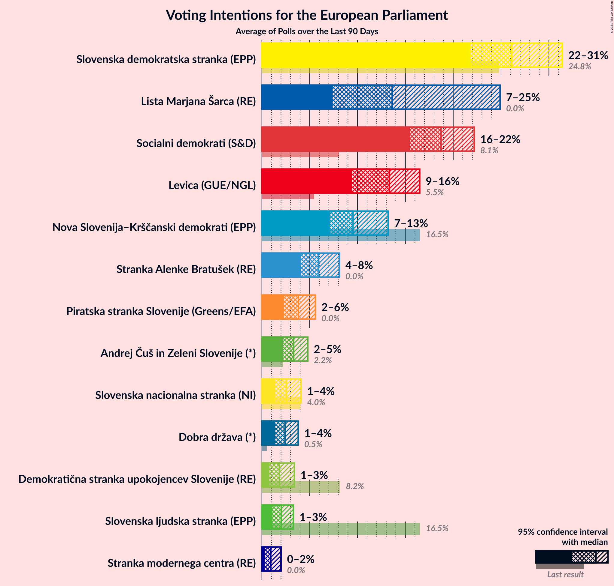

### Confidence Intervals

| Party | Last Result | Median | 80% Confidence Interval | 90% Confidence Interval | 95% Confidence Interval | 99% Confidence Interval |
|:-----:|:-----------:|:------:|:-----------------------:|:-----------------------:|:-----------------------:|:-----------------------:|
| <a href="#slovenska-demokratska-stranka-(epp)">Slovenska demokratska stranka (EPP)</a> | 24.8% | 26.1% | 23.1–29.8% |22.4–30.7% | 21.8–31.4% | 20.6–32.7% |
| <a href="#slovenska-demokratska-stranka–slovenska-ljudska-stranka-(epp)">Slovenska demokratska stranka–Slovenska ljudska stranka (EPP)</a> | 24.8% | N/A | N/A |N/A | N/A | N/A |
| <a href="#nova-slovenija–krščanski-demokrati-(epp)">Nova Slovenija–Krščanski demokrati (EPP)</a> | 16.5% | 9.5% | 7.8–12.0% |7.5–12.7% | 7.1–13.2% | 6.5–14.3% |
| <a href="#slovenska-ljudska-stranka-(epp)">Slovenska ljudska stranka (EPP)</a> | 16.5% | 2.0% | 1.3–2.8% |1.2–3.1% | 1.1–3.3% | 0.8–3.8% |
| <a href="#demokratična-stranka-upokojencev-slovenije-(re)">Demokratična stranka upokojencev Slovenije (RE)</a> | 8.2% | 1.8% | 1.0–2.8% |0.9–3.1% | 0.8–3.4% | 0.6–3.9% |
| <a href="#socialni-demokrati-(s&d)">Socialni demokrati (S&D)</a> | 8.1% | 18.7% | 16.6–21.0% |16.0–21.6% | 15.5–22.2% | 14.7–23.3% |
| <a href="#pozitivna-slovenija-(*)">Pozitivna Slovenija (*)</a> | 6.6% | N/A | N/A |N/A | N/A | N/A |
| <a href="#levica-(gue/ngl)">Levica (GUE/NGL)</a> | 5.5% | 13.3% | 10.5–15.5% |9.9–16.0% | 9.4–16.5% | 8.6–17.5% |
| <a href="#slovenska-nacionalna-stranka-(ni)">Slovenska nacionalna stranka (NI)</a> | 4.0% | 2.6% | 1.8–3.5% |1.6–3.8% | 1.4–4.1% | 1.2–4.6% |
| <a href="#andrej-čuš-in-zeleni-slovenije-(*)">Andrej Čuš in Zeleni Slovenije (*)</a> | 2.2% | 3.3% | 2.5–4.2% |2.3–4.5% | 2.2–4.8% | 1.9–5.3% |
| <a href="#državljanska-lista-(re)">Državljanska lista (RE)</a> | 1.1% | N/A | N/A |N/A | N/A | N/A |
| <a href="#dobra-država-(*)">Dobra država (*)</a> | 0.5% | 2.4% | 1.7–3.3% |1.6–3.6% | 1.4–3.8% | 1.2–4.4% |
| <a href="#glas-za-otroke-in-družine-(*)">Glas za otroke in družine (*)</a> | 0.0% | N/A | N/A |N/A | N/A | N/A |
| <a href="#glas-za-otroke-in-družine–nova-ljudska-stranka-slovenije-(*)">Glas za otroke in družine–Nova ljudska stranka Slovenije (*)</a> | 0.0% | N/A | N/A |N/A | N/A | N/A |
| <a href="#lista-marjana-šarca-(re)">Lista Marjana Šarca (RE)</a> | 0.0% | 13.6% | 8.4–23.3% |7.8–24.2% | 7.4–24.9% | 6.8–26.3% |
| <a href="#nova-ljudska-stranka-slovenije-(*)">Nova ljudska stranka Slovenije (*)</a> | 0.0% | N/A | N/A |N/A | N/A | N/A |
| <a href="#stranka-modernega-centra-(re)">Stranka modernega centra (RE)</a> | 0.0% | 0.9% | 0.4–1.6% |0.3–1.9% | 0.3–2.0% | 0.2–2.5% |
| <a href="#stranka-alenke-bratušek-(re)">Stranka Alenke Bratušek (RE)</a> | 0.0% | 5.9% | 4.7–7.3% |4.4–7.7% | 4.1–8.1% | 3.7–8.8% |
| <a href="#piratska-stranka-slovenije-(greens/efa)">Piratska stranka Slovenije (Greens/EFA)</a> | 0.0% | 3.8% | 2.8–4.9% |2.6–5.3% | 2.3–5.6% | 2.0–6.2% |

### Slovenska demokratska stranka (EPP)

*For a full overview of the results for this party, see the [Slovenska demokratska stranka (EPP)](party-slovenskademokratskastrankaepp.html) page.*

| Voting Intentions | Probability | Accumulated | Special Marks |
|:-----------------:|:-----------:|:-----------:|:-------------:|
| 17.5–18.5% | 0% | 100% |  |
| 18.5–19.5% | 0.1% | 100% |  |
| 19.5–20.5% | 0.4% | 99.9% |  |
| 20.5–21.5% | 1.4% | 99.6% |  |
| 21.5–22.5% | 4% | 98% |  |
| 22.5–23.5% | 8% | 94% |  |
| 23.5–24.5% | 13% | 86% |  |
| 24.5–25.5% | 15% | 73% | Last Result |
| 25.5–26.5% | 15% | 58% | Median |
| 26.5–27.5% | 12% | 44% |  |
| 27.5–28.5% | 10% | 31% |  |
| 28.5–29.5% | 9% | 21% |  |
| 29.5–30.5% | 6% | 12% |  |
| 30.5–31.5% | 4% | 6% |  |
| 31.5–32.5% | 2% | 2% |  |
| 32.5–33.5% | 0.5% | 0.6% |  |
| 33.5–34.5% | 0.1% | 0.1% |  |
| 34.5–35.5% | 0% | 0% |  |

### Nova Slovenija–Krščanski demokrati (EPP)

*For a full overview of the results for this party, see the [Nova Slovenija–Krščanski demokrati (EPP)](party-novaslovenija–krščanskidemokratiepp.html) page.*

| Voting Intentions | Probability | Accumulated | Special Marks |
|:-----------------:|:-----------:|:-----------:|:-------------:|
| 4.5–5.5% | 0% | 100% |  |
| 5.5–6.5% | 0.5% | 100% |  |
| 6.5–7.5% | 5% | 99.5% |  |
| 7.5–8.5% | 19% | 94% |  |
| 8.5–9.5% | 26% | 75% |  |
| 9.5–10.5% | 21% | 49% | Median |
| 10.5–11.5% | 14% | 28% |  |
| 11.5–12.5% | 9% | 14% |  |
| 12.5–13.5% | 4% | 6% |  |
| 13.5–14.5% | 1.3% | 2% |  |
| 14.5–15.5% | 0.3% | 0.3% |  |
| 15.5–16.5% | 0% | 0% |  |
| 16.5–17.5% | 0% | 0% | Last Result |

### Slovenska ljudska stranka (EPP)

*For a full overview of the results for this party, see the [Slovenska ljudska stranka (EPP)](party-slovenskaljudskastrankaepp.html) page.*

| Voting Intentions | Probability | Accumulated | Special Marks |
|:-----------------:|:-----------:|:-----------:|:-------------:|
| 0.0–0.5% | 0% | 100% |  |
| 0.5–1.5% | 20% | 100% |  |
| 1.5–2.5% | 61% | 80% | Median |
| 2.5–3.5% | 18% | 19% |  |
| 3.5–4.5% | 1.2% | 1.2% |  |
| 4.5–5.5% | 0% | 0% |  |
| 5.5–6.5% | 0% | 0% |  |
| 6.5–7.5% | 0% | 0% |  |
| 7.5–8.5% | 0% | 0% |  |
| 8.5–9.5% | 0% | 0% |  |
| 9.5–10.5% | 0% | 0% |  |
| 10.5–11.5% | 0% | 0% |  |
| 11.5–12.5% | 0% | 0% |  |
| 12.5–13.5% | 0% | 0% |  |
| 13.5–14.5% | 0% | 0% |  |
| 14.5–15.5% | 0% | 0% |  |
| 15.5–16.5% | 0% | 0% |  |
| 16.5–17.5% | 0% | 0% | Last Result |

### Demokratična stranka upokojencev Slovenije (RE)

*For a full overview of the results for this party, see the [Demokratična stranka upokojencev Slovenije (RE)](party-demokratičnastrankaupokojencevslovenijere.html) page.*

| Voting Intentions | Probability | Accumulated | Special Marks |
|:-----------------:|:-----------:|:-----------:|:-------------:|
| 0.0–0.5% | 0.3% | 100% |  |
| 0.5–1.5% | 35% | 99.7% |  |
| 1.5–2.5% | 46% | 65% | Median |
| 2.5–3.5% | 17% | 19% |  |
| 3.5–4.5% | 1.5% | 1.5% |  |
| 4.5–5.5% | 0% | 0% |  |
| 5.5–6.5% | 0% | 0% |  |
| 6.5–7.5% | 0% | 0% |  |
| 7.5–8.5% | 0% | 0% | Last Result |

### Socialni demokrati (S&D)

*For a full overview of the results for this party, see the [Socialni demokrati (S&D)](party-socialnidemokratisd.html) page.*

| Voting Intentions | Probability | Accumulated | Special Marks |
|:-----------------:|:-----------:|:-----------:|:-------------:|
| 7.5–8.5% | 0% | 100% | Last Result |
| 8.5–9.5% | 0% | 100% |  |
| 9.5–10.5% | 0% | 100% |  |
| 10.5–11.5% | 0% | 100% |  |
| 11.5–12.5% | 0% | 100% |  |
| 12.5–13.5% | 0% | 100% |  |
| 13.5–14.5% | 0.4% | 100% |  |
| 14.5–15.5% | 2% | 99.6% |  |
| 15.5–16.5% | 7% | 97% |  |
| 16.5–17.5% | 15% | 90% |  |
| 17.5–18.5% | 22% | 76% |  |
| 18.5–19.5% | 22% | 54% | Median |
| 19.5–20.5% | 17% | 32% |  |
| 20.5–21.5% | 10% | 15% |  |
| 21.5–22.5% | 4% | 5% |  |
| 22.5–23.5% | 1.1% | 1.4% |  |
| 23.5–24.5% | 0.3% | 0.3% |  |
| 24.5–25.5% | 0% | 0% |  |
| 25.5–26.5% | 0% | 0% |  |

### Levica (GUE/NGL)

*For a full overview of the results for this party, see the [Levica (GUE/NGL)](party-levicaguengl.html) page.*

| Voting Intentions | Probability | Accumulated | Special Marks |
|:-----------------:|:-----------:|:-----------:|:-------------:|
| 4.5–5.5% | 0% | 100% | Last Result |
| 5.5–6.5% | 0% | 100% |  |
| 6.5–7.5% | 0% | 100% |  |
| 7.5–8.5% | 0.5% | 100% |  |
| 8.5–9.5% | 3% | 99.5% |  |
| 9.5–10.5% | 7% | 97% |  |
| 10.5–11.5% | 11% | 90% |  |
| 11.5–12.5% | 14% | 79% |  |
| 12.5–13.5% | 19% | 65% | Median |
| 13.5–14.5% | 21% | 45% |  |
| 14.5–15.5% | 15% | 24% |  |
| 15.5–16.5% | 7% | 9% |  |
| 16.5–17.5% | 2% | 2% |  |
| 17.5–18.5% | 0.4% | 0.4% |  |
| 18.5–19.5% | 0% | 0.1% |  |
| 19.5–20.5% | 0% | 0% |  |

### Slovenska nacionalna stranka (NI)

*For a full overview of the results for this party, see the [Slovenska nacionalna stranka (NI)](party-slovenskanacionalnastrankani.html) page.*

| Voting Intentions | Probability | Accumulated | Special Marks |
|:-----------------:|:-----------:|:-----------:|:-------------:|
| 0.0–0.5% | 0% | 100% |  |
| 0.5–1.5% | 5% | 100% |  |
| 1.5–2.5% | 45% | 95% |  |
| 2.5–3.5% | 42% | 51% | Median |
| 3.5–4.5% | 9% | 9% | Last Result |
| 4.5–5.5% | 0.6% | 0.6% |  |
| 5.5–6.5% | 0% | 0% |  |

### Andrej Čuš in Zeleni Slovenije (*)

*For a full overview of the results for this party, see the [Andrej Čuš in Zeleni Slovenije (*)](party-andrejčušinzelenislovenije.html) page.*

| Voting Intentions | Probability | Accumulated | Special Marks |
|:-----------------:|:-----------:|:-----------:|:-------------:|
| 0.5–1.5% | 0% | 100% |  |
| 1.5–2.5% | 11% | 100% | Last Result |
| 2.5–3.5% | 53% | 89% | Median |
| 3.5–4.5% | 31% | 36% |  |
| 4.5–5.5% | 4% | 5% |  |
| 5.5–6.5% | 0.2% | 0.2% |  |
| 6.5–7.5% | 0% | 0% |  |

### Dobra država (*)

*For a full overview of the results for this party, see the [Dobra država (*)](party-dobradržava.html) page.*

| Voting Intentions | Probability | Accumulated | Special Marks |
|:-----------------:|:-----------:|:-----------:|:-------------:|
| 0.0–0.5% | 0% | 100% |  |
| 0.5–1.5% | 5% | 100% | Last Result |
| 1.5–2.5% | 52% | 95% | Median |
| 2.5–3.5% | 38% | 43% |  |
| 3.5–4.5% | 5% | 5% |  |
| 4.5–5.5% | 0.3% | 0.3% |  |
| 5.5–6.5% | 0% | 0% |  |

### Lista Marjana Šarca (RE)

*For a full overview of the results for this party, see the [Lista Marjana Šarca (RE)](party-listamarjanašarcare.html) page.*

| Voting Intentions | Probability | Accumulated | Special Marks |
|:-----------------:|:-----------:|:-----------:|:-------------:|
| 0.0–0.5% | 0% | 100% | Last Result |
| 0.5–1.5% | 0% | 100% |  |
| 1.5–2.5% | 0% | 100% |  |
| 2.5–3.5% | 0% | 100% |  |
| 3.5–4.5% | 0% | 100% |  |
| 4.5–5.5% | 0% | 100% |  |
| 5.5–6.5% | 0.3% | 100% |  |
| 6.5–7.5% | 3% | 99.7% |  |
| 7.5–8.5% | 9% | 97% |  |
| 8.5–9.5% | 12% | 88% |  |
| 9.5–10.5% | 7% | 76% |  |
| 10.5–11.5% | 3% | 69% |  |
| 11.5–12.5% | 5% | 66% |  |
| 12.5–13.5% | 9% | 60% |  |
| 13.5–14.5% | 9% | 51% | Median |
| 14.5–15.5% | 6% | 41% |  |
| 15.5–16.5% | 2% | 36% |  |
| 16.5–17.5% | 0.5% | 34% |  |
| 17.5–18.5% | 0.4% | 33% |  |
| 18.5–19.5% | 1.3% | 33% |  |
| 19.5–20.5% | 3% | 32% |  |
| 20.5–21.5% | 6% | 28% |  |
| 21.5–22.5% | 8% | 22% |  |
| 22.5–23.5% | 7% | 15% |  |
| 23.5–24.5% | 5% | 8% |  |
| 24.5–25.5% | 2% | 4% |  |
| 25.5–26.5% | 0.9% | 1.2% |  |
| 26.5–27.5% | 0.3% | 0.3% |  |
| 27.5–28.5% | 0.1% | 0.1% |  |
| 28.5–29.5% | 0% | 0% |  |

### Stranka modernega centra (RE)

*For a full overview of the results for this party, see the [Stranka modernega centra (RE)](party-strankamodernegacentrare.html) page.*

| Voting Intentions | Probability | Accumulated | Special Marks |
|:-----------------:|:-----------:|:-----------:|:-------------:|
| 0.0–0.5% | 19% | 100% | Last Result |
| 0.5–1.5% | 69% | 81% | Median |
| 1.5–2.5% | 12% | 13% |  |
| 2.5–3.5% | 0.4% | 0.4% |  |
| 3.5–4.5% | 0% | 0% |  |

### Stranka Alenke Bratušek (RE)

*For a full overview of the results for this party, see the [Stranka Alenke Bratušek (RE)](party-strankaalenkebratušekre.html) page.*

| Voting Intentions | Probability | Accumulated | Special Marks |
|:-----------------:|:-----------:|:-----------:|:-------------:|
| 0.0–0.5% | 0% | 100% | Last Result |
| 0.5–1.5% | 0% | 100% |  |
| 1.5–2.5% | 0% | 100% |  |
| 2.5–3.5% | 0.3% | 100% |  |
| 3.5–4.5% | 7% | 99.7% |  |
| 4.5–5.5% | 28% | 93% |  |
| 5.5–6.5% | 37% | 65% | Median |
| 6.5–7.5% | 21% | 28% |  |
| 7.5–8.5% | 6% | 7% |  |
| 8.5–9.5% | 0.9% | 1.0% |  |
| 9.5–10.5% | 0.1% | 0.1% |  |
| 10.5–11.5% | 0% | 0% |  |

### Piratska stranka Slovenije (Greens/EFA)

*For a full overview of the results for this party, see the [Piratska stranka Slovenije (Greens/EFA)](party-piratskastrankaslovenijegreensefa.html) page.*

| Voting Intentions | Probability | Accumulated | Special Marks |
|:-----------------:|:-----------:|:-----------:|:-------------:|
| 0.0–0.5% | 0% | 100% | Last Result |
| 0.5–1.5% | 0% | 100% |  |
| 1.5–2.5% | 5% | 100% |  |
| 2.5–3.5% | 32% | 95% |  |
| 3.5–4.5% | 43% | 63% | Median |
| 4.5–5.5% | 17% | 20% |  |
| 5.5–6.5% | 3% | 3% |  |
| 6.5–7.5% | 0.2% | 0.2% |  |
| 7.5–8.5% | 0% | 0% |  |

## Seats

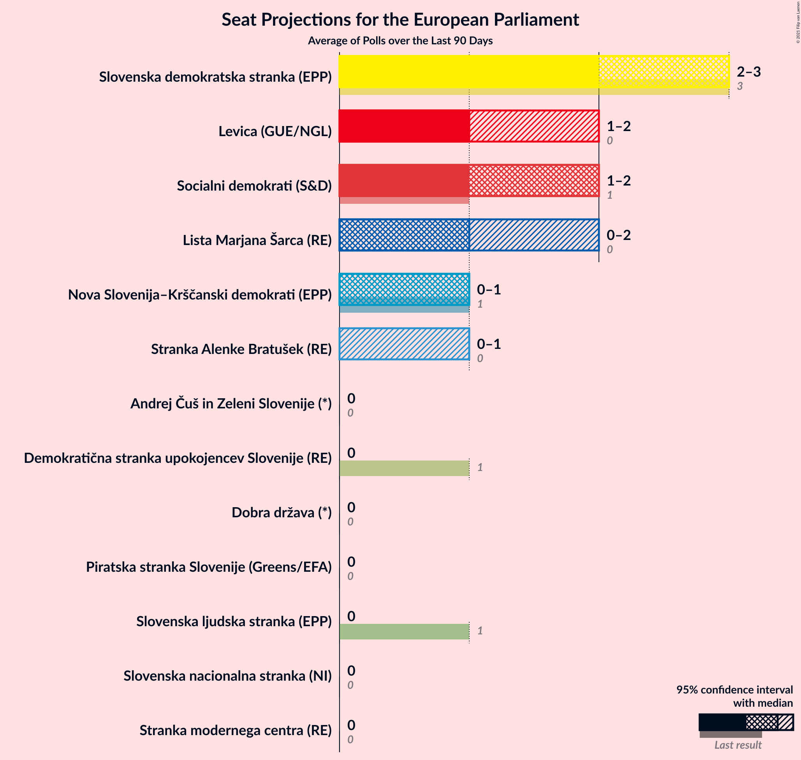

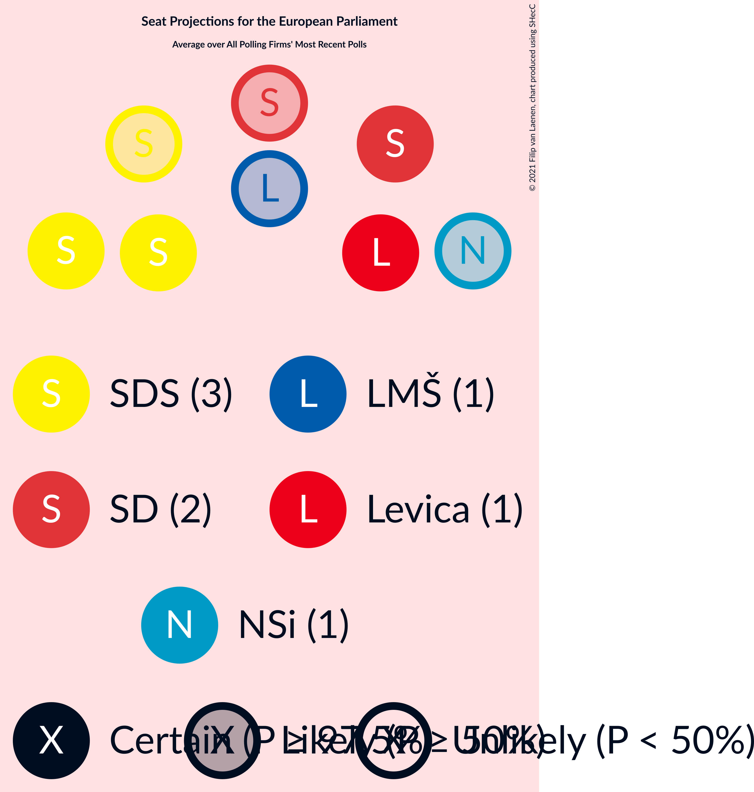

### Confidence Intervals

| Party | Last Result | Median | 80% Confidence Interval | 90% Confidence Interval | 95% Confidence Interval | 99% Confidence Interval |
|:-----:|:-----------:|:------:|:-----------------------:|:-----------------------:|:-----------------------:|:-----------------------:|
| <a href="#slovenska-demokratska-stranka-(epp)">Slovenska demokratska stranka (EPP)</a> | 3 | 3 | 2–3 |2–3 | 2–3 | 2–4 |
| <a href="#slovenska-demokratska-stranka–slovenska-ljudska-stranka-(epp)">Slovenska demokratska stranka–Slovenska ljudska stranka (EPP)</a> | 4 | N/A | N/A |N/A | N/A | N/A |
| <a href="#nova-slovenija–krščanski-demokrati-(epp)">Nova Slovenija–Krščanski demokrati (EPP)</a> | 1 | 1 | 1 |0–1 | 0–1 | 0–1 |
| <a href="#slovenska-ljudska-stranka-(epp)">Slovenska ljudska stranka (EPP)</a> | 1 | 0 | 0 |0 | 0 | 0 |
| <a href="#demokratična-stranka-upokojencev-slovenije-(re)">Demokratična stranka upokojencev Slovenije (RE)</a> | 1 | 0 | 0 |0 | 0 | 0 |
| <a href="#socialni-demokrati-(s&d)">Socialni demokrati (S&D)</a> | 1 | 2 | 2 |1–2 | 1–2 | 1–3 |
| <a href="#pozitivna-slovenija-(*)">Pozitivna Slovenija (*)</a> | 0 | N/A | N/A |N/A | N/A | N/A |
| <a href="#levica-(gue/ngl)">Levica (GUE/NGL)</a> | 0 | 1 | 1 |1–2 | 1–2 | 0–2 |
| <a href="#slovenska-nacionalna-stranka-(ni)">Slovenska nacionalna stranka (NI)</a> | 0 | 0 | 0 |0 | 0 | 0 |
| <a href="#andrej-čuš-in-zeleni-slovenije-(*)">Andrej Čuš in Zeleni Slovenije (*)</a> | 0 | 0 | 0 |0 | 0 | 0 |
| <a href="#državljanska-lista-(re)">Državljanska lista (RE)</a> | 0 | N/A | N/A |N/A | N/A | N/A |
| <a href="#dobra-država-(*)">Dobra država (*)</a> | 0 | 0 | 0 |0 | 0 | 0 |
| <a href="#glas-za-otroke-in-družine-(*)">Glas za otroke in družine (*)</a> | 0 | N/A | N/A |N/A | N/A | N/A |
| <a href="#glas-za-otroke-in-družine–nova-ljudska-stranka-slovenije-(*)">Glas za otroke in družine–Nova ljudska stranka Slovenije (*)</a> | 0 | N/A | N/A |N/A | N/A | N/A |
| <a href="#lista-marjana-šarca-(re)">Lista Marjana Šarca (RE)</a> | 0 | 1 | 1–2 |1–2 | 0–2 | 0–3 |
| <a href="#nova-ljudska-stranka-slovenije-(*)">Nova ljudska stranka Slovenije (*)</a> | 0 | N/A | N/A |N/A | N/A | N/A |
| <a href="#stranka-modernega-centra-(re)">Stranka modernega centra (RE)</a> | 0 | 0 | 0 |0 | 0 | 0 |
| <a href="#stranka-alenke-bratušek-(re)">Stranka Alenke Bratušek (RE)</a> | 0 | 0 | 0 |0–1 | 0–1 | 0–1 |
| <a href="#piratska-stranka-slovenije-(greens/efa)">Piratska stranka Slovenije (Greens/EFA)</a> | 0 | 0 | 0 |0 | 0 | 0 |

### Slovenska demokratska stranka (EPP)

*For a full overview of the results for this party, see the [Slovenska demokratska stranka (EPP)](party-slovenskademokratskastrankaepp.html) page.*

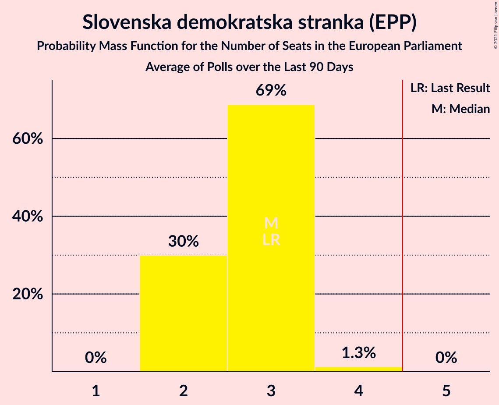

| Number of Seats | Probability | Accumulated | Special Marks |
|:---------------:|:-----------:|:-----------:|:-------------:|
| 2 | 30% | 100% |  |
| 3 | 69% | 70% | Last Result, Median |
| 4 | 1.3% | 1.3% |  |
| 5 | 0% | 0% | Majority |

### Slovenska demokratska stranka–Slovenska ljudska stranka (EPP)

*For a full overview of the results for this party, see the [Slovenska demokratska stranka–Slovenska ljudska stranka (EPP)](party-slovenskademokratskastranka–slovenskaljudskastrankaepp.html) page.*

### Nova Slovenija–Krščanski demokrati (EPP)

*For a full overview of the results for this party, see the [Nova Slovenija–Krščanski demokrati (EPP)](party-novaslovenija–krščanskidemokratiepp.html) page.*

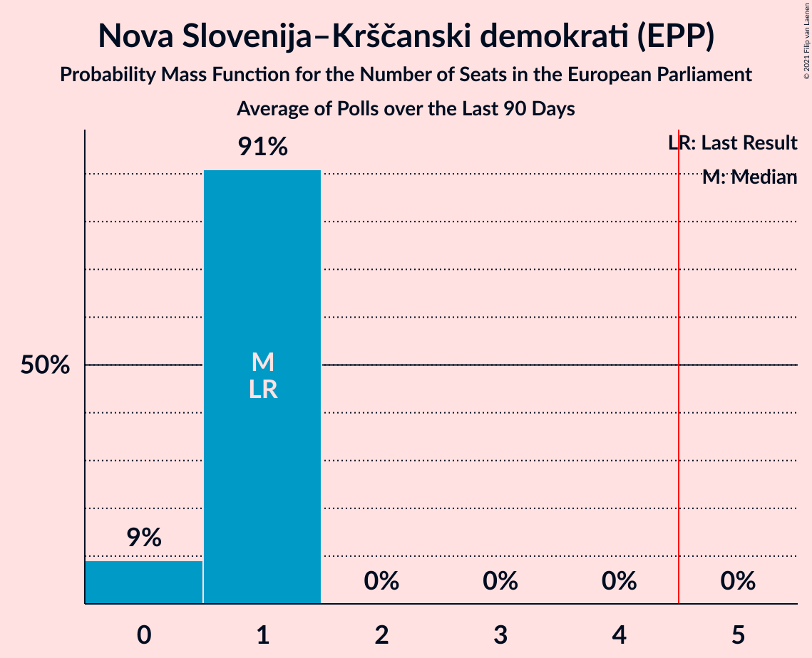

| Number of Seats | Probability | Accumulated | Special Marks |
|:---------------:|:-----------:|:-----------:|:-------------:|
| 0 | 9% | 100% |  |
| 1 | 91% | 91% | Last Result, Median |
| 2 | 0% | 0% |  |

### Slovenska ljudska stranka (EPP)

*For a full overview of the results for this party, see the [Slovenska ljudska stranka (EPP)](party-slovenskaljudskastrankaepp.html) page.*

| Number of Seats | Probability | Accumulated | Special Marks |
|:---------------:|:-----------:|:-----------:|:-------------:|
| 0 | 100% | 100% | Median |
| 1 | 0% | 0% | Last Result |

### Demokratična stranka upokojencev Slovenije (RE)

*For a full overview of the results for this party, see the [Demokratična stranka upokojencev Slovenije (RE)](party-demokratičnastrankaupokojencevslovenijere.html) page.*

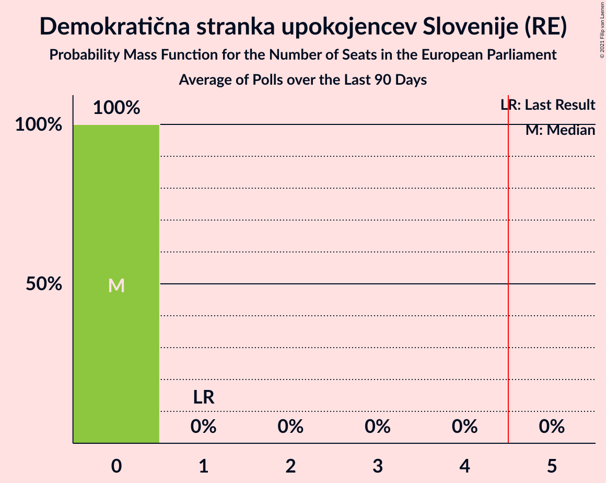

| Number of Seats | Probability | Accumulated | Special Marks |
|:---------------:|:-----------:|:-----------:|:-------------:|
| 0 | 100% | 100% | Median |
| 1 | 0% | 0% | Last Result |

### Socialni demokrati (S&D)

*For a full overview of the results for this party, see the [Socialni demokrati (S&D)](party-socialnidemokratisd.html) page.*

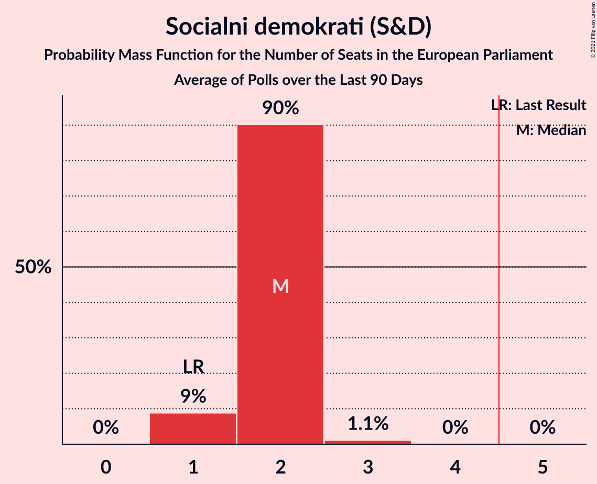

| Number of Seats | Probability | Accumulated | Special Marks |
|:---------------:|:-----------:|:-----------:|:-------------:|
| 1 | 9% | 100% | Last Result |
| 2 | 90% | 91% | Median |
| 3 | 1.1% | 1.1% |  |
| 4 | 0% | 0% |  |

### Pozitivna Slovenija (*)

*For a full overview of the results for this party, see the [Pozitivna Slovenija (*)](party-pozitivnaslovenija.html) page.*

### Levica (GUE/NGL)

*For a full overview of the results for this party, see the [Levica (GUE/NGL)](party-levicaguengl.html) page.*

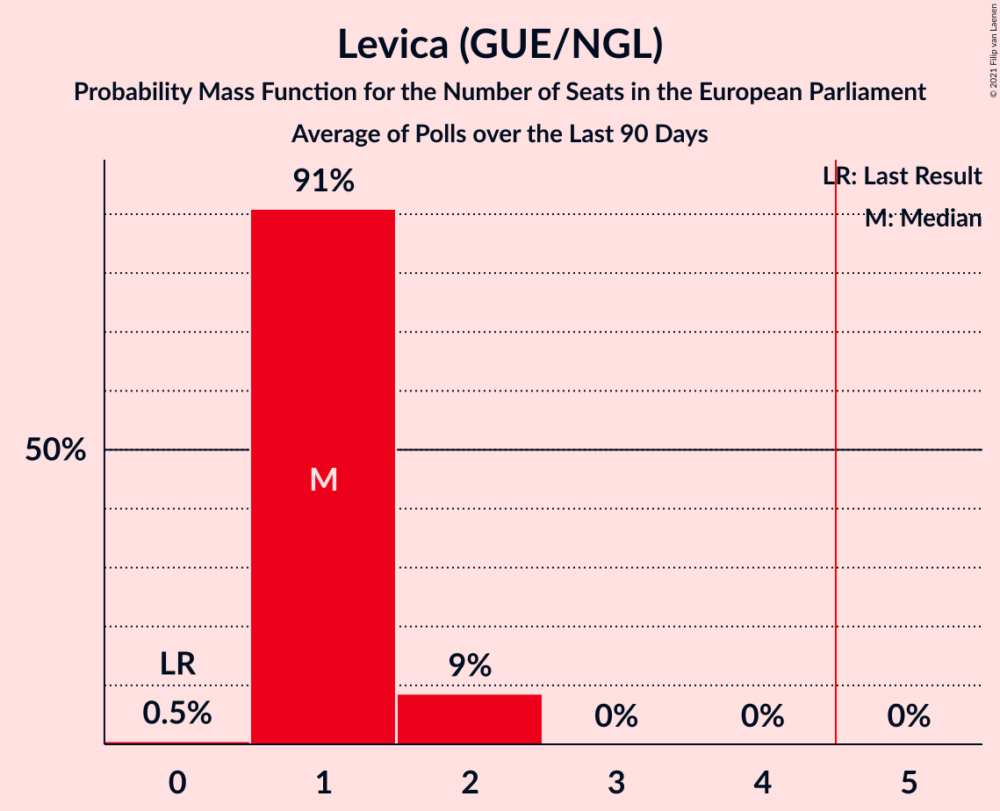

| Number of Seats | Probability | Accumulated | Special Marks |
|:---------------:|:-----------:|:-----------:|:-------------:|
| 0 | 0.5% | 100% | Last Result |
| 1 | 91% | 99.5% | Median |
| 2 | 9% | 9% |  |
| 3 | 0% | 0% |  |

### Slovenska nacionalna stranka (NI)

*For a full overview of the results for this party, see the [Slovenska nacionalna stranka (NI)](party-slovenskanacionalnastrankani.html) page.*

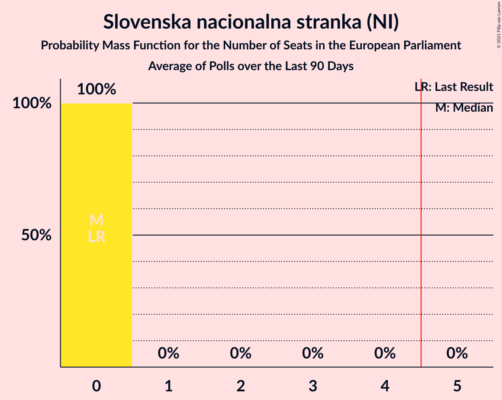

| Number of Seats | Probability | Accumulated | Special Marks |
|:---------------:|:-----------:|:-----------:|:-------------:|
| 0 | 100% | 100% | Last Result, Median |

### Andrej Čuš in Zeleni Slovenije (*)

*For a full overview of the results for this party, see the [Andrej Čuš in Zeleni Slovenije (*)](party-andrejčušinzelenislovenije.html) page.*

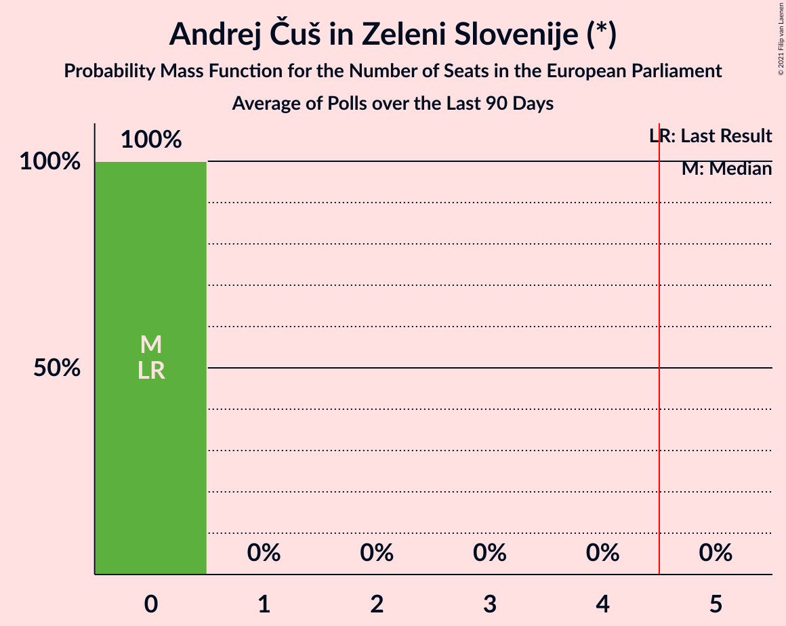

| Number of Seats | Probability | Accumulated | Special Marks |
|:---------------:|:-----------:|:-----------:|:-------------:|
| 0 | 100% | 100% | Last Result, Median |

### Državljanska lista (RE)

*For a full overview of the results for this party, see the [Državljanska lista (RE)](party-državljanskalistare.html) page.*

### Dobra država (*)

*For a full overview of the results for this party, see the [Dobra država (*)](party-dobradržava.html) page.*

| Number of Seats | Probability | Accumulated | Special Marks |
|:---------------:|:-----------:|:-----------:|:-------------:|
| 0 | 100% | 100% | Last Result, Median |

### Glas za otroke in družine (*)

*For a full overview of the results for this party, see the [Glas za otroke in družine (*)](party-glaszaotrokeindružine.html) page.*

### Glas za otroke in družine–Nova ljudska stranka Slovenije (*)

*For a full overview of the results for this party, see the [Glas za otroke in družine–Nova ljudska stranka Slovenije (*)](party-glaszaotrokeindružine–novaljudskastrankaslovenije.html) page.*

### Lista Marjana Šarca (RE)

*For a full overview of the results for this party, see the [Lista Marjana Šarca (RE)](party-listamarjanašarcare.html) page.*

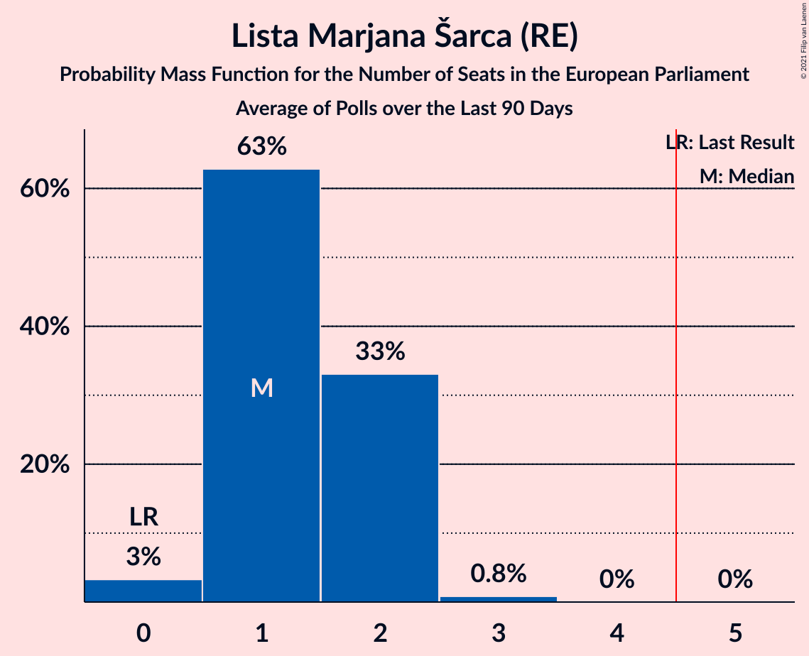

| Number of Seats | Probability | Accumulated | Special Marks |
|:---------------:|:-----------:|:-----------:|:-------------:|
| 0 | 3% | 100% | Last Result |
| 1 | 63% | 97% | Median |
| 2 | 33% | 34% |  |
| 3 | 0.8% | 0.8% |  |
| 4 | 0% | 0% |  |

### Nova ljudska stranka Slovenije (*)

*For a full overview of the results for this party, see the [Nova ljudska stranka Slovenije (*)](party-novaljudskastrankaslovenije.html) page.*

### Stranka modernega centra (RE)

*For a full overview of the results for this party, see the [Stranka modernega centra (RE)](party-strankamodernegacentrare.html) page.*

| Number of Seats | Probability | Accumulated | Special Marks |
|:---------------:|:-----------:|:-----------:|:-------------:|
| 0 | 100% | 100% | Last Result, Median |

### Stranka Alenke Bratušek (RE)

*For a full overview of the results for this party, see the [Stranka Alenke Bratušek (RE)](party-strankaalenkebratušekre.html) page.*

| Number of Seats | Probability | Accumulated | Special Marks |
|:---------------:|:-----------:|:-----------:|:-------------:|
| 0 | 94% | 100% | Last Result, Median |
| 1 | 6% | 6% |  |
| 2 | 0% | 0% |  |

### Piratska stranka Slovenije (Greens/EFA)

*For a full overview of the results for this party, see the [Piratska stranka Slovenije (Greens/EFA)](party-piratskastrankaslovenijegreensefa.html) page.*

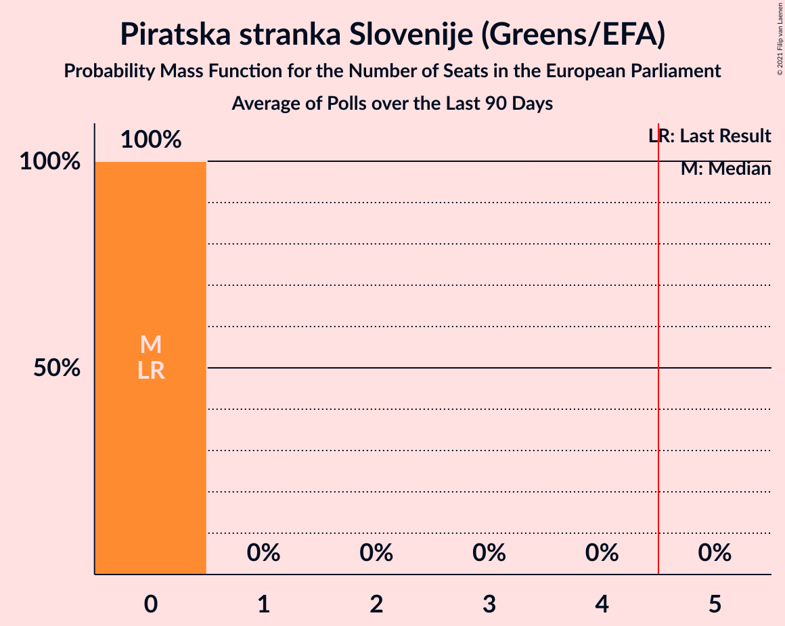

| Number of Seats | Probability | Accumulated | Special Marks |
|:---------------:|:-----------:|:-----------:|:-------------:|
| 0 | 100% | 100% | Last Result, Median |

## Coalitions

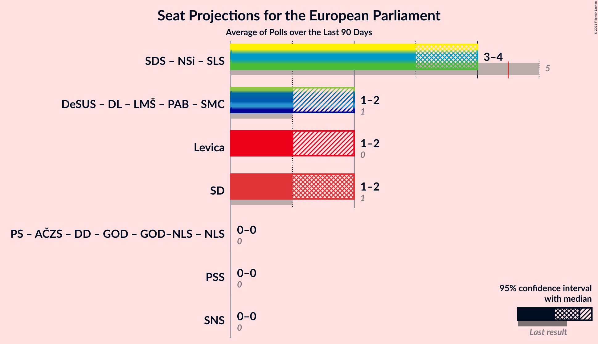

### Confidence Intervals

| Coalition | Last Result | Median | Majority? | 80% Confidence Interval | 90% Confidence Interval | 95% Confidence Interval | 99% Confidence Interval |
|:---------:|:-----------:|:------:|:---------:|:-----------------------:|:-----------------------:|:-----------------------:|:-----------------------:|
| Slovenska demokratska stranka (EPP) – Nova Slovenija–Krščanski demokrati (EPP) – Slovenska ljudska stranka (EPP) | 5 | 4 | 0.2% | 3–4 | 3–4 | 3–4 | 3–4 |
| Demokratična stranka upokojencev Slovenije (RE) – Državljanska lista (RE) – Lista Marjana Šarca (RE) – Stranka Alenke Bratušek (RE) – Stranka modernega centra (RE) | 1 | 1 | 0% | 1–2 | 1–2 | 1–2 | 0–3 |
| Levica (GUE/NGL) | 0 | 1 | 0% | 1 | 1–2 | 1–2 | 0–2 |
| Socialni demokrati (S&D) | 1 | 2 | 0% | 2 | 1–2 | 1–2 | 1–3 |
| Pozitivna Slovenija (*) – Andrej Čuš in Zeleni Slovenije (*) – Dobra država (*) – Glas za otroke in družine (*) – Glas za otroke in družine–Nova ljudska stranka Slovenije (*) – Nova ljudska stranka Slovenije (*) | 0 | 0 | 0% | 0 | 0 | 0 | 0 |
| Piratska stranka Slovenije (Greens/EFA) | 0 | 0 | 0% | 0 | 0 | 0 | 0 |
| Slovenska nacionalna stranka (NI) | 0 | 0 | 0% | 0 | 0 | 0 | 0 |

### Slovenska demokratska stranka (EPP) – Nova Slovenija–Krščanski demokrati (EPP) – Slovenska ljudska stranka (EPP)

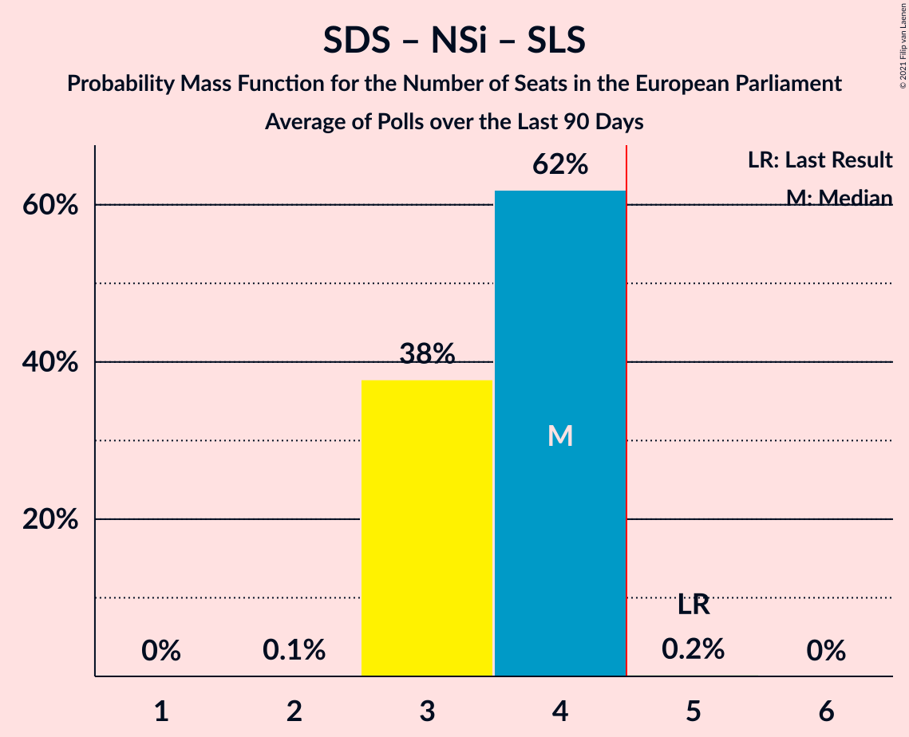

| Number of Seats | Probability | Accumulated | Special Marks |
|:---------------:|:-----------:|:-----------:|:-------------:|
| 2 | 0.1% | 100% |  |
| 3 | 38% | 99.9% |  |
| 4 | 62% | 62% | Median |
| 5 | 0.2% | 0.2% | Last Result, Majority |
| 6 | 0% | 0% |  |

### Demokratična stranka upokojencev Slovenije (RE) – Državljanska lista (RE) – Lista Marjana Šarca (RE) – Stranka Alenke Bratušek (RE) – Stranka modernega centra (RE)

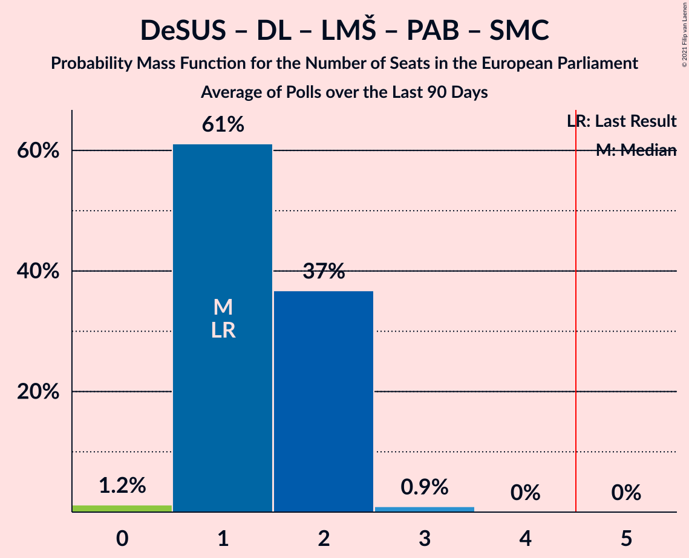

| Number of Seats | Probability | Accumulated | Special Marks |
|:---------------:|:-----------:|:-----------:|:-------------:|
| 0 | 1.2% | 100% |  |
| 1 | 61% | 98.8% | Last Result, Median |
| 2 | 37% | 38% |  |
| 3 | 0.9% | 0.9% |  |
| 4 | 0% | 0% |  |

### Levica (GUE/NGL)

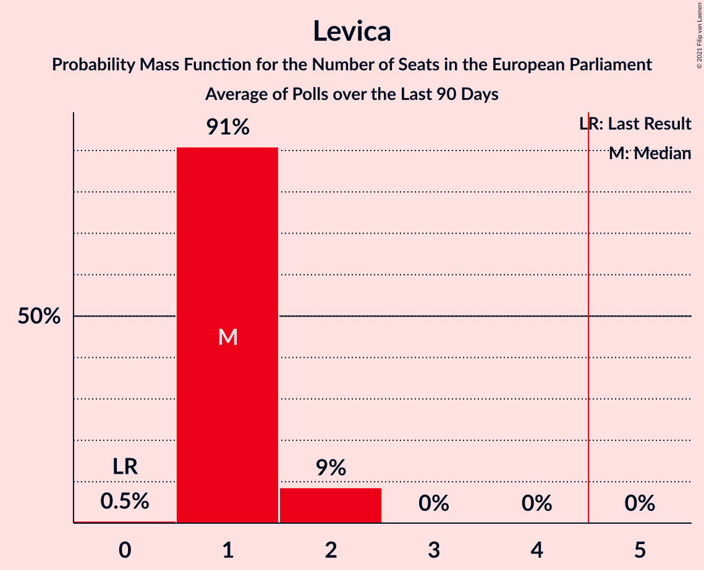

| Number of Seats | Probability | Accumulated | Special Marks |
|:---------------:|:-----------:|:-----------:|:-------------:|
| 0 | 0.5% | 100% | Last Result |
| 1 | 91% | 99.5% | Median |
| 2 | 9% | 9% |  |
| 3 | 0% | 0% |  |

### Socialni demokrati (S&D)

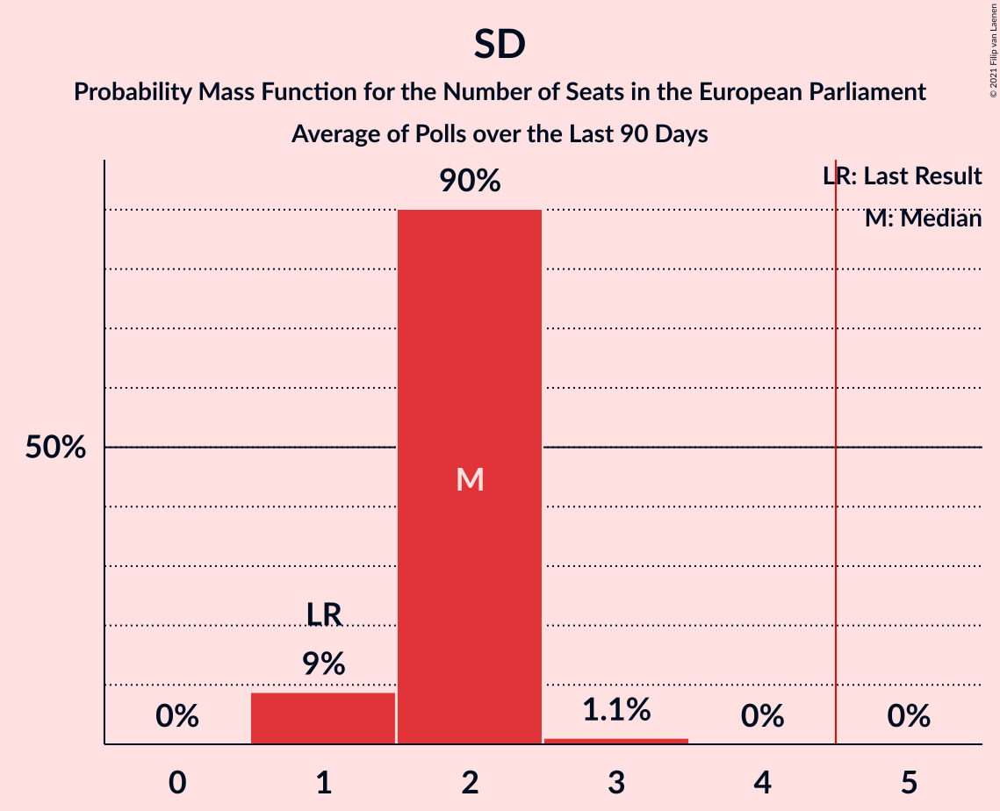

| Number of Seats | Probability | Accumulated | Special Marks |
|:---------------:|:-----------:|:-----------:|:-------------:|
| 1 | 9% | 100% | Last Result |
| 2 | 90% | 91% | Median |
| 3 | 1.1% | 1.1% |  |
| 4 | 0% | 0% |  |

### Pozitivna Slovenija (*) – Andrej Čuš in Zeleni Slovenije (*) – Dobra država (*) – Glas za otroke in družine (*) – Glas za otroke in družine–Nova ljudska stranka Slovenije (*) – Nova ljudska stranka Slovenije (*)

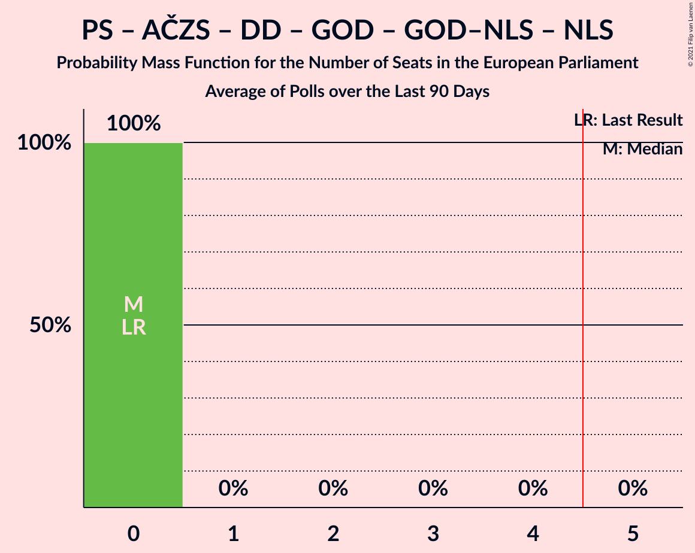

| Number of Seats | Probability | Accumulated | Special Marks |
|:---------------:|:-----------:|:-----------:|:-------------:|
| 0 | 100% | 100% | Last Result, Median |

### Piratska stranka Slovenije (Greens/EFA)

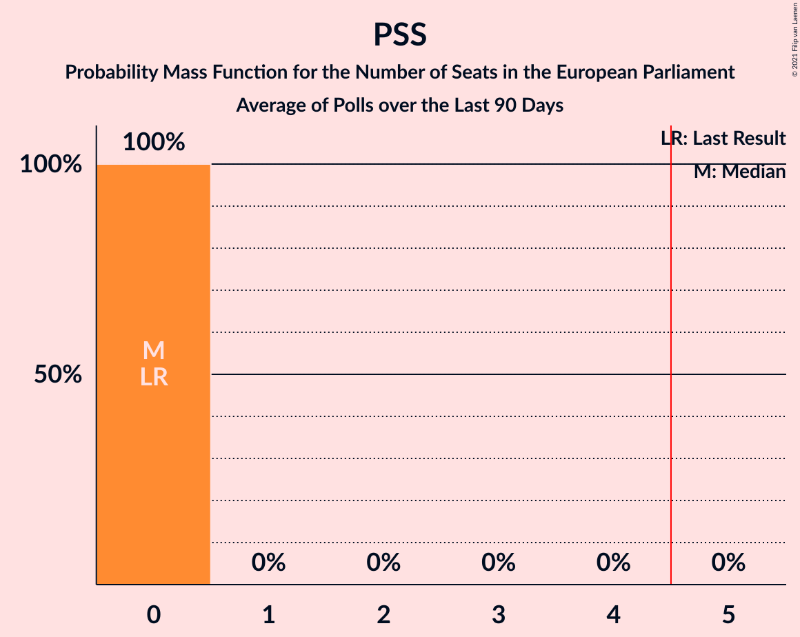

| Number of Seats | Probability | Accumulated | Special Marks |
|:---------------:|:-----------:|:-----------:|:-------------:|
| 0 | 100% | 100% | Last Result, Median |

### Slovenska nacionalna stranka (NI)

| Number of Seats | Probability | Accumulated | Special Marks |
|:---------------:|:-----------:|:-----------:|:-------------:|
| 0 | 100% | 100% | Last Result, Median |

## Technical Information

+ **Number of polls included in this average:** 3
+ **Lowest number of simulations done in a poll included in this average:** 1,048,576
+ **Total number of simulations done in the polls included in this average:** 3,145,728
+ **Error estimate:** 1.57%
