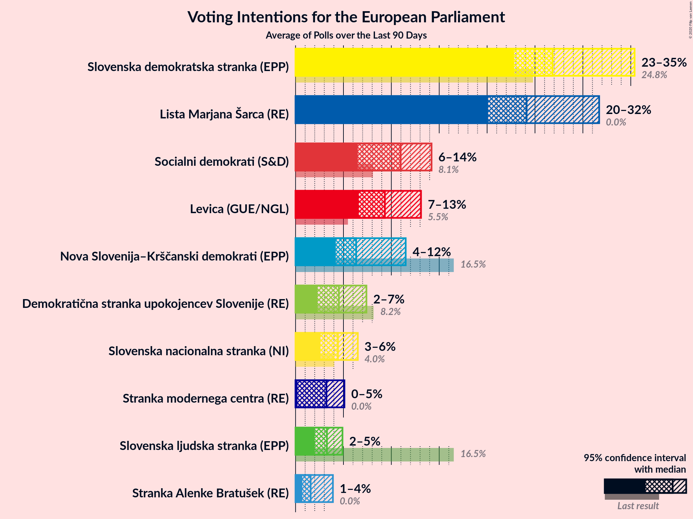

# Poll Average

<a href="#voting-intentions">Voting Intentions</a> | <a href="#seats">Seats</a> | <a href="#coalitions">Coalitions</a> | <a href="#technical-information">Technical Information</a>

## Summary

The table below lists the polls on which the average is based. They are the most recent polls (less than 90 days old) registered and analyzed so far.

| Period     | Polling firm/Commissioner(s) | SDS | NSi | SLS | DeSUS | SD | PS | Levica | SNS | DL | GOD | GOD–NLS | LMŠ | NLS | SMC | PAB | SDS–SLS |
|:----------:|:----------------------------:|:--:|:--:|:--:|:--:|:--:|:--:|:--:|:--:|:--:|:--:|:--:|:--:|:--:|:--:|:--:|:--:|
| 26 May 2019 | General Election | 24.8%   3 | 16.5%   1 | 16.5%   1 | 8.2%   1 | 8.1%   1 | 6.6%   0 | 5.5%   0 | 4.0%   0 | 1.1%   0 | 0.0%   0 | 0.0%   0 | 0.0%   0 | 0.0%   0 | 0.0%   0 | 0.0%   0 | 24.8%   4 |
| N/A | Poll Average | 23–35%   2–4 | 4–12%   0–1 | 2–5%   0 | 2–7%   0 | 6–14%   0–1 | N/A   N/A | 7–13%   0–1 | 3–6%   0 | N/A   N/A | N/A   N/A | N/A   N/A | 20–32%   2–3 | N/A   N/A | 0–5%   0 | 1–4%   0 | N/A   N/A |
| [19–20 February 2020](2020-02-20-Parsifal.html) | Parsifal   Nova 24TV | 29–36%   3–5 | 4–7%   0 | 2–5%   0 | 4–8%   0–1 | 6–10%   0–1 | N/A   N/A | 6–10%   0–1 | 3–6%   0 | N/A   N/A | N/A   N/A | N/A   N/A | 21–27%   2–3 | N/A   N/A | 3–5%   0 | 1–2%   0 | N/A   N/A |
| [14 January–16 February 2020](2020-02-16-Ninamedia.html) | Ninamedia   RTV SLO | 22–29%   2–3 | 8–12%   0–1 | 2–5%   0 | 3–6%   0 | 10–15%   1 | N/A   N/A | 7–11%   0–1 | 2–5%   0 | N/A   N/A | N/A   N/A | N/A   N/A | 26–33%   3 | N/A   N/A | 0–1%   0 | 1–2%   0 | N/A   N/A |
| [28 January–3 February 2020](2020-02-03-Mediana.html) | Mediana   Delo | 23–29%   3–4 | 4–8%   0–1 | 2–4%   0 | 2–5%   0 | 9–14%   1 | N/A   N/A | 9–14%   1–2 | 4–7%   0 | N/A   N/A | N/A   N/A | N/A   N/A | 19–25%   2–3 | N/A   N/A | 2–5%   0 | 2–4%   0 | N/A   N/A |
| 26 May 2019 | General Election | 24.8%   3 | 16.5%   1 | 16.5%   1 | 8.2%   1 | 8.1%   1 | 6.6%   0 | 5.5%   0 | 4.0%   0 | 1.1%   0 | 0.0%   0 | 0.0%   0 | 0.0%   0 | 0.0%   0 | 0.0%   0 | 0.0%   0 | 24.8%   4 |

Only polls for which at least the sample size has been published are included in the table above.

**Legend:**
+ **Top half of each row:** Voting intentions (95% confidence interval)
+ **Bottom half of each row:** Seat projections for the European Parliament (95% confidence interval)
+ **SDS:** Slovenska demokratska stranka (EPP)
+ **NSi:** Nova Slovenija–Krščanski demokrati (EPP)
+ **SLS:** Slovenska ljudska stranka (EPP)
+ **DeSUS:** Demokratična stranka upokojencev Slovenije (RE)
+ **SD:** Socialni demokrati (S&D)
+ **PS:** Pozitivna Slovenija (*)
+ **Levica:** Levica (GUE/NGL)
+ **SNS:** Slovenska nacionalna stranka (NI)
+ **DL:** Državljanska lista (RE)
+ **GOD:** Glas za otroke in družine (*)
+ **GOD–NLS:** Glas za otroke in družine–Nova ljudska stranka Slovenije (*)
+ **LMŠ:** Lista Marjana Šarca (RE)
+ **NLS:** Nova ljudska stranka Slovenije (*)
+ **SMC:** Stranka modernega centra (RE)
+ **PAB:** Stranka Alenke Bratušek (RE)
+ **SDS–SLS:** Slovenska demokratska stranka–Slovenska ljudska stranka (EPP)
+ **N/A (single party):** Party not included the published results
+ **N/A (entire row):** Calculation for this opinion poll not started yet

## Voting Intentions

### Confidence Intervals

| Party | Last Result | Median | 80% Confidence Interval | 90% Confidence Interval | 95% Confidence Interval | 99% Confidence Interval |
|:-----:|:-----------:|:------:|:-----------------------:|:-----------------------:|:-----------------------:|:-----------------------:|
| <a href="#slovenska-demokratska-stranka-(epp)">Slovenska demokratska stranka (EPP)</a> | 24.8% | 26.8% | 24.0–33.7% |23.4–34.6% | 22.8–35.4% | 21.8–36.7% |
| <a href="#slovenska-demokratska-stranka–slovenska-ljudska-stranka-(epp)">Slovenska demokratska stranka–Slovenska ljudska stranka (EPP)</a> | 24.8% | N/A | N/A |N/A | N/A | N/A |
| <a href="#nova-slovenija–krščanski-demokrati-(epp)">Nova Slovenija–Krščanski demokrati (EPP)</a> | 16.5% | 6.3% | 4.8–10.4% |4.5–11.0% | 4.2–11.5% | 3.7–12.4% |
| <a href="#slovenska-ljudska-stranka-(epp)">Slovenska ljudska stranka (EPP)</a> | 16.5% | 3.3% | 2.4–4.3% |2.2–4.7% | 2.0–4.9% | 1.7–5.5% |
| <a href="#demokratična-stranka-upokojencev-slovenije-(re)">Demokratična stranka upokojencev Slovenije (RE)</a> | 8.2% | 4.5% | 2.8–6.6% |2.6–7.0% | 2.3–7.4% | 2.0–8.2% |
| <a href="#socialni-demokrati-(s&d)">Socialni demokrati (S&D)</a> | 8.1% | 11.0% | 7.3–13.1% |6.9–13.7% | 6.5–14.2% | 5.9–15.1% |
| <a href="#pozitivna-slovenija-(*)">Pozitivna Slovenija (*)</a> | 6.6% | N/A | N/A |N/A | N/A | N/A |
| <a href="#levica-(gue/ngl)">Levica (GUE/NGL)</a> | 5.5% | 9.3% | 7.4–12.0% |6.9–12.6% | 6.6–13.1% | 6.0–14.0% |
| <a href="#slovenska-nacionalna-stranka-(ni)">Slovenska nacionalna stranka (NI)</a> | 4.0% | 4.4% | 3.1–5.8% |2.8–6.2% | 2.6–6.5% | 2.2–7.2% |
| <a href="#državljanska-lista-(re)">Državljanska lista (RE)</a> | 1.1% | N/A | N/A |N/A | N/A | N/A |
| <a href="#glas-za-otroke-in-družine-(*)">Glas za otroke in družine (*)</a> | 0.0% | N/A | N/A |N/A | N/A | N/A |
| <a href="#glas-za-otroke-in-družine–nova-ljudska-stranka-slovenije-(*)">Glas za otroke in družine–Nova ljudska stranka Slovenije (*)</a> | 0.0% | N/A | N/A |N/A | N/A | N/A |
| <a href="#lista-marjana-šarca-(re)">Lista Marjana Šarca (RE)</a> | 0.0% | 24.1% | 21.3–30.1% |20.6–31.0% | 20.1–31.7% | 19.1–33.0% |
| <a href="#nova-ljudska-stranka-slovenije-(*)">Nova ljudska stranka Slovenije (*)</a> | 0.0% | N/A | N/A |N/A | N/A | N/A |
| <a href="#stranka-modernega-centra-(re)">Stranka modernega centra (RE)</a> | 0.0% | 3.2% | 0.4–4.5% |0.3–4.8% | 0.2–5.1% | 0.1–5.7% |
| <a href="#stranka-alenke-bratušek-(re)">Stranka Alenke Bratušek (RE)</a> | 0.0% | 1.6% | 0.9–3.2% |0.8–3.6% | 0.7–3.9% | 0.5–4.4% |

### Slovenska demokratska stranka (EPP)

*For a full overview of the results for this party, see the [Slovenska demokratska stranka (EPP)](party-slovenskademokratskastrankaepp.html) page.*

| Voting Intentions | Probability | Accumulated | Special Marks |
|:-----------------:|:-----------:|:-----------:|:-------------:|
| 19.5–20.5% | 0% | 100% |  |
| 20.5–21.5% | 0.3% | 100% |  |
| 21.5–22.5% | 1.4% | 99.7% |  |
| 22.5–23.5% | 4% | 98% |  |
| 23.5–24.5% | 10% | 94% |  |
| 24.5–25.5% | 15% | 84% | Last Result |
| 25.5–26.5% | 16% | 69% |  |
| 26.5–27.5% | 11% | 53% | Median |
| 27.5–28.5% | 6% | 42% |  |
| 28.5–29.5% | 3% | 36% |  |
| 29.5–30.5% | 3% | 33% |  |
| 30.5–31.5% | 5% | 30% |  |
| 31.5–32.5% | 7% | 26% |  |
| 32.5–33.5% | 7% | 19% |  |
| 33.5–34.5% | 6% | 11% |  |
| 34.5–35.5% | 3% | 5% |  |
| 35.5–36.5% | 1.5% | 2% |  |
| 36.5–37.5% | 0.5% | 0.6% |  |
| 37.5–38.5% | 0.1% | 0.1% |  |
| 38.5–39.5% | 0% | 0% |  |

### Nova Slovenija–Krščanski demokrati (EPP)

*For a full overview of the results for this party, see the [Nova Slovenija–Krščanski demokrati (EPP)](party-novaslovenija–krščanskidemokratiepp.html) page.*

| Voting Intentions | Probability | Accumulated | Special Marks |
|:-----------------:|:-----------:|:-----------:|:-------------:|
| 1.5–2.5% | 0% | 100% |  |
| 2.5–3.5% | 0.2% | 100% |  |
| 3.5–4.5% | 6% | 99.7% |  |
| 4.5–5.5% | 23% | 94% |  |
| 5.5–6.5% | 26% | 71% | Median |
| 6.5–7.5% | 10% | 45% |  |
| 7.5–8.5% | 5% | 35% |  |
| 8.5–9.5% | 10% | 29% |  |
| 9.5–10.5% | 11% | 19% |  |
| 10.5–11.5% | 6% | 8% |  |
| 11.5–12.5% | 2% | 2% |  |
| 12.5–13.5% | 0.3% | 0.4% |  |
| 13.5–14.5% | 0% | 0% |  |
| 14.5–15.5% | 0% | 0% |  |
| 15.5–16.5% | 0% | 0% |  |
| 16.5–17.5% | 0% | 0% | Last Result |

### Slovenska ljudska stranka (EPP)

*For a full overview of the results for this party, see the [Slovenska ljudska stranka (EPP)](party-slovenskaljudskastrankaepp.html) page.*

| Voting Intentions | Probability | Accumulated | Special Marks |
|:-----------------:|:-----------:|:-----------:|:-------------:|
| 0.0–0.5% | 0% | 100% |  |
| 0.5–1.5% | 0.2% | 100% |  |
| 1.5–2.5% | 15% | 99.8% |  |
| 2.5–3.5% | 48% | 85% | Median |
| 3.5–4.5% | 30% | 37% |  |
| 4.5–5.5% | 6% | 6% |  |
| 5.5–6.5% | 0.4% | 0.5% |  |
| 6.5–7.5% | 0% | 0% |  |
| 7.5–8.5% | 0% | 0% |  |
| 8.5–9.5% | 0% | 0% |  |
| 9.5–10.5% | 0% | 0% |  |
| 10.5–11.5% | 0% | 0% |  |
| 11.5–12.5% | 0% | 0% |  |
| 12.5–13.5% | 0% | 0% |  |
| 13.5–14.5% | 0% | 0% |  |
| 14.5–15.5% | 0% | 0% |  |
| 15.5–16.5% | 0% | 0% |  |
| 16.5–17.5% | 0% | 0% | Last Result |

### Demokratična stranka upokojencev Slovenije (RE)

*For a full overview of the results for this party, see the [Demokratična stranka upokojencev Slovenije (RE)](party-demokratičnastrankaupokojencevslovenijere.html) page.*

| Voting Intentions | Probability | Accumulated | Special Marks |
|:-----------------:|:-----------:|:-----------:|:-------------:|
| 0.5–1.5% | 0% | 100% |  |
| 1.5–2.5% | 5% | 100% |  |
| 2.5–3.5% | 22% | 95% |  |
| 3.5–4.5% | 24% | 73% |  |
| 4.5–5.5% | 21% | 49% | Median |
| 5.5–6.5% | 18% | 28% |  |
| 6.5–7.5% | 8% | 10% |  |
| 7.5–8.5% | 2% | 2% | Last Result |
| 8.5–9.5% | 0.2% | 0.2% |  |
| 9.5–10.5% | 0% | 0% |  |

### Socialni demokrati (S&D)

*For a full overview of the results for this party, see the [Socialni demokrati (S&D)](party-socialnidemokratisd.html) page.*

| Voting Intentions | Probability | Accumulated | Special Marks |
|:-----------------:|:-----------:|:-----------:|:-------------:|
| 3.5–4.5% | 0% | 100% |  |
| 4.5–5.5% | 0.2% | 100% |  |
| 5.5–6.5% | 3% | 99.8% |  |
| 6.5–7.5% | 10% | 97% |  |
| 7.5–8.5% | 13% | 87% | Last Result |
| 8.5–9.5% | 8% | 75% |  |
| 9.5–10.5% | 10% | 67% |  |
| 10.5–11.5% | 18% | 57% | Median |
| 11.5–12.5% | 20% | 38% |  |
| 12.5–13.5% | 13% | 19% |  |
| 13.5–14.5% | 5% | 6% |  |
| 14.5–15.5% | 1.1% | 1.4% |  |
| 15.5–16.5% | 0.2% | 0.2% |  |
| 16.5–17.5% | 0% | 0% |  |

### Levica (GUE/NGL)

*For a full overview of the results for this party, see the [Levica (GUE/NGL)](party-levicaguengl.html) page.*

| Voting Intentions | Probability | Accumulated | Special Marks |
|:-----------------:|:-----------:|:-----------:|:-------------:|
| 3.5–4.5% | 0% | 100% |  |
| 4.5–5.5% | 0.1% | 100% | Last Result |
| 5.5–6.5% | 2% | 99.9% |  |
| 6.5–7.5% | 11% | 98% |  |
| 7.5–8.5% | 21% | 87% |  |
| 8.5–9.5% | 21% | 66% | Median |
| 9.5–10.5% | 16% | 45% |  |
| 10.5–11.5% | 14% | 29% |  |
| 11.5–12.5% | 10% | 15% |  |
| 12.5–13.5% | 4% | 5% |  |
| 13.5–14.5% | 1.0% | 1.2% |  |
| 14.5–15.5% | 0.1% | 0.2% |  |
| 15.5–16.5% | 0% | 0% |  |

### Slovenska nacionalna stranka (NI)

*For a full overview of the results for this party, see the [Slovenska nacionalna stranka (NI)](party-slovenskanacionalnastrankani.html) page.*

| Voting Intentions | Probability | Accumulated | Special Marks |
|:-----------------:|:-----------:|:-----------:|:-------------:|
| 0.5–1.5% | 0% | 100% |  |
| 1.5–2.5% | 2% | 100% |  |
| 2.5–3.5% | 18% | 98% |  |
| 3.5–4.5% | 34% | 80% | Last Result, Median |
| 4.5–5.5% | 31% | 46% |  |
| 5.5–6.5% | 13% | 15% |  |
| 6.5–7.5% | 2% | 2% |  |
| 7.5–8.5% | 0.2% | 0.2% |  |
| 8.5–9.5% | 0% | 0% |  |

### Lista Marjana Šarca (RE)

*For a full overview of the results for this party, see the [Lista Marjana Šarca (RE)](party-listamarjanašarcare.html) page.*

| Voting Intentions | Probability | Accumulated | Special Marks |
|:-----------------:|:-----------:|:-----------:|:-------------:|
| 0.0–0.5% | 0% | 100% | Last Result |
| 0.5–1.5% | 0% | 100% |  |
| 1.5–2.5% | 0% | 100% |  |
| 2.5–3.5% | 0% | 100% |  |
| 3.5–4.5% | 0% | 100% |  |
| 4.5–5.5% | 0% | 100% |  |
| 5.5–6.5% | 0% | 100% |  |
| 6.5–7.5% | 0% | 100% |  |
| 7.5–8.5% | 0% | 100% |  |
| 8.5–9.5% | 0% | 100% |  |
| 9.5–10.5% | 0% | 100% |  |
| 10.5–11.5% | 0% | 100% |  |
| 11.5–12.5% | 0% | 100% |  |
| 12.5–13.5% | 0% | 100% |  |
| 13.5–14.5% | 0% | 100% |  |
| 14.5–15.5% | 0% | 100% |  |
| 15.5–16.5% | 0% | 100% |  |
| 16.5–17.5% | 0% | 100% |  |
| 17.5–18.5% | 0.1% | 100% |  |
| 18.5–19.5% | 0.9% | 99.9% |  |
| 19.5–20.5% | 3% | 99.0% |  |
| 20.5–21.5% | 9% | 96% |  |
| 21.5–22.5% | 14% | 87% |  |
| 22.5–23.5% | 15% | 73% |  |
| 23.5–24.5% | 13% | 58% | Median |
| 24.5–25.5% | 8% | 45% |  |
| 25.5–26.5% | 5% | 37% |  |
| 26.5–27.5% | 5% | 33% |  |
| 27.5–28.5% | 6% | 28% |  |
| 28.5–29.5% | 8% | 22% |  |
| 29.5–30.5% | 7% | 14% |  |
| 30.5–31.5% | 4% | 7% |  |
| 31.5–32.5% | 2% | 3% |  |
| 32.5–33.5% | 0.7% | 0.9% |  |
| 33.5–34.5% | 0.2% | 0.2% |  |
| 34.5–35.5% | 0% | 0% |  |

### Stranka modernega centra (RE)

*For a full overview of the results for this party, see the [Stranka modernega centra (RE)](party-strankamodernegacentrare.html) page.*

| Voting Intentions | Probability | Accumulated | Special Marks |
|:-----------------:|:-----------:|:-----------:|:-------------:|
| 0.0–0.5% | 18% | 100% | Last Result |
| 0.5–1.5% | 15% | 82% |  |
| 1.5–2.5% | 2% | 67% |  |
| 2.5–3.5% | 26% | 64% | Median |
| 3.5–4.5% | 30% | 39% |  |
| 4.5–5.5% | 8% | 8% |  |
| 5.5–6.5% | 0.7% | 0.7% |  |
| 6.5–7.5% | 0% | 0% |  |

### Stranka Alenke Bratušek (RE)

*For a full overview of the results for this party, see the [Stranka Alenke Bratušek (RE)](party-strankaalenkebratušekre.html) page.*

| Voting Intentions | Probability | Accumulated | Special Marks |
|:-----------------:|:-----------:|:-----------:|:-------------:|
| 0.0–0.5% | 0.8% | 100% | Last Result |
| 0.5–1.5% | 47% | 99.2% |  |
| 1.5–2.5% | 27% | 52% | Median |
| 2.5–3.5% | 20% | 25% |  |
| 3.5–4.5% | 5% | 5% |  |
| 4.5–5.5% | 0.3% | 0.3% |  |
| 5.5–6.5% | 0% | 0% |  |

## Seats

### Confidence Intervals

| Party | Last Result | Median | 80% Confidence Interval | 90% Confidence Interval | 95% Confidence Interval | 99% Confidence Interval |
|:-----:|:-----------:|:------:|:-----------------------:|:-----------------------:|:-----------------------:|:-----------------------:|
| <a href="#slovenska-demokratska-stranka-(epp)">Slovenska demokratska stranka (EPP)</a> | 3 | 3 | 2–4 |2–4 | 2–4 | 2–5 |
| <a href="#slovenska-demokratska-stranka–slovenska-ljudska-stranka-(epp)">Slovenska demokratska stranka–Slovenska ljudska stranka (EPP)</a> | 4 | N/A | N/A |N/A | N/A | N/A |
| <a href="#nova-slovenija–krščanski-demokrati-(epp)">Nova Slovenija–Krščanski demokrati (EPP)</a> | 1 | 0 | 0–1 |0–1 | 0–1 | 0–1 |
| <a href="#slovenska-ljudska-stranka-(epp)">Slovenska ljudska stranka (EPP)</a> | 1 | 0 | 0 |0 | 0 | 0 |
| <a href="#demokratična-stranka-upokojencev-slovenije-(re)">Demokratična stranka upokojencev Slovenije (RE)</a> | 1 | 0 | 0 |0 | 0 | 0–1 |
| <a href="#socialni-demokrati-(s&d)">Socialni demokrati (S&D)</a> | 1 | 1 | 0–1 |0–1 | 0–1 | 0–2 |
| <a href="#pozitivna-slovenija-(*)">Pozitivna Slovenija (*)</a> | 0 | N/A | N/A |N/A | N/A | N/A |
| <a href="#levica-(gue/ngl)">Levica (GUE/NGL)</a> | 0 | 1 | 0–1 |0–1 | 0–1 | 0–2 |
| <a href="#slovenska-nacionalna-stranka-(ni)">Slovenska nacionalna stranka (NI)</a> | 0 | 0 | 0 |0 | 0 | 0 |
| <a href="#državljanska-lista-(re)">Državljanska lista (RE)</a> | 0 | N/A | N/A |N/A | N/A | N/A |
| <a href="#glas-za-otroke-in-družine-(*)">Glas za otroke in družine (*)</a> | 0 | N/A | N/A |N/A | N/A | N/A |
| <a href="#glas-za-otroke-in-družine–nova-ljudska-stranka-slovenije-(*)">Glas za otroke in družine–Nova ljudska stranka Slovenije (*)</a> | 0 | N/A | N/A |N/A | N/A | N/A |
| <a href="#lista-marjana-šarca-(re)">Lista Marjana Šarca (RE)</a> | 0 | 3 | 2–3 |2–3 | 2–3 | 2–3 |
| <a href="#nova-ljudska-stranka-slovenije-(*)">Nova ljudska stranka Slovenije (*)</a> | 0 | N/A | N/A |N/A | N/A | N/A |
| <a href="#stranka-modernega-centra-(re)">Stranka modernega centra (RE)</a> | 0 | 0 | 0 |0 | 0 | 0 |
| <a href="#stranka-alenke-bratušek-(re)">Stranka Alenke Bratušek (RE)</a> | 0 | 0 | 0 |0 | 0 | 0 |

