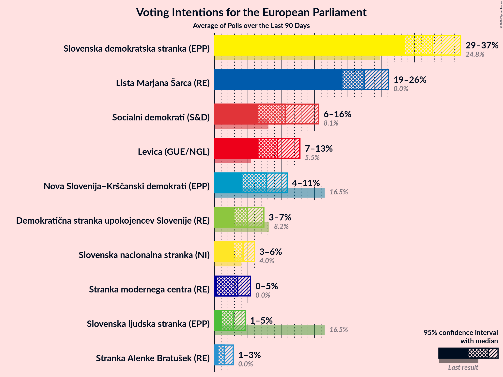
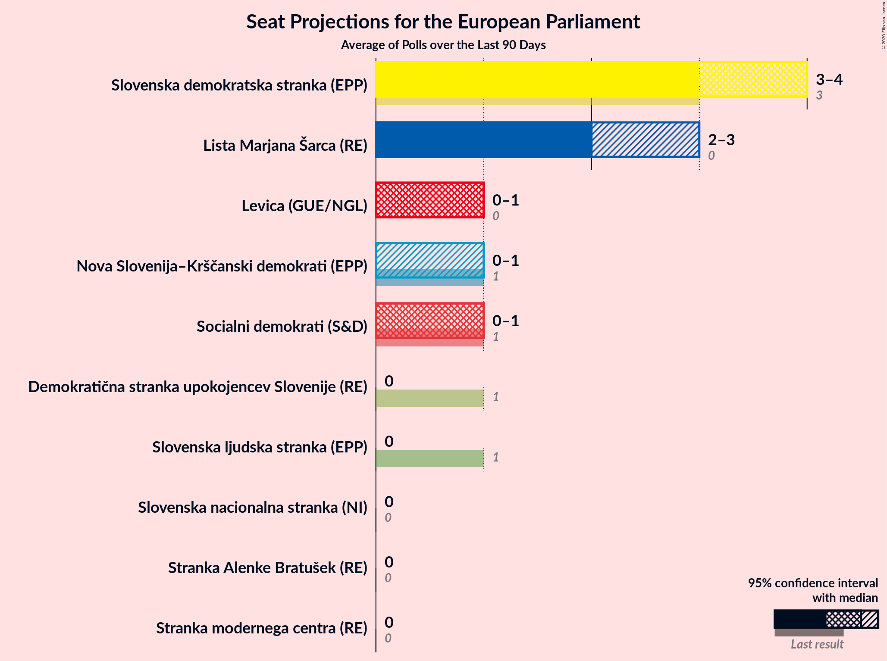
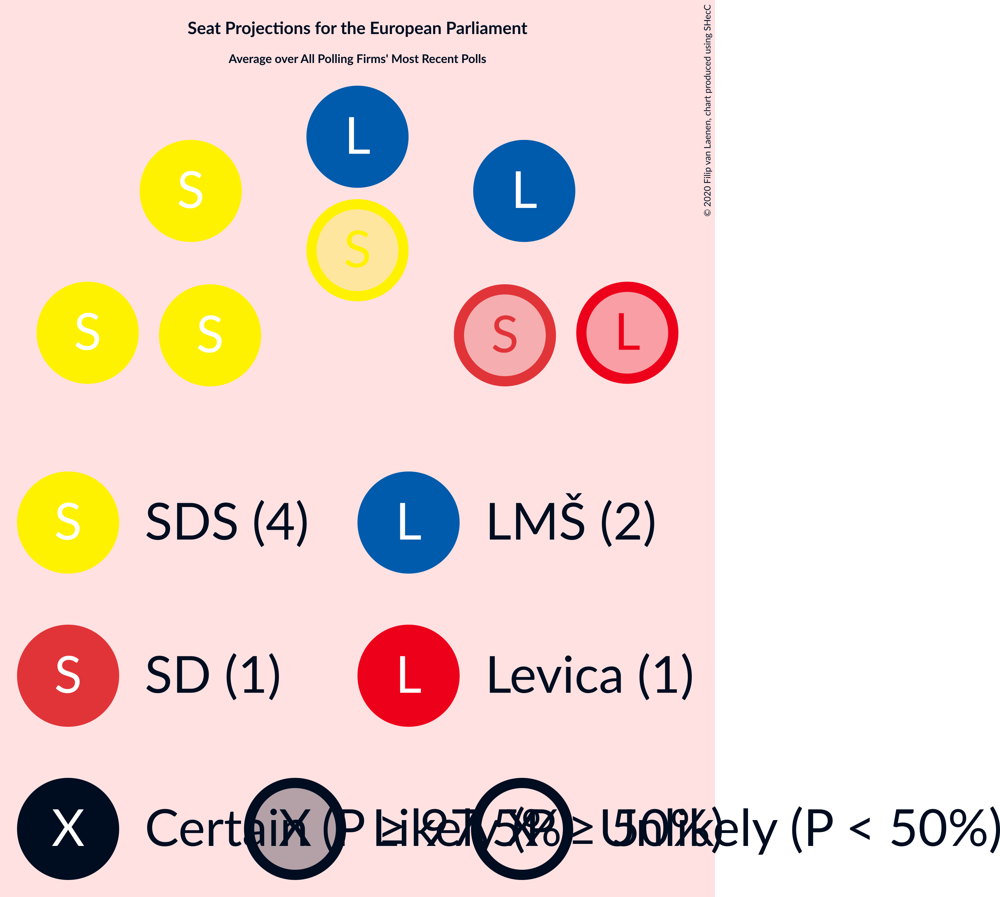

# Poll Average

<a href="#voting-intentions">Voting Intentions</a> | <a href="#seats">Seats</a> | <a href="#coalitions">Coalitions</a> | <a href="#technical-information">Technical Information</a>

## Summary

The table below lists the polls on which the average is based. They are the most recent polls (less than 90 days old) registered and analyzed so far.

| Period     | Polling firm/Commissioner(s) | SDS | NSi | SLS | DeSUS | SD | PS | Levica | SNS | DL | GOD | GOD–NLS | LMŠ | NLS | SMC | PAB | SDS–SLS |
|:----------:|:----------------------------:|:--:|:--:|:--:|:--:|:--:|:--:|:--:|:--:|:--:|:--:|:--:|:--:|:--:|:--:|:--:|:--:|
| 26 May 2019 | General Election | 24.8%   3 | 16.5%   1 | 16.5%   1 | 8.2%   1 | 8.1%   1 | 6.6%   0 | 5.5%   0 | 4.0%   0 | 1.1%   0 | 0.0%   0 | 0.0%   0 | 0.0%   0 | 0.0%   0 | 0.0%   0 | 0.0%   0 | 24.8%   4 |
| N/A | Poll Average | 29–37%   3–4 | 4–11%   0–1 | 1–5%   0 | 3–7%   0 | 6–16%   0–1 | N/A   N/A | 7–13%   0–1 | 3–6%   0 | N/A   N/A | N/A   N/A | N/A   N/A | 19–26%   2–3 | N/A   N/A | 0–5%   0 | 1–3%   0 | N/A   N/A |
| [10–12 March 2020](2020-03-12-Ninamedia.html) | Ninamedia   Dnevnik, Večer | 31–38%   3–4 | 7–12%   0–1 | 1–3%   0 | 3–6%   0 | 11–16%   1 | N/A   N/A | 7–12%   0–1 | 3–6%   0 | N/A   N/A | N/A   N/A | N/A   N/A | 19–25%   2–3 | N/A   N/A | 0–2%   0 | 0–2%   0 | N/A   N/A |
| [25 February–4 March 2020](2020-03-04-Mediana.html) | Mediana   Delo | 28–34%   3–4 | 6–10%   0–1 | 2–4%   0 | 3–7%   0 | 9–13%   1 | N/A   N/A | 9–13%   1 | 3–6%   0 | N/A   N/A | N/A   N/A | N/A   N/A | 19–25%   2–3 | N/A   N/A | 3–6%   0 | 1–3%   0 | N/A   N/A |
| [19–20 February 2020](2020-02-20-Parsifal.html) | Parsifal   Nova 24TV | 29–36%   3–5 | 4–7%   0 | 2–5%   0 | 4–8%   0–1 | 6–10%   0–1 | N/A   N/A | 6–10%   0–1 | 3–6%   0 | N/A   N/A | N/A   N/A | N/A   N/A | 21–27%   2–3 | N/A   N/A | 3–5%   0 | 1–2%   0 | N/A   N/A |
| 26 May 2019 | General Election | 24.8%   3 | 16.5%   1 | 16.5%   1 | 8.2%   1 | 8.1%   1 | 6.6%   0 | 5.5%   0 | 4.0%   0 | 1.1%   0 | 0.0%   0 | 0.0%   0 | 0.0%   0 | 0.0%   0 | 0.0%   0 | 0.0%   0 | 24.8%   4 |

Only polls for which at least the sample size has been published are included in the table above.

**Legend:**
+ **Top half of each row:** Voting intentions (95% confidence interval)
+ **Bottom half of each row:** Seat projections for the European Parliament (95% confidence interval)
+ **SDS:** Slovenska demokratska stranka (EPP)
+ **NSi:** Nova Slovenija–Krščanski demokrati (EPP)
+ **SLS:** Slovenska ljudska stranka (EPP)
+ **DeSUS:** Demokratična stranka upokojencev Slovenije (RE)
+ **SD:** Socialni demokrati (S&D)
+ **PS:** Pozitivna Slovenija (*)
+ **Levica:** Levica (GUE/NGL)
+ **SNS:** Slovenska nacionalna stranka (NI)
+ **DL:** Državljanska lista (RE)
+ **GOD:** Glas za otroke in družine (*)
+ **GOD–NLS:** Glas za otroke in družine–Nova ljudska stranka Slovenije (*)
+ **LMŠ:** Lista Marjana Šarca (RE)
+ **NLS:** Nova ljudska stranka Slovenije (*)
+ **SMC:** Stranka modernega centra (RE)
+ **PAB:** Stranka Alenke Bratušek (RE)
+ **SDS–SLS:** Slovenska demokratska stranka–Slovenska ljudska stranka (EPP)
+ **N/A (single party):** Party not included the published results
+ **N/A (entire row):** Calculation for this opinion poll not started yet

## Voting Intentions

### Confidence Intervals

| Party | Last Result | Median | 80% Confidence Interval | 90% Confidence Interval | 95% Confidence Interval | 99% Confidence Interval |
|:-----:|:-----------:|:------:|:-----------------------:|:-----------------------:|:-----------------------:|:-----------------------:|
| <a href="#slovenska-demokratska-stranka-(epp)">Slovenska demokratska stranka (EPP)</a> | 24.8% | 32.7% | 29.9–35.5% |29.2–36.3% | 28.6–36.9% | 27.5–38.2% |
| <a href="#slovenska-demokratska-stranka–slovenska-ljudska-stranka-(epp)">Slovenska demokratska stranka–Slovenska ljudska stranka (EPP)</a> | 24.8% | N/A | N/A |N/A | N/A | N/A |
| <a href="#nova-slovenija–krščanski-demokrati-(epp)">Nova Slovenija–Krščanski demokrati (EPP)</a> | 16.5% | 7.8% | 4.9–9.9% |4.5–10.4% | 4.2–10.9% | 3.7–11.8% |
| <a href="#slovenska-ljudska-stranka-(epp)">Slovenska ljudska stranka (EPP)</a> | 16.5% | 2.8% | 1.4–4.0% |1.2–4.3% | 1.1–4.6% | 0.8–5.1% |
| <a href="#demokratična-stranka-upokojencev-slovenije-(re)">Demokratična stranka upokojencev Slovenije (RE)</a> | 8.2% | 4.9% | 3.5–6.6% |3.2–7.0% | 3.0–7.4% | 2.6–8.2% |
| <a href="#socialni-demokrati-(s&d)">Socialni demokrati (S&D)</a> | 8.1% | 10.6% | 7.3–14.3% |6.9–15.0% | 6.5–15.6% | 5.9–16.6% |
| <a href="#pozitivna-slovenija-(*)">Pozitivna Slovenija (*)</a> | 6.6% | N/A | N/A |N/A | N/A | N/A |
| <a href="#levica-(gue/ngl)">Levica (GUE/NGL)</a> | 5.5% | 9.4% | 7.4–11.8% |7.0–12.4% | 6.6–12.8% | 6.0–13.7% |
| <a href="#slovenska-nacionalna-stranka-(ni)">Slovenska nacionalna stranka (NI)</a> | 4.0% | 4.3% | 3.4–5.3% |3.1–5.7% | 2.9–6.0% | 2.6–6.6% |
| <a href="#državljanska-lista-(re)">Državljanska lista (RE)</a> | 1.1% | N/A | N/A |N/A | N/A | N/A |
| <a href="#glas-za-otroke-in-družine-(*)">Glas za otroke in družine (*)</a> | 0.0% | N/A | N/A |N/A | N/A | N/A |
| <a href="#glas-za-otroke-in-družine–nova-ljudska-stranka-slovenije-(*)">Glas za otroke in družine–Nova ljudska stranka Slovenije (*)</a> | 0.0% | N/A | N/A |N/A | N/A | N/A |
| <a href="#lista-marjana-šarca-(re)">Lista Marjana Šarca (RE)</a> | 0.0% | 22.4% | 20.3–24.8% |19.7–25.5% | 19.2–26.1% | 18.3–27.2% |
| <a href="#nova-ljudska-stranka-slovenije-(*)">Nova ljudska stranka Slovenije (*)</a> | 0.0% | N/A | N/A |N/A | N/A | N/A |
| <a href="#stranka-modernega-centra-(re)">Stranka modernega centra (RE)</a> | 0.0% | 3.5% | 0.6–4.7% |0.5–5.1% | 0.4–5.4% | 0.3–5.9% |
| <a href="#stranka-alenke-bratušek-(re)">Stranka Alenke Bratušek (RE)</a> | 0.0% | 1.5% | 0.8–2.3% |0.7–2.6% | 0.6–2.8% | 0.4–3.3% |

### Slovenska demokratska stranka (EPP)

*For a full overview of the results for this party, see the [Slovenska demokratska stranka (EPP)](party-slovenskademokratskastrankaepp.html) page.*

| Voting Intentions | Probability | Accumulated | Special Marks |
|:-----------------:|:-----------:|:-----------:|:-------------:|
| 24.5–25.5% | 0% | 100% | Last Result |
| 25.5–26.5% | 0.1% | 100% |  |
| 26.5–27.5% | 0.5% | 99.9% |  |
| 27.5–28.5% | 2% | 99.4% |  |
| 28.5–29.5% | 5% | 98% |  |
| 29.5–30.5% | 9% | 93% |  |
| 30.5–31.5% | 14% | 84% |  |
| 31.5–32.5% | 17% | 69% |  |
| 32.5–33.5% | 17% | 52% | Median |
| 33.5–34.5% | 15% | 35% |  |
| 34.5–35.5% | 10% | 20% |  |
| 35.5–36.5% | 6% | 10% |  |
| 36.5–37.5% | 3% | 4% |  |
| 37.5–38.5% | 0.9% | 1.2% |  |
| 38.5–39.5% | 0.2% | 0.3% |  |
| 39.5–40.5% | 0% | 0.1% |  |
| 40.5–41.5% | 0% | 0% |  |

### Nova Slovenija–Krščanski demokrati (EPP)

*For a full overview of the results for this party, see the [Nova Slovenija–Krščanski demokrati (EPP)](party-novaslovenija–krščanskidemokratiepp.html) page.*

| Voting Intentions | Probability | Accumulated | Special Marks |
|:-----------------:|:-----------:|:-----------:|:-------------:|
| 1.5–2.5% | 0% | 100% |  |
| 2.5–3.5% | 0.2% | 100% |  |
| 3.5–4.5% | 5% | 99.8% |  |
| 4.5–5.5% | 14% | 95% |  |
| 5.5–6.5% | 13% | 80% |  |
| 6.5–7.5% | 14% | 67% |  |
| 7.5–8.5% | 20% | 54% | Median |
| 8.5–9.5% | 19% | 33% |  |
| 9.5–10.5% | 10% | 15% |  |
| 10.5–11.5% | 3% | 4% |  |
| 11.5–12.5% | 0.7% | 0.8% |  |
| 12.5–13.5% | 0.1% | 0.1% |  |
| 13.5–14.5% | 0% | 0% |  |
| 14.5–15.5% | 0% | 0% |  |
| 15.5–16.5% | 0% | 0% |  |
| 16.5–17.5% | 0% | 0% | Last Result |

### Slovenska ljudska stranka (EPP)

*For a full overview of the results for this party, see the [Slovenska ljudska stranka (EPP)](party-slovenskaljudskastrankaepp.html) page.*

| Voting Intentions | Probability | Accumulated | Special Marks |
|:-----------------:|:-----------:|:-----------:|:-------------:|
| 0.0–0.5% | 0% | 100% |  |
| 0.5–1.5% | 14% | 100% |  |
| 1.5–2.5% | 27% | 86% |  |
| 2.5–3.5% | 38% | 59% | Median |
| 3.5–4.5% | 19% | 21% |  |
| 4.5–5.5% | 2% | 3% |  |
| 5.5–6.5% | 0.1% | 0.1% |  |
| 6.5–7.5% | 0% | 0% |  |
| 7.5–8.5% | 0% | 0% |  |
| 8.5–9.5% | 0% | 0% |  |
| 9.5–10.5% | 0% | 0% |  |
| 10.5–11.5% | 0% | 0% |  |
| 11.5–12.5% | 0% | 0% |  |
| 12.5–13.5% | 0% | 0% |  |
| 13.5–14.5% | 0% | 0% |  |
| 14.5–15.5% | 0% | 0% |  |
| 15.5–16.5% | 0% | 0% |  |
| 16.5–17.5% | 0% | 0% | Last Result |

### Demokratična stranka upokojencev Slovenije (RE)

*For a full overview of the results for this party, see the [Demokratična stranka upokojencev Slovenije (RE)](party-demokratičnastrankaupokojencevslovenijere.html) page.*

| Voting Intentions | Probability | Accumulated | Special Marks |
|:-----------------:|:-----------:|:-----------:|:-------------:|
| 0.5–1.5% | 0% | 100% |  |
| 1.5–2.5% | 0.5% | 100% |  |
| 2.5–3.5% | 10% | 99.5% |  |
| 3.5–4.5% | 28% | 89% |  |
| 4.5–5.5% | 30% | 61% | Median |
| 5.5–6.5% | 21% | 31% |  |
| 6.5–7.5% | 8% | 10% |  |
| 7.5–8.5% | 2% | 2% | Last Result |
| 8.5–9.5% | 0.2% | 0.2% |  |
| 9.5–10.5% | 0% | 0% |  |

### Socialni demokrati (S&D)

*For a full overview of the results for this party, see the [Socialni demokrati (S&D)](party-socialnidemokratisd.html) page.*

| Voting Intentions | Probability | Accumulated | Special Marks |
|:-----------------:|:-----------:|:-----------:|:-------------:|
| 3.5–4.5% | 0% | 100% |  |
| 4.5–5.5% | 0.2% | 100% |  |
| 5.5–6.5% | 3% | 99.8% |  |
| 6.5–7.5% | 10% | 97% |  |
| 7.5–8.5% | 13% | 87% | Last Result |
| 8.5–9.5% | 11% | 74% |  |
| 9.5–10.5% | 12% | 63% |  |
| 10.5–11.5% | 12% | 51% | Median |
| 11.5–12.5% | 10% | 39% |  |
| 12.5–13.5% | 11% | 29% |  |
| 13.5–14.5% | 10% | 18% |  |
| 14.5–15.5% | 6% | 8% |  |
| 15.5–16.5% | 2% | 3% |  |
| 16.5–17.5% | 0.5% | 0.6% |  |
| 17.5–18.5% | 0.1% | 0.1% |  |
| 18.5–19.5% | 0% | 0% |  |

### Levica (GUE/NGL)

*For a full overview of the results for this party, see the [Levica (GUE/NGL)](party-levicaguengl.html) page.*

| Voting Intentions | Probability | Accumulated | Special Marks |
|:-----------------:|:-----------:|:-----------:|:-------------:|
| 3.5–4.5% | 0% | 100% |  |
| 4.5–5.5% | 0.1% | 100% | Last Result |
| 5.5–6.5% | 2% | 99.9% |  |
| 6.5–7.5% | 10% | 98% |  |
| 7.5–8.5% | 19% | 88% |  |
| 8.5–9.5% | 21% | 69% | Median |
| 9.5–10.5% | 19% | 48% |  |
| 10.5–11.5% | 16% | 29% |  |
| 11.5–12.5% | 9% | 13% |  |
| 12.5–13.5% | 3% | 4% |  |
| 13.5–14.5% | 0.6% | 0.7% |  |
| 14.5–15.5% | 0.1% | 0.1% |  |
| 15.5–16.5% | 0% | 0% |  |

### Slovenska nacionalna stranka (NI)

*For a full overview of the results for this party, see the [Slovenska nacionalna stranka (NI)](party-slovenskanacionalnastrankani.html) page.*

| Voting Intentions | Probability | Accumulated | Special Marks |
|:-----------------:|:-----------:|:-----------:|:-------------:|
| 0.5–1.5% | 0% | 100% |  |
| 1.5–2.5% | 0.4% | 100% |  |
| 2.5–3.5% | 16% | 99.6% |  |
| 3.5–4.5% | 48% | 84% | Last Result, Median |
| 4.5–5.5% | 29% | 36% |  |
| 5.5–6.5% | 6% | 6% |  |
| 6.5–7.5% | 0.5% | 0.5% |  |
| 7.5–8.5% | 0% | 0% |  |

### Lista Marjana Šarca (RE)

*For a full overview of the results for this party, see the [Lista Marjana Šarca (RE)](party-listamarjanašarcare.html) page.*

| Voting Intentions | Probability | Accumulated | Special Marks |
|:-----------------:|:-----------:|:-----------:|:-------------:|
| 0.0–0.5% | 0% | 100% | Last Result |
| 0.5–1.5% | 0% | 100% |  |
| 1.5–2.5% | 0% | 100% |  |
| 2.5–3.5% | 0% | 100% |  |
| 3.5–4.5% | 0% | 100% |  |
| 4.5–5.5% | 0% | 100% |  |
| 5.5–6.5% | 0% | 100% |  |
| 6.5–7.5% | 0% | 100% |  |
| 7.5–8.5% | 0% | 100% |  |
| 8.5–9.5% | 0% | 100% |  |
| 9.5–10.5% | 0% | 100% |  |
| 10.5–11.5% | 0% | 100% |  |
| 11.5–12.5% | 0% | 100% |  |
| 12.5–13.5% | 0% | 100% |  |
| 13.5–14.5% | 0% | 100% |  |
| 14.5–15.5% | 0% | 100% |  |
| 15.5–16.5% | 0% | 100% |  |
| 16.5–17.5% | 0.1% | 100% |  |
| 17.5–18.5% | 0.7% | 99.9% |  |
| 18.5–19.5% | 3% | 99.2% |  |
| 19.5–20.5% | 9% | 96% |  |
| 20.5–21.5% | 18% | 87% |  |
| 21.5–22.5% | 22% | 69% | Median |
| 22.5–23.5% | 20% | 47% |  |
| 23.5–24.5% | 14% | 27% |  |
| 24.5–25.5% | 8% | 12% |  |
| 25.5–26.5% | 3% | 5% |  |
| 26.5–27.5% | 1.1% | 1.4% |  |
| 27.5–28.5% | 0.2% | 0.3% |  |
| 28.5–29.5% | 0% | 0.1% |  |
| 29.5–30.5% | 0% | 0% |  |

### Stranka modernega centra (RE)

*For a full overview of the results for this party, see the [Stranka modernega centra (RE)](party-strankamodernegacentrare.html) page.*

| Voting Intentions | Probability | Accumulated | Special Marks |
|:-----------------:|:-----------:|:-----------:|:-------------:|
| 0.0–0.5% | 6% | 100% | Last Result |
| 0.5–1.5% | 26% | 94% |  |
| 1.5–2.5% | 2% | 68% |  |
| 2.5–3.5% | 18% | 66% | Median |
| 3.5–4.5% | 34% | 48% |  |
| 4.5–5.5% | 13% | 14% |  |
| 5.5–6.5% | 1.5% | 2% |  |
| 6.5–7.5% | 0.1% | 0.1% |  |
| 7.5–8.5% | 0% | 0% |  |

### Stranka Alenke Bratušek (RE)

*For a full overview of the results for this party, see the [Stranka Alenke Bratušek (RE)](party-strankaalenkebratušekre.html) page.*

| Voting Intentions | Probability | Accumulated | Special Marks |
|:-----------------:|:-----------:|:-----------:|:-------------:|
| 0.0–0.5% | 2% | 100% | Last Result |
| 0.5–1.5% | 55% | 98% | Median |
| 1.5–2.5% | 37% | 43% |  |
| 2.5–3.5% | 6% | 6% |  |
| 3.5–4.5% | 0.2% | 0.2% |  |
| 4.5–5.5% | 0% | 0% |  |

## Seats

### Confidence Intervals

| Party | Last Result | Median | 80% Confidence Interval | 90% Confidence Interval | 95% Confidence Interval | 99% Confidence Interval |
|:-----:|:-----------:|:------:|:-----------------------:|:-----------------------:|:-----------------------:|:-----------------------:|
| <a href="#slovenska-demokratska-stranka-(epp)">Slovenska demokratska stranka (EPP)</a> | 3 | 4 | 3–4 |3–4 | 3–4 | 3–5 |
| <a href="#slovenska-demokratska-stranka–slovenska-ljudska-stranka-(epp)">Slovenska demokratska stranka–Slovenska ljudska stranka (EPP)</a> | 4 | N/A | N/A |N/A | N/A | N/A |
| <a href="#nova-slovenija–krščanski-demokrati-(epp)">Nova Slovenija–Krščanski demokrati (EPP)</a> | 1 | 0 | 0–1 |0–1 | 0–1 | 0–1 |
| <a href="#slovenska-ljudska-stranka-(epp)">Slovenska ljudska stranka (EPP)</a> | 1 | 0 | 0 |0 | 0 | 0 |
| <a href="#demokratična-stranka-upokojencev-slovenije-(re)">Demokratična stranka upokojencev Slovenije (RE)</a> | 1 | 0 | 0 |0 | 0 | 0–1 |
| <a href="#socialni-demokrati-(s&d)">Socialni demokrati (S&D)</a> | 1 | 1 | 0–1 |0–1 | 0–1 | 0–2 |
| <a href="#pozitivna-slovenija-(*)">Pozitivna Slovenija (*)</a> | 0 | N/A | N/A |N/A | N/A | N/A |
| <a href="#levica-(gue/ngl)">Levica (GUE/NGL)</a> | 0 | 1 | 0–1 |0–1 | 0–1 | 0–1 |
| <a href="#slovenska-nacionalna-stranka-(ni)">Slovenska nacionalna stranka (NI)</a> | 0 | 0 | 0 |0 | 0 | 0 |
| <a href="#državljanska-lista-(re)">Državljanska lista (RE)</a> | 0 | N/A | N/A |N/A | N/A | N/A |
| <a href="#glas-za-otroke-in-družine-(*)">Glas za otroke in družine (*)</a> | 0 | N/A | N/A |N/A | N/A | N/A |
| <a href="#glas-za-otroke-in-družine–nova-ljudska-stranka-slovenije-(*)">Glas za otroke in družine–Nova ljudska stranka Slovenije (*)</a> | 0 | N/A | N/A |N/A | N/A | N/A |
| <a href="#lista-marjana-šarca-(re)">Lista Marjana Šarca (RE)</a> | 0 | 2 | 2–3 |2–3 | 2–3 | 2–3 |
| <a href="#nova-ljudska-stranka-slovenije-(*)">Nova ljudska stranka Slovenije (*)</a> | 0 | N/A | N/A |N/A | N/A | N/A |
| <a href="#stranka-modernega-centra-(re)">Stranka modernega centra (RE)</a> | 0 | 0 | 0 |0 | 0 | 0 |
| <a href="#stranka-alenke-bratušek-(re)">Stranka Alenke Bratušek (RE)</a> | 0 | 0 | 0 |0 | 0 | 0 |

