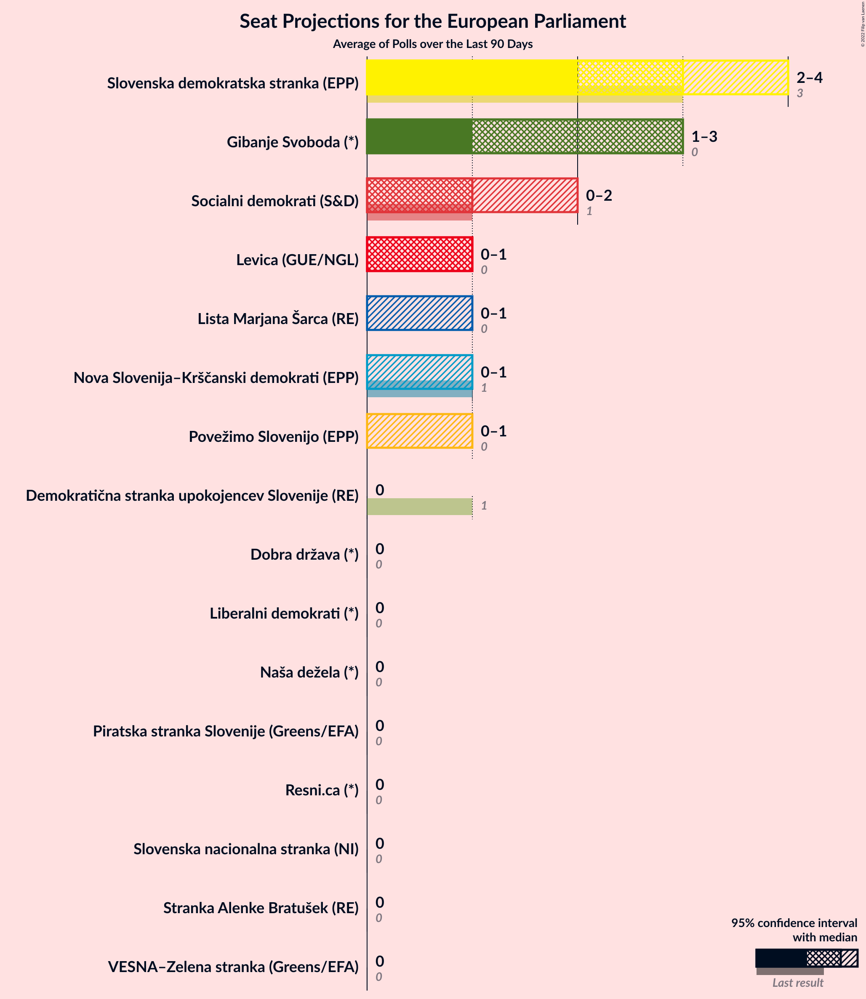
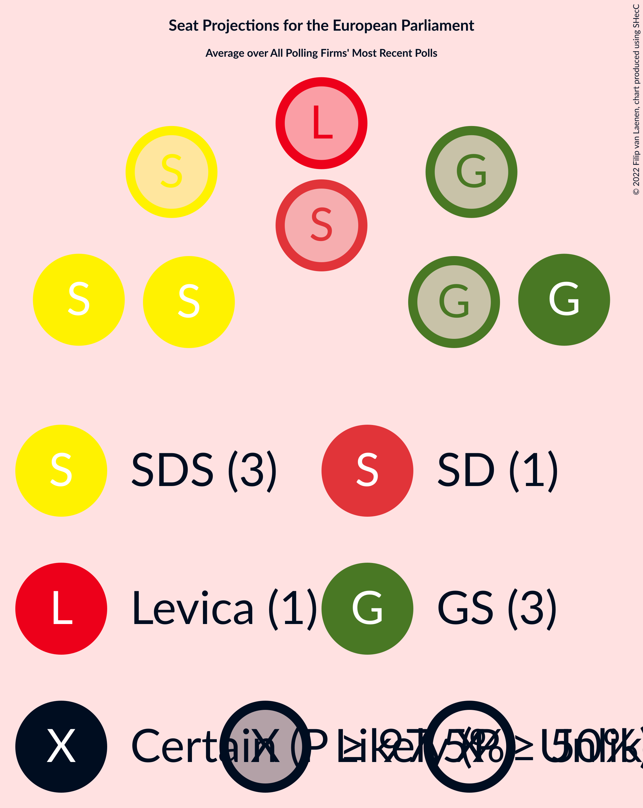
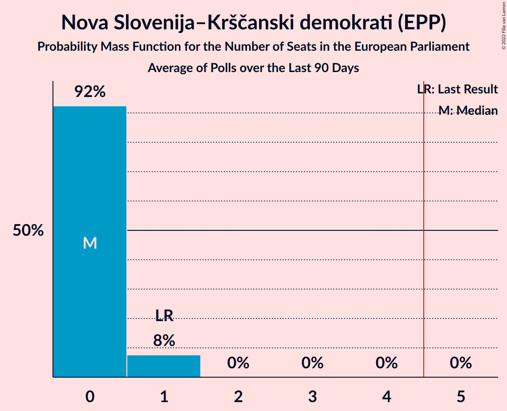
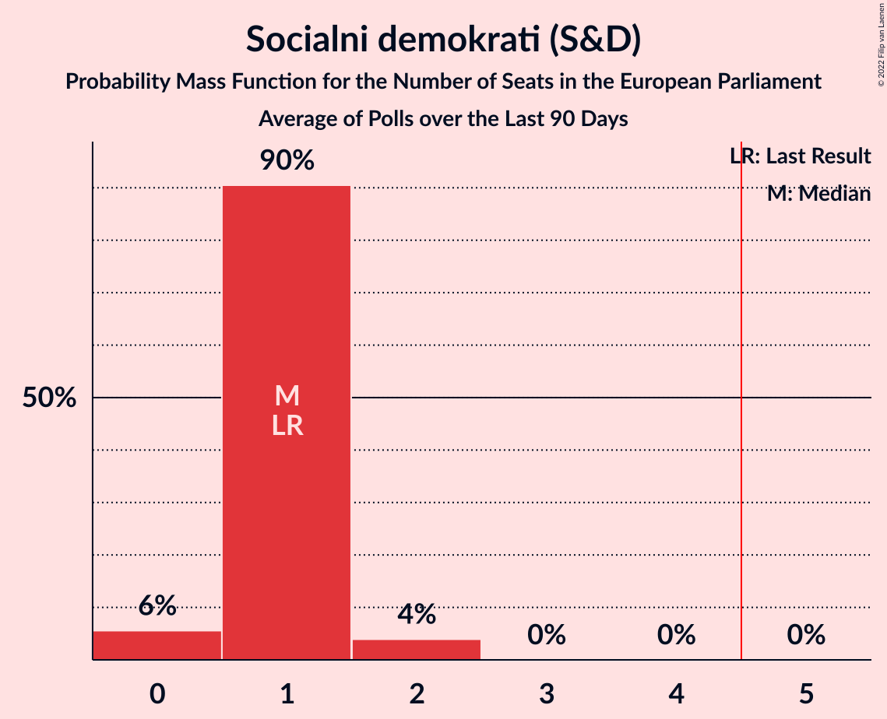
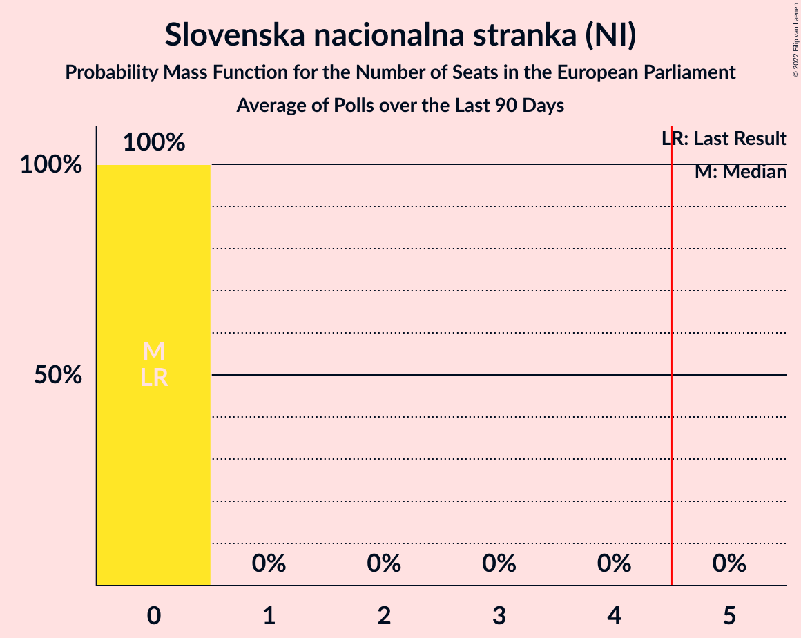
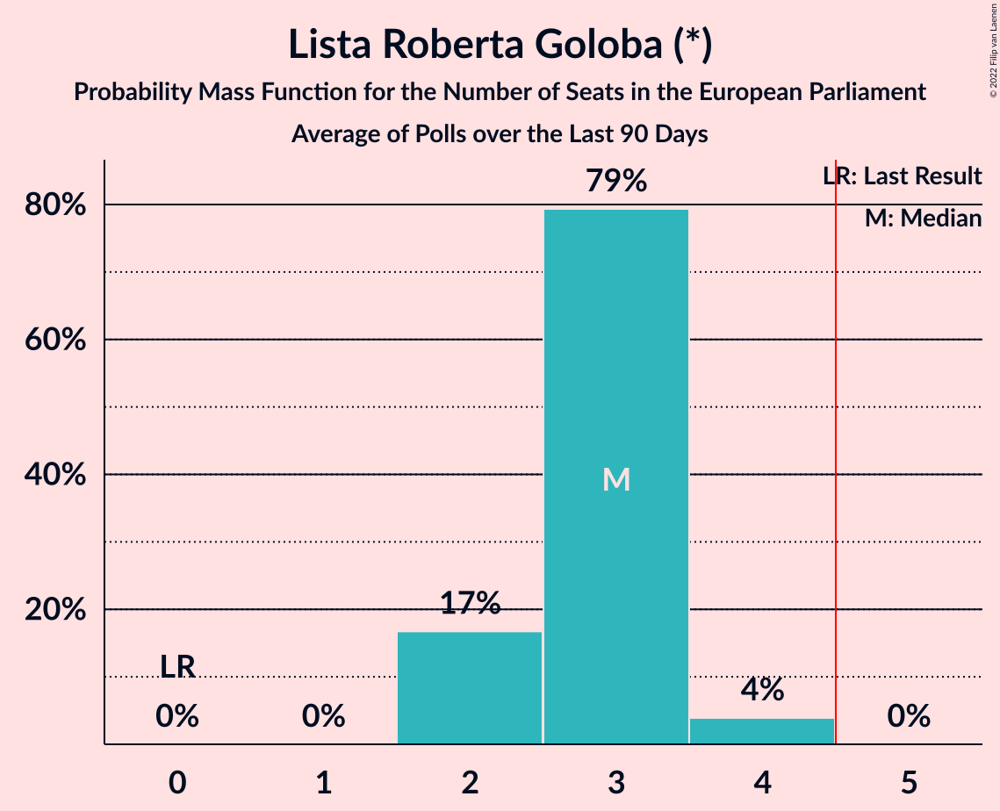
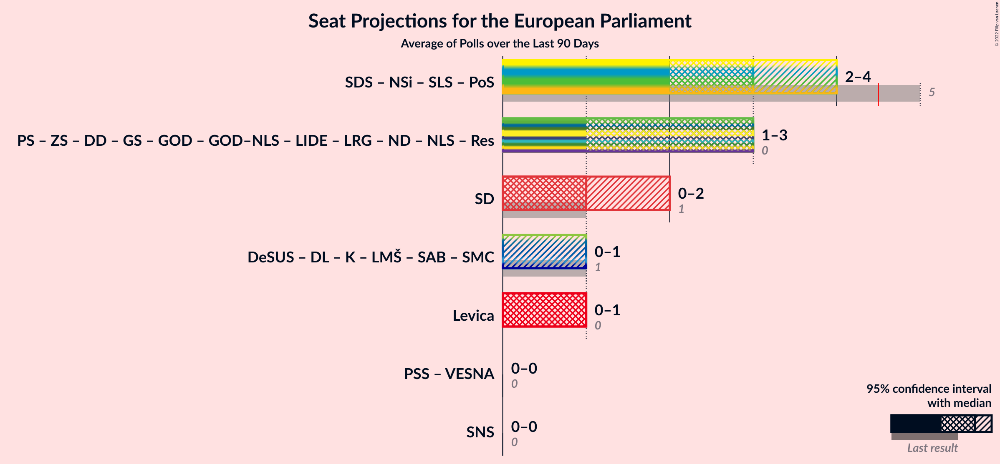
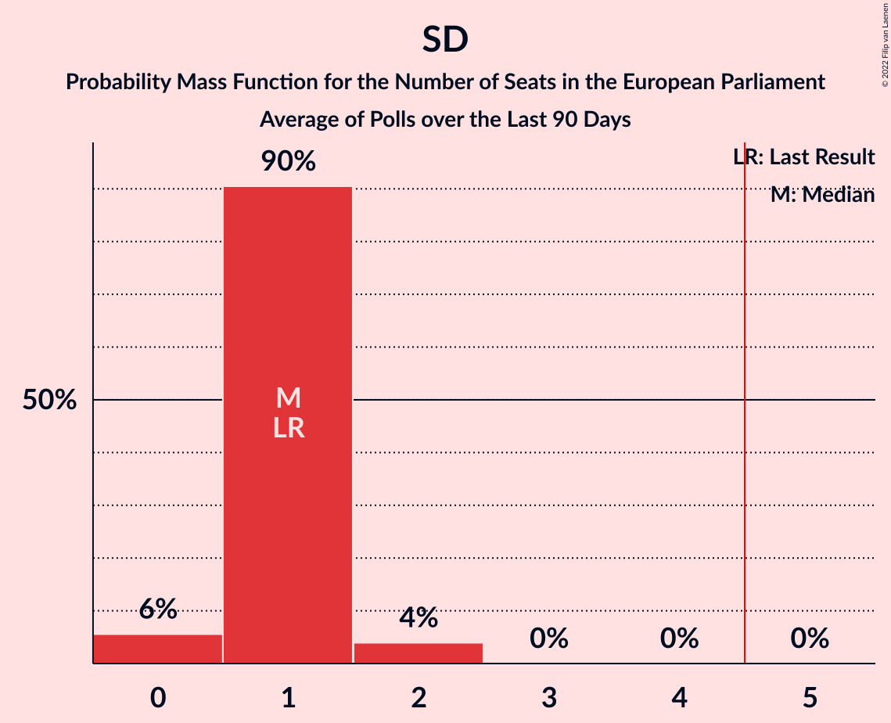
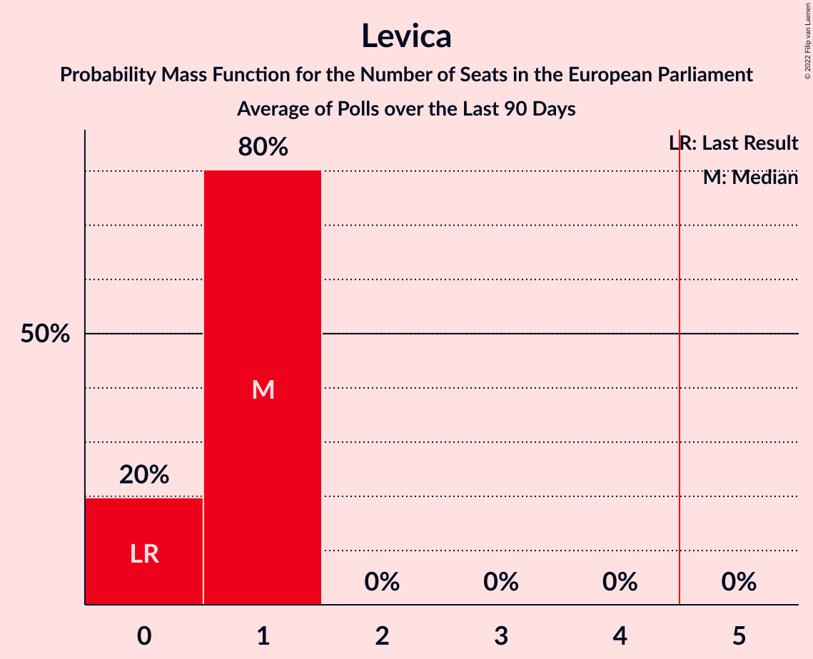
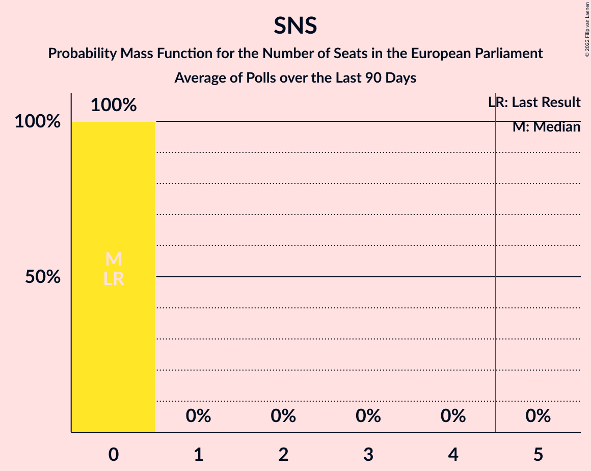

# Poll Average

<a href="#voting-intentions">Voting Intentions</a> | <a href="#seats">Seats</a> | <a href="#coalitions">Coalitions</a> | <a href="#technical-information">Technical Information</a>

## Summary

The table below lists the polls on which the average is based. They are the most recent polls (less than 90 days old) registered and analyzed so far.

| Period     | Polling firm/Commissioner(s) | SDS | NSi | SLS | DeSUS | SD | PS | Levica | SNS | DL | GOD | GOD–NLS | LMŠ | NLS | SMC | SAB | SDS–SLS | PSS | DD | ZS | ND | LRG | GS | K | PoS | LIDE | Res | VESNA |
|:----------:|:----------------------------:|:--:|:--:|:--:|:--:|:--:|:--:|:--:|:--:|:--:|:--:|:--:|:--:|:--:|:--:|:--:|:--:|:--:|:--:|:--:|:--:|:--:|:--:|:--:|:--:|:--:|:--:|:--:|
| 26 May 2019 | General Election | 24.8%   3 | 16.5%   1 | 16.5%   1 | 8.2%   1 | 8.1%   1 | 6.6%   0 | 5.5%   0 | 4.0%   0 | 1.1%   0 | 0.0%   0 | 0.0%   0 | 0.0%   0 | 0.0%   0 | 0.0%   0 | 0.0%   0 | 24.8%   4 | 0.0%   0 | 0.5%   0 | 2.2%   0 | 0.0%   0 | 0.0%   0 | 0.0%   0 | 0.0%   0 | 0.0%   0 | 0.0%   0 | 0.0%   0 | 0.0%   0 |
| N/A | Poll Average | 19–34%   2–4 | 4–8%   0–1 | N/A   N/A | 0–2%   0 | 8–14%   0–2 | N/A   N/A | 6–11%   0–1 | 1–2%   0 | N/A   N/A | N/A   N/A | N/A   N/A | 5–9%   0–1 | N/A   N/A | N/A   N/A | 2–6%   0 | N/A   N/A | 1–4%   0 | 0–1%   0 | N/A   N/A | 2–5%   0 | N/A   N/A | 16–27%   1–3 | N/A   N/A | 3–8%   0–1 | 0–2%   0 | 2–4%   0 | 0–2%   0 |
| [23–25 February 2022](2022-02-25-Parsifal.html) | Parsifal   Planet TV | 28–35%   3–4 | 4–7%   0 | N/A   N/A | N/A   N/A | 7–12%   0–1 | N/A   N/A | 6–10%   0–1 | N/A   N/A | N/A   N/A | N/A   N/A | N/A   N/A | 5–9%   0–1 | N/A   N/A | N/A   N/A | 2–4%   0 | N/A   N/A | N/A   N/A | N/A   N/A | N/A   N/A | 2–5%   0 | N/A   N/A | 15–21%   1–2 | N/A   N/A | 4–8%   0–1 | N/A   N/A | N/A   N/A | N/A   N/A |
| [21–24 February 2022](2022-02-24-Mediana.html) | Mediana   POP TV | 19–25%   2–3 | 4–8%   0–1 | N/A   N/A | 1–3%   0 | 9–14%   1–2 | N/A   N/A | 6–10%   0–1 | 1–3%   0 | N/A   N/A | N/A   N/A | N/A   N/A | 4–8%   0–1 | N/A   N/A | N/A   N/A | 3–6%   0 | N/A   N/A | 2–4%   0 | 0–1%   0 | N/A   N/A | 2–5%   0 | N/A   N/A | 20–26%   2–3 | N/A   N/A | 5–8%   0–1 | 0–1%   0 | 2–4%   0 | 0–2%   0 |
| [21–23 February 2022](2022-02-23-Ninamedia.html) | Ninamedia   Dnvnk, Včr, PrmNvc, Svt24 | 20–25%   2–3 | 4–6%   0 | N/A   N/A | 0–1%   0 | 10–14%   1 | N/A   N/A | 8–11%   1 | 1–2%   0 | N/A   N/A | N/A   N/A | N/A   N/A | 5–8%   0–1 | N/A   N/A | N/A   N/A | 3–5%   0 | N/A   N/A | 1–3%   0 | 0–1%   0 | N/A   N/A | 2–4%   0 | N/A   N/A | 22–28%   3 | N/A   N/A | 3–5%   0 | 1–2%   0 | 2–4%   0 | 1–2%   0 |
| 26 May 2019 | General Election | 24.8%   3 | 16.5%   1 | 16.5%   1 | 8.2%   1 | 8.1%   1 | 6.6%   0 | 5.5%   0 | 4.0%   0 | 1.1%   0 | 0.0%   0 | 0.0%   0 | 0.0%   0 | 0.0%   0 | 0.0%   0 | 0.0%   0 | 24.8%   4 | 0.0%   0 | 0.5%   0 | 2.2%   0 | 0.0%   0 | 0.0%   0 | 0.0%   0 | 0.0%   0 | 0.0%   0 | 0.0%   0 | 0.0%   0 | 0.0%   0 |

Only polls for which at least the sample size has been published are included in the table above.

**Legend:**
+ **Top half of each row:** Voting intentions (95% confidence interval)
+ **Bottom half of each row:** Seat projections for the European Parliament (95% confidence interval)
+ **SDS:** Slovenska demokratska stranka (EPP)
+ **NSi:** Nova Slovenija–Krščanski demokrati (EPP)
+ **SLS:** Slovenska ljudska stranka (EPP)
+ **DeSUS:** Demokratična stranka upokojencev Slovenije (RE)
+ **SD:** Socialni demokrati (S&D)
+ **PS:** Pozitivna Slovenija (*)
+ **Levica:** Levica (GUE/NGL)
+ **SNS:** Slovenska nacionalna stranka (NI)
+ **DL:** Državljanska lista (RE)
+ **GOD:** Glas za otroke in družine (*)
+ **GOD–NLS:** Glas za otroke in družine–Nova ljudska stranka Slovenije (*)
+ **LMŠ:** Lista Marjana Šarca (RE)
+ **NLS:** Nova ljudska stranka Slovenije (*)
+ **SMC:** Stranka modernega centra (RE)
+ **SAB:** Stranka Alenke Bratušek (RE)
+ **SDS–SLS:** Slovenska demokratska stranka–Slovenska ljudska stranka (EPP)
+ **PSS:** Piratska stranka Slovenije (Greens/EFA)
+ **DD:** Dobra država (*)
+ **ZS:** Zeleni Slovenije (*)
+ **ND:** Naša dežela (*)
+ **LRG:** Lista Roberta Goloba (*)
+ **GS:** Gibanje Svoboda (*)
+ **K:** Konkretno (RE)
+ **PoS:** Povežimo Slovenijo (EPP)
+ **LIDE:** Liberalni demokrati (*)
+ **Res:** Resni.ca (*)
+ **VESNA:** VESNA–Zelena stranka (Greens/EFA)
+ **N/A (single party):** Party not included the published results
+ **N/A (entire row):** Calculation for this opinion poll not started yet

## Voting Intentions

### Confidence Intervals

| Party | Last Result | Median | 80% Confidence Interval | 90% Confidence Interval | 95% Confidence Interval | 99% Confidence Interval |
|:-----:|:-----------:|:------:|:-----------------------:|:-----------------------:|:-----------------------:|:-----------------------:|
| <a href="#slovenska-demokratska-stranka-(epp)">Slovenska demokratska stranka (EPP)</a> | 24.8% | 23.1% | 20.5–32.0% |19.9–33.0% | 19.3–33.7% | 18.3–35.1% |
| <a href="#slovenska-demokratska-stranka–slovenska-ljudska-stranka-(epp)">Slovenska demokratska stranka–Slovenska ljudska stranka (EPP)</a> | 24.8% | N/A | N/A |N/A | N/A | N/A |
| <a href="#nova-slovenija–krščanski-demokrati-(epp)">Nova Slovenija–Krščanski demokrati (EPP)</a> | 16.5% | 5.3% | 4.3–6.7% |4.0–7.1% | 3.8–7.5% | 3.4–8.3% |
| <a href="#slovenska-ljudska-stranka-(epp)">Slovenska ljudska stranka (EPP)</a> | 16.5% | N/A | N/A |N/A | N/A | N/A |
| <a href="#demokratična-stranka-upokojencev-slovenije-(re)">Demokratična stranka upokojencev Slovenije (RE)</a> | 8.2% | 1.0% | 0.5–1.9% |0.4–2.1% | 0.4–2.4% | 0.3–2.8% |
| <a href="#socialni-demokrati-(s&d)">Socialni demokrati (S&D)</a> | 8.1% | 10.9% | 8.7–12.7% |8.2–13.2% | 7.8–13.6% | 7.1–14.4% |
| <a href="#pozitivna-slovenija-(*)">Pozitivna Slovenija (*)</a> | 6.6% | N/A | N/A |N/A | N/A | N/A |
| <a href="#levica-(gue/ngl)">Levica (GUE/NGL)</a> | 5.5% | 8.5% | 6.9–10.0% |6.5–10.4% | 6.2–10.8% | 5.6–11.5% |
| <a href="#slovenska-nacionalna-stranka-(ni)">Slovenska nacionalna stranka (NI)</a> | 4.0% | 1.4% | 0.9–2.0% |0.8–2.2% | 0.7–2.4% | 0.6–2.8% |
| <a href="#zeleni-slovenije-(*)">Zeleni Slovenije (*)</a> | 2.2% | N/A | N/A |N/A | N/A | N/A |
| <a href="#državljanska-lista-(re)">Državljanska lista (RE)</a> | 1.1% | N/A | N/A |N/A | N/A | N/A |
| <a href="#dobra-država-(*)">Dobra država (*)</a> | 0.5% | 0.5% | 0.3–0.9% |0.2–1.1% | 0.2–1.2% | 0.1–1.5% |
| <a href="#glas-za-otroke-in-družine-(*)">Glas za otroke in družine (*)</a> | 0.0% | N/A | N/A |N/A | N/A | N/A |
| <a href="#glas-za-otroke-in-družine–nova-ljudska-stranka-slovenije-(*)">Glas za otroke in družine–Nova ljudska stranka Slovenije (*)</a> | 0.0% | N/A | N/A |N/A | N/A | N/A |
| <a href="#lista-marjana-šarca-(re)">Lista Marjana Šarca (RE)</a> | 0.0% | 6.5% | 5.3–8.0% |4.9–8.4% | 4.6–8.8% | 4.1–9.6% |
| <a href="#nova-ljudska-stranka-slovenije-(*)">Nova ljudska stranka Slovenije (*)</a> | 0.0% | N/A | N/A |N/A | N/A | N/A |
| <a href="#stranka-modernega-centra-(re)">Stranka modernega centra (RE)</a> | 0.0% | N/A | N/A |N/A | N/A | N/A |
| <a href="#stranka-alenke-bratušek-(re)">Stranka Alenke Bratušek (RE)</a> | 0.0% | 3.9% | 2.6–5.0% |2.4–5.4% | 2.1–5.7% | 1.8–6.3% |
| <a href="#piratska-stranka-slovenije-(greens/efa)">Piratska stranka Slovenije (Greens/EFA)</a> | 0.0% | 2.3% | 1.5–3.4% |1.4–3.7% | 1.3–4.0% | 1.1–4.6% |
| <a href="#naša-dežela-(*)">Naša dežela (*)</a> | 0.0% | 3.2% | 2.5–4.1% |2.3–4.4% | 2.1–4.7% | 1.8–5.3% |
| <a href="#lista-roberta-goloba-(*)">Lista Roberta Goloba (*)</a> | 0.0% | N/A | N/A |N/A | N/A | N/A |
| <a href="#gibanje-svoboda-(*)">Gibanje Svoboda (*)</a> | 0.0% | 22.8% | 17.0–25.8% |16.2–26.4% | 15.6–26.9% | 14.7–27.9% |
| <a href="#konkretno-(re)">Konkretno (RE)</a> | 0.0% | N/A | N/A |N/A | N/A | N/A |
| <a href="#povežimo-slovenijo-(epp)">Povežimo Slovenijo (EPP)</a> | 0.0% | 5.6% | 3.4–7.2% |3.1–7.6% | 2.9–8.0% | 2.6–8.7% |
| <a href="#liberalni-demokrati-(*)">Liberalni demokrati (*)</a> | 0.0% | 1.0% | 0.3–1.7% |0.3–1.9% | 0.2–2.1% | 0.1–2.4% |
| <a href="#resni.ca-(*)">Resni.ca (*)</a> | 0.0% | 2.8% | 2.2–3.6% |2.0–3.9% | 1.8–4.1% | 1.6–4.6% |
| <a href="#vesna–zelena-stranka-(greens/efa)">VESNA–Zelena stranka (Greens/EFA)</a> | 0.0% | 1.0% | 0.6–1.6% |0.5–1.8% | 0.4–1.9% | 0.3–2.2% |

### Slovenska demokratska stranka (EPP)

*For a full overview of the results for this party, see the [Slovenska demokratska stranka (EPP)](party-slovenskademokratskastrankaepp.html) page.*

| Voting Intentions | Probability | Accumulated | Special Marks |
|:-----------------:|:-----------:|:-----------:|:-------------:|
| 15.5–16.5% | 0% | 100% |  |
| 16.5–17.5% | 0.1% | 100% |  |
| 17.5–18.5% | 0.7% | 99.9% |  |
| 18.5–19.5% | 3% | 99.2% |  |
| 19.5–20.5% | 7% | 97% |  |
| 20.5–21.5% | 14% | 90% |  |
| 21.5–22.5% | 18% | 76% |  |
| 22.5–23.5% | 14% | 58% | Median |
| 23.5–24.5% | 7% | 44% |  |
| 24.5–25.5% | 2% | 36% | Last Result |
| 25.5–26.5% | 0.7% | 34% |  |
| 26.5–27.5% | 0.7% | 33% |  |
| 27.5–28.5% | 2% | 33% |  |
| 28.5–29.5% | 4% | 31% |  |
| 29.5–30.5% | 6% | 27% |  |
| 30.5–31.5% | 7% | 21% |  |
| 31.5–32.5% | 6% | 13% |  |
| 32.5–33.5% | 4% | 7% |  |
| 33.5–34.5% | 2% | 3% |  |
| 34.5–35.5% | 0.7% | 1.0% |  |
| 35.5–36.5% | 0.2% | 0.3% |  |
| 36.5–37.5% | 0% | 0.1% |  |
| 37.5–38.5% | 0% | 0% |  |

### Nova Slovenija–Krščanski demokrati (EPP)

*For a full overview of the results for this party, see the [Nova Slovenija–Krščanski demokrati (EPP)](party-novaslovenija–krščanskidemokratiepp.html) page.*

| Voting Intentions | Probability | Accumulated | Special Marks |
|:-----------------:|:-----------:|:-----------:|:-------------:|
| 1.5–2.5% | 0% | 100% |  |
| 2.5–3.5% | 0.9% | 100% |  |
| 3.5–4.5% | 17% | 99.1% |  |
| 4.5–5.5% | 41% | 82% | Median |
| 5.5–6.5% | 29% | 42% |  |
| 6.5–7.5% | 10% | 13% |  |
| 7.5–8.5% | 2% | 2% |  |
| 8.5–9.5% | 0.2% | 0.3% |  |
| 9.5–10.5% | 0% | 0% |  |
| 10.5–11.5% | 0% | 0% |  |
| 11.5–12.5% | 0% | 0% |  |
| 12.5–13.5% | 0% | 0% |  |
| 13.5–14.5% | 0% | 0% |  |
| 14.5–15.5% | 0% | 0% |  |
| 15.5–16.5% | 0% | 0% |  |
| 16.5–17.5% | 0% | 0% | Last Result |

### Demokratična stranka upokojencev Slovenije (RE)

*For a full overview of the results for this party, see the [Demokratična stranka upokojencev Slovenije (RE)](party-demokratičnastrankaupokojencevslovenijere.html) page.*

| Voting Intentions | Probability | Accumulated | Special Marks |
|:-----------------:|:-----------:|:-----------:|:-------------:|
| 0.0–0.5% | 11% | 100% |  |
| 0.5–1.5% | 67% | 89% | Median |
| 1.5–2.5% | 20% | 22% |  |
| 2.5–3.5% | 1.4% | 1.4% |  |
| 3.5–4.5% | 0% | 0% |  |
| 4.5–5.5% | 0% | 0% |  |
| 5.5–6.5% | 0% | 0% |  |
| 6.5–7.5% | 0% | 0% |  |
| 7.5–8.5% | 0% | 0% | Last Result |

### Socialni demokrati (S&D)

*For a full overview of the results for this party, see the [Socialni demokrati (S&D)](party-socialnidemokratisd.html) page.*

| Voting Intentions | Probability | Accumulated | Special Marks |
|:-----------------:|:-----------:|:-----------:|:-------------:|
| 4.5–5.5% | 0% | 100% |  |
| 5.5–6.5% | 0.1% | 100% |  |
| 6.5–7.5% | 1.4% | 99.9% |  |
| 7.5–8.5% | 6% | 98.5% | Last Result |
| 8.5–9.5% | 14% | 92% |  |
| 9.5–10.5% | 19% | 79% |  |
| 10.5–11.5% | 26% | 59% | Median |
| 11.5–12.5% | 21% | 34% |  |
| 12.5–13.5% | 10% | 12% |  |
| 13.5–14.5% | 2% | 3% |  |
| 14.5–15.5% | 0.3% | 0.4% |  |
| 15.5–16.5% | 0% | 0% |  |

### Levica (GUE/NGL)

*For a full overview of the results for this party, see the [Levica (GUE/NGL)](party-levicaguengl.html) page.*

| Voting Intentions | Probability | Accumulated | Special Marks |
|:-----------------:|:-----------:|:-----------:|:-------------:|
| 3.5–4.5% | 0% | 100% |  |
| 4.5–5.5% | 0.3% | 100% | Last Result |
| 5.5–6.5% | 5% | 99.6% |  |
| 6.5–7.5% | 18% | 95% |  |
| 7.5–8.5% | 30% | 77% | Median |
| 8.5–9.5% | 29% | 47% |  |
| 9.5–10.5% | 14% | 18% |  |
| 10.5–11.5% | 3% | 4% |  |
| 11.5–12.5% | 0.4% | 0.4% |  |
| 12.5–13.5% | 0% | 0% |  |

### Slovenska nacionalna stranka (NI)

*For a full overview of the results for this party, see the [Slovenska nacionalna stranka (NI)](party-slovenskanacionalnastrankani.html) page.*

| Voting Intentions | Probability | Accumulated | Special Marks |
|:-----------------:|:-----------:|:-----------:|:-------------:|
| 0.0–0.5% | 0.3% | 100% |  |
| 0.5–1.5% | 66% | 99.7% | Median |
| 1.5–2.5% | 32% | 34% |  |
| 2.5–3.5% | 1.5% | 2% |  |
| 3.5–4.5% | 0% | 0% | Last Result |

### Dobra država (*)

*For a full overview of the results for this party, see the [Dobra država (*)](party-dobradržava.html) page.*

| Voting Intentions | Probability | Accumulated | Special Marks |
|:-----------------:|:-----------:|:-----------:|:-------------:|
| 0.0–0.5% | 50% | 100% |  |
| 0.5–1.5% | 49% | 50% | Last Result, Median |
| 1.5–2.5% | 0.5% | 0.5% |  |
| 2.5–3.5% | 0% | 0% |  |

### Lista Marjana Šarca (RE)

*For a full overview of the results for this party, see the [Lista Marjana Šarca (RE)](party-listamarjanašarcare.html) page.*

| Voting Intentions | Probability | Accumulated | Special Marks |
|:-----------------:|:-----------:|:-----------:|:-------------:|
| 0.0–0.5% | 0% | 100% | Last Result |
| 0.5–1.5% | 0% | 100% |  |
| 1.5–2.5% | 0% | 100% |  |
| 2.5–3.5% | 0.1% | 100% |  |
| 3.5–4.5% | 2% | 99.9% |  |
| 4.5–5.5% | 14% | 98% |  |
| 5.5–6.5% | 35% | 84% |  |
| 6.5–7.5% | 32% | 49% | Median |
| 7.5–8.5% | 14% | 18% |  |
| 8.5–9.5% | 3% | 4% |  |
| 9.5–10.5% | 0.5% | 0.6% |  |
| 10.5–11.5% | 0.1% | 0.1% |  |
| 11.5–12.5% | 0% | 0% |  |

### Stranka Alenke Bratušek (RE)

*For a full overview of the results for this party, see the [Stranka Alenke Bratušek (RE)](party-strankaalenkebratušekre.html) page.*

| Voting Intentions | Probability | Accumulated | Special Marks |
|:-----------------:|:-----------:|:-----------:|:-------------:|
| 0.0–0.5% | 0% | 100% | Last Result |
| 0.5–1.5% | 0.1% | 100% |  |
| 1.5–2.5% | 8% | 99.9% |  |
| 2.5–3.5% | 28% | 92% |  |
| 3.5–4.5% | 41% | 64% | Median |
| 4.5–5.5% | 19% | 23% |  |
| 5.5–6.5% | 3% | 3% |  |
| 6.5–7.5% | 0.2% | 0.3% |  |
| 7.5–8.5% | 0% | 0% |  |

### Povežimo Slovenijo (EPP)

*For a full overview of the results for this party, see the [Povežimo Slovenijo (EPP)](party-povežimoslovenijoepp.html) page.*

| Voting Intentions | Probability | Accumulated | Special Marks |
|:-----------------:|:-----------:|:-----------:|:-------------:|
| 0.0–0.5% | 0% | 100% | Last Result |
| 0.5–1.5% | 0% | 100% |  |
| 1.5–2.5% | 0.5% | 100% |  |
| 2.5–3.5% | 13% | 99.5% |  |
| 3.5–4.5% | 19% | 86% |  |
| 4.5–5.5% | 17% | 67% |  |
| 5.5–6.5% | 27% | 50% | Median |
| 6.5–7.5% | 17% | 23% |  |
| 7.5–8.5% | 5% | 6% |  |
| 8.5–9.5% | 0.7% | 0.8% |  |
| 9.5–10.5% | 0.1% | 0.1% |  |
| 10.5–11.5% | 0% | 0% |  |

### Gibanje Svoboda (*)

*For a full overview of the results for this party, see the [Gibanje Svoboda (*)](party-gibanjesvoboda.html) page.*

| Voting Intentions | Probability | Accumulated | Special Marks |
|:-----------------:|:-----------:|:-----------:|:-------------:|
| 0.0–0.5% | 0% | 100% | Last Result |
| 0.5–1.5% | 0% | 100% |  |
| 1.5–2.5% | 0% | 100% |  |
| 2.5–3.5% | 0% | 100% |  |
| 3.5–4.5% | 0% | 100% |  |
| 4.5–5.5% | 0% | 100% |  |
| 5.5–6.5% | 0% | 100% |  |
| 6.5–7.5% | 0% | 100% |  |
| 7.5–8.5% | 0% | 100% |  |
| 8.5–9.5% | 0% | 100% |  |
| 9.5–10.5% | 0% | 100% |  |
| 10.5–11.5% | 0% | 100% |  |
| 11.5–12.5% | 0% | 100% |  |
| 12.5–13.5% | 0% | 100% |  |
| 13.5–14.5% | 0.4% | 100% |  |
| 14.5–15.5% | 2% | 99.6% |  |
| 15.5–16.5% | 5% | 98% |  |
| 16.5–17.5% | 8% | 93% |  |
| 17.5–18.5% | 9% | 85% |  |
| 18.5–19.5% | 6% | 76% |  |
| 19.5–20.5% | 4% | 70% |  |
| 20.5–21.5% | 5% | 66% |  |
| 21.5–22.5% | 8% | 61% |  |
| 22.5–23.5% | 12% | 52% | Median |
| 23.5–24.5% | 15% | 41% |  |
| 24.5–25.5% | 13% | 26% |  |
| 25.5–26.5% | 8% | 13% |  |
| 26.5–27.5% | 3% | 4% |  |
| 27.5–28.5% | 0.8% | 1.0% |  |
| 28.5–29.5% | 0.1% | 0.1% |  |
| 29.5–30.5% | 0% | 0% |  |

### Naša dežela (*)

*For a full overview of the results for this party, see the [Naša dežela (*)](party-našadežela.html) page.*

| Voting Intentions | Probability | Accumulated | Special Marks |
|:-----------------:|:-----------:|:-----------:|:-------------:|
| 0.0–0.5% | 0% | 100% | Last Result |
| 0.5–1.5% | 0.1% | 100% |  |
| 1.5–2.5% | 13% | 99.9% |  |
| 2.5–3.5% | 56% | 87% | Median |
| 3.5–4.5% | 27% | 31% |  |
| 4.5–5.5% | 4% | 4% |  |
| 5.5–6.5% | 0.2% | 0.2% |  |
| 6.5–7.5% | 0% | 0% |  |

### Piratska stranka Slovenije (Greens/EFA)

*For a full overview of the results for this party, see the [Piratska stranka Slovenije (Greens/EFA)](party-piratskastrankaslovenijegreensefa.html) page.*

| Voting Intentions | Probability | Accumulated | Special Marks |
|:-----------------:|:-----------:|:-----------:|:-------------:|
| 0.0–0.5% | 0% | 100% | Last Result |
| 0.5–1.5% | 11% | 100% |  |
| 1.5–2.5% | 52% | 89% | Median |
| 2.5–3.5% | 30% | 37% |  |
| 3.5–4.5% | 7% | 8% |  |
| 4.5–5.5% | 0.5% | 0.6% |  |
| 5.5–6.5% | 0% | 0% |  |

### Resni.ca (*)

*For a full overview of the results for this party, see the [Resni.ca (*)](party-resnica.html) page.*

| Voting Intentions | Probability | Accumulated | Special Marks |
|:-----------------:|:-----------:|:-----------:|:-------------:|
| 0.0–0.5% | 0% | 100% | Last Result |
| 0.5–1.5% | 0.5% | 100% |  |
| 1.5–2.5% | 30% | 99.5% |  |
| 2.5–3.5% | 57% | 69% | Median |
| 3.5–4.5% | 11% | 12% |  |
| 4.5–5.5% | 0.6% | 0.7% |  |
| 5.5–6.5% | 0% | 0% |  |

### VESNA–Zelena stranka (Greens/EFA)

*For a full overview of the results for this party, see the [VESNA–Zelena stranka (Greens/EFA)](party-vesna–zelenastrankagreensefa.html) page.*

| Voting Intentions | Probability | Accumulated | Special Marks |
|:-----------------:|:-----------:|:-----------:|:-------------:|
| 0.0–0.5% | 8% | 100% | Last Result |
| 0.5–1.5% | 81% | 92% | Median |
| 1.5–2.5% | 11% | 11% |  |
| 2.5–3.5% | 0.1% | 0.1% |  |
| 3.5–4.5% | 0% | 0% |  |

### Liberalni demokrati (*)

*For a full overview of the results for this party, see the [Liberalni demokrati (*)](party-liberalnidemokrati.html) page.*

| Voting Intentions | Probability | Accumulated | Special Marks |
|:-----------------:|:-----------:|:-----------:|:-------------:|
| 0.0–0.5% | 24% | 100% | Last Result |
| 0.5–1.5% | 58% | 76% | Median |
| 1.5–2.5% | 17% | 17% |  |
| 2.5–3.5% | 0.2% | 0.2% |  |
| 3.5–4.5% | 0% | 0% |  |

## Seats

### Confidence Intervals

| Party | Last Result | Median | 80% Confidence Interval | 90% Confidence Interval | 95% Confidence Interval | 99% Confidence Interval |
|:-----:|:-----------:|:------:|:-----------------------:|:-----------------------:|:-----------------------:|:-----------------------:|
| <a href="#slovenska-demokratska-stranka-(epp)">Slovenska demokratska stranka (EPP)</a> | 3 | 3 | 2–4 |2–4 | 2–4 | 2–4 |
| <a href="#slovenska-demokratska-stranka–slovenska-ljudska-stranka-(epp)">Slovenska demokratska stranka–Slovenska ljudska stranka (EPP)</a> | 4 | N/A | N/A |N/A | N/A | N/A |
| <a href="#nova-slovenija–krščanski-demokrati-(epp)">Nova Slovenija–Krščanski demokrati (EPP)</a> | 1 | 0 | 0 |0–1 | 0–1 | 0–1 |
| <a href="#slovenska-ljudska-stranka-(epp)">Slovenska ljudska stranka (EPP)</a> | 1 | N/A | N/A |N/A | N/A | N/A |
| <a href="#demokratična-stranka-upokojencev-slovenije-(re)">Demokratična stranka upokojencev Slovenije (RE)</a> | 1 | 0 | 0 |0 | 0 | 0 |
| <a href="#socialni-demokrati-(s&d)">Socialni demokrati (S&D)</a> | 1 | 1 | 1 |0–1 | 0–2 | 0–2 |
| <a href="#pozitivna-slovenija-(*)">Pozitivna Slovenija (*)</a> | 0 | N/A | N/A |N/A | N/A | N/A |
| <a href="#levica-(gue/ngl)">Levica (GUE/NGL)</a> | 0 | 1 | 0–1 |0–1 | 0–1 | 0–1 |
| <a href="#slovenska-nacionalna-stranka-(ni)">Slovenska nacionalna stranka (NI)</a> | 0 | 0 | 0 |0 | 0 | 0 |
| <a href="#zeleni-slovenije-(*)">Zeleni Slovenije (*)</a> | 0 | N/A | N/A |N/A | N/A | N/A |
| <a href="#državljanska-lista-(re)">Državljanska lista (RE)</a> | 0 | N/A | N/A |N/A | N/A | N/A |
| <a href="#dobra-država-(*)">Dobra država (*)</a> | 0 | 0 | 0 |0 | 0 | 0 |
| <a href="#glas-za-otroke-in-družine-(*)">Glas za otroke in družine (*)</a> | 0 | N/A | N/A |N/A | N/A | N/A |
| <a href="#glas-za-otroke-in-družine–nova-ljudska-stranka-slovenije-(*)">Glas za otroke in družine–Nova ljudska stranka Slovenije (*)</a> | 0 | N/A | N/A |N/A | N/A | N/A |
| <a href="#lista-marjana-šarca-(re)">Lista Marjana Šarca (RE)</a> | 0 | 0 | 0–1 |0–1 | 0–1 | 0–1 |
| <a href="#nova-ljudska-stranka-slovenije-(*)">Nova ljudska stranka Slovenije (*)</a> | 0 | N/A | N/A |N/A | N/A | N/A |
| <a href="#stranka-modernega-centra-(re)">Stranka modernega centra (RE)</a> | 0 | N/A | N/A |N/A | N/A | N/A |
| <a href="#stranka-alenke-bratušek-(re)">Stranka Alenke Bratušek (RE)</a> | 0 | 0 | 0 |0 | 0 | 0 |
| <a href="#piratska-stranka-slovenije-(greens/efa)">Piratska stranka Slovenije (Greens/EFA)</a> | 0 | 0 | 0 |0 | 0 | 0 |
| <a href="#naša-dežela-(*)">Naša dežela (*)</a> | 0 | 0 | 0 |0 | 0 | 0 |
| <a href="#lista-roberta-goloba-(*)">Lista Roberta Goloba (*)</a> | 0 | N/A | N/A |N/A | N/A | N/A |
| <a href="#gibanje-svoboda-(*)">Gibanje Svoboda (*)</a> | 0 | 3 | 2–3 |2–3 | 1–3 | 1–3 |
| <a href="#konkretno-(re)">Konkretno (RE)</a> | 0 | N/A | N/A |N/A | N/A | N/A |
| <a href="#povežimo-slovenijo-(epp)">Povežimo Slovenijo (EPP)</a> | 0 | 0 | 0 |0–1 | 0–1 | 0–1 |
| <a href="#liberalni-demokrati-(*)">Liberalni demokrati (*)</a> | 0 | 0 | 0 |0 | 0 | 0 |
| <a href="#resni.ca-(*)">Resni.ca (*)</a> | 0 | 0 | 0 |0 | 0 | 0 |
| <a href="#vesna–zelena-stranka-(greens/efa)">VESNA–Zelena stranka (Greens/EFA)</a> | 0 | 0 | 0 |0 | 0 | 0 |

### Slovenska demokratska stranka (EPP)

*For a full overview of the results for this party, see the [Slovenska demokratska stranka (EPP)](party-slovenskademokratskastrankaepp.html) page.*

| Number of Seats | Probability | Accumulated | Special Marks |
|:---------------:|:-----------:|:-----------:|:-------------:|
| 2 | 21% | 100% |  |
| 3 | 61% | 79% | Last Result, Median |
| 4 | 17% | 17% |  |
| 5 | 0% | 0% | Majority |

### Slovenska demokratska stranka–Slovenska ljudska stranka (EPP)

*For a full overview of the results for this party, see the [Slovenska demokratska stranka–Slovenska ljudska stranka (EPP)](party-slovenskademokratskastranka–slovenskaljudskastrankaepp.html) page.*

### Nova Slovenija–Krščanski demokrati (EPP)

*For a full overview of the results for this party, see the [Nova Slovenija–Krščanski demokrati (EPP)](party-novaslovenija–krščanskidemokratiepp.html) page.*

| Number of Seats | Probability | Accumulated | Special Marks |
|:---------------:|:-----------:|:-----------:|:-------------:|
| 0 | 92% | 100% | Median |
| 1 | 8% | 8% | Last Result |
| 2 | 0% | 0% |  |

### Slovenska ljudska stranka (EPP)

*For a full overview of the results for this party, see the [Slovenska ljudska stranka (EPP)](party-slovenskaljudskastrankaepp.html) page.*

### Demokratična stranka upokojencev Slovenije (RE)

*For a full overview of the results for this party, see the [Demokratična stranka upokojencev Slovenije (RE)](party-demokratičnastrankaupokojencevslovenijere.html) page.*

| Number of Seats | Probability | Accumulated | Special Marks |
|:---------------:|:-----------:|:-----------:|:-------------:|
| 0 | 100% | 100% | Median |
| 1 | 0% | 0% | Last Result |

### Socialni demokrati (S&D)

*For a full overview of the results for this party, see the [Socialni demokrati (S&D)](party-socialnidemokratisd.html) page.*

| Number of Seats | Probability | Accumulated | Special Marks |
|:---------------:|:-----------:|:-----------:|:-------------:|
| 0 | 6% | 100% |  |
| 1 | 90% | 94% | Last Result, Median |
| 2 | 4% | 4% |  |
| 3 | 0% | 0% |  |

### Pozitivna Slovenija (*)

*For a full overview of the results for this party, see the [Pozitivna Slovenija (*)](party-pozitivnaslovenija.html) page.*

### Levica (GUE/NGL)

*For a full overview of the results for this party, see the [Levica (GUE/NGL)](party-levicaguengl.html) page.*

| Number of Seats | Probability | Accumulated | Special Marks |
|:---------------:|:-----------:|:-----------:|:-------------:|
| 0 | 20% | 100% | Last Result |
| 1 | 80% | 80% | Median |
| 2 | 0% | 0% |  |

### Slovenska nacionalna stranka (NI)

*For a full overview of the results for this party, see the [Slovenska nacionalna stranka (NI)](party-slovenskanacionalnastrankani.html) page.*

| Number of Seats | Probability | Accumulated | Special Marks |
|:---------------:|:-----------:|:-----------:|:-------------:|
| 0 | 100% | 100% | Last Result, Median |

### Zeleni Slovenije (*)

*For a full overview of the results for this party, see the [Zeleni Slovenije (*)](party-zelenislovenije.html) page.*

### Državljanska lista (RE)

*For a full overview of the results for this party, see the [Državljanska lista (RE)](party-državljanskalistare.html) page.*

### Dobra država (*)

*For a full overview of the results for this party, see the [Dobra država (*)](party-dobradržava.html) page.*

| Number of Seats | Probability | Accumulated | Special Marks |
|:---------------:|:-----------:|:-----------:|:-------------:|
| 0 | 100% | 100% | Last Result, Median |

### Glas za otroke in družine (*)

*For a full overview of the results for this party, see the [Glas za otroke in družine (*)](party-glaszaotrokeindružine.html) page.*

### Glas za otroke in družine–Nova ljudska stranka Slovenije (*)

*For a full overview of the results for this party, see the [Glas za otroke in družine–Nova ljudska stranka Slovenije (*)](party-glaszaotrokeindružine–novaljudskastrankaslovenije.html) page.*

### Lista Marjana Šarca (RE)

*For a full overview of the results for this party, see the [Lista Marjana Šarca (RE)](party-listamarjanašarcare.html) page.*

| Number of Seats | Probability | Accumulated | Special Marks |
|:---------------:|:-----------:|:-----------:|:-------------:|
| 0 | 80% | 100% | Last Result, Median |
| 1 | 20% | 20% |  |
| 2 | 0% | 0% |  |

### Nova ljudska stranka Slovenije (*)

*For a full overview of the results for this party, see the [Nova ljudska stranka Slovenije (*)](party-novaljudskastrankaslovenije.html) page.*

### Stranka modernega centra (RE)

*For a full overview of the results for this party, see the [Stranka modernega centra (RE)](party-strankamodernegacentrare.html) page.*

### Stranka Alenke Bratušek (RE)

*For a full overview of the results for this party, see the [Stranka Alenke Bratušek (RE)](party-strankaalenkebratušekre.html) page.*

| Number of Seats | Probability | Accumulated | Special Marks |
|:---------------:|:-----------:|:-----------:|:-------------:|
| 0 | 99.9% | 100% | Last Result, Median |
| 1 | 0.1% | 0.1% |  |
| 2 | 0% | 0% |  |

### Piratska stranka Slovenije (Greens/EFA)

*For a full overview of the results for this party, see the [Piratska stranka Slovenije (Greens/EFA)](party-piratskastrankaslovenijegreensefa.html) page.*

| Number of Seats | Probability | Accumulated | Special Marks |
|:---------------:|:-----------:|:-----------:|:-------------:|
| 0 | 100% | 100% | Last Result, Median |

### Naša dežela (*)

*For a full overview of the results for this party, see the [Naša dežela (*)](party-našadežela.html) page.*

| Number of Seats | Probability | Accumulated | Special Marks |
|:---------------:|:-----------:|:-----------:|:-------------:|
| 0 | 100% | 100% | Last Result, Median |

### Lista Roberta Goloba (*)

*For a full overview of the results for this party, see the [Lista Roberta Goloba (*)](party-listarobertagoloba.html) page.*

### Gibanje Svoboda (*)

*For a full overview of the results for this party, see the [Gibanje Svoboda (*)](party-gibanjesvoboda.html) page.*

| Number of Seats | Probability | Accumulated | Special Marks |
|:---------------:|:-----------:|:-----------:|:-------------:|
| 0 | 0% | 100% | Last Result |
| 1 | 4% | 100% |  |
| 2 | 32% | 96% |  |
| 3 | 64% | 64% | Median |
| 4 | 0.1% | 0.1% |  |
| 5 | 0% | 0% | Majority |

### Konkretno (RE)

*For a full overview of the results for this party, see the [Konkretno (RE)](party-konkretnore.html) page.*

### Povežimo Slovenijo (EPP)

*For a full overview of the results for this party, see the [Povežimo Slovenijo (EPP)](party-povežimoslovenijoepp.html) page.*

| Number of Seats | Probability | Accumulated | Special Marks |
|:---------------:|:-----------:|:-----------:|:-------------:|
| 0 | 95% | 100% | Last Result, Median |
| 1 | 5% | 5% |  |
| 2 | 0% | 0% |  |

### Liberalni demokrati (*)

*For a full overview of the results for this party, see the [Liberalni demokrati (*)](party-liberalnidemokrati.html) page.*

| Number of Seats | Probability | Accumulated | Special Marks |
|:---------------:|:-----------:|:-----------:|:-------------:|
| 0 | 100% | 100% | Last Result, Median |

### Resni.ca (*)

*For a full overview of the results for this party, see the [Resni.ca (*)](party-resnica.html) page.*

| Number of Seats | Probability | Accumulated | Special Marks |
|:---------------:|:-----------:|:-----------:|:-------------:|
| 0 | 100% | 100% | Last Result, Median |

### VESNA–Zelena stranka (Greens/EFA)

*For a full overview of the results for this party, see the [VESNA–Zelena stranka (Greens/EFA)](party-vesna–zelenastrankagreensefa.html) page.*

| Number of Seats | Probability | Accumulated | Special Marks |
|:---------------:|:-----------:|:-----------:|:-------------:|
| 0 | 100% | 100% | Last Result, Median |

## Coalitions

### Confidence Intervals

| Coalition | Last Result | Median | Majority? | 80% Confidence Interval | 90% Confidence Interval | 95% Confidence Interval | 99% Confidence Interval |
|:---------:|:-----------:|:------:|:---------:|:-----------------------:|:-----------------------:|:-----------------------:|:-----------------------:|
| Slovenska demokratska stranka (EPP) – Nova Slovenija–Krščanski demokrati (EPP) – Slovenska ljudska stranka (EPP) – Povežimo Slovenijo (EPP) | 5 | 3 | 0.2% | 2–4 | 2–4 | 2–4 | 2–4 |
| Pozitivna Slovenija (*) – Zeleni Slovenije (*) – Dobra država (*) – Gibanje Svoboda (*) – Glas za otroke in družine (*) – Glas za otroke in družine–Nova ljudska stranka Slovenije (*) – Liberalni demokrati (*) – Lista Roberta Goloba (*) – Naša dežela (*) – Nova ljudska stranka Slovenije (*) – Resni.ca (*) | 0 | 3 | 0% | 2–3 | 2–3 | 1–3 | 1–3 |
| Socialni demokrati (S&D) | 1 | 1 | 0% | 1 | 0–1 | 0–2 | 0–2 |
| Demokratična stranka upokojencev Slovenije (RE) – Državljanska lista (RE) – Konkretno (RE) – Lista Marjana Šarca (RE) – Stranka Alenke Bratušek (RE) – Stranka modernega centra (RE) | 1 | 0 | 0% | 0–1 | 0–1 | 0–1 | 0–1 |
| Levica (GUE/NGL) | 0 | 1 | 0% | 0–1 | 0–1 | 0–1 | 0–1 |
| Piratska stranka Slovenije (Greens/EFA) – VESNA–Zelena stranka (Greens/EFA) | 0 | 0 | 0% | 0 | 0 | 0 | 0 |
| Slovenska nacionalna stranka (NI) | 0 | 0 | 0% | 0 | 0 | 0 | 0 |

### Slovenska demokratska stranka (EPP) – Nova Slovenija–Krščanski demokrati (EPP) – Slovenska ljudska stranka (EPP) – Povežimo Slovenijo (EPP)

| Number of Seats | Probability | Accumulated | Special Marks |
|:---------------:|:-----------:|:-----------:|:-------------:|
| 2 | 14% | 100% |  |
| 3 | 64% | 86% | Median |
| 4 | 22% | 22% |  |
| 5 | 0.2% | 0.2% | Last Result, Majority |
| 6 | 0% | 0% |  |

### Pozitivna Slovenija (*) – Zeleni Slovenije (*) – Dobra država (*) – Gibanje Svoboda (*) – Glas za otroke in družine (*) – Glas za otroke in družine–Nova ljudska stranka Slovenije (*) – Liberalni demokrati (*) – Lista Roberta Goloba (*) – Naša dežela (*) – Nova ljudska stranka Slovenije (*) – Resni.ca (*)

| Number of Seats | Probability | Accumulated | Special Marks |
|:---------------:|:-----------:|:-----------:|:-------------:|
| 0 | 0% | 100% | Last Result |
| 1 | 4% | 100% |  |
| 2 | 32% | 96% |  |
| 3 | 64% | 64% | Median |
| 4 | 0.1% | 0.1% |  |
| 5 | 0% | 0% | Majority |

### Socialni demokrati (S&D)

| Number of Seats | Probability | Accumulated | Special Marks |
|:---------------:|:-----------:|:-----------:|:-------------:|
| 0 | 6% | 100% |  |
| 1 | 90% | 94% | Last Result, Median |
| 2 | 4% | 4% |  |
| 3 | 0% | 0% |  |

### Demokratična stranka upokojencev Slovenije (RE) – Državljanska lista (RE) – Konkretno (RE) – Lista Marjana Šarca (RE) – Stranka Alenke Bratušek (RE) – Stranka modernega centra (RE)

| Number of Seats | Probability | Accumulated | Special Marks |
|:---------------:|:-----------:|:-----------:|:-------------:|
| 0 | 79% | 100% | Median |
| 1 | 21% | 21% | Last Result |
| 2 | 0% | 0% |  |

### Levica (GUE/NGL)

| Number of Seats | Probability | Accumulated | Special Marks |
|:---------------:|:-----------:|:-----------:|:-------------:|
| 0 | 20% | 100% | Last Result |
| 1 | 80% | 80% | Median |
| 2 | 0% | 0% |  |

### Piratska stranka Slovenije (Greens/EFA) – VESNA–Zelena stranka (Greens/EFA)

| Number of Seats | Probability | Accumulated | Special Marks |
|:---------------:|:-----------:|:-----------:|:-------------:|
| 0 | 100% | 100% | Last Result, Median |

### Slovenska nacionalna stranka (NI)

| Number of Seats | Probability | Accumulated | Special Marks |
|:---------------:|:-----------:|:-----------:|:-------------:|
| 0 | 100% | 100% | Last Result, Median |

## Technical Information

+ **Number of polls included in this average:** 3
+ **Lowest number of simulations done in a poll included in this average:** 1,048,576
+ **Total number of simulations done in the polls included in this average:** 3,145,728
+ **Error estimate:** 2.80%
