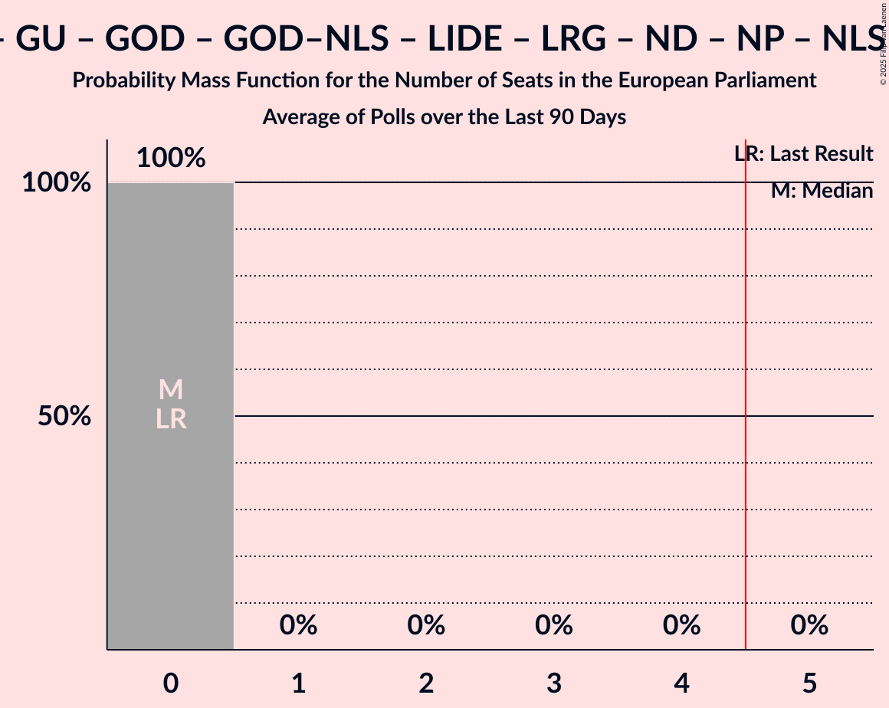

# Poll Average

<a href="#voting-intentions">Voting Intentions</a> | <a href="#seats">Seats</a> | <a href="#coalitions">Coalitions</a> | <a href="#technical-information">Technical Information</a>

## Summary

The table below lists the polls on which the average is based. They are the most recent polls (less than 90 days old) registered and analyzed so far.

| Period     | Polling firm/Commissioner(s) | Levica | PSS | VESNA | SD | DeSUS | DL | GS | K | LMŠ | SMC | SAB | ZS | Demokrati | NSi | PoS | SDS–SLS | SDS | SLS | SNS | Res | DD | GU | GOD | GOD–NLS | LIDE | LRG | ND | NP | NLS | PS |
|:----------:|:----------------------------:|:--:|:--:|:--:|:--:|:--:|:--:|:--:|:--:|:--:|:--:|:--:|:--:|:--:|:--:|:--:|:--:|:--:|:--:|:--:|:--:|:--:|:--:|:--:|:--:|:--:|:--:|:--:|:--:|:--:|:--:|
| 9 June 2024 | General Election | 0.0%   0 | 0.0%   0 | 0.0%   0 | 0.0%   0 | 0.0%   0 | 0.0%   0 | 0.0%   0 | 0.0%   0 | 0.0%   0 | 0.0%   0 | 0.0%   0 | 0.0%   0 | 0.0%   0 | 0.0%   0 | 0.0%   0 | 0.0%   0 | 0.0%   0 | 0.0%   0 | 0.0%   0 | 0.0%   0 | 0.0%   0 | 0.0%   0 | 0.0%   0 | 0.0%   0 | 0.0%   0 | 0.0%   0 | 0.0%   0 | 0.0%   0 | 0.0%   0 | 0.0%   0 |
| N/A | Poll Average | 4–9%   0–1 | 1–5%   0 | 2–5%   0 | 5–12%   0–1 | N/A   N/A | N/A   N/A | 15–29%   2–4 | N/A   N/A | N/A   N/A | N/A   N/A | N/A   N/A | 1–2%   0 | 4–12%   0–1 | 4–9%   0–1 | N/A   N/A | N/A   N/A | 25–36%   3–5 | 1–5%   0 | 2–5%   0 | 4–9%   0–1 | N/A   N/A | 1–5%   0 | N/A   N/A | N/A   N/A | N/A   N/A | N/A   N/A | N/A   N/A | N/A   N/A | N/A   N/A | N/A   N/A |
| [27–30 June 2025](2025-06-30-Valicon.html) | Valicon   TSmedia | 4–6%   0–1 | 3–5%   0 | 4–6%   0 | 9–12%   1 | N/A   N/A | N/A   N/A | 17–21%   2–3 | N/A   N/A | N/A   N/A | N/A   N/A | N/A   N/A | 1–3%   0 | 5–7%   0–1 | 4–6%   0 | N/A   N/A | N/A   N/A | 25–29%   4 | 1–3%   0 | 3–5%   0 | 7–10%   1 | N/A   N/A | 1–3%   0 | N/A   N/A | N/A   N/A | N/A   N/A | N/A   N/A | N/A   N/A | N/A   N/A | N/A   N/A | N/A   N/A |
| [9–11 June 2025](2025-06-11-Ninamedia.html) | Ninamedia   Dnevnik | 5–9%   0–1 | N/A   N/A | 2–5%   0 | 7–12%   0–1 | N/A   N/A | N/A   N/A | 20–27%   2–3 | N/A   N/A | N/A   N/A | N/A   N/A | N/A   N/A | N/A   N/A | 8–13%   1 | 5–9%   0–1 | N/A   N/A | N/A   N/A | 29–36%   3–4 | 1–3%   0 | N/A   N/A | N/A   N/A | N/A   N/A | N/A   N/A | N/A   N/A | N/A   N/A | N/A   N/A | N/A   N/A | N/A   N/A | N/A   N/A | N/A   N/A | N/A   N/A |
| [2–5 June 2025](2025-06-05-Mediana.html) | Mediana   Delo | 5–9%   0–1 | 2–5%   0 | 2–4%   0 | 5–10%   0–1 | N/A   N/A | N/A   N/A | 22–30%   3–4 | N/A   N/A | N/A   N/A | N/A   N/A | N/A   N/A | N/A   N/A | 4–8%   0–1 | 4–9%   0–1 | N/A   N/A | N/A   N/A | 27–35%   3–5 | 1–4%   0 | 2–5%   0 | 4–8%   0–1 | N/A   N/A | N/A   N/A | N/A   N/A | N/A   N/A | N/A   N/A | N/A   N/A | N/A   N/A | N/A   N/A | N/A   N/A | N/A   N/A |
| [7–10 April 2025](2025-04-10-ParsifalSC.html) | Parsifal SC   Nova24TV | 5–10%   0–1 | 1–2%   0 | 2–4%   0 | 4–8%   0–1 | N/A   N/A | N/A   N/A | 14–21%   2–3 | N/A   N/A | N/A   N/A | N/A   N/A | N/A   N/A | N/A   N/A | 8–13%   1 | 5–9%   0–1 | N/A   N/A | N/A   N/A | 28–35%   3–5 | 3–6%   0 | N/A   N/A | 3–7%   0–1 | N/A   N/A | 2–5%   0 | N/A   N/A | N/A   N/A | N/A   N/A | N/A   N/A | N/A   N/A | N/A   N/A | N/A   N/A | N/A   N/A |
| 9 June 2024 | General Election | 0.0%   0 | 0.0%   0 | 0.0%   0 | 0.0%   0 | 0.0%   0 | 0.0%   0 | 0.0%   0 | 0.0%   0 | 0.0%   0 | 0.0%   0 | 0.0%   0 | 0.0%   0 | 0.0%   0 | 0.0%   0 | 0.0%   0 | 0.0%   0 | 0.0%   0 | 0.0%   0 | 0.0%   0 | 0.0%   0 | 0.0%   0 | 0.0%   0 | 0.0%   0 | 0.0%   0 | 0.0%   0 | 0.0%   0 | 0.0%   0 | 0.0%   0 | 0.0%   0 | 0.0%   0 |

Only polls for which at least the sample size has been published are included in the table above.

**Legend:**
+ **Top half of each row:** Voting intentions (95% confidence interval)
+ **Bottom half of each row:** Seat projections for the European Parliament (95% confidence interval)
+ **Levica:** Levica (GUE/NGL)
+ **PSS:** Piratska stranka Slovenije (Greens/EFA)
+ **VESNA:** VESNA–Zelena stranka (Greens/EFA)
+ **SD:** Socialni demokrati (S&D)
+ **DeSUS:** Demokratična stranka upokojencev Slovenije (RE)
+ **DL:** Državljanska lista (RE)
+ **GS:** Gibanje Svoboda (RE)
+ **K:** Konkretno (RE)
+ **LMŠ:** Lista Marjana Šarca (RE)
+ **SMC:** Stranka modernega centra (RE)
+ **SAB:** Stranka Alenke Bratušek (RE)
+ **ZS:** Zeleni Slovenije (RE)
+ **Demokrati:** Demokrati (EPP)
+ **NSi:** Nova Slovenija–Krščanski demokrati (EPP)
+ **PoS:** Povežimo Slovenijo (EPP)
+ **SDS–SLS:** Slovenska demokratska stranka–Slovenska ljudska stranka (EPP)
+ **SDS:** Slovenska demokratska stranka (EPP)
+ **SLS:** Slovenska ljudska stranka (EPP)
+ **SNS:** Slovenska nacionalna stranka (PfE)
+ **Res:** Resni.ca (NI)
+ **DD:** Dobra država (*)
+ **GU:** Glas upokojencev (*)
+ **GOD:** Glas za otroke in družine (*)
+ **GOD–NLS:** Glas za otroke in družine–Nova ljudska stranka Slovenije (*)
+ **LIDE:** Liberalni demokrati (*)
+ **LRG:** Lista Roberta Goloba (*)
+ **ND:** Naša dežela (*)
+ **NP:** Naša prihodnost (*)
+ **NLS:** Nova ljudska stranka Slovenije (*)
+ **PS:** Pozitivna Slovenija (*)
+ **N/A (single party):** Party not included the published results
+ **N/A (entire row):** Calculation for this opinion poll not started yet

## Voting Intentions

### Confidence Intervals

| Party | Last Result | Median | 80% Confidence Interval | 90% Confidence Interval | 95% Confidence Interval | 99% Confidence Interval |
|:-----:|:-----------:|:------:|:-----------------------:|:-----------------------:|:-----------------------:|:-----------------------:|
| <a href="#levica-(gue/ngl)">Levica (GUE/NGL)</a> | 0.0% | 6.6% | 4.9–8.3% |4.7–8.8% | 4.4–9.3% | 4.0–10.1% |
| <a href="#piratska-stranka-slovenije-(greens/efa)">Piratska stranka Slovenije (Greens/EFA)</a> | 0.0% | 2.9% | 1.1–4.6% |0.9–4.9% | 0.8–5.1% | 0.5–5.6% |
| <a href="#vesna–zelena-stranka-(greens/efa)">VESNA–Zelena stranka (Greens/EFA)</a> | 0.0% | 3.2% | 2.1–4.8% |1.9–5.1% | 1.7–5.4% | 1.4–5.8% |
| <a href="#socialni-demokrati-(s&d)">Socialni demokrati (S&D)</a> | 0.0% | 8.3% | 5.6–10.7% |5.2–11.1% | 4.8–11.5% | 4.2–12.2% |
| <a href="#demokratična-stranka-upokojencev-slovenije-(re)">Demokratična stranka upokojencev Slovenije (RE)</a> | 0.0% | N/A | N/A |N/A | N/A | N/A |
| <a href="#državljanska-lista-(re)">Državljanska lista (RE)</a> | 0.0% | N/A | N/A |N/A | N/A | N/A |
| <a href="#gibanje-svoboda-(re)">Gibanje Svoboda (RE)</a> | 0.0% | 20.6% | 16.8–26.7% |16.0–27.8% | 15.4–28.6% | 14.2–30.2% |
| <a href="#konkretno-(re)">Konkretno (RE)</a> | 0.0% | N/A | N/A |N/A | N/A | N/A |
| <a href="#lista-marjana-šarca-(re)">Lista Marjana Šarca (RE)</a> | 0.0% | N/A | N/A |N/A | N/A | N/A |
| <a href="#stranka-modernega-centra-(re)">Stranka modernega centra (RE)</a> | 0.0% | N/A | N/A |N/A | N/A | N/A |
| <a href="#stranka-alenke-bratušek-(re)">Stranka Alenke Bratušek (RE)</a> | 0.0% | N/A | N/A |N/A | N/A | N/A |
| <a href="#zeleni-slovenije-(re)">Zeleni Slovenije (RE)</a> | 0.0% | 1.7% | 1.3–2.2% |1.2–2.4% | 1.1–2.5% | 1.0–2.8% |
| <a href="#demokrati-(epp)">Demokrati (EPP)</a> | 0.0% | 7.7% | 5.0–11.4% |4.5–12.0% | 4.2–12.5% | 3.5–13.5% |
| <a href="#nova-slovenija–krščanski-demokrati-(epp)">Nova Slovenija–Krščanski demokrati (EPP)</a> | 0.0% | 6.0% | 4.4–7.7% |4.1–8.2% | 3.8–8.6% | 3.5–9.5% |
| <a href="#povežimo-slovenijo-(epp)">Povežimo Slovenijo (EPP)</a> | 0.0% | N/A | N/A |N/A | N/A | N/A |
| <a href="#slovenska-demokratska-stranka–slovenska-ljudska-stranka-(epp)">Slovenska demokratska stranka–Slovenska ljudska stranka (EPP)</a> | 0.0% | N/A | N/A |N/A | N/A | N/A |
| <a href="#slovenska-demokratska-stranka-(epp)">Slovenska demokratska stranka (EPP)</a> | 0.0% | 30.7% | 26.5–34.0% |25.9–34.8% | 25.3–35.5% | 24.5–36.9% |
| <a href="#slovenska-ljudska-stranka-(epp)">Slovenska ljudska stranka (EPP)</a> | 0.0% | 2.1% | 1.2–4.2% |1.0–4.7% | 0.8–5.1% | 0.6–5.8% |
| <a href="#slovenska-nacionalna-stranka-(pfe)">Slovenska nacionalna stranka (PfE)</a> | 0.0% | 3.5% | 2.7–4.4% |2.5–4.8% | 2.3–5.1% | 1.9–5.8% |
| <a href="#resni.ca-(ni)">Resni.ca (NI)</a> | 0.0% | 6.2% | 4.3–8.6% |3.9–9.0% | 3.6–9.3% | 3.1–9.9% |
| <a href="#dobra-država-(*)">Dobra država (*)</a> | 0.0% | N/A | N/A |N/A | N/A | N/A |
| <a href="#glas-upokojencev-(*)">Glas upokojencev (*)</a> | 0.0% | 2.4% | 1.5–4.3% |1.3–4.7% | 1.2–5.0% | 1.0–5.7% |
| <a href="#glas-za-otroke-in-družine-(*)">Glas za otroke in družine (*)</a> | 0.0% | N/A | N/A |N/A | N/A | N/A |
| <a href="#glas-za-otroke-in-družine–nova-ljudska-stranka-slovenije-(*)">Glas za otroke in družine–Nova ljudska stranka Slovenije (*)</a> | 0.0% | N/A | N/A |N/A | N/A | N/A |
| <a href="#liberalni-demokrati-(*)">Liberalni demokrati (*)</a> | 0.0% | N/A | N/A |N/A | N/A | N/A |
| <a href="#lista-roberta-goloba-(*)">Lista Roberta Goloba (*)</a> | 0.0% | N/A | N/A |N/A | N/A | N/A |
| <a href="#naša-dežela-(*)">Naša dežela (*)</a> | 0.0% | N/A | N/A |N/A | N/A | N/A |
| <a href="#naša-prihodnost-(*)">Naša prihodnost (*)</a> | 0.0% | N/A | N/A |N/A | N/A | N/A |
| <a href="#nova-ljudska-stranka-slovenije-(*)">Nova ljudska stranka Slovenije (*)</a> | 0.0% | N/A | N/A |N/A | N/A | N/A |
| <a href="#pozitivna-slovenija-(*)">Pozitivna Slovenija (*)</a> | 0.0% | N/A | N/A |N/A | N/A | N/A |

### Demokrati (EPP)

*For a full overview of the results for this party, see the [Demokrati (EPP)](party-demokratiepp.html) page.*

| Voting Intentions | Probability | Accumulated | Special Marks |
|:-----------------:|:-----------:|:-----------:|:-------------:|
| 0.0–0.5% | 0% | 100% | Last Result |
| 0.5–1.5% | 0% | 100% |  |
| 1.5–2.5% | 0% | 100% |  |
| 2.5–3.5% | 0.5% | 100% |  |
| 3.5–4.5% | 5% | 99.5% |  |
| 4.5–5.5% | 15% | 95% |  |
| 5.5–6.5% | 21% | 80% |  |
| 6.5–7.5% | 8% | 59% |  |
| 7.5–8.5% | 4% | 50% | Median |
| 8.5–9.5% | 10% | 46% |  |
| 9.5–10.5% | 15% | 36% |  |
| 10.5–11.5% | 12% | 21% |  |
| 11.5–12.5% | 6% | 8% |  |
| 12.5–13.5% | 2% | 2% |  |
| 13.5–14.5% | 0.4% | 0.5% |  |
| 14.5–15.5% | 0.1% | 0.1% |  |
| 15.5–16.5% | 0% | 0% |  |

### Nova Slovenija–Krščanski demokrati (EPP)

*For a full overview of the results for this party, see the [Nova Slovenija–Krščanski demokrati (EPP)](party-novaslovenija–krščanskidemokratiepp.html) page.*

| Voting Intentions | Probability | Accumulated | Special Marks |
|:-----------------:|:-----------:|:-----------:|:-------------:|
| 0.0–0.5% | 0% | 100% | Last Result |
| 0.5–1.5% | 0% | 100% |  |
| 1.5–2.5% | 0% | 100% |  |
| 2.5–3.5% | 0.8% | 100% |  |
| 3.5–4.5% | 14% | 99.2% |  |
| 4.5–5.5% | 23% | 86% |  |
| 5.5–6.5% | 27% | 63% | Median |
| 6.5–7.5% | 23% | 35% |  |
| 7.5–8.5% | 10% | 13% |  |
| 8.5–9.5% | 2% | 3% |  |
| 9.5–10.5% | 0.4% | 0.4% |  |
| 10.5–11.5% | 0% | 0% |  |

### Slovenska nacionalna stranka (PfE)

*For a full overview of the results for this party, see the [Slovenska nacionalna stranka (PfE)](party-slovenskanacionalnastrankapfe.html) page.*

| Voting Intentions | Probability | Accumulated | Special Marks |
|:-----------------:|:-----------:|:-----------:|:-------------:|
| 0.0–0.5% | 0% | 100% | Last Result |
| 0.5–1.5% | 0.1% | 100% |  |
| 1.5–2.5% | 6% | 99.9% |  |
| 2.5–3.5% | 49% | 94% | Median |
| 3.5–4.5% | 38% | 45% |  |
| 4.5–5.5% | 7% | 7% |  |
| 5.5–6.5% | 0.8% | 0.9% |  |
| 6.5–7.5% | 0.1% | 0.1% |  |
| 7.5–8.5% | 0% | 0% |  |

### Gibanje Svoboda (RE)

*For a full overview of the results for this party, see the [Gibanje Svoboda (RE)](party-gibanjesvobodare.html) page.*

| Voting Intentions | Probability | Accumulated | Special Marks |
|:-----------------:|:-----------:|:-----------:|:-------------:|
| 0.0–0.5% | 0% | 100% | Last Result |
| 0.5–1.5% | 0% | 100% |  |
| 1.5–2.5% | 0% | 100% |  |
| 2.5–3.5% | 0% | 100% |  |
| 3.5–4.5% | 0% | 100% |  |
| 4.5–5.5% | 0% | 100% |  |
| 5.5–6.5% | 0% | 100% |  |
| 6.5–7.5% | 0% | 100% |  |
| 7.5–8.5% | 0% | 100% |  |
| 8.5–9.5% | 0% | 100% |  |
| 9.5–10.5% | 0% | 100% |  |
| 10.5–11.5% | 0% | 100% |  |
| 11.5–12.5% | 0% | 100% |  |
| 12.5–13.5% | 0.1% | 100% |  |
| 13.5–14.5% | 0.7% | 99.9% |  |
| 14.5–15.5% | 2% | 99.2% |  |
| 15.5–16.5% | 5% | 97% |  |
| 16.5–17.5% | 10% | 92% |  |
| 17.5–18.5% | 14% | 82% |  |
| 18.5–19.5% | 12% | 68% |  |
| 19.5–20.5% | 6% | 56% |  |
| 20.5–21.5% | 4% | 50% | Median |
| 21.5–22.5% | 5% | 46% |  |
| 22.5–23.5% | 7% | 41% |  |
| 23.5–24.5% | 8% | 34% |  |
| 24.5–25.5% | 8% | 26% |  |
| 25.5–26.5% | 7% | 18% |  |
| 26.5–27.5% | 5% | 11% |  |
| 27.5–28.5% | 3% | 6% |  |
| 28.5–29.5% | 2% | 3% |  |
| 29.5–30.5% | 0.7% | 1.0% |  |
| 30.5–31.5% | 0.2% | 0.3% |  |
| 31.5–32.5% | 0.1% | 0.1% |  |
| 32.5–33.5% | 0% | 0% |  |

### Levica (GUE/NGL)

*For a full overview of the results for this party, see the [Levica (GUE/NGL)](party-levicaguengl.html) page.*

| Voting Intentions | Probability | Accumulated | Special Marks |
|:-----------------:|:-----------:|:-----------:|:-------------:|
| 0.0–0.5% | 0% | 100% | Last Result |
| 0.5–1.5% | 0% | 100% |  |
| 1.5–2.5% | 0% | 100% |  |
| 2.5–3.5% | 0% | 100% |  |
| 3.5–4.5% | 4% | 100% |  |
| 4.5–5.5% | 20% | 96% |  |
| 5.5–6.5% | 26% | 76% |  |
| 6.5–7.5% | 26% | 50% | Median |
| 7.5–8.5% | 17% | 24% |  |
| 8.5–9.5% | 6% | 8% |  |
| 9.5–10.5% | 1.3% | 2% |  |
| 10.5–11.5% | 0.2% | 0.2% |  |
| 11.5–12.5% | 0% | 0% |  |

### Glas upokojencev (*)

*For a full overview of the results for this party, see the [Glas upokojencev (*)](party-glasupokojencev.html) page.*

| Voting Intentions | Probability | Accumulated | Special Marks |
|:-----------------:|:-----------:|:-----------:|:-------------:|
| 0.0–0.5% | 0% | 100% | Last Result |
| 0.5–1.5% | 14% | 100% |  |
| 1.5–2.5% | 38% | 86% | Median |
| 2.5–3.5% | 22% | 48% |  |
| 3.5–4.5% | 20% | 26% |  |
| 4.5–5.5% | 6% | 6% |  |
| 5.5–6.5% | 0.7% | 0.7% |  |
| 6.5–7.5% | 0% | 0% |  |
| 7.5–8.5% | 0% | 0% |  |

### Piratska stranka Slovenije (Greens/EFA)

*For a full overview of the results for this party, see the [Piratska stranka Slovenije (Greens/EFA)](party-piratskastrankaslovenijegreensefa.html) page.*

| Voting Intentions | Probability | Accumulated | Special Marks |
|:-----------------:|:-----------:|:-----------:|:-------------:|
| 0.0–0.5% | 0.5% | 100% | Last Result |
| 0.5–1.5% | 22% | 99.5% |  |
| 1.5–2.5% | 20% | 77% |  |
| 2.5–3.5% | 20% | 58% | Median |
| 3.5–4.5% | 27% | 38% |  |
| 4.5–5.5% | 10% | 11% |  |
| 5.5–6.5% | 0.6% | 0.6% |  |
| 6.5–7.5% | 0% | 0% |  |

### Resni.ca (NI)

*For a full overview of the results for this party, see the [Resni.ca (NI)](party-resnicani.html) page.*

| Voting Intentions | Probability | Accumulated | Special Marks |
|:-----------------:|:-----------:|:-----------:|:-------------:|
| 0.0–0.5% | 0% | 100% | Last Result |
| 0.5–1.5% | 0% | 100% |  |
| 1.5–2.5% | 0% | 100% |  |
| 2.5–3.5% | 2% | 100% |  |
| 3.5–4.5% | 13% | 98% |  |
| 4.5–5.5% | 22% | 85% |  |
| 5.5–6.5% | 18% | 62% | Median |
| 6.5–7.5% | 14% | 44% |  |
| 7.5–8.5% | 19% | 30% |  |
| 8.5–9.5% | 9% | 11% |  |
| 9.5–10.5% | 1.2% | 1.3% |  |
| 10.5–11.5% | 0.1% | 0.1% |  |
| 11.5–12.5% | 0% | 0% |  |

### Slovenska demokratska stranka (EPP)

*For a full overview of the results for this party, see the [Slovenska demokratska stranka (EPP)](party-slovenskademokratskastrankaepp.html) page.*

| Voting Intentions | Probability | Accumulated | Special Marks |
|:-----------------:|:-----------:|:-----------:|:-------------:|
| 0.0–0.5% | 0% | 100% | Last Result |
| 0.5–1.5% | 0% | 100% |  |
| 1.5–2.5% | 0% | 100% |  |
| 2.5–3.5% | 0% | 100% |  |
| 3.5–4.5% | 0% | 100% |  |
| 4.5–5.5% | 0% | 100% |  |
| 5.5–6.5% | 0% | 100% |  |
| 6.5–7.5% | 0% | 100% |  |
| 7.5–8.5% | 0% | 100% |  |
| 8.5–9.5% | 0% | 100% |  |
| 9.5–10.5% | 0% | 100% |  |
| 10.5–11.5% | 0% | 100% |  |
| 11.5–12.5% | 0% | 100% |  |
| 12.5–13.5% | 0% | 100% |  |
| 13.5–14.5% | 0% | 100% |  |
| 14.5–15.5% | 0% | 100% |  |
| 15.5–16.5% | 0% | 100% |  |
| 16.5–17.5% | 0% | 100% |  |
| 17.5–18.5% | 0% | 100% |  |
| 18.5–19.5% | 0% | 100% |  |
| 19.5–20.5% | 0% | 100% |  |
| 20.5–21.5% | 0% | 100% |  |
| 21.5–22.5% | 0% | 100% |  |
| 22.5–23.5% | 0.1% | 100% |  |
| 23.5–24.5% | 0.6% | 99.9% |  |
| 24.5–25.5% | 3% | 99.4% |  |
| 25.5–26.5% | 7% | 97% |  |
| 26.5–27.5% | 9% | 90% |  |
| 27.5–28.5% | 8% | 81% |  |
| 28.5–29.5% | 9% | 72% |  |
| 29.5–30.5% | 11% | 64% |  |
| 30.5–31.5% | 14% | 53% | Median |
| 31.5–32.5% | 14% | 39% |  |
| 32.5–33.5% | 11% | 25% |  |
| 33.5–34.5% | 7% | 14% |  |
| 34.5–35.5% | 4% | 6% |  |
| 35.5–36.5% | 2% | 2% |  |
| 36.5–37.5% | 0.6% | 0.8% |  |
| 37.5–38.5% | 0.2% | 0.2% |  |
| 38.5–39.5% | 0% | 0% |  |
| 39.5–40.5% | 0% | 0% |  |

### Socialni demokrati (S&D)

*For a full overview of the results for this party, see the [Socialni demokrati (S&D)](party-socialnidemokratisd.html) page.*

| Voting Intentions | Probability | Accumulated | Special Marks |
|:-----------------:|:-----------:|:-----------:|:-------------:|
| 0.0–0.5% | 0% | 100% | Last Result |
| 0.5–1.5% | 0% | 100% |  |
| 1.5–2.5% | 0% | 100% |  |
| 2.5–3.5% | 0% | 100% |  |
| 3.5–4.5% | 1.4% | 100% |  |
| 4.5–5.5% | 8% | 98.6% |  |
| 5.5–6.5% | 15% | 91% |  |
| 6.5–7.5% | 16% | 76% |  |
| 7.5–8.5% | 15% | 60% | Median |
| 8.5–9.5% | 16% | 46% |  |
| 9.5–10.5% | 18% | 30% |  |
| 10.5–11.5% | 10% | 12% |  |
| 11.5–12.5% | 2% | 2% |  |
| 12.5–13.5% | 0.2% | 0.2% |  |
| 13.5–14.5% | 0% | 0% |  |

### VESNA–Zelena stranka (Greens/EFA)

*For a full overview of the results for this party, see the [VESNA–Zelena stranka (Greens/EFA)](party-vesna–zelenastrankagreensefa.html) page.*

| Voting Intentions | Probability | Accumulated | Special Marks |
|:-----------------:|:-----------:|:-----------:|:-------------:|
| 0.0–0.5% | 0% | 100% | Last Result |
| 0.5–1.5% | 1.2% | 100% |  |
| 1.5–2.5% | 23% | 98.8% |  |
| 2.5–3.5% | 36% | 76% | Median |
| 3.5–4.5% | 25% | 40% |  |
| 4.5–5.5% | 13% | 14% |  |
| 5.5–6.5% | 1.3% | 1.4% |  |
| 6.5–7.5% | 0% | 0% |  |

### Zeleni Slovenije (RE)

*For a full overview of the results for this party, see the [Zeleni Slovenije (RE)](party-zelenislovenijere.html) page.*

| Voting Intentions | Probability | Accumulated | Special Marks |
|:-----------------:|:-----------:|:-----------:|:-------------:|
| 0.0–0.5% | 0% | 100% | Last Result |
| 0.5–1.5% | 29% | 100% |  |
| 1.5–2.5% | 69% | 71% | Median |
| 2.5–3.5% | 2% | 2% |  |
| 3.5–4.5% | 0% | 0% |  |

### Slovenska ljudska stranka (EPP)

*For a full overview of the results for this party, see the [Slovenska ljudska stranka (EPP)](party-slovenskaljudskastrankaepp.html) page.*

| Voting Intentions | Probability | Accumulated | Special Marks |
|:-----------------:|:-----------:|:-----------:|:-------------:|
| 0.0–0.5% | 0.3% | 100% | Last Result |
| 0.5–1.5% | 22% | 99.7% |  |
| 1.5–2.5% | 44% | 78% | Median |
| 2.5–3.5% | 16% | 34% |  |
| 3.5–4.5% | 12% | 18% |  |
| 4.5–5.5% | 5% | 6% |  |
| 5.5–6.5% | 0.9% | 0.9% |  |
| 6.5–7.5% | 0.1% | 0.1% |  |
| 7.5–8.5% | 0% | 0% |  |

## Seats

### Confidence Intervals

| Party | Last Result | Median | 80% Confidence Interval | 90% Confidence Interval | 95% Confidence Interval | 99% Confidence Interval |
|:-----:|:-----------:|:------:|:-----------------------:|:-----------------------:|:-----------------------:|:-----------------------:|
| <a href="#levica-(gue/ngl)">Levica (GUE/NGL)</a> | 0 | 0 | 0–1 |0–1 | 0–1 | 0–1 |
| <a href="#piratska-stranka-slovenije-(greens/efa)">Piratska stranka Slovenije (Greens/EFA)</a> | 0 | 0 | 0 |0 | 0 | 0 |
| <a href="#vesna–zelena-stranka-(greens/efa)">VESNA–Zelena stranka (Greens/EFA)</a> | 0 | 0 | 0 |0 | 0 | 0 |
| <a href="#socialni-demokrati-(s&d)">Socialni demokrati (S&D)</a> | 0 | 1 | 0–1 |0–1 | 0–1 | 0–1 |
| <a href="#demokratična-stranka-upokojencev-slovenije-(re)">Demokratična stranka upokojencev Slovenije (RE)</a> | 0 | N/A | N/A |N/A | N/A | N/A |
| <a href="#državljanska-lista-(re)">Državljanska lista (RE)</a> | 0 | N/A | N/A |N/A | N/A | N/A |
| <a href="#gibanje-svoboda-(re)">Gibanje Svoboda (RE)</a> | 0 | 3 | 2–3 |2–4 | 2–4 | 2–4 |
| <a href="#konkretno-(re)">Konkretno (RE)</a> | 0 | N/A | N/A |N/A | N/A | N/A |
| <a href="#lista-marjana-šarca-(re)">Lista Marjana Šarca (RE)</a> | 0 | N/A | N/A |N/A | N/A | N/A |
| <a href="#stranka-modernega-centra-(re)">Stranka modernega centra (RE)</a> | 0 | N/A | N/A |N/A | N/A | N/A |
| <a href="#stranka-alenke-bratušek-(re)">Stranka Alenke Bratušek (RE)</a> | 0 | N/A | N/A |N/A | N/A | N/A |
| <a href="#zeleni-slovenije-(re)">Zeleni Slovenije (RE)</a> | 0 | 0 | 0 |0 | 0 | 0 |
| <a href="#demokrati-(epp)">Demokrati (EPP)</a> | 0 | 1 | 0–1 |0–1 | 0–1 | 0–2 |
| <a href="#nova-slovenija–krščanski-demokrati-(epp)">Nova Slovenija–Krščanski demokrati (EPP)</a> | 0 | 0 | 0–1 |0–1 | 0–1 | 0–1 |
| <a href="#povežimo-slovenijo-(epp)">Povežimo Slovenijo (EPP)</a> | 0 | N/A | N/A |N/A | N/A | N/A |
| <a href="#slovenska-demokratska-stranka–slovenska-ljudska-stranka-(epp)">Slovenska demokratska stranka–Slovenska ljudska stranka (EPP)</a> | 0 | N/A | N/A |N/A | N/A | N/A |
| <a href="#slovenska-demokratska-stranka-(epp)">Slovenska demokratska stranka (EPP)</a> | 0 | 4 | 4 |3–5 | 3–5 | 3–5 |
| <a href="#slovenska-ljudska-stranka-(epp)">Slovenska ljudska stranka (EPP)</a> | 0 | 0 | 0 |0 | 0 | 0 |
| <a href="#slovenska-nacionalna-stranka-(pfe)">Slovenska nacionalna stranka (PfE)</a> | 0 | 0 | 0 |0 | 0 | 0 |
| <a href="#resni.ca-(ni)">Resni.ca (NI)</a> | 0 | 0 | 0–1 |0–1 | 0–1 | 0–1 |
| <a href="#dobra-država-(*)">Dobra država (*)</a> | 0 | N/A | N/A |N/A | N/A | N/A |
| <a href="#glas-upokojencev-(*)">Glas upokojencev (*)</a> | 0 | 0 | 0 |0 | 0 | 0 |
| <a href="#glas-za-otroke-in-družine-(*)">Glas za otroke in družine (*)</a> | 0 | N/A | N/A |N/A | N/A | N/A |
| <a href="#glas-za-otroke-in-družine–nova-ljudska-stranka-slovenije-(*)">Glas za otroke in družine–Nova ljudska stranka Slovenije (*)</a> | 0 | N/A | N/A |N/A | N/A | N/A |
| <a href="#liberalni-demokrati-(*)">Liberalni demokrati (*)</a> | 0 | N/A | N/A |N/A | N/A | N/A |
| <a href="#lista-roberta-goloba-(*)">Lista Roberta Goloba (*)</a> | 0 | N/A | N/A |N/A | N/A | N/A |
| <a href="#naša-dežela-(*)">Naša dežela (*)</a> | 0 | N/A | N/A |N/A | N/A | N/A |
| <a href="#naša-prihodnost-(*)">Naša prihodnost (*)</a> | 0 | N/A | N/A |N/A | N/A | N/A |
| <a href="#nova-ljudska-stranka-slovenije-(*)">Nova ljudska stranka Slovenije (*)</a> | 0 | N/A | N/A |N/A | N/A | N/A |
| <a href="#pozitivna-slovenija-(*)">Pozitivna Slovenija (*)</a> | 0 | N/A | N/A |N/A | N/A | N/A |

### Levica (GUE/NGL)

*For a full overview of the results for this party, see the [Levica (GUE/NGL)](party-levicaguengl.html) page.*

| Number of Seats | Probability | Accumulated | Special Marks |
|:---------------:|:-----------:|:-----------:|:-------------:|
| 0 | 62% | 100% | Last Result, Median |
| 1 | 38% | 38% |  |
| 2 | 0% | 0% |  |

### Piratska stranka Slovenije (Greens/EFA)

*For a full overview of the results for this party, see the [Piratska stranka Slovenije (Greens/EFA)](party-piratskastrankaslovenijegreensefa.html) page.*

| Number of Seats | Probability | Accumulated | Special Marks |
|:---------------:|:-----------:|:-----------:|:-------------:|
| 0 | 100% | 100% | Last Result, Median |

### VESNA–Zelena stranka (Greens/EFA)

*For a full overview of the results for this party, see the [VESNA–Zelena stranka (Greens/EFA)](party-vesna–zelenastrankagreensefa.html) page.*

| Number of Seats | Probability | Accumulated | Special Marks |
|:---------------:|:-----------:|:-----------:|:-------------:|
| 0 | 100% | 100% | Last Result, Median |

### Socialni demokrati (S&D)

*For a full overview of the results for this party, see the [Socialni demokrati (S&D)](party-socialnidemokratisd.html) page.*

| Number of Seats | Probability | Accumulated | Special Marks |
|:---------------:|:-----------:|:-----------:|:-------------:|
| 0 | 30% | 100% | Last Result |
| 1 | 70% | 70% | Median |
| 2 | 0.2% | 0.2% |  |
| 3 | 0% | 0% |  |

### Demokratična stranka upokojencev Slovenije (RE)

*For a full overview of the results for this party, see the [Demokratična stranka upokojencev Slovenije (RE)](party-demokratičnastrankaupokojencevslovenijere.html) page.*

### Državljanska lista (RE)

*For a full overview of the results for this party, see the [Državljanska lista (RE)](party-državljanskalistare.html) page.*

### Gibanje Svoboda (RE)

*For a full overview of the results for this party, see the [Gibanje Svoboda (RE)](party-gibanjesvobodare.html) page.*

| Number of Seats | Probability | Accumulated | Special Marks |
|:---------------:|:-----------:|:-----------:|:-------------:|
| 0 | 0% | 100% | Last Result |
| 1 | 0.2% | 100% |  |
| 2 | 41% | 99.8% |  |
| 3 | 53% | 59% | Median |
| 4 | 6% | 6% |  |
| 5 | 0% | 0% | Majority |

### Konkretno (RE)

*For a full overview of the results for this party, see the [Konkretno (RE)](party-konkretnore.html) page.*

### Lista Marjana Šarca (RE)

*For a full overview of the results for this party, see the [Lista Marjana Šarca (RE)](party-listamarjanašarcare.html) page.*

### Stranka modernega centra (RE)

*For a full overview of the results for this party, see the [Stranka modernega centra (RE)](party-strankamodernegacentrare.html) page.*

### Stranka Alenke Bratušek (RE)

*For a full overview of the results for this party, see the [Stranka Alenke Bratušek (RE)](party-strankaalenkebratušekre.html) page.*

### Zeleni Slovenije (RE)

*For a full overview of the results for this party, see the [Zeleni Slovenije (RE)](party-zelenislovenijere.html) page.*

| Number of Seats | Probability | Accumulated | Special Marks |
|:---------------:|:-----------:|:-----------:|:-------------:|
| 0 | 100% | 100% | Last Result, Median |

### Demokrati (EPP)

*For a full overview of the results for this party, see the [Demokrati (EPP)](party-demokratiepp.html) page.*

| Number of Seats | Probability | Accumulated | Special Marks |
|:---------------:|:-----------:|:-----------:|:-------------:|
| 0 | 43% | 100% | Last Result |
| 1 | 56% | 57% | Median |
| 2 | 0.6% | 0.6% |  |
| 3 | 0% | 0% |  |

### Nova Slovenija–Krščanski demokrati (EPP)

*For a full overview of the results for this party, see the [Nova Slovenija–Krščanski demokrati (EPP)](party-novaslovenija–krščanskidemokratiepp.html) page.*

| Number of Seats | Probability | Accumulated | Special Marks |
|:---------------:|:-----------:|:-----------:|:-------------:|
| 0 | 78% | 100% | Last Result, Median |
| 1 | 22% | 22% |  |
| 2 | 0% | 0% |  |

### Povežimo Slovenijo (EPP)

*For a full overview of the results for this party, see the [Povežimo Slovenijo (EPP)](party-povežimoslovenijoepp.html) page.*

### Slovenska demokratska stranka–Slovenska ljudska stranka (EPP)

*For a full overview of the results for this party, see the [Slovenska demokratska stranka–Slovenska ljudska stranka (EPP)](party-slovenskademokratskastranka–slovenskaljudskastrankaepp.html) page.*

### Slovenska demokratska stranka (EPP)

*For a full overview of the results for this party, see the [Slovenska demokratska stranka (EPP)](party-slovenskademokratskastrankaepp.html) page.*

| Number of Seats | Probability | Accumulated | Special Marks |
|:---------------:|:-----------:|:-----------:|:-------------:|
| 0 | 0% | 100% | Last Result |
| 1 | 0% | 100% |  |
| 2 | 0% | 100% |  |
| 3 | 9% | 100% |  |
| 4 | 82% | 91% | Median |
| 5 | 9% | 9% | Majority |
| 6 | 0% | 0% |  |

### Slovenska ljudska stranka (EPP)

*For a full overview of the results for this party, see the [Slovenska ljudska stranka (EPP)](party-slovenskaljudskastrankaepp.html) page.*

| Number of Seats | Probability | Accumulated | Special Marks |
|:---------------:|:-----------:|:-----------:|:-------------:|
| 0 | 99.7% | 100% | Last Result, Median |
| 1 | 0.3% | 0.3% |  |
| 2 | 0% | 0% |  |

### Slovenska nacionalna stranka (PfE)

*For a full overview of the results for this party, see the [Slovenska nacionalna stranka (PfE)](party-slovenskanacionalnastrankapfe.html) page.*

| Number of Seats | Probability | Accumulated | Special Marks |
|:---------------:|:-----------:|:-----------:|:-------------:|
| 0 | 100% | 100% | Last Result, Median |

### Resni.ca (NI)

*For a full overview of the results for this party, see the [Resni.ca (NI)](party-resnicani.html) page.*

| Number of Seats | Probability | Accumulated | Special Marks |
|:---------------:|:-----------:|:-----------:|:-------------:|
| 0 | 59% | 100% | Last Result, Median |
| 1 | 41% | 41% |  |
| 2 | 0% | 0% |  |

### Dobra država (*)

*For a full overview of the results for this party, see the [Dobra država (*)](party-dobradržava.html) page.*

### Glas upokojencev (*)

*For a full overview of the results for this party, see the [Glas upokojencev (*)](party-glasupokojencev.html) page.*

| Number of Seats | Probability | Accumulated | Special Marks |
|:---------------:|:-----------:|:-----------:|:-------------:|
| 0 | 100% | 100% | Last Result, Median |

### Glas za otroke in družine (*)

*For a full overview of the results for this party, see the [Glas za otroke in družine (*)](party-glaszaotrokeindružine.html) page.*

### Glas za otroke in družine–Nova ljudska stranka Slovenije (*)

*For a full overview of the results for this party, see the [Glas za otroke in družine–Nova ljudska stranka Slovenije (*)](party-glaszaotrokeindružine–novaljudskastrankaslovenije.html) page.*

### Liberalni demokrati (*)

*For a full overview of the results for this party, see the [Liberalni demokrati (*)](party-liberalnidemokrati.html) page.*

### Lista Roberta Goloba (*)

*For a full overview of the results for this party, see the [Lista Roberta Goloba (*)](party-listarobertagoloba.html) page.*

### Naša dežela (*)

*For a full overview of the results for this party, see the [Naša dežela (*)](party-našadežela.html) page.*

### Naša prihodnost (*)

*For a full overview of the results for this party, see the [Naša prihodnost (*)](party-našaprihodnost.html) page.*

### Nova ljudska stranka Slovenije (*)

*For a full overview of the results for this party, see the [Nova ljudska stranka Slovenije (*)](party-novaljudskastrankaslovenije.html) page.*

### Pozitivna Slovenija (*)

*For a full overview of the results for this party, see the [Pozitivna Slovenija (*)](party-pozitivnaslovenija.html) page.*

## Coalitions

### Confidence Intervals

| Coalition | Last Result | Median | Majority? | 80% Confidence Interval | 90% Confidence Interval | 95% Confidence Interval | 99% Confidence Interval |
|:---------:|:-----------:|:------:|:---------:|:-----------------------:|:-----------------------:|:-----------------------:|:-----------------------:|
| Demokrati (EPP) – Nova Slovenija–Krščanski demokrati (EPP) – Povežimo Slovenijo (EPP) – Slovenska demokratska stranka (EPP) – Slovenska ljudska stranka (EPP) | 0 | 5 | 60% | 4–6 | 4–6 | 4–6 | 3–6 |
| Demokratična stranka upokojencev Slovenije (RE) – Državljanska lista (RE) – Gibanje Svoboda (RE) – Konkretno (RE) – Lista Marjana Šarca (RE) – Stranka Alenke Bratušek (RE) – Stranka modernega centra (RE) – Zeleni Slovenije (RE) | 0 | 3 | 0% | 2–3 | 2–4 | 2–4 | 2–4 |
| Levica (GUE/NGL) | 0 | 0 | 0% | 0–1 | 0–1 | 0–1 | 0–1 |
| Resni.ca (NI) | 0 | 0 | 0% | 0–1 | 0–1 | 0–1 | 0–1 |
| Socialni demokrati (S&D) | 0 | 1 | 0% | 0–1 | 0–1 | 0–1 | 0–1 |
| Dobra država (*) – Glas upokojencev (*) – Glas za otroke in družine (*) – Glas za otroke in družine–Nova ljudska stranka Slovenije (*) – Liberalni demokrati (*) – Lista Roberta Goloba (*) – Naša dežela (*) – Naša prihodnost (*) – Nova ljudska stranka Slovenije (*) – Pozitivna Slovenija (*) | 0 | 0 | 0% | 0 | 0 | 0 | 0 |
| Piratska stranka Slovenije (Greens/EFA) – VESNA–Zelena stranka (Greens/EFA) | 0 | 0 | 0% | 0 | 0 | 0 | 0 |
| Slovenska nacionalna stranka (PfE) | 0 | 0 | 0% | 0 | 0 | 0 | 0 |

### Demokrati (EPP) – Nova Slovenija–Krščanski demokrati (EPP) – Povežimo Slovenijo (EPP) – Slovenska demokratska stranka (EPP) – Slovenska ljudska stranka (EPP)

| Number of Seats | Probability | Accumulated | Special Marks |
|:---------------:|:-----------:|:-----------:|:-------------:|
| 0 | 0% | 100% | Last Result |
| 1 | 0% | 100% |  |
| 2 | 0% | 100% |  |
| 3 | 0.7% | 100% |  |
| 4 | 39% | 99.3% |  |
| 5 | 40% | 60% | Median, Majority |
| 6 | 20% | 20% |  |
| 7 | 0.4% | 0.4% |  |
| 8 | 0% | 0% |  |

### Demokratična stranka upokojencev Slovenije (RE) – Državljanska lista (RE) – Gibanje Svoboda (RE) – Konkretno (RE) – Lista Marjana Šarca (RE) – Stranka Alenke Bratušek (RE) – Stranka modernega centra (RE) – Zeleni Slovenije (RE)

| Number of Seats | Probability | Accumulated | Special Marks |
|:---------------:|:-----------:|:-----------:|:-------------:|
| 0 | 0% | 100% | Last Result |
| 1 | 0.2% | 100% |  |
| 2 | 41% | 99.8% |  |
| 3 | 53% | 59% | Median |
| 4 | 6% | 6% |  |
| 5 | 0% | 0% | Majority |

### Levica (GUE/NGL)

| Number of Seats | Probability | Accumulated | Special Marks |
|:---------------:|:-----------:|:-----------:|:-------------:|
| 0 | 62% | 100% | Last Result, Median |
| 1 | 38% | 38% |  |
| 2 | 0% | 0% |  |

### Resni.ca (NI)

| Number of Seats | Probability | Accumulated | Special Marks |
|:---------------:|:-----------:|:-----------:|:-------------:|
| 0 | 70% | 100% | Last Result, Median |
| 1 | 30% | 30% |  |
| 2 | 0% | 0% |  |

### Socialni demokrati (S&D)

| Number of Seats | Probability | Accumulated | Special Marks |
|:---------------:|:-----------:|:-----------:|:-------------:|
| 0 | 30% | 100% | Last Result |
| 1 | 70% | 70% | Median |
| 2 | 0.2% | 0.2% |  |
| 3 | 0% | 0% |  |

### Dobra država (*) – Glas upokojencev (*) – Glas za otroke in družine (*) – Glas za otroke in družine–Nova ljudska stranka Slovenije (*) – Liberalni demokrati (*) – Lista Roberta Goloba (*) – Naša dežela (*) – Naša prihodnost (*) – Nova ljudska stranka Slovenije (*) – Pozitivna Slovenija (*)

| Number of Seats | Probability | Accumulated | Special Marks |
|:---------------:|:-----------:|:-----------:|:-------------:|
| 0 | 100% | 100% | Last Result, Median |

### Piratska stranka Slovenije (Greens/EFA) – VESNA–Zelena stranka (Greens/EFA)

| Number of Seats | Probability | Accumulated | Special Marks |
|:---------------:|:-----------:|:-----------:|:-------------:|
| 0 | 100% | 100% | Last Result, Median |

### Slovenska nacionalna stranka (PfE)

| Number of Seats | Probability | Accumulated | Special Marks |
|:---------------:|:-----------:|:-----------:|:-------------:|
| 0 | 100% | 100% | Last Result, Median |

## Technical Information

+ **Number of polls included in this average:** 4
+ **Lowest number of simulations done in a poll included in this average:** 2,097,152
+ **Total number of simulations done in the polls included in this average:** 8,388,608
+ **Error estimate:** 2.71%
