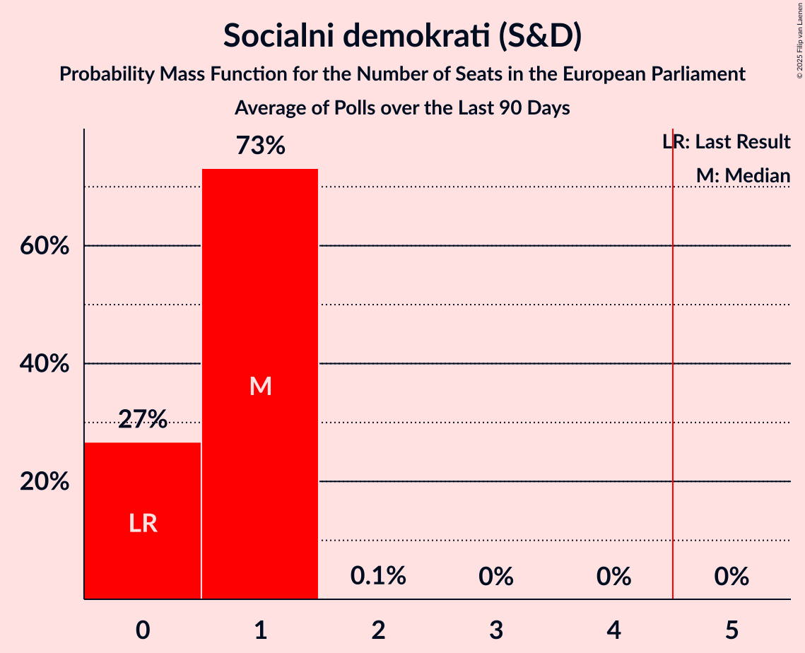

# Poll Average

<a href="#voting-intentions">Voting Intentions</a> | <a href="#seats">Seats</a> | <a href="#coalitions">Coalitions</a> | <a href="#technical-information">Technical Information</a>

## Summary

The table below lists the polls on which the average is based. They are the most recent polls (less than 90 days old) registered and analyzed so far.

| Period     | Polling firm/Commissioner(s) | SDS | NSi | SLS | DeSUS | SD | PS | Levica | SNS | DL | GOD | GOD–NLS | LMŠ | NLS | SMC | PAB |
|:----------:|:----------------------------:|:--:|:--:|:--:|:--:|:--:|:--:|:--:|:--:|:--:|:--:|:--:|:--:|:--:|:--:|:--:|
| 25 May 2014 | General Election | 24.8%   3 | 16.5%   1 | 16.5%   1 | 8.2%   1 | 8.1%   1 | 6.6%   0 | 5.5%   0 | 4.0%   0 | 1.1%   0 | 0.0%   0 | 0.0%   0 | 0.0%   0 | 0.0%   0 | 0.0%   0 | 0.0%   0 |
| N/A | Poll Average | 16–34%   2–4 | 3–9%   0–1 | 2–4%   0 | 1–6%   0 | 8–18%   1–2 | N/A   N/A | 7–12%   0–1 | 2–6%   0 | N/A   N/A | N/A   N/A | 0–1%   0 | 11–21%   1–2 | N/A   N/A | 5–12%   0–1 | 2–8%   0–1 |
| [12–14 June 2018](2018-06-14-Ninamedia.html) | Ninamedia   Dnevnik and RTV Slovenija | 26–33%   3–4 | 2–6%   0 | N/A   N/A | 2–6%   0 | 8–13%   1 | N/A   N/A | 8–13%   1 | 3–6%   0 | N/A   N/A | N/A   N/A | N/A   N/A | 11–16%   1–2 | N/A   N/A | 8–13%   1 | 3–6%   0 |
| [5–6 June 2018](2018-06-06-ParsifalSC.html) | Parsifal SC   Nova24TV | 27–35%   3–4 | 4–8%   0–1 | N/A   N/A | 1–3%   0 | 9–15%   1–2 | N/A   N/A | 8–13%   1 | 3–7%   0 | N/A   N/A | N/A   N/A | N/A   N/A | 14–20%   1–2 | N/A   N/A | 6–10%   0–1 | 3–7%   0 |
| [28–31 May 2018](2018-05-31-Valicon.html) | Valicon | 16–19%   2 | 6–8%   0–1 | 2–4%   0 | 4–6%   0 | 12–15%   1–2 | N/A   N/A | 8–10%   1 | 3–5%   0 | N/A   N/A | N/A   N/A | 0–1%   0 | 11–14%   1 | N/A   N/A | 7–9%   0–1 | 4–5%   0 |
| [31 May 2018](2018-05-31-Mediana.html) | Mediana   POP TV | 24–30%   3–4 | 5–8%   0–1 | 2–4%   0 | 4–7%   0 | 7–11%   0–1 | N/A   N/A | 7–11%   1 | 3–6%   0 | N/A   N/A | N/A   N/A | N/A   N/A | 11–15%   1–2 | N/A   N/A | 7–11%   0–1 | 5–8%   0–1 |
| [22 May 2018](2018-05-22-Episcenter.html) | Episcenter | 23–29%   2–3 | 6–10%   0–1 | 2–4%   0 | 4–7%   0 | 14–19%   1–2 | N/A   N/A | 7–11%   0–1 | 1–3%   0 | N/A   N/A | N/A   N/A | N/A   N/A | 12–17%   1–2 | N/A   N/A | 4–8%   0 | 2–4%   0 |
| [2–5 May 2018](2018-05-05-DeloStik.html) | Delo Stik   Delo | 19–25%   2–3 | 6–9%   0–1 | 2–4%   0 | 3–6%   0 | 11–16%   1–2 | N/A   N/A | 6–10%   0–1 | 2–4%   0 | N/A   N/A | N/A   N/A | 0–1%   0 | 17–22%   2–3 | N/A   N/A | 5–8%   0–1 | 3–5%   0 |
| 25 May 2014 | General Election | 24.8%   3 | 16.5%   1 | 16.5%   1 | 8.2%   1 | 8.1%   1 | 6.6%   0 | 5.5%   0 | 4.0%   0 | 1.1%   0 | 0.0%   0 | 0.0%   0 | 0.0%   0 | 0.0%   0 | 0.0%   0 | 0.0%   0 |

Only polls for which at least the sample size has been published are included in the table above.

**Legend:**
+ **Top half of each row:** Voting intentions (95% confidence interval)
+ **Bottom half of each row:** Seat projections for the European Parliament (95% confidence interval)
+ **SDS:** Slovenska demokratska stranka (EPP)
+ **NSi:** Nova Slovenija–Krščanski demokrati (EPP)
+ **SLS:** Slovenska ljudska stranka (EPP)
+ **DeSUS:** Demokratična stranka upokojencev Slovenije (ALDE)
+ **SD:** Socialni demokrati (S&D)
+ **PS:** Pozitivna Slovenija (*)
+ **Levica:** Levica (GUE/NGL)
+ **SNS:** Slovenska nacionalna stranka (*)
+ **DL:** Državljanska lista (ALDE)
+ **GOD:** Glas za otroke in družine (*)
+ **GOD–NLS:** Glas za otroke in družine–Nova ljudska stranka Slovenije (*)
+ **LMŠ:** Lista Marjana Šarca (*)
+ **NLS:** Nova ljudska stranka Slovenije (*)
+ **SMC:** Stranka modernega centra (ALDE)
+ **PAB:** Stranka Alenke Bratušek (ALDE)
+ **N/A (single party):** Party not included the published results
+ **N/A (entire row):** Calculation for this opinion poll not started yet

## Voting Intentions

### Confidence Intervals

| Party | Last Result | Median | 80% Confidence Interval | 90% Confidence Interval | 95% Confidence Interval | 99% Confidence Interval |
|:-----:|:-----------:|:------:|:-----------------------:|:-----------------------:|:-----------------------:|:-----------------------:|
| <a href="#slovenska-demokratska-stranka-(epp)">Slovenska demokratska stranka (EPP)</a> | 24.8% | 26.3% | 17.6–31.4% |16.9–32.6% | 16.5–33.5% | 15.8–35.2% |
| <a href="#nova-slovenija–krščanski-demokrati-(epp)">Nova Slovenija–Krščanski demokrati (EPP)</a> | 16.5% | 6.8% | 3.9–8.4% |3.4–8.9% | 3.0–9.4% | 2.5–10.3% |
| <a href="#slovenska-ljudska-stranka-(epp)">Slovenska ljudska stranka (EPP)</a> | 16.5% | 2.9% | 2.3–3.6% |2.1–3.9% | 1.9–4.1% | 1.7–4.6% |
| <a href="#demokratična-stranka-upokojencev-slovenije-(alde)">Demokratična stranka upokojencev Slovenije (ALDE)</a> | 8.2% | 4.6% | 1.9–5.7% |1.4–6.0% | 1.2–6.3% | 0.8–7.0% |
| <a href="#socialni-demokrati-(s&d)">Socialni demokrati (S&D)</a> | 8.1% | 12.6% | 9.1–15.9% |8.5–16.8% | 8.1–17.6% | 7.4–18.8% |
| <a href="#pozitivna-slovenija-(*)">Pozitivna Slovenija (*)</a> | 6.6% | N/A | N/A |N/A | N/A | N/A |
| <a href="#levica-(gue/ngl)">Levica (GUE/NGL)</a> | 5.5% | 9.2% | 7.7–11.1% |7.3–11.8% | 7.0–12.4% | 6.4–13.4% |
| <a href="#slovenska-nacionalna-stranka-(*)">Slovenska nacionalna stranka (*)</a> | 4.0% | 3.8% | 2.1–5.2% |1.8–5.6% | 1.6–6.0% | 1.3–6.7% |
| <a href="#državljanska-lista-(alde)">Državljanska lista (ALDE)</a> | 1.1% | N/A | N/A |N/A | N/A | N/A |
| <a href="#glas-za-otroke-in-družine-(*)">Glas za otroke in družine (*)</a> | 0.0% | N/A | N/A |N/A | N/A | N/A |
| <a href="#glas-za-otroke-in-družine–nova-ljudska-stranka-slovenije-(*)">Glas za otroke in družine–Nova ljudska stranka Slovenije (*)</a> | 0.0% | 0.6% | 0.3–1.0% |0.3–1.1% | 0.3–1.3% | 0.2–1.6% |
| <a href="#lista-marjana-šarca-(*)">Lista Marjana Šarca (*)</a> | 0.0% | 14.3% | 11.9–19.3% |11.5–20.3% | 11.2–21.0% | 10.6–22.2% |
| <a href="#nova-ljudska-stranka-slovenije-(*)">Nova ljudska stranka Slovenije (*)</a> | 0.0% | N/A | N/A |N/A | N/A | N/A |
| <a href="#stranka-modernega-centra-(alde)">Stranka modernega centra (ALDE)</a> | 0.0% | 7.9% | 5.4–10.6% |5.0–11.5% | 4.7–12.1% | 4.2–13.3% |
| <a href="#stranka-alenke-bratušek-(alde)">Stranka Alenke Bratušek (ALDE)</a> | 0.0% | 4.4% | 2.9–6.5% |2.6–7.1% | 2.3–7.5% | 1.9–8.2% |

### Slovenska demokratska stranka (EPP)

*For a full overview of the results for this party, see the [Slovenska demokratska stranka (EPP)](party-slovenskademokratskastrankaepp.html) page.*

| Voting Intentions | Probability | Accumulated | Special Marks |
|:-----------------:|:-----------:|:-----------:|:-------------:|
| 13.5–14.5% | 0% | 100% |  |
| 14.5–15.5% | 0.3% | 100% |  |
| 15.5–16.5% | 3% | 99.7% |  |
| 16.5–17.5% | 7% | 97% |  |
| 17.5–18.5% | 5% | 90% |  |
| 18.5–19.5% | 2% | 85% |  |
| 19.5–20.5% | 2% | 83% |  |
| 20.5–21.5% | 4% | 81% |  |
| 21.5–22.5% | 5% | 77% |  |
| 22.5–23.5% | 4% | 72% |  |
| 23.5–24.5% | 5% | 67% |  |
| 24.5–25.5% | 6% | 62% | Last Result |
| 25.5–26.5% | 8% | 56% | Median |
| 26.5–27.5% | 9% | 48% |  |
| 27.5–28.5% | 9% | 39% |  |
| 28.5–29.5% | 8% | 30% |  |
| 29.5–30.5% | 7% | 22% |  |
| 30.5–31.5% | 6% | 15% |  |
| 31.5–32.5% | 4% | 9% |  |
| 32.5–33.5% | 3% | 5% |  |
| 33.5–34.5% | 1.4% | 2% |  |
| 34.5–35.5% | 0.6% | 1.0% |  |
| 35.5–36.5% | 0.2% | 0.3% |  |
| 36.5–37.5% | 0.1% | 0.1% |  |
| 37.5–38.5% | 0% | 0% |  |

### Nova Slovenija–Krščanski demokrati (EPP)

*For a full overview of the results for this party, see the [Nova Slovenija–Krščanski demokrati (EPP)](party-novaslovenija–krščanskidemokratiepp.html) page.*

| Voting Intentions | Probability | Accumulated | Special Marks |
|:-----------------:|:-----------:|:-----------:|:-------------:|
| 0.5–1.5% | 0% | 100% |  |
| 1.5–2.5% | 0.6% | 100% |  |
| 2.5–3.5% | 6% | 99.4% |  |
| 3.5–4.5% | 8% | 93% |  |
| 4.5–5.5% | 9% | 85% |  |
| 5.5–6.5% | 19% | 77% |  |
| 6.5–7.5% | 30% | 57% | Median |
| 7.5–8.5% | 18% | 27% |  |
| 8.5–9.5% | 7% | 8% |  |
| 9.5–10.5% | 2% | 2% |  |
| 10.5–11.5% | 0.3% | 0.3% |  |
| 11.5–12.5% | 0% | 0% |  |
| 12.5–13.5% | 0% | 0% |  |
| 13.5–14.5% | 0% | 0% |  |
| 14.5–15.5% | 0% | 0% |  |
| 15.5–16.5% | 0% | 0% |  |
| 16.5–17.5% | 0% | 0% | Last Result |

### Slovenska ljudska stranka (EPP)

*For a full overview of the results for this party, see the [Slovenska ljudska stranka (EPP)](party-slovenskaljudskastrankaepp.html) page.*

| Voting Intentions | Probability | Accumulated | Special Marks |
|:-----------------:|:-----------:|:-----------:|:-------------:|
| 0.0–0.5% | 0% | 100% |  |
| 0.5–1.5% | 0.2% | 100% |  |
| 1.5–2.5% | 24% | 99.8% |  |
| 2.5–3.5% | 64% | 76% | Median |
| 3.5–4.5% | 12% | 12% |  |
| 4.5–5.5% | 0.5% | 0.5% |  |
| 5.5–6.5% | 0% | 0% |  |
| 6.5–7.5% | 0% | 0% |  |
| 7.5–8.5% | 0% | 0% |  |
| 8.5–9.5% | 0% | 0% |  |
| 9.5–10.5% | 0% | 0% |  |
| 10.5–11.5% | 0% | 0% |  |
| 11.5–12.5% | 0% | 0% |  |
| 12.5–13.5% | 0% | 0% |  |
| 13.5–14.5% | 0% | 0% |  |
| 14.5–15.5% | 0% | 0% |  |
| 15.5–16.5% | 0% | 0% |  |
| 16.5–17.5% | 0% | 0% | Last Result |

### Demokratična stranka upokojencev Slovenije (ALDE)

*For a full overview of the results for this party, see the [Demokratična stranka upokojencev Slovenije (ALDE)](party-demokratičnastrankaupokojencevslovenijealde.html) page.*

| Voting Intentions | Probability | Accumulated | Special Marks |
|:-----------------:|:-----------:|:-----------:|:-------------:|
| 0.0–0.5% | 0% | 100% |  |
| 0.5–1.5% | 7% | 100% |  |
| 1.5–2.5% | 9% | 93% |  |
| 2.5–3.5% | 9% | 84% |  |
| 3.5–4.5% | 26% | 76% |  |
| 4.5–5.5% | 37% | 50% | Median |
| 5.5–6.5% | 12% | 13% |  |
| 6.5–7.5% | 1.4% | 2% |  |
| 7.5–8.5% | 0.1% | 0.1% | Last Result |
| 8.5–9.5% | 0% | 0% |  |

### Socialni demokrati (S&D)

*For a full overview of the results for this party, see the [Socialni demokrati (S&D)](party-socialnidemokratisd.html) page.*

| Voting Intentions | Probability | Accumulated | Special Marks |
|:-----------------:|:-----------:|:-----------:|:-------------:|
| 5.5–6.5% | 0% | 100% |  |
| 6.5–7.5% | 0.8% | 100% |  |
| 7.5–8.5% | 5% | 99.2% | Last Result |
| 8.5–9.5% | 9% | 94% |  |
| 9.5–10.5% | 10% | 85% |  |
| 10.5–11.5% | 10% | 75% |  |
| 11.5–12.5% | 14% | 64% |  |
| 12.5–13.5% | 19% | 51% | Median |
| 13.5–14.5% | 13% | 32% |  |
| 14.5–15.5% | 7% | 19% |  |
| 15.5–16.5% | 6% | 12% |  |
| 16.5–17.5% | 4% | 6% |  |
| 17.5–18.5% | 2% | 3% |  |
| 18.5–19.5% | 0.6% | 0.7% |  |
| 19.5–20.5% | 0.1% | 0.1% |  |
| 20.5–21.5% | 0% | 0% |  |

### Levica (GUE/NGL)

*For a full overview of the results for this party, see the [Levica (GUE/NGL)](party-levicaguengl.html) page.*

| Voting Intentions | Probability | Accumulated | Special Marks |
|:-----------------:|:-----------:|:-----------:|:-------------:|
| 4.5–5.5% | 0% | 100% | Last Result |
| 5.5–6.5% | 0.8% | 100% |  |
| 6.5–7.5% | 7% | 99.2% |  |
| 7.5–8.5% | 21% | 92% |  |
| 8.5–9.5% | 32% | 71% | Median |
| 9.5–10.5% | 21% | 39% |  |
| 10.5–11.5% | 11% | 17% |  |
| 11.5–12.5% | 5% | 7% |  |
| 12.5–13.5% | 2% | 2% |  |
| 13.5–14.5% | 0.3% | 0.4% |  |
| 14.5–15.5% | 0.1% | 0.1% |  |
| 15.5–16.5% | 0% | 0% |  |

### Slovenska nacionalna stranka (*)

*For a full overview of the results for this party, see the [Slovenska nacionalna stranka (*)](party-slovenskanacionalnastranka.html) page.*

| Voting Intentions | Probability | Accumulated | Special Marks |
|:-----------------:|:-----------:|:-----------:|:-------------:|
| 0.0–0.5% | 0% | 100% |  |
| 0.5–1.5% | 2% | 100% |  |
| 1.5–2.5% | 20% | 98% |  |
| 2.5–3.5% | 22% | 79% |  |
| 3.5–4.5% | 33% | 57% | Last Result, Median |
| 4.5–5.5% | 18% | 24% |  |
| 5.5–6.5% | 5% | 6% |  |
| 6.5–7.5% | 0.7% | 0.8% |  |
| 7.5–8.5% | 0.1% | 0.1% |  |
| 8.5–9.5% | 0% | 0% |  |

### Lista Marjana Šarca (*)

*For a full overview of the results for this party, see the [Lista Marjana Šarca (*)](party-listamarjanašarca.html) page.*

| Voting Intentions | Probability | Accumulated | Special Marks |
|:-----------------:|:-----------:|:-----------:|:-------------:|
| 0.0–0.5% | 0% | 100% | Last Result |
| 0.5–1.5% | 0% | 100% |  |
| 1.5–2.5% | 0% | 100% |  |
| 2.5–3.5% | 0% | 100% |  |
| 3.5–4.5% | 0% | 100% |  |
| 4.5–5.5% | 0% | 100% |  |
| 5.5–6.5% | 0% | 100% |  |
| 6.5–7.5% | 0% | 100% |  |
| 7.5–8.5% | 0% | 100% |  |
| 8.5–9.5% | 0% | 100% |  |
| 9.5–10.5% | 0.5% | 100% |  |
| 10.5–11.5% | 5% | 99.5% |  |
| 11.5–12.5% | 16% | 95% |  |
| 12.5–13.5% | 18% | 79% |  |
| 13.5–14.5% | 14% | 61% | Median |
| 14.5–15.5% | 11% | 47% |  |
| 15.5–16.5% | 8% | 36% |  |
| 16.5–17.5% | 6% | 27% |  |
| 17.5–18.5% | 6% | 21% |  |
| 18.5–19.5% | 6% | 15% |  |
| 19.5–20.5% | 5% | 9% |  |
| 20.5–21.5% | 3% | 4% |  |
| 21.5–22.5% | 1.0% | 1.2% |  |
| 22.5–23.5% | 0.2% | 0.3% |  |
| 23.5–24.5% | 0% | 0% |  |

### Stranka modernega centra (ALDE)

*For a full overview of the results for this party, see the [Stranka modernega centra (ALDE)](party-strankamodernegacentraalde.html) page.*

| Voting Intentions | Probability | Accumulated | Special Marks |
|:-----------------:|:-----------:|:-----------:|:-------------:|
| 0.0–0.5% | 0% | 100% | Last Result |
| 0.5–1.5% | 0% | 100% |  |
| 1.5–2.5% | 0% | 100% |  |
| 2.5–3.5% | 0% | 100% |  |
| 3.5–4.5% | 2% | 100% |  |
| 4.5–5.5% | 10% | 98% |  |
| 5.5–6.5% | 17% | 88% |  |
| 6.5–7.5% | 15% | 71% |  |
| 7.5–8.5% | 21% | 56% | Median |
| 8.5–9.5% | 16% | 35% |  |
| 9.5–10.5% | 9% | 19% |  |
| 10.5–11.5% | 6% | 10% |  |
| 11.5–12.5% | 3% | 5% |  |
| 12.5–13.5% | 1.1% | 1.5% |  |
| 13.5–14.5% | 0.3% | 0.3% |  |
| 14.5–15.5% | 0% | 0% |  |
| 15.5–16.5% | 0% | 0% |  |

### Stranka Alenke Bratušek (ALDE)

*For a full overview of the results for this party, see the [Stranka Alenke Bratušek (ALDE)](party-strankaalenkebratušekalde.html) page.*

| Voting Intentions | Probability | Accumulated | Special Marks |
|:-----------------:|:-----------:|:-----------:|:-------------:|
| 0.0–0.5% | 0% | 100% | Last Result |
| 0.5–1.5% | 0.1% | 100% |  |
| 1.5–2.5% | 5% | 99.9% |  |
| 2.5–3.5% | 17% | 95% |  |
| 3.5–4.5% | 33% | 78% | Median |
| 4.5–5.5% | 23% | 45% |  |
| 5.5–6.5% | 12% | 22% |  |
| 6.5–7.5% | 8% | 10% |  |
| 7.5–8.5% | 2% | 2% |  |
| 8.5–9.5% | 0.2% | 0.2% |  |
| 9.5–10.5% | 0% | 0% |  |

### Glas za otroke in družine–Nova ljudska stranka Slovenije (*)

*For a full overview of the results for this party, see the [Glas za otroke in družine–Nova ljudska stranka Slovenije (*)](party-glaszaotrokeindružine–novaljudskastrankaslovenije.html) page.*

| Voting Intentions | Probability | Accumulated | Special Marks |
|:-----------------:|:-----------:|:-----------:|:-------------:|
| 0.0–0.5% | 47% | 100% | Last Result |
| 0.5–1.5% | 52% | 53% | Median |
| 1.5–2.5% | 0.5% | 0.5% |  |
| 2.5–3.5% | 0% | 0% |  |

## Seats

### Confidence Intervals

| Party | Last Result | Median | 80% Confidence Interval | 90% Confidence Interval | 95% Confidence Interval | 99% Confidence Interval |
|:-----:|:-----------:|:------:|:-----------------------:|:-----------------------:|:-----------------------:|:-----------------------:|
| <a href="#slovenska-demokratska-stranka-(epp)">Slovenska demokratska stranka (EPP)</a> | 3 | 3 | 2–4 |2–4 | 2–4 | 2–4 |
| <a href="#nova-slovenija–krščanski-demokrati-(epp)">Nova Slovenija–Krščanski demokrati (EPP)</a> | 1 | 0 | 0–1 |0–1 | 0–1 | 0–1 |
| <a href="#slovenska-ljudska-stranka-(epp)">Slovenska ljudska stranka (EPP)</a> | 1 | 0 | 0 |0 | 0 | 0 |
| <a href="#demokratična-stranka-upokojencev-slovenije-(alde)">Demokratična stranka upokojencev Slovenije (ALDE)</a> | 1 | 0 | 0 |0 | 0 | 0 |
| <a href="#socialni-demokrati-(s&d)">Socialni demokrati (S&D)</a> | 1 | 1 | 1–2 |1–2 | 1–2 | 0–2 |
| <a href="#pozitivna-slovenija-(*)">Pozitivna Slovenija (*)</a> | 0 | N/A | N/A |N/A | N/A | N/A |
| <a href="#levica-(gue/ngl)">Levica (GUE/NGL)</a> | 0 | 1 | 1 |0–1 | 0–1 | 0–1 |
| <a href="#slovenska-nacionalna-stranka-(*)">Slovenska nacionalna stranka (*)</a> | 0 | 0 | 0 |0 | 0 | 0 |
| <a href="#državljanska-lista-(alde)">Državljanska lista (ALDE)</a> | 0 | N/A | N/A |N/A | N/A | N/A |
| <a href="#glas-za-otroke-in-družine-(*)">Glas za otroke in družine (*)</a> | 0 | N/A | N/A |N/A | N/A | N/A |
| <a href="#glas-za-otroke-in-družine–nova-ljudska-stranka-slovenije-(*)">Glas za otroke in družine–Nova ljudska stranka Slovenije (*)</a> | 0 | 0 | 0 |0 | 0 | 0 |
| <a href="#lista-marjana-šarca-(*)">Lista Marjana Šarca (*)</a> | 0 | 1 | 1–2 |1–2 | 1–2 | 1–3 |
| <a href="#nova-ljudska-stranka-slovenije-(*)">Nova ljudska stranka Slovenije (*)</a> | 0 | N/A | N/A |N/A | N/A | N/A |
| <a href="#stranka-modernega-centra-(alde)">Stranka modernega centra (ALDE)</a> | 0 | 1 | 0–1 |0–1 | 0–1 | 0–1 |
| <a href="#stranka-alenke-bratušek-(alde)">Stranka Alenke Bratušek (ALDE)</a> | 0 | 0 | 0 |0 | 0–1 | 0–1 |

### Slovenska demokratska stranka (EPP)

*For a full overview of the results for this party, see the [Slovenska demokratska stranka (EPP)](party-slovenskademokratskastrankaepp.html) page.*

| Number of Seats | Probability | Accumulated | Special Marks |
|:---------------:|:-----------:|:-----------:|:-------------:|
| 1 | 0.2% | 100% |  |
| 2 | 30% | 99.8% |  |
| 3 | 57% | 70% | Last Result, Median |
| 4 | 13% | 13% |  |
| 5 | 0% | 0% | Majority |

### Nova Slovenija–Krščanski demokrati (EPP)

*For a full overview of the results for this party, see the [Nova Slovenija–Krščanski demokrati (EPP)](party-novaslovenija–krščanskidemokratiepp.html) page.*

| Number of Seats | Probability | Accumulated | Special Marks |
|:---------------:|:-----------:|:-----------:|:-------------:|
| 0 | 75% | 100% | Median |
| 1 | 25% | 25% | Last Result |
| 2 | 0% | 0% |  |

### Slovenska ljudska stranka (EPP)

*For a full overview of the results for this party, see the [Slovenska ljudska stranka (EPP)](party-slovenskaljudskastrankaepp.html) page.*

| Number of Seats | Probability | Accumulated | Special Marks |
|:---------------:|:-----------:|:-----------:|:-------------:|
| 0 | 100% | 100% | Median |
| 1 | 0% | 0% | Last Result |

### Demokratična stranka upokojencev Slovenije (ALDE)

*For a full overview of the results for this party, see the [Demokratična stranka upokojencev Slovenije (ALDE)](party-demokratičnastrankaupokojencevslovenijealde.html) page.*

| Number of Seats | Probability | Accumulated | Special Marks |
|:---------------:|:-----------:|:-----------:|:-------------:|
| 0 | 99.9% | 100% | Median |
| 1 | 0.1% | 0.1% | Last Result |
| 2 | 0% | 0% |  |

### Socialni demokrati (S&D)

*For a full overview of the results for this party, see the [Socialni demokrati (S&D)](party-socialnidemokratisd.html) page.*

| Number of Seats | Probability | Accumulated | Special Marks |
|:---------------:|:-----------:|:-----------:|:-------------:|
| 0 | 0.8% | 100% |  |
| 1 | 82% | 99.2% | Last Result, Median |
| 2 | 17% | 17% |  |
| 3 | 0% | 0% |  |

### Levica (GUE/NGL)

*For a full overview of the results for this party, see the [Levica (GUE/NGL)](party-levicaguengl.html) page.*

| Number of Seats | Probability | Accumulated | Special Marks |
|:---------------:|:-----------:|:-----------:|:-------------:|
| 0 | 6% | 100% | Last Result |
| 1 | 94% | 94% | Median |
| 2 | 0% | 0% |  |

### Slovenska nacionalna stranka (*)

*For a full overview of the results for this party, see the [Slovenska nacionalna stranka (*)](party-slovenskanacionalnastranka.html) page.*

| Number of Seats | Probability | Accumulated | Special Marks |
|:---------------:|:-----------:|:-----------:|:-------------:|
| 0 | 99.9% | 100% | Last Result, Median |
| 1 | 0.1% | 0.1% |  |
| 2 | 0% | 0% |  |

### Lista Marjana Šarca (*)

*For a full overview of the results for this party, see the [Lista Marjana Šarca (*)](party-listamarjanašarca.html) page.*

| Number of Seats | Probability | Accumulated | Special Marks |
|:---------------:|:-----------:|:-----------:|:-------------:|
| 0 | 0% | 100% | Last Result |
| 1 | 66% | 100% | Median |
| 2 | 33% | 34% |  |
| 3 | 0.6% | 0.6% |  |
| 4 | 0% | 0% |  |

### Stranka modernega centra (ALDE)

*For a full overview of the results for this party, see the [Stranka modernega centra (ALDE)](party-strankamodernegacentraalde.html) page.*

| Number of Seats | Probability | Accumulated | Special Marks |
|:---------------:|:-----------:|:-----------:|:-------------:|
| 0 | 44% | 100% | Last Result |
| 1 | 56% | 56% | Median |
| 2 | 0% | 0% |  |

### Stranka Alenke Bratušek (ALDE)

*For a full overview of the results for this party, see the [Stranka Alenke Bratušek (ALDE)](party-strankaalenkebratušekalde.html) page.*

| Number of Seats | Probability | Accumulated | Special Marks |
|:---------------:|:-----------:|:-----------:|:-------------:|
| 0 | 97% | 100% | Last Result, Median |
| 1 | 3% | 3% |  |
| 2 | 0% | 0% |  |

### Glas za otroke in družine–Nova ljudska stranka Slovenije (*)

*For a full overview of the results for this party, see the [Glas za otroke in družine–Nova ljudska stranka Slovenije (*)](party-glaszaotrokeindružine–novaljudskastrankaslovenije.html) page.*

| Number of Seats | Probability | Accumulated | Special Marks |
|:---------------:|:-----------:|:-----------:|:-------------:|
| 0 | 100% | 100% | Last Result, Median |

## Coalitions

### Confidence Intervals

| Coalition | Last Result | Median | Majority? | 80% Confidence Interval | 90% Confidence Interval | 95% Confidence Interval | 99% Confidence Interval |
|:---------:|:-----------:|:------:|:---------:|:-----------------------:|:-----------------------:|:-----------------------:|:-----------------------:|
| Slovenska demokratska stranka (EPP) – Nova Slovenija–Krščanski demokrati (EPP) – Slovenska ljudska stranka (EPP) | 5 | 3 | 0.7% | 2–4 | 2–4 | 2–4 | 2–5 |
| Pozitivna Slovenija (*) – Slovenska nacionalna stranka (*) – Glas za otroke in družine (*) – Glas za otroke in družine–Nova ljudska stranka Slovenije (*) – Lista Marjana Šarca (*) – Nova ljudska stranka Slovenije (*) | 0 | 1 | 0% | 1–2 | 1–2 | 1–2 | 1–3 |
| Socialni demokrati (S&D) | 1 | 1 | 0% | 1–2 | 1–2 | 1–2 | 0–2 |
| Demokratična stranka upokojencev Slovenije (ALDE) – Državljanska lista (ALDE) – Stranka Alenke Bratušek (ALDE) – Stranka modernega centra (ALDE) | 1 | 1 | 0% | 0–1 | 0–1 | 0–2 | 0–2 |
| Levica (GUE/NGL) | 0 | 1 | 0% | 1 | 0–1 | 0–1 | 0–1 |

### Slovenska demokratska stranka (EPP) – Nova Slovenija–Krščanski demokrati (EPP) – Slovenska ljudska stranka (EPP)

| Number of Seats | Probability | Accumulated | Special Marks |
|:---------------:|:-----------:|:-----------:|:-------------:|
| 2 | 21% | 100% |  |
| 3 | 52% | 79% | Median |
| 4 | 27% | 27% |  |
| 5 | 0.7% | 0.7% | Last Result, Majority |
| 6 | 0% | 0% |  |

### Pozitivna Slovenija (*) – Slovenska nacionalna stranka (*) – Glas za otroke in družine (*) – Glas za otroke in družine–Nova ljudska stranka Slovenije (*) – Lista Marjana Šarca (*) – Nova ljudska stranka Slovenije (*)

| Number of Seats | Probability | Accumulated | Special Marks |
|:---------------:|:-----------:|:-----------:|:-------------:|
| 0 | 0% | 100% | Last Result |
| 1 | 66% | 100% | Median |
| 2 | 33% | 34% |  |
| 3 | 0.6% | 0.6% |  |
| 4 | 0% | 0% |  |

### Socialni demokrati (S&D)

| Number of Seats | Probability | Accumulated | Special Marks |
|:---------------:|:-----------:|:-----------:|:-------------:|
| 0 | 0.8% | 100% |  |
| 1 | 82% | 99.2% | Last Result, Median |
| 2 | 17% | 17% |  |
| 3 | 0% | 0% |  |

### Demokratična stranka upokojencev Slovenije (ALDE) – Državljanska lista (ALDE) – Stranka Alenke Bratušek (ALDE) – Stranka modernega centra (ALDE)

| Number of Seats | Probability | Accumulated | Special Marks |
|:---------------:|:-----------:|:-----------:|:-------------:|
| 0 | 44% | 100% |  |
| 1 | 53% | 56% | Last Result, Median |
| 2 | 3% | 3% |  |
| 3 | 0% | 0% |  |

### Levica (GUE/NGL)

| Number of Seats | Probability | Accumulated | Special Marks |
|:---------------:|:-----------:|:-----------:|:-------------:|
| 0 | 6% | 100% | Last Result |
| 1 | 94% | 94% | Median |
| 2 | 0% | 0% |  |

## Technical Information

