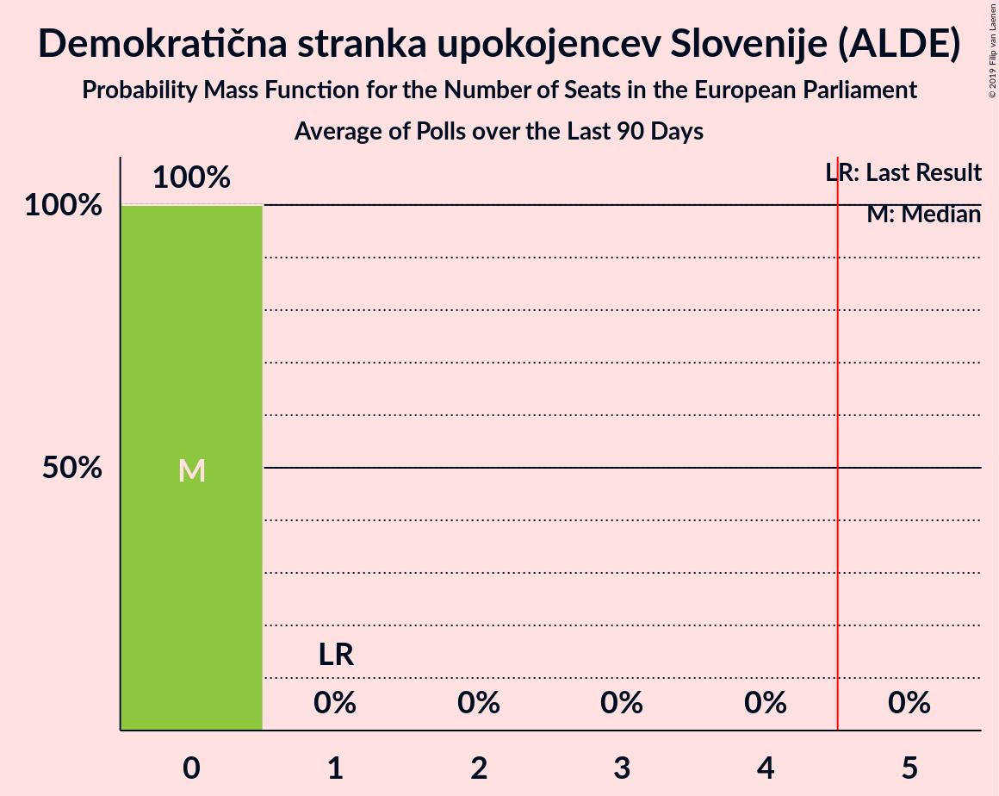
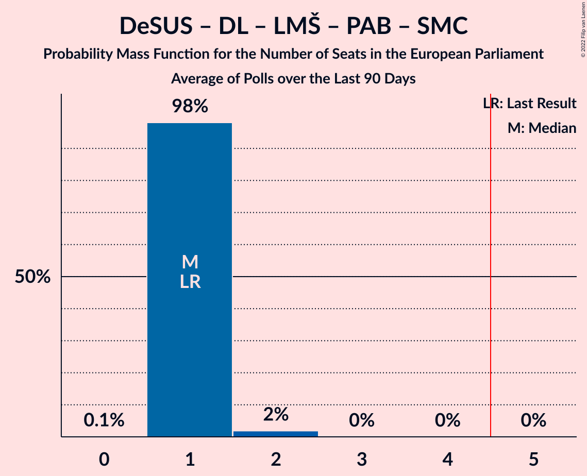

# Poll Average

<a href="#voting-intentions">Voting Intentions</a> | <a href="#seats">Seats</a> | <a href="#coalitions">Coalitions</a> | <a href="#technical-information">Technical Information</a>

## Summary

The table below lists the polls on which the average is based. They are the most recent polls (less than 90 days old) registered and analyzed so far.

| Period     | Polling firm/Commissioner(s) | SDS | NSi | SLS | DeSUS | SD | PS | Levica | SNS | DL | GOD | GOD–NLS | LMŠ | NLS | SMC | PAB |
|:----------:|:----------------------------:|:--:|:--:|:--:|:--:|:--:|:--:|:--:|:--:|:--:|:--:|:--:|:--:|:--:|:--:|:--:|
| 25 May 2014 | General Election | 24.8%   3 | 16.5%   1 | 16.5%   1 | 8.2%   1 | 8.1%   1 | 6.6%   0 | 5.5%   0 | 4.0%   0 | 1.1%   0 | 0.0%   0 | 0.0%   0 | 0.0%   0 | 0.0%   0 | 0.0%   0 | 0.0%   0 |
| N/A | Poll Average | 13–30%   1–4 | 4–9%   0–1 | 1–6%   0 | 3–9%   0–1 | 6–18%   0–2 | N/A   N/A | 5–12%   0–1 | 2–10%   0–1 | N/A   N/A | N/A   N/A | N/A   N/A | 14–44%   1–5 | N/A   N/A | 2–5%   0 | 3–6%   0 |
| [24 February 2019](2019-02-24-Mediana.html) | Mediana   POP TV | 19–27%   2–3 | 5–9%   1 | 3–6%   0 | 3–7%   0 | 6–10%   0–1 | N/A   N/A | 7–12%   1 | 2–5%   0 | N/A   N/A | N/A   N/A | N/A   N/A | 25–33%   3 | N/A   N/A | 2–5%   0 | 3–7%   0 |
| [12–14 February 2019](2019-02-14-Ninamedia.html) | Ninamedia   Dnevnik and RTV Slovenija | 12–19%   1–2 | 4–7%   0 | 2–5%   0 | 2–6%   0 | 9–15%   1 | N/A   N/A | 6–11%   0–1 | 2–5%   0 | N/A   N/A | N/A   N/A | N/A   N/A | 37–45%   4–6 | N/A   N/A | 2–6%   0 | 2–6%   0 |
| [4–7 December 2018](2018-12-07-ParsifalSC.html) | Parsifal SC | 25–31%   3–4 | 5–9%   0–1 | 1–3%   0 | 5–9%   0–1 | 14–19%   1–2 | N/A   N/A | 5–8%   0–1 | 6–10%   0–1 | N/A   N/A | N/A   N/A | N/A   N/A | 14–19%   1–2 | N/A   N/A | 2–4%   0 | 3–6%   0 |
| 25 May 2014 | General Election | 24.8%   3 | 16.5%   1 | 16.5%   1 | 8.2%   1 | 8.1%   1 | 6.6%   0 | 5.5%   0 | 4.0%   0 | 1.1%   0 | 0.0%   0 | 0.0%   0 | 0.0%   0 | 0.0%   0 | 0.0%   0 | 0.0%   0 |

Only polls for which at least the sample size has been published are included in the table above.

**Legend:**
+ **Top half of each row:** Voting intentions (95% confidence interval)
+ **Bottom half of each row:** Seat projections for the European Parliament (95% confidence interval)
+ **SDS:** Slovenska demokratska stranka (EPP)
+ **NSi:** Nova Slovenija–Krščanski demokrati (EPP)
+ **SLS:** Slovenska ljudska stranka (EPP)
+ **DeSUS:** Demokratična stranka upokojencev Slovenije (ALDE)
+ **SD:** Socialni demokrati (S&D)
+ **PS:** Pozitivna Slovenija (*)
+ **Levica:** Levica (GUE/NGL)
+ **SNS:** Slovenska nacionalna stranka (*)
+ **DL:** Državljanska lista (ALDE)
+ **GOD:** Glas za otroke in družine (*)
+ **GOD–NLS:** Glas za otroke in družine–Nova ljudska stranka Slovenije (*)
+ **LMŠ:** Lista Marjana Šarca (ALDE)
+ **NLS:** Nova ljudska stranka Slovenije (*)
+ **SMC:** Stranka modernega centra (ALDE)
+ **PAB:** Stranka Alenke Bratušek (ALDE)
+ **N/A (single party):** Party not included the published results
+ **N/A (entire row):** Calculation for this opinion poll not started yet

## Voting Intentions

### Confidence Intervals

| Party | Last Result | Median | 80% Confidence Interval | 90% Confidence Interval | 95% Confidence Interval | 99% Confidence Interval |
|:-----:|:-----------:|:------:|:-----------------------:|:-----------------------:|:-----------------------:|:-----------------------:|
| <a href="#slovenska-demokratska-stranka-(epp)">Slovenska demokratska stranka (EPP)</a> | 24.8% | 22.9% | 14.6–28.9% |13.8–29.8% | 13.2–30.4% | 12.2–31.7% |
| <a href="#nova-slovenija–krščanski-demokrati-(epp)">Nova Slovenija–Krščanski demokrati (EPP)</a> | 16.5% | 6.5% | 4.7–8.1% |4.3–8.6% | 3.9–9.0% | 3.4–9.8% |
| <a href="#slovenska-ljudska-stranka-(epp)">Slovenska ljudska stranka (EPP)</a> | 16.5% | 3.2% | 1.8–4.8% |1.5–5.2% | 1.4–5.6% | 1.1–6.4% |
| <a href="#demokratična-stranka-upokojencev-slovenije-(alde)">Demokratična stranka upokojencev Slovenije (ALDE)</a> | 8.2% | 5.0% | 3.4–7.6% |3.0–8.1% | 2.8–8.6% | 2.3–9.4% |
| <a href="#socialni-demokrati-(s&d)">Socialni demokrati (S&D)</a> | 8.1% | 11.8% | 7.3–16.8% |6.7–17.5% | 6.3–18.1% | 5.6–19.2% |
| <a href="#pozitivna-slovenija-(*)">Pozitivna Slovenija (*)</a> | 6.6% | N/A | N/A |N/A | N/A | N/A |
| <a href="#levica-(gue/ngl)">Levica (GUE/NGL)</a> | 5.5% | 8.0% | 5.6–10.5% |5.2–11.1% | 4.9–11.6% | 4.4–12.7% |
| <a href="#slovenska-nacionalna-stranka-(*)">Slovenska nacionalna stranka (*)</a> | 4.0% | 4.0% | 2.7–8.6% |2.4–9.2% | 2.2–9.6% | 1.9–10.5% |
| <a href="#državljanska-lista-(alde)">Državljanska lista (ALDE)</a> | 1.1% | N/A | N/A |N/A | N/A | N/A |
| <a href="#glas-za-otroke-in-družine-(*)">Glas za otroke in družine (*)</a> | 0.0% | N/A | N/A |N/A | N/A | N/A |
| <a href="#glas-za-otroke-in-družine–nova-ljudska-stranka-slovenije-(*)">Glas za otroke in družine–Nova ljudska stranka Slovenije (*)</a> | 0.0% | N/A | N/A |N/A | N/A | N/A |
| <a href="#lista-marjana-šarca-(alde)">Lista Marjana Šarca (ALDE)</a> | 0.0% | 29.3% | 15.4–42.3% |14.7–43.5% | 14.2–44.3% | 13.3–45.9% |
| <a href="#nova-ljudska-stranka-slovenije-(*)">Nova ljudska stranka Slovenije (*)</a> | 0.0% | N/A | N/A |N/A | N/A | N/A |
| <a href="#stranka-modernega-centra-(alde)">Stranka modernega centra (ALDE)</a> | 0.0% | 3.4% | 2.5–4.6% |2.3–5.0% | 2.1–5.3% | 1.8–6.0% |
| <a href="#stranka-alenke-bratušek-(alde)">Stranka Alenke Bratušek (ALDE)</a> | 0.0% | 4.2% | 3.2–5.5% |2.9–5.9% | 2.7–6.3% | 2.3–7.1% |

### Slovenska demokratska stranka (EPP)

*For a full overview of the results for this party, see the [Slovenska demokratska stranka (EPP)](party-slovenskademokratskastrankaepp.html) page.*

| Voting Intentions | Probability | Accumulated | Special Marks |
|:-----------------:|:-----------:|:-----------:|:-------------:|
| 9.5–10.5% | 0% | 100% |  |
| 10.5–11.5% | 0.1% | 100% |  |
| 11.5–12.5% | 0.8% | 99.9% |  |
| 12.5–13.5% | 3% | 99.1% |  |
| 13.5–14.5% | 6% | 96% |  |
| 14.5–15.5% | 8% | 90% |  |
| 15.5–16.5% | 8% | 82% |  |
| 16.5–17.5% | 5% | 74% |  |
| 17.5–18.5% | 2% | 70% |  |
| 18.5–19.5% | 1.5% | 67% |  |
| 19.5–20.5% | 2% | 66% |  |
| 20.5–21.5% | 4% | 64% |  |
| 21.5–22.5% | 7% | 59% |  |
| 22.5–23.5% | 7% | 53% | Median |
| 23.5–24.5% | 6% | 46% |  |
| 24.5–25.5% | 5% | 39% | Last Result |
| 25.5–26.5% | 6% | 34% |  |
| 26.5–27.5% | 8% | 28% |  |
| 27.5–28.5% | 8% | 20% |  |
| 28.5–29.5% | 6% | 12% |  |
| 29.5–30.5% | 4% | 6% |  |
| 30.5–31.5% | 2% | 2% |  |
| 31.5–32.5% | 0.5% | 0.6% |  |
| 32.5–33.5% | 0.1% | 0.1% |  |
| 33.5–34.5% | 0% | 0% |  |

### Nova Slovenija–Krščanski demokrati (EPP)

*For a full overview of the results for this party, see the [Nova Slovenija–Krščanski demokrati (EPP)](party-novaslovenija–krščanskidemokratiepp.html) page.*

| Voting Intentions | Probability | Accumulated | Special Marks |
|:-----------------:|:-----------:|:-----------:|:-------------:|
| 1.5–2.5% | 0% | 100% |  |
| 2.5–3.5% | 0.9% | 100% |  |
| 3.5–4.5% | 7% | 99.1% |  |
| 4.5–5.5% | 17% | 92% |  |
| 5.5–6.5% | 26% | 74% | Median |
| 6.5–7.5% | 27% | 48% |  |
| 7.5–8.5% | 16% | 21% |  |
| 8.5–9.5% | 5% | 5% |  |
| 9.5–10.5% | 0.8% | 0.8% |  |
| 10.5–11.5% | 0.1% | 0.1% |  |
| 11.5–12.5% | 0% | 0% |  |
| 12.5–13.5% | 0% | 0% |  |
| 13.5–14.5% | 0% | 0% |  |
| 14.5–15.5% | 0% | 0% |  |
| 15.5–16.5% | 0% | 0% |  |
| 16.5–17.5% | 0% | 0% | Last Result |

### Slovenska ljudska stranka (EPP)

*For a full overview of the results for this party, see the [Slovenska ljudska stranka (EPP)](party-slovenskaljudskastrankaepp.html) page.*

| Voting Intentions | Probability | Accumulated | Special Marks |
|:-----------------:|:-----------:|:-----------:|:-------------:|
| 0.0–0.5% | 0% | 100% |  |
| 0.5–1.5% | 5% | 100% |  |
| 1.5–2.5% | 27% | 95% |  |
| 2.5–3.5% | 29% | 68% | Median |
| 3.5–4.5% | 25% | 39% |  |
| 4.5–5.5% | 11% | 14% |  |
| 5.5–6.5% | 3% | 3% |  |
| 6.5–7.5% | 0.3% | 0.4% |  |
| 7.5–8.5% | 0% | 0% |  |
| 8.5–9.5% | 0% | 0% |  |
| 9.5–10.5% | 0% | 0% |  |
| 10.5–11.5% | 0% | 0% |  |
| 11.5–12.5% | 0% | 0% |  |
| 12.5–13.5% | 0% | 0% |  |
| 13.5–14.5% | 0% | 0% |  |
| 14.5–15.5% | 0% | 0% |  |
| 15.5–16.5% | 0% | 0% |  |
| 16.5–17.5% | 0% | 0% | Last Result |

### Demokratična stranka upokojencev Slovenije (ALDE)

*For a full overview of the results for this party, see the [Demokratična stranka upokojencev Slovenije (ALDE)](party-demokratičnastrankaupokojencevslovenijealde.html) page.*

| Voting Intentions | Probability | Accumulated | Special Marks |
|:-----------------:|:-----------:|:-----------:|:-------------:|
| 0.5–1.5% | 0% | 100% |  |
| 1.5–2.5% | 1.2% | 100% |  |
| 2.5–3.5% | 13% | 98.8% |  |
| 3.5–4.5% | 26% | 86% |  |
| 4.5–5.5% | 20% | 61% | Median |
| 5.5–6.5% | 15% | 40% |  |
| 6.5–7.5% | 15% | 26% |  |
| 7.5–8.5% | 8% | 11% | Last Result |
| 8.5–9.5% | 2% | 3% |  |
| 9.5–10.5% | 0.3% | 0.3% |  |
| 10.5–11.5% | 0% | 0% |  |

### Socialni demokrati (S&D)

*For a full overview of the results for this party, see the [Socialni demokrati (S&D)](party-socialnidemokratisd.html) page.*

| Voting Intentions | Probability | Accumulated | Special Marks |
|:-----------------:|:-----------:|:-----------:|:-------------:|
| 3.5–4.5% | 0% | 100% |  |
| 4.5–5.5% | 0.5% | 100% |  |
| 5.5–6.5% | 4% | 99.5% |  |
| 6.5–7.5% | 9% | 96% |  |
| 7.5–8.5% | 11% | 87% | Last Result |
| 8.5–9.5% | 8% | 76% |  |
| 9.5–10.5% | 7% | 68% |  |
| 10.5–11.5% | 9% | 61% |  |
| 11.5–12.5% | 9% | 53% | Median |
| 12.5–13.5% | 7% | 43% |  |
| 13.5–14.5% | 6% | 36% |  |
| 14.5–15.5% | 8% | 30% |  |
| 15.5–16.5% | 10% | 22% |  |
| 16.5–17.5% | 7% | 12% |  |
| 17.5–18.5% | 4% | 5% |  |
| 18.5–19.5% | 1.1% | 1.4% |  |
| 19.5–20.5% | 0.2% | 0.3% |  |
| 20.5–21.5% | 0% | 0% |  |

### Levica (GUE/NGL)

*For a full overview of the results for this party, see the [Levica (GUE/NGL)](party-levicaguengl.html) page.*

| Voting Intentions | Probability | Accumulated | Special Marks |
|:-----------------:|:-----------:|:-----------:|:-------------:|
| 2.5–3.5% | 0% | 100% |  |
| 3.5–4.5% | 0.9% | 100% |  |
| 4.5–5.5% | 8% | 99.1% | Last Result |
| 5.5–6.5% | 16% | 91% |  |
| 6.5–7.5% | 17% | 75% |  |
| 7.5–8.5% | 18% | 58% | Median |
| 8.5–9.5% | 18% | 40% |  |
| 9.5–10.5% | 13% | 22% |  |
| 10.5–11.5% | 6% | 9% |  |
| 11.5–12.5% | 2% | 3% |  |
| 12.5–13.5% | 0.5% | 0.6% |  |
| 13.5–14.5% | 0.1% | 0.1% |  |
| 14.5–15.5% | 0% | 0% |  |

### Slovenska nacionalna stranka (*)

*For a full overview of the results for this party, see the [Slovenska nacionalna stranka (*)](party-slovenskanacionalnastranka.html) page.*

| Voting Intentions | Probability | Accumulated | Special Marks |
|:-----------------:|:-----------:|:-----------:|:-------------:|
| 0.5–1.5% | 0.1% | 100% |  |
| 1.5–2.5% | 7% | 99.9% |  |
| 2.5–3.5% | 29% | 93% |  |
| 3.5–4.5% | 23% | 64% | Last Result, Median |
| 4.5–5.5% | 6% | 41% |  |
| 5.5–6.5% | 3% | 34% |  |
| 6.5–7.5% | 8% | 32% |  |
| 7.5–8.5% | 13% | 24% |  |
| 8.5–9.5% | 8% | 11% |  |
| 9.5–10.5% | 2% | 3% |  |
| 10.5–11.5% | 0.4% | 0.4% |  |
| 11.5–12.5% | 0% | 0% |  |

### Lista Marjana Šarca (ALDE)

*For a full overview of the results for this party, see the [Lista Marjana Šarca (ALDE)](party-listamarjanašarcaalde.html) page.*

| Voting Intentions | Probability | Accumulated | Special Marks |
|:-----------------:|:-----------:|:-----------:|:-------------:|
| 0.0–0.5% | 0% | 100% | Last Result |
| 0.5–1.5% | 0% | 100% |  |
| 1.5–2.5% | 0% | 100% |  |
| 2.5–3.5% | 0% | 100% |  |
| 3.5–4.5% | 0% | 100% |  |
| 4.5–5.5% | 0% | 100% |  |
| 5.5–6.5% | 0% | 100% |  |
| 6.5–7.5% | 0% | 100% |  |
| 7.5–8.5% | 0% | 100% |  |
| 8.5–9.5% | 0% | 100% |  |
| 9.5–10.5% | 0% | 100% |  |
| 10.5–11.5% | 0% | 100% |  |
| 11.5–12.5% | 0.1% | 100% |  |
| 12.5–13.5% | 0.8% | 99.9% |  |
| 13.5–14.5% | 3% | 99.1% |  |
| 14.5–15.5% | 7% | 96% |  |
| 15.5–16.5% | 10% | 88% |  |
| 16.5–17.5% | 7% | 79% |  |
| 17.5–18.5% | 4% | 72% |  |
| 18.5–19.5% | 1.1% | 68% |  |
| 19.5–20.5% | 0.2% | 67% |  |
| 20.5–21.5% | 0% | 67% |  |
| 21.5–22.5% | 0% | 67% |  |
| 22.5–23.5% | 0% | 67% |  |
| 23.5–24.5% | 0.2% | 67% |  |
| 24.5–25.5% | 0.6% | 66% |  |
| 25.5–26.5% | 2% | 66% |  |
| 26.5–27.5% | 4% | 64% |  |
| 27.5–28.5% | 5% | 60% |  |
| 28.5–29.5% | 7% | 55% | Median |
| 29.5–30.5% | 6% | 48% |  |
| 30.5–31.5% | 5% | 42% |  |
| 31.5–32.5% | 3% | 38% |  |
| 32.5–33.5% | 1.2% | 35% |  |
| 33.5–34.5% | 0.5% | 34% |  |
| 34.5–35.5% | 0.2% | 33% |  |
| 35.5–36.5% | 0.4% | 33% |  |
| 36.5–37.5% | 0.9% | 33% |  |
| 37.5–38.5% | 2% | 32% |  |
| 38.5–39.5% | 4% | 30% |  |
| 39.5–40.5% | 5% | 26% |  |
| 40.5–41.5% | 6% | 21% |  |
| 41.5–42.5% | 6% | 15% |  |
| 42.5–43.5% | 4% | 9% |  |
| 43.5–44.5% | 3% | 5% |  |
| 44.5–45.5% | 1.3% | 2% |  |
| 45.5–46.5% | 0.5% | 0.7% |  |
| 46.5–47.5% | 0.2% | 0.2% |  |
| 47.5–48.5% | 0% | 0.1% |  |
| 48.5–49.5% | 0% | 0% |  |

### Stranka modernega centra (ALDE)

*For a full overview of the results for this party, see the [Stranka modernega centra (ALDE)](party-strankamodernegacentraalde.html) page.*

| Voting Intentions | Probability | Accumulated | Special Marks |
|:-----------------:|:-----------:|:-----------:|:-------------:|
| 0.0–0.5% | 0% | 100% | Last Result |
| 0.5–1.5% | 0.1% | 100% |  |
| 1.5–2.5% | 11% | 99.9% |  |
| 2.5–3.5% | 44% | 89% | Median |
| 3.5–4.5% | 33% | 44% |  |
| 4.5–5.5% | 9% | 11% |  |
| 5.5–6.5% | 1.4% | 2% |  |
| 6.5–7.5% | 0.1% | 0.1% |  |
| 7.5–8.5% | 0% | 0% |  |

### Stranka Alenke Bratušek (ALDE)

*For a full overview of the results for this party, see the [Stranka Alenke Bratušek (ALDE)](party-strankaalenkebratušekalde.html) page.*

| Voting Intentions | Probability | Accumulated | Special Marks |
|:-----------------:|:-----------:|:-----------:|:-------------:|
| 0.0–0.5% | 0% | 100% | Last Result |
| 0.5–1.5% | 0% | 100% |  |
| 1.5–2.5% | 2% | 100% |  |
| 2.5–3.5% | 21% | 98% |  |
| 3.5–4.5% | 43% | 78% | Median |
| 4.5–5.5% | 26% | 35% |  |
| 5.5–6.5% | 8% | 9% |  |
| 6.5–7.5% | 1.4% | 2% |  |
| 7.5–8.5% | 0.2% | 0.2% |  |
| 8.5–9.5% | 0% | 0% |  |

## Seats

### Confidence Intervals

| Party | Last Result | Median | 80% Confidence Interval | 90% Confidence Interval | 95% Confidence Interval | 99% Confidence Interval |
|:-----:|:-----------:|:------:|:-----------------------:|:-----------------------:|:-----------------------:|:-----------------------:|
| <a href="#slovenska-demokratska-stranka-(epp)">Slovenska demokratska stranka (EPP)</a> | 3 | 2 | 1–3 |1–4 | 1–4 | 1–4 |
| <a href="#nova-slovenija–krščanski-demokrati-(epp)">Nova Slovenija–Krščanski demokrati (EPP)</a> | 1 | 0 | 0–1 |0–1 | 0–1 | 0–1 |
| <a href="#slovenska-ljudska-stranka-(epp)">Slovenska ljudska stranka (EPP)</a> | 1 | 0 | 0 |0 | 0 | 0 |
| <a href="#demokratična-stranka-upokojencev-slovenije-(alde)">Demokratična stranka upokojencev Slovenije (ALDE)</a> | 1 | 0 | 0 |0–1 | 0–1 | 0–1 |
| <a href="#socialni-demokrati-(s&d)">Socialni demokrati (S&D)</a> | 1 | 1 | 0–2 |0–2 | 0–2 | 0–2 |
| <a href="#pozitivna-slovenija-(*)">Pozitivna Slovenija (*)</a> | 0 | N/A | N/A |N/A | N/A | N/A |
| <a href="#levica-(gue/ngl)">Levica (GUE/NGL)</a> | 0 | 1 | 0–1 |0–1 | 0–1 | 0–1 |
| <a href="#slovenska-nacionalna-stranka-(*)">Slovenska nacionalna stranka (*)</a> | 0 | 0 | 0–1 |0–1 | 0–1 | 0–1 |
| <a href="#državljanska-lista-(alde)">Državljanska lista (ALDE)</a> | 0 | N/A | N/A |N/A | N/A | N/A |
| <a href="#glas-za-otroke-in-družine-(*)">Glas za otroke in družine (*)</a> | 0 | N/A | N/A |N/A | N/A | N/A |
| <a href="#glas-za-otroke-in-družine–nova-ljudska-stranka-slovenije-(*)">Glas za otroke in družine–Nova ljudska stranka Slovenije (*)</a> | 0 | N/A | N/A |N/A | N/A | N/A |
| <a href="#lista-marjana-šarca-(alde)">Lista Marjana Šarca (ALDE)</a> | 0 | 3 | 2–5 |1–5 | 1–5 | 1–6 |
| <a href="#nova-ljudska-stranka-slovenije-(*)">Nova ljudska stranka Slovenije (*)</a> | 0 | N/A | N/A |N/A | N/A | N/A |
| <a href="#stranka-modernega-centra-(alde)">Stranka modernega centra (ALDE)</a> | 0 | 0 | 0 |0 | 0 | 0 |
| <a href="#stranka-alenke-bratušek-(alde)">Stranka Alenke Bratušek (ALDE)</a> | 0 | 0 | 0 |0 | 0 | 0 |

### Slovenska demokratska stranka (EPP)

*For a full overview of the results for this party, see the [Slovenska demokratska stranka (EPP)](party-slovenskademokratskastrankaepp.html) page.*

| Number of Seats | Probability | Accumulated | Special Marks |
|:---------------:|:-----------:|:-----------:|:-------------:|
| 1 | 20% | 100% |  |
| 2 | 32% | 80% | Median |
| 3 | 43% | 48% | Last Result |
| 4 | 5% | 5% |  |
| 5 | 0% | 0% | Majority |

### Nova Slovenija–Krščanski demokrati (EPP)

*For a full overview of the results for this party, see the [Nova Slovenija–Krščanski demokrati (EPP)](party-novaslovenija–krščanskidemokratiepp.html) page.*

| Number of Seats | Probability | Accumulated | Special Marks |
|:---------------:|:-----------:|:-----------:|:-------------:|
| 0 | 56% | 100% | Median |
| 1 | 44% | 44% | Last Result |
| 2 | 0% | 0% |  |

### Slovenska ljudska stranka (EPP)

*For a full overview of the results for this party, see the [Slovenska ljudska stranka (EPP)](party-slovenskaljudskastrankaepp.html) page.*

| Number of Seats | Probability | Accumulated | Special Marks |
|:---------------:|:-----------:|:-----------:|:-------------:|
| 0 | 100% | 100% | Median |
| 1 | 0% | 0% | Last Result |

### Demokratična stranka upokojencev Slovenije (ALDE)

*For a full overview of the results for this party, see the [Demokratična stranka upokojencev Slovenije (ALDE)](party-demokratičnastrankaupokojencevslovenijealde.html) page.*

| Number of Seats | Probability | Accumulated | Special Marks |
|:---------------:|:-----------:|:-----------:|:-------------:|
| 0 | 90% | 100% | Median |
| 1 | 10% | 10% | Last Result |
| 2 | 0% | 0% |  |

### Socialni demokrati (S&D)

*For a full overview of the results for this party, see the [Socialni demokrati (S&D)](party-socialnidemokratisd.html) page.*

| Number of Seats | Probability | Accumulated | Special Marks |
|:---------------:|:-----------:|:-----------:|:-------------:|
| 0 | 15% | 100% |  |
| 1 | 62% | 85% | Last Result, Median |
| 2 | 23% | 23% |  |
| 3 | 0% | 0% |  |

### Levica (GUE/NGL)

*For a full overview of the results for this party, see the [Levica (GUE/NGL)](party-levicaguengl.html) page.*

| Number of Seats | Probability | Accumulated | Special Marks |
|:---------------:|:-----------:|:-----------:|:-------------:|
| 0 | 43% | 100% | Last Result |
| 1 | 57% | 57% | Median |
| 2 | 0% | 0% |  |

### Slovenska nacionalna stranka (*)

*For a full overview of the results for this party, see the [Slovenska nacionalna stranka (*)](party-slovenskanacionalnastranka.html) page.*

| Number of Seats | Probability | Accumulated | Special Marks |
|:---------------:|:-----------:|:-----------:|:-------------:|
| 0 | 76% | 100% | Last Result, Median |
| 1 | 24% | 24% |  |
| 2 | 0% | 0% |  |

### Lista Marjana Šarca (ALDE)

*For a full overview of the results for this party, see the [Lista Marjana Šarca (ALDE)](party-listamarjanašarcaalde.html) page.*

| Number of Seats | Probability | Accumulated | Special Marks |
|:---------------:|:-----------:|:-----------:|:-------------:|
| 0 | 0% | 100% | Last Result |
| 1 | 8% | 100% |  |
| 2 | 25% | 92% |  |
| 3 | 33% | 67% | Median |
| 4 | 5% | 34% |  |
| 5 | 27% | 29% | Majority |
| 6 | 2% | 2% |  |
| 7 | 0% | 0% |  |

### Stranka modernega centra (ALDE)

*For a full overview of the results for this party, see the [Stranka modernega centra (ALDE)](party-strankamodernegacentraalde.html) page.*

| Number of Seats | Probability | Accumulated | Special Marks |
|:---------------:|:-----------:|:-----------:|:-------------:|
| 0 | 100% | 100% | Last Result, Median |

### Stranka Alenke Bratušek (ALDE)

*For a full overview of the results for this party, see the [Stranka Alenke Bratušek (ALDE)](party-strankaalenkebratušekalde.html) page.*

| Number of Seats | Probability | Accumulated | Special Marks |
|:---------------:|:-----------:|:-----------:|:-------------:|
| 0 | 100% | 100% | Last Result, Median |

## Coalitions

### Confidence Intervals

| Coalition | Last Result | Median | Majority? | 80% Confidence Interval | 90% Confidence Interval | 95% Confidence Interval | 99% Confidence Interval |
|:---------:|:-----------:|:------:|:---------:|:-----------------------:|:-----------------------:|:-----------------------:|:-----------------------:|
| Demokratična stranka upokojencev Slovenije (ALDE) – Državljanska lista (ALDE) – Lista Marjana Šarca (ALDE) – Stranka Alenke Bratušek (ALDE) – Stranka modernega centra (ALDE) | 1 | 3 | 29% | 2–5 | 2–5 | 1–5 | 1–6 |
| Slovenska demokratska stranka (EPP) – Nova Slovenija–Krščanski demokrati (EPP) – Slovenska ljudska stranka (EPP) | 5 | 3 | 0.5% | 1–4 | 1–4 | 1–4 | 1–5 |
| Socialni demokrati (S&D) | 1 | 1 | 0% | 0–2 | 0–2 | 0–2 | 0–2 |
| Pozitivna Slovenija (*) – Slovenska nacionalna stranka (*) – Glas za otroke in družine (*) – Glas za otroke in družine–Nova ljudska stranka Slovenije (*) – Nova ljudska stranka Slovenije (*) | 0 | 0 | 0% | 0–1 | 0–1 | 0–1 | 0–1 |
| Levica (GUE/NGL) | 0 | 1 | 0% | 0–1 | 0–1 | 0–1 | 0–1 |

### Demokratična stranka upokojencev Slovenije (ALDE) – Državljanska lista (ALDE) – Lista Marjana Šarca (ALDE) – Stranka Alenke Bratušek (ALDE) – Stranka modernega centra (ALDE)

| Number of Seats | Probability | Accumulated | Special Marks |
|:---------------:|:-----------:|:-----------:|:-------------:|
| 1 | 4% | 100% | Last Result |
| 2 | 23% | 96% |  |
| 3 | 39% | 73% | Median |
| 4 | 5% | 34% |  |
| 5 | 27% | 29% | Majority |
| 6 | 2% | 2% |  |
| 7 | 0% | 0% |  |

### Slovenska demokratska stranka (EPP) – Nova Slovenija–Krščanski demokrati (EPP) – Slovenska ljudska stranka (EPP)

| Number of Seats | Probability | Accumulated | Special Marks |
|:---------------:|:-----------:|:-----------:|:-------------:|
| 1 | 19% | 100% |  |
| 2 | 15% | 81% | Median |
| 3 | 36% | 66% |  |
| 4 | 30% | 30% |  |
| 5 | 0.5% | 0.5% | Last Result, Majority |
| 6 | 0% | 0% |  |

### Socialni demokrati (S&D)

| Number of Seats | Probability | Accumulated | Special Marks |
|:---------------:|:-----------:|:-----------:|:-------------:|
| 0 | 15% | 100% |  |
| 1 | 62% | 85% | Last Result, Median |
| 2 | 23% | 23% |  |
| 3 | 0% | 0% |  |

### Pozitivna Slovenija (*) – Slovenska nacionalna stranka (*) – Glas za otroke in družine (*) – Glas za otroke in družine–Nova ljudska stranka Slovenije (*) – Nova ljudska stranka Slovenije (*)

| Number of Seats | Probability | Accumulated | Special Marks |
|:---------------:|:-----------:|:-----------:|:-------------:|
| 0 | 76% | 100% | Last Result, Median |
| 1 | 24% | 24% |  |
| 2 | 0% | 0% |  |

### Levica (GUE/NGL)

| Number of Seats | Probability | Accumulated | Special Marks |
|:---------------:|:-----------:|:-----------:|:-------------:|
| 0 | 43% | 100% | Last Result |
| 1 | 57% | 57% | Median |
| 2 | 0% | 0% |  |

## Technical Information

+ **Number of polls included in this average:** 3
+ **Lowest number of simulations done in a poll included in this average:** 1,024
+ **Total number of simulations done in the polls included in this average:** 2,098,176
+ **Error estimate:** 5.50%
