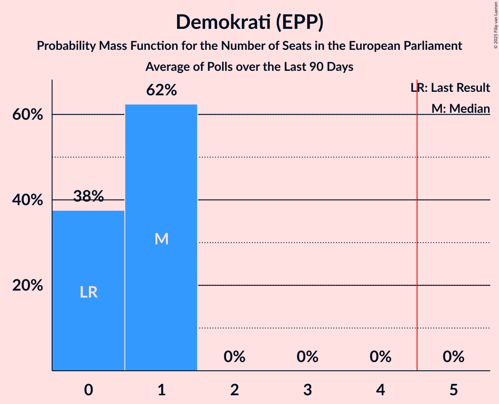

# Demokrati (EPP)

<a href="#voting-intentions">Voting Intentions</a> | <a href="#seats">Seats</a>

## Voting Intentions

Last result: **0.0%** (General Election of 9 June 2024)

### Confidence Intervals

| Period     | Polling firm/Commissioner(s) | Median | 80% Confidence Interval | 90% Confidence Interval | 95% Confidence Interval | 99% Confidence Interval |
|:----------:|:----------------:|:-----------:|:-----------------------:|:-----------------------:|:-----------------------:|:-----------------------:|
| N/A | [Poll Average](average.html) | 6.2% | 4.5–10.7% | 4.2–11.5% | 4.0–12.1% | 3.6–13.2% |
| [23–26 May 2025](2025-05-26-Valicon.html) | Valicon   TSmedia | 4.7% | 4.0–5.6% | 3.9–5.8% | 3.7–6.0% | 3.4–6.5% |
| [19–22 May 2025](2025-05-22-Mediana.html) | Mediana   POP TV | 6.4% | 5.2–8.1% | 4.9–8.5% | 4.6–8.9% | 4.1–9.8% |
| [12–14 May 2025](2025-05-14-Ninamedia.html) | Ninamedia   Dnevnik | 5.7% | 4.6–7.3% | 4.3–7.7% | 4.0–8.1% | 3.5–8.9% |
| [5–7 May 2025](2025-05-07-Mediana.html) | Mediana   Delo | 4.3% | 3.4–5.8% | 3.1–6.2% | 2.9–6.6% | 2.5–7.3% |
| [25–28 April 2025](2025-04-28-Valicon.html) | Valicon   Siol.net | 6.3% | 5.5–7.2% | 5.3–7.5% | 5.1–7.7% | 4.8–8.2% |
| [22–24 April 2025](2025-04-24-Mediana.html) | Mediana   POP TV | 3.8% | 2.9–5.2% | 2.6–5.6% | 2.4–5.9% | 2.0–6.7% |
| [14–16 April 2025](2025-04-16-Ninamedia.html) | Ninamedia   Dnevnik | 6.3% | 5.1–7.8% | 4.8–8.3% | 4.5–8.7% | 4.0–9.5% |
| [7–10 April 2025](2025-04-10-ParsifalSC.html) | Parsifal SC   Nova24TV | 10.3% | 8.8–12.1% | 8.4–12.6% | 8.0–13.0% | 7.4–13.9% |
| [31 March–4 April 2025](2025-04-04-Mediana.html) | Mediana   Delo | 6.5% | N/A | N/A | N/A | N/A |
| [17–21 March 2025](2025-03-21-Mediana.html) | Mediana   POP TV | 5.1% | N/A | N/A | N/A | N/A |
| [10–12 March 2025](2025-03-12-Ninamedia.html) | Ninamedia   Dnevnik | 4.7% | N/A | N/A | N/A | N/A |
| [3–6 March 2025](2025-03-06-Mediana.html) | Mediana   Delo | 7.0% | N/A | N/A | N/A | N/A |
| [17–20 February 2025](2025-02-20-Mediana.html) | Mediana   POP TV | 5.9% | N/A | N/A | N/A | N/A |
| [10–12 February 2025](2025-02-12-Ninamedia.html) | Ninamedia   Dnevnik | 4.0% | N/A | N/A | N/A | N/A |
| [3–6 February 2025](2025-02-06-Mediana.html) | Mediana   Delo | 0.0% | N/A | N/A | N/A | N/A |
| [21–23 January 2025](2025-01-23-Mediana.html) | Mediana   POP TV | 0.0% | N/A | N/A | N/A | N/A |
| [13–15 January 2025](2025-01-15-Ninamedia.html) | Ninamedia   Dnevnik | 3.9% | N/A | N/A | N/A | N/A |
| [6–9 January 2025](2025-01-09-Mediana.html) | Mediana   Delo | 0.0% | N/A | N/A | N/A | N/A |
| [16–19 December 2024](2024-12-19-Mediana.html) | Mediana   POP TV | 0.0% | N/A | N/A | N/A | N/A |
| [9–11 December 2024](2024-12-11-Ninamedia.html) | Ninamedia   Dnevnik | 3.0% | N/A | N/A | N/A | N/A |
| [2–5 December 2024](2024-12-05-Mediana.html) | Mediana   Delo | 0.0% | N/A | N/A | N/A | N/A |
| [18–21 November 2024](2024-11-21-Mediana.html) | Mediana   POP TV | 0.0% | N/A | N/A | N/A | N/A |
| [11–13 November 2024](2024-11-13-Ninamedia.html) | Ninamedia   Dnevnik | 3.9% | N/A | N/A | N/A | N/A |
| [4–7 November 2024](2024-11-07-Mediana.html) | Mediana   Delo | 0.0% | N/A | N/A | N/A | N/A |
| [21–24 October 2024](2024-10-24-Mediana.html) | Mediana   POP TV | 0.0% | N/A | N/A | N/A | N/A |
| [14–16 October 2024](2024-10-16-Ninamedia.html) | Ninamedia   Dnevnik | 4.6% | N/A | N/A | N/A | N/A |
| [30 September–3 October 2024](2024-10-03-Mediana.html) | Mediana   Delo | 0.0% | N/A | N/A | N/A | N/A |
| [16–19 September 2024](2024-09-19-Mediana.html) | Mediana   POP TV | 0.0% | N/A | N/A | N/A | N/A |
| [9–11 September 2024](2024-09-11-Ninamedia.html) | Ninamedia   Dnevnik | 0.0% | N/A | N/A | N/A | N/A |
| [2–5 September 2024](2024-09-05-Mediana.html) | Mediana   Delo | 0.0% | N/A | N/A | N/A | N/A |
| [20–22 August 2024](2024-08-22-Mediana.html) | Mediana   POP TV | 0.0% | N/A | N/A | N/A | N/A |
| [12–14 August 2024](2024-08-14-Ninamedia.html) | Ninamedia   Dnevnik | 0.0% | N/A | N/A | N/A | N/A |
| [5–8 August 2024](2024-08-08-Mediana.html) | Mediana   Delo | 0.0% | N/A | N/A | N/A | N/A |
| [22–25 July 2024](2024-07-25-Mediana.html) | Mediana   POP TV | 0.0% | N/A | N/A | N/A | N/A |
| [15–17 July 2024](2024-07-17-Ninamedia.html) | Ninamedia   Dnevnik | 0.0% | N/A | N/A | N/A | N/A |
| [2–4 July 2024](2024-07-04-Mediana.html) | Mediana   Delo | 0.0% | N/A | N/A | N/A | N/A |
| [18–20 June 2024](2024-06-20-Mediana.html) | Mediana   POP TV | 0.0% | N/A | N/A | N/A | N/A |
| [17–19 June 2024](2024-06-19-Ninamedia.html) | Ninamedia   Dnevnik | 0.0% | N/A | N/A | N/A | N/A |

### Probability Mass Function

The following table shows the probability mass function per percentage block of voting intentions for the [poll average](average.html) for Demokrati (EPP).

| Voting Intentions | Probability | Accumulated | Special Marks |
|:-----------------:|:-----------:|:-----------:|:-------------:|
| 0.0–0.5% | 0% | 100% | Last Result |
| 0.5–1.5% | 0% | 100% |  |
| 1.5–2.5% | 0% | 100% |  |
| 2.5–3.5% | 0.5% | 100% |  |
| 3.5–4.5% | 11% | 99.5% |  |
| 4.5–5.5% | 25% | 88% |  |
| 5.5–6.5% | 20% | 63% | Median |
| 6.5–7.5% | 12% | 44% |  |
| 7.5–8.5% | 6% | 31% |  |
| 8.5–9.5% | 6% | 25% |  |
| 9.5–10.5% | 8% | 19% |  |
| 10.5–11.5% | 7% | 11% |  |
| 11.5–12.5% | 3% | 5% |  |
| 12.5–13.5% | 1.1% | 1.3% |  |
| 13.5–14.5% | 0.2% | 0.3% |  |
| 14.5–15.5% | 0% | 0% |  |

## Seats

Last result: **0** seats (General Election of 9 June 2024)

### Confidence Intervals

| Period     | Polling firm/Commissioner(s) | Median | 80% Confidence Interval | 90% Confidence Interval | 95% Confidence Interval | 99% Confidence Interval |
|:----------:|:----------------:|:------:|:-----------------------:|:-----------------------:|:-----------------------:|:-----------------------:|
| N/A | [Poll Average](average.html) | 0 | 0–1 | 0–1 | 0–1 | 0–2 |
| [23–26 May 2025](2025-05-26-Valicon.html) | Valicon   TSmedia | 0 | 0 | 0 | 0 | 0–1 |
| [19–22 May 2025](2025-05-22-Mediana.html) | Mediana   POP TV | 0 | 0–1 | 0–1 | 0–1 | 0–1 |
| [12–14 May 2025](2025-05-14-Ninamedia.html) | Ninamedia   Dnevnik | 0 | 0 | 0–1 | 0–1 | 0–1 |
| [5–7 May 2025](2025-05-07-Mediana.html) | Mediana   Delo | 0 | 0 | 0 | 0 | 0–1 |
| [25–28 April 2025](2025-04-28-Valicon.html) | Valicon   Siol.net | 1 | 0–1 | 0–1 | 0–1 | 0–1 |
| [22–24 April 2025](2025-04-24-Mediana.html) | Mediana   POP TV | 0 | 0 | 0 | 0 | 0 |
| [14–16 April 2025](2025-04-16-Ninamedia.html) | Ninamedia   Dnevnik | 0 | 0–1 | 0–1 | 0–1 | 0–1 |
| [7–10 April 2025](2025-04-10-ParsifalSC.html) | Parsifal SC   Nova24TV | 1 | 1 | 1 | 1 | 1–2 |
| [31 March–4 April 2025](2025-04-04-Mediana.html) | Mediana   Delo |  |  |  |  |  |
| [17–21 March 2025](2025-03-21-Mediana.html) | Mediana   POP TV |  |  |  |  |  |
| [10–12 March 2025](2025-03-12-Ninamedia.html) | Ninamedia   Dnevnik |  |  |  |  |  |
| [3–6 March 2025](2025-03-06-Mediana.html) | Mediana   Delo |  |  |  |  |  |
| [17–20 February 2025](2025-02-20-Mediana.html) | Mediana   POP TV |  |  |  |  |  |
| [10–12 February 2025](2025-02-12-Ninamedia.html) | Ninamedia   Dnevnik |  |  |  |  |  |
| [3–6 February 2025](2025-02-06-Mediana.html) | Mediana   Delo |  |  |  |  |  |
| [21–23 January 2025](2025-01-23-Mediana.html) | Mediana   POP TV |  |  |  |  |  |
| [13–15 January 2025](2025-01-15-Ninamedia.html) | Ninamedia   Dnevnik |  |  |  |  |  |
| [6–9 January 2025](2025-01-09-Mediana.html) | Mediana   Delo |  |  |  |  |  |
| [16–19 December 2024](2024-12-19-Mediana.html) | Mediana   POP TV |  |  |  |  |  |
| [9–11 December 2024](2024-12-11-Ninamedia.html) | Ninamedia   Dnevnik |  |  |  |  |  |
| [2–5 December 2024](2024-12-05-Mediana.html) | Mediana   Delo |  |  |  |  |  |
| [18–21 November 2024](2024-11-21-Mediana.html) | Mediana   POP TV |  |  |  |  |  |
| [11–13 November 2024](2024-11-13-Ninamedia.html) | Ninamedia   Dnevnik |  |  |  |  |  |
| [4–7 November 2024](2024-11-07-Mediana.html) | Mediana   Delo |  |  |  |  |  |
| [21–24 October 2024](2024-10-24-Mediana.html) | Mediana   POP TV |  |  |  |  |  |
| [14–16 October 2024](2024-10-16-Ninamedia.html) | Ninamedia   Dnevnik |  |  |  |  |  |
| [30 September–3 October 2024](2024-10-03-Mediana.html) | Mediana   Delo |  |  |  |  |  |
| [16–19 September 2024](2024-09-19-Mediana.html) | Mediana   POP TV |  |  |  |  |  |
| [9–11 September 2024](2024-09-11-Ninamedia.html) | Ninamedia   Dnevnik |  |  |  |  |  |
| [2–5 September 2024](2024-09-05-Mediana.html) | Mediana   Delo |  |  |  |  |  |
| [20–22 August 2024](2024-08-22-Mediana.html) | Mediana   POP TV |  |  |  |  |  |
| [12–14 August 2024](2024-08-14-Ninamedia.html) | Ninamedia   Dnevnik |  |  |  |  |  |
| [5–8 August 2024](2024-08-08-Mediana.html) | Mediana   Delo |  |  |  |  |  |
| [22–25 July 2024](2024-07-25-Mediana.html) | Mediana   POP TV |  |  |  |  |  |
| [15–17 July 2024](2024-07-17-Ninamedia.html) | Ninamedia   Dnevnik |  |  |  |  |  |
| [2–4 July 2024](2024-07-04-Mediana.html) | Mediana   Delo |  |  |  |  |  |
| [18–20 June 2024](2024-06-20-Mediana.html) | Mediana   POP TV |  |  |  |  |  |
| [17–19 June 2024](2024-06-19-Ninamedia.html) | Ninamedia   Dnevnik |  |  |  |  |  |

### Probability Mass Function

The following table shows the probability mass function per seat for the [poll average](average.html) for Demokrati (EPP).

| Number of Seats | Probability | Accumulated | Special Marks |
|:---------------:|:-----------:|:-----------:|:-------------:|
| 0 | 62% | 100% | Last Result, Median |
| 1 | 37% | 38% |  |
| 2 | 0.6% | 0.6% |  |
| 3 | 0% | 0% |  |

