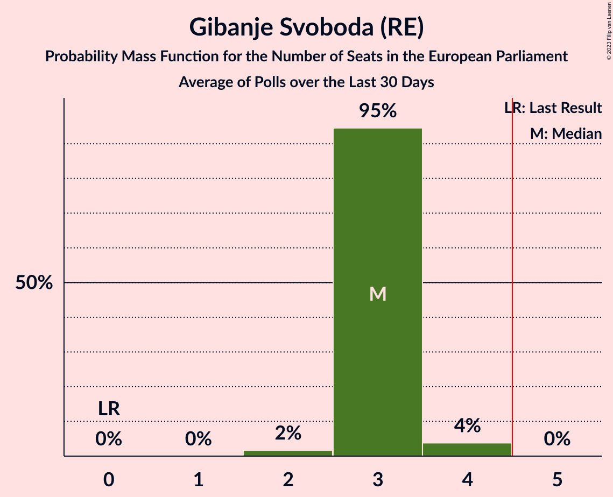

# Gibanje Svoboda (RE)

<a href="#voting-intentions">Voting Intentions</a> | <a href="#seats">Seats</a>

## Voting Intentions

Last result: **0.0%** (General Election of 9 June 2024)

### Confidence Intervals

| Period     | Polling firm/Commissioner(s) | Median | 80% Confidence Interval | 90% Confidence Interval | 95% Confidence Interval | 99% Confidence Interval |
|:----------:|:----------------:|:-----------:|:-----------------------:|:-----------------------:|:-----------------------:|:-----------------------:|
| N/A | [Poll Average](average.html) | 23.0% | 20.5–25.6% | 19.8–26.3% | 19.3–27.0% | 18.2–28.3% |
| [17–21 March 2025](2025-03-21-Mediana.html) | Mediana   POP TV | 22.3% | 20.1–24.9% | 19.4–25.6% | 18.9–26.2% | 17.8–27.5% |
| [10–12 March 2025](2025-03-12-Ninamedia.html) | Ninamedia   Dnevnik | 23.5% | 21.2–26.1% | 20.5–26.8% | 20.0–27.4% | 18.9–28.7% |
| [3–6 March 2025](2025-03-06-Mediana.html) | Mediana   Delo | 22.8% | 20.6–25.4% | 19.9–26.1% | 19.4–26.7% | 18.3–28.0% |
| [17–20 February 2025](2025-02-20-Mediana.html) | Mediana   POP TV | 19.5% | 17.3–21.9% | 16.7–22.6% | 16.2–23.2% | 15.2–24.4% |
| [10–12 February 2025](2025-02-12-Ninamedia.html) | Ninamedia   Dnevnik | 22.9% | 20.6–25.4% | 20.0–26.2% | 19.4–26.8% | 18.4–28.0% |
| [3–6 February 2025](2025-02-06-Mediana.html) | Mediana   Delo | 19.6% | 17.4–22.1% | 16.8–22.8% | 16.3–23.5% | 15.3–24.7% |
| [21–23 January 2025](2025-01-23-Mediana.html) | Mediana   POP TV | 19.2% | 17.0–21.7% | 16.4–22.5% | 15.9–23.1% | 14.9–24.3% |
| [13–15 January 2025](2025-01-15-Ninamedia.html) | Ninamedia   Dnevnik | 23.3% | 21.3–25.4% | 20.8–26.0% | 20.3–26.6% | 19.4–27.6% |
| [6–9 January 2025](2025-01-09-Mediana.html) | Mediana   Delo | 22.3% | 20.4–24.4% | 19.9–25.0% | 19.4–25.5% | 18.5–26.5% |
| [16–19 December 2024](2024-12-19-Mediana.html) | Mediana   POP TV | 23.2% | 21.3–25.3% | 20.8–25.9% | 20.3–26.4% | 19.4–27.5% |
| [9–11 December 2024](2024-12-11-Ninamedia.html) | Ninamedia   Dnevnik | 22.9% | 20.9–25.0% | 20.4–25.6% | 19.9–26.1% | 19.0–27.2% |
| [2–5 December 2024](2024-12-05-Mediana.html) | Mediana   Delo | 20.9% | 19.0–22.9% | 18.5–23.5% | 18.0–24.0% | 17.2–25.0% |
| [18–21 November 2024](2024-11-21-Mediana.html) | Mediana   POP TV | 21.8% | 20.0–23.9% | 19.5–24.5% | 19.0–25.0% | 18.2–26.0% |
| [11–13 November 2024](2024-11-13-Ninamedia.html) | Ninamedia   Dnevnik | 22.1% | 20.2–24.2% | 19.7–24.9% | 19.2–25.4% | 18.3–26.4% |
| [4–7 November 2024](2024-11-07-Mediana.html) | Mediana   Delo | 19.0% | N/A | N/A | N/A | N/A |
| [21–24 October 2024](2024-10-24-Mediana.html) | Mediana   POP TV | 17.4% | N/A | N/A | N/A | N/A |
| [14–16 October 2024](2024-10-16-Ninamedia.html) | Ninamedia   Dnevnik | 21.9% | N/A | N/A | N/A | N/A |
| [30 September–3 October 2024](2024-10-03-Mediana.html) | Mediana   Delo | 24.0% | N/A | N/A | N/A | N/A |
| [16–19 September 2024](2024-09-19-Mediana.html) | Mediana   POP TV | 21.4% | N/A | N/A | N/A | N/A |
| [9–11 September 2024](2024-09-11-Ninamedia.html) | Ninamedia   Dnevnik | 24.4% | N/A | N/A | N/A | N/A |
| [2–5 September 2024](2024-09-05-Mediana.html) | Mediana   Delo | 22.4% | N/A | N/A | N/A | N/A |
| [20–22 August 2024](2024-08-22-Mediana.html) | Mediana   POP TV | 26.0% | N/A | N/A | N/A | N/A |
| [12–14 August 2024](2024-08-14-Ninamedia.html) | Ninamedia   Dnevnik | 27.1% | N/A | N/A | N/A | N/A |
| [5–8 August 2024](2024-08-08-Mediana.html) | Mediana   Delo | 22.2% | N/A | N/A | N/A | N/A |
| [22–25 July 2024](2024-07-25-Mediana.html) | Mediana   POP TV | 26.5% | N/A | N/A | N/A | N/A |
| [15–17 July 2024](2024-07-17-Ninamedia.html) | Ninamedia   Dnevnik | 25.0% | N/A | N/A | N/A | N/A |
| [2–4 July 2024](2024-07-04-Mediana.html) | Mediana   Delo | 22.6% | N/A | N/A | N/A | N/A |
| [18–20 June 2024](2024-06-20-Mediana.html) | Mediana   POP TV | 24.5% | N/A | N/A | N/A | N/A |
| [17–19 June 2024](2024-06-19-Ninamedia.html) | Ninamedia   Dnevnik | 22.1% | N/A | N/A | N/A | N/A |

### Probability Mass Function

The following table shows the probability mass function per percentage block of voting intentions for the [poll average](average.html) for Gibanje Svoboda (RE).

| Voting Intentions | Probability | Accumulated | Special Marks |
|:-----------------:|:-----------:|:-----------:|:-------------:|
| 0.0–0.5% | 0% | 100% | Last Result |
| 0.5–1.5% | 0% | 100% |  |
| 1.5–2.5% | 0% | 100% |  |
| 2.5–3.5% | 0% | 100% |  |
| 3.5–4.5% | 0% | 100% |  |
| 4.5–5.5% | 0% | 100% |  |
| 5.5–6.5% | 0% | 100% |  |
| 6.5–7.5% | 0% | 100% |  |
| 7.5–8.5% | 0% | 100% |  |
| 8.5–9.5% | 0% | 100% |  |
| 9.5–10.5% | 0% | 100% |  |
| 10.5–11.5% | 0% | 100% |  |
| 11.5–12.5% | 0% | 100% |  |
| 12.5–13.5% | 0% | 100% |  |
| 13.5–14.5% | 0% | 100% |  |
| 14.5–15.5% | 0% | 100% |  |
| 15.5–16.5% | 0% | 100% |  |
| 16.5–17.5% | 0.1% | 100% |  |
| 17.5–18.5% | 0.8% | 99.8% |  |
| 18.5–19.5% | 3% | 99.1% |  |
| 19.5–20.5% | 7% | 96% |  |
| 20.5–21.5% | 13% | 90% |  |
| 21.5–22.5% | 18% | 77% |  |
| 22.5–23.5% | 20% | 59% | Median |
| 23.5–24.5% | 17% | 39% |  |
| 24.5–25.5% | 11% | 22% |  |
| 25.5–26.5% | 6% | 10% |  |
| 26.5–27.5% | 3% | 4% |  |
| 27.5–28.5% | 0.9% | 1.3% |  |
| 28.5–29.5% | 0.3% | 0.4% |  |
| 29.5–30.5% | 0.1% | 0.1% |  |
| 30.5–31.5% | 0% | 0% |  |

## Seats

Last result: **0** seats (General Election of 9 June 2024)

### Confidence Intervals

| Period     | Polling firm/Commissioner(s) | Median | 80% Confidence Interval | 90% Confidence Interval | 95% Confidence Interval | 99% Confidence Interval |
|:----------:|:----------------:|:------:|:-----------------------:|:-----------------------:|:-----------------------:|:-----------------------:|
| N/A | [Poll Average](average.html) | 3 | 2–3 | 2–3 | 2–3 | 2–4 |
| [17–21 March 2025](2025-03-21-Mediana.html) | Mediana   POP TV | 3 | 2–3 | 2–3 | 2–3 | 2–4 |
| [10–12 March 2025](2025-03-12-Ninamedia.html) | Ninamedia   Dnevnik | 3 | 2–3 | 2–3 | 2–3 | 2–3 |
| [3–6 March 2025](2025-03-06-Mediana.html) | Mediana   Delo | 3 | 2–3 | 2–4 | 2–4 | 2–4 |
| [17–20 February 2025](2025-02-20-Mediana.html) | Mediana   POP TV | 3 | 2–3 | 2–3 | 2–3 | 2–3 |
| [10–12 February 2025](2025-02-12-Ninamedia.html) | Ninamedia   Dnevnik | 3 | 2–3 | 2–3 | 2–3 | 2–3 |
| [3–6 February 2025](2025-02-06-Mediana.html) | Mediana   Delo | 2 | 2–3 | 2–3 | 2–3 | 2–3 |
| [21–23 January 2025](2025-01-23-Mediana.html) | Mediana   POP TV | 2 | 2–3 | 2–3 | 2–3 | 2–3 |
| [13–15 January 2025](2025-01-15-Ninamedia.html) | Ninamedia   Dnevnik | 3 | 2–3 | 2–3 | 2–3 | 2–3 |
| [6–9 January 2025](2025-01-09-Mediana.html) | Mediana   Delo | 3 | 2–3 | 2–3 | 2–3 | 2–3 |
| [16–19 December 2024](2024-12-19-Mediana.html) | Mediana   POP TV | 3 | 2–3 | 2–3 | 2–3 | 2–3 |
| [9–11 December 2024](2024-12-11-Ninamedia.html) | Ninamedia   Dnevnik | 3 | 2–3 | 2–3 | 2–3 | 2–3 |
| [2–5 December 2024](2024-12-05-Mediana.html) | Mediana   Delo | 2 | 2–3 | 2–3 | 2–3 | 2–3 |
| [18–21 November 2024](2024-11-21-Mediana.html) | Mediana   POP TV | 3 | 2–3 | 2–3 | 2–3 | 2–3 |
| [11–13 November 2024](2024-11-13-Ninamedia.html) | Ninamedia   Dnevnik | 2 | 2–3 | 2–3 | 2–3 | 2–3 |
| [4–7 November 2024](2024-11-07-Mediana.html) | Mediana   Delo |  |  |  |  |  |
| [21–24 October 2024](2024-10-24-Mediana.html) | Mediana   POP TV |  |  |  |  |  |
| [14–16 October 2024](2024-10-16-Ninamedia.html) | Ninamedia   Dnevnik |  |  |  |  |  |
| [30 September–3 October 2024](2024-10-03-Mediana.html) | Mediana   Delo |  |  |  |  |  |
| [16–19 September 2024](2024-09-19-Mediana.html) | Mediana   POP TV |  |  |  |  |  |
| [9–11 September 2024](2024-09-11-Ninamedia.html) | Ninamedia   Dnevnik |  |  |  |  |  |
| [2–5 September 2024](2024-09-05-Mediana.html) | Mediana   Delo |  |  |  |  |  |
| [20–22 August 2024](2024-08-22-Mediana.html) | Mediana   POP TV |  |  |  |  |  |
| [12–14 August 2024](2024-08-14-Ninamedia.html) | Ninamedia   Dnevnik |  |  |  |  |  |
| [5–8 August 2024](2024-08-08-Mediana.html) | Mediana   Delo |  |  |  |  |  |
| [22–25 July 2024](2024-07-25-Mediana.html) | Mediana   POP TV |  |  |  |  |  |
| [15–17 July 2024](2024-07-17-Ninamedia.html) | Ninamedia   Dnevnik |  |  |  |  |  |
| [2–4 July 2024](2024-07-04-Mediana.html) | Mediana   Delo |  |  |  |  |  |
| [18–20 June 2024](2024-06-20-Mediana.html) | Mediana   POP TV |  |  |  |  |  |
| [17–19 June 2024](2024-06-19-Ninamedia.html) | Ninamedia   Dnevnik |  |  |  |  |  |

### Probability Mass Function

The following table shows the probability mass function per seat for the [poll average](average.html) for Gibanje Svoboda (RE).

| Number of Seats | Probability | Accumulated | Special Marks |
|:---------------:|:-----------:|:-----------:|:-------------:|
| 0 | 0% | 100% | Last Result |
| 1 | 0% | 100% |  |
| 2 | 42% | 100% |  |
| 3 | 58% | 58% | Median |
| 4 | 0.7% | 0.7% |  |
| 5 | 0% | 0% | Majority |

