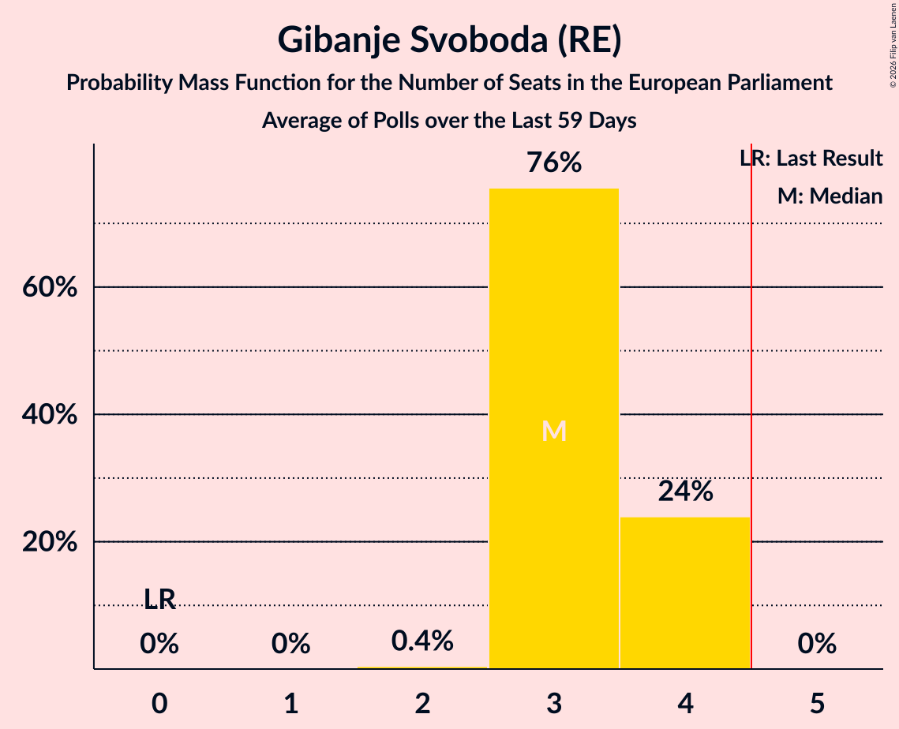

# Gibanje Svoboda (RE)

<a href="#voting-intentions">Voting Intentions</a> | <a href="#seats">Seats</a>

## Voting Intentions

Last result: **0.0%** (General Election of 9 June 2024)

### Confidence Intervals

| Period     | Polling firm/Commissioner(s) | Median | 80% Confidence Interval | 90% Confidence Interval | 95% Confidence Interval | 99% Confidence Interval |
|:----------:|:----------------:|:-----------:|:-----------------------:|:-----------------------:|:-----------------------:|:-----------------------:|
| N/A | [Poll Average](average.html) | 25.9% | 23.4–28.8% | 22.7–29.6% | 22.0–30.3% | 20.7–31.7% |
| [22–24 June 2026](2026-06-24-Mediana.html) | Mediana   POP | 27.6% | 25.3–30.1% | 24.7–30.8% | 24.1–31.4% | 23.0–32.6% |
| [8–19 June 2026](2026-06-19-IJEK.html) | IJEK   Utrip Družbe | 24.3% | 22.1–26.8% | 21.4–27.5% | 20.9–28.1% | 19.8–29.3% |
| [8–11 June 2026](2026-06-11-Mediana.html) | Mediana   Delo | 26.7% | 24.7–28.9% | 24.1–29.5% | 23.6–30.1% | 22.6–31.1% |
| [8–10 June 2026](2026-06-10-Ninamedia.html) | Ninamedia   Dnevnik | 26.6% | 24.4–28.9% | 23.8–29.6% | 23.3–30.1% | 22.3–31.3% |
| [18–21 May 2026](2026-05-21-Mediana.html) | Mediana   POP | 26.5% | 24.2–28.9% | 23.6–29.6% | 23.1–30.2% | 22.0–31.4% |
| [4–20 May 2026](2026-05-20-IJEK.html) | IJEK   Utrip Družbe | 24.4% | 22.3–26.6% | 21.7–27.3% | 21.3–27.8% | 20.3–28.9% |
| [11–13 May 2026](2026-05-13-Ninamedia.html) | Ninamedia   Dnevnik | 28.9% | 26.7–31.1% | 26.1–31.8% | 25.6–32.3% | 24.6–33.4% |
| [8–12 May 2026](2026-05-12-Valicon.html) | Valicon   Siol | 25.3% | 23.9–26.9% | 23.4–27.3% | 23.1–27.7% | 22.4–28.4% |
| [5–7 May 2026](2026-05-07-Mediana.html) | Mediana   Delo | 29.7% | 27.5–31.9% | 26.9–32.6% | 26.4–33.1% | 25.4–34.2% |
| [21–23 April 2026](2026-04-23-Mediana.html) | Mediana   POP | 27.9% | 25.6–30.3% | 25.0–31.0% | 24.4–31.6% | 23.4–32.8% |
| [13–15 April 2026](2026-04-15-Ninamedia.html) | Ninamedia   Dnevnik | 29.3% | 27.1–31.6% | 26.6–32.2% | 26.0–32.8% | 25.0–33.9% |
| [1–10 April 2026](2026-04-10-IJEK.html) | IJEK   Utrip Družbe | 26.4% | 24.3–28.6% | 23.7–29.3% | 23.2–29.8% | 22.2–30.9% |
| [7–9 April 2026](2026-04-09-Mediana.html) | Mediana   Delo | 27.6% | 25.5–29.8% | 24.9–30.5% | 24.4–31.0% | 23.4–32.1% |
| [18–20 March 2026](2026-03-20-Valicon.html) | Valicon   TSmedia | 28.7% | 27.0–30.6% | 26.5–31.1% | 26.0–31.6% | 25.2–32.5% |
| [18–20 March 2026](2026-03-20-Ninamedia.html) | Ninamedia   Dnevnik | 30.1% | 28.2–32.2% | 27.6–32.8% | 27.1–33.3% | 26.2–34.3% |
| [16–18 March 2026](2026-03-18-Ninamedia.html) | Ninamedia   Dnevnik | 29.4% | N/A | N/A | N/A | N/A |
| [16–18 March 2026](2026-03-18-Mediana.html) | Mediana   RTV SLO | 27.8% | 26.4–29.3% | 26.0–29.7% | 25.6–30.0% | 25.0–30.8% |
| [16–18 March 2026](2026-03-18-IJEK.html) | IJEK   Utrip Družbe | 22.9% | 20.9–25.0% | 20.3–25.6% | 19.9–26.2% | 18.9–27.2% |
| [14–17 March 2026](2026-03-17-Ninamedia.html) | Ninamedia   Dnevnik | 30.5% | N/A | N/A | N/A | N/A |
| [14–17 March 2026](2026-03-17-Info360si.html) | Info360.si | 15.7% | 15.1–16.3% | 14.9–16.5% | 14.8–16.7% | 14.5–17.0% |
| [13–16 March 2026](2026-03-16-Valicon.html) | Valicon   TSmedia | 25.6% | N/A | N/A | N/A | N/A |
| [13–16 March 2026](2026-03-16-Ninamedia.html) | Ninamedia   Dnevnik | 30.4% | N/A | N/A | N/A | N/A |
| [10–16 March 2026](2026-03-16-IJEK.html) | IJEK   Utrip Družbe | 19.7% | N/A | N/A | N/A | N/A |
| [12–14 March 2026](2026-03-14-Ninamedia.html) | Ninamedia   Dnevnik | 29.7% | N/A | N/A | N/A | N/A |
| [11–13 March 2026](2026-03-13-Ninamedia.html) | Ninamedia   Dnevnik | 28.3% | N/A | N/A | N/A | N/A |
| [9–12 March 2026](2026-03-12-Mediana.html) | Mediana   RTV SLO | 25.1% | 23.1–27.3% | 22.6–27.9% | 22.1–28.5% | 21.2–29.5% |
| [6–10 March 2026](2026-03-10-ParsifalSC.html) | Parsifal SC   Nova24TV | 23.1% | 21.1–25.2% | 20.5–25.8% | 20.0–26.4% | 19.1–27.4% |
| [7–10 March 2026](2026-03-10-Ninamedia.html) | Ninamedia   Dnevnik | 27.4% | 25.5–29.5% | 25.0–30.1% | 24.5–30.6% | 23.6–31.6% |
| [1–10 March 2026](2026-03-10-IJEK.html) | IJEK   Utrip Družbe | 20.3% | N/A | N/A | N/A | N/A |
| [6–9 March 2026](2026-03-09-Valicon.html) | Valicon   TSmedia | 21.4% | 20.0–22.8% | 19.6–23.2% | 19.3–23.6% | 18.7–24.3% |
| [2–5 March 2026](2026-03-05-Mediana.html) | Mediana   Delo | 25.0% | 23.1–27.2% | 22.5–27.8% | 22.0–28.3% | 21.1–29.4% |
| [26 February–2 March 2026](2026-03-02-ParsifalSC.html) | Parsifal SC   Nova24TV | 22.1% | N/A | N/A | N/A | N/A |
| [24–26 February 2026](2026-02-26-ParsifalSC.html) | Parsifal SC   Nova24TV | 23.0% | 20.8–25.3% | 20.2–26.0% | 19.7–26.6% | 18.7–27.8% |
| [23–26 February 2026](2026-02-26-Mediana.html) | Mediana   POP TV | 22.5% | 20.3–24.8% | 19.7–25.5% | 19.2–26.1% | 18.2–27.2% |
| [23–25 February 2026](2026-02-25-Ninamedia.html) | Ninamedia   Dnevnik | 27.0% | 25.2–28.9% | 24.7–29.5% | 24.3–29.9% | 23.5–30.9% |
| [20–24 February 2026](2026-02-24-ParsifalSC.html) | Parsifal SC   Nova24TV | 23.8% | N/A | N/A | N/A | N/A |
| [20–23 February 2026](2026-02-23-Valicon.html) | Valicon   TSmedia | 23.0% | 21.6–24.5% | 21.2–24.9% | 20.8–25.3% | 20.2–26.0% |
| [1–14 February 2026](2026-02-14-IJEK.html) | IJEK   Utrip Družbe | 21.5% | 19.2–24.1% | 18.5–24.8% | 18.0–25.4% | 16.9–26.7% |
| [9–13 February 2026](2026-02-13-ParsifalSC.html) | Parsifal SC   Nova24TV | 20.3% | 18.2–22.6% | 17.6–23.3% | 17.1–23.9% | 16.2–25.0% |
| [9–12 February 2026](2026-02-12-Mediana.html) | Mediana   RTV SLO | 16.2% | 14.5–18.0% | 14.1–18.5% | 13.7–19.0% | 13.0–19.9% |
| [9–11 February 2026](2026-02-11-Ninamedia.html) | Ninamedia   Dnevnik | 25.0% | 22.9–27.4% | 22.3–28.1% | 21.7–28.7% | 20.7–29.8% |
| [7–11 February 2026](2026-02-11-Info360si.html) | Info360.si | 15.5% | 14.7–16.3% | 14.5–16.5% | 14.3–16.7% | 14.0–17.1% |
| [6–8 February 2026](2026-02-08-Valicon.html) | Valicon   TSmedia | 21.5% | 20.1–23.0% | 19.8–23.5% | 19.4–23.8% | 18.8–24.5% |
| [2–5 February 2026](2026-02-05-Mediana.html) | Mediana   Delo | 19.9% | N/A | N/A | N/A | N/A |
| [26–29 January 2026](2026-01-29-Mediana.html) | Mediana   POP TV | 19.6% | 17.5–21.9% | 16.9–22.5% | 16.5–23.1% | 15.5–24.2% |
| [26–27 January 2026](2026-01-27-Ninamedia.html) | Ninamedia   Mladina | 23.8% | 22.3–25.4% | 21.9–25.9% | 21.5–26.3% | 20.8–27.1% |
| [23–25 January 2026](2026-01-25-Valicon.html) | Valicon   TSmedia | 20.7% | 19.4–22.2% | 19.0–22.6% | 18.7–23.0% | 18.0–23.7% |
| [1–25 January 2026](2026-01-25-IJEK.html) | IJEK   Utrip Družbe | 19.6% | 17.1–22.5% | 16.4–23.3% | 15.9–24.0% | 14.7–25.5% |
| [17–21 January 2026](2026-01-21-Info360si.html) | Info360.si | 13.4% | 12.7–14.1% | 12.5–14.3% | 12.4–14.5% | 12.1–14.8% |
| [12–15 January 2026](2026-01-15-Mediana.html) | Mediana   RTV SLO | 22.1% | N/A | N/A | N/A | N/A |
| [12–14 January 2026](2026-01-14-ParsifalSC.html) | Parsifal SC   Nova24TV | 26.9% | 24.5–29.4% | 23.9–30.1% | 23.3–30.8% | 22.2–32.0% |
| [12–14 January 2026](2026-01-14-Ninamedia.html) | Ninamedia   Dnevnik | 21.6% | N/A | N/A | N/A | N/A |
| [6–8 January 2026](2026-01-08-Mediana.html) | Mediana   Delo | 24.2% | N/A | N/A | N/A | N/A |
| [26–28 December 2025](2025-12-28-Valicon.html) | Valicon   TSmedia | 21.3% | N/A | N/A | N/A | N/A |
| [15–18 December 2025](2025-12-18-Mediana.html) | Mediana   RTV Slovenija | 23.5% | N/A | N/A | N/A | N/A |
| [1–18 December 2025](2025-12-18-IJEK.html) | IJEK   Utrip Družbe | 19.7% | N/A | N/A | N/A | N/A |
| [15–17 December 2025](2025-12-17-Ninamedia.html) | Ninamedia   Dnevnik | 26.1% | N/A | N/A | N/A | N/A |
| [8–11 December 2025](2025-12-11-Mediana.html) | Mediana   POP TV | 22.3% | N/A | N/A | N/A | N/A |
| [1–4 December 2025](2025-12-04-Mediana.html) | Mediana   Delo | 22.8% | N/A | N/A | N/A | N/A |
| [22–27 November 2025](2025-11-27-Mediana.html) | Mediana   POP TV | 20.7% | N/A | N/A | N/A | N/A |
| [21–24 November 2025](2025-11-24-Valicon.html) | Valicon   TSmedia | 21.9% | N/A | N/A | N/A | N/A |
| [1–20 November 2025](2025-11-20-IJEK.html) | IJEK   Utrip Družbe | 20.0% | N/A | N/A | N/A | N/A |
| [10–13 November 2025](2025-11-13-Mediana.html) | Mediana   RTV Slovenija | 23.3% | N/A | N/A | N/A | N/A |
| [10–12 November 2025](2025-11-12-Ninamedia.html) | Ninamedia   Dnevnik | 22.3% | N/A | N/A | N/A | N/A |
| [3–6 November 2025](2025-11-06-Mediana.html) | Mediana   Delo | 21.7% | N/A | N/A | N/A | N/A |
| [24–26 October 2025](2025-10-26-Valicon.html) | Valicon   TSmedia | 19.7% | N/A | N/A | N/A | N/A |
| [20–23 October 2025](2025-10-23-Mediana.html) | Mediana   POP TV | 23.5% | N/A | N/A | N/A | N/A |
| [20–22 October 2025](2025-10-22-ParsifalSC.html) | Parsifal SC   Nova24TV | 17.2% | N/A | N/A | N/A | N/A |
| [17–20 October 2025](2025-10-20-Valicon.html) | Valicon   POP TV | 22.3% | N/A | N/A | N/A | N/A |
| [1–20 October 2025](2025-10-20-IJEK.html) | IJEK   Utrip Družbe | 23.7% | N/A | N/A | N/A | N/A |
| [13–15 October 2025](2025-10-15-Ninamedia.html) | Ninamedia   Dnevnik | 23.8% | N/A | N/A | N/A | N/A |
| [6–9 October 2025](2025-10-09-Mediana.html) | Mediana   Delo | 20.1% | N/A | N/A | N/A | N/A |
| [26–29 September 2025](2025-09-29-Valicon.html) | Valicon   TSmedia | 22.9% | N/A | N/A | N/A | N/A |
| [22–25 September 2025](2025-09-25-Mediana.html) | Mediana   POP TV | 24.0% | N/A | N/A | N/A | N/A |
| [1–12 September 2025](2025-09-12-IJEK.html) | IJEK   Utrip Družbe | 21.6% | N/A | N/A | N/A | N/A |
| [8–10 September 2025](2025-09-10-Ninamedia.html) | Ninamedia   Dnevnik | 24.7% | N/A | N/A | N/A | N/A |
| [1–4 September 2025](2025-09-04-Mediana.html) | Mediana   Delo | 20.7% | N/A | N/A | N/A | N/A |
| [22–25 August 2025](2025-08-25-Valicon.html) | Valicon   TSmedia | 20.9% | N/A | N/A | N/A | N/A |
| [18–21 August 2025](2025-08-21-Mediana.html) | Mediana   POP TV | 22.0% | N/A | N/A | N/A | N/A |
| [11–13 August 2025](2025-08-13-Ninamedia.html) | Ninamedia   Dnevnik | 25.3% | N/A | N/A | N/A | N/A |
| [4–7 August 2025](2025-08-07-Mediana.html) | Mediana   Delo | 24.4% | N/A | N/A | N/A | N/A |
| [1–7 August 2025](2025-08-07-IJEK.html) | IJEK   Utrip Družbe | 18.8% | N/A | N/A | N/A | N/A |
| [25–28 July 2025](2025-07-28-Valicon.html) | Valicon   TSmedia | 21.6% | N/A | N/A | N/A | N/A |
| [21–24 July 2025](2025-07-24-Mediana.html) | Mediana   POP TV | 24.4% | N/A | N/A | N/A | N/A |
| [7–9 July 2025](2025-07-09-Ninamedia.html) | Ninamedia   Dnevnik | 24.7% | N/A | N/A | N/A | N/A |
| [3–9 July 2025](2025-07-09-IJEK.html) | IJEK   Utrip Družbe | 22.2% | N/A | N/A | N/A | N/A |
| [30 June–3 July 2025](2025-07-03-Mediana.html) | Mediana   Delo | 20.5% | N/A | N/A | N/A | N/A |
| [27–30 June 2025](2025-06-30-Valicon.html) | Valicon   TSmedia | 18.5% | N/A | N/A | N/A | N/A |
| [16–19 June 2025](2025-06-19-Mediana.html) | Mediana   POP TV | 22.3% | N/A | N/A | N/A | N/A |
| [10–12 June 2025](2025-06-12-ParsifalSC.html) | Parsifal SC   Nova24TV | 19.5% | N/A | N/A | N/A | N/A |
| [1–12 June 2025](2025-06-12-IJEK.html) | IJEK   Utrip Družbe | 24.1% | N/A | N/A | N/A | N/A |
| [9–11 June 2025](2025-06-11-Ninamedia.html) | Ninamedia   Dnevnik | 23.3% | N/A | N/A | N/A | N/A |
| [2–5 June 2025](2025-06-05-Mediana.html) | Mediana   Delo | 26.0% | N/A | N/A | N/A | N/A |
| [23–26 May 2025](2025-05-26-Valicon.html) | Valicon   TSmedia | 19.9% | N/A | N/A | N/A | N/A |
| [19–22 May 2025](2025-05-22-Mediana.html) | Mediana   POP TV | 25.1% | N/A | N/A | N/A | N/A |
| [12–14 May 2025](2025-05-14-Ninamedia.html) | Ninamedia   Dnevnik | 23.6% | N/A | N/A | N/A | N/A |
| [5–7 May 2025](2025-05-07-Mediana.html) | Mediana   Delo | 25.7% | N/A | N/A | N/A | N/A |
| [25–28 April 2025](2025-04-28-Valicon.html) | Valicon   Siol.net | 21.3% | N/A | N/A | N/A | N/A |
| [22–24 April 2025](2025-04-24-Mediana.html) | Mediana   POP TV | 21.8% | N/A | N/A | N/A | N/A |
| [14–16 April 2025](2025-04-16-Ninamedia.html) | Ninamedia   Dnevnik | 22.8% | N/A | N/A | N/A | N/A |
| [7–10 April 2025](2025-04-10-ParsifalSC.html) | Parsifal SC   Nova24TV | 17.2% | N/A | N/A | N/A | N/A |
| [31 March–4 April 2025](2025-04-04-Mediana.html) | Mediana   Delo | 18.8% | N/A | N/A | N/A | N/A |
| [17–21 March 2025](2025-03-21-Mediana.html) | Mediana   POP TV | 22.3% | N/A | N/A | N/A | N/A |
| [10–12 March 2025](2025-03-12-Ninamedia.html) | Ninamedia   Dnevnik | 23.5% | N/A | N/A | N/A | N/A |
| [3–6 March 2025](2025-03-06-Mediana.html) | Mediana   Delo | 22.8% | N/A | N/A | N/A | N/A |
| [17–20 February 2025](2025-02-20-Mediana.html) | Mediana   POP TV | 19.5% | N/A | N/A | N/A | N/A |
| [10–12 February 2025](2025-02-12-Ninamedia.html) | Ninamedia   Dnevnik | 22.9% | N/A | N/A | N/A | N/A |
| [3–6 February 2025](2025-02-06-Mediana.html) | Mediana   Delo | 19.6% | N/A | N/A | N/A | N/A |
| [21–23 January 2025](2025-01-23-Mediana.html) | Mediana   POP TV | 19.2% | N/A | N/A | N/A | N/A |
| [13–15 January 2025](2025-01-15-Ninamedia.html) | Ninamedia   Dnevnik | 23.3% | N/A | N/A | N/A | N/A |
| [6–9 January 2025](2025-01-09-Mediana.html) | Mediana   Delo | 22.4% | N/A | N/A | N/A | N/A |
| [16–19 December 2024](2024-12-19-Mediana.html) | Mediana   POP TV | 23.2% | N/A | N/A | N/A | N/A |
| [9–11 December 2024](2024-12-11-Ninamedia.html) | Ninamedia   Dnevnik | 22.9% | N/A | N/A | N/A | N/A |
| [2–5 December 2024](2024-12-05-Mediana.html) | Mediana   Delo | 20.9% | N/A | N/A | N/A | N/A |
| [18–21 November 2024](2024-11-21-Mediana.html) | Mediana   POP TV | 21.8% | N/A | N/A | N/A | N/A |
| [11–13 November 2024](2024-11-13-Ninamedia.html) | Ninamedia   Dnevnik | 22.1% | N/A | N/A | N/A | N/A |
| [4–7 November 2024](2024-11-07-Mediana.html) | Mediana   Delo | 19.0% | N/A | N/A | N/A | N/A |
| [21–24 October 2024](2024-10-24-Mediana.html) | Mediana   POP TV | 17.4% | N/A | N/A | N/A | N/A |
| [14–16 October 2024](2024-10-16-Ninamedia.html) | Ninamedia   Dnevnik | 21.9% | N/A | N/A | N/A | N/A |
| [30 September–3 October 2024](2024-10-03-Mediana.html) | Mediana   Delo | 24.0% | N/A | N/A | N/A | N/A |
| [16–19 September 2024](2024-09-19-Mediana.html) | Mediana   POP TV | 21.4% | N/A | N/A | N/A | N/A |
| [9–11 September 2024](2024-09-11-Ninamedia.html) | Ninamedia   Dnevnik | 24.4% | N/A | N/A | N/A | N/A |
| [2–5 September 2024](2024-09-05-Mediana.html) | Mediana   Delo | 22.4% | N/A | N/A | N/A | N/A |
| [20–22 August 2024](2024-08-22-Mediana.html) | Mediana   POP TV | 26.0% | N/A | N/A | N/A | N/A |
| [12–14 August 2024](2024-08-14-Ninamedia.html) | Ninamedia   Dnevnik | 27.1% | N/A | N/A | N/A | N/A |
| [5–8 August 2024](2024-08-08-Mediana.html) | Mediana   Delo | 22.2% | N/A | N/A | N/A | N/A |
| [22–25 July 2024](2024-07-25-Mediana.html) | Mediana   POP TV | 26.5% | N/A | N/A | N/A | N/A |
| [15–17 July 2024](2024-07-17-Ninamedia.html) | Ninamedia   Dnevnik | 25.0% | N/A | N/A | N/A | N/A |
| [2–4 July 2024](2024-07-04-Mediana.html) | Mediana   Delo | 22.6% | N/A | N/A | N/A | N/A |
| [18–20 June 2024](2024-06-20-Mediana.html) | Mediana   POP TV | 24.5% | N/A | N/A | N/A | N/A |
| [17–19 June 2024](2024-06-19-Ninamedia.html) | Ninamedia   Dnevnik | 22.1% | N/A | N/A | N/A | N/A |

### Probability Mass Function

The following table shows the probability mass function per percentage block of voting intentions for the [poll average](average.html) for Gibanje Svoboda (RE).

| Voting Intentions | Probability | Accumulated | Special Marks |
|:-----------------:|:-----------:|:-----------:|:-------------:|
| 0.0–0.5% | 0% | 100% | Last Result |
| 0.5–1.5% | 0% | 100% |  |
| 1.5–2.5% | 0% | 100% |  |
| 2.5–3.5% | 0% | 100% |  |
| 3.5–4.5% | 0% | 100% |  |
| 4.5–5.5% | 0% | 100% |  |
| 5.5–6.5% | 0% | 100% |  |
| 6.5–7.5% | 0% | 100% |  |
| 7.5–8.5% | 0% | 100% |  |
| 8.5–9.5% | 0% | 100% |  |
| 9.5–10.5% | 0% | 100% |  |
| 10.5–11.5% | 0% | 100% |  |
| 11.5–12.5% | 0% | 100% |  |
| 12.5–13.5% | 0% | 100% |  |
| 13.5–14.5% | 0% | 100% |  |
| 14.5–15.5% | 0% | 100% |  |
| 15.5–16.5% | 0% | 100% |  |
| 16.5–17.5% | 0% | 100% |  |
| 17.5–18.5% | 0% | 100% |  |
| 18.5–19.5% | 0.1% | 100% |  |
| 19.5–20.5% | 0.3% | 99.9% |  |
| 20.5–21.5% | 1.1% | 99.6% |  |
| 21.5–22.5% | 3% | 98.5% |  |
| 22.5–23.5% | 6% | 96% |  |
| 23.5–24.5% | 13% | 89% |  |
| 24.5–25.5% | 19% | 76% |  |
| 25.5–26.5% | 20% | 57% | Median |
| 26.5–27.5% | 15% | 38% |  |
| 27.5–28.5% | 11% | 22% |  |
| 28.5–29.5% | 7% | 12% |  |
| 29.5–30.5% | 3% | 5% |  |
| 30.5–31.5% | 1.4% | 2% |  |
| 31.5–32.5% | 0.5% | 0.6% |  |
| 32.5–33.5% | 0.1% | 0.1% |  |
| 33.5–34.5% | 0% | 0% |  |

## Seats

Last result: **0** seats (General Election of 9 June 2024)

### Confidence Intervals

| Period     | Polling firm/Commissioner(s) | Median | 80% Confidence Interval | 90% Confidence Interval | 95% Confidence Interval | 99% Confidence Interval |
|:----------:|:----------------:|:------:|:-----------------------:|:-----------------------:|:-----------------------:|:-----------------------:|
| N/A | [Poll Average](average.html) | 3 | 3–4 | 3–4 | 3–4 | 2–4 |
| [22–24 June 2026](2026-06-24-Mediana.html) | Mediana   POP | 4 | 3–4 | 3–4 | 3–4 | 3–4 |
| [8–19 June 2026](2026-06-19-IJEK.html) | IJEK   Utrip Družbe | 3 | 3–4 | 3–4 | 3–4 | 2–4 |
| [8–11 June 2026](2026-06-11-Mediana.html) | Mediana   Delo | 3 | 3–4 | 3–4 | 3–4 | 3–4 |
| [8–10 June 2026](2026-06-10-Ninamedia.html) | Ninamedia   Dnevnik | 3 | 3 | 3 | 3–4 | 2–4 |
| [18–21 May 2026](2026-05-21-Mediana.html) | Mediana   POP | 4 | 3–4 | 3–4 | 3–4 | 3–4 |
| [4–20 May 2026](2026-05-20-IJEK.html) | IJEK   Utrip Družbe | 3 | 3–4 | 3–4 | 3–4 | 3–4 |
| [11–13 May 2026](2026-05-13-Ninamedia.html) | Ninamedia   Dnevnik | 4 | 3–4 | 3–4 | 3–4 | 3–5 |
| [8–12 May 2026](2026-05-12-Valicon.html) | Valicon   Siol | 3 | 3–4 | 3–4 | 3–4 | 3–4 |
| [5–7 May 2026](2026-05-07-Mediana.html) | Mediana   Delo | 4 | 4 | 4–5 | 3–5 | 3–5 |
| [21–23 April 2026](2026-04-23-Mediana.html) | Mediana   POP | 4 | 3–4 | 3–4 | 3–4 | 3–5 |
| [13–15 April 2026](2026-04-15-Ninamedia.html) | Ninamedia   Dnevnik | 4 | 4 | 4–5 | 3–5 | 3–5 |
| [1–10 April 2026](2026-04-10-IJEK.html) | IJEK   Utrip Družbe | 3 | 3–4 | 3–4 | 3–4 | 3–4 |
| [7–9 April 2026](2026-04-09-Mediana.html) | Mediana   Delo | 3 | 3–4 | 3–4 | 3–4 | 3–4 |
| [18–20 March 2026](2026-03-20-Valicon.html) | Valicon   TSmedia | 4 | 3–4 | 3–4 | 3–4 | 3–4 |
| [18–20 March 2026](2026-03-20-Ninamedia.html) | Ninamedia   Dnevnik | 4 | 4–5 | 4–5 | 4–5 | 4–5 |
| [16–18 March 2026](2026-03-18-Ninamedia.html) | Ninamedia   Dnevnik |  |  |  |  |  |
| [16–18 March 2026](2026-03-18-Mediana.html) | Mediana   RTV SLO | 4 | 4 | 4 | 3–4 | 3–4 |
| [16–18 March 2026](2026-03-18-IJEK.html) | IJEK   Utrip Družbe | 3 | 3 | 2–3 | 2–3 | 2–4 |
| [14–17 March 2026](2026-03-17-Ninamedia.html) | Ninamedia   Dnevnik |  |  |  |  |  |
| [14–17 March 2026](2026-03-17-Info360si.html) | Info360.si | 2 | 2 | 2 | 2 | 2 |
| [13–16 March 2026](2026-03-16-Valicon.html) | Valicon   TSmedia |  |  |  |  |  |
| [13–16 March 2026](2026-03-16-Ninamedia.html) | Ninamedia   Dnevnik |  |  |  |  |  |
| [10–16 March 2026](2026-03-16-IJEK.html) | IJEK   Utrip Družbe |  |  |  |  |  |
| [12–14 March 2026](2026-03-14-Ninamedia.html) | Ninamedia   Dnevnik |  |  |  |  |  |
| [11–13 March 2026](2026-03-13-Ninamedia.html) | Ninamedia   Dnevnik |  |  |  |  |  |
| [9–12 March 2026](2026-03-12-Mediana.html) | Mediana   RTV SLO | 3 | 3 | 3 | 3–4 | 3–4 |
| [6–10 March 2026](2026-03-10-ParsifalSC.html) | Parsifal SC   Nova24TV | 3 | 3–4 | 3–4 | 2–4 | 2–4 |
| [7–10 March 2026](2026-03-10-Ninamedia.html) | Ninamedia   Dnevnik | 4 | 4 | 4 | 3–4 | 3–4 |
| [1–10 March 2026](2026-03-10-IJEK.html) | IJEK   Utrip Družbe |  |  |  |  |  |
| [6–9 March 2026](2026-03-09-Valicon.html) | Valicon   TSmedia | 3 | 3 | 3 | 3 | 3 |
| [2–5 March 2026](2026-03-05-Mediana.html) | Mediana   Delo | 4 | 3–4 | 3–4 | 3–4 | 3–4 |
| [26 February–2 March 2026](2026-03-02-ParsifalSC.html) | Parsifal SC   Nova24TV |  |  |  |  |  |
| [24–26 February 2026](2026-02-26-ParsifalSC.html) | Parsifal SC   Nova24TV | 3 | 3 | 3 | 2–3 | 2–4 |
| [23–26 February 2026](2026-02-26-Mediana.html) | Mediana   POP TV | 3 | 3 | 3–4 | 2–4 | 2–4 |
| [23–25 February 2026](2026-02-25-Ninamedia.html) | Ninamedia   Dnevnik | 3 | 3–4 | 3–4 | 3–4 | 3–4 |
| [20–24 February 2026](2026-02-24-ParsifalSC.html) | Parsifal SC   Nova24TV |  |  |  |  |  |
| [20–23 February 2026](2026-02-23-Valicon.html) | Valicon   TSmedia | 3 | 3 | 3 | 3 | 3–4 |
| [1–14 February 2026](2026-02-14-IJEK.html) | IJEK   Utrip Družbe | 3 | 2–3 | 2–3 | 2–4 | 2–4 |
| [9–13 February 2026](2026-02-13-ParsifalSC.html) | Parsifal SC   Nova24TV | 3 | 2–3 | 2–3 | 2–3 | 2–3 |
| [9–12 February 2026](2026-02-12-Mediana.html) | Mediana   RTV SLO | 2 | 2 | 2 | 2 | 2–3 |
| [9–11 February 2026](2026-02-11-Ninamedia.html) | Ninamedia   Dnevnik | 4 | 3–4 | 3–4 | 3–4 | 3–4 |
| [7–11 February 2026](2026-02-11-Info360si.html) | Info360.si | 2 | 2 | 2 | 2 | 2 |
| [6–8 February 2026](2026-02-08-Valicon.html) | Valicon   TSmedia | 3 | 3 | 3 | 3 | 3–4 |
| [2–5 February 2026](2026-02-05-Mediana.html) | Mediana   Delo |  |  |  |  |  |
| [26–29 January 2026](2026-01-29-Mediana.html) | Mediana   POP TV | 3 | 2–3 | 2–3 | 2–3 | 2–3 |
| [26–27 January 2026](2026-01-27-Ninamedia.html) | Ninamedia   Mladina | 3 | 3 | 3 | 3–4 | 3–4 |
| [23–25 January 2026](2026-01-25-Valicon.html) | Valicon   TSmedia | 3 | 3 | 3 | 2–3 | 2–3 |
| [1–25 January 2026](2026-01-25-IJEK.html) | IJEK   Utrip Družbe | 2 | 2 | 2–3 | 2–3 | 2–3 |
| [17–21 January 2026](2026-01-21-Info360si.html) | Info360.si | 2 | 1–2 | 1–2 | 1–2 | 1–2 |
| [12–15 January 2026](2026-01-15-Mediana.html) | Mediana   RTV SLO |  |  |  |  |  |
| [12–14 January 2026](2026-01-14-ParsifalSC.html) | Parsifal SC   Nova24TV | 4 | 3–4 | 3–4 | 3–4 | 3–4 |
| [12–14 January 2026](2026-01-14-Ninamedia.html) | Ninamedia   Dnevnik |  |  |  |  |  |
| [6–8 January 2026](2026-01-08-Mediana.html) | Mediana   Delo |  |  |  |  |  |
| [26–28 December 2025](2025-12-28-Valicon.html) | Valicon   TSmedia |  |  |  |  |  |
| [15–18 December 2025](2025-12-18-Mediana.html) | Mediana   RTV Slovenija |  |  |  |  |  |
| [1–18 December 2025](2025-12-18-IJEK.html) | IJEK   Utrip Družbe |  |  |  |  |  |
| [15–17 December 2025](2025-12-17-Ninamedia.html) | Ninamedia   Dnevnik |  |  |  |  |  |
| [8–11 December 2025](2025-12-11-Mediana.html) | Mediana   POP TV |  |  |  |  |  |
| [1–4 December 2025](2025-12-04-Mediana.html) | Mediana   Delo |  |  |  |  |  |
| [22–27 November 2025](2025-11-27-Mediana.html) | Mediana   POP TV |  |  |  |  |  |
| [21–24 November 2025](2025-11-24-Valicon.html) | Valicon   TSmedia |  |  |  |  |  |
| [1–20 November 2025](2025-11-20-IJEK.html) | IJEK   Utrip Družbe |  |  |  |  |  |
| [10–13 November 2025](2025-11-13-Mediana.html) | Mediana   RTV Slovenija |  |  |  |  |  |
| [10–12 November 2025](2025-11-12-Ninamedia.html) | Ninamedia   Dnevnik |  |  |  |  |  |
| [3–6 November 2025](2025-11-06-Mediana.html) | Mediana   Delo |  |  |  |  |  |
| [24–26 October 2025](2025-10-26-Valicon.html) | Valicon   TSmedia |  |  |  |  |  |
| [20–23 October 2025](2025-10-23-Mediana.html) | Mediana   POP TV |  |  |  |  |  |
| [20–22 October 2025](2025-10-22-ParsifalSC.html) | Parsifal SC   Nova24TV |  |  |  |  |  |
| [17–20 October 2025](2025-10-20-Valicon.html) | Valicon   POP TV |  |  |  |  |  |
| [1–20 October 2025](2025-10-20-IJEK.html) | IJEK   Utrip Družbe |  |  |  |  |  |
| [13–15 October 2025](2025-10-15-Ninamedia.html) | Ninamedia   Dnevnik |  |  |  |  |  |
| [6–9 October 2025](2025-10-09-Mediana.html) | Mediana   Delo |  |  |  |  |  |
| [26–29 September 2025](2025-09-29-Valicon.html) | Valicon   TSmedia |  |  |  |  |  |
| [22–25 September 2025](2025-09-25-Mediana.html) | Mediana   POP TV |  |  |  |  |  |
| [1–12 September 2025](2025-09-12-IJEK.html) | IJEK   Utrip Družbe |  |  |  |  |  |
| [8–10 September 2025](2025-09-10-Ninamedia.html) | Ninamedia   Dnevnik |  |  |  |  |  |
| [1–4 September 2025](2025-09-04-Mediana.html) | Mediana   Delo |  |  |  |  |  |
| [22–25 August 2025](2025-08-25-Valicon.html) | Valicon   TSmedia |  |  |  |  |  |
| [18–21 August 2025](2025-08-21-Mediana.html) | Mediana   POP TV |  |  |  |  |  |
| [11–13 August 2025](2025-08-13-Ninamedia.html) | Ninamedia   Dnevnik |  |  |  |  |  |
| [4–7 August 2025](2025-08-07-Mediana.html) | Mediana   Delo |  |  |  |  |  |
| [1–7 August 2025](2025-08-07-IJEK.html) | IJEK   Utrip Družbe |  |  |  |  |  |
| [25–28 July 2025](2025-07-28-Valicon.html) | Valicon   TSmedia |  |  |  |  |  |
| [21–24 July 2025](2025-07-24-Mediana.html) | Mediana   POP TV |  |  |  |  |  |
| [7–9 July 2025](2025-07-09-Ninamedia.html) | Ninamedia   Dnevnik |  |  |  |  |  |
| [3–9 July 2025](2025-07-09-IJEK.html) | IJEK   Utrip Družbe |  |  |  |  |  |
| [30 June–3 July 2025](2025-07-03-Mediana.html) | Mediana   Delo |  |  |  |  |  |
| [27–30 June 2025](2025-06-30-Valicon.html) | Valicon   TSmedia |  |  |  |  |  |
| [16–19 June 2025](2025-06-19-Mediana.html) | Mediana   POP TV |  |  |  |  |  |
| [10–12 June 2025](2025-06-12-ParsifalSC.html) | Parsifal SC   Nova24TV |  |  |  |  |  |
| [1–12 June 2025](2025-06-12-IJEK.html) | IJEK   Utrip Družbe |  |  |  |  |  |
| [9–11 June 2025](2025-06-11-Ninamedia.html) | Ninamedia   Dnevnik |  |  |  |  |  |
| [2–5 June 2025](2025-06-05-Mediana.html) | Mediana   Delo |  |  |  |  |  |
| [23–26 May 2025](2025-05-26-Valicon.html) | Valicon   TSmedia |  |  |  |  |  |
| [19–22 May 2025](2025-05-22-Mediana.html) | Mediana   POP TV |  |  |  |  |  |
| [12–14 May 2025](2025-05-14-Ninamedia.html) | Ninamedia   Dnevnik |  |  |  |  |  |
| [5–7 May 2025](2025-05-07-Mediana.html) | Mediana   Delo |  |  |  |  |  |
| [25–28 April 2025](2025-04-28-Valicon.html) | Valicon   Siol.net |  |  |  |  |  |
| [22–24 April 2025](2025-04-24-Mediana.html) | Mediana   POP TV |  |  |  |  |  |
| [14–16 April 2025](2025-04-16-Ninamedia.html) | Ninamedia   Dnevnik |  |  |  |  |  |
| [7–10 April 2025](2025-04-10-ParsifalSC.html) | Parsifal SC   Nova24TV |  |  |  |  |  |
| [31 March–4 April 2025](2025-04-04-Mediana.html) | Mediana   Delo |  |  |  |  |  |
| [17–21 March 2025](2025-03-21-Mediana.html) | Mediana   POP TV |  |  |  |  |  |
| [10–12 March 2025](2025-03-12-Ninamedia.html) | Ninamedia   Dnevnik |  |  |  |  |  |
| [3–6 March 2025](2025-03-06-Mediana.html) | Mediana   Delo |  |  |  |  |  |
| [17–20 February 2025](2025-02-20-Mediana.html) | Mediana   POP TV |  |  |  |  |  |
| [10–12 February 2025](2025-02-12-Ninamedia.html) | Ninamedia   Dnevnik |  |  |  |  |  |
| [3–6 February 2025](2025-02-06-Mediana.html) | Mediana   Delo |  |  |  |  |  |
| [21–23 January 2025](2025-01-23-Mediana.html) | Mediana   POP TV |  |  |  |  |  |
| [13–15 January 2025](2025-01-15-Ninamedia.html) | Ninamedia   Dnevnik |  |  |  |  |  |
| [6–9 January 2025](2025-01-09-Mediana.html) | Mediana   Delo |  |  |  |  |  |
| [16–19 December 2024](2024-12-19-Mediana.html) | Mediana   POP TV |  |  |  |  |  |
| [9–11 December 2024](2024-12-11-Ninamedia.html) | Ninamedia   Dnevnik |  |  |  |  |  |
| [2–5 December 2024](2024-12-05-Mediana.html) | Mediana   Delo |  |  |  |  |  |
| [18–21 November 2024](2024-11-21-Mediana.html) | Mediana   POP TV |  |  |  |  |  |
| [11–13 November 2024](2024-11-13-Ninamedia.html) | Ninamedia   Dnevnik |  |  |  |  |  |
| [4–7 November 2024](2024-11-07-Mediana.html) | Mediana   Delo |  |  |  |  |  |
| [21–24 October 2024](2024-10-24-Mediana.html) | Mediana   POP TV |  |  |  |  |  |
| [14–16 October 2024](2024-10-16-Ninamedia.html) | Ninamedia   Dnevnik |  |  |  |  |  |
| [30 September–3 October 2024](2024-10-03-Mediana.html) | Mediana   Delo |  |  |  |  |  |
| [16–19 September 2024](2024-09-19-Mediana.html) | Mediana   POP TV |  |  |  |  |  |
| [9–11 September 2024](2024-09-11-Ninamedia.html) | Ninamedia   Dnevnik |  |  |  |  |  |
| [2–5 September 2024](2024-09-05-Mediana.html) | Mediana   Delo |  |  |  |  |  |
| [20–22 August 2024](2024-08-22-Mediana.html) | Mediana   POP TV |  |  |  |  |  |
| [12–14 August 2024](2024-08-14-Ninamedia.html) | Ninamedia   Dnevnik |  |  |  |  |  |
| [5–8 August 2024](2024-08-08-Mediana.html) | Mediana   Delo |  |  |  |  |  |
| [22–25 July 2024](2024-07-25-Mediana.html) | Mediana   POP TV |  |  |  |  |  |
| [15–17 July 2024](2024-07-17-Ninamedia.html) | Ninamedia   Dnevnik |  |  |  |  |  |
| [2–4 July 2024](2024-07-04-Mediana.html) | Mediana   Delo |  |  |  |  |  |
| [18–20 June 2024](2024-06-20-Mediana.html) | Mediana   POP TV |  |  |  |  |  |
| [17–19 June 2024](2024-06-19-Ninamedia.html) | Ninamedia   Dnevnik |  |  |  |  |  |

### Probability Mass Function

The following table shows the probability mass function per seat for the [poll average](average.html) for Gibanje Svoboda (RE).

| Number of Seats | Probability | Accumulated | Special Marks |
|:---------------:|:-----------:|:-----------:|:-------------:|
| 0 | 0% | 100% | Last Result |
| 1 | 0% | 100% |  |
| 2 | 0.6% | 100% |  |
| 3 | 69% | 99.4% | Median |
| 4 | 30% | 30% |  |
| 5 | 0.1% | 0.1% | Majority |
| 6 | 0% | 0% |  |

