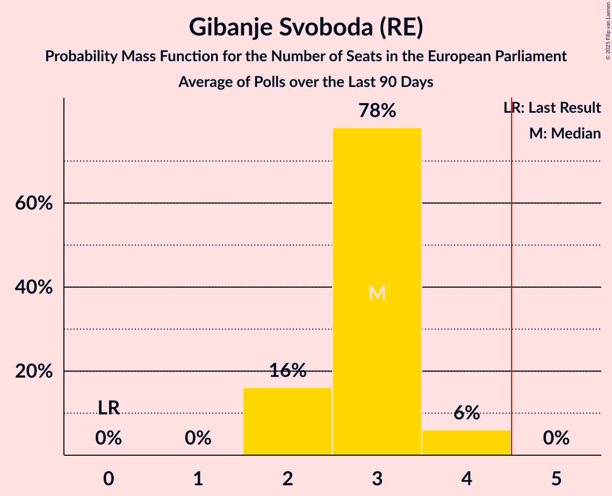

# Gibanje Svoboda (RE)

<a href="#voting-intentions">Voting Intentions</a> | <a href="#seats">Seats</a>

## Voting Intentions

Last result: **0.0%** (General Election of 9 June 2024)

### Confidence Intervals

| Period     | Polling firm/Commissioner(s) | Median | 80% Confidence Interval | 90% Confidence Interval | 95% Confidence Interval | 99% Confidence Interval |
|:----------:|:----------------:|:-----------:|:-----------------------:|:-----------------------:|:-----------------------:|:-----------------------:|
| N/A | [Poll Average](average.html) | 24.7% | 21.2–28.6% | 20.5–29.4% | 20.0–30.0% | 19.0–31.3% |
| [2–5 September 2024](2024-09-05-Mediana.html) | Mediana   Delo | 22.4% | 20.5–24.5% | 20.0–25.1% | 19.5–25.6% | 18.6–26.6% |
| [20–22 August 2024](2024-08-22-Mediana.html) | Mediana   POP TV | 26.0% | 24.0–28.2% | 23.5–28.9% | 23.0–29.4% | 22.0–30.5% |
| [12–14 August 2024](2024-08-14-Ninamedia.html) | Ninamedia   Dnevnik | 27.1% | 25.0–29.4% | 24.3–30.0% | 23.8–30.6% | 22.8–31.7% |
| [5–8 August 2024](2024-08-08-Mediana.html) | Mediana   Delo | 22.2% | N/A | N/A | N/A | N/A |
| [22–25 July 2024](2024-07-25-Mediana.html) | Mediana   POP TV | 26.5% | N/A | N/A | N/A | N/A |
| [15–17 July 2024](2024-07-17-Ninamedia.html) | Ninamedia   Dnevnik | 25.0% | N/A | N/A | N/A | N/A |
| [2–4 July 2024](2024-07-04-Mediana.html) | Mediana   Delo | 22.6% | 20.7–24.7% | 20.2–25.3% | 19.7–25.8% | 18.8–26.8% |
| [18–20 June 2024](2024-06-20-Mediana.html) | Mediana   POP TV | 24.5% | 22.6–26.5% | 22.1–27.1% | 21.7–27.6% | 20.8–28.6% |
| [17–19 June 2024](2024-06-19-Ninamedia.html) | Ninamedia   Dnevnik | 22.1% | 20.2–24.2% | 19.7–24.9% | 19.2–25.4% | 18.3–26.4% |

### Probability Mass Function

The following table shows the probability mass function per percentage block of voting intentions for the [poll average](average.html) for Gibanje Svoboda (RE).

| Voting Intentions | Probability | Accumulated | Special Marks |
|:-----------------:|:-----------:|:-----------:|:-------------:|
| 0.0–0.5% | 0% | 100% | Last Result |
| 0.5–1.5% | 0% | 100% |  |
| 1.5–2.5% | 0% | 100% |  |
| 2.5–3.5% | 0% | 100% |  |
| 3.5–4.5% | 0% | 100% |  |
| 4.5–5.5% | 0% | 100% |  |
| 5.5–6.5% | 0% | 100% |  |
| 6.5–7.5% | 0% | 100% |  |
| 7.5–8.5% | 0% | 100% |  |
| 8.5–9.5% | 0% | 100% |  |
| 9.5–10.5% | 0% | 100% |  |
| 10.5–11.5% | 0% | 100% |  |
| 11.5–12.5% | 0% | 100% |  |
| 12.5–13.5% | 0% | 100% |  |
| 13.5–14.5% | 0% | 100% |  |
| 14.5–15.5% | 0% | 100% |  |
| 15.5–16.5% | 0% | 100% |  |
| 16.5–17.5% | 0% | 100% |  |
| 17.5–18.5% | 0.2% | 100% |  |
| 18.5–19.5% | 1.1% | 99.8% |  |
| 19.5–20.5% | 4% | 98.7% |  |
| 20.5–21.5% | 9% | 95% |  |
| 21.5–22.5% | 12% | 86% |  |
| 22.5–23.5% | 12% | 74% |  |
| 23.5–24.5% | 10% | 62% |  |
| 24.5–25.5% | 9% | 52% | Median |
| 25.5–26.5% | 11% | 43% |  |
| 26.5–27.5% | 12% | 32% |  |
| 27.5–28.5% | 10% | 20% |  |
| 28.5–29.5% | 6% | 10% |  |
| 29.5–30.5% | 3% | 4% |  |
| 30.5–31.5% | 1.0% | 1.3% |  |
| 31.5–32.5% | 0.3% | 0.3% |  |
| 32.5–33.5% | 0.1% | 0.1% |  |
| 33.5–34.5% | 0% | 0% |  |

## Seats

Last result: **0** seats (General Election of 9 June 2024)

### Confidence Intervals

| Period     | Polling firm/Commissioner(s) | Median | 80% Confidence Interval | 90% Confidence Interval | 95% Confidence Interval | 99% Confidence Interval |
|:----------:|:----------------:|:------:|:-----------------------:|:-----------------------:|:-----------------------:|:-----------------------:|
| N/A | [Poll Average](average.html) | 3 | 2–3 | 2–3 | 2–3 | 2–3 |
| [2–5 September 2024](2024-09-05-Mediana.html) | Mediana   Delo | 3 | 2–3 | 2–3 | 2–3 | 2–4 |
| [20–22 August 2024](2024-08-22-Mediana.html) | Mediana   POP TV | 3 | 3 | 3–4 | 3–4 | 2–4 |
| [12–14 August 2024](2024-08-14-Ninamedia.html) | Ninamedia   Dnevnik | 3 | 2–3 | 2–3 | 2–3 | 2–3 |
| [5–8 August 2024](2024-08-08-Mediana.html) | Mediana   Delo |  |  |  |  |  |
| [22–25 July 2024](2024-07-25-Mediana.html) | Mediana   POP TV |  |  |  |  |  |
| [15–17 July 2024](2024-07-17-Ninamedia.html) | Ninamedia   Dnevnik |  |  |  |  |  |
| [2–4 July 2024](2024-07-04-Mediana.html) | Mediana   Delo | 3 | 2–3 | 2–3 | 2–3 | 2–3 |
| [18–20 June 2024](2024-06-20-Mediana.html) | Mediana   POP TV | 3 | 3 | 3 | 3–4 | 3–4 |
| [17–19 June 2024](2024-06-19-Ninamedia.html) | Ninamedia   Dnevnik | 2 | 2–3 | 2–3 | 2–3 | 2–3 |

### Probability Mass Function

The following table shows the probability mass function per seat for the [poll average](average.html) for Gibanje Svoboda (RE).

| Number of Seats | Probability | Accumulated | Special Marks |
|:---------------:|:-----------:|:-----------:|:-------------:|
| 0 | 0% | 100% | Last Result |
| 1 | 0% | 100% |  |
| 2 | 18% | 100% |  |
| 3 | 82% | 82% | Median |
| 4 | 0.5% | 0.5% |  |
| 5 | 0% | 0% | Majority |

