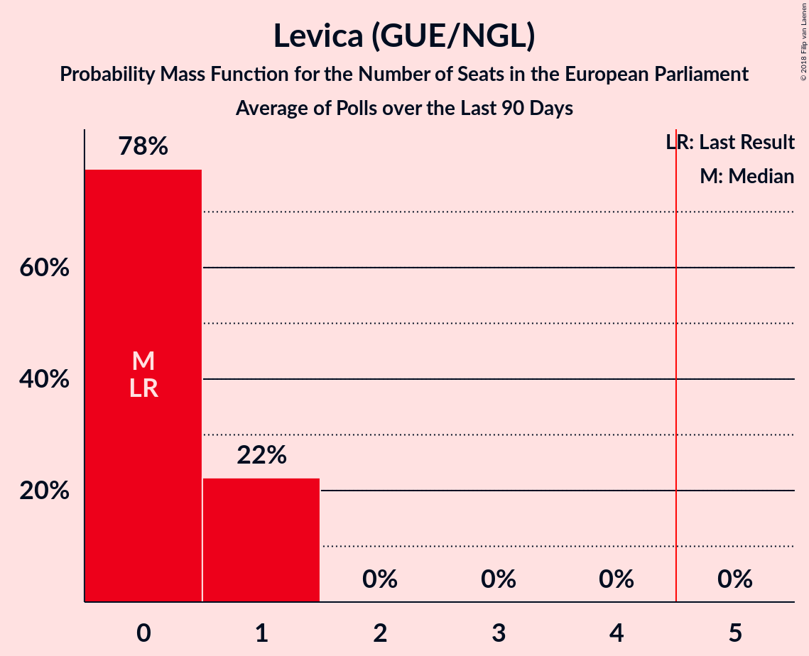

# Levica (GUE/NGL)

<a href="#voting-intentions">Voting Intentions</a> | <a href="#seats">Seats</a>

## Voting Intentions

Last result: **5.5%** (General Election of 26 May 2019)

### Confidence Intervals

| Period     | Polling firm/Commissioner(s) | Median | 80% Confidence Interval | 90% Confidence Interval | 95% Confidence Interval | 99% Confidence Interval |
|:----------:|:----------------:|:-----------:|:-----------------------:|:-----------------------:|:-----------------------:|:-----------------------:|
| N/A | [Poll Average](average.html) | 9.8% | 7.6–11.8% | 7.2–12.3% | 6.8–12.8% | 6.2–13.7% |
| [1 June–18 September 2020](2020-09-18-Parsifal.html) | Parsifal   Nova 24TV | 8.1% | 6.9–9.6% | 6.6–10.0% | 6.3–10.4% | 5.8–11.1% |
| [15–17 September 2020](2020-09-17-Ninamedia.html) | Ninamedia   Dnevnik, Večer | 10.9% | 9.5–12.5% | 9.1–13.0% | 8.8–13.4% | 8.1–14.2% |
| [7–10 September 2020](2020-09-10-Mediana.html) | Mediana   Delo | 9.9% | 8.6–11.5% | 8.3–11.9% | 8.0–12.3% | 7.4–13.1% |
| [1–31 August 2020](2020-08-31-Mediana.html) | Mediana   POPTV | 12.2% | 10.7–13.9% | 10.3–14.4% | 10.0–14.8% | 9.3–15.7% |
| [11–13 August 2020](2020-08-13-Ninamedia.html) | Ninamedia   Dnevnik, Večer | 10.1% | 8.8–11.8% | 8.4–12.2% | 8.1–12.6% | 7.5–13.4% |
| [3–6 August 2020](2020-08-06-Mediana.html) | Mediana   POPTV | 10.9% | 9.7–12.7% | 9.3–13.2% | 8.9–13.6% | 8.3–14.4% |
| [1–26 July 2020](2020-07-26-Mediana.html) | Mediana   POPTV | 14.2% | 12.7–16.0% | 12.2–16.5% | 11.9–17.0% | 11.1–17.9% |
| [6–9 July 2020](2020-07-09-Mediana.html) | Mediana   POPTV | 9.7% | 8.4–11.2% | 8.0–11.6% | 7.7–12.0% | 7.1–12.8% |
| [29 June–2 July 2020](2020-07-02-Parsifal.html) | Parsifal   Nova 24TV | 9.0% | 7.7–10.5% | 7.4–10.9% | 7.1–11.3% | 6.5–12.0% |
| [1–28 June 2020](2020-06-28-Mediana.html) | Mediana   POP TV | 14.2% | 12.7–16.0% | 12.2–16.5% | 11.9–17.0% | 11.1–17.9% |
| [15–17 June 2020](2020-06-17-Parsifal.html) | Parsifal   Nova 24TV | 8.4% | 7.2–9.9% | 6.9–10.3% | 6.6–10.7% | 6.1–11.4% |
| [9–11 June 2020](2020-06-11-Ninamedia.html) | Ninamedia   Dnevnik, Večer | 12.0% | 10.5–13.7% | 10.1–14.2% | 9.8–14.6% | 9.1–15.5% |
| [18–21 May 2020](2020-05-21-Mediana.html) | Mediana   POP TV | 12.1% | 10.7–13.8% | 10.3–14.3% | 9.9–14.7% | 9.3–15.6% |
| [12–13 May 2020](2020-05-13-Ninamedia.html) | Ninamedia   Dnevnik, Večer | 9.9% | 8.5–11.4% | 8.2–11.9% | 7.9–12.3% | 7.3–13.1% |
| [6–8 May 2020](2020-05-08-Parsifal.html) | Parsifal   Nova 24TV | 9.5% | 8.3–11.0% | 8.0–11.4% | 7.7–11.8% | 7.1–12.6% |
| [4–8 May 2020](2020-05-08-Mediana.html) | Mediana   Delo | 12.4% | 10.9–14.1% | 10.5–14.6% | 10.1–15.0% | 9.5–15.9% |
| [26 April 2020](2020-04-26-Mediana.html) | Mediana   POPTV | 12.3% | 10.9–14.0% | 10.5–14.4% | 10.1–14.8% | 9.5–15.7% |
| [14–16 April 2020](2020-04-16-Ninamedia.html) | Ninamedia   Dnevnik, Večer | 10.1% | 8.8–11.8% | 8.4–12.2% | 8.1–12.6% | 7.5–13.4% |
| [6–9 April 2020](2020-04-09-Mediana.html) | Mediana   Delo | 10.4% | 9.0–11.9% | 8.7–12.4% | 8.3–12.8% | 7.7–13.6% |
| [10–12 March 2020](2020-03-12-Ninamedia.html) | Ninamedia   Dnevnik, Večer | 9.3% | 8.0–10.8% | 7.7–11.3% | 7.3–11.7% | 6.8–12.5% |
| [25 February–4 March 2020](2020-03-04-Mediana.html) | Mediana   Delo | 11.1% | 9.7–12.6% | 9.4–13.1% | 9.1–13.5% | 8.4–14.3% |
| [19–20 February 2020](2020-02-20-Parsifal.html) | Parsifal   Nova 24TV | 7.9% | 6.8–9.4% | 6.4–9.8% | 6.2–10.1% | 5.6–10.9% |
| [14 January–16 February 2020](2020-02-16-Ninamedia.html) | Ninamedia   RTV SLO | 9.0% | 7.7–10.5% | 7.4–11.0% | 7.1–11.4% | 6.5–12.1% |
| [12–13 February 2020](2020-02-13-Parsifal.html) | Parsifal   Nova 24 | 7.5% | 6.3–8.9% | 6.0–9.3% | 5.8–9.6% | 5.3–10.3% |
| [11–13 February 2020](2020-02-13-Ninamedia.html) | Ninamedia   RTV SLO | 7.9% | 6.7–9.3% | 6.4–9.7% | 6.1–10.1% | 5.6–10.8% |
| [3–5 February 2020](2020-02-05-Parsifal.html) | Parsifal   Nova 24 | 7.4% | 6.3–8.8% | 6.0–9.2% | 5.7–9.6% | 5.2–10.3% |
| [28 January–3 February 2020](2020-02-03-Mediana.html) | Mediana   Delo | 11.3% | 10.0–12.9% | 9.6–13.4% | 9.3–13.7% | 8.7–14.5% |
| [27–29 January 2020](2020-01-29-Parsifal.html) | Parsifal | 7.2% | 6.3–8.4% | 6.0–8.8% | 5.8–9.1% | 5.3–9.7% |
| [1–26 January 2020](2020-01-26-Mediana.html) | Mediana   POP TV | 11.9% | 10.5–13.5% | 10.1–13.9% | 9.8–14.4% | 9.1–15.2% |
| [3–9 January 2020](2020-01-09-Mediana.html) | Mediana   Delo | 11.2% | 9.8–12.8% | 9.4–13.3% | 9.1–13.7% | 8.5–14.5% |
| [10–12 December 2019](2019-12-12-Ninamedia.html) | Ninamedia   RTV SLO | 9.6% | 8.3–11.1% | 7.9–11.6% | 7.6–12.0% | 7.0–12.8% |
| [1–26 November 2019](2019-11-26-Mediana.html) | Mediana   POP TV | 14.3% | 12.8–16.1% | 12.4–16.6% | 12.0–17.1% | 11.3–18.0% |
| [12–14 November 2019](2019-11-14-Ninamedia.html) | Ninamedia   RTV SLO | 10.1% | 8.8–11.8% | 8.4–12.2% | 8.1–12.6% | 7.5–13.4% |
| [28 October–7 November 2019](2019-11-07-Mediana.html) | Mediana   Delo | 16.6% | 14.9–18.5% | 14.5–19.0% | 14.1–19.5% | 13.3–20.4% |
| [15–17 October 2019](2019-10-17-Ninamedia.html) | Ninamedia   RTV SLO | 9.6% | 8.3–11.1% | 7.9–11.6% | 7.6–12.0% | 7.0–12.8% |
| [1–22 September 2019](2019-09-22-Mediana.html) | Mediana   POP TV | 12.3% | 10.9–14.0% | 10.4–14.5% | 10.1–14.9% | 9.4–15.8% |
| [10–12 September 2019](2019-09-12-Ninamedia.html) | Ninamedia   RTV SLO | 9.6% | 8.3–11.1% | 7.9–11.6% | 7.6–12.0% | 7.0–12.8% |
| [28 August–5 September 2019](2019-09-05-Mediana.html) | Mediana   Delo | 10.3% | 9.0–11.9% | 8.6–12.3% | 8.3–12.7% | 7.7–13.5% |
| [1–25 August 2019](2019-08-25-Mediana.html) | Mediana   POP TV | 7.3% | 6.2–8.7% | 5.9–9.1% | 5.7–9.5% | 5.2–10.2% |
| [12–14 August 2019](2019-08-14-Ninamedia.html) | Ninamedia   RTV SLO and Dnevnik | 9.1% | 7.9–10.7% | 7.5–11.1% | 7.2–11.5% | 6.7–12.3% |
| [31 July–8 August 2019](2019-08-08-Mediana.html) | Mediana   Delo | 9.4% | 8.1–10.9% | 7.8–11.3% | 7.5–11.7% | 6.9–12.5% |
| [11–13 July 2019](2019-07-13-Ninamedia.html) | Ninamedia   RTV SLO and Dnevnik | 8.7% | 7.5–10.2% | 7.1–10.7% | 6.8–11.1% | 6.3–11.8% |
| [1–23 June 2019](2019-06-23-Mediana.html) | Mediana   POP TV | 9.5% | 8.2–11.0% | 7.8–11.5% | 7.5–11.8% | 7.0–12.6% |
| [11–13 June 2019](2019-06-13-Ninamedia.html) | Ninamedia   Dnevnik and Večer | 7.6% | 6.4–9.0% | 6.1–9.4% | 5.8–9.8% | 5.3–10.5% |
| [28 May–6 June 2019](2019-06-06-Mediana.html) | Mediana   POP TV | 9.5% | 8.3–11.1% | 7.9–11.5% | 7.6–11.9% | 7.1–12.6% |

### Probability Mass Function

The following table shows the probability mass function per percentage block of voting intentions for the [poll average](average.html) for Levica (GUE/NGL).

| Voting Intentions | Probability | Accumulated | Special Marks |
|:-----------------:|:-----------:|:-----------:|:-------------:|
| 4.5–5.5% | 0.1% | 100% | Last Result |
| 5.5–6.5% | 1.4% | 99.9% |  |
| 6.5–7.5% | 7% | 98.5% |  |
| 7.5–8.5% | 15% | 91% |  |
| 8.5–9.5% | 21% | 76% |  |
| 9.5–10.5% | 23% | 55% | Median |
| 10.5–11.5% | 19% | 32% |  |
| 11.5–12.5% | 10% | 13% |  |
| 12.5–13.5% | 3% | 4% |  |
| 13.5–14.5% | 0.6% | 0.7% |  |
| 14.5–15.5% | 0.1% | 0.1% |  |
| 15.5–16.5% | 0% | 0% |  |

## Seats

Last result: **0** seats (General Election of 26 May 2019)

### Confidence Intervals

| Period     | Polling firm/Commissioner(s) | Median | 80% Confidence Interval | 90% Confidence Interval | 95% Confidence Interval | 99% Confidence Interval |
|:----------:|:----------------:|:------:|:-----------------------:|:-----------------------:|:-----------------------:|:-----------------------:|
| N/A | [Poll Average](average.html) | 1 | 0–1 | 0–1 | 0–1 | 0–1 |
| [1 June–18 September 2020](2020-09-18-Parsifal.html) | Parsifal   Nova 24TV | 1 | 0–1 | 0–1 | 0–1 | 0–1 |
| [15–17 September 2020](2020-09-17-Ninamedia.html) | Ninamedia   Dnevnik, Večer | 1 | 1 | 1 | 1 | 0–1 |
| [7–10 September 2020](2020-09-10-Mediana.html) | Mediana   Delo | 1 | 1 | 1 | 1 | 0–1 |
| [1–31 August 2020](2020-08-31-Mediana.html) | Mediana   POPTV | 1 | 1 | 1–2 | 1–2 | 1–2 |
| [11–13 August 2020](2020-08-13-Ninamedia.html) | Ninamedia   Dnevnik, Večer | 1 | 1 | 0–1 | 0–1 | 0–1 |
| [3–6 August 2020](2020-08-06-Mediana.html) | Mediana   POPTV | 1 | 1 | 1 | 1 | 1 |
| [1–26 July 2020](2020-07-26-Mediana.html) | Mediana   POPTV | 1 | 1–2 | 1–2 | 1–2 | 1–2 |
| [6–9 July 2020](2020-07-09-Mediana.html) | Mediana   POPTV | 1 | 1 | 1 | 1 | 0–1 |
| [29 June–2 July 2020](2020-07-02-Parsifal.html) | Parsifal   Nova 24TV | 1 | 1 | 0–1 | 0–1 | 0–1 |
| [1–28 June 2020](2020-06-28-Mediana.html) | Mediana   POP TV | 1 | 1–2 | 1–2 | 1–2 | 1–2 |
| [15–17 June 2020](2020-06-17-Parsifal.html) | Parsifal   Nova 24TV | 1 | 0–1 | 0–1 | 0–1 | 0–1 |
| [9–11 June 2020](2020-06-11-Ninamedia.html) | Ninamedia   Dnevnik, Večer | 1 | 1 | 1 | 1 | 1 |
| [18–21 May 2020](2020-05-21-Mediana.html) | Mediana   POP TV | 1 | 1 | 1 | 1 | 1–2 |
| [12–13 May 2020](2020-05-13-Ninamedia.html) | Ninamedia   Dnevnik, Večer | 1 | 1 | 1 | 1 | 0–1 |
| [6–8 May 2020](2020-05-08-Parsifal.html) | Parsifal   Nova 24TV | 1 | 1 | 1 | 1 | 0–1 |
| [4–8 May 2020](2020-05-08-Mediana.html) | Mediana   Delo | 1 | 1 | 1 | 1 | 1–2 |
| [26 April 2020](2020-04-26-Mediana.html) | Mediana   POPTV | 1 | 1 | 1 | 1 | 1 |
| [14–16 April 2020](2020-04-16-Ninamedia.html) | Ninamedia   Dnevnik, Večer | 1 | 1 | 1 | 0–1 | 0–1 |
| [6–9 April 2020](2020-04-09-Mediana.html) | Mediana   Delo | 1 | 1 | 1 | 1 | 1 |
| [10–12 March 2020](2020-03-12-Ninamedia.html) | Ninamedia   Dnevnik, Večer | 1 | 0–1 | 0–1 | 0–1 | 0–1 |
| [25 February–4 March 2020](2020-03-04-Mediana.html) | Mediana   Delo | 1 | 1 | 1 | 1 | 1 |
| [19–20 February 2020](2020-02-20-Parsifal.html) | Parsifal   Nova 24TV | 1 | 0–1 | 0–1 | 0–1 | 0–1 |
| [14 January–16 February 2020](2020-02-16-Ninamedia.html) | Ninamedia   RTV SLO | 1 | 0–1 | 0–1 | 0–1 | 0–1 |
| [12–13 February 2020](2020-02-13-Parsifal.html) | Parsifal   Nova 24 | 1 | 0–1 | 0–1 | 0–1 | 0–1 |
| [11–13 February 2020](2020-02-13-Ninamedia.html) | Ninamedia   RTV SLO | 0 | 0–1 | 0–1 | 0–1 | 0–1 |
| [3–5 February 2020](2020-02-05-Parsifal.html) | Parsifal   Nova 24 | 0 | 0–1 | 0–1 | 0–1 | 0–1 |
| [28 January–3 February 2020](2020-02-03-Mediana.html) | Mediana   Delo | 1 | 1 | 1 | 1–2 | 1–2 |
| [27–29 January 2020](2020-01-29-Parsifal.html) | Parsifal | 1 | 0–1 | 0–1 | 0–1 | 0–1 |
| [1–26 January 2020](2020-01-26-Mediana.html) | Mediana   POP TV | 1 | 1 | 1 | 1 | 1 |
| [3–9 January 2020](2020-01-09-Mediana.html) | Mediana   Delo | 1 | 1 | 1 | 1 | 1 |
| [10–12 December 2019](2019-12-12-Ninamedia.html) | Ninamedia   RTV SLO | 1 | 1 | 1 | 0–1 | 0–1 |
| [1–26 November 2019](2019-11-26-Mediana.html) | Mediana   POP TV | 1 | 1–2 | 1–2 | 1–2 | 1–2 |
| [12–14 November 2019](2019-11-14-Ninamedia.html) | Ninamedia   RTV SLO | 1 | 1 | 0–1 | 0–1 | 0–1 |
| [28 October–7 November 2019](2019-11-07-Mediana.html) | Mediana   Delo | 2 | 1–2 | 1–2 | 1–2 | 1–2 |
| [15–17 October 2019](2019-10-17-Ninamedia.html) | Ninamedia   RTV SLO | 1 | 1 | 1 | 0–1 | 0–1 |
| [1–22 September 2019](2019-09-22-Mediana.html) | Mediana   POP TV | 1 | 1 | 1 | 1 | 1 |
| [10–12 September 2019](2019-09-12-Ninamedia.html) | Ninamedia   RTV SLO | 1 | 1 | 1 | 0–1 | 0–1 |
| [28 August–5 September 2019](2019-09-05-Mediana.html) | Mediana   Delo | 1 | 1 | 1 | 1 | 0–1 |
| [1–25 August 2019](2019-08-25-Mediana.html) | Mediana   POP TV | 1 | 0–1 | 0–1 | 0–1 | 0–1 |
| [12–14 August 2019](2019-08-14-Ninamedia.html) | Ninamedia   RTV SLO and Dnevnik | 1 | 0–1 | 0–1 | 0–1 | 0–1 |
| [31 July–8 August 2019](2019-08-08-Mediana.html) | Mediana   Delo | 1 | 1 | 1 | 0–1 | 0–1 |
| [11–13 July 2019](2019-07-13-Ninamedia.html) | Ninamedia   RTV SLO and Dnevnik | 1 | 0–1 | 0–1 | 0–1 | 0–1 |
| [1–23 June 2019](2019-06-23-Mediana.html) | Mediana   POP TV | 1 | 0–1 | 0–1 | 0–1 | 0–1 |
| [11–13 June 2019](2019-06-13-Ninamedia.html) | Ninamedia   Dnevnik and Večer | 0 | 0–1 | 0–1 | 0–1 | 0–1 |
| [28 May–6 June 2019](2019-06-06-Mediana.html) | Mediana   POP TV | 1 | 1 | 1 | 0–1 | 0–1 |

### Probability Mass Function

The following table shows the probability mass function per seat for the [poll average](average.html) for Levica (GUE/NGL).

| Number of Seats | Probability | Accumulated | Special Marks |
|:---------------:|:-----------:|:-----------:|:-------------:|
| 0 | 11% | 100% | Last Result |
| 1 | 89% | 89% | Median |
| 2 | 0% | 0% |  |

