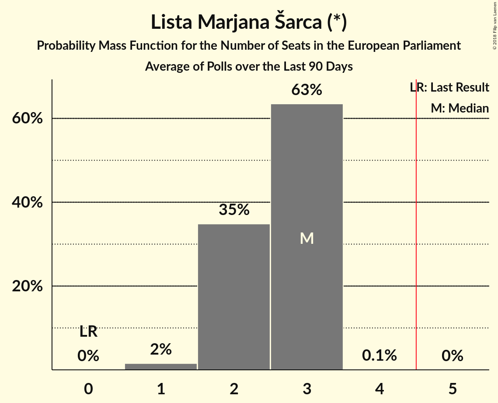

# Lista Marjana Šarca (*)

<a href="#voting-intentions">Voting Intentions</a> | <a href="#seats">Seats</a>

## Voting Intentions

Last result: **0.0%** (General Election of 25 May 2014)

### Confidence Intervals

| Period     | Polling firm/Commissioner(s) | Median | 80% Confidence Interval | 90% Confidence Interval | 95% Confidence Interval | 99% Confidence Interval |
|:----------:|:----------------:|:-----------:|:-----------------------:|:-----------------------:|:-----------------------:|:-----------------------:|
| N/A | [Poll Average](average.html) | 23.0% | 19.3–26.8% | 18.5–27.7% | 17.9–28.5% | 16.6–30.1% |
| [25 March 2018](2018-03-25-Mediana.html) | Mediana   POP TV | 25.6% | 23.0–28.4% | 22.3–29.2% | 21.7–29.9% | 20.5–31.2% |
| [13–15 March 2018](2018-03-15-Ninamedia.html) | Ninamedia   RTV Slovenija–Dnevnik | 20.3% | 18.0–23.0% | 17.3–23.7% | 16.8–24.4% | 15.7–25.7% |
| [10–14 March 2018](2018-03-14-ParsifalSC.html) | Parsifal SC   Nova24TV | 20.9% | 19.1–22.9% | 18.6–23.4% | 18.2–23.9% | 17.4–24.9% |
| [1–8 March 2018](2018-03-08-DeloStik.html) | Delo Stik   Delo | 24.9% | 23.0–26.9% | 22.5–27.5% | 22.0–28.0% | 21.2–29.0% |

### Probability Mass Function

The following table shows the probability mass function per percentage block of voting intentions for the [poll average](average.html) for Lista Marjana Šarca (*).

| Voting Intentions | Probability | Accumulated | Special Marks |
|:-----------------:|:-----------:|:-----------:|:-------------:|
| 0.0–0.5% | 0% | 100% | Last Result |
| 0.5–1.5% | 0% | 100% |  |
| 1.5–2.5% | 0% | 100% |  |
| 2.5–3.5% | 0% | 100% |  |
| 3.5–4.5% | 0% | 100% |  |
| 4.5–5.5% | 0% | 100% |  |
| 5.5–6.5% | 0% | 100% |  |
| 6.5–7.5% | 0% | 100% |  |
| 7.5–8.5% | 0% | 100% |  |
| 8.5–9.5% | 0% | 100% |  |
| 9.5–10.5% | 0% | 100% |  |
| 10.5–11.5% | 0% | 100% |  |
| 11.5–12.5% | 0% | 100% |  |
| 12.5–13.5% | 0% | 100% |  |
| 13.5–14.5% | 0% | 100% |  |
| 14.5–15.5% | 0.1% | 100% |  |
| 15.5–16.5% | 0.4% | 99.9% |  |
| 16.5–17.5% | 1.3% | 99.5% |  |
| 17.5–18.5% | 3% | 98% |  |
| 18.5–19.5% | 7% | 95% |  |
| 19.5–20.5% | 11% | 88% |  |
| 20.5–21.5% | 12% | 77% |  |
| 21.5–22.5% | 11% | 65% |  |
| 22.5–23.5% | 10% | 54% | Median |
| 23.5–24.5% | 11% | 44% |  |
| 24.5–25.5% | 11% | 33% |  |
| 25.5–26.5% | 10% | 22% |  |
| 26.5–27.5% | 6% | 12% |  |
| 27.5–28.5% | 3% | 6% |  |
| 28.5–29.5% | 2% | 2% |  |
| 29.5–30.5% | 0.6% | 0.9% |  |
| 30.5–31.5% | 0.2% | 0.3% |  |
| 31.5–32.5% | 0.1% | 0.1% |  |
| 32.5–33.5% | 0% | 0% |  |

## Seats

Last result: **0** seats (General Election of 25 May 2014)

### Confidence Intervals

| Period     | Polling firm/Commissioner(s) | Median | 80% Confidence Interval | 90% Confidence Interval | 95% Confidence Interval | 99% Confidence Interval |
|:----------:|:----------------:|:------:|:-----------------------:|:-----------------------:|:-----------------------:|:-----------------------:|
| N/A | [Poll Average](average.html) | 3 | 2–3 | 2–3 | 2–3 | 1–3 |
| [25 March 2018](2018-03-25-Mediana.html) | Mediana   POP TV | 3 | 2–3 | 2–3 | 2–3 | 2–4 |
| [13–15 March 2018](2018-03-15-Ninamedia.html) | Ninamedia   RTV Slovenija–Dnevnik | 2 | 2 | 2 | 1–3 | 1–3 |
| [10–14 March 2018](2018-03-14-ParsifalSC.html) | Parsifal SC   Nova24TV | 3 | 2–3 | 2–3 | 2–3 | 2–3 |
| [1–8 March 2018](2018-03-08-DeloStik.html) | Delo Stik   Delo | 3 | 3 | 2–3 | 2–3 | 2–3 |

### Probability Mass Function

The following table shows the probability mass function per seat for the [poll average](average.html) for Lista Marjana Šarca (*).

| Number of Seats | Probability | Accumulated | Special Marks |
|:---------------:|:-----------:|:-----------:|:-------------:|
| 0 | 0% | 100% | Last Result |
| 1 | 0.7% | 100% |  |
| 2 | 39% | 99.3% |  |
| 3 | 60% | 60% | Median |
| 4 | 0.3% | 0.3% |  |
| 5 | 0% | 0% | Majority |

