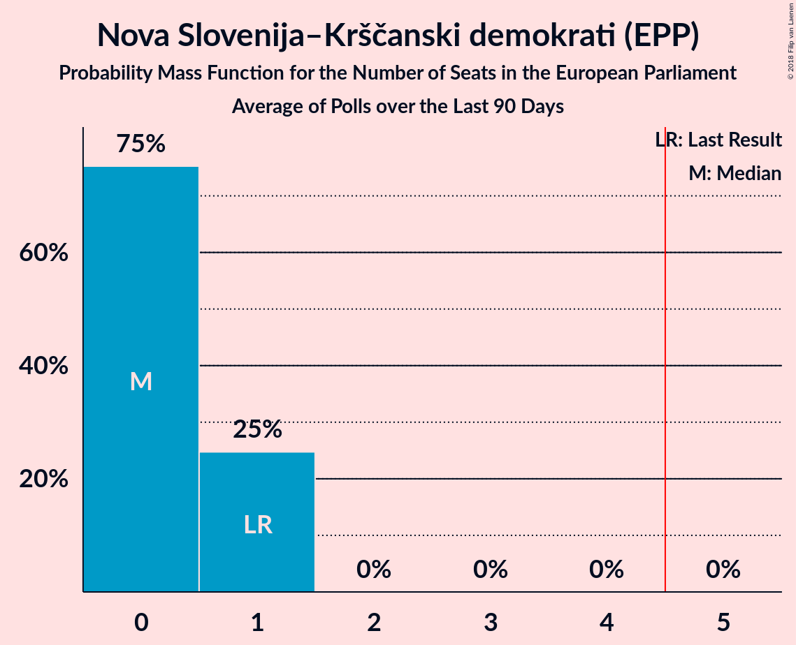

# Nova Slovenija–Krščanski demokrati (EPP)

<a href="#voting-intentions">Voting Intentions</a> | <a href="#seats">Seats</a>

## Voting Intentions

Last result: **16.5%** (General Election of 26 May 2019)

### Confidence Intervals

| Period     | Polling firm/Commissioner(s) | Median | 80% Confidence Interval | 90% Confidence Interval | 95% Confidence Interval | 99% Confidence Interval |
|:----------:|:----------------:|:-----------:|:-----------------------:|:-----------------------:|:-----------------------:|:-----------------------:|
| N/A | [Poll Average](average.html) | 9.8% | 8.2–11.5% | 7.8–12.0% | 7.4–12.5% | 6.8–13.4% |
| [23–25 April 2024](2024-04-25-Mediana.html) | Mediana   POP TV | 9.7% | 8.2–11.5% | 7.8–12.0% | 7.4–12.5% | 6.8–13.4% |
| [5–7 March 2024](2024-03-07-Mediana.html) | Mediana   Delo | 9.1% | N/A | N/A | N/A | N/A |
| [20–22 February 2024](2024-02-22-Mediana.html) | Mediana   POP TV | 7.3% | N/A | N/A | N/A | N/A |
| [12–14 February 2024](2024-02-14-Ninamedia.html) | Ninamedia   Dnevnik | 11.7% | 10.3–13.4% | 9.9–13.9% | 9.5–14.3% | 8.9–15.2% |
| [5–8 February 2024](2024-02-08-Mediana.html) | Mediana   Delo | 7.6% | N/A | N/A | N/A | N/A |
| [22–25 January 2024](2024-01-25-Mediana.html) | Mediana   POP TV | 6.6% | 5.5–7.9% | 5.2–8.3% | 5.0–8.6% | 4.5–9.3% |
| [10–11 January 2024](2024-01-11-Ninamedia.html) | Ninamedia   Dnevnik | 10.6% | 9.2–12.2% | 8.8–12.7% | 8.5–13.1% | 7.9–13.9% |
| [3–4 January 2024](2024-01-04-Mediana.html) | Mediana   Delo | 6.9% | 5.8–8.2% | 5.5–8.6% | 5.2–8.9% | 4.7–9.6% |
| [18–21 December 2023](2023-12-21-Mediana.html) | Mediana   POP TV | 5.2% | 4.3–6.5% | 4.0–6.8% | 3.8–7.1% | 3.4–7.8% |
| [11–14 December 2023](2023-12-14-Ninamedia.html) | Ninamedia   Dnevnik | 10.0% | 8.7–11.6% | 8.3–12.1% | 8.0–12.5% | 7.4–13.3% |
| [4–7 December 2023](2023-12-07-Mediana.html) | Mediana   Delo | 6.7% | 5.6–8.0% | 5.3–8.4% | 5.1–8.7% | 4.6–9.4% |
| [20–24 November 2023](2023-11-24-Mediana.html) | Mediana   POP TV | 6.2% | 5.2–7.5% | 4.9–7.8% | 4.6–8.2% | 4.2–8.9% |
| [13–15 November 2023](2023-11-15-Ninamedia.html) | Ninamedia   Dnevnik | 10.8% | 9.1–13.0% | 8.6–13.6% | 8.2–14.2% | 7.4–15.3% |
| [6–9 November 2023](2023-11-09-Mediana.html) | Mediana   Delo | 10.7% | 9.1–12.7% | 8.6–13.3% | 8.2–13.8% | 7.5–14.8% |
| [17–27 October 2023](2023-10-27-Ninamedia.html) | Ninamedia   Dnevnik | 11.2% | 9.6–13.2% | 9.1–13.7% | 8.8–14.2% | 8.0–15.2% |
| [17–19 October 2023](2023-10-19-Mediana.html) | Mediana   POP TV | 8.0% | 6.8–9.4% | 6.5–9.8% | 6.2–10.2% | 5.7–10.9% |
| [9–11 October 2023](2023-10-11-Ninamedia.html) | Ninamedia   Dnevnik | 12.0% | 10.5–13.7% | 10.1–14.2% | 9.8–14.6% | 9.1–15.5% |
| [2–5 October 2023](2023-10-05-Mediana.html) | Mediana   Delo | 10.2% | 8.9–11.8% | 8.6–12.3% | 8.2–12.7% | 7.6–13.5% |
| [19–21 September 2023](2023-09-21-Mediana.html) | Mediana   POP TV | 6.6% | 5.5–7.9% | 5.2–8.3% | 5.0–8.6% | 4.5–9.3% |
| [11–13 September 2023](2023-09-13-Ninamedia.html) | Ninamedia   Dnevnik | 12.7% | 11.2–14.5% | 10.8–15.0% | 10.4–15.4% | 9.8–16.3% |
| [4–7 September 2023](2023-09-07-Mediana.html) | Mediana   Delo | 7.8% | 6.7–9.3% | 6.4–9.7% | 6.1–10.0% | 5.6–10.8% |
| [22–24 August 2023](2023-08-24-Mediana.html) | Mediana   POP TV | 5.7% | 4.8–7.0% | 4.5–7.4% | 4.3–7.7% | 3.8–8.4% |
| [16–17 August 2023](2023-08-17-Ninamedia.html) | Ninamedia   Dnevnik | 10.0% | 8.7–11.6% | 8.3–12.0% | 8.0–12.4% | 7.4–13.2% |
| [7–10 August 2023](2023-08-10-Mediana.html) | Mediana   Delo | 6.1% | 5.1–7.5% | 4.8–7.8% | 4.6–8.2% | 4.2–8.8% |
| [17–20 July 2023](2023-07-20-Mediana.html) | Mediana   POP TV | 8.6% | 7.4–10.1% | 7.0–10.5% | 6.8–10.9% | 6.2–11.6% |
| [10–12 July 2023](2023-07-12-Ninamedia.html) | Ninamedia   Dnevnik | 9.9% | 8.5–11.4% | 8.2–11.9% | 7.9–12.3% | 7.3–13.1% |
| [3–6 July 2023](2023-07-06-Mediana.html) | Mediana   Delo | 6.7% | 5.6–8.0% | 5.3–8.4% | 5.0–8.7% | 4.6–9.4% |
| [20–22 June 2023](2023-06-22-Mediana.html) | Mediana   POP TV | 8.8% | 7.5–10.3% | 7.2–10.7% | 6.9–11.1% | 6.4–11.8% |
| [12–14 June 2023](2023-06-14-Ninamedia.html) | Ninamedia   Dnevnik | 10.1% | 8.8–11.8% | 8.4–12.2% | 8.1–12.6% | 7.5–13.4% |
| [5–8 June 2023](2023-06-08-Mediana.html) | Mediana   Delo | 7.0% | 5.9–8.4% | 5.6–8.8% | 5.4–9.1% | 4.9–9.8% |
| [20–25 May 2023](2023-05-25-Mediana.html) | Mediana   POP TV | 7.3% | 6.2–8.7% | 5.9–9.1% | 5.6–9.5% | 5.1–10.2% |
| [8–10 May 2023](2023-05-10-Ninamedia.html) | Ninamedia   Dnevnik | 10.1% | 8.8–11.8% | 8.4–12.2% | 8.1–12.6% | 7.5–13.4% |
| [3–4 May 2023](2023-05-04-Mediana.html) | Mediana   Delo | 9.5% | 8.2–11.1% | 7.9–11.5% | 7.6–11.9% | 7.0–12.7% |
| [17–20 April 2023](2023-04-20-Mediana.html) | Mediana   POP TV | 7.6% | 6.4–8.9% | 6.1–9.3% | 5.8–9.7% | 5.3–10.4% |
| [11–13 April 2023](2023-04-13-Ninamedia.html) | Ninamedia   Dnevnik | 10.1% | 8.8–11.7% | 8.4–12.2% | 8.1–12.6% | 7.5–13.4% |
| [3–7 April 2023](2023-04-07-Mediana.html) | Mediana   Delo | 7.6% | 6.5–9.1% | 6.2–9.5% | 5.9–9.8% | 5.4–10.6% |
| [20–23 March 2023](2023-03-23-Mediana.html) | Mediana   POP TV | 7.1% | 6.0–8.5% | 5.7–8.8% | 5.4–9.2% | 4.9–9.9% |
| [13–15 March 2023](2023-03-15-Ninamedia.html) | Ninamedia   Dnevnik | 10.1% | 8.8–11.8% | 8.4–12.2% | 8.1–12.6% | 7.5–13.4% |
| [6–9 March 2023](2023-03-09-Mediana.html) | Mediana   Delo | 7.8% | 6.7–9.3% | 6.4–9.7% | 6.1–10.0% | 5.6–10.8% |
| [21–23 February 2023](2023-02-23-Mediana.html) | Mediana   POP TV | 8.6% | 7.3–10.0% | 7.0–10.4% | 6.7–10.8% | 6.1–11.5% |
| [13–15 February 2023](2023-02-15-Ninamedia.html) | Ninamedia   Dnevnik | 10.1% | 8.8–11.8% | 8.4–12.2% | 8.1–12.6% | 7.5–13.4% |
| [6–10 February 2023](2023-02-10-Mediana.html) | Mediana   Delo | 7.8% | 6.5–9.1% | 6.2–9.5% | 5.9–9.9% | 5.4–10.6% |
| [16–19 January 2023](2023-01-19-Mediana.html) | Mediana   POP TV | 7.5% | 6.4–9.0% | 6.1–9.4% | 5.8–9.7% | 5.3–10.5% |
| [9–12 January 2023](2023-01-12-Ninamedia.html) | Ninamedia   Dnevnik | 11.9% | 10.4–13.6% | 10.0–14.1% | 9.7–14.5% | 9.0–15.3% |
| [3–5 January 2023](2023-01-05-Mediana.html) | Mediana   Delo | 7.2% | 6.0–8.5% | 5.7–8.9% | 5.5–9.3% | 5.0–10.0% |
| [19–22 December 2022](2022-12-22-Mediana.html) | Mediana   POP TV | 10.4% | 9.1–12.0% | 8.7–12.5% | 8.4–12.9% | 7.8–13.7% |
| [12–14 December 2022](2022-12-14-Ninamedia.html) | Ninamedia   Dnevnik and Večer | 11.9% | 10.4–13.6% | 10.0–14.1% | 9.7–14.5% | 9.0–15.3% |
| [5–8 December 2022](2022-12-08-Mediana.html) | Mediana   Delo | 9.1% | 7.8–10.6% | 7.5–11.0% | 7.2–11.4% | 6.6–12.1% |
| [21–24 November 2022](2022-11-24-Mediana.html) | Mediana   POP TV | 7.7% | 6.6–9.2% | 6.3–9.6% | 6.0–9.9% | 5.5–10.7% |
| [7–10 November 2022](2022-11-10-Ninamedia.html) | Ninamedia   Dnevnik and Večer | 11.9% | 10.4–13.6% | 10.0–14.1% | 9.7–14.5% | 9.0–15.3% |
| [7–9 November 2022](2022-11-09-Mediana.html) | Mediana   Delo | 8.5% | 7.3–10.0% | 7.0–10.4% | 6.7–10.8% | 6.1–11.5% |
| [17–19 October 2022](2022-10-19-Mediana.html) | Mediana   POP TV | 9.7% | 8.4–11.2% | 8.0–11.7% | 7.7–12.0% | 7.1–12.8% |
| [10–13 October 2022](2022-10-13-Ninamedia.html) | Ninamedia   Dnevnik and Večer | 12.4% | 11.1–13.8% | 10.8–14.2% | 10.5–14.6% | 9.9–15.3% |
| [3–6 October 2022](2022-10-06-Mediana.html) | Mediana   Delo | 7.9% | 6.8–9.4% | 6.4–9.8% | 6.2–10.1% | 5.7–10.9% |
| [26–28 September 2022](2022-09-28-Valicon.html) | Valicon   RTV SLO | 7.1% | 6.3–8.0% | 6.1–8.3% | 5.9–8.5% | 5.6–9.0% |
| [12–19 September 2022](2022-09-19-Mediana.html) | Mediana   POP TV | 6.3% | 5.3–7.6% | 5.0–8.0% | 4.8–8.3% | 4.3–9.0% |
| [12–15 September 2022](2022-09-15-Ninamedia.html) | Ninamedia   Dnevnik and Večer | 11.3% | 9.9–13.0% | 9.5–13.4% | 9.1–13.9% | 8.5–14.7% |
| [5–8 September 2022](2022-09-08-Mediana.html) | Mediana   Delo | 9.7% | N/A | N/A | N/A | N/A |
| [29–31 August 2022](2022-08-31-Parsifal.html) | Parsifal   Planet TV | 7.0% | 5.9–8.4% | 5.6–8.7% | 5.3–9.1% | 4.8–9.8% |
| [22–25 August 2022](2022-08-25-Mediana.html) | Mediana   POP TV | 6.8% | 5.7–8.2% | 5.4–8.5% | 5.2–8.9% | 4.7–9.6% |
| [8–10 August 2022](2022-08-10-Ninamedia.html) | Ninamedia   Dnevnik and Večer | 10.6% | 9.2–12.2% | 8.8–12.7% | 8.5–13.1% | 7.9–13.9% |
| [1–4 August 2022](2022-08-04-Mediana.html) | Mediana   Delo | 8.7% | 7.4–10.2% | 7.1–10.6% | 6.8–11.0% | 6.3–11.7% |
| [18–21 July 2022](2022-07-21-Mediana.html) | Mediana   POP TV | 9.8% | 8.5–11.3% | 8.1–11.7% | 7.8–12.1% | 7.2–12.9% |
| [4–7 July 2022](2022-07-07-Mediana.html) | Mediana   Delo | 8.5% | 7.3–10.0% | 7.0–10.4% | 6.7–10.8% | 6.2–11.6% |
| [20–23 June 2022](2022-06-23-Mediana.html) | Mediana   POP TV | 8.3% | 7.1–9.8% | 6.8–10.2% | 6.5–10.6% | 6.0–11.3% |
| [14–16 June 2022](2022-06-16-Ninamedia.html) | Ninamedia   Dnevnik and Večer | 8.5% | 7.3–10.1% | 7.0–10.5% | 6.7–10.9% | 6.2–11.6% |
| [6–9 June 2022](2022-06-09-Mediana.html) | Mediana   Delo | 8.5% | 7.3–10.0% | 7.0–10.5% | 6.7–10.8% | 6.2–11.6% |
| [24–26 May 2022](2022-05-26-Parsifal.html) | Parsifal   Planet TV | 8.4% | 7.1–9.8% | 6.8–10.3% | 6.5–10.6% | 6.0–11.4% |
| [16–19 May 2022](2022-05-19-Parsifal.html) | Parsifal   Nova24TV | 10.7% | 9.3–12.3% | 8.9–12.8% | 8.6–13.2% | 8.0–14.0% |
| [16–19 May 2022](2022-05-19-Mediana.html) | Mediana   POP TV | 5.1% | 4.2–6.3% | 3.9–6.7% | 3.7–7.0% | 3.3–7.6% |
| [10–12 May 2022](2022-05-12-Ninamedia.html) | Ninamedia   Dnevnik and Večer | 6.7% | 5.6–8.1% | 5.3–8.5% | 5.1–8.8% | 4.6–9.5% |
| [3–5 May 2022](2022-05-05-Mediana.html) | Mediana   Delo | 8.5% | 7.3–10.0% | 6.9–10.4% | 6.6–10.7% | 6.1–11.5% |
| [20–22 April 2022](2022-04-22-Ninamedia.html) | Ninamedia   Dnevnik and Večer | 6.9% | 5.9–8.1% | 5.6–8.4% | 5.4–8.7% | 5.0–9.4% |
| [19–21 April 2022](2022-04-21-Mediana.html) | Mediana   Delo and POP TV | 7.9% | 7.0–9.1% | 6.7–9.5% | 6.4–9.8% | 6.0–10.4% |
| [14–19 April 2022](2022-04-19-Parsifal.html) | Parsifal   TS media | 6.6% | 5.6–7.7% | 5.4–8.0% | 5.2–8.3% | 4.7–8.9% |
| [13–15 April 2022](2022-04-15-Ninamedia.html) | Ninamedia   Dnevnik and Večer | 7.7% | N/A | N/A | N/A | N/A |
| [4–7 April 2022](2022-04-07-Ninamedia.html) | Ninamedia   Dnvnk, PrmNvc, Svt24 and Včr | 4.5% | 3.7–5.4% | 3.6–5.7% | 3.4–5.9% | 3.1–6.4% |
| [4–7 April 2022](2022-04-07-Mediana.html) | Mediana   Delo and POP TV | 6.8% | 5.9–7.9% | 5.6–8.2% | 5.4–8.5% | 5.0–9.1% |
| [1–5 April 2022](2022-04-05-Parsifal.html) | Parsifal   Nova24TV | 6.1% | 5.2–7.3% | 4.9–7.6% | 4.7–7.9% | 4.3–8.5% |
| [30–31 March 2022](2022-03-31-Mediana.html) | Mediana   RTV SLO | 6.3% | 5.5–7.4% | 5.2–7.7% | 5.0–8.0% | 4.6–8.6% |
| [22–24 March 2022](2022-03-24-Parsifal.html) | Parsifal   Planet TV | 4.7% | 3.9–5.6% | 3.7–5.9% | 3.5–6.1% | 3.2–6.6% |
| [21–24 March 2022](2022-03-24-Ninamedia.html) | Ninamedia   Dnvnk, PrmNvc, Svt24 and Včr | 6.3% | 5.4–7.4% | 5.2–7.7% | 5.0–7.9% | 4.6–8.5% |
| [7–10 March 2022](2022-03-10-Ninamedia.html) | Ninamedia   Dnevnik and Večer | 5.7% | N/A | N/A | N/A | N/A |
| [7–10 March 2022](2022-03-10-Mediana.html) | Mediana   Delo | 6.0% | N/A | N/A | N/A | N/A |
| [28 February–3 March 2022](2022-03-03-Mediana.html) | Mediana   RTV SLO | 7.0% | 6.1–8.1% | 5.8–8.4% | 5.6–8.7% | 5.2–9.3% |
| [23–25 February 2022](2022-02-25-Parsifal.html) | Parsifal   Planet TV | 5.2% | 4.2–6.5% | 3.9–6.8% | 3.7–7.1% | 3.3–7.8% |
| [21–24 February 2022](2022-02-24-Mediana.html) | Mediana   POP TV | 5.9% | 4.9–7.3% | 4.6–7.7% | 4.4–8.0% | 3.9–8.7% |
| [21–23 February 2022](2022-02-23-Ninamedia.html) | Ninamedia   Dnvnk, PrmNvc, Svt24 and Včr | 4.9% | 4.1–5.8% | 3.9–6.1% | 3.7–6.3% | 3.4–6.8% |
| [14 March–17 February 2022](2022-02-17-Parsifal.html) | Parsifal   Nova24TV | 4.2% | N/A | N/A | N/A | N/A |
| [14–16 February 2022](2022-02-16-Parsifal.html) | Parsifal   Nova24TV | 3.9% | 3.1–5.0% | 2.9–5.3% | 2.7–5.6% | 2.4–6.2% |
| [7–10 February 2022](2022-02-10-Ninamedia.html) | Ninamedia   Dnvnk, PrmNvc, Svt24 and Včr | 5.6% | N/A | N/A | N/A | N/A |
| [7–10 February 2022](2022-02-10-Mediana.html) | Mediana   Delo | 6.8% | 5.7–8.1% | 5.4–8.5% | 5.1–8.9% | 4.7–9.6% |
| [31 January–3 February 2022](2022-02-03-Mediana.html) | Mediana   RTV SLO | 6.1% | N/A | N/A | N/A | N/A |
| [1–30 January 2022](2022-01-30-Parsifal.html) | Parsifal   Planet TV | 6.8% | 5.7–8.2% | 5.4–8.6% | 5.2–8.9% | 4.7–9.6% |
| [25–27 January 2022](2022-01-27-Ninamedia.html) | Ninamedia   Dnvnk, PrmNvc, Svt24 and Včr | 6.3% | 5.4–7.4% | 5.2–7.7% | 5.0–7.9% | 4.6–8.5% |
| [17–19 January 2022](2022-01-19-Mediana.html) | Mediana   POP TV | 7.7% | 6.4–9.1% | 6.1–9.5% | 5.8–9.9% | 5.3–10.6% |
| [11–14 January 2022](2022-01-14-Ninamedia.html) | Ninamedia   Dnevnik and Večer | 6.0% | N/A | N/A | N/A | N/A |
| [11–13 January 2022](2022-01-13-Ninamedia.html) | Ninamedia   Dnevnik and Večer | 8.5% | N/A | N/A | N/A | N/A |
| [4–6 January 2022](2022-01-06-Parsifal.html) | Parsifal   Planet TV | 8.9% | N/A | N/A | N/A | N/A |
| [27–29 December 2021](2021-12-29-Mediana.html) | Mediana   RTV SLO | 6.8% | N/A | N/A | N/A | N/A |
| [20–23 December 2021](2021-12-23-Mediana.html) | Mediana   POP TV | 9.4% | N/A | N/A | N/A | N/A |
| [13–16 December 2021](2021-12-16-Parsifal.html) | Parsifal   Nova 24TV | 7.7% | N/A | N/A | N/A | N/A |
| [14–16 December 2021](2021-12-16-Ninamedia.html) | Ninamedia   Dnevnik and Večer | 10.9% | N/A | N/A | N/A | N/A |
| [6–9 December 2021](2021-12-09-Mediana.html) | Mediana   Delo | 8.2% | N/A | N/A | N/A | N/A |
| [2–7 December 2021](2021-12-07-Ninamedia.html) | Ninamedia   Dnevnik and Večer | 7.1% | N/A | N/A | N/A | N/A |
| [29 November–2 December 2021](2021-12-02-Mediana.html) | Mediana   RTV SLO | 8.6% | 7.6–9.8% | 7.3–10.2% | 7.0–10.5% | 6.6–11.1% |
| [1–28 November 2021](2021-11-28-Mediana.html) | Mediana   POP TV | 7.7% | 6.6–9.2% | 6.3–9.6% | 6.0–10.0% | 5.5–10.7% |
| [9–11 November 2021](2021-11-11-Ninamedia.html) | Ninamedia   Dnevnik and Večer | 10.4% | 9.1–12.1% | 8.7–12.5% | 8.4–12.9% | 7.8–13.7% |
| [20 September–4 November 2021](2021-11-04-Parsifal.html) | Parsifal   Nova 24TV | 6.4% | 6.0–6.9% | 5.8–7.0% | 5.7–7.1% | 5.5–7.3% |
| [2–4 November 2021](2021-11-04-Mediana.html) | Mediana   Delo | 9.3% | 8.0–10.9% | 7.7–11.3% | 7.4–11.7% | 6.8–12.5% |
| [1–24 October 2021](2021-10-24-Mediana.html) | Mediana   POP TV | 7.4% | N/A | N/A | N/A | N/A |
| [12–14 October 2021](2021-10-14-Ninamedia.html) | Ninamedia   Dnevnik and Večer | 8.6% | N/A | N/A | N/A | N/A |
| [4–7 October 2021](2021-10-07-Mediana.html) | Mediana   Delo | 8.2% | N/A | N/A | N/A | N/A |
| [1–26 September 2021](2021-09-26-Mediana.html) | Mediana   POP TV | 7.1% | N/A | N/A | N/A | N/A |
| [14–16 September 2021](2021-09-16-Ninamedia.html) | Ninamedia   Dnevnik and Večer | 8.1% | N/A | N/A | N/A | N/A |
| [6–9 September 2021](2021-09-09-Mediana.html) | Mediana   Delo | 6.8% | N/A | N/A | N/A | N/A |
| [30 August–2 September 2021](2021-09-02-Parsifal.html) | Parsifal   Nova 24TV | 4.1% | N/A | N/A | N/A | N/A |
| [1–22 August 2021](2021-08-22-Mediana.html) | Mediana   POP TV | 8.8% | N/A | N/A | N/A | N/A |
| [10–12 August 2021](2021-08-12-Ninamedia.html) | Ninamedia   Dnevnik and Večer | 8.9% | N/A | N/A | N/A | N/A |
| [2–5 August 2021](2021-08-05-Mediana.html) | Mediana   Delo | 5.6% | N/A | N/A | N/A | N/A |
| [1–25 July 2021](2021-07-25-Mediana.html) | Mediana   POP TV | 6.4% | 5.4–7.8% | 5.1–8.2% | 4.9–8.5% | 4.4–9.2% |
| [13–15 July 2021](2021-07-15-Ninamedia.html) | Ninamedia   Dnevnik and Večer | 7.5% | 6.4–9.0% | 6.1–9.4% | 5.8–9.8% | 5.3–10.5% |
| [5–7 July 2021](2021-07-07-Mediana.html) | Mediana   Delo | 8.5% | 7.2–9.9% | 6.9–10.4% | 6.6–10.7% | 6.1–11.5% |
| [1–28 June 2021](2021-06-28-Mediana.html) | Mediana   POP TV | 7.3% | 6.2–8.7% | 5.9–9.1% | 5.6–9.5% | 5.1–10.2% |
| [15–17 June 2021](2021-06-17-Ninamedia.html) | Ninamedia   Dnevnik and Večer | 10.9% | 9.5–12.5% | 9.1–13.0% | 8.8–13.4% | 8.1–14.2% |
| [10–15 June 2021](2021-06-15-Episcenter.html) | Episcenter   Domovina | 11.0% | 9.6–13.0% | 9.2–13.5% | 8.8–14.0% | 8.1–14.9% |
| [7–10 June 2021](2021-06-10-Mediana.html) | Mediana   Delo | 5.2% | 4.3–6.4% | 4.0–6.8% | 3.8–7.1% | 3.4–7.7% |
| [24–26 May 2021](2021-05-26-Parsifal.html) | Parsifal   Planet TV | 7.8% | 6.7–9.3% | 6.4–9.6% | 6.1–10.0% | 5.6–10.7% |
| [1–23 May 2021](2021-05-23-Mediana.html) | Mediana   POP TV | 6.8% | 5.7–8.1% | 5.4–8.5% | 5.1–8.8% | 4.7–9.5% |
| [10–13 May 2021](2021-05-13-Parsifal.html) | Parsifal   Nova 24TV | 7.0% | 5.9–8.4% | 5.6–8.8% | 5.4–9.1% | 4.9–9.8% |
| [11–13 May 2021](2021-05-13-Ninamedia.html) | Ninamedia   Dnevnik and Večer | 11.7% | 10.3–13.4% | 9.9–13.9% | 9.5–14.3% | 8.9–15.2% |
| [3–6 May 2021](2021-05-06-Mediana.html) | Mediana   Delo | 6.7% | 5.7–8.1% | 5.4–8.5% | 5.1–8.8% | 4.6–9.5% |
| [1–25 April 2021](2021-04-25-Mediana.html) | Mediana   POP TV | 7.8% | 6.7–9.3% | 6.4–9.7% | 6.1–10.1% | 5.6–10.8% |
| [13–15 April 2021](2021-04-15-Ninamedia.html) | Ninamedia   Dnevnik and Večer | 11.6% | 10.2–13.3% | 9.7–13.7% | 9.4–14.2% | 8.8–15.0% |
| [12–14 April 2021](2021-04-14-Parsifal.html) | Parsifal   Nova 24TV | 6.4% | 5.4–7.7% | 5.1–8.1% | 4.9–8.4% | 4.5–9.1% |
| [1–28 March 2021](2021-03-28-Mediana.html) | Mediana   POP TV | 6.7% | 5.7–8.1% | 5.4–8.5% | 5.1–8.8% | 4.6–9.5% |
| [8–12 March 2021](2021-03-12-Mediana.html) | Mediana   Delo | 7.3% | 6.1–8.7% | 5.8–9.1% | 5.6–9.4% | 5.1–10.1% |
| [9–11 March 2021](2021-03-11-Ninamedia.html) | Ninamedia   Dnevnik and Večer | 6.6% | 5.5–7.9% | 5.2–8.3% | 5.0–8.7% | 4.5–9.4% |
| [1–4 March 2021](2021-03-04-Parsifal.html) | Parsifal   Nova 24TV | 6.8% | 5.8–8.2% | 5.5–8.6% | 5.2–8.9% | 4.7–9.6% |
| [1–28 February 2021](2021-02-28-Mediana.html) | Mediana   POP TV | 6.5% | 5.4–7.8% | 5.1–8.2% | 4.9–8.5% | 4.4–9.2% |
| [9–11 February 2021](2021-02-11-Ninamedia.html) | Ninamedia   Dnevnik and Večer | 6.6% | 5.5–7.9% | 5.2–8.3% | 5.0–8.7% | 4.5–9.4% |
| [9–11 February 2021](2021-02-11-Mediana.html) | Mediana   Delo | 7.3% | 6.2–8.7% | 5.9–9.1% | 5.6–9.5% | 5.1–10.2% |
| [25–28 January 2021](2021-01-28-Parsifal.html) | Parsifal   Nova 24TV | 5.6% | 4.6–6.8% | 4.4–7.2% | 4.2–7.5% | 3.7–8.2% |
| [8–25 January 2021](2021-01-25-Mediana.html) | Mediana   Delo | 7.7% | 6.6–9.2% | 6.3–9.6% | 6.0–10.0% | 5.5–10.7% |
| [12–14 January 2021](2021-01-14-Ninamedia.html) | Ninamedia   Dnevnik | 7.1% | 6.0–8.6% | 5.7–8.9% | 5.5–9.3% | 5.0–10.0% |
| [4–7 January 2021](2021-01-07-Mediana.html) | Mediana   Delo | 8.0% | 6.8–9.4% | 6.4–9.8% | 6.2–10.2% | 5.7–10.9% |
| [1–30 December 2020](2020-12-30-CRJM.html) | CRJM   Delo | 6.2% | 5.3–7.3% | 5.0–7.6% | 4.8–7.9% | 4.4–8.5% |
| [1–28 December 2020](2020-12-28-Mediana.html) | Mediana   Delo | 9.0% | 7.7–10.5% | 7.4–10.9% | 7.1–11.3% | 6.5–12.1% |
| [21–23 December 2020](2020-12-23-Parsifal.html) | Parsifal   Nova 24TV | 4.0% | 3.2–5.0% | 3.0–5.3% | 2.8–5.6% | 2.5–6.2% |
| [15–17 December 2020](2020-12-17-Ninamedia.html) | Ninamedia   Dnevnik | 5.6% | 4.6–6.8% | 4.3–7.2% | 4.1–7.5% | 3.7–8.2% |
| [7–9 December 2020](2020-12-09-Parsifal.html) | Parsifal   Nova 24TV | 10.2% | 8.9–11.8% | 8.5–12.2% | 8.2–12.6% | 7.6–13.4% |
| [7–9 December 2020](2020-12-09-Mediana.html) | Mediana   Delo | 7.1% | 6.1–8.6% | 5.8–9.0% | 5.5–9.3% | 5.0–10.0% |
| [1–23 November 2020](2020-11-23-Mediana.html) | Mediana   POP TV | 6.5% | 5.4–7.8% | 5.1–8.2% | 4.9–8.5% | 4.4–9.2% |
| [10–12 November 2020](2020-11-12-Ninamedia.html) | Ninamedia   Dnevnik and Večer | 6.6% | 5.5–7.9% | 5.2–8.3% | 5.0–8.7% | 4.5–9.4% |
| [2–5 November 2020](2020-11-05-Mediana.html) | Mediana   Delo | 8.5% | 7.3–10.0% | 6.9–10.4% | 6.6–10.7% | 6.1–11.5% |
| [2–4 November 2020](2020-11-04-Parsifal.html) | Parsifal   Nova 24TV | 6.4% | 5.3–7.7% | 5.1–8.1% | 4.8–8.5% | 4.4–9.1% |
| [1–25 October 2020](2020-10-25-Mediana.html) | Mediana   POP TV | 7.6% | 6.4–9.0% | 6.1–9.4% | 5.8–9.7% | 5.3–10.5% |
| [13–15 October 2020](2020-10-15-Ninamedia.html) | Ninamedia   Dnevnik and Večer | 8.6% | 7.3–10.1% | 7.0–10.5% | 6.7–10.9% | 6.2–11.6% |
| [1–8 October 2020](2020-10-08-Mediana.html) | Mediana   POP TV | 7.7% | 6.6–9.2% | 6.2–9.6% | 6.0–9.9% | 5.5–10.7% |
| [1–27 September 2020](2020-09-27-Mediana.html) | Mediana   POP TV | 8.7% | 7.5–10.2% | 7.1–10.6% | 6.8–11.0% | 6.3–11.8% |
| [1 June–18 September 2020](2020-09-18-Parsifal.html) | Parsifal   Nova 24TV | 4.6% | 3.7–5.7% | 3.5–6.1% | 3.2–6.4% | 2.9–7.0% |
| [15–17 September 2020](2020-09-17-Ninamedia.html) | Ninamedia   Dnevnik and Večer | 7.9% | 6.7–9.3% | 6.4–9.7% | 6.1–10.1% | 5.6–10.8% |
| [7–10 September 2020](2020-09-10-Mediana.html) | Mediana   Delo | 5.2% | 4.3–6.5% | 4.1–6.8% | 3.8–7.1% | 3.4–7.8% |
| [1–31 August 2020](2020-08-31-Mediana.html) | Mediana   POPTV | 6.9% | 5.8–8.2% | 5.5–8.6% | 5.2–9.0% | 4.8–9.7% |
| [11–13 August 2020](2020-08-13-Ninamedia.html) | Ninamedia   Dnevnik and Večer | 8.9% | 7.6–10.4% | 7.3–10.8% | 7.0–11.2% | 6.4–12.0% |
| [3–6 August 2020](2020-08-06-Mediana.html) | Mediana   POP TV | 7.7% | 6.6–9.1% | 6.2–9.5% | 6.0–9.9% | 5.4–10.6% |
| [1–26 July 2020](2020-07-26-Mediana.html) | Mediana   POPTV | 5.9% | 4.9–7.1% | 4.6–7.5% | 4.4–7.8% | 3.9–8.5% |
| [6–9 July 2020](2020-07-09-Mediana.html) | Mediana   POP TV | 6.3% | 5.3–7.7% | 5.0–8.0% | 4.8–8.4% | 4.3–9.0% |
| [29 June–2 July 2020](2020-07-02-Parsifal.html) | Parsifal   Nova 24TV | 5.3% | 4.4–6.6% | 4.1–6.9% | 3.9–7.2% | 3.5–7.8% |
| [1–28 June 2020](2020-06-28-Mediana.html) | Mediana   POP TV | 7.7% | 6.5–9.1% | 6.2–9.5% | 5.9–9.9% | 5.4–10.6% |
| [15–17 June 2020](2020-06-17-Parsifal.html) | Parsifal   Nova 24TV | 7.7% | 6.6–9.2% | 6.3–9.6% | 6.0–9.9% | 5.5–10.7% |
| [9–11 June 2020](2020-06-11-Ninamedia.html) | Ninamedia   Dnevnik and Večer | 5.7% | 4.7–7.0% | 4.5–7.4% | 4.2–7.7% | 3.8–8.4% |
| [18–21 May 2020](2020-05-21-Mediana.html) | Mediana   POP TV | 6.1% | 5.1–7.4% | 4.8–7.8% | 4.6–8.1% | 4.1–8.8% |
| [12–13 May 2020](2020-05-13-Ninamedia.html) | Ninamedia   Dnevnik and Večer | 6.7% | 5.5–7.9% | 5.2–8.3% | 5.0–8.7% | 4.5–9.4% |
| [6–8 May 2020](2020-05-08-Parsifal.html) | Parsifal   Nova 24TV | 6.2% | 5.2–7.4% | 4.9–7.8% | 4.7–8.1% | 4.3–8.7% |
| [4–8 May 2020](2020-05-08-Mediana.html) | Mediana   Delo | 8.1% | 7.0–9.6% | 6.6–10.0% | 6.4–10.4% | 5.8–11.1% |
| [26 April 2020](2020-04-26-Mediana.html) | Mediana   POPTV | 6.4% | 5.3–7.7% | 5.0–8.0% | 4.8–8.3% | 4.4–9.0% |
| [14–16 April 2020](2020-04-16-Ninamedia.html) | Ninamedia   Dnevnik and Večer | 7.9% | 6.7–9.3% | 6.4–9.7% | 6.1–10.1% | 5.6–10.8% |
| [6–9 April 2020](2020-04-09-Mediana.html) | Mediana   Delo | 6.1% | 5.1–7.4% | 4.8–7.7% | 4.6–8.1% | 4.1–8.7% |
| [10–12 March 2020](2020-03-12-Ninamedia.html) | Ninamedia   Dnevnik and Večer | 9.1% | 7.9–10.7% | 7.5–11.1% | 7.2–11.5% | 6.7–12.3% |
| [25 February–4 March 2020](2020-03-04-Mediana.html) | Mediana   Delo | 7.9% | 6.7–9.2% | 6.4–9.6% | 6.2–10.0% | 5.7–10.7% |
| [19–20 February 2020](2020-02-20-Parsifal.html) | Parsifal   Nova 24TV | 5.3% | 4.3–6.5% | 4.1–6.9% | 3.9–7.2% | 3.5–7.8% |
| [14 January–16 February 2020](2020-02-16-Ninamedia.html) | Ninamedia   RTV SLO | 9.7% | 8.4–11.3% | 8.0–11.8% | 7.7–12.1% | 7.1–12.9% |
| [12–13 February 2020](2020-02-13-Parsifal.html) | Parsifal   Nova 24 | 8.0% | 6.9–9.5% | 6.5–9.9% | 6.2–10.2% | 5.7–11.0% |
| [11–13 February 2020](2020-02-13-Ninamedia.html) | Ninamedia   RTV SLO | 7.9% | 6.7–9.3% | 6.4–9.7% | 6.1–10.1% | 5.6–10.8% |
| [3–5 February 2020](2020-02-05-Parsifal.html) | Parsifal   Nova 24 | 6.3% | 5.2–7.6% | 4.9–8.0% | 4.7–8.3% | 4.3–9.0% |
| [28 January–3 February 2020](2020-02-03-Mediana.html) | Mediana   Delo | 5.9% | 5.0–7.1% | 4.7–7.5% | 4.5–7.8% | 4.0–8.4% |
| [27–29 January 2020](2020-01-29-Parsifal.html) | Parsifal | 4.9% | 4.1–6.0% | 3.9–6.2% | 3.7–6.5% | 3.4–7.0% |
| [1–26 January 2020](2020-01-26-Mediana.html) | Mediana   POP TV | 10.0% | 8.8–11.6% | 8.4–12.0% | 8.1–12.4% | 7.5–13.1% |
| [3–9 January 2020](2020-01-09-Mediana.html) | Mediana   Delo | 10.9% | 9.6–12.6% | 9.2–13.0% | 8.9–13.4% | 8.2–14.2% |
| [10–12 December 2019](2019-12-12-Ninamedia.html) | Ninamedia   RTV SLO | 7.7% | 6.6–9.2% | 6.2–9.6% | 6.0–9.9% | 5.4–10.7% |
| [1–26 November 2019](2019-11-26-Mediana.html) | Mediana   POP TV | 5.9% | 4.9–7.1% | 4.6–7.5% | 4.4–7.8% | 4.0–8.5% |
| [12–14 November 2019](2019-11-14-Ninamedia.html) | Ninamedia   RTV SLO | 11.6% | 10.2–13.3% | 9.7–13.7% | 9.4–14.2% | 8.8–15.0% |
| [28 October–7 November 2019](2019-11-07-Mediana.html) | Mediana   Delo | 8.8% | 7.6–10.3% | 7.3–10.7% | 7.0–11.1% | 6.4–11.9% |
| [15–17 October 2019](2019-10-17-Ninamedia.html) | Ninamedia   RTV SLO | 8.0% | 6.8–9.5% | 6.5–9.9% | 6.2–10.3% | 5.7–11.0% |
| [1–22 September 2019](2019-09-22-Mediana.html) | Mediana   POP TV | 8.7% | 7.5–10.2% | 7.1–10.6% | 6.8–11.0% | 6.3–11.7% |
| [10–12 September 2019](2019-09-12-Ninamedia.html) | Ninamedia   RTV SLO | 6.4% | 5.4–7.8% | 5.1–8.2% | 4.8–8.5% | 4.4–9.2% |
| [28 August–5 September 2019](2019-09-05-Mediana.html) | Mediana   Delo | 8.1% | 7.1–9.7% | 6.7–10.1% | 6.4–10.5% | 5.9–11.2% |
| [1–25 August 2019](2019-08-25-Mediana.html) | Mediana   POP TV | 6.1% | 5.1–7.4% | 4.8–7.8% | 4.6–8.1% | 4.1–8.7% |
| [12–14 August 2019](2019-08-14-Ninamedia.html) | Ninamedia   Dnevnik and RTV SLO | 5.3% | 4.3–6.5% | 4.1–6.9% | 3.9–7.2% | 3.4–7.8% |
| [31 July–8 August 2019](2019-08-08-Mediana.html) | Mediana   Delo | 9.6% | 8.4–11.2% | 8.0–11.6% | 7.7–12.0% | 7.1–12.8% |
| [11–13 July 2019](2019-07-13-Ninamedia.html) | Ninamedia   Dnevnik and RTV SLO | 7.7% | 6.6–9.2% | 6.2–9.6% | 6.0–9.9% | 5.4–10.7% |
| [1–23 June 2019](2019-06-23-Mediana.html) | Mediana   POP TV | 9.5% | 8.2–11.0% | 7.8–11.5% | 7.5–11.8% | 7.0–12.6% |
| [11–13 June 2019](2019-06-13-Ninamedia.html) | Ninamedia   Dnevnik and Večer | 8.0% | 6.8–9.5% | 6.5–9.9% | 6.2–10.3% | 5.7–11.0% |
| [28 May–6 June 2019](2019-06-06-Mediana.html) | Mediana   POP TV | 7.5% | 6.4–8.9% | 6.1–9.3% | 5.8–9.6% | 5.3–10.3% |

### Probability Mass Function

The following table shows the probability mass function per percentage block of voting intentions for the [poll average](average.html) for Nova Slovenija–Krščanski demokrati (EPP).

| Voting Intentions | Probability | Accumulated | Special Marks |
|:-----------------:|:-----------:|:-----------:|:-------------:|
| 4.5–5.5% | 0% | 100% |  |
| 5.5–6.5% | 0.3% | 100% |  |
| 6.5–7.5% | 3% | 99.7% |  |
| 7.5–8.5% | 13% | 97% |  |
| 8.5–9.5% | 27% | 84% |  |
| 9.5–10.5% | 29% | 56% | Median |
| 10.5–11.5% | 18% | 28% |  |
| 11.5–12.5% | 7% | 9% |  |
| 12.5–13.5% | 2% | 2% |  |
| 13.5–14.5% | 0.3% | 0.4% |  |
| 14.5–15.5% | 0% | 0% |  |
| 15.5–16.5% | 0% | 0% |  |
| 16.5–17.5% | 0% | 0% | Last Result |

## Seats

Last result: **1** seats (General Election of 26 May 2019)

### Confidence Intervals

| Period     | Polling firm/Commissioner(s) | Median | 80% Confidence Interval | 90% Confidence Interval | 95% Confidence Interval | 99% Confidence Interval |
|:----------:|:----------------:|:------:|:-----------------------:|:-----------------------:|:-----------------------:|:-----------------------:|
| N/A | [Poll Average](average.html) | 1 | 1 | 1 | 1 | 0–1 |
| [23–25 April 2024](2024-04-25-Mediana.html) | Mediana   POP TV | 1 | 1 | 1 | 1 | 0–1 |
| [5–7 March 2024](2024-03-07-Mediana.html) | Mediana   Delo |  |  |  |  |  |
| [20–22 February 2024](2024-02-22-Mediana.html) | Mediana   POP TV |  |  |  |  |  |
| [12–14 February 2024](2024-02-14-Ninamedia.html) | Ninamedia   Dnevnik | 1 | 1 | 1 | 1 | 1 |
| [5–8 February 2024](2024-02-08-Mediana.html) | Mediana   Delo |  |  |  |  |  |
| [22–25 January 2024](2024-01-25-Mediana.html) | Mediana   POP TV | 0 | 0–1 | 0–1 | 0–1 | 0–1 |
| [10–11 January 2024](2024-01-11-Ninamedia.html) | Ninamedia   Dnevnik | 1 | 1 | 1 | 0–1 | 0–1 |
| [3–4 January 2024](2024-01-04-Mediana.html) | Mediana   Delo | 1 | 0–1 | 0–1 | 0–1 | 0–1 |
| [18–21 December 2023](2023-12-21-Mediana.html) | Mediana   POP TV | 0 | 0 | 0 | 0 | 0 |
| [11–14 December 2023](2023-12-14-Ninamedia.html) | Ninamedia   Dnevnik | 1 | 1 | 0–1 | 0–1 | 0–1 |
| [4–7 December 2023](2023-12-07-Mediana.html) | Mediana   Delo | 1 | 0–1 | 0–1 | 0–1 | 0–1 |
| [20–24 November 2023](2023-11-24-Mediana.html) | Mediana   POP TV | 0 | 0–1 | 0–1 | 0–1 | 0–1 |
| [13–15 November 2023](2023-11-15-Ninamedia.html) | Ninamedia   Dnevnik | 1 | 1 | 0–1 | 0–1 | 0–1 |
| [6–9 November 2023](2023-11-09-Mediana.html) | Mediana   Delo | 1 | 1 | 1 | 1 | 1–2 |
| [17–27 October 2023](2023-10-27-Ninamedia.html) | Ninamedia   Dnevnik | 1 | 1 | 1 | 1 | 0–1 |
| [17–19 October 2023](2023-10-19-Mediana.html) | Mediana   POP TV | 1 | 0–1 | 0–1 | 0–1 | 0–1 |
| [9–11 October 2023](2023-10-11-Ninamedia.html) | Ninamedia   Dnevnik | 1 | 1 | 1 | 1 | 1 |
| [2–5 October 2023](2023-10-05-Mediana.html) | Mediana   Delo | 1 | 1 | 1 | 1 | 0–1 |
| [19–21 September 2023](2023-09-21-Mediana.html) | Mediana   POP TV | 0 | 0 | 0–1 | 0–1 | 0–1 |
| [11–13 September 2023](2023-09-13-Ninamedia.html) | Ninamedia   Dnevnik | 1 | 1 | 1 | 1 | 1 |
| [4–7 September 2023](2023-09-07-Mediana.html) | Mediana   Delo | 1 | 0–1 | 0–1 | 0–1 | 0–1 |
| [22–24 August 2023](2023-08-24-Mediana.html) | Mediana   POP TV | 0 | 0 | 0 | 0 | 0–1 |
| [16–17 August 2023](2023-08-17-Ninamedia.html) | Ninamedia   Dnevnik | 1 | 1 | 0–1 | 0–1 | 0–1 |
| [7–10 August 2023](2023-08-10-Mediana.html) | Mediana   Delo | 0 | 0 | 0–1 | 0–1 | 0–1 |
| [17–20 July 2023](2023-07-20-Mediana.html) | Mediana   POP TV | 1 | 0–1 | 0–1 | 0–1 | 0–1 |
| [10–12 July 2023](2023-07-12-Ninamedia.html) | Ninamedia   Dnevnik | 1 | 1 | 0–1 | 0–1 | 0–1 |
| [3–6 July 2023](2023-07-06-Mediana.html) | Mediana   Delo | 0 | 0–1 | 0–1 | 0–1 | 0–1 |
| [20–22 June 2023](2023-06-22-Mediana.html) | Mediana   POP TV | 1 | 0–1 | 0–1 | 0–1 | 0–1 |
| [12–14 June 2023](2023-06-14-Ninamedia.html) | Ninamedia   Dnevnik | 1 | 0–1 | 0–1 | 0–1 | 0–1 |
| [5–8 June 2023](2023-06-08-Mediana.html) | Mediana   Delo | 0 | 0–1 | 0–1 | 0–1 | 0–1 |
| [20–25 May 2023](2023-05-25-Mediana.html) | Mediana   POP TV | 0 | 0–1 | 0–1 | 0–1 | 0–1 |
| [8–10 May 2023](2023-05-10-Ninamedia.html) | Ninamedia   Dnevnik | 1 | 0–1 | 0–1 | 0–1 | 0–1 |
| [3–4 May 2023](2023-05-04-Mediana.html) | Mediana   Delo | 1 | 1 | 0–1 | 0–1 | 0–1 |
| [17–20 April 2023](2023-04-20-Mediana.html) | Mediana   POP TV | 0 | 0–1 | 0–1 | 0–1 | 0–1 |
| [11–13 April 2023](2023-04-13-Ninamedia.html) | Ninamedia   Dnevnik | 1 | 0–1 | 0–1 | 0–1 | 0–1 |
| [3–7 April 2023](2023-04-07-Mediana.html) | Mediana   Delo | 0 | 0–1 | 0–1 | 0–1 | 0–1 |
| [20–23 March 2023](2023-03-23-Mediana.html) | Mediana   POP TV | 0 | 0–1 | 0–1 | 0–1 | 0–1 |
| [13–15 March 2023](2023-03-15-Ninamedia.html) | Ninamedia   Dnevnik | 1 | 0–1 | 0–1 | 0–1 | 0–1 |
| [6–9 March 2023](2023-03-09-Mediana.html) | Mediana   Delo | 0 | 0–1 | 0–1 | 0–1 | 0–1 |
| [21–23 February 2023](2023-02-23-Mediana.html) | Mediana   POP TV | 1 | 0–1 | 0–1 | 0–1 | 0–1 |
| [13–15 February 2023](2023-02-15-Ninamedia.html) | Ninamedia   Dnevnik | 1 | 0–1 | 0–1 | 0–1 | 0–1 |
| [6–10 February 2023](2023-02-10-Mediana.html) | Mediana   Delo | 0 | 0–1 | 0–1 | 0–1 | 0–1 |
| [16–19 January 2023](2023-01-19-Mediana.html) | Mediana   POP TV | 0 | 0–1 | 0–1 | 0–1 | 0–1 |
| [9–12 January 2023](2023-01-12-Ninamedia.html) | Ninamedia   Dnevnik | 1 | 1 | 1 | 1 | 0–1 |
| [3–5 January 2023](2023-01-05-Mediana.html) | Mediana   Delo | 0 | 0 | 0–1 | 0–1 | 0–1 |
| [19–22 December 2022](2022-12-22-Mediana.html) | Mediana   POP TV | 1 | 1 | 1 | 1 | 0–1 |
| [12–14 December 2022](2022-12-14-Ninamedia.html) | Ninamedia   Dnevnik and Večer | 1 | 1 | 1 | 1 | 0–1 |
| [5–8 December 2022](2022-12-08-Mediana.html) | Mediana   Delo | 1 | 0–1 | 0–1 | 0–1 | 0–1 |
| [21–24 November 2022](2022-11-24-Mediana.html) | Mediana   POP TV | 0 | 0–1 | 0–1 | 0–1 | 0–1 |
| [7–10 November 2022](2022-11-10-Ninamedia.html) | Ninamedia   Dnevnik and Večer | 1 | 1 | 1 | 1 | 0–1 |
| [7–9 November 2022](2022-11-09-Mediana.html) | Mediana   Delo | 1 | 0–1 | 0–1 | 0–1 | 0–1 |
| [17–19 October 2022](2022-10-19-Mediana.html) | Mediana   POP TV | 1 | 0–1 | 0–1 | 0–1 | 0–1 |
| [10–13 October 2022](2022-10-13-Ninamedia.html) | Ninamedia   Dnevnik and Večer | 1 | 1 | 1 | 1 | 1 |
| [3–6 October 2022](2022-10-06-Mediana.html) | Mediana   Delo | 0 | 0–1 | 0–1 | 0–1 | 0–1 |
| [26–28 September 2022](2022-09-28-Valicon.html) | Valicon   RTV SLO | 0 | 0–1 | 0–1 | 0–1 | 0–1 |
| [12–19 September 2022](2022-09-19-Mediana.html) | Mediana   POP TV | 0 | 0 | 0–1 | 0–1 | 0–1 |
| [12–15 September 2022](2022-09-15-Ninamedia.html) | Ninamedia   Dnevnik and Večer | 1 | 1 | 1 | 0–1 | 0–1 |
| [5–8 September 2022](2022-09-08-Mediana.html) | Mediana   Delo |  |  |  |  |  |
| [29–31 August 2022](2022-08-31-Parsifal.html) | Parsifal   Planet TV | 0 | 0–1 | 0–1 | 0–1 | 0–1 |
| [22–25 August 2022](2022-08-25-Mediana.html) | Mediana   POP TV | 0 | 0 | 0 | 0–1 | 0–1 |
| [8–10 August 2022](2022-08-10-Ninamedia.html) | Ninamedia   Dnevnik and Večer | 1 | 1 | 0–1 | 0–1 | 0–1 |
| [1–4 August 2022](2022-08-04-Mediana.html) | Mediana   Delo | 1 | 0–1 | 0–1 | 0–1 | 0–1 |
| [18–21 July 2022](2022-07-21-Mediana.html) | Mediana   POP TV | 1 | 0–1 | 0–1 | 0–1 | 0–1 |
| [4–7 July 2022](2022-07-07-Mediana.html) | Mediana   Delo | 1 | 0–1 | 0–1 | 0–1 | 0–1 |
| [20–23 June 2022](2022-06-23-Mediana.html) | Mediana   POP TV | 1 | 1 | 1 | 0–1 | 0–1 |
| [14–16 June 2022](2022-06-16-Ninamedia.html) | Ninamedia   Dnevnik and Večer | 1 | 0–1 | 0–1 | 0–1 | 0–1 |
| [6–9 June 2022](2022-06-09-Mediana.html) | Mediana   Delo | 1 | 0–1 | 0–1 | 0–1 | 0–1 |
| [24–26 May 2022](2022-05-26-Parsifal.html) | Parsifal   Planet TV | 1 | 1 | 0–1 | 0–1 | 0–1 |
| [16–19 May 2022](2022-05-19-Parsifal.html) | Parsifal   Nova24TV | 1 | 1 | 1 | 1 | 0–1 |
| [16–19 May 2022](2022-05-19-Mediana.html) | Mediana   POP TV | 0 | 0 | 0 | 0 | 0–1 |
| [10–12 May 2022](2022-05-12-Ninamedia.html) | Ninamedia   Dnevnik and Večer | 0 | 0–1 | 0–1 | 0–1 | 0–1 |
| [3–5 May 2022](2022-05-05-Mediana.html) | Mediana   Delo | 1 | 1 | 0–1 | 0–1 | 0–1 |
| [20–22 April 2022](2022-04-22-Ninamedia.html) | Ninamedia   Dnevnik and Večer | 0 | 0–1 | 0–1 | 0–1 | 0–1 |
| [19–21 April 2022](2022-04-21-Mediana.html) | Mediana   Delo and POP TV | 1 | 0–1 | 0–1 | 0–1 | 0–1 |
| [14–19 April 2022](2022-04-19-Parsifal.html) | Parsifal   TS media | 0 | 0 | 0–1 | 0–1 | 0–1 |
| [13–15 April 2022](2022-04-15-Ninamedia.html) | Ninamedia   Dnevnik and Večer |  |  |  |  |  |
| [4–7 April 2022](2022-04-07-Ninamedia.html) | Ninamedia   Dnvnk, PrmNvc, Svt24 and Včr | 0 | 0 | 0 | 0 | 0 |
| [4–7 April 2022](2022-04-07-Mediana.html) | Mediana   Delo and POP TV | 0 | 0–1 | 0–1 | 0–1 | 0–1 |
| [1–5 April 2022](2022-04-05-Parsifal.html) | Parsifal   Nova24TV | 0 | 0–1 | 0–1 | 0–1 | 0–1 |
| [30–31 March 2022](2022-03-31-Mediana.html) | Mediana   RTV SLO | 0 | 0 | 0–1 | 0–1 | 0–1 |
| [22–24 March 2022](2022-03-24-Parsifal.html) | Parsifal   Planet TV | 0 | 0 | 0 | 0 | 0 |
| [21–24 March 2022](2022-03-24-Ninamedia.html) | Ninamedia   Dnvnk, PrmNvc, Svt24 and Včr | 0 | 0 | 0 | 0 | 0–1 |
| [7–10 March 2022](2022-03-10-Ninamedia.html) | Ninamedia   Dnevnik and Večer |  |  |  |  |  |
| [7–10 March 2022](2022-03-10-Mediana.html) | Mediana   Delo |  |  |  |  |  |
| [28 February–3 March 2022](2022-03-03-Mediana.html) | Mediana   RTV SLO | 0 | 0–1 | 0–1 | 0–1 | 0–1 |
| [23–25 February 2022](2022-02-25-Parsifal.html) | Parsifal   Planet TV | 0 | 0 | 0 | 0 | 0–1 |
| [21–24 February 2022](2022-02-24-Mediana.html) | Mediana   POP TV | 0 | 0–1 | 0–1 | 0–1 | 0–1 |
| [21–23 February 2022](2022-02-23-Ninamedia.html) | Ninamedia   Dnvnk, PrmNvc, Svt24 and Včr | 0 | 0 | 0 | 0 | 0 |
| [14 March–17 February 2022](2022-02-17-Parsifal.html) | Parsifal   Nova24TV |  |  |  |  |  |
| [14–16 February 2022](2022-02-16-Parsifal.html) | Parsifal   Nova24TV | 0 | 0 | 0 | 0 | 0 |
| [7–10 February 2022](2022-02-10-Ninamedia.html) | Ninamedia   Dnvnk, PrmNvc, Svt24 and Včr |  |  |  |  |  |
| [7–10 February 2022](2022-02-10-Mediana.html) | Mediana   Delo | 1 | 0–1 | 0–1 | 0–1 | 0–1 |
| [31 January–3 February 2022](2022-02-03-Mediana.html) | Mediana   RTV SLO |  |  |  |  |  |
| [1–30 January 2022](2022-01-30-Parsifal.html) | Parsifal   Planet TV | 0 | 0–1 | 0–1 | 0–1 | 0–1 |
| [25–27 January 2022](2022-01-27-Ninamedia.html) | Ninamedia   Dnvnk, PrmNvc, Svt24 and Včr | 0 | 0 | 0 | 0 | 0–1 |
| [17–19 January 2022](2022-01-19-Mediana.html) | Mediana   POP TV | 1 | 0–1 | 0–1 | 0–1 | 0–1 |
| [11–14 January 2022](2022-01-14-Ninamedia.html) | Ninamedia   Dnevnik and Večer |  |  |  |  |  |
| [11–13 January 2022](2022-01-13-Ninamedia.html) | Ninamedia   Dnevnik and Večer |  |  |  |  |  |
| [4–6 January 2022](2022-01-06-Parsifal.html) | Parsifal   Planet TV |  |  |  |  |  |
| [27–29 December 2021](2021-12-29-Mediana.html) | Mediana   RTV SLO |  |  |  |  |  |
| [20–23 December 2021](2021-12-23-Mediana.html) | Mediana   POP TV |  |  |  |  |  |
| [13–16 December 2021](2021-12-16-Parsifal.html) | Parsifal   Nova 24TV |  |  |  |  |  |
| [14–16 December 2021](2021-12-16-Ninamedia.html) | Ninamedia   Dnevnik and Večer |  |  |  |  |  |
| [6–9 December 2021](2021-12-09-Mediana.html) | Mediana   Delo |  |  |  |  |  |
| [2–7 December 2021](2021-12-07-Ninamedia.html) | Ninamedia   Dnevnik and Večer |  |  |  |  |  |
| [29 November–2 December 2021](2021-12-02-Mediana.html) | Mediana   RTV SLO | 1 | 1 | 1 | 1 | 0–1 |
| [1–28 November 2021](2021-11-28-Mediana.html) | Mediana   POP TV | 1 | 0–1 | 0–1 | 0–1 | 0–1 |
| [9–11 November 2021](2021-11-11-Ninamedia.html) | Ninamedia   Dnevnik and Večer | 1 | 1 | 1 | 1 | 0–1 |
| [20 September–4 November 2021](2021-11-04-Parsifal.html) | Parsifal   Nova 24TV | 0 | 0 | 0 | 0 | 0 |
| [2–4 November 2021](2021-11-04-Mediana.html) | Mediana   Delo | 1 | 1 | 1 | 1 | 0–1 |
| [1–24 October 2021](2021-10-24-Mediana.html) | Mediana   POP TV |  |  |  |  |  |
| [12–14 October 2021](2021-10-14-Ninamedia.html) | Ninamedia   Dnevnik and Večer |  |  |  |  |  |
| [4–7 October 2021](2021-10-07-Mediana.html) | Mediana   Delo |  |  |  |  |  |
| [1–26 September 2021](2021-09-26-Mediana.html) | Mediana   POP TV |  |  |  |  |  |
| [14–16 September 2021](2021-09-16-Ninamedia.html) | Ninamedia   Dnevnik and Večer |  |  |  |  |  |
| [6–9 September 2021](2021-09-09-Mediana.html) | Mediana   Delo |  |  |  |  |  |
| [30 August–2 September 2021](2021-09-02-Parsifal.html) | Parsifal   Nova 24TV |  |  |  |  |  |
| [1–22 August 2021](2021-08-22-Mediana.html) | Mediana   POP TV |  |  |  |  |  |
| [10–12 August 2021](2021-08-12-Ninamedia.html) | Ninamedia   Dnevnik and Večer |  |  |  |  |  |
| [2–5 August 2021](2021-08-05-Mediana.html) | Mediana   Delo |  |  |  |  |  |
| [1–25 July 2021](2021-07-25-Mediana.html) | Mediana   POP TV | 0 | 0–1 | 0–1 | 0–1 | 0–1 |
| [13–15 July 2021](2021-07-15-Ninamedia.html) | Ninamedia   Dnevnik and Večer | 0 | 0–1 | 0–1 | 0–1 | 0–1 |
| [5–7 July 2021](2021-07-07-Mediana.html) | Mediana   Delo | 1 | 0–1 | 0–1 | 0–1 | 0–1 |
| [1–28 June 2021](2021-06-28-Mediana.html) | Mediana   POP TV | 1 | 0–1 | 0–1 | 0–1 | 0–1 |
| [15–17 June 2021](2021-06-17-Ninamedia.html) | Ninamedia   Dnevnik and Večer | 1 | 1 | 1 | 1 | 0–1 |
| [10–15 June 2021](2021-06-15-Episcenter.html) | Episcenter   Domovina | 1 | 1 | 1 | 1 | 0–1 |
| [7–10 June 2021](2021-06-10-Mediana.html) | Mediana   Delo | 0 | 0 | 0 | 0 | 0–1 |
| [24–26 May 2021](2021-05-26-Parsifal.html) | Parsifal   Planet TV | 0 | 0–1 | 0–1 | 0–1 | 0–1 |
| [1–23 May 2021](2021-05-23-Mediana.html) | Mediana   POP TV | 0 | 0–1 | 0–1 | 0–1 | 0–1 |
| [10–13 May 2021](2021-05-13-Parsifal.html) | Parsifal   Nova 24TV | 0 | 0–1 | 0–1 | 0–1 | 0–1 |
| [11–13 May 2021](2021-05-13-Ninamedia.html) | Ninamedia   Dnevnik and Večer | 1 | 1 | 1 | 1 | 1 |
| [3–6 May 2021](2021-05-06-Mediana.html) | Mediana   Delo | 1 | 0–1 | 0–1 | 0–1 | 0–1 |
| [1–25 April 2021](2021-04-25-Mediana.html) | Mediana   POP TV | 1 | 0–1 | 0–1 | 0–1 | 0–1 |
| [13–15 April 2021](2021-04-15-Ninamedia.html) | Ninamedia   Dnevnik and Večer | 1 | 1 | 1 | 1 | 0–1 |
| [12–14 April 2021](2021-04-14-Parsifal.html) | Parsifal   Nova 24TV | 0 | 0 | 0 | 0 | 0–1 |
| [1–28 March 2021](2021-03-28-Mediana.html) | Mediana   POP TV | 0 | 0–1 | 0–1 | 0–1 | 0–1 |
| [8–12 March 2021](2021-03-12-Mediana.html) | Mediana   Delo | 1 | 0–1 | 0–1 | 0–1 | 0–1 |
| [9–11 March 2021](2021-03-11-Ninamedia.html) | Ninamedia   Dnevnik and Večer | 0 | 0–1 | 0–1 | 0–1 | 0–1 |
| [1–4 March 2021](2021-03-04-Parsifal.html) | Parsifal   Nova 24TV | 1 | 0–1 | 0–1 | 0–1 | 0–1 |
| [1–28 February 2021](2021-02-28-Mediana.html) | Mediana   POP TV | 0 | 0–1 | 0–1 | 0–1 | 0–1 |
| [9–11 February 2021](2021-02-11-Ninamedia.html) | Ninamedia   Dnevnik and Večer | 0 | 0–1 | 0–1 | 0–1 | 0–1 |
| [9–11 February 2021](2021-02-11-Mediana.html) | Mediana   Delo | 0 | 0–1 | 0–1 | 0–1 | 0–1 |
| [25–28 January 2021](2021-01-28-Parsifal.html) | Parsifal   Nova 24TV | 0 | 0 | 0 | 0–1 | 0–1 |
| [8–25 January 2021](2021-01-25-Mediana.html) | Mediana   Delo | 1 | 0–1 | 0–1 | 0–1 | 0–1 |
| [12–14 January 2021](2021-01-14-Ninamedia.html) | Ninamedia   Dnevnik | 0 | 0–1 | 0–1 | 0–1 | 0–1 |
| [4–7 January 2021](2021-01-07-Mediana.html) | Mediana   Delo | 1 | 0–1 | 0–1 | 0–1 | 0–1 |
| [1–30 December 2020](2020-12-30-CRJM.html) | CRJM   Delo | 0 | 0 | 0–1 | 0–1 | 0–1 |
| [1–28 December 2020](2020-12-28-Mediana.html) | Mediana   Delo | 1 | 0–1 | 0–1 | 0–1 | 0–1 |
| [21–23 December 2020](2020-12-23-Parsifal.html) | Parsifal   Nova 24TV | 0 | 0 | 0 | 0 | 0 |
| [15–17 December 2020](2020-12-17-Ninamedia.html) | Ninamedia   Dnevnik | 0 | 0 | 0 | 0 | 0–1 |
| [7–9 December 2020](2020-12-09-Parsifal.html) | Parsifal   Nova 24TV | 1 | 1 | 1 | 1 | 0–1 |
| [7–9 December 2020](2020-12-09-Mediana.html) | Mediana   Delo | 0 | 0–1 | 0–1 | 0–1 | 0–1 |
| [1–23 November 2020](2020-11-23-Mediana.html) | Mediana   POP TV | 0 | 0–1 | 0–1 | 0–1 | 0–1 |
| [10–12 November 2020](2020-11-12-Ninamedia.html) | Ninamedia   Dnevnik and Večer | 0 | 0 | 0 | 0–1 | 0–1 |
| [2–5 November 2020](2020-11-05-Mediana.html) | Mediana   Delo | 1 | 0–1 | 0–1 | 0–1 | 0–1 |
| [2–4 November 2020](2020-11-04-Parsifal.html) | Parsifal   Nova 24TV | 0 | 0 | 0–1 | 0–1 | 0–1 |
| [1–25 October 2020](2020-10-25-Mediana.html) | Mediana   POP TV | 1 | 0–1 | 0–1 | 0–1 | 0–1 |
| [13–15 October 2020](2020-10-15-Ninamedia.html) | Ninamedia   Dnevnik and Večer | 1 | 0–1 | 0–1 | 0–1 | 0–1 |
| [1–8 October 2020](2020-10-08-Mediana.html) | Mediana   POP TV | 0 | 0–1 | 0–1 | 0–1 | 0–1 |
| [1–27 September 2020](2020-09-27-Mediana.html) | Mediana   POP TV | 1 | 0–1 | 0–1 | 0–1 | 0–1 |
| [1 June–18 September 2020](2020-09-18-Parsifal.html) | Parsifal   Nova 24TV | 0 | 0 | 0 | 0 | 0 |
| [15–17 September 2020](2020-09-17-Ninamedia.html) | Ninamedia   Dnevnik and Večer | 1 | 0–1 | 0–1 | 0–1 | 0–1 |
| [7–10 September 2020](2020-09-10-Mediana.html) | Mediana   Delo | 0 | 0 | 0 | 0 | 0–1 |
| [1–31 August 2020](2020-08-31-Mediana.html) | Mediana   POPTV | 0 | 0–1 | 0–1 | 0–1 | 0–1 |
| [11–13 August 2020](2020-08-13-Ninamedia.html) | Ninamedia   Dnevnik and Večer | 1 | 0–1 | 0–1 | 0–1 | 0–1 |
| [3–6 August 2020](2020-08-06-Mediana.html) | Mediana   POP TV | 0 | 0–1 | 0–1 | 0–1 | 0–1 |
| [1–26 July 2020](2020-07-26-Mediana.html) | Mediana   POPTV | 0 | 0 | 0 | 0–1 | 0–1 |
| [6–9 July 2020](2020-07-09-Mediana.html) | Mediana   POP TV | 0 | 0 | 0–1 | 0–1 | 0–1 |
| [29 June–2 July 2020](2020-07-02-Parsifal.html) | Parsifal   Nova 24TV | 0 | 0 | 0 | 0 | 0 |
| [1–28 June 2020](2020-06-28-Mediana.html) | Mediana   POP TV | 1 | 0–1 | 0–1 | 0–1 | 0–1 |
| [15–17 June 2020](2020-06-17-Parsifal.html) | Parsifal   Nova 24TV | 1 | 0–1 | 0–1 | 0–1 | 0–1 |
| [9–11 June 2020](2020-06-11-Ninamedia.html) | Ninamedia   Dnevnik and Večer | 0 | 0 | 0 | 0 | 0 |
| [18–21 May 2020](2020-05-21-Mediana.html) | Mediana   POP TV | 0 | 0 | 0 | 0–1 | 0–1 |
| [12–13 May 2020](2020-05-13-Ninamedia.html) | Ninamedia   Dnevnik and Večer | 0 | 0 | 0 | 0 | 0–1 |
| [6–8 May 2020](2020-05-08-Parsifal.html) | Parsifal   Nova 24TV | 0 | 0 | 0–1 | 0–1 | 0–1 |
| [4–8 May 2020](2020-05-08-Mediana.html) | Mediana   Delo | 1 | 0–1 | 0–1 | 0–1 | 0–1 |
| [26 April 2020](2020-04-26-Mediana.html) | Mediana   POPTV | 0 | 0 | 0 | 0–1 | 0–1 |
| [14–16 April 2020](2020-04-16-Ninamedia.html) | Ninamedia   Dnevnik and Večer | 0 | 0–1 | 0–1 | 0–1 | 0–1 |
| [6–9 April 2020](2020-04-09-Mediana.html) | Mediana   Delo | 0 | 0–1 | 0–1 | 0–1 | 0–1 |
| [10–12 March 2020](2020-03-12-Ninamedia.html) | Ninamedia   Dnevnik and Večer | 1 | 0–1 | 0–1 | 0–1 | 0–1 |
| [25 February–4 March 2020](2020-03-04-Mediana.html) | Mediana   Delo | 1 | 0–1 | 0–1 | 0–1 | 0–1 |
| [19–20 February 2020](2020-02-20-Parsifal.html) | Parsifal   Nova 24TV | 0 | 0 | 0 | 0 | 0–1 |
| [14 January–16 February 2020](2020-02-16-Ninamedia.html) | Ninamedia   RTV SLO | 1 | 1 | 1 | 0–1 | 0–1 |
| [12–13 February 2020](2020-02-13-Parsifal.html) | Parsifal   Nova 24 | 1 | 0–1 | 0–1 | 0–1 | 0–1 |
| [11–13 February 2020](2020-02-13-Ninamedia.html) | Ninamedia   RTV SLO | 1 | 0–1 | 0–1 | 0–1 | 0–1 |
| [3–5 February 2020](2020-02-05-Parsifal.html) | Parsifal   Nova 24 | 0 | 0 | 0–1 | 0–1 | 0–1 |
| [28 January–3 February 2020](2020-02-03-Mediana.html) | Mediana   Delo | 0 | 0 | 0–1 | 0–1 | 0–1 |
| [27–29 January 2020](2020-01-29-Parsifal.html) | Parsifal | 0 | 0 | 0 | 0 | 0–1 |
| [1–26 January 2020](2020-01-26-Mediana.html) | Mediana   POP TV | 1 | 1 | 1 | 1 | 0–1 |
| [3–9 January 2020](2020-01-09-Mediana.html) | Mediana   Delo | 1 | 1 | 1 | 1 | 1 |
| [10–12 December 2019](2019-12-12-Ninamedia.html) | Ninamedia   RTV SLO | 0 | 0–1 | 0–1 | 0–1 | 0–1 |
| [1–26 November 2019](2019-11-26-Mediana.html) | Mediana   POP TV | 0 | 0 | 0 | 0–1 | 0–1 |
| [12–14 November 2019](2019-11-14-Ninamedia.html) | Ninamedia   RTV SLO | 1 | 1 | 1 | 1 | 0–1 |
| [28 October–7 November 2019](2019-11-07-Mediana.html) | Mediana   Delo | 1 | 0–1 | 0–1 | 0–1 | 0–1 |
| [15–17 October 2019](2019-10-17-Ninamedia.html) | Ninamedia   RTV SLO | 0 | 0–1 | 0–1 | 0–1 | 0–1 |
| [1–22 September 2019](2019-09-22-Mediana.html) | Mediana   POP TV | 1 | 0–1 | 0–1 | 0–1 | 0–1 |
| [10–12 September 2019](2019-09-12-Ninamedia.html) | Ninamedia   RTV SLO | 0 | 0 | 0–1 | 0–1 | 0–1 |
| [28 August–5 September 2019](2019-09-05-Mediana.html) | Mediana   Delo | 1 | 0–1 | 0–1 | 0–1 | 0–1 |
| [1–25 August 2019](2019-08-25-Mediana.html) | Mediana   POP TV | 0 | 0 | 0–1 | 0–1 | 0–1 |
| [12–14 August 2019](2019-08-14-Ninamedia.html) | Ninamedia   Dnevnik and RTV SLO | 0 | 0 | 0 | 0 | 0 |
| [31 July–8 August 2019](2019-08-08-Mediana.html) | Mediana   Delo | 1 | 1 | 1 | 0–1 | 0–1 |
| [11–13 July 2019](2019-07-13-Ninamedia.html) | Ninamedia   Dnevnik and RTV SLO | 0 | 0–1 | 0–1 | 0–1 | 0–1 |
| [1–23 June 2019](2019-06-23-Mediana.html) | Mediana   POP TV | 1 | 0–1 | 0–1 | 0–1 | 0–1 |
| [11–13 June 2019](2019-06-13-Ninamedia.html) | Ninamedia   Dnevnik and Večer | 0 | 0–1 | 0–1 | 0–1 | 0–1 |
| [28 May–6 June 2019](2019-06-06-Mediana.html) | Mediana   POP TV | 0 | 0–1 | 0–1 | 0–1 | 0–1 |

### Probability Mass Function

The following table shows the probability mass function per seat for the [poll average](average.html) for Nova Slovenija–Krščanski demokrati (EPP).

| Number of Seats | Probability | Accumulated | Special Marks |
|:---------------:|:-----------:|:-----------:|:-------------:|
| 0 | 1.3% | 100% |  |
| 1 | 98.5% | 98.7% | Last Result, Median |
| 2 | 0.2% | 0.2% |  |
| 3 | 0% | 0% |  |

