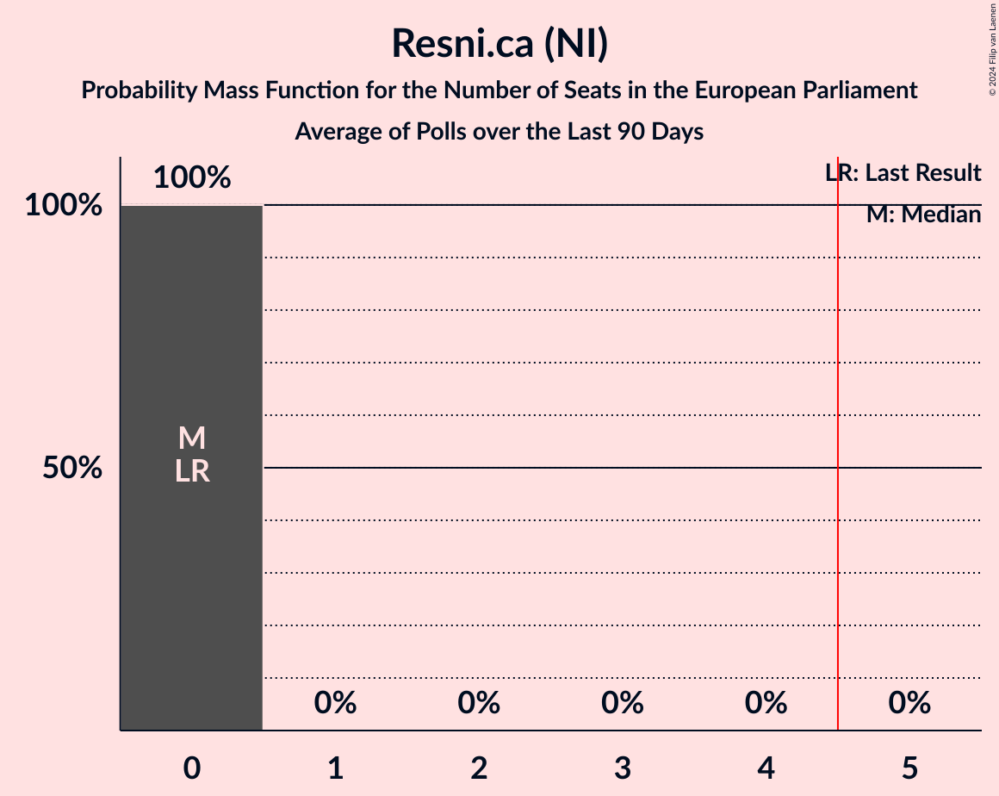

# Resni.ca (NI)

<a href="#voting-intentions">Voting Intentions</a> | <a href="#seats">Seats</a>

## Voting Intentions

Last result: **0.0%** (General Election of 9 June 2024)

### Confidence Intervals

| Period     | Polling firm/Commissioner(s) | Median | 80% Confidence Interval | 90% Confidence Interval | 95% Confidence Interval | 99% Confidence Interval |
|:----------:|:----------------:|:-----------:|:-----------------------:|:-----------------------:|:-----------------------:|:-----------------------:|
| N/A | [Poll Average](average.html) | 6.2% | 4.3–8.6% | 3.9–9.0% | 3.6–9.3% | 3.1–9.9% |
| [27–30 June 2025](2025-06-30-Valicon.html) | Valicon   TSmedia | 8.1% | 7.2–9.1% | 7.0–9.4% | 6.8–9.7% | 6.4–10.2% |
| [9–11 June 2025](2025-06-11-Ninamedia.html) | Ninamedia   Dnevnik | 0.0% | N/A | N/A | N/A | N/A |
| [2–5 June 2025](2025-06-05-Mediana.html) | Mediana   Delo | 5.8% | 4.7–7.4% | 4.4–7.9% | 4.1–8.3% | 3.6–9.1% |
| [23–26 May 2025](2025-05-26-Valicon.html) | Valicon   TSmedia | 7.2% | 6.4–8.2% | 6.1–8.5% | 5.9–8.7% | 5.5–9.3% |
| [19–22 May 2025](2025-05-22-Mediana.html) | Mediana   POP TV | 4.2% | 3.3–5.6% | 3.0–6.0% | 2.8–6.4% | 2.4–7.1% |
| [12–14 May 2025](2025-05-14-Ninamedia.html) | Ninamedia   Dnevnik | 0.0% | N/A | N/A | N/A | N/A |
| [5–7 May 2025](2025-05-07-Mediana.html) | Mediana   Delo | 6.0% | 4.8–7.6% | 4.5–8.1% | 4.2–8.5% | 3.7–9.3% |
| [25–28 April 2025](2025-04-28-Valicon.html) | Valicon   Siol.net | 8.0% | 7.1–9.0% | 6.9–9.3% | 6.7–9.6% | 6.3–10.1% |
| [22–24 April 2025](2025-04-24-Mediana.html) | Mediana   POP TV | 4.2% | 3.2–5.7% | 3.0–6.1% | 2.8–6.4% | 2.3–7.2% |
| [14–16 April 2025](2025-04-16-Ninamedia.html) | Ninamedia   Dnevnik | 0.0% | N/A | N/A | N/A | N/A |
| [7–10 April 2025](2025-04-10-ParsifalSC.html) | Parsifal SC   Nova24TV | 4.7% | 3.7–6.1% | 3.5–6.4% | 3.2–6.8% | 2.9–7.5% |
| [31 March–4 April 2025](2025-04-04-Mediana.html) | Mediana   Delo | 7.3% | N/A | N/A | N/A | N/A |
| [17–21 March 2025](2025-03-21-Mediana.html) | Mediana   POP TV | 7.2% | N/A | N/A | N/A | N/A |
| [10–12 March 2025](2025-03-12-Ninamedia.html) | Ninamedia   Dnevnik | 0.0% | N/A | N/A | N/A | N/A |
| [3–6 March 2025](2025-03-06-Mediana.html) | Mediana   Delo | 6.2% | N/A | N/A | N/A | N/A |
| [17–20 February 2025](2025-02-20-Mediana.html) | Mediana   POP TV | 5.3% | N/A | N/A | N/A | N/A |
| [10–12 February 2025](2025-02-12-Ninamedia.html) | Ninamedia   Dnevnik | 0.0% | N/A | N/A | N/A | N/A |
| [3–6 February 2025](2025-02-06-Mediana.html) | Mediana   Delo | 4.3% | N/A | N/A | N/A | N/A |
| [21–23 January 2025](2025-01-23-Mediana.html) | Mediana   POP TV | 5.0% | N/A | N/A | N/A | N/A |
| [13–15 January 2025](2025-01-15-Ninamedia.html) | Ninamedia   Dnevnik | 0.0% | N/A | N/A | N/A | N/A |
| [6–9 January 2025](2025-01-09-Mediana.html) | Mediana   Delo | 5.2% | N/A | N/A | N/A | N/A |
| [16–19 December 2024](2024-12-19-Mediana.html) | Mediana   POP TV | 4.8% | N/A | N/A | N/A | N/A |
| [9–11 December 2024](2024-12-11-Ninamedia.html) | Ninamedia   Dnevnik | 0.0% | N/A | N/A | N/A | N/A |
| [2–5 December 2024](2024-12-05-Mediana.html) | Mediana   Delo | 5.7% | N/A | N/A | N/A | N/A |
| [18–21 November 2024](2024-11-21-Mediana.html) | Mediana   POP TV | 3.7% | N/A | N/A | N/A | N/A |
| [11–13 November 2024](2024-11-13-Ninamedia.html) | Ninamedia   Dnevnik | 0.0% | N/A | N/A | N/A | N/A |
| [4–7 November 2024](2024-11-07-Mediana.html) | Mediana   Delo | 3.5% | N/A | N/A | N/A | N/A |
| [21–24 October 2024](2024-10-24-Mediana.html) | Mediana   POP TV | 4.7% | N/A | N/A | N/A | N/A |
| [14–16 October 2024](2024-10-16-Ninamedia.html) | Ninamedia   Dnevnik | 0.0% | N/A | N/A | N/A | N/A |
| [30 September–3 October 2024](2024-10-03-Mediana.html) | Mediana   Delo | 4.1% | N/A | N/A | N/A | N/A |
| [16–19 September 2024](2024-09-19-Mediana.html) | Mediana   POP TV | 3.1% | N/A | N/A | N/A | N/A |
| [9–11 September 2024](2024-09-11-Ninamedia.html) | Ninamedia   Dnevnik | 0.0% | N/A | N/A | N/A | N/A |
| [2–5 September 2024](2024-09-05-Mediana.html) | Mediana   Delo | 3.8% | N/A | N/A | N/A | N/A |
| [20–22 August 2024](2024-08-22-Mediana.html) | Mediana   POP TV | 2.4% | N/A | N/A | N/A | N/A |
| [12–14 August 2024](2024-08-14-Ninamedia.html) | Ninamedia   Dnevnik | 0.0% | N/A | N/A | N/A | N/A |
| [5–8 August 2024](2024-08-08-Mediana.html) | Mediana   Delo | 4.6% | N/A | N/A | N/A | N/A |
| [22–25 July 2024](2024-07-25-Mediana.html) | Mediana   POP TV | 4.0% | N/A | N/A | N/A | N/A |
| [15–17 July 2024](2024-07-17-Ninamedia.html) | Ninamedia   Dnevnik | 0.0% | N/A | N/A | N/A | N/A |
| [2–4 July 2024](2024-07-04-Mediana.html) | Mediana   Delo | 4.4% | N/A | N/A | N/A | N/A |
| [18–20 June 2024](2024-06-20-Mediana.html) | Mediana   POP TV | 4.4% | N/A | N/A | N/A | N/A |
| [17–19 June 2024](2024-06-19-Ninamedia.html) | Ninamedia   Dnevnik | 0.0% | N/A | N/A | N/A | N/A |

### Probability Mass Function

The following table shows the probability mass function per percentage block of voting intentions for the [poll average](average.html) for Resni.ca (NI).

| Voting Intentions | Probability | Accumulated | Special Marks |
|:-----------------:|:-----------:|:-----------:|:-------------:|
| 0.0–0.5% | 0% | 100% | Last Result |
| 0.5–1.5% | 0% | 100% |  |
| 1.5–2.5% | 0% | 100% |  |
| 2.5–3.5% | 2% | 100% |  |
| 3.5–4.5% | 13% | 98% |  |
| 4.5–5.5% | 22% | 85% |  |
| 5.5–6.5% | 18% | 62% | Median |
| 6.5–7.5% | 14% | 44% |  |
| 7.5–8.5% | 19% | 30% |  |
| 8.5–9.5% | 9% | 11% |  |
| 9.5–10.5% | 1.2% | 1.3% |  |
| 10.5–11.5% | 0.1% | 0.1% |  |
| 11.5–12.5% | 0% | 0% |  |

## Seats

Last result: **0** seats (General Election of 9 June 2024)

### Confidence Intervals

| Period     | Polling firm/Commissioner(s) | Median | 80% Confidence Interval | 90% Confidence Interval | 95% Confidence Interval | 99% Confidence Interval |
|:----------:|:----------------:|:------:|:-----------------------:|:-----------------------:|:-----------------------:|:-----------------------:|
| N/A | [Poll Average](average.html) | 0 | 0–1 | 0–1 | 0–1 | 0–1 |
| [27–30 June 2025](2025-06-30-Valicon.html) | Valicon   TSmedia | 1 | 1 | 1 | 1 | 1 |
| [9–11 June 2025](2025-06-11-Ninamedia.html) | Ninamedia   Dnevnik |  |  |  |  |  |
| [2–5 June 2025](2025-06-05-Mediana.html) | Mediana   Delo | 0 | 0–1 | 0–1 | 0–1 | 0–1 |
| [23–26 May 2025](2025-05-26-Valicon.html) | Valicon   TSmedia | 1 | 1 | 0–1 | 0–1 | 0–1 |
| [19–22 May 2025](2025-05-22-Mediana.html) | Mediana   POP TV | 0 | 0 | 0 | 0–1 | 0–1 |
| [12–14 May 2025](2025-05-14-Ninamedia.html) | Ninamedia   Dnevnik |  |  |  |  |  |
| [5–7 May 2025](2025-05-07-Mediana.html) | Mediana   Delo | 0 | 0–1 | 0–1 | 0–1 | 0–1 |
| [25–28 April 2025](2025-04-28-Valicon.html) | Valicon   Siol.net | 1 | 1 | 1 | 1 | 1 |
| [22–24 April 2025](2025-04-24-Mediana.html) | Mediana   POP TV | 0 | 0 | 0 | 0 | 0–1 |
| [14–16 April 2025](2025-04-16-Ninamedia.html) | Ninamedia   Dnevnik |  |  |  |  |  |
| [7–10 April 2025](2025-04-10-ParsifalSC.html) | Parsifal SC   Nova24TV | 0 | 0 | 0 | 0–1 | 0–1 |
| [31 March–4 April 2025](2025-04-04-Mediana.html) | Mediana   Delo |  |  |  |  |  |
| [17–21 March 2025](2025-03-21-Mediana.html) | Mediana   POP TV |  |  |  |  |  |
| [10–12 March 2025](2025-03-12-Ninamedia.html) | Ninamedia   Dnevnik |  |  |  |  |  |
| [3–6 March 2025](2025-03-06-Mediana.html) | Mediana   Delo |  |  |  |  |  |
| [17–20 February 2025](2025-02-20-Mediana.html) | Mediana   POP TV |  |  |  |  |  |
| [10–12 February 2025](2025-02-12-Ninamedia.html) | Ninamedia   Dnevnik |  |  |  |  |  |
| [3–6 February 2025](2025-02-06-Mediana.html) | Mediana   Delo |  |  |  |  |  |
| [21–23 January 2025](2025-01-23-Mediana.html) | Mediana   POP TV |  |  |  |  |  |
| [13–15 January 2025](2025-01-15-Ninamedia.html) | Ninamedia   Dnevnik |  |  |  |  |  |
| [6–9 January 2025](2025-01-09-Mediana.html) | Mediana   Delo |  |  |  |  |  |
| [16–19 December 2024](2024-12-19-Mediana.html) | Mediana   POP TV |  |  |  |  |  |
| [9–11 December 2024](2024-12-11-Ninamedia.html) | Ninamedia   Dnevnik |  |  |  |  |  |
| [2–5 December 2024](2024-12-05-Mediana.html) | Mediana   Delo |  |  |  |  |  |
| [18–21 November 2024](2024-11-21-Mediana.html) | Mediana   POP TV |  |  |  |  |  |
| [11–13 November 2024](2024-11-13-Ninamedia.html) | Ninamedia   Dnevnik |  |  |  |  |  |
| [4–7 November 2024](2024-11-07-Mediana.html) | Mediana   Delo |  |  |  |  |  |
| [21–24 October 2024](2024-10-24-Mediana.html) | Mediana   POP TV |  |  |  |  |  |
| [14–16 October 2024](2024-10-16-Ninamedia.html) | Ninamedia   Dnevnik |  |  |  |  |  |
| [30 September–3 October 2024](2024-10-03-Mediana.html) | Mediana   Delo |  |  |  |  |  |
| [16–19 September 2024](2024-09-19-Mediana.html) | Mediana   POP TV |  |  |  |  |  |
| [9–11 September 2024](2024-09-11-Ninamedia.html) | Ninamedia   Dnevnik |  |  |  |  |  |
| [2–5 September 2024](2024-09-05-Mediana.html) | Mediana   Delo |  |  |  |  |  |
| [20–22 August 2024](2024-08-22-Mediana.html) | Mediana   POP TV |  |  |  |  |  |
| [12–14 August 2024](2024-08-14-Ninamedia.html) | Ninamedia   Dnevnik |  |  |  |  |  |
| [5–8 August 2024](2024-08-08-Mediana.html) | Mediana   Delo |  |  |  |  |  |
| [22–25 July 2024](2024-07-25-Mediana.html) | Mediana   POP TV |  |  |  |  |  |
| [15–17 July 2024](2024-07-17-Ninamedia.html) | Ninamedia   Dnevnik |  |  |  |  |  |
| [2–4 July 2024](2024-07-04-Mediana.html) | Mediana   Delo |  |  |  |  |  |
| [18–20 June 2024](2024-06-20-Mediana.html) | Mediana   POP TV |  |  |  |  |  |
| [17–19 June 2024](2024-06-19-Ninamedia.html) | Ninamedia   Dnevnik |  |  |  |  |  |

### Probability Mass Function

The following table shows the probability mass function per seat for the [poll average](average.html) for Resni.ca (NI).

| Number of Seats | Probability | Accumulated | Special Marks |
|:---------------:|:-----------:|:-----------:|:-------------:|
| 0 | 59% | 100% | Last Result, Median |
| 1 | 41% | 41% |  |
| 2 | 0% | 0% |  |

