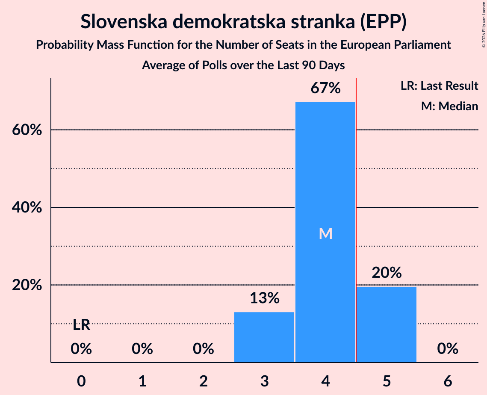

# Slovenska demokratska stranka (EPP)

<a href="#voting-intentions">Voting Intentions</a> | <a href="#seats">Seats</a>

## Voting Intentions

Last result: **0.0%** (General Election of 9 June 2024)

### Confidence Intervals

| Period     | Polling firm/Commissioner(s) | Median | 80% Confidence Interval | 90% Confidence Interval | 95% Confidence Interval | 99% Confidence Interval |
|:----------:|:----------------:|:-----------:|:-----------------------:|:-----------------------:|:-----------------------:|:-----------------------:|
| N/A | [Poll Average](average.html) | 27.9% | 25.8–31.5% | 25.3–32.4% | 24.9–33.2% | 23.9–34.8% |
| [23–26 February 2026](2026-02-26-Mediana.html) | Mediana   POP TV | 30.9% | 28.5–33.4% | 27.8–34.2% | 27.2–34.8% | 26.1–36.0% |
| [23–25 February 2026](2026-02-25-Ninamedia.html) | Ninamedia   Dnevnik | 28.1% | 26.3–30.0% | 25.7–30.5% | 25.3–31.0% | 24.5–32.0% |
| [20–23 February 2026](2026-02-23-Valicon.html) | Valicon   TSmedia | 26.5% | 25.0–28.1% | 24.6–28.5% | 24.2–28.9% | 23.6–29.7% |
| [1–14 February 2026](2026-02-14-IJEK.html) | IJEK   Utrip Družbe | 28.3% | 25.8–31.1% | 25.0–31.9% | 24.4–32.6% | 23.2–34.0% |
| [9–13 February 2026](2026-02-13-ParsifalSC.html) | Parsifal SC   Nova24TV | 29.1% | 26.7–31.7% | 26.0–32.4% | 25.4–33.0% | 24.3–34.3% |
| [9–12 February 2026](2026-02-12-Mediana.html) | Mediana   RTV SLO | 21.6% | 19.8–23.6% | 19.2–24.2% | 18.8–24.7% | 18.0–25.7% |
| [9–11 February 2026](2026-02-11-Ninamedia.html) | Ninamedia   Dnevnik | 28.6% | 26.3–31.0% | 25.6–31.7% | 25.1–32.3% | 24.0–33.5% |
| [7–11 February 2026](2026-02-11-Info360si.html) | Info360.si | 26.5% | 25.6–27.5% | 25.3–27.7% | 25.1–28.0% | 24.6–28.4% |
| [6–8 February 2026](2026-02-08-Valicon.html) | Valicon   TSmedia | 25.0% | 23.5–26.6% | 23.1–27.0% | 22.8–27.4% | 22.1–28.2% |
| [2–5 February 2026](2026-02-05-Mediana.html) | Mediana   Delo | 26.1% | N/A | N/A | N/A | N/A |
| [26–29 January 2026](2026-01-29-Mediana.html) | Mediana   POP TV | 28.4% | 26.1–31.0% | 25.4–31.7% | 24.8–32.4% | 23.7–33.6% |
| [26–27 January 2026](2026-01-27-Ninamedia.html) | Ninamedia   Mladina | 28.1% | 26.5–29.8% | 26.1–30.3% | 25.7–30.7% | 24.9–31.5% |
| [23–25 January 2026](2026-01-25-Valicon.html) | Valicon   TSmedia | 25.5% | 24.1–27.1% | 23.6–27.5% | 23.3–27.9% | 22.6–28.7% |
| [1–25 January 2026](2026-01-25-IJEK.html) | IJEK   Utrip Družbe | 28.2% | 25.3–31.4% | 24.5–32.3% | 23.8–33.0% | 22.5–34.6% |
| [17–21 January 2026](2026-01-21-Info360si.html) | Info360.si | 27.9% | 27.0–28.8% | 26.8–29.1% | 26.6–29.3% | 26.1–29.8% |
| [12–15 January 2026](2026-01-15-Mediana.html) | Mediana   RTV SLO | 27.1% | N/A | N/A | N/A | N/A |
| [12–14 January 2026](2026-01-14-ParsifalSC.html) | Parsifal SC   Nova24TV | 34.0% | 31.4–36.7% | 30.7–37.4% | 30.1–38.1% | 28.9–39.4% |
| [12–14 January 2026](2026-01-14-Ninamedia.html) | Ninamedia   Dnevnik | 28.7% | N/A | N/A | N/A | N/A |
| [6–8 January 2026](2026-01-08-Mediana.html) | Mediana   Delo | 28.2% | N/A | N/A | N/A | N/A |
| [26–28 December 2025](2025-12-28-Valicon.html) | Valicon   TSmedia | 26.8% | N/A | N/A | N/A | N/A |
| [15–18 December 2025](2025-12-18-Mediana.html) | Mediana   RTV Slovenija | 28.4% | N/A | N/A | N/A | N/A |
| [1–18 December 2025](2025-12-18-IJEK.html) | IJEK   Utrip Družbe | 25.2% | N/A | N/A | N/A | N/A |
| [15–17 December 2025](2025-12-17-Ninamedia.html) | Ninamedia   Dnevnik | 33.7% | N/A | N/A | N/A | N/A |
| [8–11 December 2025](2025-12-11-Mediana.html) | Mediana   POP TV | 26.9% | N/A | N/A | N/A | N/A |
| [1–4 December 2025](2025-12-04-Mediana.html) | Mediana   Delo | 28.1% | N/A | N/A | N/A | N/A |
| [22–27 November 2025](2025-11-27-Mediana.html) | Mediana   POP TV | 28.5% | N/A | N/A | N/A | N/A |
| [21–24 November 2025](2025-11-24-Valicon.html) | Valicon   TSmedia | 25.9% | N/A | N/A | N/A | N/A |
| [1–20 November 2025](2025-11-20-IJEK.html) | IJEK   Utrip Družbe | 27.1% | N/A | N/A | N/A | N/A |
| [10–13 November 2025](2025-11-13-Mediana.html) | Mediana   RTV Slovenija | 29.8% | N/A | N/A | N/A | N/A |
| [10–12 November 2025](2025-11-12-Ninamedia.html) | Ninamedia   Dnevnik | 29.6% | N/A | N/A | N/A | N/A |
| [3–6 November 2025](2025-11-06-Mediana.html) | Mediana   Delo | 27.1% | N/A | N/A | N/A | N/A |
| [24–26 October 2025](2025-10-26-Valicon.html) | Valicon   TSmedia | 26.6% | N/A | N/A | N/A | N/A |
| [20–23 October 2025](2025-10-23-Mediana.html) | Mediana   POP TV | 29.1% | N/A | N/A | N/A | N/A |
| [20–22 October 2025](2025-10-22-ParsifalSC.html) | Parsifal SC   Nova24TV | 31.1% | N/A | N/A | N/A | N/A |
| [17–20 October 2025](2025-10-20-Valicon.html) | Valicon   POP TV | 25.3% | N/A | N/A | N/A | N/A |
| [1–20 October 2025](2025-10-20-IJEK.html) | IJEK   Utrip Družbe | 30.1% | N/A | N/A | N/A | N/A |
| [13–15 October 2025](2025-10-15-Ninamedia.html) | Ninamedia   Dnevnik | 35.8% | N/A | N/A | N/A | N/A |
| [6–9 October 2025](2025-10-09-Mediana.html) | Mediana   Delo | 28.5% | N/A | N/A | N/A | N/A |
| [26–29 September 2025](2025-09-29-Valicon.html) | Valicon   TSmedia | 25.9% | N/A | N/A | N/A | N/A |
| [22–25 September 2025](2025-09-25-Mediana.html) | Mediana   POP TV | 30.7% | N/A | N/A | N/A | N/A |
| [1–12 September 2025](2025-09-12-IJEK.html) | IJEK   Utrip Družbe | 26.3% | N/A | N/A | N/A | N/A |
| [8–10 September 2025](2025-09-10-Ninamedia.html) | Ninamedia   Dnevnik | 32.6% | N/A | N/A | N/A | N/A |
| [1–4 September 2025](2025-09-04-Mediana.html) | Mediana   Delo | 30.4% | N/A | N/A | N/A | N/A |
| [22–25 August 2025](2025-08-25-Valicon.html) | Valicon   TSmedia | 24.9% | N/A | N/A | N/A | N/A |
| [18–21 August 2025](2025-08-21-Mediana.html) | Mediana   POP TV | 31.5% | N/A | N/A | N/A | N/A |
| [11–13 August 2025](2025-08-13-Ninamedia.html) | Ninamedia   Dnevnik | 35.7% | N/A | N/A | N/A | N/A |
| [4–7 August 2025](2025-08-07-Mediana.html) | Mediana   Delo | 29.5% | N/A | N/A | N/A | N/A |
| [1–7 August 2025](2025-08-07-IJEK.html) | IJEK   Utrip Družbe | 25.1% | N/A | N/A | N/A | N/A |
| [25–28 July 2025](2025-07-28-Valicon.html) | Valicon   TSmedia | 24.2% | N/A | N/A | N/A | N/A |
| [21–24 July 2025](2025-07-24-Mediana.html) | Mediana   POP TV | 33.1% | N/A | N/A | N/A | N/A |
| [7–9 July 2025](2025-07-09-Ninamedia.html) | Ninamedia   Dnevnik | 36.5% | N/A | N/A | N/A | N/A |
| [3–9 July 2025](2025-07-09-IJEK.html) | IJEK   Utrip Družbe | 26.5% | N/A | N/A | N/A | N/A |
| [30 June–3 July 2025](2025-07-03-Mediana.html) | Mediana   Delo | 32.2% | N/A | N/A | N/A | N/A |
| [27–30 June 2025](2025-06-30-Valicon.html) | Valicon   TSmedia | 26.9% | N/A | N/A | N/A | N/A |
| [16–19 June 2025](2025-06-19-Mediana.html) | Mediana   POP TV | 34.6% | N/A | N/A | N/A | N/A |
| [10–12 June 2025](2025-06-12-ParsifalSC.html) | Parsifal SC   Nova24TV | 31.7% | N/A | N/A | N/A | N/A |
| [1–12 June 2025](2025-06-12-IJEK.html) | IJEK   Utrip Družbe | 25.8% | N/A | N/A | N/A | N/A |
| [9–11 June 2025](2025-06-11-Ninamedia.html) | Ninamedia   Dnevnik | 32.4% | N/A | N/A | N/A | N/A |
| [2–5 June 2025](2025-06-05-Mediana.html) | Mediana   Delo | 31.0% | N/A | N/A | N/A | N/A |
| [23–26 May 2025](2025-05-26-Valicon.html) | Valicon   TSmedia | 27.5% | N/A | N/A | N/A | N/A |
| [19–22 May 2025](2025-05-22-Mediana.html) | Mediana   POP TV | 30.3% | N/A | N/A | N/A | N/A |
| [12–14 May 2025](2025-05-14-Ninamedia.html) | Ninamedia   Dnevnik | 34.6% | N/A | N/A | N/A | N/A |
| [5–7 May 2025](2025-05-07-Mediana.html) | Mediana   Delo | 30.6% | N/A | N/A | N/A | N/A |
| [25–28 April 2025](2025-04-28-Valicon.html) | Valicon   Siol.net | 26.0% | N/A | N/A | N/A | N/A |
| [22–24 April 2025](2025-04-24-Mediana.html) | Mediana   POP TV | 30.4% | N/A | N/A | N/A | N/A |
| [14–16 April 2025](2025-04-16-Ninamedia.html) | Ninamedia   Dnevnik | 32.3% | N/A | N/A | N/A | N/A |
| [7–10 April 2025](2025-04-10-ParsifalSC.html) | Parsifal SC   Nova24TV | 31.4% | N/A | N/A | N/A | N/A |
| [31 March–4 April 2025](2025-04-04-Mediana.html) | Mediana   Delo | 34.9% | N/A | N/A | N/A | N/A |
| [17–21 March 2025](2025-03-21-Mediana.html) | Mediana   POP TV | 30.9% | N/A | N/A | N/A | N/A |
| [10–12 March 2025](2025-03-12-Ninamedia.html) | Ninamedia   Dnevnik | 34.2% | N/A | N/A | N/A | N/A |
| [3–6 March 2025](2025-03-06-Mediana.html) | Mediana   Delo | 30.7% | N/A | N/A | N/A | N/A |
| [17–20 February 2025](2025-02-20-Mediana.html) | Mediana   POP TV | 32.0% | N/A | N/A | N/A | N/A |
| [10–12 February 2025](2025-02-12-Ninamedia.html) | Ninamedia   Dnevnik | 33.7% | N/A | N/A | N/A | N/A |
| [3–6 February 2025](2025-02-06-Mediana.html) | Mediana   Delo | 36.9% | N/A | N/A | N/A | N/A |
| [21–23 January 2025](2025-01-23-Mediana.html) | Mediana   POP TV | 33.3% | N/A | N/A | N/A | N/A |
| [13–15 January 2025](2025-01-15-Ninamedia.html) | Ninamedia   Dnevnik | 34.3% | N/A | N/A | N/A | N/A |
| [6–9 January 2025](2025-01-09-Mediana.html) | Mediana   Delo | 31.6% | N/A | N/A | N/A | N/A |
| [16–19 December 2024](2024-12-19-Mediana.html) | Mediana   POP TV | 34.0% | N/A | N/A | N/A | N/A |
| [9–11 December 2024](2024-12-11-Ninamedia.html) | Ninamedia   Dnevnik | 33.9% | N/A | N/A | N/A | N/A |
| [2–5 December 2024](2024-12-05-Mediana.html) | Mediana   Delo | 30.2% | N/A | N/A | N/A | N/A |
| [18–21 November 2024](2024-11-21-Mediana.html) | Mediana   POP TV | 30.0% | N/A | N/A | N/A | N/A |
| [11–13 November 2024](2024-11-13-Ninamedia.html) | Ninamedia   Dnevnik | 37.1% | N/A | N/A | N/A | N/A |
| [4–7 November 2024](2024-11-07-Mediana.html) | Mediana   Delo | 33.1% | N/A | N/A | N/A | N/A |
| [21–24 October 2024](2024-10-24-Mediana.html) | Mediana   POP TV | 33.0% | N/A | N/A | N/A | N/A |
| [14–16 October 2024](2024-10-16-Ninamedia.html) | Ninamedia   Dnevnik | 33.9% | N/A | N/A | N/A | N/A |
| [30 September–3 October 2024](2024-10-03-Mediana.html) | Mediana   Delo | 32.5% | N/A | N/A | N/A | N/A |
| [16–19 September 2024](2024-09-19-Mediana.html) | Mediana   POP TV | 34.9% | N/A | N/A | N/A | N/A |
| [9–11 September 2024](2024-09-11-Ninamedia.html) | Ninamedia   Dnevnik | 34.4% | N/A | N/A | N/A | N/A |
| [2–5 September 2024](2024-09-05-Mediana.html) | Mediana   Delo | 33.0% | N/A | N/A | N/A | N/A |
| [20–22 August 2024](2024-08-22-Mediana.html) | Mediana   POP TV | 34.8% | N/A | N/A | N/A | N/A |
| [12–14 August 2024](2024-08-14-Ninamedia.html) | Ninamedia   Dnevnik | 36.6% | N/A | N/A | N/A | N/A |
| [5–8 August 2024](2024-08-08-Mediana.html) | Mediana   Delo | 31.9% | N/A | N/A | N/A | N/A |
| [22–25 July 2024](2024-07-25-Mediana.html) | Mediana   POP TV | 33.4% | N/A | N/A | N/A | N/A |
| [15–17 July 2024](2024-07-17-Ninamedia.html) | Ninamedia   Dnevnik | 35.9% | N/A | N/A | N/A | N/A |
| [2–4 July 2024](2024-07-04-Mediana.html) | Mediana   Delo | 32.8% | N/A | N/A | N/A | N/A |
| [18–20 June 2024](2024-06-20-Mediana.html) | Mediana   POP TV | 30.3% | N/A | N/A | N/A | N/A |
| [17–19 June 2024](2024-06-19-Ninamedia.html) | Ninamedia   Dnevnik | 36.1% | N/A | N/A | N/A | N/A |

### Probability Mass Function

The following table shows the probability mass function per percentage block of voting intentions for the [poll average](average.html) for Slovenska demokratska stranka (EPP).

| Voting Intentions | Probability | Accumulated | Special Marks |
|:-----------------:|:-----------:|:-----------:|:-------------:|
| 0.0–0.5% | 0% | 100% | Last Result |
| 0.5–1.5% | 0% | 100% |  |
| 1.5–2.5% | 0% | 100% |  |
| 2.5–3.5% | 0% | 100% |  |
| 3.5–4.5% | 0% | 100% |  |
| 4.5–5.5% | 0% | 100% |  |
| 5.5–6.5% | 0% | 100% |  |
| 6.5–7.5% | 0% | 100% |  |
| 7.5–8.5% | 0% | 100% |  |
| 8.5–9.5% | 0% | 100% |  |
| 9.5–10.5% | 0% | 100% |  |
| 10.5–11.5% | 0% | 100% |  |
| 11.5–12.5% | 0% | 100% |  |
| 12.5–13.5% | 0% | 100% |  |
| 13.5–14.5% | 0% | 100% |  |
| 14.5–15.5% | 0% | 100% |  |
| 15.5–16.5% | 0% | 100% |  |
| 16.5–17.5% | 0% | 100% |  |
| 17.5–18.5% | 0% | 100% |  |
| 18.5–19.5% | 0% | 100% |  |
| 19.5–20.5% | 0% | 100% |  |
| 20.5–21.5% | 0% | 100% |  |
| 21.5–22.5% | 0% | 100% |  |
| 22.5–23.5% | 0.2% | 100% |  |
| 23.5–24.5% | 1.3% | 99.8% |  |
| 24.5–25.5% | 6% | 98% |  |
| 25.5–26.5% | 17% | 93% |  |
| 26.5–27.5% | 20% | 76% |  |
| 27.5–28.5% | 15% | 56% | Median |
| 28.5–29.5% | 13% | 40% |  |
| 29.5–30.5% | 10% | 27% |  |
| 30.5–31.5% | 8% | 17% |  |
| 31.5–32.5% | 5% | 9% |  |
| 32.5–33.5% | 3% | 4% |  |
| 33.5–34.5% | 1.2% | 2% |  |
| 34.5–35.5% | 0.5% | 0.6% |  |
| 35.5–36.5% | 0.1% | 0.2% |  |
| 36.5–37.5% | 0% | 0% |  |

## Seats

Last result: **0** seats (General Election of 9 June 2024)

### Confidence Intervals

| Period     | Polling firm/Commissioner(s) | Median | 80% Confidence Interval | 90% Confidence Interval | 95% Confidence Interval | 99% Confidence Interval |
|:----------:|:----------------:|:------:|:-----------------------:|:-----------------------:|:-----------------------:|:-----------------------:|
| N/A | [Poll Average](average.html) | 4 | 3–5 | 3–5 | 3–5 | 3–5 |
| [23–26 February 2026](2026-02-26-Mediana.html) | Mediana   POP TV | 4 | 4–5 | 4–5 | 4–5 | 4–5 |
| [23–25 February 2026](2026-02-25-Ninamedia.html) | Ninamedia   Dnevnik | 5 | 3–5 | 3–5 | 3–5 | 3–5 |
| [20–23 February 2026](2026-02-23-Valicon.html) | Valicon   TSmedia | 4 | 4 | 4 | 4 | 4 |
| [1–14 February 2026](2026-02-14-IJEK.html) | IJEK   Utrip Družbe | 4 | 3–4 | 3–5 | 3–5 | 3–5 |
| [9–13 February 2026](2026-02-13-ParsifalSC.html) | Parsifal SC   Nova24TV | 4 | 4 | 3–5 | 3–5 | 3–5 |
| [9–12 February 2026](2026-02-12-Mediana.html) | Mediana   RTV SLO | 3 | 3 | 3 | 3 | 3 |
| [9–11 February 2026](2026-02-11-Ninamedia.html) | Ninamedia   Dnevnik | 4 | 4 | 3–4 | 3–4 | 3–4 |
| [7–11 February 2026](2026-02-11-Info360si.html) | Info360.si | 4 | 3–4 | 3–4 | 3–4 | 3–4 |
| [6–8 February 2026](2026-02-08-Valicon.html) | Valicon   TSmedia | 4 | 3–4 | 3–4 | 3–4 | 3–4 |
| [2–5 February 2026](2026-02-05-Mediana.html) | Mediana   Delo |  |  |  |  |  |
| [26–29 January 2026](2026-01-29-Mediana.html) | Mediana   POP TV | 4 | 4 | 4–5 | 4–5 | 3–5 |
| [26–27 January 2026](2026-01-27-Ninamedia.html) | Ninamedia   Mladina | 4 | 4 | 3–4 | 3–4 | 3–4 |
| [23–25 January 2026](2026-01-25-Valicon.html) | Valicon   TSmedia | 3 | 3–4 | 3–4 | 3–4 | 3–4 |
| [1–25 January 2026](2026-01-25-IJEK.html) | IJEK   Utrip Družbe | 4 | 3–4 | 3–4 | 3–4 | 3–4 |
| [17–21 January 2026](2026-01-21-Info360si.html) | Info360.si | 4 | 4 | 3–4 | 3–4 | 3–4 |
| [12–15 January 2026](2026-01-15-Mediana.html) | Mediana   RTV SLO |  |  |  |  |  |
| [12–14 January 2026](2026-01-14-ParsifalSC.html) | Parsifal SC   Nova24TV | 5 | 4–5 | 4–5 | 4–5 | 4–5 |
| [12–14 January 2026](2026-01-14-Ninamedia.html) | Ninamedia   Dnevnik |  |  |  |  |  |
| [6–8 January 2026](2026-01-08-Mediana.html) | Mediana   Delo |  |  |  |  |  |
| [26–28 December 2025](2025-12-28-Valicon.html) | Valicon   TSmedia |  |  |  |  |  |
| [15–18 December 2025](2025-12-18-Mediana.html) | Mediana   RTV Slovenija |  |  |  |  |  |
| [1–18 December 2025](2025-12-18-IJEK.html) | IJEK   Utrip Družbe |  |  |  |  |  |
| [15–17 December 2025](2025-12-17-Ninamedia.html) | Ninamedia   Dnevnik |  |  |  |  |  |
| [8–11 December 2025](2025-12-11-Mediana.html) | Mediana   POP TV |  |  |  |  |  |
| [1–4 December 2025](2025-12-04-Mediana.html) | Mediana   Delo |  |  |  |  |  |
| [22–27 November 2025](2025-11-27-Mediana.html) | Mediana   POP TV |  |  |  |  |  |
| [21–24 November 2025](2025-11-24-Valicon.html) | Valicon   TSmedia |  |  |  |  |  |
| [1–20 November 2025](2025-11-20-IJEK.html) | IJEK   Utrip Družbe |  |  |  |  |  |
| [10–13 November 2025](2025-11-13-Mediana.html) | Mediana   RTV Slovenija |  |  |  |  |  |
| [10–12 November 2025](2025-11-12-Ninamedia.html) | Ninamedia   Dnevnik |  |  |  |  |  |
| [3–6 November 2025](2025-11-06-Mediana.html) | Mediana   Delo |  |  |  |  |  |
| [24–26 October 2025](2025-10-26-Valicon.html) | Valicon   TSmedia |  |  |  |  |  |
| [20–23 October 2025](2025-10-23-Mediana.html) | Mediana   POP TV |  |  |  |  |  |
| [20–22 October 2025](2025-10-22-ParsifalSC.html) | Parsifal SC   Nova24TV |  |  |  |  |  |
| [17–20 October 2025](2025-10-20-Valicon.html) | Valicon   POP TV |  |  |  |  |  |
| [1–20 October 2025](2025-10-20-IJEK.html) | IJEK   Utrip Družbe |  |  |  |  |  |
| [13–15 October 2025](2025-10-15-Ninamedia.html) | Ninamedia   Dnevnik |  |  |  |  |  |
| [6–9 October 2025](2025-10-09-Mediana.html) | Mediana   Delo |  |  |  |  |  |
| [26–29 September 2025](2025-09-29-Valicon.html) | Valicon   TSmedia |  |  |  |  |  |
| [22–25 September 2025](2025-09-25-Mediana.html) | Mediana   POP TV |  |  |  |  |  |
| [1–12 September 2025](2025-09-12-IJEK.html) | IJEK   Utrip Družbe |  |  |  |  |  |
| [8–10 September 2025](2025-09-10-Ninamedia.html) | Ninamedia   Dnevnik |  |  |  |  |  |
| [1–4 September 2025](2025-09-04-Mediana.html) | Mediana   Delo |  |  |  |  |  |
| [22–25 August 2025](2025-08-25-Valicon.html) | Valicon   TSmedia |  |  |  |  |  |
| [18–21 August 2025](2025-08-21-Mediana.html) | Mediana   POP TV |  |  |  |  |  |
| [11–13 August 2025](2025-08-13-Ninamedia.html) | Ninamedia   Dnevnik |  |  |  |  |  |
| [4–7 August 2025](2025-08-07-Mediana.html) | Mediana   Delo |  |  |  |  |  |
| [1–7 August 2025](2025-08-07-IJEK.html) | IJEK   Utrip Družbe |  |  |  |  |  |
| [25–28 July 2025](2025-07-28-Valicon.html) | Valicon   TSmedia |  |  |  |  |  |
| [21–24 July 2025](2025-07-24-Mediana.html) | Mediana   POP TV |  |  |  |  |  |
| [7–9 July 2025](2025-07-09-Ninamedia.html) | Ninamedia   Dnevnik |  |  |  |  |  |
| [3–9 July 2025](2025-07-09-IJEK.html) | IJEK   Utrip Družbe |  |  |  |  |  |
| [30 June–3 July 2025](2025-07-03-Mediana.html) | Mediana   Delo |  |  |  |  |  |
| [27–30 June 2025](2025-06-30-Valicon.html) | Valicon   TSmedia |  |  |  |  |  |
| [16–19 June 2025](2025-06-19-Mediana.html) | Mediana   POP TV |  |  |  |  |  |
| [10–12 June 2025](2025-06-12-ParsifalSC.html) | Parsifal SC   Nova24TV |  |  |  |  |  |
| [1–12 June 2025](2025-06-12-IJEK.html) | IJEK   Utrip Družbe |  |  |  |  |  |
| [9–11 June 2025](2025-06-11-Ninamedia.html) | Ninamedia   Dnevnik |  |  |  |  |  |
| [2–5 June 2025](2025-06-05-Mediana.html) | Mediana   Delo |  |  |  |  |  |
| [23–26 May 2025](2025-05-26-Valicon.html) | Valicon   TSmedia |  |  |  |  |  |
| [19–22 May 2025](2025-05-22-Mediana.html) | Mediana   POP TV |  |  |  |  |  |
| [12–14 May 2025](2025-05-14-Ninamedia.html) | Ninamedia   Dnevnik |  |  |  |  |  |
| [5–7 May 2025](2025-05-07-Mediana.html) | Mediana   Delo |  |  |  |  |  |
| [25–28 April 2025](2025-04-28-Valicon.html) | Valicon   Siol.net |  |  |  |  |  |
| [22–24 April 2025](2025-04-24-Mediana.html) | Mediana   POP TV |  |  |  |  |  |
| [14–16 April 2025](2025-04-16-Ninamedia.html) | Ninamedia   Dnevnik |  |  |  |  |  |
| [7–10 April 2025](2025-04-10-ParsifalSC.html) | Parsifal SC   Nova24TV |  |  |  |  |  |
| [31 March–4 April 2025](2025-04-04-Mediana.html) | Mediana   Delo |  |  |  |  |  |
| [17–21 March 2025](2025-03-21-Mediana.html) | Mediana   POP TV |  |  |  |  |  |
| [10–12 March 2025](2025-03-12-Ninamedia.html) | Ninamedia   Dnevnik |  |  |  |  |  |
| [3–6 March 2025](2025-03-06-Mediana.html) | Mediana   Delo |  |  |  |  |  |
| [17–20 February 2025](2025-02-20-Mediana.html) | Mediana   POP TV |  |  |  |  |  |
| [10–12 February 2025](2025-02-12-Ninamedia.html) | Ninamedia   Dnevnik |  |  |  |  |  |
| [3–6 February 2025](2025-02-06-Mediana.html) | Mediana   Delo |  |  |  |  |  |
| [21–23 January 2025](2025-01-23-Mediana.html) | Mediana   POP TV |  |  |  |  |  |
| [13–15 January 2025](2025-01-15-Ninamedia.html) | Ninamedia   Dnevnik |  |  |  |  |  |
| [6–9 January 2025](2025-01-09-Mediana.html) | Mediana   Delo |  |  |  |  |  |
| [16–19 December 2024](2024-12-19-Mediana.html) | Mediana   POP TV |  |  |  |  |  |
| [9–11 December 2024](2024-12-11-Ninamedia.html) | Ninamedia   Dnevnik |  |  |  |  |  |
| [2–5 December 2024](2024-12-05-Mediana.html) | Mediana   Delo |  |  |  |  |  |
| [18–21 November 2024](2024-11-21-Mediana.html) | Mediana   POP TV |  |  |  |  |  |
| [11–13 November 2024](2024-11-13-Ninamedia.html) | Ninamedia   Dnevnik |  |  |  |  |  |
| [4–7 November 2024](2024-11-07-Mediana.html) | Mediana   Delo |  |  |  |  |  |
| [21–24 October 2024](2024-10-24-Mediana.html) | Mediana   POP TV |  |  |  |  |  |
| [14–16 October 2024](2024-10-16-Ninamedia.html) | Ninamedia   Dnevnik |  |  |  |  |  |
| [30 September–3 October 2024](2024-10-03-Mediana.html) | Mediana   Delo |  |  |  |  |  |
| [16–19 September 2024](2024-09-19-Mediana.html) | Mediana   POP TV |  |  |  |  |  |
| [9–11 September 2024](2024-09-11-Ninamedia.html) | Ninamedia   Dnevnik |  |  |  |  |  |
| [2–5 September 2024](2024-09-05-Mediana.html) | Mediana   Delo |  |  |  |  |  |
| [20–22 August 2024](2024-08-22-Mediana.html) | Mediana   POP TV |  |  |  |  |  |
| [12–14 August 2024](2024-08-14-Ninamedia.html) | Ninamedia   Dnevnik |  |  |  |  |  |
| [5–8 August 2024](2024-08-08-Mediana.html) | Mediana   Delo |  |  |  |  |  |
| [22–25 July 2024](2024-07-25-Mediana.html) | Mediana   POP TV |  |  |  |  |  |
| [15–17 July 2024](2024-07-17-Ninamedia.html) | Ninamedia   Dnevnik |  |  |  |  |  |
| [2–4 July 2024](2024-07-04-Mediana.html) | Mediana   Delo |  |  |  |  |  |
| [18–20 June 2024](2024-06-20-Mediana.html) | Mediana   POP TV |  |  |  |  |  |
| [17–19 June 2024](2024-06-19-Ninamedia.html) | Ninamedia   Dnevnik |  |  |  |  |  |

### Probability Mass Function

The following table shows the probability mass function per seat for the [poll average](average.html) for Slovenska demokratska stranka (EPP).

| Number of Seats | Probability | Accumulated | Special Marks |
|:---------------:|:-----------:|:-----------:|:-------------:|
| 0 | 0% | 100% | Last Result |
| 1 | 0% | 100% |  |
| 2 | 0% | 100% |  |
| 3 | 13% | 100% |  |
| 4 | 67% | 87% | Median |
| 5 | 20% | 20% | Majority |
| 6 | 0% | 0% |  |

