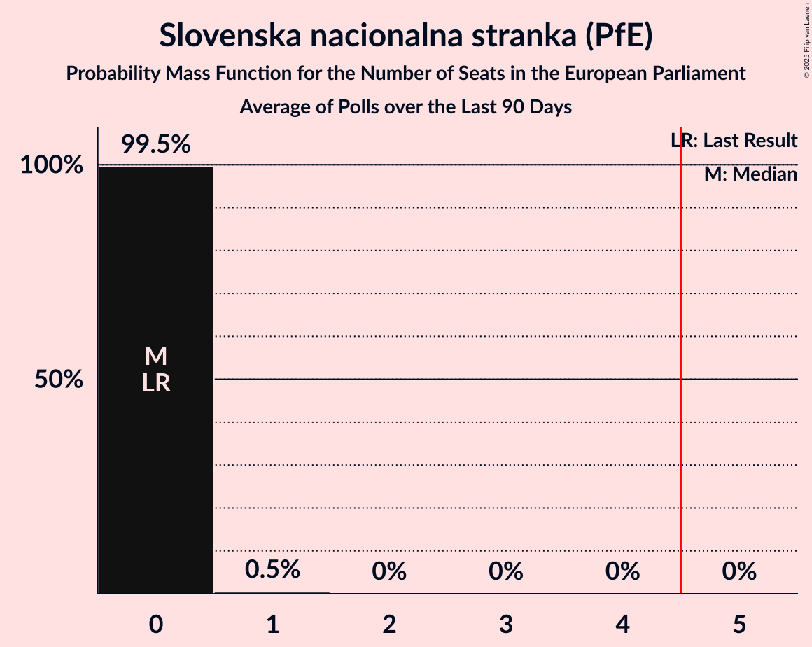

# Slovenska nacionalna stranka (PfE)

<a href="#voting-intentions">Voting Intentions</a> | <a href="#seats">Seats</a>

## Voting Intentions

Last result: **0.0%** (General Election of 9 June 2024)

### Confidence Intervals

| Period     | Polling firm/Commissioner(s) | Median | 80% Confidence Interval | 90% Confidence Interval | 95% Confidence Interval | 99% Confidence Interval |
|:----------:|:----------------:|:-----------:|:-----------------------:|:-----------------------:|:-----------------------:|:-----------------------:|
| N/A | [Poll Average](average.html) | 3.1% | 2.4–4.0% | 2.2–4.3% | 2.0–4.5% | 1.7–5.1% |
| [2–4 July 2024](2024-07-04-Mediana.html) | Mediana   Delo | 3.0% | 2.4–4.0% | 2.2–4.3% | 2.0–4.6% | 1.7–5.1% |
| [18–20 June 2024](2024-06-20-Mediana.html) | Mediana   POP TV | 2.2% | 1.7–3.1% | 1.5–3.3% | 1.4–3.5% | 1.2–4.0% |
| [17–19 June 2024](2024-06-19-Ninamedia.html) | Ninamedia   Dnevnik | 0.0% | N/A | N/A | N/A | N/A |

### Probability Mass Function

The following table shows the probability mass function per percentage block of voting intentions for the [poll average](average.html) for Slovenska nacionalna stranka (PfE).

| Voting Intentions | Probability | Accumulated | Special Marks |
|:-----------------:|:-----------:|:-----------:|:-------------:|
| 0.0–0.5% | 0% | 100% | Last Result |
| 0.5–1.5% | 0.1% | 100% |  |
| 1.5–2.5% | 17% | 99.9% |  |
| 2.5–3.5% | 57% | 83% | Median |
| 3.5–4.5% | 24% | 26% |  |
| 4.5–5.5% | 2% | 2% |  |
| 5.5–6.5% | 0.1% | 0.1% |  |
| 6.5–7.5% | 0% | 0% |  |

## Seats

Last result: **0** seats (General Election of 9 June 2024)

### Confidence Intervals

| Period     | Polling firm/Commissioner(s) | Median | 80% Confidence Interval | 90% Confidence Interval | 95% Confidence Interval | 99% Confidence Interval |
|:----------:|:----------------:|:------:|:-----------------------:|:-----------------------:|:-----------------------:|:-----------------------:|
| N/A | [Poll Average](average.html) | 0 | 0 | 0 | 0 | 0 |
| [2–4 July 2024](2024-07-04-Mediana.html) | Mediana   Delo | 0 | 0 | 0 | 0 | 0 |
| [18–20 June 2024](2024-06-20-Mediana.html) | Mediana   POP TV | 0 | 0 | 0 | 0 | 0 |
| [17–19 June 2024](2024-06-19-Ninamedia.html) | Ninamedia   Dnevnik |  |  |  |  |  |

### Probability Mass Function

The following table shows the probability mass function per seat for the [poll average](average.html) for Slovenska nacionalna stranka (PfE).

| Number of Seats | Probability | Accumulated | Special Marks |
|:---------------:|:-----------:|:-----------:|:-------------:|
| 0 | 100% | 100% | Last Result, Median |

