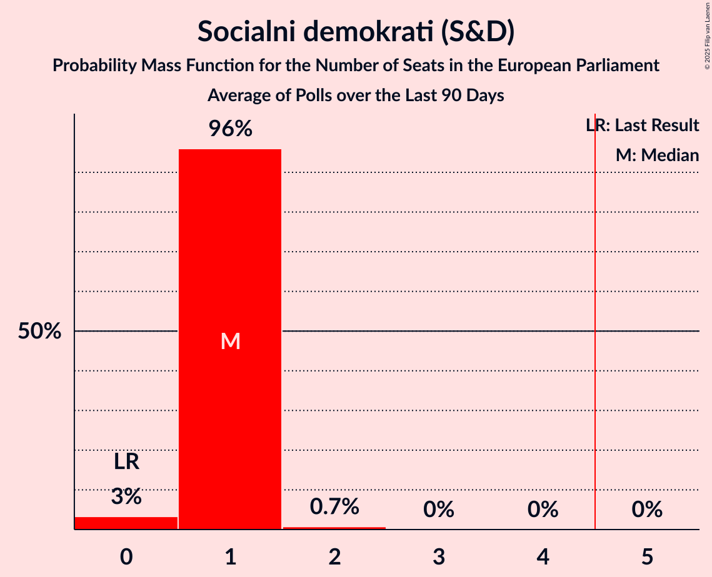

# Socialni demokrati (S&D)

<a href="#voting-intentions">Voting Intentions</a> | <a href="#seats">Seats</a>

## Voting Intentions

Last result: **8.1%** (General Election of 25 May 2014)

### Confidence Intervals

| Period     | Polling firm/Commissioner(s) | Median | 80% Confidence Interval | 90% Confidence Interval | 95% Confidence Interval | 99% Confidence Interval |
|:----------:|:----------------:|:-----------:|:-----------------------:|:-----------------------:|:-----------------------:|:-----------------------:|
| N/A | [Poll Average](average.html) | 15.3% | 12.3–20.4% | 11.7–21.3% | 11.1–22.0% | 10.2–23.4% |
| [25 November 2018](2018-11-25-Mediana.html) | Mediana   POP TV | 13.1% | 11.3–15.1% | 10.8–15.7% | 10.4–16.2% | 9.6–17.3% |
| [19–20 November 2018](2018-11-20-Ninamedia.html) | Ninamedia   Dnevnik and RTV Slovenija | 19.4% | 17.3–21.7% | 16.8–22.4% | 16.3–23.0% | 15.3–24.1% |
| [7 November 2018](2018-11-07-ParsifalSC.html) | Parsifal SC | 15.0% | 13.4–16.9% | 13.0–17.4% | 12.6–17.8% | 11.8–18.8% |
| [1 November 2018](2018-11-01-Mediana.html) | Mediana | 11.0% | 9.7–12.7% | 9.3–13.1% | 8.9–13.5% | 8.3–14.3% |
| [9–11 October 2018](2018-10-11-Ninamedia.html) | Ninamedia | 17.0% | 15.3–18.9% | 14.8–19.5% | 14.4–20.0% | 13.6–20.9% |
| [3–11 October 2018](2018-10-11-Mediana.html) | Mediana   Delo | 11.0% | 9.7–12.7% | 9.3–13.1% | 8.9–13.5% | 8.3–14.3% |
| [11–13 September 2018](2018-09-13-Ninamedia.html) | Ninamedia | 13.4% | 11.7–15.4% | 11.2–15.9% | 10.8–16.4% | 10.0–17.5% |
| [30 August–6 September 2018](2018-09-06-Mediana.html) | Mediana   Delo | 9.8% | 8.3–11.8% | 7.8–12.3% | 7.5–12.8% | 6.8–13.8% |
| [26 August 2018](2018-08-26-Mediana.html) | Mediana   POP TV | 10.1% | 8.6–12.0% | 8.1–12.6% | 7.7–13.1% | 7.1–14.1% |
| [13–15 August 2018](2018-08-15-Ninamedia.html) | Ninamedia   Dnevnik and RTV Slovenija | 12.6% | 11.0–14.6% | 10.5–15.2% | 10.1–15.6% | 9.4–16.6% |
| [29 July 2018](2018-07-29-Mediana.html) | Mediana   POP TV | 10.2% | 8.7–12.1% | 8.3–12.6% | 7.9–13.1% | 7.2–14.0% |
| [10–12 July 2018](2018-07-12-Ninamedia.html) | Ninamedia   Dnevnik and RTV Slovenija | 10.2% | 8.8–12.0% | 8.4–12.5% | 8.1–12.9% | 7.4–13.8% |
| [1–23 June 2018](2018-06-23-Mediana.html) | Mediana   POP TV | 10.7% | 9.3–12.5% | 8.8–13.0% | 8.5–13.5% | 7.8–14.4% |
| [12–14 June 2018](2018-06-14-Ninamedia.html) | Ninamedia   Dnevnik and RTV Slovenija | 10.7% | 9.2–12.5% | 8.8–13.0% | 8.4–13.4% | 7.8–14.3% |
| [5–6 June 2018](2018-06-06-ParsifalSC.html) | Parsifal SC   Nova24TV | 12.0% | 10.3–14.1% | 9.9–14.6% | 9.5–15.2% | 8.7–16.2% |
| [28–31 May 2018](2018-05-31-Valicon.html) | Valicon | 13.2% | 12.3–14.2% | 12.0–14.5% | 11.8–14.8% | 11.3–15.3% |
| [31 May 2018](2018-05-31-Ninamedia.html) | Ninamedia   Dnevnik and Večer | 12.8% | 11.4–14.3% | 11.1–14.7% | 10.7–15.1% | 10.2–15.9% |
| [31 May 2018](2018-05-31-Mediana.html) | Mediana   POP TV | 9.0% | 7.9–10.3% | 7.6–10.7% | 7.3–11.0% | 6.8–11.6% |
| [25–30 May 2018](2018-05-30-Mediana.html) | Mediana   Delo | 8.2% | 7.0–9.7% | 6.6–10.1% | 6.3–10.5% | 5.8–11.2% |
| [25–29 May 2018](2018-05-29-ParsifalSC.html) | Parsifal SC   Nova24TV | 7.9% | 6.7–9.4% | 6.4–9.9% | 6.1–10.3% | 5.6–11.0% |
| [29 May 2018](2018-05-29-Ninamedia.html) | Ninamedia   Dnevnik and Večer | 12.6% | 11.2–14.1% | 10.9–14.5% | 10.5–14.9% | 9.9–15.6% |
| [23–29 May 2018](2018-05-29-Mediana.html) | Mediana   Planet TV and Siol.net | 9.3% | 8.0–10.8% | 7.7–11.2% | 7.4–11.6% | 6.8–12.4% |
| [25–27 May 2018](2018-05-27-Valicon.html) | Valicon | 11.9% | 10.3–13.7% | 9.9–14.2% | 9.5–14.7% | 8.9–15.6% |
| [22–25 May 2018](2018-05-25-ParsifalSC.html) | Parsifal SC   Nova24TV | 9.7% | 8.3–11.4% | 7.9–11.9% | 7.6–12.3% | 7.0–13.2% |
| [25 May 2018](2018-05-25-Mediana.html) | Mediana   RTV Slovenija | 7.4% | 6.3–8.9% | 6.0–9.3% | 5.7–9.6% | 5.3–10.3% |
| [21–23 May 2018](2018-05-23-Ninamedia.html) | Ninamedia   Dnevnik and Večer | 14.3% | 12.5–16.4% | 12.0–17.0% | 11.6–17.6% | 10.8–18.6% |
| [21–22 May 2018](2018-05-22-Ninamedia.html) | Ninamedia   Mladina | 15.0% | 13.0–17.4% | 12.5–18.1% | 12.0–18.6% | 11.1–19.8% |
| [12–22 May 2018](2018-05-22-Mediana.html) | Mediana   Planet TV and Siol.net | 9.1% | 7.8–10.7% | 7.5–11.1% | 7.2–11.5% | 6.6–12.3% |
| [22 May 2018](2018-05-22-Episcenter.html) | Episcenter | 16.1% | 14.4–17.9% | 14.0–18.4% | 13.6–18.9% | 12.9–19.8% |
| [20 May 2018](2018-05-20-Mediana.html) | Mediana   POP TV | 9.9% | 8.4–11.8% | 7.9–12.3% | 7.6–12.8% | 6.9–13.8% |
| [14–17 May 2018](2018-05-17-ParsifalSC.html) | Parsifal SC   Nova24TV | 10.2% | 8.6–12.2% | 8.2–12.8% | 7.8–13.2% | 7.1–14.3% |
| [11–17 May 2018](2018-05-17-Mediana.html) | Mediana   RTV Slovenija | 10.1% | 8.6–12.0% | 8.2–12.5% | 7.8–13.0% | 7.1–13.9% |
| [9–15 May 2018](2018-05-15-Mediana.html) | Mediana   Planet TV and Siol.net | 12.2% | 10.5–14.3% | 10.0–14.9% | 9.6–15.4% | 8.8–16.5% |
| [7–10 May 2018](2018-05-10-Ninamedia.html) | Ninamedia   Dnevnik and Večer | 15.3% | 13.7–17.0% | 13.2–17.6% | 12.9–18.0% | 12.1–18.9% |
| [8–9 May 2018](2018-05-09-Valicon.html) | Valicon | 15.2% | 13.7–17.0% | 13.3–17.4% | 12.9–17.9% | 12.2–18.7% |
| [4–7 May 2018](2018-05-07-Valicon.html) | Valicon | 18.0% | 17.3–18.7% | 17.1–18.9% | 17.0–19.0% | 16.7–19.3% |
| [2–5 May 2018](2018-05-05-DeloStik.html) | Delo Stik   Delo | 13.3% | 11.9–15.0% | 11.5–15.4% | 11.2–15.8% | 10.5–16.6% |
| [11–19 April 2018](2018-04-19-Mediana.html) | Mediana   POP TV | 13.7% | 11.8–16.0% | 11.2–16.7% | 10.8–17.2% | 9.9–18.4% |
| [9–11 April 2018](2018-04-11-Ninamedia.html) | Ninamedia   RTV Slovenija–Dnevnik | 19.9% | 17.6–22.6% | 16.9–23.3% | 16.4–24.0% | 15.3–25.3% |
| [29 March–5 April 2018](2018-04-05-DeloStik.html) | Delo Stik   Delo | 16.5% | 15.0–18.3% | 14.5–18.8% | 14.2–19.2% | 13.4–20.1% |
| [25 March 2018](2018-03-25-Mediana.html) | Mediana   POP TV | 15.5% | 13.5–17.9% | 12.9–18.6% | 12.4–19.2% | 11.5–20.4% |
| [13–15 March 2018](2018-03-15-Ninamedia.html) | Ninamedia   RTV Slovenija–Dnevnik | 20.8% | 18.4–23.5% | 17.8–24.2% | 17.2–24.9% | 16.1–26.2% |
| [10–14 March 2018](2018-03-14-ParsifalSC.html) | Parsifal SC   Nova24TV | 16.5% | 14.9–18.3% | 14.4–18.8% | 14.0–19.2% | 13.3–20.1% |
| [1–8 March 2018](2018-03-08-DeloStik.html) | Delo Stik   Delo | 17.4% | 15.8–19.2% | 15.3–19.7% | 14.9–20.1% | 14.2–21.0% |

### Probability Mass Function

The following table shows the probability mass function per percentage block of voting intentions for the [poll average](average.html) for Socialni demokrati (S&D).

| Voting Intentions | Probability | Accumulated | Special Marks |
|:-----------------:|:-----------:|:-----------:|:-------------:|
| 7.5–8.5% | 0% | 100% | Last Result |
| 8.5–9.5% | 0.1% | 100% |  |
| 9.5–10.5% | 0.9% | 99.9% |  |
| 10.5–11.5% | 3% | 99.0% |  |
| 11.5–12.5% | 8% | 96% |  |
| 12.5–13.5% | 12% | 88% |  |
| 13.5–14.5% | 15% | 76% |  |
| 14.5–15.5% | 14% | 61% | Median |
| 15.5–16.5% | 10% | 47% |  |
| 16.5–17.5% | 7% | 37% |  |
| 17.5–18.5% | 7% | 31% |  |
| 18.5–19.5% | 8% | 24% |  |
| 19.5–20.5% | 7% | 16% |  |
| 20.5–21.5% | 5% | 9% |  |
| 21.5–22.5% | 3% | 4% |  |
| 22.5–23.5% | 1.0% | 1.4% |  |
| 23.5–24.5% | 0.3% | 0.4% |  |
| 24.5–25.5% | 0.1% | 0.1% |  |
| 25.5–26.5% | 0% | 0% |  |

## Seats

Last result: **1** seats (General Election of 25 May 2014)

### Confidence Intervals

| Period     | Polling firm/Commissioner(s) | Median | 80% Confidence Interval | 90% Confidence Interval | 95% Confidence Interval | 99% Confidence Interval |
|:----------:|:----------------:|:------:|:-----------------------:|:-----------------------:|:-----------------------:|:-----------------------:|
| N/A | [Poll Average](average.html) | 2 | 1–2 | 1–2 | 1–2 | 1–2 |
| [25 November 2018](2018-11-25-Mediana.html) | Mediana   POP TV | 1 | 1 | 1–2 | 1–2 | 1–2 |
| [19–20 November 2018](2018-11-20-Ninamedia.html) | Ninamedia   Dnevnik and RTV Slovenija | 2 | 2 | 1–2 | 1–2 | 1–3 |
| [7 November 2018](2018-11-07-ParsifalSC.html) | Parsifal SC | 2 | 1–2 | 1–2 | 1–2 | 1–2 |
| [1 November 2018](2018-11-01-Mediana.html) | Mediana | 1 | 1 | 1 | 1 | 1–2 |
| [9–11 October 2018](2018-10-11-Ninamedia.html) | Ninamedia | 2 | 1–2 | 1–2 | 1–2 | 1–2 |
| [3–11 October 2018](2018-10-11-Mediana.html) | Mediana   Delo | 1 | 1 | 1 | 1 | 1 |
| [11–13 September 2018](2018-09-13-Ninamedia.html) | Ninamedia | 1 | 1 | 1–2 | 1–2 | 1–2 |
| [30 August–6 September 2018](2018-09-06-Mediana.html) | Mediana   Delo | 1 | 1 | 1 | 0–1 | 0–1 |
| [26 August 2018](2018-08-26-Mediana.html) | Mediana   POP TV | 1 | 1 | 1 | 0–1 | 0–1 |
| [13–15 August 2018](2018-08-15-Ninamedia.html) | Ninamedia   Dnevnik and RTV Slovenija | 1 | 1 | 1 | 1 | 1–2 |
| [29 July 2018](2018-07-29-Mediana.html) | Mediana   POP TV | 1 | 1 | 1 | 1 | 0–1 |
| [10–12 July 2018](2018-07-12-Ninamedia.html) | Ninamedia   Dnevnik and RTV Slovenija | 1 | 1 | 1 | 1 | 0–1 |
| [1–23 June 2018](2018-06-23-Mediana.html) | Mediana   POP TV | 1 | 1 | 1 | 1 | 1–2 |
| [12–14 June 2018](2018-06-14-Ninamedia.html) | Ninamedia   Dnevnik and RTV Slovenija | 1 | 1 | 1 | 1 | 0–1 |
| [5–6 June 2018](2018-06-06-ParsifalSC.html) | Parsifal SC   Nova24TV | 1 | 1 | 1 | 1–2 | 1–2 |
| [28–31 May 2018](2018-05-31-Valicon.html) | Valicon | 1 | 1 | 1 | 1–2 | 1–2 |
| [31 May 2018](2018-05-31-Ninamedia.html) | Ninamedia   Dnevnik and Večer | 1 | 1 | 1 | 1–2 | 1–2 |
| [31 May 2018](2018-05-31-Mediana.html) | Mediana   POP TV | 1 | 1 | 1 | 0–1 | 0–1 |
| [25–30 May 2018](2018-05-30-Mediana.html) | Mediana   Delo | 1 | 0–1 | 0–1 | 0–1 | 0–1 |
| [25–29 May 2018](2018-05-29-ParsifalSC.html) | Parsifal SC   Nova24TV | 1 | 0–1 | 0–1 | 0–1 | 0–1 |
| [29 May 2018](2018-05-29-Ninamedia.html) | Ninamedia   Dnevnik and Večer | 1 | 1 | 1 | 1 | 1–2 |
| [23–29 May 2018](2018-05-29-Mediana.html) | Mediana   Planet TV and Siol.net | 1 | 1 | 1 | 1 | 0–1 |
| [25–27 May 2018](2018-05-27-Valicon.html) | Valicon | 1 | 1 | 1 | 1–2 | 1–2 |
| [22–25 May 2018](2018-05-25-ParsifalSC.html) | Parsifal SC   Nova24TV | 1 | 1 | 1 | 1 | 0–1 |
| [25 May 2018](2018-05-25-Mediana.html) | Mediana   RTV Slovenija | 1 | 0–1 | 0–1 | 0–1 | 0–1 |
| [21–23 May 2018](2018-05-23-Ninamedia.html) | Ninamedia   Dnevnik and Večer | 1 | 1–2 | 1–2 | 1–2 | 1–2 |
| [21–22 May 2018](2018-05-22-Ninamedia.html) | Ninamedia   Mladina | 1 | 1–2 | 1–2 | 1–2 | 1–2 |
| [12–22 May 2018](2018-05-22-Mediana.html) | Mediana   Planet TV and Siol.net | 1 | 1 | 1 | 0–1 | 0–1 |
| [22 May 2018](2018-05-22-Episcenter.html) | Episcenter | 2 | 1–2 | 1–2 | 1–2 | 1–2 |
| [20 May 2018](2018-05-20-Mediana.html) | Mediana   POP TV | 1 | 1 | 1 | 1 | 0–2 |
| [14–17 May 2018](2018-05-17-ParsifalSC.html) | Parsifal SC   Nova24TV | 1 | 1 | 1 | 1 | 1–2 |
| [11–17 May 2018](2018-05-17-Mediana.html) | Mediana   RTV Slovenija | 1 | 1 | 1 | 1 | 0–1 |
| [9–15 May 2018](2018-05-15-Mediana.html) | Mediana   Planet TV and Siol.net | 1 | 1 | 1–2 | 1–2 | 1–2 |
| [7–10 May 2018](2018-05-10-Ninamedia.html) | Ninamedia   Dnevnik and Večer | 1 | 1–2 | 1–2 | 1–2 | 1–2 |
| [8–9 May 2018](2018-05-09-Valicon.html) | Valicon | 2 | 1–2 | 1–2 | 1–2 | 1–2 |
| [4–7 May 2018](2018-05-07-Valicon.html) | Valicon | 2 | 2 | 2 | 2 | 2 |
| [2–5 May 2018](2018-05-05-DeloStik.html) | Delo Stik   Delo | 1 | 1–2 | 1–2 | 1–2 | 1–2 |
| [11–19 April 2018](2018-04-19-Mediana.html) | Mediana   POP TV | 1 | 1 | 1 | 1–2 | 1–2 |
| [9–11 April 2018](2018-04-11-Ninamedia.html) | Ninamedia   RTV Slovenija–Dnevnik | 2 | 2 | 1–2 | 1–2 | 1–3 |
| [29 March–5 April 2018](2018-04-05-DeloStik.html) | Delo Stik   Delo | 2 | 1–2 | 1–2 | 1–2 | 1–2 |
| [25 March 2018](2018-03-25-Mediana.html) | Mediana   POP TV | 2 | 1–2 | 1–2 | 1–2 | 1–2 |
| [13–15 March 2018](2018-03-15-Ninamedia.html) | Ninamedia   RTV Slovenija–Dnevnik | 2 | 2 | 2–3 | 2–3 | 1–3 |
| [10–14 March 2018](2018-03-14-ParsifalSC.html) | Parsifal SC   Nova24TV | 2 | 2 | 2 | 2 | 1–2 |
| [1–8 March 2018](2018-03-08-DeloStik.html) | Delo Stik   Delo | 2 | 2 | 1–2 | 1–2 | 1–2 |

### Probability Mass Function

The following table shows the probability mass function per seat for the [poll average](average.html) for Socialni demokrati (S&D).

| Number of Seats | Probability | Accumulated | Special Marks |
|:---------------:|:-----------:|:-----------:|:-------------:|
| 1 | 44% | 100% | Last Result |
| 2 | 56% | 56% | Median |
| 3 | 0.5% | 0.5% |  |
| 4 | 0% | 0% |  |

