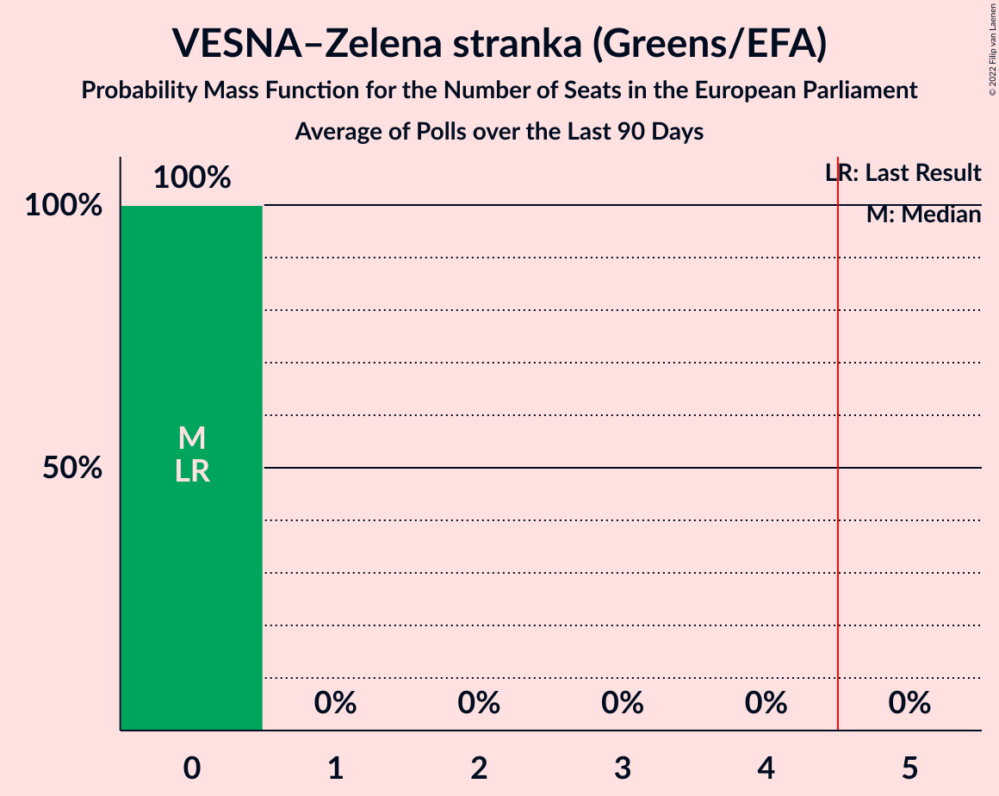

# VESNA–Zelena stranka (Greens/EFA)

<a href="#voting-intentions">Voting Intentions</a> | <a href="#seats">Seats</a>

## Voting Intentions

Last result: **0.0%** (General Election of 9 June 2024)

### Confidence Intervals

| Period     | Polling firm/Commissioner(s) | Median | 80% Confidence Interval | 90% Confidence Interval | 95% Confidence Interval | 99% Confidence Interval |
|:----------:|:----------------:|:-----------:|:-----------------------:|:-----------------------:|:-----------------------:|:-----------------------:|
| N/A | [Poll Average](average.html) | 3.3% | 2.2–4.7% | 2.0–5.2% | 1.8–5.6% | 1.5–6.4% |
| [14–16 April 2025](2025-04-16-Ninamedia.html) | Ninamedia   Dnevnik | 3.0% | 2.3–4.2% | 2.1–4.6% | 1.9–4.9% | 1.6–5.5% |
| [7–10 April 2025](2025-04-10-Parsifal.html) | Parsifal   Nova24TV | 2.6% | 1.9–3.7% | 1.8–4.0% | 1.6–4.3% | 1.3–4.8% |
| [31 March–4 April 2025](2025-04-04-Mediana.html) | Mediana   Delo | 4.0% | 3.0–5.4% | 2.8–5.8% | 2.6–6.1% | 2.2–6.9% |
| [17–21 March 2025](2025-03-21-Mediana.html) | Mediana   POP TV | 2.0% | 1.4–3.1% | 1.3–3.4% | 1.1–3.7% | 0.9–4.3% |
| [10–12 March 2025](2025-03-12-Ninamedia.html) | Ninamedia   Dnevnik | 4.0% | 3.1–5.4% | 2.9–5.8% | 2.6–6.2% | 2.3–6.9% |
| [3–6 March 2025](2025-03-06-Mediana.html) | Mediana   Delo | 3.0% | 2.2–4.2% | 2.0–4.6% | 1.8–4.9% | 1.5–5.6% |
| [17–20 February 2025](2025-02-20-Mediana.html) | Mediana   POP TV | 4.7% | 3.7–6.2% | 3.4–6.6% | 3.2–7.0% | 2.7–7.8% |
| [10–12 February 2025](2025-02-12-Ninamedia.html) | Ninamedia   Dnevnik | 4.4% | 3.4–5.8% | 3.2–6.2% | 2.9–6.6% | 2.5–7.3% |
| [3–6 February 2025](2025-02-06-Mediana.html) | Mediana   Delo | 3.6% | 2.7–5.0% | 2.5–5.4% | 2.3–5.7% | 1.9–6.5% |
| [21–23 January 2025](2025-01-23-Mediana.html) | Mediana   POP TV | 5.0% | 3.9–6.5% | 3.6–7.0% | 3.3–7.3% | 2.9–8.2% |
| [13–15 January 2025](2025-01-15-Ninamedia.html) | Ninamedia   Dnevnik | 4.1% | 3.3–5.3% | 3.1–5.6% | 2.9–5.9% | 2.5–6.5% |
| [6–9 January 2025](2025-01-09-Mediana.html) | Mediana   Delo | 3.3% | 2.6–4.3% | 2.4–4.6% | 2.2–4.9% | 1.9–5.4% |
| [16–19 December 2024](2024-12-19-Mediana.html) | Mediana   POP TV | 1.6% | 1.2–2.4% | 1.1–2.7% | 0.9–2.9% | 0.8–3.3% |
| [9–11 December 2024](2024-12-11-Ninamedia.html) | Ninamedia   Dnevnik | 4.7% | 3.8–5.9% | 3.6–6.2% | 3.4–6.6% | 3.0–7.2% |
| [2–5 December 2024](2024-12-05-Mediana.html) | Mediana   Delo | 6.8% | 5.7–8.1% | 5.4–8.5% | 5.2–8.8% | 4.7–9.5% |
| [18–21 November 2024](2024-11-21-Mediana.html) | Mediana   POP TV | 5.2% | 4.3–6.4% | 4.0–6.7% | 3.8–7.0% | 3.4–7.6% |
| [11–13 November 2024](2024-11-13-Ninamedia.html) | Ninamedia   Dnevnik | 4.9% | 4.0–6.1% | 3.7–6.4% | 3.5–6.7% | 3.1–7.3% |
| [4–7 November 2024](2024-11-07-Mediana.html) | Mediana   Delo | 6.0% | N/A | N/A | N/A | N/A |
| [21–24 October 2024](2024-10-24-Mediana.html) | Mediana   POP TV | 5.2% | N/A | N/A | N/A | N/A |
| [14–16 October 2024](2024-10-16-Ninamedia.html) | Ninamedia   Dnevnik | 4.4% | N/A | N/A | N/A | N/A |
| [30 September–3 October 2024](2024-10-03-Mediana.html) | Mediana   Delo | 4.6% | N/A | N/A | N/A | N/A |
| [16–19 September 2024](2024-09-19-Mediana.html) | Mediana   POP TV | 4.4% | N/A | N/A | N/A | N/A |
| [9–11 September 2024](2024-09-11-Ninamedia.html) | Ninamedia   Dnevnik | 4.7% | N/A | N/A | N/A | N/A |
| [2–5 September 2024](2024-09-05-Mediana.html) | Mediana   Delo | 3.5% | N/A | N/A | N/A | N/A |
| [20–22 August 2024](2024-08-22-Mediana.html) | Mediana   POP TV | 6.3% | N/A | N/A | N/A | N/A |
| [12–14 August 2024](2024-08-14-Ninamedia.html) | Ninamedia   Dnevnik | 0.0% | N/A | N/A | N/A | N/A |
| [5–8 August 2024](2024-08-08-Mediana.html) | Mediana   Delo | 5.4% | N/A | N/A | N/A | N/A |
| [22–25 July 2024](2024-07-25-Mediana.html) | Mediana   POP TV | 5.6% | N/A | N/A | N/A | N/A |
| [15–17 July 2024](2024-07-17-Ninamedia.html) | Ninamedia   Dnevnik | 0.0% | N/A | N/A | N/A | N/A |
| [2–4 July 2024](2024-07-04-Mediana.html) | Mediana   Delo | 7.0% | N/A | N/A | N/A | N/A |
| [18–20 June 2024](2024-06-20-Mediana.html) | Mediana   POP TV | 5.7% | N/A | N/A | N/A | N/A |
| [17–19 June 2024](2024-06-19-Ninamedia.html) | Ninamedia   Dnevnik | 3.6% | N/A | N/A | N/A | N/A |

### Probability Mass Function

The following table shows the probability mass function per percentage block of voting intentions for the [poll average](average.html) for VESNA–Zelena stranka (Greens/EFA).

| Voting Intentions | Probability | Accumulated | Special Marks |
|:-----------------:|:-----------:|:-----------:|:-------------:|
| 0.0–0.5% | 0% | 100% | Last Result |
| 0.5–1.5% | 0.8% | 100% |  |
| 1.5–2.5% | 20% | 99.2% |  |
| 2.5–3.5% | 40% | 80% | Median |
| 3.5–4.5% | 27% | 39% |  |
| 4.5–5.5% | 10% | 12% |  |
| 5.5–6.5% | 2% | 3% |  |
| 6.5–7.5% | 0.3% | 0.3% |  |
| 7.5–8.5% | 0% | 0% |  |

## Seats

Last result: **0** seats (General Election of 9 June 2024)

### Confidence Intervals

| Period     | Polling firm/Commissioner(s) | Median | 80% Confidence Interval | 90% Confidence Interval | 95% Confidence Interval | 99% Confidence Interval |
|:----------:|:----------------:|:------:|:-----------------------:|:-----------------------:|:-----------------------:|:-----------------------:|
| N/A | [Poll Average](average.html) | 0 | 0 | 0 | 0 | 0 |
| [14–16 April 2025](2025-04-16-Ninamedia.html) | Ninamedia   Dnevnik | 0 | 0 | 0 | 0 | 0 |
| [7–10 April 2025](2025-04-10-Parsifal.html) | Parsifal   Nova24TV | 0 | 0 | 0 | 0 | 0 |
| [31 March–4 April 2025](2025-04-04-Mediana.html) | Mediana   Delo | 0 | 0 | 0 | 0 | 0 |
| [17–21 March 2025](2025-03-21-Mediana.html) | Mediana   POP TV | 0 | 0 | 0 | 0 | 0 |
| [10–12 March 2025](2025-03-12-Ninamedia.html) | Ninamedia   Dnevnik | 0 | 0 | 0 | 0 | 0 |
| [3–6 March 2025](2025-03-06-Mediana.html) | Mediana   Delo | 0 | 0 | 0 | 0 | 0 |
| [17–20 February 2025](2025-02-20-Mediana.html) | Mediana   POP TV | 0 | 0 | 0 | 0–1 | 0–1 |
| [10–12 February 2025](2025-02-12-Ninamedia.html) | Ninamedia   Dnevnik | 0 | 0 | 0 | 0 | 0 |
| [3–6 February 2025](2025-02-06-Mediana.html) | Mediana   Delo | 0 | 0 | 0 | 0 | 0 |
| [21–23 January 2025](2025-01-23-Mediana.html) | Mediana   POP TV | 0 | 0 | 0–1 | 0–1 | 0–1 |
| [13–15 January 2025](2025-01-15-Ninamedia.html) | Ninamedia   Dnevnik | 0 | 0 | 0 | 0 | 0 |
| [6–9 January 2025](2025-01-09-Mediana.html) | Mediana   Delo | 0 | 0 | 0 | 0 | 0 |
| [16–19 December 2024](2024-12-19-Mediana.html) | Mediana   POP TV | 0 | 0 | 0 | 0 | 0 |
| [9–11 December 2024](2024-12-11-Ninamedia.html) | Ninamedia   Dnevnik | 0 | 0 | 0 | 0 | 0 |
| [2–5 December 2024](2024-12-05-Mediana.html) | Mediana   Delo | 1 | 0–1 | 0–1 | 0–1 | 0–1 |
| [18–21 November 2024](2024-11-21-Mediana.html) | Mediana   POP TV | 0 | 0–1 | 0–1 | 0–1 | 0–1 |
| [11–13 November 2024](2024-11-13-Ninamedia.html) | Ninamedia   Dnevnik | 0 | 0 | 0 | 0 | 0 |
| [4–7 November 2024](2024-11-07-Mediana.html) | Mediana   Delo |  |  |  |  |  |
| [21–24 October 2024](2024-10-24-Mediana.html) | Mediana   POP TV |  |  |  |  |  |
| [14–16 October 2024](2024-10-16-Ninamedia.html) | Ninamedia   Dnevnik |  |  |  |  |  |
| [30 September–3 October 2024](2024-10-03-Mediana.html) | Mediana   Delo |  |  |  |  |  |
| [16–19 September 2024](2024-09-19-Mediana.html) | Mediana   POP TV |  |  |  |  |  |
| [9–11 September 2024](2024-09-11-Ninamedia.html) | Ninamedia   Dnevnik |  |  |  |  |  |
| [2–5 September 2024](2024-09-05-Mediana.html) | Mediana   Delo |  |  |  |  |  |
| [20–22 August 2024](2024-08-22-Mediana.html) | Mediana   POP TV |  |  |  |  |  |
| [12–14 August 2024](2024-08-14-Ninamedia.html) | Ninamedia   Dnevnik |  |  |  |  |  |
| [5–8 August 2024](2024-08-08-Mediana.html) | Mediana   Delo |  |  |  |  |  |
| [22–25 July 2024](2024-07-25-Mediana.html) | Mediana   POP TV |  |  |  |  |  |
| [15–17 July 2024](2024-07-17-Ninamedia.html) | Ninamedia   Dnevnik |  |  |  |  |  |
| [2–4 July 2024](2024-07-04-Mediana.html) | Mediana   Delo |  |  |  |  |  |
| [18–20 June 2024](2024-06-20-Mediana.html) | Mediana   POP TV |  |  |  |  |  |
| [17–19 June 2024](2024-06-19-Ninamedia.html) | Ninamedia   Dnevnik |  |  |  |  |  |

### Probability Mass Function

The following table shows the probability mass function per seat for the [poll average](average.html) for VESNA–Zelena stranka (Greens/EFA).

| Number of Seats | Probability | Accumulated | Special Marks |
|:---------------:|:-----------:|:-----------:|:-------------:|
| 0 | 99.9% | 100% | Last Result, Median |
| 1 | 0.1% | 0.1% |  |
| 2 | 0% | 0% |  |

